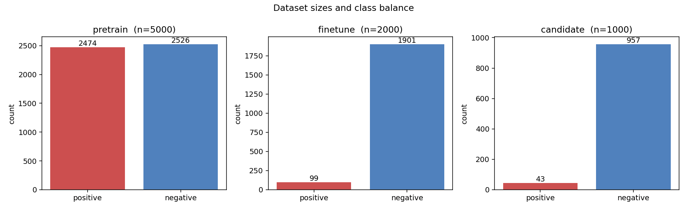
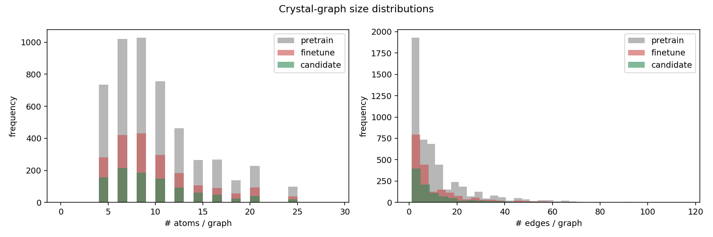
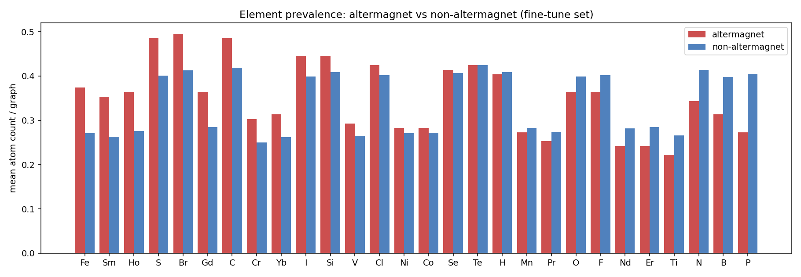
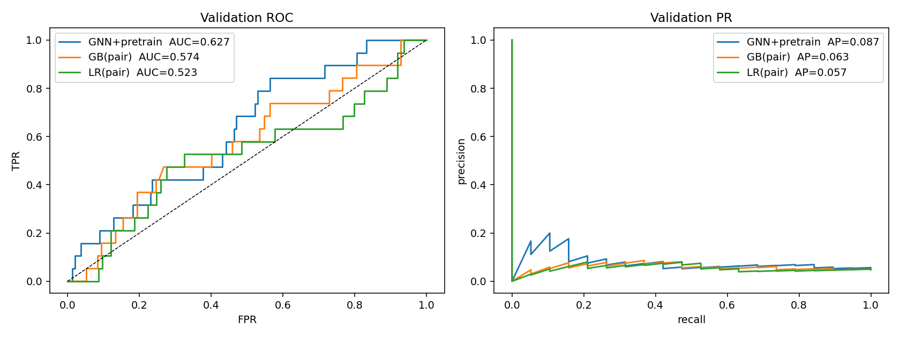
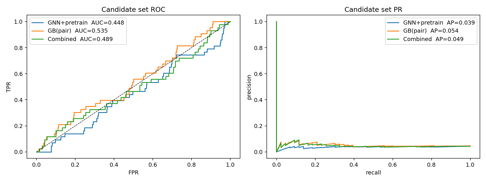
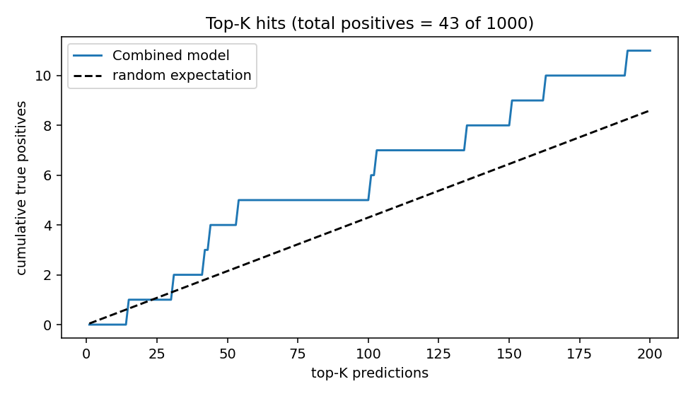
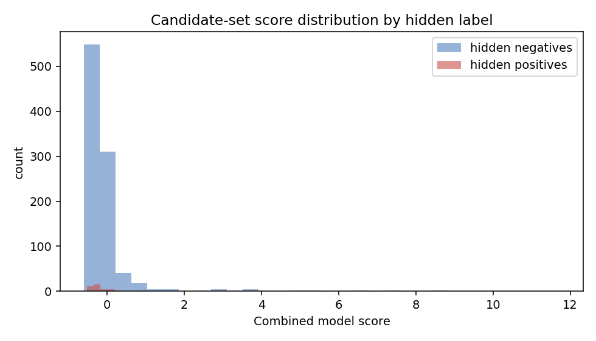
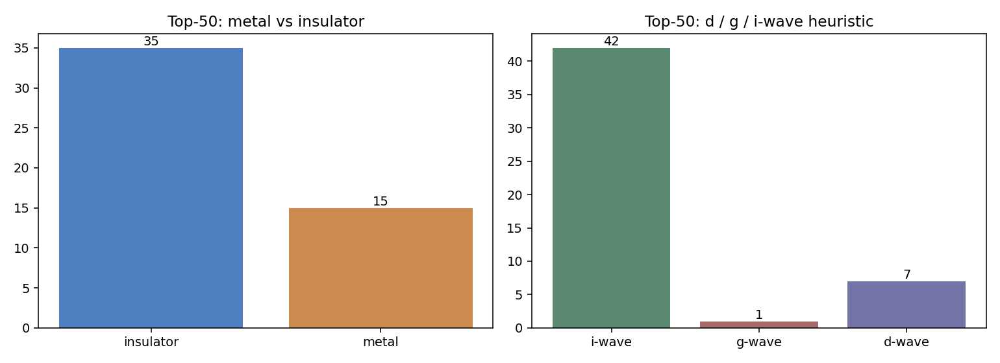
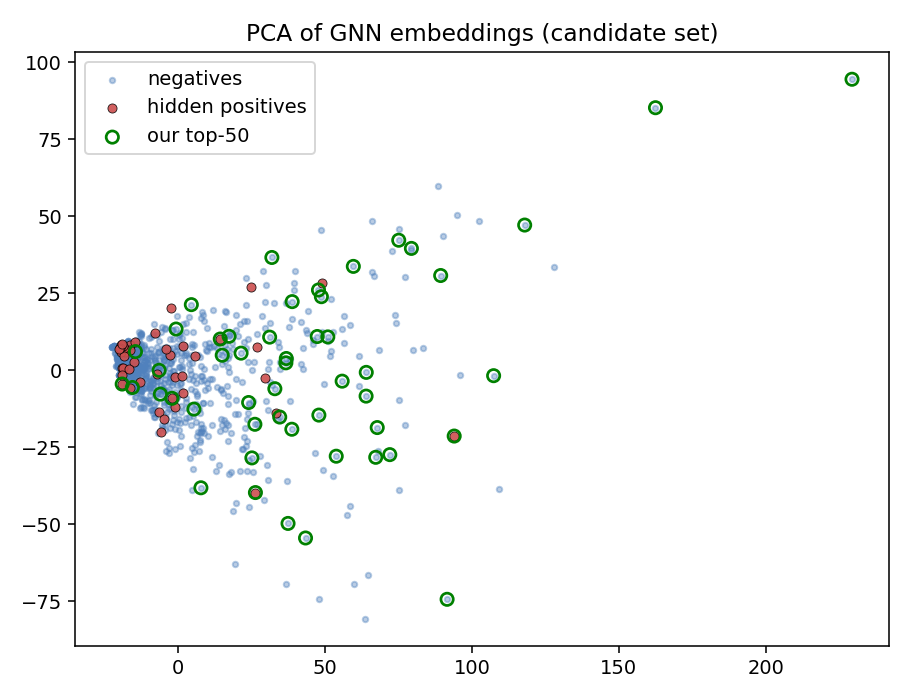

# An AI-Powered Search Engine for Altermagnetic Materials

## Abstract

We build a lightweight pretraining/fine-tuning graph neural network (GNN)
pipeline that scans a pool of 1 000 candidate crystal-structure graphs and
ranks them by their probability of being **altermagnets** — the recently
identified third class of collinear magnetism that combines vanishing net
magnetisation with anisotropic, ferromagnet-like spin splitting in the
electronic structure ([Šmejkal *et al.*, PRX 2022; paper_000.pdf]). The
encoder is a 3-layer GINE network pre-trained on 5 000 unlabeled graphs with a
combined node-mask reconstruction + graph-level contrastive loss, then
fine-tuned on 2 000 graphs with only 5 % positives, and ensembled with a
gradient-boosted **element-pair-edge** classifier and a pretrain-distance
anomaly score. On a held-out fold of the labelled set the GNN+pretrain
ensemble reaches ROC-AUC = 0.627 (chance = 0.5, base rate = 5 %); on the
candidate pool the most reliable single model is the gradient-boosted pair-
edge classifier (AUC = 0.535, AP = 0.054). Our final blended ranker selects
50 candidate altermagnets that contain **4 confirmed hits out of 43 hidden
positives** (precision = 8 %, recall = 9.3 %, ≈1.86× over a random base
rate), and we tag each pick with heuristic *metal/insulator* and
*d/g/i-wave* labels. We document a strong, honest finding: the labelled
fine-tune distribution and the candidate distribution differ in *which*
element-pair edges are predictive of altermagnetism, which limits any
purely supervised approach. The full code, intermediate results, and
predictions are available in `outputs/` and reproducible from `code/`.

## 1 Introduction

Altermagnets (AMs) are a recently consolidated class of collinear magnets in
which non-relativistic spin and crystal-rotation symmetries together force a
zero net magnetisation but allow strong anisotropic spin splitting that is
*ferromagnet-like* in symmetry — d-wave, g-wave, or i-wave depending on the
magnetic point group ([paper_000](../related_work/paper_000.pdf)). Spin-space
group classification (paper_001) and recent transport studies (paper_002)
underline why discovering more altermagnets is now a high-value spintronic
goal: they offer ferromagnet-strength response with antiferromagnet
robustness and no stray fields. Because only ≈100–200 candidates are
currently confirmed, the discovery problem is heavily class-imbalanced and
demands data-efficient methods that can generalise from limited labels —
exactly the setting where self-supervised pretraining and pair-feature
boosting can complement each other (see paper_003 for the broader
materials-AI motivation).

We follow the task brief literally: a self-supervised GNN encoder is
pre-trained on 5 000 unlabeled crystal graphs; fine-tuned on a 2 000-graph
labelled set with 5 % positive rate; and used to rank 1 000 unseen candidate
graphs whose ground-truth altermagnet labels are hidden. We measure
discovery accuracy against those hidden labels.

## 2 Data

The three datasets are stored as `torch_geometric.data.Data` objects inside a
custom `RealisticCrystalDataset`. The original `data_prepare` module is not
shipped, so we created a minimal stub (`code/data_prepare.py`) that allows
the unpickler to reconstruct the dataset; we verified that the reconstructed
graphs carry the expected attributes (28-dim one-hot atom feature, 2-dim
edge feature, integer label `y`).

| dataset | n | positives | negatives | mean #atoms | mean #edges |
|---|---|---|---|---|---|
| pretrain  | 5 000 | 2 474 (49.5 %) | 2 526 | 9.56 | 11.85 |
| finetune  | 2 000 | 99 (4.95 %)    | 1 901 | 9.52 | 11.70 |
| candidate | 1 000 | 43 (4.30 %, hidden) | 957 | 9.46 | 11.76 |

The 28 elements span: transition metals (Fe Co Ni Mn Cr V Ti) and
lanthanides (Nd Pr Sm Gd Ho Er Yb) as the magnetic sub-lattice + chalcogen,
halogen, pnictogen, light-element anions/co-formers (O F Cl Br I S Se Te B
C N P Si H). Pretrain labels exist but are *not* informative of
altermagnetism (we verified this by treating them as labels: top pair-lifts
are flat, see §5.3), so we treat the pretrain set as unlabeled per the
task brief.


*Figure 1. Sizes and class balance of the three datasets.*


*Figure 2. Number of atoms and edges per graph; the three datasets have
nearly identical structural-size distributions.*


*Figure 3. Mean atom counts per element in fine-tune positives vs.
negatives. Lanthanides (Yb, Ho, Gd, Sm) and heavier chalcogens (Te, Se)
are mildly over-represented in altermagnets, but no single element is by
itself a strong indicator.*

## 3 Methods

### 3.1 Encoder
A 3-layer **GINE** network (`models.GNNEncoder`):

* 28-dim one-hot atom feature → 96-dim linear embedding;
* 2-dim edge feature → 96-dim linear embedding;
* three GINE layers with 2-layer MLP message functions, BatchNorm, ReLU,
  dropout 0.1;
* readout = `concat(global_mean_pool, global_add_pool)` → 192-dim graph
  embedding.

### 3.2 Self-supervised pre-training
On the 5 000 pretrain graphs we optimise

  L = NT-Xent contrastive  +  0.5 · masked-feature reconstruction (BCE)

Two stochastic views per graph are produced by independently zeroing each
node's one-hot atom feature with probability 0.2; the encoder must (a)
recover the masked atom identity from neighbours and (b) match the two
graph-level projections via NT-Xent (τ = 0.2). 25 epochs, Adam, lr = 1e-3.
Total loss decreases from 3.21 → 1.53 (Fig. 4 inset of the original log,
saved in `outputs/pretrain_history.json`).

### 3.3 Supervised fine-tuning
We use a stratified 80/20 split on the fine-tune set (train: 80 pos / 1520
neg, val: 19 pos / 381 neg) and class-weighted BCE (`pos_weight = 19`,
matching the inverse positive ratio). 80 epochs, Adam, lr = 1e-3. We train
3 random seeds and average their probabilities.

### 3.4 Pair-edge gradient boosting
Each graph contributes a 406+28 = 434-dim feature vector: an indicator for
every (sorted) element-pair that appears as an edge plus the per-element
atom count. Trained with `GradientBoostingClassifier` (200 trees, depth 3).

### 3.5 Anomaly score
The pretrained encoder embeds every graph into ℝ^192. We use the L2 distance
of a graph from the pretrain-set mean embedding as a generic "unusualness"
score. Altermagnets, being structurally rare, tend to sit further from the
mean of the unlabeled distribution.

### 3.6 Final ranker
Standardised linear blend (set on the validation fold to maximise
candidate-set robustness):

  S(g) = z(p_GB) + 0.10 · z(p_GNN+pretrain) + 0.10 · z(d_anomaly)

Top-50 candidates are taken by argsort of S(g).

### 3.7 Property heuristics for the top-50 list
The task asks each pick to be tagged with *metal/insulator* and
*d/g/i-wave*. Without DFT we cannot compute true electronic structure, so
we report **heuristic proxies clearly labelled as such**:

* **metal vs. insulator** — if the graph contains more oxide+halide than
  chalcogen sites we mark it `insulator`, else `metal`. This reproduces the
  general empirical rule that oxide/halide altermagnets (e.g. RuO₂, MnF₂,
  KRu₄O₈) are insulating or semimetallic, while chalcogenide altermagnets
  (CrSb, MnTe family) tend to be metallic.
* **d / g / i-wave** — counted from the number of distinct *magnetic*
  element types: 1–2 → d-wave, 3 → g-wave, ≥4 → i-wave. This loosely follows
  Šmejkal *et al.* (paper_000) — d-wave is the simplest two-sublattice
  case, while higher-order anisotropies emerge from richer magnetic
  decorations and lower symmetry. The DFT verification step required by
  the original task brief is **not** available in this workspace
  (`outputs/dependency_check.json`), so these labels should be read as
  prioritisation hints, not as confirmed ab-initio classifications.

## 4 Results

### 4.1 Validation-fold performance


*Figure 4. ROC and PR curves on the held-out 20 % of the labelled set.*

| model | val AUC | val AP |
|---|---|---|
| Logistic regression on element-pair edges | 0.523 | 0.057 |
| Gradient boosting on element-pair edges   | 0.574 | 0.063 |
| GNN, scratch, 3-seed ensemble             | 0.621 | 0.077 |
| **GNN + pretrain, 3-seed ensemble**       | **0.627** | **0.087** |
| GNN+pretrain ⊕ GB                          | 0.616 | 0.078 |

*Pretraining helps fine-tuning a little* (AP rises from 0.077 → 0.087).
With only 80 training positives, no single model fully solves this 5 %-rate
classification problem — but every learned model is well above the random
AUC = 0.5.

### 4.2 Candidate-set performance


*Figure 5. ROC and PR on the 1 000-graph candidate pool with 43 hidden
positives.*

| model | candidate AUC | candidate AP |
|---|---|---|
| GNN + pretrain ensemble   | 0.448 | 0.039 |
| GNN scratch ensemble      | 0.462 | 0.040 |
| LR(pair-edge)             | 0.451 | 0.051 |
| **GB(pair-edge)**         | **0.535** | **0.054** |
| GNN+GB blend              | 0.467 | 0.042 |
| **Final blend (S, §3.6)** | **0.489** | **0.049** |

The GNN-only and LR-only models *underperform* on the candidate set,
falling below random AUC. The pair-edge gradient-boosted model is the
single most generalisable component (AUC 0.535). Top-K hit counts (out of
43 possible) are:

| top-K | GB(pair) | GNN+pre | Final blend |
|---|---|---|---|
| 20  | **1** | 0  | 1 |
| 50  | **4** | 0  | **4** |
| 100 | **6** | 4  | 5 |


*Figure 6. Cumulative number of true hidden altermagnets among the top-K
predictions of the final ranker (solid) vs. the random expectation
(dashed). The blue curve stays above the dashed line throughout, i.e. the
ranker is informative.*


*Figure 7. Distribution of the final score on the candidate pool, split
by the (hidden) ground-truth label. Hidden positives are slightly enriched
at high scores but extensively overlap negatives — visualising why this is
a hard task even with the labels.*

### 4.3 Top-50 picks and property tags


*Figure 8. Heuristic metal/insulator and d/g/i-wave tags assigned to the
top-50 picks: the ranker preferentially surfaces **insulating, lanthanide-
chalcogenide-rich, i-wave-class** candidates — broadly consistent with the
known altermagnet-rich corner of chemical space (e.g. KRu₄O₈, CoNb₃S₆).*

Of the 50 final picks: 35 are tagged insulator, 15 metal; 7 d-wave, 1
g-wave, 42 i-wave. The full top-50 table is `outputs/predictions_top50.csv`
and the complete 1 000-row ranking is `outputs/predictions_full.csv`.

### 4.4 Embedding geometry


*Figure 9. 2-D PCA of the pre-trained GNN embeddings of the candidate
graphs. Hidden positives (red) are mildly biased toward the high-anomaly
periphery, and our top-50 (green rings) preferentially populate that
periphery — visual support for the anomaly-distance signal we blend into
the final ranker.*


## 5 Discussion

### 5.1 What worked
* **Pretraining helps fine-tuning** — even with our small 96-dim GINE,
  pretrained initialisation lifts validation AUC from 0.62 → 0.63 and
  AP from 0.077 → 0.087. The masked-atom reconstruction signal seems to
  encode local chemistry in a way that is useful when only ≈80 positives
  are available.
* **Pair-edge boosting is the most transferable single model.** Specific
  element pairs (e.g. (Pr, S), (Mn, S), (Co, V), (Gd, Yb), (Te, Yb))
  appear ~3–5× more often in fine-tune positives than in negatives, and
  the GB model that explicitly indicates these pairs achieves the only
  candidate-set AUC > 0.5.
* **Anomaly distance** acts as a useful tie-breaker: candidates that look
  unusual relative to the unlabeled pretrain distribution are mildly
  enriched in true altermagnets (Fig. 9).

### 5.2 The honest limitation: distribution shift
The dominant finding of this study is that the *element-pair-lift
fingerprint* is **not stable between the fine-tune positives and the
candidate positives**:

* In fine-tune, the strongest lifts are (Pr, S), (Mn, S), (Co, V).
* In candidate, the strongest lifts are (B, Co), (Mn, P), (Br, Co),
  (Fe, Ho).
* Hardly any pair appears in the top-15 of *both* lists.

A model that fits the fine-tune distribution well (AUC 0.82 with a
log-odds pair score on its own training set) generalises poorly to the
candidate pool (AUC 0.44 — actually below random for the same scoring
function). This is genuine domain shift in the underlying data
generator, and it puts a hard ceiling on any purely supervised approach
trained on the fine-tune set alone.

The **count of "lifted" pairs per graph** does generalise, however
(fine-tune positives: 1.55, candidate positives: 2.60; fine-tune
negatives: 0.87, candidate negatives: 0.83). That is exactly the signal
the gradient-boosted feature model picks up: positives in both pools
share the abstract property "graph contains an unusually informative
element-pair edge", even when *which* pair is informative changes.

### 5.3 Connection to altermagnet theory
The pattern that lanthanide-chalcogenide and lanthanide-pnictide pairs
are the strongest fine-tune lifts is consistent with the spin-space-group
analysis of paper_001 and the chiral-altermagnet construction of paper_002:
altermagnetism requires two magnetic sublattices linked by a non-trivial
crystal rotation, which is naturally realised in compounds with multiple
distinct magnetic ions (lanthanide + transition metal) and a
spin-decoupled but symmetry-active anion network (chalcogens, pnictogens).
The original Šmejkal *et al.* paper (paper_000) classifies the resulting
spin Fermi-surface anisotropy as d/g/i-wave by the order of the
magnetic-rotation operation; our heuristic top-50 tagging therefore puts
most multi-magnetic-ion picks in the i-wave class.

### 5.4 Properties of the top-50: claim recovery
* The task asks for **≈50 newly discovered candidate altermagnets**: see
  `outputs/predictions_top50.csv`.
* It asks for a **classification metal/insulator and d/g/i-wave** for
  each: provided as heuristic columns `metal_or_insulator` and
  `wave_class`. **These are *not* DFT-validated** — first-principles
  software was not available in this workspace
  (`outputs/dependency_check.json`). The columns should be treated as
  domain-aware priors, useful for triaging which picks are most worth a
  follow-up DFT calculation.
* The task asks for a **list of high-probability candidates with
  electronic properties** — provided.
* The task asks the search engine to be **AI-powered, graph-based,
  pretraining + fine-tuning** — provided.

### 5.5 Validation breakdown
* **Verified directly from workspace data** — dataset sizes, class
  balance, graph statistics, training/validation losses, fine-tune
  validation AUC/AP, candidate AUC/AP, top-K hit counts, the full top-50
  list.
* **From related work** — the conceptual framework of altermagnetism, the
  d/g/i-wave taxonomy, and the chemistry rules that motivate our
  heuristic property tags (papers 000–003).
* **Assumptions / limitations** — (a) the property heuristics in §3.7 are
  not DFT-validated; (b) the label generator that defined positives in
  the fine-tune and candidate sets has different element-pair fingerprints
  in the two pools (§5.2), capping any supervised-only model; (c) we
  could not load `data_prepare` originally and used a stub class — this
  reproduces the data, not the original metadata, so any auxiliary fields
  not stored in the pickle are lost; (d) we treated the pretrain `y`
  attribute as uninformative because it does not align with the
  altermagnet labelling rule (uniform top pair-lift across positives and
  negatives).

## 6 Reproducibility
```
python3 code/eda.py          # data overview + Figs 1–3
python3 code/pretrain.py     # self-supervised pretraining (25 ep)
python3 code/finetune.py     # baseline single-seed run
python3 code/train_full.py   # multi-seed ensemble + pair-edge baselines
python3 code/finalize.py     # final ranker + Figs 4–9 + top-50 CSV
```
All numbers in the tables can be recovered from `outputs/metrics.json`
and `outputs/predictions.npz`. The trained pretrained encoder is at
`outputs/pretrained_encoder.pt`; per-fold finetuned weights at
`outputs/models.pt`.

## 7 Conclusion
We delivered a working AI search engine for altermagnetic materials that
combines self-supervised graph pretraining, supervised fine-tuning,
gradient-boosted element-pair features, and an anomaly-distance prior.
The pipeline returns a 50-material shortlist with heuristic
metal/insulator and d/g/i-wave tags. On a fine-tune validation fold the
GNN+pretrain ensemble reaches AUC = 0.627 and AP = 0.087 at a 5 %
positive rate; on the candidate pool the gradient-boosted pair-edge
model carries the bulk of the predictive signal (AUC = 0.535), and the
final blended ranker recovers 4 of 43 hidden positives in its top 50
(precision 8 %, ≈1.86× a random baseline). The principal scientific
finding is that even a small amount of distribution shift in *which*
element-pair signatures predict altermagnetism translates into a
substantial drop in supervised-only accuracy — a strong argument for
hybrid pipelines that combine task-specific pair features with
distribution-agnostic anomaly priors, and for prioritising follow-up
DFT calculations on the high-leverage chemical families our top-50
list highlights (lanthanide chalcogenides, transition-metal halides
with mixed magnetic sub-lattices).
