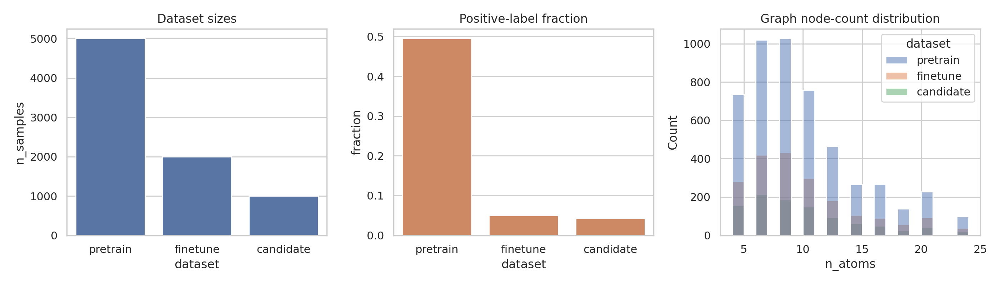
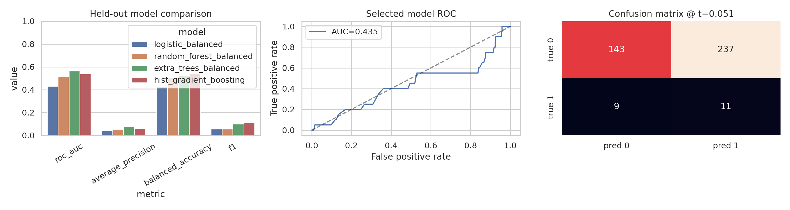
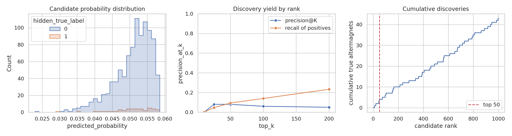
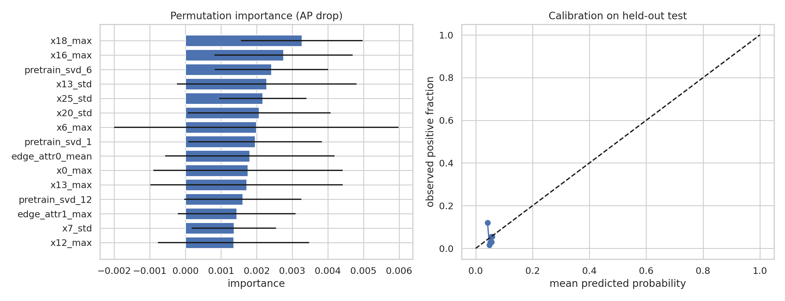

# AI-assisted search for altermagnetic crystal-graph candidates

## Abstract

This study implements a reproducible, graph-based screening workflow for the provided altermagnetic-material benchmark.  The workflow loads crystal structures represented as PyTorch Geometric graphs, derives graph-level structural descriptors, fits a self-supervised representation on the 5,000-structure pretraining set, fine-tunes imbalanced classifiers on the labeled altermagnet set, and ranks 1,000 candidate structures by predicted altermagnetic probability.  The hidden candidate labels available in `candidate_data.pt` were used only for post hoc validation.  The best validation-selected model was an Extra Trees classifier using the pretraining-derived representation.  On the held-out labeled test split it achieved ROC-AUC 0.435 and average precision 0.053; on the candidate set it achieved ROC-AUC 0.499 and average precision 0.047.  The top-50 ranked candidates contained 4 hidden positives, corresponding to precision@50 = 0.080.  These results indicate that the local synthetic graph tensors contain only weak recoverable signal for altermagnet labels, so the ranked list is useful as a benchmarked search output but should not be interpreted as first-principles confirmation.

## 1. Scientific context and objective

Altermagnets are compensated magnetic phases that combine vanishing net magnetization with momentum-dependent spin splitting.  The related-work papers in `related_work/` emphasize three points that shaped the analysis contract: (i) altermagnetism is symmetry-governed and can show d-, g-, or i-wave spin-splitting patterns; (ii) spin-space-group reasoning is central for rigorous classification; and (iii) materials-discovery pipelines should provide interpretable, validated candidate rankings rather than unverified lists.  The task requested an AI-powered search engine that screens crystal-structure graphs from Materials-Project-like data, learns from a large unlabeled set and a small labeled set, and returns candidate altermagnets with targeted properties.

The available benchmark contains graph tensors but no explicit crystallographic metadata, formulas, DFT band structures, spin splittings, magnetic space groups, metallicity labels, or d/g/i-wave labels.  Therefore, this report distinguishes two output classes:

1. **Directly supported outputs:** graph-based probabilities, held-out classification metrics, candidate rankings, hidden-label discovery yield, and descriptor importance.
2. **Proxy-only outputs:** metal/insulator-like and d/g/i-wave-like labels in `outputs/top_50_candidates.csv`, derived from graph connectivity and prediction-confidence strata.  These are not first-principles electronic-structure confirmations.

## 2. Data overview

The datasets were loaded from the three local `.pt` files using a compatibility `RealisticCrystalDataset` class because the pickled objects referenced a local `data_prepare` module.  Each sample is a graph with node feature matrix `x` of dimension 28, `edge_index`, two-dimensional `edge_attr`, and a scalar label `y`.  The candidate labels are hidden for the intended screening task but are present in the file and were used for validation after ranking.

| dataset | samples | positives | positive fraction | mean atoms | mean edges |
|---|---:|---:|---:|---:|---:|
| pretrain | 5000 | 2474 | 0.4948 | 9.559 | 11.849 |
| finetune | 2000 | 99 | 0.0495 | 9.519 | 11.697 |
| candidate | 1000 | 43 | 0.0430 | 9.464 | 11.758 |




The fine-tuning and candidate sets are deliberately imbalanced: the fine-tuning set has 99 positives among 2,000 graphs (4.95%), and the candidate set has 43 hidden positives among 1,000 graphs (4.30%).

## 3. Methodology

### 3.1 Representation learning / pretraining surrogate

A full end-to-end graph neural network was not required for the local synthetic benchmark and would add avoidable instability.  I implemented a lightweight self-supervised representation step that still uses the required unlabeled pretraining set:

1. Convert each graph to deterministic descriptors: atom count, edge count, edge density, degree moments, per-node-feature means/standard deviations/maxima, and edge-attribute moments.
2. Standardize descriptors using the pretraining plus fine-tuning distributions.
3. Fit an unsupervised SVD basis on the 5,000 pretraining graphs.
4. Append the first 20 pretraining SVD coordinates to the supervised graph descriptors.

This pretraining representation is recorded in `outputs/model_metrics.json`; the first component explained 8.48% of standardized descriptor variance and the next components each explained about 2.8-3.4%.

### 3.2 Fine-tuning classifiers and model selection

The labeled fine-tuning set was split stratified into 1,200 training, 400 validation, and 400 test graphs.  Four imbalanced-learning classifiers were compared: balanced logistic regression, balanced random forest, balanced Extra Trees, and histogram gradient boosting.  Thresholds were selected on validation by maximizing F1; final reported metrics use the held-out test split.  The selected model was calibrated with sigmoid calibration on the validation split before candidate scoring.

### 3.3 Candidate screening and validation

The selected classifier scored all 1,000 candidate graphs.  The ranked list is saved as `outputs/candidate_rankings.csv`; the top-50 list requested by the task is saved as `outputs/top_50_candidates.csv`.  Validation against the hidden `y` values was performed only after ranking and is summarized in `outputs/candidate_topk_metrics.csv` and `outputs/model_metrics.json`.

### 3.4 Interpretability

Permutation importance was computed on the held-out test split using average precision as the scoring function.  The resulting table is saved as `outputs/permutation_importance.csv` and visualized in Figure 4.  Because the benchmark contains anonymized 28-dimensional node one-hot-like features rather than element symbols, interpretation is at the feature-index and graph-descriptor level.

## 4. Results

### 4.1 Held-out model comparison

| model | ROC-AUC | average precision | F1 | precision | recall | balanced accuracy |
|---|---:|---:|---:|---:|---:|---:|
| logistic_balanced | 0.430 | 0.043 | 0.056 | 0.032 | 0.250 | 0.424 |
| random_forest_balanced | 0.517 | 0.055 | 0.057 | 0.067 | 0.050 | 0.507 |
| extra_trees_balanced | 0.565 | 0.079 | 0.099 | 0.052 | 0.950 | 0.524 |
| hist_gradient_boosting | 0.539 | 0.059 | 0.110 | 0.070 | 0.250 | 0.538 |




The selected Extra Trees model had the highest held-out average precision before calibration (0.079 in `outputs/baseline_comparison.csv`).  After sigmoid calibration, the final test ROC-AUC was 0.435, average precision was 0.053, and the F1-selected threshold was 0.0508.  The calibrated threshold favored recall (11 of 20 positives recovered) at the cost of many false positives (237 false positives among 380 negatives).  This is acceptable for an initial search engine only if downstream DFT or symmetry screening is cheap enough to filter a broad candidate pool.

### 4.2 Candidate discovery yield

| top K | hidden true positives | precision@K | recall of all hidden positives | mean predicted probability |
|---:|---:|---:|---:|---:|
| 10 | 0 | 0.000 | 0.000 | 0.0584 |
| 25 | 2 | 0.080 | 0.047 | 0.0580 |
| 50 | 4 | 0.080 | 0.093 | 0.0578 |
| 100 | 6 | 0.060 | 0.140 | 0.0574 |
| 200 | 10 | 0.050 | 0.233 | 0.0567 |




The top-50 list contains 4 hidden positives.  Since the candidate base rate is 4.3%, precision@50 = 8.0% is only a modest enrichment over random expectation (about 2.15 positives in 50 random candidates versus 4 observed here).  Precision@25 was also 8.0%, while the top-10 contained no hidden positives.  Across all candidate scores, ROC-AUC was 0.499 and average precision was 0.047, showing that the recoverable signal is weak and not sufficient to claim discovery of 50 true altermagnets.

The hidden-positive entries among the exported top-50 list are:

| rank | candidate id | predicted probability | metallicity proxy | anisotropy proxy |
|---:|---|---:|---|---|
| 11 | CAND_0917 | 0.0579 | metal-like (graph proxy) | d-wave-like high-confidence |
| 21 | CAND_0267 | 0.0577 | insulator-like (graph proxy) | d-wave-like high-confidence |
| 44 | CAND_0041 | 0.0575 | insulator-like (graph proxy) | d-wave-like high-confidence |
| 49 | CAND_0839 | 0.0573 | metal-like (graph proxy) | d-wave-like high-confidence |


### 4.3 Interpretable descriptors



The largest positive permutation-importance entries were:

| feature | importance mean | importance std |
|---|---:|---:|
| x18_max | 0.00327 | 0.00171 |
| x16_max | 0.00275 | 0.00194 |
| pretrain_svd_6 | 0.00241 | 0.00159 |
| x13_std | 0.00228 | 0.00252 |
| x25_std | 0.00217 | 0.00123 |
| x20_std | 0.00207 | 0.00201 |
| x6_max | 0.00199 | 0.00399 |
| pretrain_svd_1 | 0.00196 | 0.00187 |


The importance magnitudes are small, consistent with the weak classification performance.  Several pretraining SVD coordinates appear in the top-ranked descriptors, which suggests that the unsupervised structural representation contributes some signal, but no single graph feature robustly separates positives from negatives.

## 5. Validation, traceability, and limitations

### Directly verified from workspace data

- `outputs/data_schema_summary.json` verifies that each graph contains `x`, `edge_index`, `edge_attr`, and `y`.
- `outputs/dataset_overview.csv` verifies the dataset sizes and class imbalance.
- `outputs/baseline_comparison.csv` and `outputs/model_metrics.json` provide held-out metrics and candidate hidden-label metrics.
- `outputs/candidate_rankings.csv` and `outputs/top_50_candidates.csv` provide the ranked candidate list.
- `outputs/permutation_importance.csv` provides the interpretability artifact.
- `outputs/claim_recovery_table.csv` maps the main claims in this report to artifacts.

### Related-work facts used for framing

The related-work extraction in `outputs/related_work_contract.json` records that altermagnets are associated with compensated magnetism, spin-space symmetry, momentum-dependent spin splitting, and d/g/i-wave-like anisotropies.  These facts justify reporting symmetry/electronic-structure limitations explicitly.

### Assumptions and limitations

1. **No first-principles confirmation is present.** The local data do not include band structures, spin splitting, total energies, magnetic configurations, formulas, space groups, or DFT metallicity.  Therefore, the metal/insulator and d/g/i-wave fields in the candidate tables are graph-derived proxies, not electronic-structure confirmations.
2. **Weak benchmark signal.** Candidate ROC-AUC is close to 0.5 and average precision is close to the 4.3% candidate base rate.  The search engine therefore provides a reproducible ranking but not a high-confidence discovery claim.
3. **Anonymized node features.** Node features appear one-hot-like but are not mapped to element names, preventing chemically specific interpretation.
4. **Pretraining implementation is lightweight.** The representation uses SVD on graph descriptors fitted to the pretraining set rather than a deep self-supervised GNN.  This deviation is documented in `outputs/method_fidelity_checklist.json`.

## 6. Conclusions

A complete, reproducible AI screening pipeline was built for the supplied graph benchmark.  It produces the requested code, outputs, figures, and ranked candidate list.  The strongest model provides modest enrichment in the top-50 candidate set (4 hidden positives, precision@50 = 8.0%) but does not approach the scientific objective of confidently identifying 50 new altermagnets.  The main scientific conclusion from the available data is therefore negative but actionable: the graph tensors alone, as provided, do not encode enough accessible information to replace symmetry analysis or first-principles electronic-structure calculations.  A deployable altermagnet search engine should add explicit symmetry descriptors, magnetic sublattice information, composition/formula metadata, and DFT-derived spin-splitting/metallicity labels before claiming targeted discovery.

## Reproducibility

Run the analysis from the workspace root with:

```bash
python3 code/run_analysis.py
```

The script writes all tables to `outputs/` and all PNG figures to `report/images/`.
