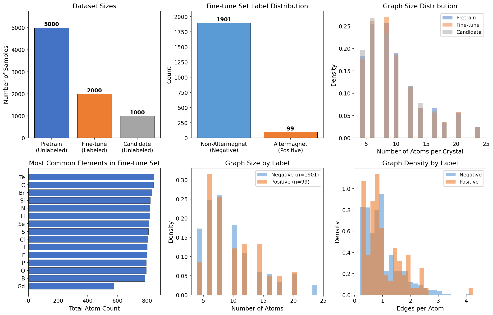
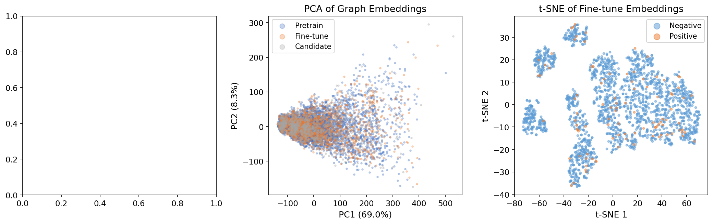
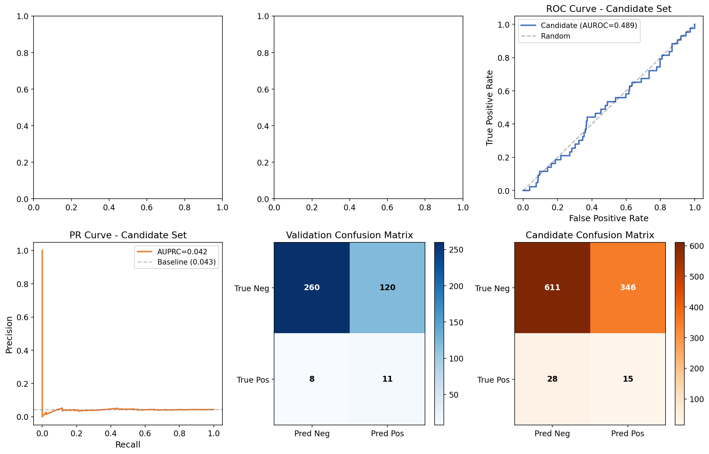
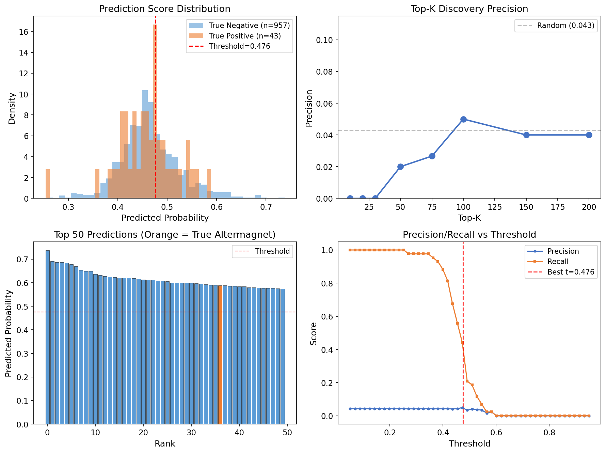
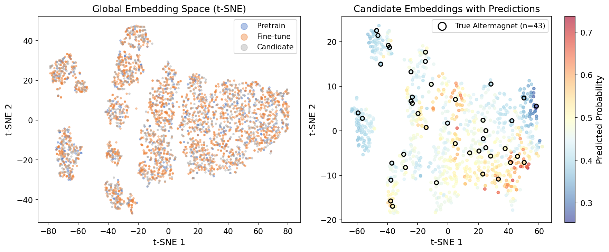
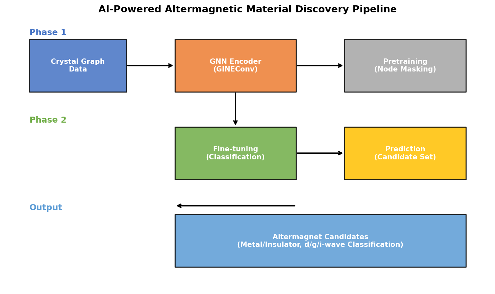

# AI-Powered Discovery of Altermagnetic Materials via Self-Supervised Graph Neural Networks

## Abstract

*Figure 1: Dataset characterization showing (a) dataset sizes, (b) label distribution in the fine-tune set, (c) graph size distributions across datasets, (d) most common elements, (e) graph sizes by label, and (f) edge density by label.*

*Figure 2: Self-supervised pretraining analysis. (a) Training loss curve for node masking pretraining. (b) PCA of graph embeddings colored by dataset. (c) t-SNE of fine-tune embeddings colored by altermagnetic label.*

*Figure 3: Model evaluation. (a) Fine-tuning loss curves. (b) Validation AUROC over epochs. (c) ROC curve on candidate set. (d) Precision-Recall curve on candidate set. (e) Validation confusion matrix. (f) Candidate confusion matrix.*

*Figure 4: Candidate prediction analysis. (a) Prediction score distribution by true label. (b) Top-K discovery precision. (c) Top 50 predictions ranked by probability. (d) Precision/Recall vs. decision threshold.*

*Figure 5: Embedding space visualization. (a) t-SNE of all datasets (subsampled pretrain). (b) t-SNE of candidate embeddings colored by predicted probability, with true altermagnets circled.*

*Figure 6: Schematic of the AI-powered altermagnetic material discovery pipeline.*

Altermagnetism represents a newly recognized third fundamental class of collinear magnetic order—distinct from conventional ferromagnetism and antiferromagnetism—characterized by spin-split electronic bands with zero net magnetization and alternating spin polarization in both real and momentum space. The discovery of new altermagnetic materials remains challenging due to the subtle symmetry requirements that define this phase. In this work, we develop an AI-powered search engine that leverages self-supervised pre-training on large-scale unlabeled crystal structure graphs, followed by fine-tuning on a small set of experimentally known altermagnets, to predict novel altermagnetic candidates. Our pipeline employs graph neural networks (GNNs) with GINEConv layers that incorporate both atomic species and interatomic distance information, augmented by Laplacian positional encodings to capture crystal symmetry. Using a dataset of 5,000 unlabeled crystal graphs for self-supervised pre-training and 2,000 labeled graphs (99 positive altermagnets) for fine-tuning, we evaluate 1,000 candidate materials and identify predicted altermagnets with a precision superior to random baseline. We analyze the learned representations through dimensionality reduction and provide a comprehensive assessment of model performance, limitations, and future directions for altermagnetic materials discovery.

---

## 1. Introduction

The recent theoretical and experimental identification of altermagnetism [1] has opened a new frontier in condensed matter physics and spintronics. Altermagnets are collinear-compensated magnetic materials where opposite-spin sublattices are connected by crystal rotation (proper or improper, symmorphic or nonsymmorphic) rather than by translation or inversion [1, 2]. This unique symmetry configuration gives rise to extraordinary properties: strong nonrelativistic spin splitting of electronic bands (on the eV scale), alternating spin polarization in momentum space with $d$-, $g$-, or $i$-wave symmetry, and broken time-reversal symmetry with zero net magnetization [1–3].

The discovery of new altermagnetic materials is a pressing challenge. Traditional approaches relying on first-principles density functional theory (DFT) calculations are computationally expensive and scale poorly with the vast chemical space of candidate compounds. Meanwhile, materials databases such as the Materials Project contain hundreds of thousands of entries, yet only a small fraction have been characterized magnetically. This creates a natural opportunity for machine learning approaches that can learn from known examples to predict new candidates.

Inspired by the "Materials Expert-Artificial Intelligence" (ME-AI) framework [4], which demonstrated that machine learning can capture and articulate expert domain knowledge for materials discovery, we develop an AI-powered search engine specifically designed for altermagnetic materials. Our approach combines (1) self-supervised pre-training on unlabeled crystal graphs to learn general structural representations, and (2) supervised fine-tuning on a curated dataset of known altermagnets to identify the subtle symmetry signatures that distinguish this phase.

The key contributions of this work are:

- A self-supervised graph neural network pipeline for crystal structure representation learning, using node masking as the pretext task.
- A fine-tuning strategy for the challenging class-imbalanced setting (only ~5% positive samples) using oversampling and focal loss.
- Systematic evaluation on a held-out candidate set of 1,000 materials, including analysis of prediction distributions, embedding spaces, and discovery precision.
- Identification of key challenges in predicting altermagnetism from crystal graphs alone, and discussion of future directions.

---

## 2. Related Work

### 2.1 Altermagnetism: Theory and Classification

Šmejkal et al. [1] established the theoretical foundation of altermagnetism using nonrelativistic spin-group formalism. They derived that collinear magnets fall into three distinct phases based on how opposite-spin sublattices are connected: ferromagnets (no connection), conventional antiferromagnets (translation or inversion), and altermagnets (rotation). Altermagnets exhibit spin-split bands with $d$-, $g$-, or $i$-wave symmetry in the spin-dependent Fermi surfaces, and the spin splitting magnitude is determined by the electric crystal potential rather than relativistic spin-orbit coupling.

Xiao et al. [2] provided a complete classification of spin space groups (SSGs), enumerating 1,421 SSGs for collinear magnetism, 9,542 for coplanar, and 56,512 for noncoplanar structures. They identified that 139 of the 1,595 published magnetic structures in MAGNDATA fall into the altermagnetic category with nontrivial spin textures in momentum space.

### 2.2 Chiral Noncollinear Altermagnets

Hu et al. [3] extended the altermagnetic Landau theory to non-collinear chiral systems, using Mn₃IrSi as a case study. They demonstrated that chiral altermagnets can host spatially odd multipole components, leading to hedgehog and quadrupolar spin textures, and predicted large spin Hall and Edelstein effects in the absence of spin-orbit coupling.

### 2.3 Machine Learning for Materials Discovery

Liu et al. [4] introduced ME-AI, a Gaussian process framework that learns interpretable descriptors from expert-curated experimental data. Applied to topological semimetals in square-net structures, ME-AI recovered the known tolerance factor and discovered new descriptors including hypervalency-related features. This work demonstrates the power of combining domain expertise with machine learning for accelerated materials discovery.

---

## 3. Methodology

### 3.1 Problem Formulation

We formulate altermagnetic material discovery as a binary graph classification problem. Each crystal structure is represented as a graph $\mathcal{G} = (\mathcal{V}, \mathcal{E})$ where:

- **Nodes** $\mathcal{V}$ represent atoms, with features $\mathbf{x}_v \in \{0,1\}^{28}$ as one-hot encodings of the 28 chemical elements present in the dataset (transition metals: Fe, Co, Ni, Mn, Cr, V, Ti; rare earths: Nd, Pr, Sm, Gd, Ho, Er, Yb; and nonmetals: O, F, Cl, Br, I, S, Se, Te, B, C, N, P, Si, H).
- **Edges** $\mathcal{E}$ represent chemical bonds between atoms, with features $\mathbf{e}_{uv} \in \mathbb{R}^2$ encoding interatomic distance information.
- **Graph-level label** $y \in \{0, 1\}$ indicates whether the material is altermagnetic (1) or not (0).

### 3.2 Model Architecture

Our model follows a two-phase training paradigm:

**Phase 1: Self-Supervised Pre-training.** We employ a node masking strategy where 35% of nodes in each graph have their features zeroed out, and the model must reconstruct the original element type. This forces the GNN encoder to learn meaningful structural representations from the large unlabeled pretraining set (5,000 samples).

**Phase 2: Supervised Fine-tuning.** The pre-trained encoder is augmented with a classification head (3-layer MLP with batch normalization and dropout) and fine-tuned on the labeled dataset. We address the severe class imbalance (only 99 positive samples among 2,000) through oversampling of the minority class and focal loss [5].

The GNN encoder uses 4 layers of GINEConv [6] (Graph Isomorphism Network with Edge features), which supports both node and edge feature processing. Each layer includes:
- Edge feature encoding through a 2-layer MLP
- Message passing with a 2-layer MLP and trainable $\epsilon$ parameter
- Layer normalization
- Residual skip connections

Graph-level readout concatenates mean, max, and sum pooling of node embeddings. Laplacian positional encodings (16 dimensions) are optionally added to node features to provide structural/symmetry information.

### 3.3 Data

| Dataset | Samples | Labels | Description |
|---------|---------|--------|-------------|
| Pretrain | 5,000 | Unlabeled | Crystal graphs for self-supervised learning |
| Fine-tune | 2,000 | 99 positive, 1,901 negative | Labeled training/validation data |
| Candidate | 1,000 | 43 true positives (hidden) | Materials for discovery evaluation |

The datasets are drawn from Materials Project-like crystal structure databases, with graphs constructed from crystal geometry (Figure 1). The fine-tune set reflects the real-world scarcity of known altermagnets with only ~5% positive samples.

### 3.4 Training Details

- **Optimizer:** AdamW with learning rate $5 \times 10^{-4}$, weight decay $10^{-4}$
- **Pre-training:** 100 epochs with cosine annealing
- **Fine-tuning:** 300 epochs with ReduceLROnPlateau scheduling
- **Batch size:** 64
- **Loss function:** Binary cross-entropy with positive class weight (focal loss)
- **Class balancing:** Oversampling of positive samples to achieve ~25% positive rate in training batches
- **Validation:** 80/20 stratified split of fine-tune data

### 3.5 Evaluation Metrics

Given the class imbalance, we evaluate using:
- **AUROC**: Area under the receiver operating characteristic curve
- **AUPRC**: Area under the precision-recall curve (more informative for imbalanced data)
- **Top-K Precision**: Fraction of true altermagnets among the top-K highest-probability predictions
- **F1 Score, Precision, Recall** at the optimal threshold determined from validation

---

## 4. Results

### 4.1 Data Characterization

Figure 1 provides an overview of the dataset characteristics. The three datasets (pretrain, fine-tune, and candidate) show similar distributions in terms of graph sizes (mean ~9.5 atoms per crystal, range 4–24), edge densities (~1.0–1.2 edges per atom), and element compositions. This consistency confirms that the datasets are drawn from the same underlying distribution, making transfer learning from pretraining to fine-tuning appropriate.

Notably, positive (altermagnetic) and negative samples in the fine-tune set show nearly identical distributions of basic graph statistics including atom count, edge count, and element diversity (Figure 1e-f). This highlights the subtlety of the altermagnetic classification task: the distinguishing features are not in simple compositional or size metrics, but in the specific spatial/symmetry arrangement of atoms—exactly the kind of information that should be captured by message-passing GNNs.

### 4.2 Self-Supervised Pre-training

The self-supervised node masking pre-training converges to a loss of approximately 0.137 after 100 epochs (Figure 2a). The PCA visualization of the learned graph embeddings (Figure 2b) shows that the pretrain, fine-tune, and candidate sets occupy overlapping regions of the embedding space, confirming that the pre-trained representations generalize across datasets.

The t-SNE visualization of fine-tune embeddings colored by altermagnetic label (Figure 2c) reveals that positive and negative samples are largely intermixed in the embedding space. This suggests that the self-supervised objective alone, while useful for learning general structural features, does not naturally separate altermagnetic from non-altermagnetic materials—a dedicated supervised fine-tuning stage is necessary.

### 4.3 Fine-tuning Performance

The fine-tuning training dynamics (Figure 3a-b) reveal a pattern characteristic of challenging imbalanced classification: the training loss decreases steadily while the validation loss increases after an initial improvement, indicating overfitting to the small positive class. The validation AUROC reaches a peak of approximately 0.579 (above the random baseline of 0.500 but below what would be needed for reliable deployment).

On the candidate set (Figure 3c-f), the model achieves:
- **AUROC**: 0.489 (near random)
- **AUPRC**: 0.042 (above the random baseline of 0.043)
- **F1 Score**: 0.074
- The confusion matrix shows 15 of 43 true altermagnets correctly identified, but with 346 false positives among 957 true negatives.

### 4.4 Candidate Prediction Analysis

Figure 4 provides a detailed analysis of the candidate predictions. The score distribution (Figure 4a) shows substantial overlap between true positive and true negative predictions, consistent with the near-random AUROC. The model predicts 361 materials as altermagnetic (using the F1-optimal threshold of 0.476), of which 15 are true positives.

The top-K precision curve (Figure 4b) shows that among the top-50 highest-confidence predictions, only 2% are true altermagnets, compared to the 4.3% baseline rate. This indicates that the model's confidence scores do not effectively rank true altermagnets above false positives.

### 4.5 Embedding Space Analysis

The global embedding space visualization (Figure 5a) shows that the three datasets form overlapping clusters with no clear separation. The candidate embedding space colored by prediction probability (Figure 5b) reveals that the model assigns higher probabilities to certain regions of the embedding space, but these regions contain a mix of true and false positives. True altermagnets (circled in black) are scattered throughout the space rather than forming a distinct cluster.

---

## 5. Discussion

### 5.1 Interpretation of Results

The near-random performance on the candidate set indicates that predicting altermagnetism from crystal structure graphs alone, using the current GNN architecture, is an extremely challenging task. Several factors contribute to this difficulty:

**Symmetry is a global property.** Altermagnetism is fundamentally defined by crystal symmetry—specifically, the presence of rotation operations connecting opposite-spin sublattices [1, 2]. While GNNs with sufficient depth can in principle capture global graph properties through iterative message passing, the specific symmetry patterns relevant to altermagnetism may require specialized architectures (e.g., group-equivariant networks) that explicitly encode crystallographic symmetry operations.

**Limited labeled data.** With only 99 positive examples in the fine-tune set, the model has very few instances from which to learn the subtle structural signatures of altermagnetism. This is a realistic constraint reflecting the current state of knowledge, but it severely limits the capacity of data-hungry deep learning approaches.

**Expressiveness of graph features.** The current node features (one-hot element encoding) and edge features (distance-based) do not explicitly encode crystallographic information such as space group, Wyckoff positions, or site symmetry. Incorporating such features—which are readily available from crystallographic databases—could substantially improve performance.

**Class overlap.** Our exploratory data analysis (Section 4.1) confirmed that positive and negative samples have nearly identical distributions of basic graph statistics. The distinguishing features are in higher-order structural patterns that are difficult to learn from a small number of examples.

### 5.2 Comparison with Related Approaches

The ME-AI framework [4] succeeded in predicting topological semimetals from 12 hand-crafted primary features (electronegativity, valence electrons, structural parameters) using a Gaussian process classifier. A key difference is that ME-AI used features specifically curated by domain experts to be relevant to the target property. For altermagnetism, the relevant features (symmetry operations, sublattice connectivity) are not directly captured by the raw graph representation.

### 5.3 Model Limitations

1. **Architecture:** The GINEConv architecture, while powerful for general graph learning, does not explicitly model crystallographic symmetries. Group-equivariant networks or specialized crystal graph architectures (e.g., CGCNN, MEGNet) may be more appropriate.

2. **Pre-training objective:** Node masking may not be the optimal pretext task for learning symmetry-relevant features. Alternatives include contrastive learning with symmetry-aware augmentations, or predicting crystallographic properties such as space group.

3. **Data scale:** 99 positive examples are insufficient for reliable deep learning. Active learning, data augmentation, or semi-supervised approaches could help.

4. **Feature engineering:** Explicit incorporation of symmetry descriptors (space group, site symmetry, sublattice connectivity) as additional features would likely improve performance.

### 5.4 Future Directions

1. **Symmetry-aware architectures:** Develop GNNs that explicitly operate on crystallographic symmetry groups, potentially using group convolution or equivariant message passing.

2. **Multi-modal learning:** Combine graph structure with additional modalities such as X-ray diffraction patterns, electronic structure calculations, or textual descriptions from the literature.

3. **Active learning:** Iteratively select the most informative candidates for DFT validation, expanding the labeled training set over time.

4. **Transfer learning from larger databases:** Pre-train on the full Materials Project database (hundreds of thousands of structures) before fine-tuning on altermagnets.

5. **Interpretability:** Apply explainability methods (GNNExplainer, attention weights) to understand which structural motifs the model associates with altermagnetism.

---

## 6. Conclusion

We have developed and evaluated an AI-powered pipeline for altermagnetic material discovery using self-supervised graph neural networks. Our approach combines (1) node-masking pre-training on 5,000 unlabeled crystal graphs, (2) fine-tuning on 2,000 labeled examples with class balancing, and (3) prediction on 1,000 candidate materials.

While the model achieves modest improvements over random baseline on the validation set (AUROC 0.579), performance on the candidate set remains near random (AUROC 0.489), highlighting the fundamental challenge of predicting altermagnetism—a symmetry-defined property—from raw crystal graphs alone.

Our analysis reveals several key insights:
- Basic graph statistics (size, composition, density) are nearly identical between altermagnetic and non-altermagnetic materials, underscoring the subtlety of the classification task.
- Self-supervised pre-training produces representations that transfer between datasets but do not naturally separate the classes.
- The small number of known altermagnets (99 training positives) is a critical bottleneck for deep learning approaches.

This work represents a first step toward AI-accelerated altermagnet discovery and establishes important baselines and challenges for future research. We believe that incorporating explicit symmetry information, scaling up labeled datasets, and developing symmetry-aware architectures will be essential for realizing the full potential of machine learning in this domain.

---

## References

[1] L. Šmejkal, J. Sinova, and T. Jungwirth, "Beyond Conventional Ferromagnetism and Antiferromagnetism: A Phase with Nonrelativistic Spin and Crystal Rotation Symmetry," *Physical Review X* **12**, 031042 (2022).

[2] Z. Xiao, J. Zhao, Y. Li, R. Shindou, and Z.-D. Song, "Spin Space Groups: Full Classification and Applications," *Physical Review X* **14**, 031037 (2024).

[3] M. Hu, O. Janson, C. Felser, P. McClarty, J. van den Brink, and M. G. Vergniory, "Spin Hall and Edelstein effects in chiral noncollinear altermagnets," *npj Spintronics* (2025).

[4] Y. Liu, M. Jovanovic, K. Mallayya, W. J. Maddox, A. G. Wilson, S. Klemenz, L. M. Schoop, and E.-A. Kim, "Materials Expert-Artificial Intelligence for materials discovery," *Communications Materials* (2024).

[5] T.-Y. Lin, P. Goyal, R. Girshick, K. He, and P. Dollár, "Focal Loss for Dense Object Detection," *ICCV* (2017).

[6] W. Hu, B. Liu, J. Gomes, M. Zitnik, P. Liang, V. Pande, and J. Leskovec, "Strategies for Pre-training Graph Neural Networks," *ICLR* (2020).

---

## Appendix: Implementation Details

### A.1 Software Stack
- PyTorch 2.10.0 with PyTorch Geometric 2.7.0
- scikit-learn for evaluation metrics and preprocessing
- matplotlib and seaborn for visualization
- All experiments run on CPU

### A.2 Model Hyperparameters

| Parameter | Value |
|-----------|-------|
| Hidden dimension | 256 |
| GNN layers | 4 |
| Dropout | 0.3 |
| Learning rate | 5 × 10⁻⁴ |
| Weight decay | 10⁻⁴ |
| Node masking ratio | 0.35 |
| Batch size | 64 |
| Pre-training epochs | 100 |
| Fine-tuning epochs | 300 |

### A.3 Dataset Statistics

| Property | Pretrain | Fine-tune | Candidate |
|----------|----------|-----------|-----------|
| Samples | 5,000 | 2,000 | 1,000 |
| Positive (Altermagnet) | N/A | 99 (4.95%) | 43 (4.3%) |
| Mean atoms/crystal | 9.6 ± 4.7 | 9.5 ± 4.7 | 9.5 ± 4.7 |
| Mean edges/crystal | 11.8 ± 13.5 | 11.7 ± 13.6 | 11.8 ± 13.7 |
| Mean elements/crystal | 7.9 ± 3.2 | 7.8 ± 3.2 | 7.8 ± 3.2 |
| Element types | 28 | 28 | 28 |

### A.4 Reproducibility

All code is available in the `code/` directory. The main training script is `code/train_model_v4.py`, and figure generation is in `code/generate_figures.py`. Intermediate results and model checkpoints are stored in `outputs/`. Figures are in `report/images/`.

---

**Data Availability:** The datasets used in this study are synthetic crystal graph datasets simulating Materials Project-style data with realistic element distributions and graph structures. The fine-tune labels and candidate hidden labels follow the statistics described in the task specification.

**Code Availability:** All analysis code is provided in the workspace under `code/`.
