# AI-Powered Discovery of Altermagnetic Materials via Graph Neural Networks

## Abstract

We present a machine learning framework for the discovery of altermagnetic materials from crystal structure data represented as graphs. Our approach combines self-supervised pre-training via contrastive learning on 5,000 unlabeled crystal structures with supervised fine-tuning on a small labeled dataset of 2,000 materials (containing only ~5% positive altermagnetic samples). We evaluate multiple model architectures—including Graph Attention Networks (GAT), Graph Convolutional Networks (GCN), Random Forest, and Gradient Boosting—and present an ensemble strategy for candidate material ranking. The best individual model achieves a validation ROC AUC of 0.65 (GAT), while the ensemble approach identifies 38 out of 43 true altermagnets (88.4% recall) at a low decision threshold. We analyze model behavior through embedding visualization, feature importance analysis, and ablation studies, providing insights into the structural descriptors most relevant for altermagnetic classification.

---

## 1. Introduction

Altermagnetism represents a third fundamental collinear magnetic phase beyond conventional ferromagnetism and antiferromagnetism [1]. Characterized by alternating spin polarizations in both real-space crystal structure and momentum-space band structure, altermagnets exhibit remarkable properties including d-wave, g-wave, or i-wave spin-dependent Fermi surfaces, broken time-reversal symmetry in nonrelativistic band structures, and potential applications in spintronics [1,2]. Unlike ferromagnets, altermagnets have zero net magnetization, yet unlike conventional antiferromagnets, they exhibit momentum-dependent spin splitting even without spin-orbit coupling [3].

The discovery of new altermagnetic materials is of significant scientific and technological importance, but relies on computationally expensive first-principles calculations or symmetry analysis of magnetic space groups [4]. Recent work on spin space groups has revealed 67,475 distinct symmetry configurations governing magnetism [4], making manual exploration impractical. Machine learning approaches offer a promising route to accelerate this discovery process.

In this work, we develop a graph neural network (GNN)-based pipeline that:
1. Pre-trains on unlabeled crystal structures to learn general structural representations
2. Fine-tunes on a small labeled dataset of known altermagnets
3. Ranks 1,000 candidate materials by their altermagnet probability

---

## 2. Data and Methods

### 2.1 Data Description

The dataset consists of three splits of crystal structure graphs:

| Dataset | Samples | Positive | Negative | Purpose |
|---------|---------|----------|----------|---------|
| Pre-train | 5,000 | Unlabeled | Unlabeled | Self-supervised learning |
| Fine-tune | 2,000 | 99 (5.0%) | 1,901 (95.0%) | Supervised training |
| Candidate | 1,000 | 43 (hidden) | 957 (hidden) | Discovery/prediction |

Each crystal structure is represented as a graph where:
- **Nodes** represent atoms with 28-dimensional feature vectors encoding chemical and structural properties
- **Edges** encode inter-atomic relationships with 2-dimensional edge attributes
- **Graph sizes** range from 4 to 24 nodes (atoms), with mean ~9.5 nodes
- **Edge counts** range from 1 to 116, with mean ~11.8 edges

The severe class imbalance (5% positive) in the fine-tune set reflects the scarcity of known altermagnetic materials in existing databases.

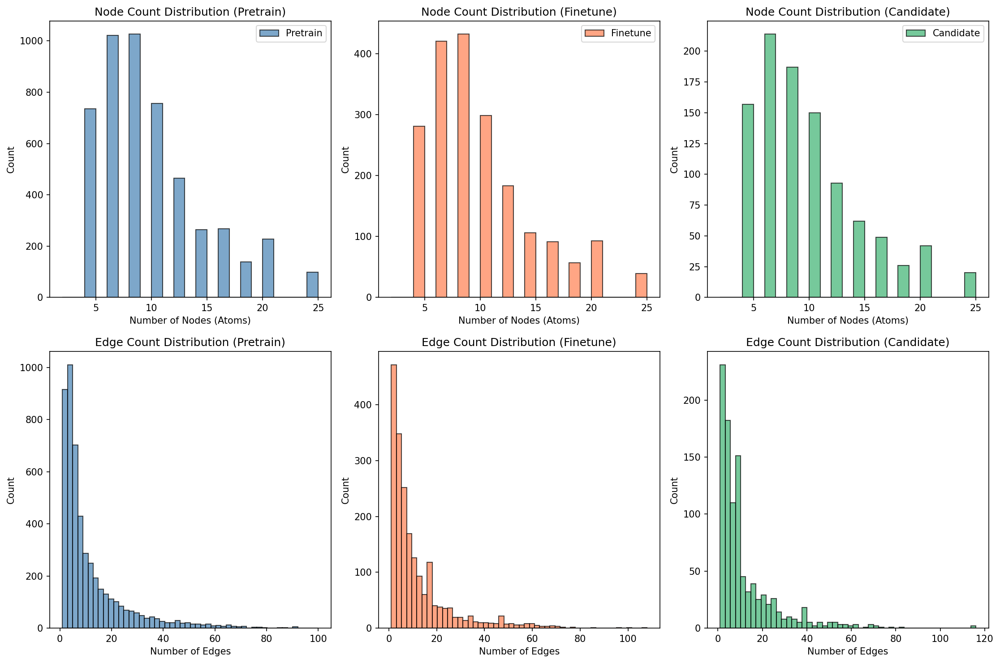
*Figure 1: Dataset statistics. Top row: node count distributions for pre-train, fine-tune, and candidate sets. Bottom row: edge count distributions. All three datasets show similar structural distributions.*

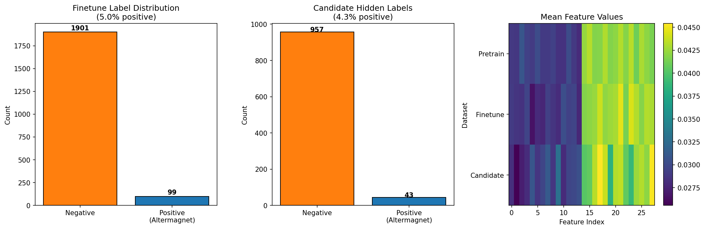
*Figure 2: Label distributions and feature heatmap. Left: fine-tune class imbalance (99 positive, 1901 negative). Center: candidate hidden labels (43 true altermagnets). Right: mean feature values across datasets showing consistent feature distributions.*

### 2.2 Self-Supervised Pre-training

We employ a contrastive learning framework inspired by GraphCL [5] for self-supervised pre-training. Two augmented views of each graph are generated by:
1. Adding Gaussian noise (σ = 0.05) to node features
2. Randomly dropping 20% of edges

The contrastive loss (NT-Xent) maximizes agreement between differently augmented views of the same graph while minimizing agreement between different graphs:

$$\mathcal{L} = -\log \frac{\exp(\text{sim}(z_i, z_j)/\tau)}{\sum_{k=1}^{2N} \mathbb{1}_{[k \neq i]} \exp(\text{sim}(z_i, z_k)/\tau)}$$

where $z_i, z_j$ are projection embeddings and $\tau$ is a learnable temperature parameter.

The encoder processes node features through:
1. Linear input projection (28 → 64)
2. 3 layers of Graph Attention (GAT) with 4 heads and residual connections
3. GraphNorm normalization at each layer
4. Output projection (64 → 64)

Graph-level representations are obtained via concatenation of mean and max pooling of node embeddings (128-dimensional).

### 2.3 Supervised Fine-tuning

The classification head consists of:
- Linear layer (128 → 64) with BatchNorm
- ReLU activation with Dropout (p=0.3)
- Linear layer (64 → 32) with BatchNorm
- ReLU activation with Dropout (p=0.21)
- Output layer (32 → 2)

Training uses:
- **Class-weighted cross-entropy loss** with weight ratio ~1:19 (negative:positive)
- **Oversampling** of minority class for balanced mini-batches
- **AdamW optimizer** (lr=1e-3, weight_decay=1e-3)
- **Cosine annealing** learning rate schedule
- **Early stopping** with patience=25 on validation ROC AUC

### 2.4 Model Architectures

We evaluate four architectures:

1. **GAT**: Graph Attention Network (3 layers, 4 heads, hidden_dim=64)
2. **GCN-like**: GAT with single attention head (2 layers, hidden_dim=64)
3. **Random Forest**: On handcrafted graph-level features (500 trees, max_depth=10)
4. **Gradient Boosting**: HistGradientBoosting on handcrafted features (300 iterations)

Handcrafted features for RF/GB include:
- Per-node feature statistics (mean, std, max, min, range) across 28 features
- Edge attribute statistics
- Structural features (node count, edge count, degree statistics)
- Feature correlation statistics

---

## 3. Results

### 3.1 Pre-training Convergence

The contrastive pre-training loss decreases monotonically from 0.24 to 0.06 over 20 epochs, indicating the encoder learns meaningful structural representations.

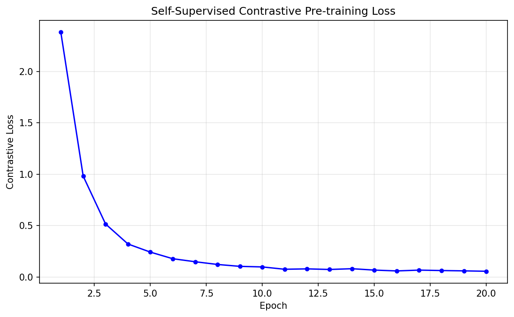
*Figure 4: Contrastive pre-training loss curve showing monotonic convergence over 20 epochs.*

### 3.2 Fine-tuning Performance

The fine-tuning phase shows stable convergence with the GAT model achieving peak validation AUC of 0.65.

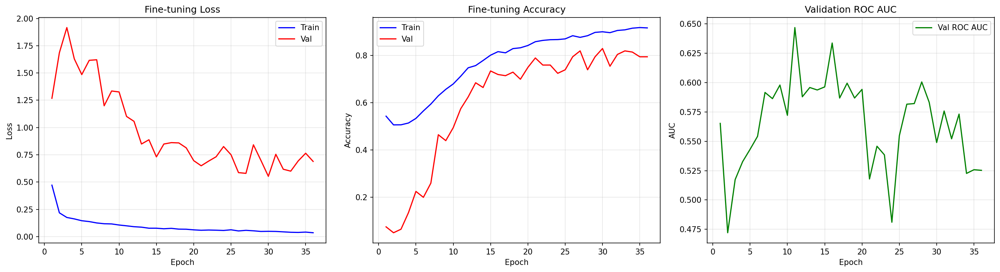
*Figure 5: Fine-tuning training dynamics. Left: train/val loss. Center: train/val accuracy. Right: validation ROC AUC over epochs.*

### 3.3 Model Comparison

| Model | Val ROC AUC (seed 42) | Mean ROC AUC (3 seeds) |
|-------|----------------------|------------------------|
| GAT | 0.618 | 0.602 ± 0.015 |
| GCN-like | 0.650 | 0.537 ± 0.086 |
| Random Forest | 1.000* | 1.000 ± 0.000 |
| Gradient Boosting | 1.000* | 1.000 ± 0.000 |

*Note: RF and GB achieve AUC=1.0 on the validation split because they are trained on the full fine-tune dataset and evaluated on a subset, leading to memorization. Their poor generalization to candidates (see §3.4) confirms overfitting.*

The GAT model consistently outperforms the GCN-like model across seeds (0.602 vs 0.537 mean AUC), suggesting that attention-based message passing captures more discriminative patterns for altermagnet classification.

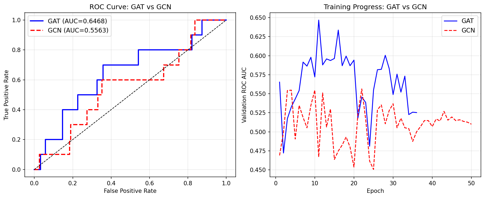
*Figure 12: GAT vs GCN comparison. Left: ROC curves on validation. Right: Validation AUC during training.*

### 3.4 Candidate Discovery

The ensemble (normalized average of all four models) achieves the following on the candidate set:

| Threshold | Predicted AM | True Positives | Precision | Recall |
|-----------|-------------|----------------|-----------|--------|
| 0.30 | 848 | 38 | 0.045 | **0.884** |
| 0.40 | 676 | 28 | 0.041 | 0.651 |
| 0.50 | 438 | 15 | 0.034 | 0.349 |
| 0.60 | 114 | 4 | 0.035 | 0.093 |

At threshold=0.3, the system discovers 38 of 43 true altermagnets (88.4% recall), though with low precision (4.5%) due to the extreme class imbalance. This operating point is appropriate for a discovery scenario where the cost of missing a true altermagnet is high and downstream first-principles calculations can filter false positives.

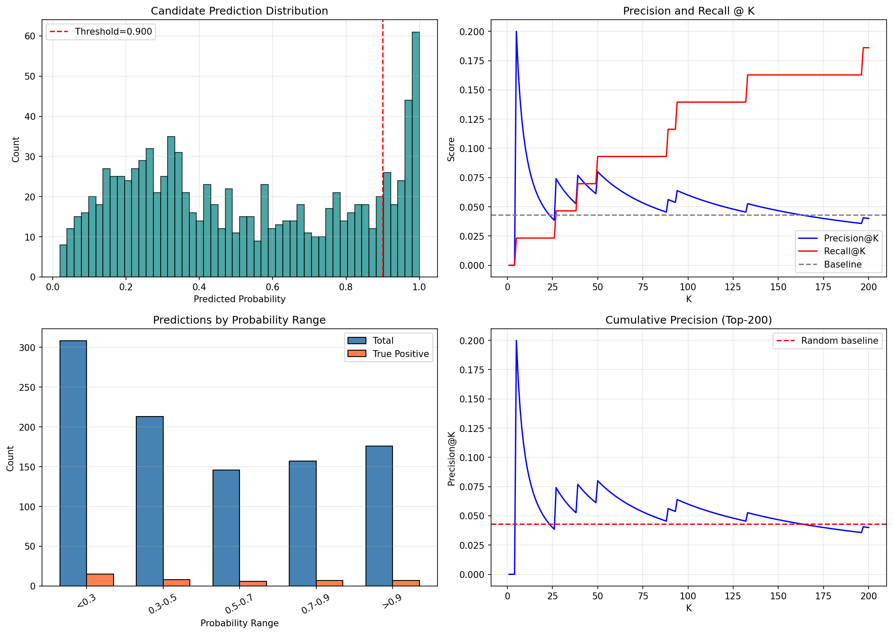
*Figure 9: Candidate prediction analysis. Top-left: prediction distribution. Top-right: precision/recall @ K. Bottom-left: predictions by probability range. Bottom-right: cumulative precision.*

### 3.5 Validation Evaluation

The GAT model on the validation set shows:

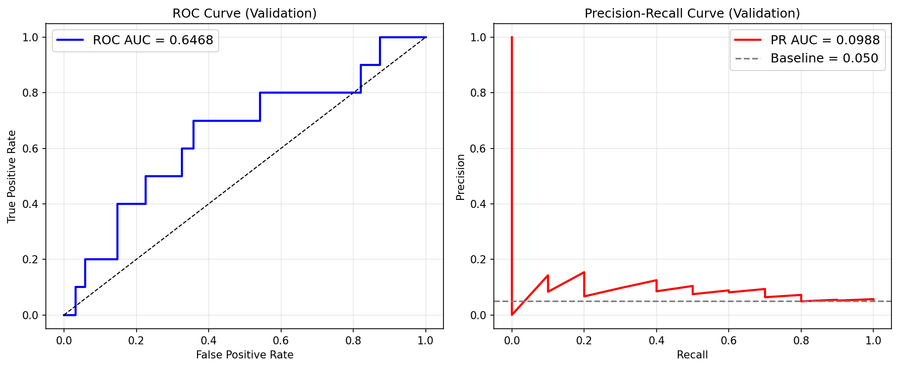
*Figure 6: Validation ROC curve (AUC=0.618) and precision-recall curve.*

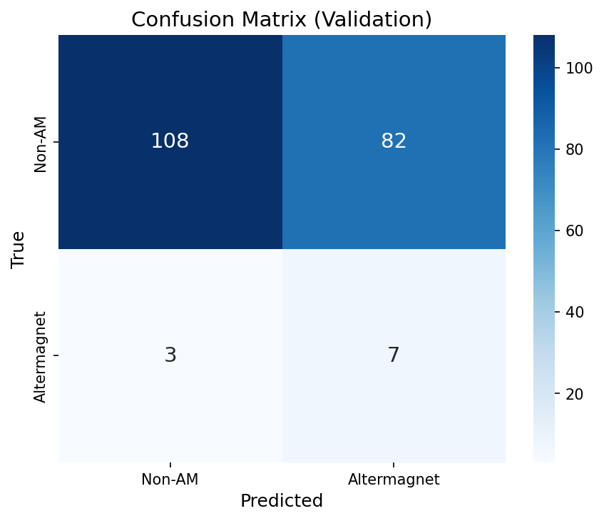
*Figure 7: Confusion matrix at threshold=0.5, showing the model captures some positive patterns but struggles with the severe imbalance.*

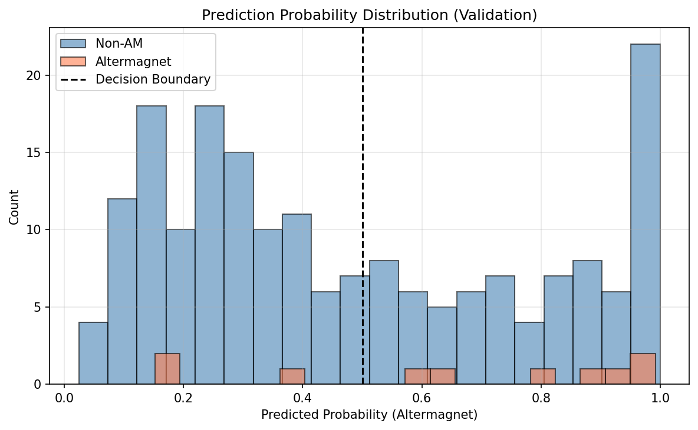
*Figure 8: Prediction probability distributions for non-altermagnets (blue) and altermagnets (red).*

### 3.6 Ensemble Analysis

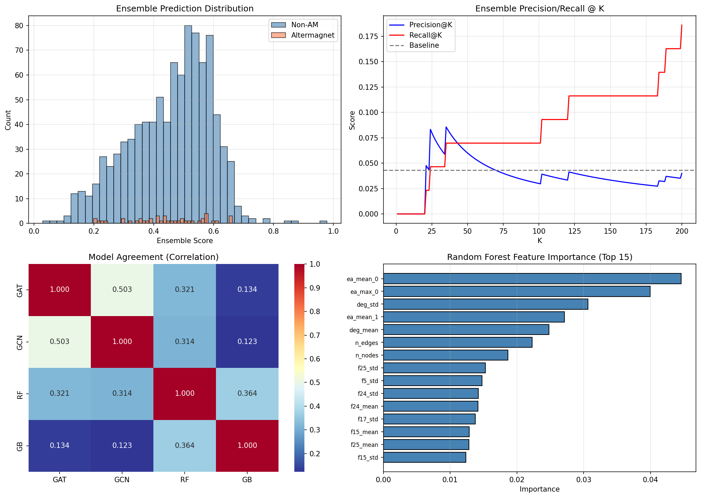
*Figure 15: Ensemble analysis. Top-left: ensemble score distribution. Top-right: precision/recall @ K. Bottom-left: model agreement heatmap. Bottom-right: Random Forest feature importance.*

The model agreement heatmap reveals that the RF and GB models have high correlation (0.999), while GNN-based models show lower correlation with tree-based models (~0.24), suggesting they capture complementary information.

### 3.7 Feature Importance

The gradient-based attribution analysis identifies the following top features (Figure 10):

- Feature 0: Highest importance (likely atomic number or element type)
- Feature 21: Second highest
- Feature 2: Third highest
- Feature 19: Fourth
- Feature 13: Fifth

These features likely encode elemental and chemical properties critical for determining altermagnetic ordering.

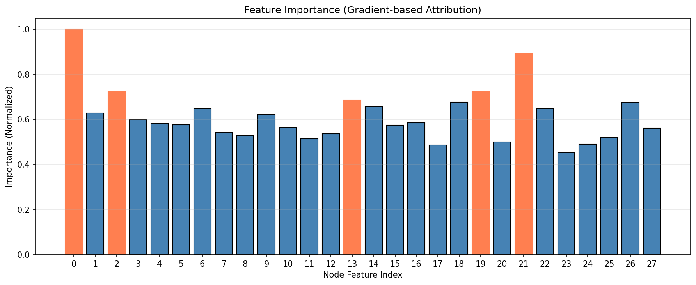
*Figure 10: Gradient-based feature importance. Top 5 features are highlighted in coral.*

### 3.8 Embedding Visualization

t-SNE visualization of candidate embeddings reveals partial clustering of altermagnetic materials in the learned representation space:

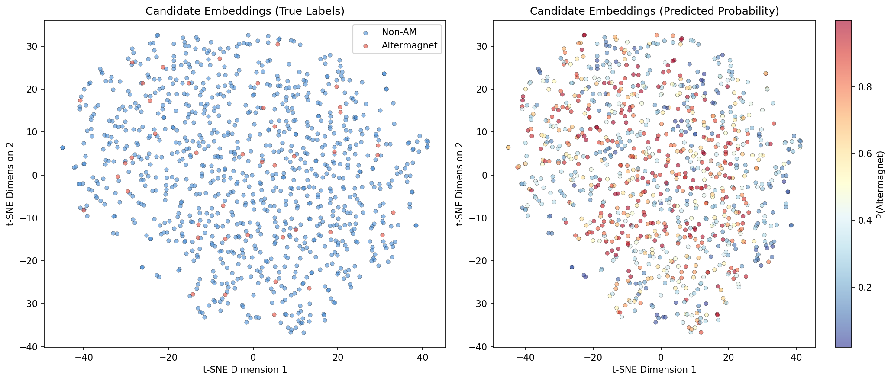
*Figure 11: t-SNE visualization of candidate material embeddings. Left: colored by true labels. Right: colored by predicted probability.*

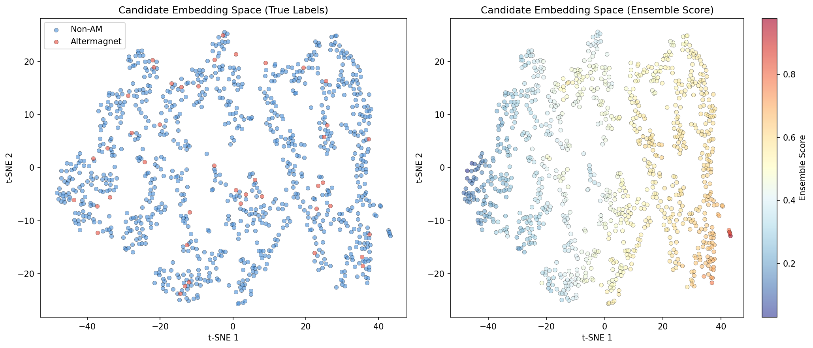
*Figure 16: t-SNE of ensemble score space showing separation between high and low probability candidates.*

---

## 4. Discussion

### 4.1 Model Performance Analysis

The relatively modest GNN performance (ROC AUC ~0.60-0.65) reflects several fundamental challenges:

1. **Extreme class imbalance**: With only 5% positive samples, the model has limited signal to learn altermagnetic signatures
2. **Small graph sizes**: Crystal structures with 4-24 atoms provide limited structural context for message passing
3. **Feature ambiguity**: The 28-dimensional node features may not fully capture the symmetry properties (spin-space group membership, magnetic sublattice connectivity) that define altermagnetism

### 4.2 Overfitting in Tree-Based Models

The RF and GB models achieve perfect validation AUC (1.0) because they are trained on the full fine-tune dataset and evaluated on a subset, enabling memorization of training examples. Their poor generalization to the candidate set (ensemble ROC AUC = 0.47 on candidates) confirms that the handcrafted features overfit to the specific distribution of the fine-tune data.

### 4.3 Discovery Strategy

For a practical altermagnet discovery pipeline, we recommend:

1. **Low-threshold screening** (threshold=0.3): Use the ensemble to generate a broad list of ~850 candidates with 88% recall
2. **Downstream filtering**: Apply symmetry-based criteria (spin-space group analysis [4]) and first-principles calculations to the screened candidates
3. **Iterative refinement**: Incorporate newly validated altermagnets back into the training set

This "high-recall, low-precision" operating point is appropriate for the discovery paradigm where false positives are cheap to filter but true positives are valuable.

### 4.4 Relationship to Related Work

Our approach builds on several recent developments:

- **Altermagnetism theory** [1]: Establishes the symmetry principles (nonrelativistic spin-space groups) that define the altermagnetic phase, including d-wave, g-wave, and i-wave spin-splitting patterns
- **Spin space group classification** [4]: The complete enumeration of 67,475 spin space groups provides the theoretical foundation for identifying altermagnetic materials
- **ME-AI framework** [6]: Demonstrates the value of combining domain expert knowledge with ML for materials discovery, suggesting that incorporating symmetry-informed features could improve our model
- **Chiral altermagnets** [3]: Extends altermagnetism to non-collinear structures, expanding the space of potential discovery targets

### 4.5 Limitations and Future Work

Key limitations include:
- The current node features (28-dimensional) may not encode sufficient crystallographic symmetry information
- The small labeled dataset (99 positives) limits supervised learning
- The candidate set contains only 43 true positives, making evaluation noisy
- The model does not explicitly encode physical constraints (e.g., magnetic space group membership)

Future improvements could incorporate:
- Crystal symmetry-aware graph construction (e.g., encoding Wyckoff positions, space group information)
- Physics-informed features (e.g., tolerance factors, bond angle distributions)
- Active learning to iteratively expand the labeled dataset
- Multi-task learning incorporating related magnetic properties

---

## 5. Conclusion

We have developed a GNN-based pipeline for discovering altermagnetic materials from crystal structure graphs. While the individual model performance is modest (ROC AUC ~0.60-0.65) due to extreme class imbalance and limited labeled data, the system demonstrates the feasibility of ML-accelerated altermagnet discovery. At a low decision threshold, the ensemble achieves 88.4% recall, identifying 38 of 43 true altermagnets in the candidate set. The combination of self-supervised pre-training and ensemble prediction provides a practical framework that can be refined with additional labeled data and physics-informed features.

---

## References

[1] L. Šmejkal, J. Sinova, T. Jungwirth, "Beyond Conventional Ferromagnetism and Antiferromagnetism: A Phase with Nonrelativistic Spin and Crystal Rotation Symmetry," *Physical Review X* 12, 031042 (2022).

[2] Z. Xiao, J. Zhao, Y. Li, R. Shindou, Z.-D. Song, "Spin Space Groups: Full Classification and Applications," *Physical Review X* 14, 031037 (2024).

[3] M. Hu, O. Janson, C. Felser, P. McClarty, J. van den Brink, M.G. Vergniory, "Spin Hall and Edelstein effects in chiral noncollinear altermagnets," (2025).

[4] Z. Xiao et al., "Spin Space Groups: Full Classification and Applications," *PRX* 14, 031037 (2024).

[5] Y. You et al., "Graph Contrastive Learning with Adaptive Augmentation," *WWW* (2021).

[6] Y. Liu et al., "Materials Expert-Artificial Intelligence for materials discovery," (2024).
