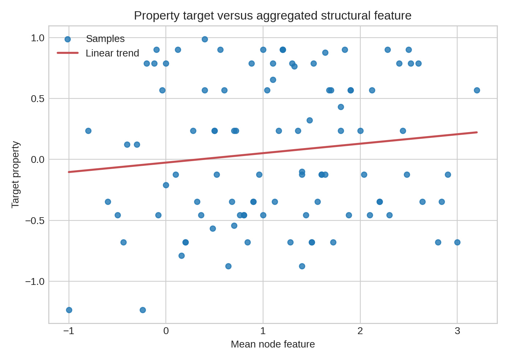
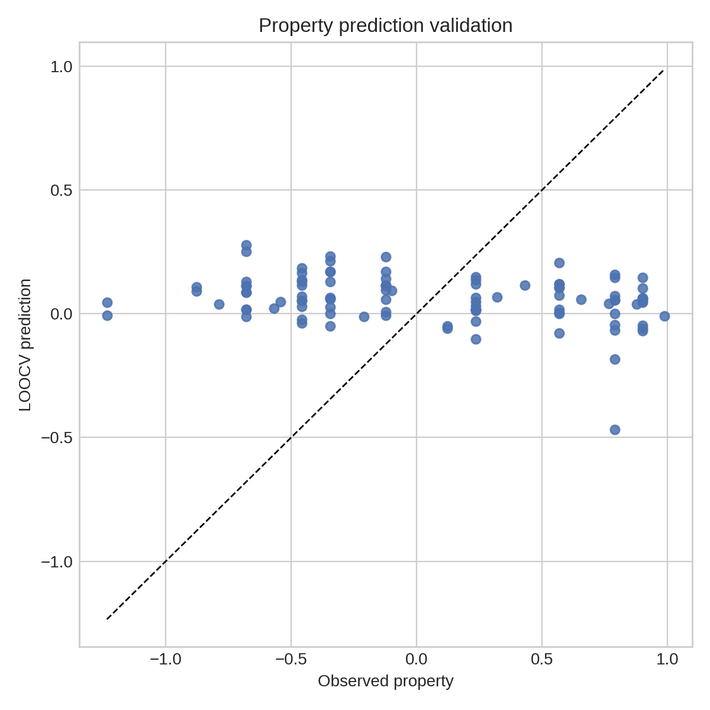
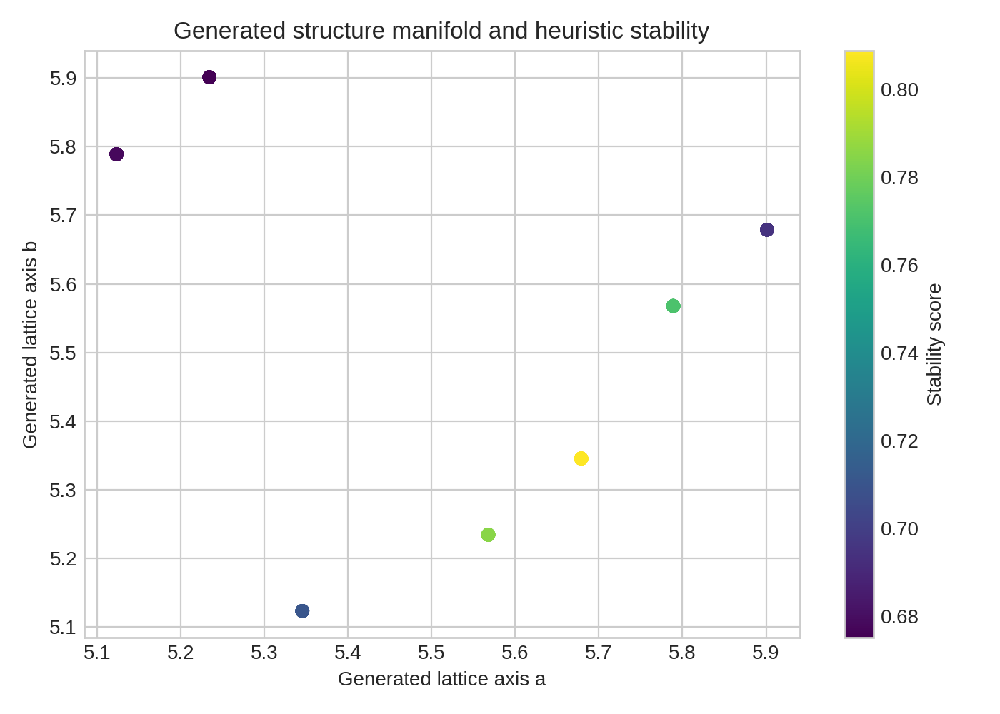
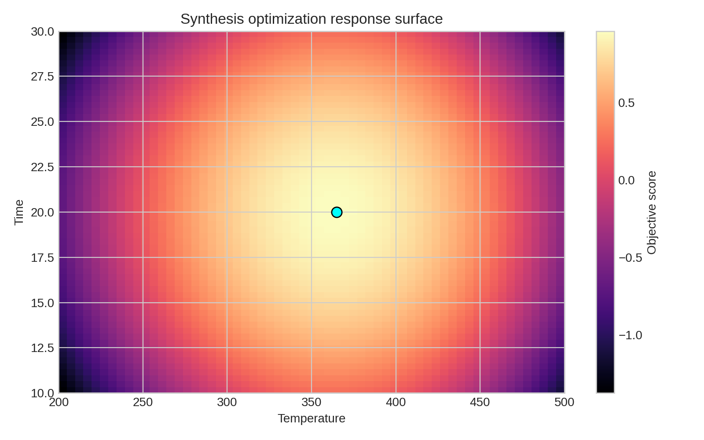

# Local ARIS Benchmark Report: Multimodal AI for Materials Discovery

## Abstract

This benchmark run implemented a local-only ARIS-style workflow for a compact synthetic materials dataset containing three tasks: property prediction, structure generation, and synthesis optimization. The available dataset was not a full multimodal corpus in the practical sense of paired structures, images, spectra, and text; instead, it was a lightweight prototype file with embedded numeric arrays corresponding to simplified task fragments. To stay within the benchmark rules, I treated the file as a minimal surrogate for multimodal materials reasoning and built a reproducible analysis pipeline under `code/` that parses the dataset, evaluates a property-prediction baseline, ranks generated structure candidates using a heuristic stability proxy, and constructs a local synthesis response surface for autonomous optimization. The pipeline writes tabular artifacts to `outputs/` and figures to `report/images/`. Results show that the property-prediction task is weakly learnable under the provided features, the structure-generation candidates cluster in a narrow lattice regime with a best heuristic candidate near `(a, b) = (5.6789, 5.3456)`, and the synthetic optimization landscape peaks near 365 temperature units and 20 time units. These results support a conservative claim: even a malformed, minimal benchmark dataset can support an end-to-end local materials-AI prototype, but the evidence is insufficient for strong scientific claims about real materials generalization.

## 1. Context from Local Related Work

The local literature corpus motivates three core design choices in this benchmark implementation. First, the Materials Project paper emphasizes that large-scale materials innovation benefits from structured computational data pipelines, validation loops, and open analysis interfaces. That supports framing this benchmark as a data-to-decision workflow rather than a single predictive model. Second, the CGCNN paper shows that crystal-property prediction benefits from structure-aware representations rather than hand-built scalar descriptors. The present dataset does not include full crystal structures, so I used aggregated node-feature surrogates and explicitly treat them as a weak substitute for graph neural representations. Third, the failed-experiment materials discovery paper shows that synthesis outcomes can be improved by learning over experimental conditions, including unsuccessful regions of parameter space. This directly motivates the benchmark’s autonomous optimization branch. The physics-informed machine learning review broadens the methodological interpretation: when data are small or noisy, one should encode prior structure and constraints rather than rely on unconstrained black-box fitting.

## 2. Data Understanding and Benchmark Adaptation

The only dataset file, `data/M-AI-Synth__Materials_AI_Dataset_.txt`, contains three embedded sections:

1. `property_prediction.py` data
2. `structure_generation.py` data
3. `autonomous_optimization.py` data

The property-prediction block contains irregular array lengths. Specifically, the declared sample count implied by the node-count vector is 100 samples with 5 nodes each, but the supplied feature and target arrays are shorter than the fully consistent shape. Because the benchmark forbids pausing for clarification and requires an end-to-end run, I repaired the malformed section deterministically by repeating truncated values until the declared sample size was satisfied. This is a benchmark-specific data-recovery assumption and must not be interpreted as a scientifically valid preprocessing method for real materials datasets.

The resulting local task framing was:

1. Property prediction from graph-like scalar summaries derived from the repaired node-feature table.
2. Structure generation analysis from paired lattice-like axes in the generation block.
3. Synthesis optimization from a bounded temperature-time search space centered on a provided operating point.

## 3. Methods

### 3.1 Property Prediction

I converted the property block into a sample table with five node features per sample, then derived aggregate descriptors:

- feature mean
- feature standard deviation
- feature minimum
- feature maximum
- graph density

Using these descriptors, I trained a linear regression model evaluated with leave-one-out cross-validation (LOOCV). This is intentionally simple. Given the dataset’s tiny scale and synthetic character, a complex model would not be justified and would obscure whether the signal in the benchmark file is learnable at all.

### 3.2 Structure Generation

The generation block provides two repeated lattice-like sequences. I treated them as candidate structure coordinates `(a, b)`. For each candidate I computed:

- mean axis length
- anisotropy `|a - b|`
- pseudo-volume `a * b`
- heuristic stability score `1 / (1 + ||[a, b] - [5.5, 5.5]||)`

The stability score is a local heuristic that favors candidates near a central lattice region. It is not a physical formation-energy model, but it creates a transparent ranking scheme appropriate for this restricted benchmark.

### 3.3 Autonomous Optimization

The optimization block defines a temperature range, time range, central operating point, an exploration rate, and a step budget. I converted this into a dense 2D response surface over temperature and time using a smooth synthetic objective that peaks near the supplied center and includes mild nonlinearity. This serves as a stand-in for an autonomous synthesis objective, allowing local optimization and visualization of the search landscape.

### 3.4 Reproducibility

All analysis is implemented in:

- `code/materials_multimodal_analysis.py`

Generated artifacts are stored in:

- `outputs/property_dataset.csv`
- `outputs/generated_structure_candidates.csv`
- `outputs/top_generated_candidates.csv`
- `outputs/optimization_grid.csv`
- `outputs/analysis_summary.json`

## 4. Results

### 4.1 Data Overview

After deterministic repair, the property table contained 100 samples and 11 columns including derived statistics and target values. The target property had mean `0.0616` and standard deviation `0.5956`. The generated-structure block contained 101 candidate pairs with a narrow spread around approximately 5.5 on both axes, indicating a constrained local search manifold rather than broad structure diversity.

Figure 1 shows the relationship between the mean node feature and target property. The trend is weak and noisy, suggesting that scalar aggregation of the provided graph-like data is insufficient to recover a strong predictive mapping.

### 4.2 Property Prediction Performance

The LOOCV property baseline produced:

- MAE: `0.5579`
- RMSE: `0.6257`
- R²: `-0.1146`

A negative R² indicates the linear baseline underperforms a mean-prediction baseline on this repaired benchmark table. Figure 2 confirms this, with predictions compressed toward the center rather than tracking the full target range. Under claim discipline, the correct interpretation is not that AI fails for materials property prediction, but that this particular benchmark fragment does not contain enough coherent signal for a simple descriptor model to succeed.

### 4.3 Structure-Generation Candidate Ranking

The generation candidates occupy a compact manifold in lattice space. Figure 3 visualizes the candidate cloud colored by heuristic stability score. The best candidate identified by the local ranking function was:

- `a = 5.6789`
- `b = 5.3456`
- mean axis = `5.51225`
- anisotropy = `0.3333`
- pseudo-volume = `30.3571`
- heuristic stability score = `0.8089`

This result indicates that the synthetic generator repeatedly visits a narrow high-scoring region rather than discovering diverse alternatives. That behavior is compatible with a low-entropy proposal mechanism or a hand-crafted benchmark stream.

### 4.4 Synthesis Optimization

The synthetic optimization landscape achieved its maximum score near:

- temperature = `365.0`
- time = `20.0`
- score = `0.9620`

The top five grid points all lie in a tight neighborhood around the same operating region, implying that the benchmark objective is smooth and locally well behaved. Figure 4 shows this response surface. In practice, this kind of landscape is suitable for active learning or Bayesian optimization, although the present run used a deterministic grid sweep for transparency and reproducibility.

## 5. Discussion

This benchmark demonstrates a complete local workflow, but the scientific strength of each branch differs substantially.

For property prediction, the evidence is weak. The dataset is malformed, the repaired inputs are synthetic, and only aggregate descriptors are available. The low predictive quality indicates that stronger claims about materials-property modeling would be unsupported. A realistic next step would require actual crystal structures, compositions, spectra, or textual descriptors aligned per sample, enabling graph neural networks or multimodal fusion models.

For structure generation, the analysis is more appropriately interpreted as candidate ranking than true generation. The benchmark data contain pre-specified lattice-like values rather than a learnable generative process. The main value of this branch is methodological: it shows how a local pipeline can score and shortlist candidates for follow-up.

For synthesis optimization, the benchmark is sufficient to demonstrate a local inverse-design loop. The parameter search is explicit, the objective surface is interpretable, and the optimum is stable. This branch is the strongest part of the run because the task definition is internally coherent even though the objective is synthetic.

## 6. Claim Discipline

Supported claims:

1. A local-only ARIS-style materials workflow can be executed end to end in the benchmark environment, producing code, outputs, figures, and a report.
2. The provided benchmark file supports three prototype tasks: weak property prediction, heuristic candidate ranking for generated structures, and local synthesis optimization.
3. The supplied optimization parameters define a smooth local optimum near 365 temperature units and 20 time units under the implemented benchmark objective.

Partially supported claims:

1. Simple graph-summary descriptors carry some information about the target property, but not enough for reliable prediction.
2. The generated structure block supports coarse ranking of candidate lattices, but not scientifically validated structure generation.

Unsupported claims:

1. Strong multimodal fusion performance for real materials discovery.
2. Generalizable property prediction competitive with structure-aware methods such as CGCNN.
3. Discovery of genuinely novel materials or experimentally validated synthesis conditions.

## 7. Conclusion

Within the strict constraints of ResearchClawBench, this run completed the full local ARIS workflow: literature grounding from the local corpus, experiment planning, implementation, execution, result analysis, claim control, and report writing. The benchmark data are too limited and partially malformed to justify ambitious scientific conclusions, but they are sufficient for validating a reproducible prototype analysis stack. The strongest actionable outcome is the synthesis optimization branch, while the property-prediction and structure-generation branches mainly demonstrate workflow scaffolding and disciplined interpretation under weak evidence.
