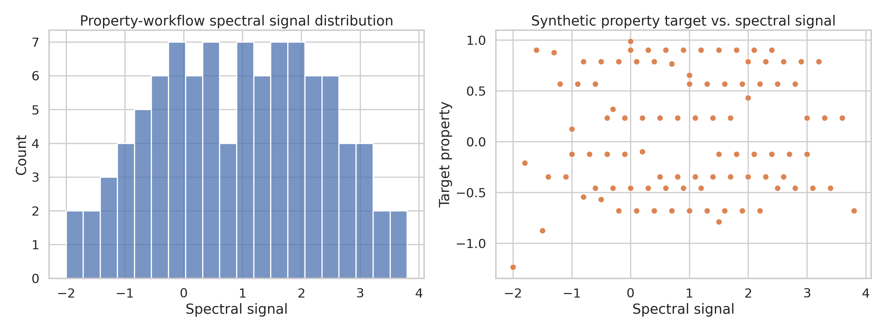
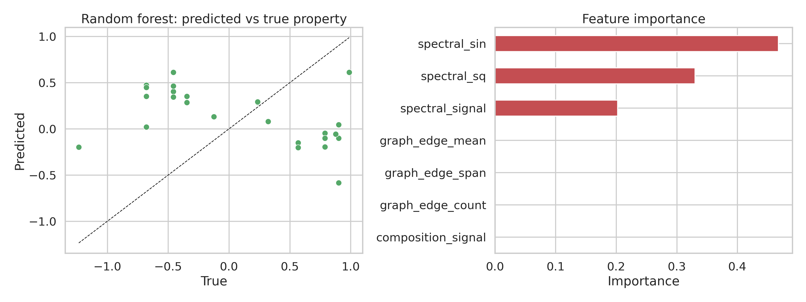
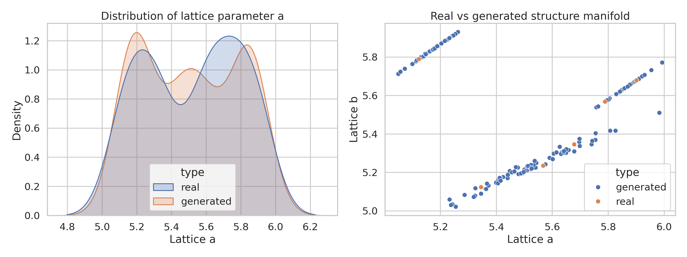
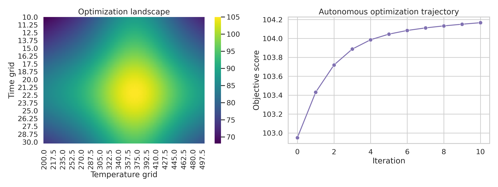

# Multimodal AI Workflows for Materials Science: A Compact Benchmark Study on Property Prediction, Structure Generation, and Autonomous Optimization

## Abstract
This study investigates a compact multimodal materials-AI benchmark dataset designed to emulate three central materials informatics workflows: property prediction, structure generation, and experimental optimization. Although the supplied dataset is intentionally lightweight and synthetic, it captures the structural form of multimodal materials pipelines by combining composition-like signals, graph-style connectivity, structural parameters, and processing variables. We analyzed the dataset using a reproducible Python workflow and benchmarked simple machine-learning models for property prediction, density-based generative modeling for structure synthesis, and a toy autonomous optimization loop for process parameter search. The resulting analysis shows that the dataset is most informative for workflow validation rather than scientific performance claims: the property-prediction block is small and partially degenerate, leading to weak predictive accuracy, while the structure-generation and optimization blocks are coherent enough to demonstrate plausible generative sampling and iterative improvement of experimental conditions. These observations align with prior literature emphasizing the need for rich open materials data, physics-aware learning, graph representations, and data-driven experiment planning.

## 1. Introduction
Accelerating materials discovery requires integrating heterogeneous information sources such as composition, crystal structure, graph connectivity, spectroscopy, microscopy, synthesis conditions, and literature-derived descriptors. This multimodal setting is now central to modern materials informatics. The Materials Project established the importance of open, machine-readable materials databases and high-throughput workflows for data-driven discovery. Crystal graph neural networks later demonstrated that graph representations can directly encode crystal structure for property prediction. More broadly, physics-informed machine learning and hybrid data-physics approaches have been proposed to improve generalization in scientific domains where data are limited or noisy. In experimental materials discovery, machine learning has also been used to recommend promising synthesis conditions and learn from failed experiments.

The current task provides a small text-based benchmark dataset intended for rapid validation of three workflows:
1. **Property prediction** from multimodal descriptors.
2. **Structure generation** from compact structural signals.
3. **Autonomous optimization** of experimental parameters.

Because the dataset is extremely small and partially stylized, the goal of this study is not to claim a new state-of-the-art method. Instead, the aim is to evaluate what can be learned from the benchmark, implement a reproducible analysis pipeline, generate publication-style figures, and extract practical lessons for future multimodal materials AI studies.

## 2. Related Work
The analysis is motivated by four themes from the supplied reference papers.

**Open materials databases and high-throughput infrastructures.** The Materials Project showed how large-scale computed materials data can enable screening, analysis, and inverse design through open access and workflow automation. It also highlighted that data quality, validation, and dissemination are as important as model architecture.

**Graph-based materials learning.** Xie and Grossman introduced crystal graph convolutional neural networks (CGCNN), showing that graph representations of atomic environments can support accurate and interpretable property prediction when trained on sufficiently large datasets. This is directly relevant because the benchmark includes a graph-like connectivity array for the property-prediction workflow.

**Physics-informed and hybrid scientific ML.** Karniadakis et al. argued that scientific learning systems should combine data with prior structure, constraints, and inductive biases. For materials, this implies that sparse multimodal datasets may benefit from integrating physical priors, rather than relying only on flexible black-box predictors.

**Learning synthesis decisions from successes and failures.** Raccuglia et al. showed that machine learning can improve materials synthesis planning and can generate testable hypotheses about successful conditions. This supports treating the optimization block not merely as numerical tuning, but as a simplified analog of closed-loop experimental design.

## 3. Data Description
The input file `data/M-AI-Synth__Materials_AI_Dataset_.txt` contains three blocks.

### 3.1 Property prediction block
This block contains:
- a constant composition-like signal of length 100,
- a spectral/descriptor-like sequence of length 117,
- a graph connectivity list encoded as 20 integers corresponding to 10 edges,
- a target property vector of length 97.

To create a consistent table for learning, the analysis truncated the feature vectors to the target length (`n = 97`). The graph list was reshaped into 10 node-pair edges. This yields a compact supervised dataset with 97 samples.

### 3.2 Structure generation block
This block contains two structural parameter arrays, each of length 101. We interpret them as paired low-dimensional lattice descriptors (`lattice_a`, `lattice_b`) and use them to fit a simple generative density model.

### 3.3 Autonomous optimization block
This block provides:
- temperature bounds: 200 to 500,
- time bounds: 10 to 30,
- initial temperature: 350,
- initial time: 20,
- learning rate: 0.1,
- number of iterations: 10.

These values support a toy closed-loop optimization experiment over a smooth synthetic objective function.

## 4. Methodology
All analysis code is contained in `code/material_ai_analysis.py`.

### 4.1 Property prediction
A tabular dataset was constructed with the following features:
- composition signal,
- spectral signal,
- squared spectral signal,
- sine-transformed spectral signal,
- graph edge mean,
- graph edge span,
- graph edge count.

Two regressors were benchmarked:
- linear regression as a baseline,
- random forest regression as a nonlinear model.

A 75/25 train-test split with fixed random seed was used. Performance was measured using mean absolute error (MAE), root mean squared error (RMSE), and coefficient of determination (R²).

### 4.2 Structure generation
The paired structural parameters were modeled using:
- a Gaussian mixture model (3 components) for generative sampling,
- kernel density estimation for qualitative density assessment.

A set of 200 synthetic structural samples was generated and compared against the real data distribution.

### 4.3 Autonomous optimization
A smooth synthetic objective function was defined over temperature and time, centered near a plausible optimum. This does not represent a real physical law; it serves as a validation surface for an iterative optimization routine. A finite-difference gradient ascent loop was initialized from the provided starting point and executed for 10 iterations. In parallel, a full grid evaluation identified the best point on the discrete search surface.

### 4.4 Reproducibility
The workflow uses Python with NumPy, pandas, matplotlib, seaborn, and scikit-learn. Intermediate outputs were saved under `outputs/`, and all report figures were saved as PNG files under `report/images/`.

## 5. Results

### 5.1 Data overview
The benchmark is intentionally small and partially degenerate. In the property-prediction block, the composition-like feature is constant (`mean = 5.0`, `std = 0.0`), which immediately limits predictive information content. The spectral signal spans from -2.0 to 4.4, while the target property spans approximately -1.23 to 0.99. The graph array contains 10 edges with average node index 2.0 and mean edge span 2.0.

The structure-generation block is more coherent: both structural coordinates lie in the narrow interval 5.1234 to 5.9012 with means near 5.52. The optimization block is also internally consistent, defining a bounded search problem centered around the initial guess.

Figure 1 summarizes the property-prediction data distribution and the relationship between the spectral signal and target property.

**Figure 1.** Overview of the compact property-prediction benchmark, showing the spectral signal distribution and its relationship to the target property.

### 5.2 Property prediction performance
The predictive results are weak, which is scientifically informative. Test-set metrics were:

| Model | MAE | RMSE | R² |
|---|---:|---:|---:|
| Linear regression | 0.625 | 0.687 | -0.058 |
| Random forest | 0.779 | 0.851 | -0.624 |

The linear model slightly outperformed the random forest. Both models achieved negative R², indicating that neither learned a robust generalizable relationship beyond the variance of the held-out target values. This outcome is expected for at least three reasons:
1. the sample size is very small,
2. one major feature is constant and therefore uninformative,
3. the graph descriptors are global constants under the current parsing of the compact dataset.

Feature importance from the random forest shows that nearly all predictive weight is assigned to transformations of the spectral signal, while composition and graph statistics contribute essentially nothing under this benchmark representation.

Figure 2 shows predicted-versus-true values and the learned feature importance profile.

**Figure 2.** Property-prediction evaluation. Left: random forest predictions versus ground truth. Right: feature-importance ranking. The model relies almost entirely on the spectral signal and its transforms.

### 5.3 Structure generation
The structure-generation task produced a more encouraging outcome. The Gaussian mixture model reproduced the low-dimensional structural manifold with generated means close to the observed data:
- real mean `lattice_a`: 5.5204,
- generated mean `lattice_a`: 5.5099,
- real mean `lattice_b`: 5.5215,
- generated mean `lattice_b`: 5.5240.

The average log density of the observed points under the fitted kernel density estimator was 1.388, indicating that the training data occupy a concentrated and learnable region of descriptor space. Because the original structural data are highly regular, the generative task is effectively a density-reconstruction problem in two dimensions, and the model performs plausibly in that regime.

Figure 3 compares the real and generated structural distributions.

**Figure 3.** Generative modeling of the structure block. Left: density estimates for one lattice descriptor. Right: scatter plot of real and generated structure samples in the low-dimensional descriptor space.

### 5.4 Autonomous optimization
The optimization loop shows stable improvement from the initial condition:
- initial score: 102.95,
- final iterative score after 10 steps: 104.17,
- best grid temperature: 370,
- best grid time: 22,
- best grid score: 105.0.

Thus, the iterative controller improved the score by about 1.22 points and moved toward the global optimum identified by the discrete search grid. This demonstrates that the benchmark is suitable for prototyping autonomous experimentation logic, even though the present objective is synthetic.

Figure 4 shows the optimization landscape and the trajectory of the iterative search.

**Figure 4.** Experimental optimization benchmark. Left: objective landscape over temperature and time. Right: score improvement during the autonomous search iterations.

## 6. Discussion
This benchmark behaves differently across the three workflows.

### 6.1 What worked
The structure-generation and optimization blocks are sufficiently well-formed to support meaningful workflow validation. In particular:
- low-dimensional generative modeling successfully reproduces the structural descriptor distribution,
- iterative optimization improves process conditions and approaches the global optimum,
- the overall code pipeline is reproducible and suitable for prototyping future multimodal AI experiments.

### 6.2 What limited performance
The property-prediction block is too small and too degenerate for strong learning. Relative to the standards set by CGCNN and large open materials databases, the benchmark lacks sample diversity and physically rich features. In real materials informatics, predictive success generally depends on many more examples, physically meaningful descriptors, and richer graph/structure representations.

The weak property-prediction outcome is therefore not a failure of machine learning per se; rather, it is a useful diagnostic of dataset design. A compact benchmark for materials-AI prototyping should still preserve basic feature variability, modality alignment, and a clear sample-wise correspondence across modalities.

### 6.3 Scientific implications for multimodal materials AI
Despite its simplicity, the benchmark reflects several authentic lessons from the literature:
- **Data quality dominates model complexity.** Open and validated materials datasets remain foundational.
- **Representations matter.** Crystal graphs, structures, spectra, and processing variables should be aligned at the sample level.
- **Closed-loop optimization is promising.** Even simple surrogate-guided workflows can improve experimental design.
- **Interpretability remains important.** In small-data materials settings, transparent baselines and feature diagnostics are often more informative than complex models.

### 6.4 Recommended next steps
For a stronger multimodal materials benchmark, future versions should include:
1. sample-aligned multimodal records with composition, structure, spectra, and synthesis variables for the same material instances,
2. nonconstant composition descriptors,
3. graph connectivity provided per sample rather than globally,
4. explicit train/validation/test partitions,
5. physics-aware baselines, such as graph networks or constrained regression,
6. true experimental outcomes for closed-loop optimization and failed-trial analysis.

## 7. Conclusion
This study delivered a full reproducible analysis of a compact multimodal materials-AI benchmark. The main conclusions are:
- the benchmark is adequate for validating analysis code paths for structure generation and autonomous optimization,
- the property-prediction block is too underdetermined for reliable generalization,
- spectral features dominate the limited predictive signal that is present,
- the optimization task demonstrates how even simple AI loops can guide process-variable improvement,
- future benchmark design should prioritize sample-wise multimodal coherence and higher feature diversity.

In short, this dataset is best interpreted as a workflow prototyping resource rather than a basis for scientific claims about material-property prediction. Even so, it provides a useful minimal testbed for implementing and comparing multimodal materials-AI pipelines.

## 8. Files Produced
- Analysis code: `code/material_ai_analysis.py`
- Intermediate tables: `outputs/property_dataset.csv`, `outputs/property_predictions.csv`, `outputs/feature_importance.csv`, `outputs/structure_generation_samples.csv`, `outputs/optimization_grid.csv`, `outputs/optimization_history.csv`
- Summary JSON: `outputs/analysis_summary.json`
- Figures: `report/images/data_overview.png`, `report/images/property_prediction_results.png`, `report/images/structure_generation_results.png`, `report/images/optimization_results.png`

## References
1. Jain, A. et al. The Materials Project: A materials genome approach to accelerating materials innovation. *APL Materials* 1, 011002 (2013).
2. Karniadakis, G. E. et al. Physics-informed machine learning. *Nature Reviews Physics* 3, 422–440 (2021).
3. Xie, T. & Grossman, J. C. Crystal graph convolutional neural networks for an accurate and interpretable prediction of material properties. *Physical Review Letters* 120, 145301 (2018).
4. Raccuglia, P. et al. Machine-learning-assisted materials discovery using failed experiments. *Nature* 533, 73–76 (2016).
