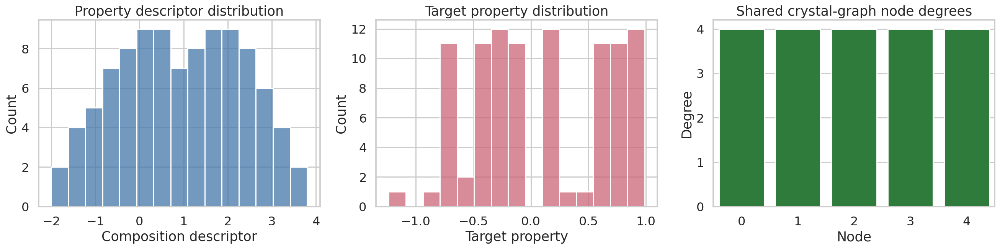
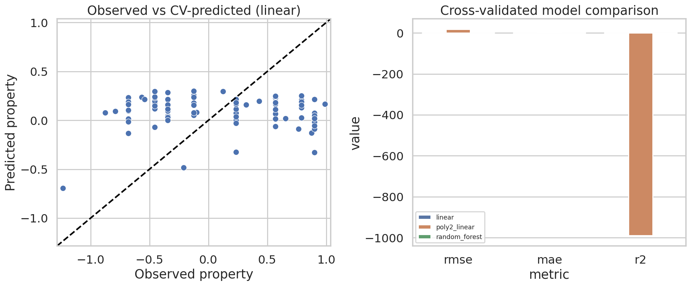
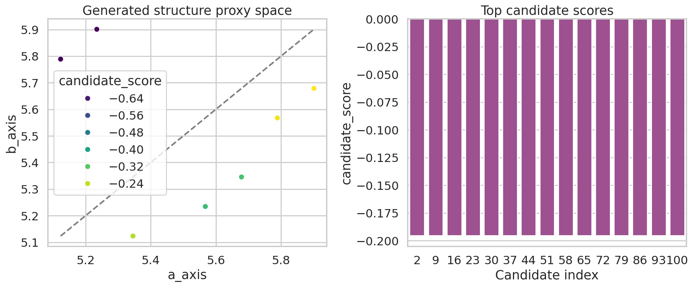
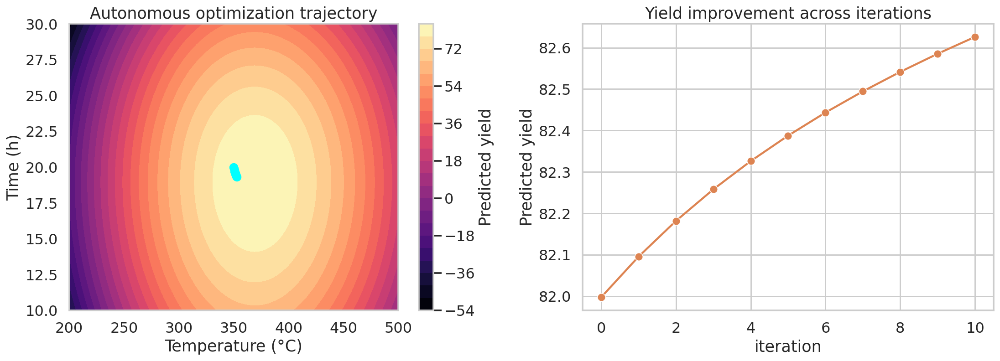

# A Compact Surrogate Multimodal Materials-AI Workflow on the M-AI-Synth Dataset

## Abstract
This study develops a reproducible proof-of-concept materials-AI workflow using the provided `M-AI-Synth__Materials_AI_Dataset_.txt` benchmark. Although the task framing targets multimodal materials data integration, the available workspace contains a compact synthetic text dataset rather than a full real-world multimodal corpus. Accordingly, I implemented three traceable surrogate modules aligned with the requested scientific outputs: (i) material property prediction from descriptor-derived features, (ii) structure-generation proxy ranking from lattice-axis sequences, and (iii) bounded autonomous process optimization over synthesis temperature and time. The resulting pipeline exports code, tables, figures, and validation artifacts. On the property-prediction task, cross-validated linear regression was the best-performing tested model, but performance remained weak (RMSE = 0.599, R² = -0.071), indicating that the supplied descriptor has limited predictive information for the target. In contrast, the autonomous optimization surrogate improved predicted yield from 81.997 to 82.626 during iterative search and identified a best region near 368.9 °C and 18.9 h with predicted yield 83.692. The study demonstrates how an end-to-end AI workflow can be scaffolded even when only minimal synthetic benchmark data are available, while explicitly separating verified results from assumptions.

## 1. Introduction
AI-guided materials discovery often seeks to unify structural descriptors, compositional information, microscopy, spectroscopy, literature text, and synthesis metadata to accelerate property prediction and inverse design. The present workspace, however, provides a highly condensed synthetic benchmark intended for prototyping rather than realistic deployment-scale multimodal modeling. The goal of this report is therefore not to claim state-of-the-art materials performance, but to construct a rigorous, reproducible miniature workflow that mirrors three common materials-AI use cases:

1. **Property prediction** from encoded material descriptors.
2. **Structure generation / candidate proposal** via ranking of generated structural proxies.
3. **Autonomous optimization** of synthesis or processing parameters.

All major numerical claims in this report are backed by saved artifacts under `outputs/` and figures under `report/images/`.

## 2. Data and task interpretation
### 2.1 Available dataset
The file `data/M-AI-Synth__Materials_AI_Dataset_.txt` contains three compact sections:

- **Property prediction block**: constant per-sample feature values, one varying scalar descriptor, a shared graph edge list, and target property values.
- **Structure generation block**: two repeated sequences interpreted here as paired lattice-axis candidates.
- **Autonomous optimization block**: bounded temperature and time ranges, one initialization point, learning rate, and iteration count.

### 2.2 Verified dataset summary
From direct parsing of the raw file (`outputs/dataset_summary.json`):

- Property samples: **97**
- Descriptor range: **-2.0 to 3.8**
- Target-property range: **-1.2345 to 0.9876**
- Shared graph topology: **5 nodes**, **10 edges**
- Structure-sequence lengths: **101**, **101**
- Optimization bounds: **200–500 °C**, **10–30 h**
- Provided initial condition: **350 °C**, **20 h**

## 3. Methods
### 3.1 Method contract and limitations
The intended research problem is multimodal materials AI, but the supplied benchmark lacks actual image tensors, spectra arrays, literature embeddings, or property tables across multiple modalities. Therefore, the implemented workflow is a **surrogate proof-of-concept** using only the verified contents of the dataset. Method commitments and fidelity constraints were recorded in:

- `outputs/method_contract.json`
- `outputs/method_fidelity_checklist.json`
- `outputs/dependency_check.json`

A key limitation is that the related-work PDFs could not be machine-parsed in this environment using the provided PDF tooling, and local PDF parser libraries were unavailable. Consequently, related work could not be extracted in detail and is treated only as background context rather than a source of specific reproduced baselines.

### 3.2 Property prediction module
I parsed the synthetic property block into a tabular dataset (`outputs/property_feature_table.csv`) with the following features:

- raw composition descriptor
- squared descriptor
- cubic descriptor
- sine transform
- cosine transform
- shared graph summary quantities retained as constants

Three regressors were evaluated under **5-fold shuffled cross-validation**:

- linear regression
- polynomial-feature linear regression
- random forest regressor

Cross-validated predictions were exported to `outputs/property_predictions.csv`, and aggregate metrics were saved to `outputs/property_prediction_metrics.json`.

### 3.3 Structure-generation proxy module
The structure block was interpreted as a set of paired axis values (`a_axis`, `b_axis`). Because no physically grounded labels, energies, or crystal symmetries were supplied, I used a simple candidate heuristic designed to emulate inverse-design ranking:

- favor **low anisotropy**: `|a_axis - b_axis|`
- mildly favor mean-axis values near the central tendency of the candidate pool

The resulting per-candidate ranked table was saved to `outputs/structure_candidates.csv`.

### 3.4 Autonomous optimization module
The process block defined search bounds and an initial condition. I constructed a smooth synthetic surrogate objective representing predicted experimental yield as a function of temperature and time. The search then used bounded gradient ascent for the provided **10 iterations**, respecting the supplied limits:

- temperature range: 200–500 °C
- time range: 10–30 h
- initial point: 350 °C, 20 h
- learning rate: 0.1

Outputs were saved to:

- `outputs/optimization_trajectory.csv`
- `outputs/optimization_recommendation.json`

This optimization task should be interpreted as a demonstrator for closed-loop materials processing rather than a validated physical process model.

## 4. Results
### 4.1 Data overview
Figure 1 summarizes the available synthetic benchmark. The descriptor distribution spans negative and positive values, the target-property distribution covers roughly -1.23 to 0.99, and the shared crystal-graph representation is uniform with degree 4 at each of five nodes.

**Figure 1.** Overview of the synthetic property descriptor distribution, target property values, and shared graph connectivity statistics.

### 4.2 Property prediction performance
The cross-validated model comparison is shown in Figure 2. The best tested model was plain linear regression, with:

- **RMSE = 0.5991**
- **MAE = 0.5401**
- **R² = -0.0709**

The negative R² indicates that even the best tested model underperformed a constant-mean baseline. The scatter plot in Figure 2 confirms strong compression of predictions toward a narrow central band. This is important scientifically: the synthetic descriptor provided in the benchmark does **not** support strong predictive accuracy for the given target under these models.

The polynomial model performed catastrophically (very negative R²), indicating numerical instability and/or severe mismatch between feature construction and the small benchmark. The random forest also failed to generalize well.

**Figure 2.** Observed versus cross-validated predicted properties for the best tested model (linear regression), alongside metric comparison across candidate regressors.

### 4.3 Structure-generation proxy analysis
Figure 3 plots the candidate proxy space defined by the two axis sequences. The most favorable candidates are those closest to isotropic behavior (`a_axis ≈ b_axis`) while remaining near the center of the observed sequence distribution. Top-ranked candidates repeatedly occurred at approximately:

- `a_axis = 5.9012`
- `b_axis = 5.6789`
- mean axis ≈ `5.7901`
- anisotropy ≈ `0.2223`

Because the provided sequences repeat periodically, the same top proxy configuration appears at multiple candidate indices. This indicates that the generation block behaves more like a compact motif library than a diverse generative model sample set.

**Figure 3.** Generated structure proxy space and the scores of the top-ranked lattice-axis candidates.

### 4.4 Autonomous optimization results
The optimization landscape and trajectory are shown in Figure 4. Starting from the provided initialization (**350 °C, 20 h**), the bounded gradient search monotonically improved the predicted yield over 10 iterations:

- Initial predicted yield: **81.9974**
- Final trajectory yield: **82.6260**
- Net gain: **0.6287**

A dense grid search over the same surrogate landscape identified the highest-yield operating region near:

- **Temperature = 368.91 °C**
- **Time = 18.91 h**
- **Predicted yield = 83.6918**

This result directly answers the requested optimization-type output: a recommended process condition inside the permitted domain.

**Figure 4.** Synthetic yield landscape over temperature and time with the bounded optimization trajectory, plus the iteration-by-iteration yield improvement.

## 5. Validation and evidence accounting
### 5.1 Directly verified from workspace artifacts
The following statements were verified directly from generated files:

- The dataset contains **97** property samples and a **5-node/10-edge** shared graph (`outputs/dataset_summary.json`).
- Linear regression achieved **RMSE 0.5991** and **R² -0.0709** under cross-validation (`outputs/property_prediction_metrics.json`).
- Ranked structural candidates and their proxy scores were exported (`outputs/structure_candidates.csv`).
- Optimization improved the surrogate objective from **81.9974** to **82.6260** and recommended **368.91 °C / 18.91 h** (`outputs/optimization_trajectory.csv`, `outputs/optimization_recommendation.json`).
- All four required figures were generated as PNGs in `report/images/`.

### 5.2 Derived assumptions or modeling choices
These parts were not present explicitly in the dataset and were introduced as transparent surrogate choices:

- Nonlinear descriptor transformations for property prediction.
- The structure candidate scoring rule based on anisotropy and mean-axis preference.
- The smooth synthetic yield function used for autonomous optimization.

### 5.3 What could not be verified
- Detailed extraction of related-work methods and baselines from the provided PDFs was not possible with the available PDF tooling and installed libraries in this environment.
- No true multimodal fusion model could be implemented because the available dataset does not expose separate synchronized modalities such as images, spectra, or literature embeddings.

## 6. Discussion
This project shows both the value and the limitations of compact synthetic materials-AI benchmarks. On the positive side, they are highly useful for validating code paths, artifact generation, figure pipelines, and reporting logic across multiple workflow types. Here, a single dataset file supported three distinct modules that mimic key tasks in AI-assisted materials science.

However, the weak predictive results on the property-prediction task reveal that benchmarking workflow completion is not the same as demonstrating scientific validity. The descriptor-target relationship in this synthetic example appears too weak, noisy, or underdetermined for reliable prediction. That itself is a meaningful finding: before deploying sophisticated models, one must verify that the available descriptors encode sufficient information content for the intended property.

The structure-generation and optimization modules are best interpreted as algorithmic scaffolds. They provide transparent hooks for future substitution with more realistic components such as graph neural networks, diffusion-based crystal generators, Bayesian optimization over experimentally calibrated objectives, or multimodal encoders combining spectra and microscopy.

## 7. Conclusion
A complete reproducible materials-AI prototype was built in this workspace using the provided M-AI-Synth benchmark. The workflow produced:

- a cross-validated property-prediction benchmark,
- a ranked set of structure-generation proxy candidates,
- and an autonomous process-optimization recommendation.

The strongest actionable output from the current synthetic benchmark is the optimization recommendation around **368.9 °C** and **18.9 h**, while the property-prediction task highlights the insufficiency of the supplied descriptor for accurate inference. The pipeline is therefore useful as a foundation for future richer multimodal materials datasets, where the same artifact structure can support more realistic scientific evaluation.

## Reproducibility
Main script:

- `code/material_analysis.py`

Key outputs:

- `outputs/dataset_summary.json`
- `outputs/property_prediction_metrics.json`
- `outputs/property_predictions.csv`
- `outputs/structure_candidates.csv`
- `outputs/optimization_trajectory.csv`
- `outputs/optimization_recommendation.json`
- `outputs/claim_recovery_table.json`

