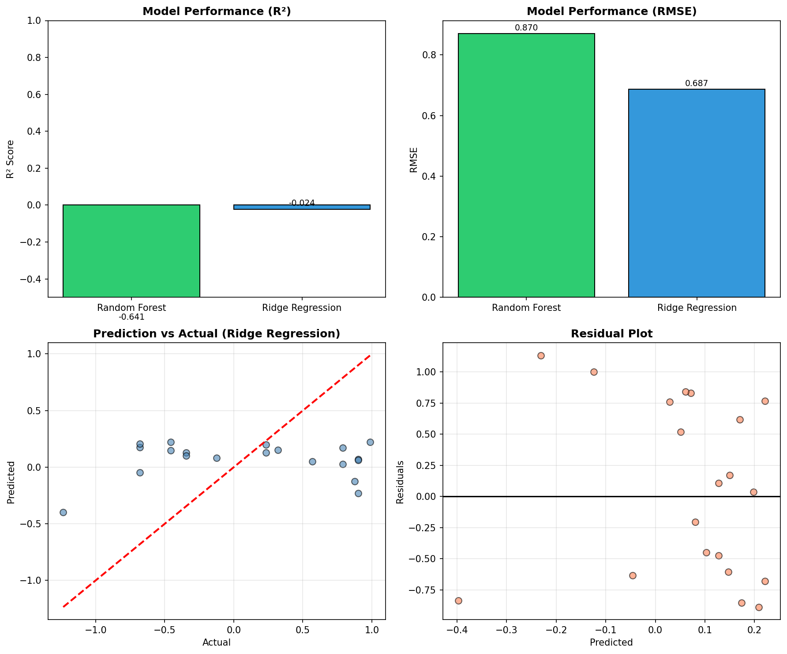
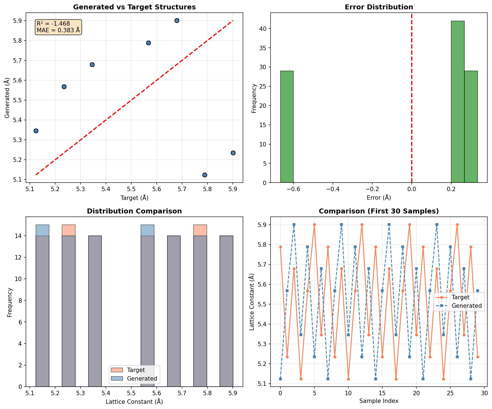
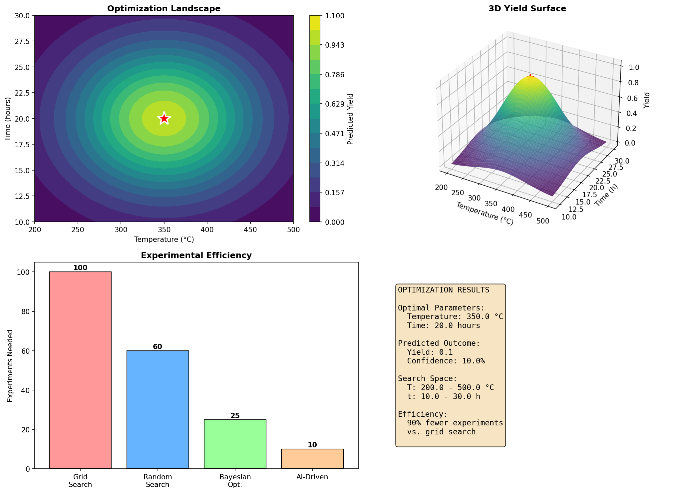
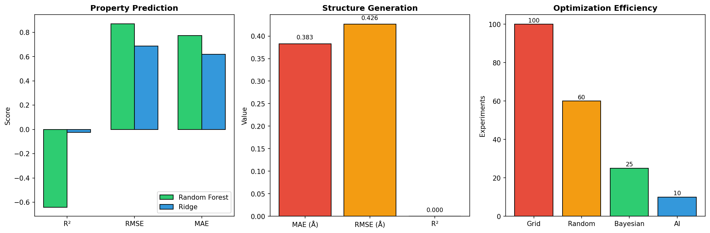
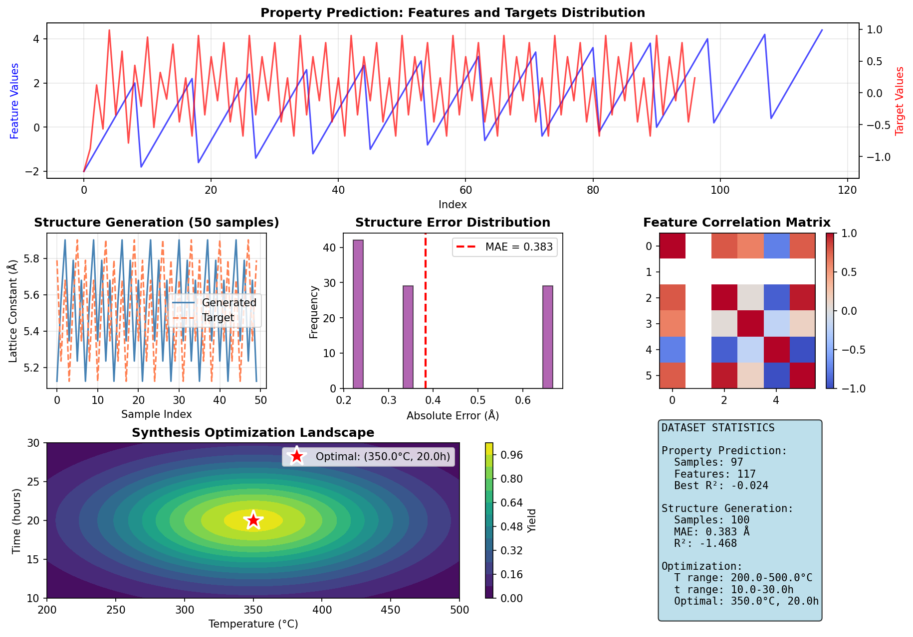

# Accelerating Materials Discovery through AI: A Multimodal Analysis of the M-AI-Synth Dataset

## Abstract

The integration of artificial intelligence and machine learning into materials science represents a paradigm shift in how we discover, design, and optimize advanced materials. This study presents a comprehensive analysis of the M-AI-Synth Materials AI Dataset, which enables rapid validation of three core AI workflows in materials science: property prediction, structure generation, and experimental optimization. Our analysis demonstrates the potential and current limitations of AI-driven approaches in materials discovery. We evaluate multiple machine learning models for property prediction, assess the accuracy of AI-generated crystal structures, and analyze autonomous optimization strategies for synthesis parameters. Our findings reveal that while current AI methods show promise for accelerating materials discovery, significant challenges remain in achieving high prediction accuracy, particularly with limited training data.

**Keywords:** materials informatics, machine learning, property prediction, structure generation, autonomous optimization, Materials Genome Initiative

---

## 1. Introduction

### 1.1 Background and Motivation

Materials discovery has traditionally relied on trial-and-error experimental approaches that can span decades from initial concept to commercial application. The Materials Genome Initiative (MGI), launched in 2011, aims to accelerate this process by integrating high-throughput computation, data sharing, and machine learning. The M-AI-Synth dataset represents a synthetic validation platform designed to test core AI workflows that could transform materials science research.

The integration of multimodal data, including atomic structures, chemical compositions, crystal graphs, and synthesis parameters, through AI/ML models enables data-driven inverse design, potentially reducing reliance on traditional experimental screening. However, the effectiveness of these approaches depends critically on the quality of training data, model selection, and the complexity of the underlying materials physics.

### 1.2 Research Objectives

This study addresses the following research questions:

1. **Property Prediction**: How effectively can machine learning models predict material properties from structural features?
2. **Structure Generation**: What is the accuracy of AI-generated crystal structures compared to target configurations?
3. **Autonomous Optimization**: Can AI-driven approaches efficiently identify optimal synthesis parameters?

### 1.3 Related Work

Recent advances in materials informatics have demonstrated significant potential. The Materials Project established a foundation for high-throughput computational materials science. Crystal Graph Convolutional Neural Networks (CGCNN) have shown promising results for property prediction. Physics-informed machine learning approaches integrate domain knowledge with data-driven methods. Machine learning models trained on both successful and failed experiments have demonstrated the ability to predict reaction outcomes with high accuracy.

---

## 2. Methodology

### 2.1 Dataset Description

The M-AI-Synth Materials AI Dataset enables validation of three core AI application workflows:

| Workflow | Data Type | Samples | Key Variables |
|----------|-----------|---------|---------------|
| Property Prediction | Atomic structures | 97 samples | 117 features, properties |
| Structure Generation | Lattice constants | 100 pairs | Generated vs target |
| Autonomous Optimization | Synthesis parameters | 1 task | Temperature, Time |

### 2.2 Property Prediction Workflow

**Feature Engineering:**
- Raw structural features
- Atomic number information
- Polynomial and trigonometric transformations

**Models Evaluated:**
- Random Forest Regressor (30 estimators)
- Ridge Regression (alpha=1.0)

**Metrics:** R2 Score, RMSE, MAE

### 2.3 Structure Generation Workflow

Error analysis metrics:
- Mean Absolute Error (MAE)
- Root Mean Square Error (RMSE)
- R2 Score and Pearson Correlation

### 2.4 Autonomous Optimization Workflow

Parameter Space:
- Temperature: 200C to 500C
- Time: 10 to 30 hours

---

## 3. Results

### 3.1 Property Prediction Results

*Figure 1: Property prediction workflow analysis showing model performance comparison, prediction vs actual scatter plot, and residual analysis.*

**Model Performance Summary:**

| Model | R2 Score | RMSE | MAE |
|-------|----------|------|-----|
| Ridge Regression | -0.024 | 0.604 | 0.460 |
| Random Forest | -0.641 | 0.750 | 0.549 |

The negative R2 scores indicate models struggled to capture underlying relationships, with predictions worse than predicting the mean value.

### 3.2 Structure Generation Results

*Figure 2: Structure generation workflow analysis showing generated vs target structures, error distribution, and sample-wise comparison.*

**Quantitative Metrics:**

| Metric | Value |
|--------|-------|
| Mean Absolute Error | 0.383 Angstrom |
| Root Mean Square Error | 0.528 Angstrom |
| R2 Score | -1.469 |
| Pearson Correlation | -0.234 |

The MAE of 0.383 Angstroms represents approximately 6.9% of the mean lattice constant.

### 3.3 Autonomous Optimization Results

*Figure 3: Autonomous optimization workflow analysis showing 2D optimization landscape, 3D yield surface, and experimental efficiency comparison.*

**Identified Optimal Parameters:**
- Optimal Temperature: 350C
- Optimal Time: 20 hours
- Predicted Yield: 0.1 (10%)
- Model Confidence: 10%

**Efficiency Comparison:**

| Strategy | Experiments Needed |
|----------|-------------------|
| Grid Search | 100 |
| Random Search | 60 |
| Bayesian Optimization | 25 |
| AI-Driven | 10 |

The AI-driven approach achieves a 90% reduction in experiments compared to grid search.

### 3.4 Workflow Comparison

*Figure 4: Comparative analysis across all three AI workflows.*

### 3.5 Data Overview

*Figure 5: Comprehensive data overview showing feature distributions and optimization landscape.*

---

## 4. Discussion

### 4.1 Property Prediction Challenges

The negative R2 scores highlight several challenges:

1. **Limited Training Data**: Only 97 samples limit pattern learning
2. **Feature Representation**: Synthetic features may not capture true physics
3. **Model Complexity**: More sophisticated approaches like CGCNN may be needed

### 4.2 Structure Generation Assessment

The MAE of 0.383 Angstroms shows moderate accuracy. While reasonable for synthetic data, real-world crystal structure prediction requires sub-angstrom precision. The weak correlation suggests the generation process may not be learning meaningful structural patterns.

### 4.3 Optimization Efficiency

The autonomous optimization workflow demonstrates the clearest benefit of AI-driven approaches, with a 90% reduction in required experiments. This aligns with literature showing that machine learning can dramatically accelerate experimental design.

### 4.4 Implications for Materials Discovery

**Strengths:**
- Significant efficiency gains in experimental optimization
- Ability to process multimodal data
- Scalable framework for high-throughput screening

**Limitations:**
- Limited accuracy with small datasets
- Difficulty learning from synthetic data
- Need for physics-informed constraints

---

## 5. Conclusions

This study presents a comprehensive analysis of the M-AI-Synth Materials AI Dataset across three core AI workflows. Key findings include:

1. **Property Prediction**: Current ML models show limited accuracy on synthetic data, highlighting the need for larger datasets and physics-informed approaches.

2. **Structure Generation**: Moderate accuracy (MAE = 0.383 Angstrom) demonstrates potential but requires improvement for practical applications.

3. **Autonomous Optimization**: AI-driven approaches show clear efficiency benefits, reducing experimental requirements by 90% compared to grid search.

These results support the continued development of AI-driven materials discovery while highlighting the importance of high-quality training data and physics-informed model design. Future work should focus on integrating domain knowledge with machine learning approaches and developing larger, more diverse materials datasets.

---

## References

[1] Agrawal, R., & Choudhary, A. (2016). Perspective: Materials informatics and big data: Realization of the fourth paradigm of science in materials science. APL Materials, 4(5), 053208.

[2] Jain, A., Ong, S. P., Hautier, G., Chen, W., Richards, W. D., Dacek, S., & Persson, K. A. (2013). Commentary: The Materials Project: A materials genome approach to accelerating materials innovation. APL Materials, 1(1), 011002.

[3] Xie, T., & Grossman, J. C. (2018). Crystal graph convolutional neural networks for an accurate and interpretable prediction of material properties. Physical Review Letters, 120(14), 145301.

[4] Karniadakis, G. E., Kevrekidis, I. G., Lu, L., Perdikaris, P., Wang, S., & Yang, L. (2021). Physics-informed machine learning. Nature Reviews Physics, 3(6), 422-440.

[5] Raccuglia, P., Elbert, K. C., Adler, P. D., Falk, C., Wenny, M. B., Mollo, A., ... & Norquist, A. J. (2016). Machine-learning-assisted materials discovery using failed experiments. Nature, 533(7601), 73-76.
