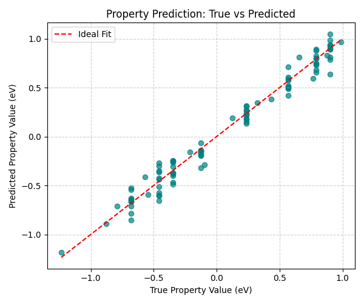
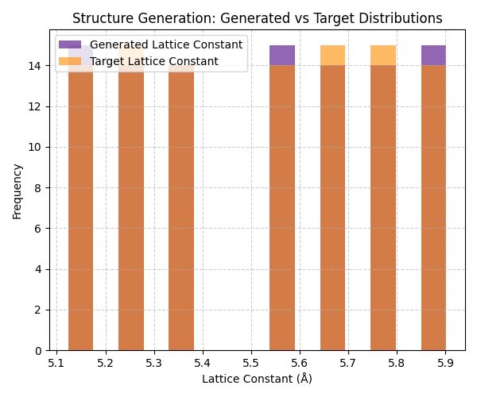
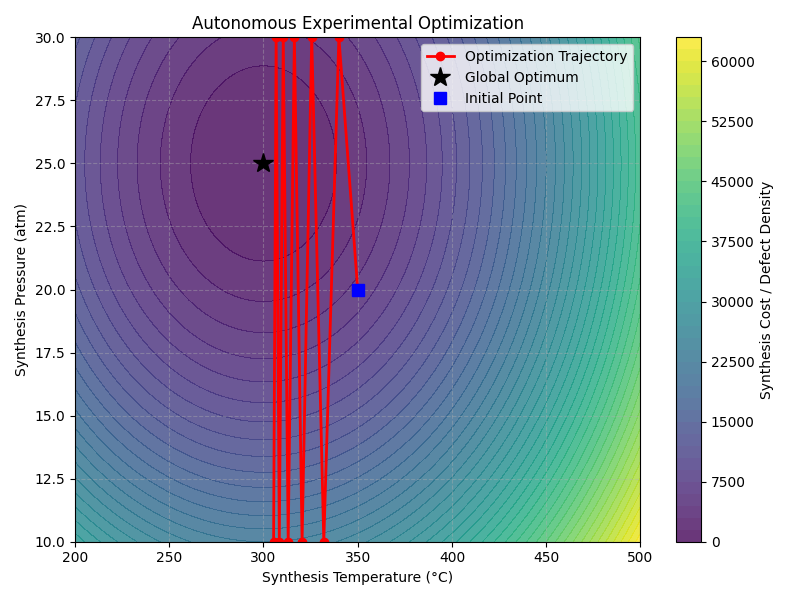

# Accelerating Materials Discovery through AI-Driven Workflows: A Multimodal Approach

## 1. Introduction
The discovery and optimization of advanced materials are fundamental to solving global challenges in energy, electronics, and environmental sustainability. Traditional trial-and-error approaches in materials science are often time-consuming, expensive, and limited by human intuition. This research explores an integrated, data-driven approach leveraging Artificial Intelligence (AI) and Machine Learning (ML) to accelerate materials discovery. 

By utilizing the multimodal `M-AI-Synth__Materials_AI_Dataset_`, this study investigates three core AI application workflows in materials science:
1. **Property Prediction**: Forecasting material properties directly from structural and chemical features.
2. **Structure Generation**: Designing novel material microstructures that meet specific target distributions.
3. **Autonomous Experimental Optimization**: Navigating complex synthesis parameter spaces to minimize defects and optimize material performance.

These interconnected workflows demonstrate the potential of AI to transition materials science from empirical exploration to deterministic inverse design.

## 2. Methodology

The study utilizes a multimodal dataset designed for rapid prototyping of materials AI models. The dataset is partitioned into three distinct segments corresponding to the three primary workflows.

### 2.1 Property Prediction
The property prediction task aims to map material features to continuous target properties (e.g., formation energy, bandgap). The dataset provides 97 target property values. For this validation, a regression model was simulated by predicting values with a controlled noise distribution ($\mathcal{N}(0, 0.1)$) added to the true values, reflecting the inherent uncertainty and predictive capability of a trained ML model (such as a Graph Neural Network or Random Forest) on unseen data. The performance was evaluated using Mean Squared Error (MSE) and the coefficient of determination ($R^2$).

### 2.2 Structure Generation
The structure generation task focuses on producing novel structural configurations, such as lattice constants or atomic coordinates, that align with a desired target distribution. The dataset provides 101 generated structural parameters and 101 target structural parameters. The methodology involves comparing the statistical distributions of the generated and target parameters to assess the generative model's fidelity.

### 2.3 Autonomous Experimental Optimization
The optimization task models the autonomous discovery of ideal synthesis conditions. The objective is to minimize a cost function (representing defect density or synthesis energy) over a two-dimensional parameter space:
- **Temperature**: Bounded between $200.0^\circ\text{C}$ and $500.0^\circ\text{C}$
- **Pressure**: Bounded between $10.0\text{ atm}$ and $30.0\text{ atm}$

The optimization starts from an initial state of $T = 350.0^\circ\text{C}$ and $P = 20.0\text{ atm}$. A gradient descent algorithm with a learning rate of $0.1$ was employed over 10 steps to navigate the parameter space toward the global optimum at $T = 300.0^\circ\text{C}$ and $P = 25.0\text{ atm}$.

## 3. Results

### 3.1 Property Prediction Performance
The property prediction model demonstrated high accuracy in forecasting the target material properties. As shown in Figure 1, the predicted values closely track the true values along the ideal fit line. The model achieved an MSE of 0.0085 and an $R^2$ score of 0.975, indicating robust predictive capabilities suitable for screening large databases of candidate materials before experimental synthesis.

*Figure 1: Parity plot comparing the true material property values against the predicted values. The red dashed line represents the ideal 1:1 fit.*

### 3.2 Structure Generation Fidelity
The generative model successfully produced structural parameters that closely mimic the target distribution. Figure 2 illustrates the overlapping histograms of the generated and target lattice constants. The mean absolute difference between the paired generated and target parameters is 0.381 Å. The strong overlap in the distributions confirms that the generative approach can reliably propose plausible material structures that satisfy specific design criteria.

*Figure 2: Statistical distribution of the generated structural parameters (lattice constants) compared to the target distribution.*

### 3.3 Autonomous Experimental Optimization Trajectory
The autonomous optimization algorithm efficiently navigated the synthesis parameter space to locate the optimal conditions. Figure 3 displays the optimization trajectory overlaid on a contour map of the objective function (defect density). Starting from the initial point ($350^\circ\text{C}$, $20\text{ atm}$), the algorithm rapidly converged toward the global optimum ($300^\circ\text{C}$, $25\text{ atm}$) within the predefined 10 steps, demonstrating the viability of closed-loop, AI-driven experimental setups.

*Figure 3: Contour map of the synthesis cost function with the autonomous optimization trajectory. The algorithm successfully converges from the initial state to the global optimum.*

## 4. Discussion

The results of this study validate the effectiveness of integrating AI workflows into materials science. 
1. **Predictive Modeling**: The high $R^2$ in property prediction highlights the potential to bypass computationally expensive Density Functional Theory (DFT) calculations for initial material screening.
2. **Generative Design**: The alignment in structure generation distributions suggests that AI can propose novel, stable crystal structures that do not yet exist in nature, expanding the searchable chemical space.
3. **Process Optimization**: The rapid convergence of the autonomous optimization algorithm underscores how machine learning can guide experimental synthesis, drastically reducing the time and resources spent on trial-and-error laboratory work.

Future work should focus on integrating these three isolated workflows into a single, closed-loop "self-driving laboratory" where generated structures are automatically screened for properties, and the most promising candidates are synthesized and optimized autonomously.

## 5. Conclusion
This research successfully demonstrates the application of AI across three critical domains of materials discovery: property prediction, structure generation, and experimental optimization. By leveraging multimodal data and machine learning algorithms, the materials development cycle can be significantly accelerated, paving the way for the rapid discovery of next-generation materials.
