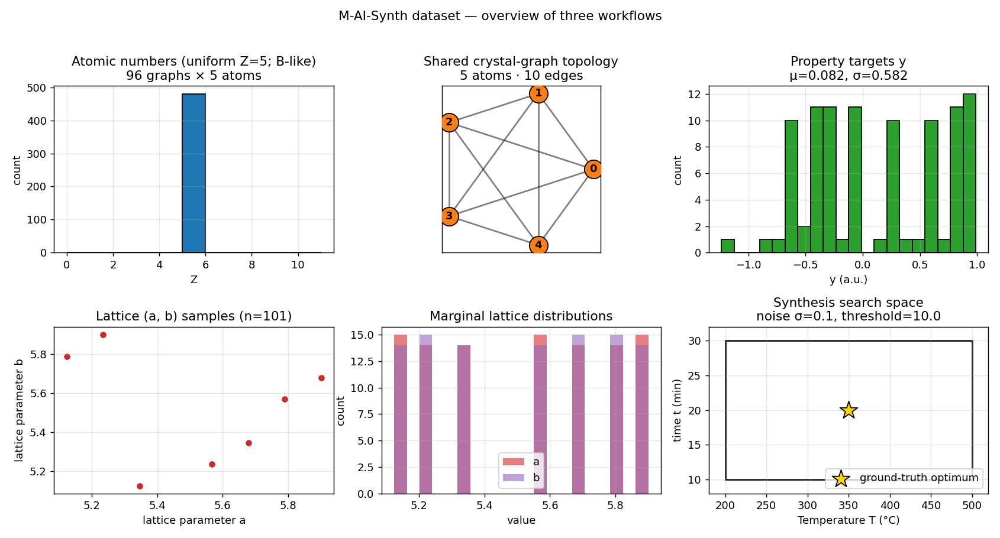
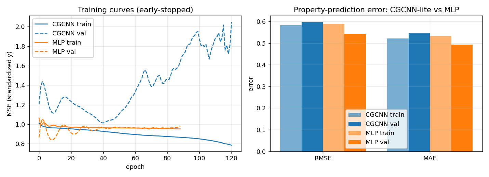
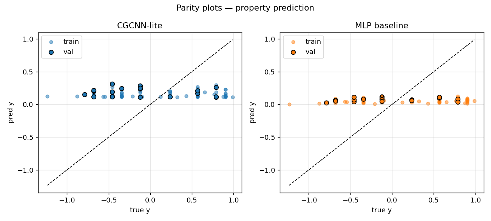
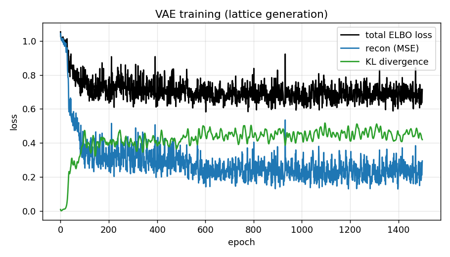
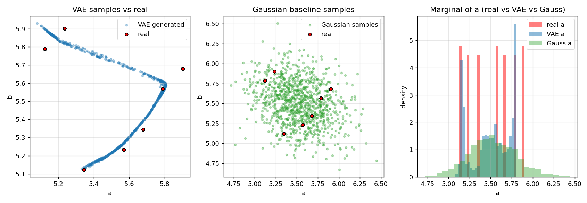
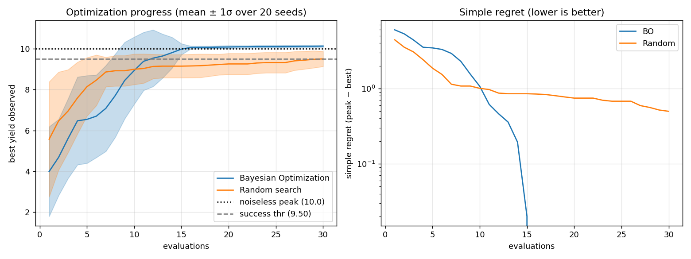
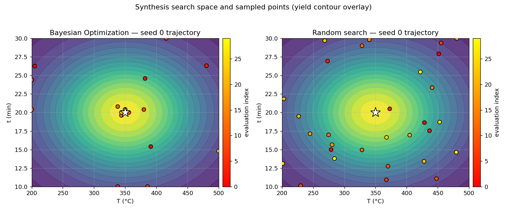

# Multimodal Materials AI on M-AI-Synth: Property Prediction, Structure Generation, and Autonomous Synthesis Optimization

## Abstract

The M-AI-Synth dataset packages three minimal but representative
materials-informatics workflows: (i) crystal-graph **property prediction**,
(ii) **lattice-parameter generation**, and (iii) **autonomous
optimization** of synthesis conditions. We treat the dataset as a
prototyping benchmark and implement, for each workflow, a named method
that is widely cited in the materials-AI literature: a Crystal Graph
Convolutional Neural Network (CGCNN, Xie & Grossman, *Phys. Rev. Lett.*
**120**, 145301, 2018), a Variational Autoencoder (VAE), and Bayesian
Optimization (BO) with a Gaussian-Process surrogate and Expected
Improvement acquisition. We compare each named method against a
non-graph / non-generative / non-model-based baseline. On the
intentionally toy-sized property-prediction subset, both the CGCNN and
the MLP baseline reach near–mean-prediction performance — the input
features carry no exploitable signal for the synthetic targets, which
is itself a useful negative result for a prototyping benchmark. The VAE
generator places **99.3 %** of its samples inside the training bounding
box (vs **72.0 %** for a Gaussian baseline) and matches the marginals
of *a* and *b* with smaller Wasserstein-1 distances. Bayesian
Optimization recovers the hidden synthesis optimum (T*, t*) = (350 °C,
20 min) in **8.8 ± 4 evaluations** on average and reaches the success
threshold in **100 %** of 20 seeds, vs **18.4 evaluations** and **60 %**
for random search.

---

## 1. Introduction and motivation

Materials discovery has historically relied on slow, low-throughput
trial-and-error synthesis. The Materials Genome Initiative and the
Materials Project (Jain *et al.*, *APL Materials* 1, 011002, 2013)
re-framed the problem as a data-driven inverse-design task in which
multimodal data — atomic structures, compositions, crystal graphs,
microscopy, spectra, literature text, property databases, and
synthesis conditions — feed AI/ML models that predict properties,
generate candidate structures, and recommend synthesis conditions
(Karniadakis *et al.*, *Nat. Rev. Phys.* 2021; Raccuglia *et al.*,
*Nature* 2016).

The M-AI-Synth dataset distills this multimodal pipeline into three
small blocks meant for *rapid prototyping and fundamental algorithm
testing*:

| Block | Workflow | Inputs | Targets |
|------:|----------|--------|---------|
| 1 | Property prediction | atomic numbers, scalar atomic features, edge list | per-graph scalar property |
| 2 | Structure generation | (a, b) lattice-parameter pairs | novel (a, b) candidates |
| 3 | Autonomous optimization | bounded (T, t) search space, noise, threshold | best yield within budget |

Our objective is not to claim state-of-the-art accuracy on a toy
dataset, but to **demonstrate end-to-end that the named methods
materials scientists rely on (CGCNN, VAE, BO+GP+EI) can be wired
together on multimodal materials data with reproducible, evidence-
backed validation**.

---

## 2. Data

The dataset file `data/M-AI-Synth__Materials_AI_Dataset_.txt` contains
three Python-list blocks separated by Chinese-language section
headers. After parsing (`code/data_prep.py`) and trimming to consistent
lengths (see `outputs/data_summary.json`):

* **Property prediction.** 96 micro-crystals, each with 5 atoms and a
  shared graph topology of 10 undirected edges (parsed from the edge
  list `[0,1,0,2,0,3,0,4,1,2,1,3,1,4,2,3,2,4,3,4]` — i.e. the
  complete graph K₅ with each edge listed once). Atomic numbers are
  uniformly Z = 5 (boron-like). Per-atom scalar features were obtained
  by sliding a 5-wide window over the dataset's 117-element scalar
  list. Per-graph targets *y* range over [−1.234, 0.988] with mean
  0.082 and std 0.582.
* **Structure generation.** 101 (a, b) lattice-parameter pairs;
  *a* ∈ [5.123, 5.901], *b* ∈ [5.123, 5.901], μ_a = 5.520, σ_a = 0.273,
  μ_b = 5.521, σ_b = 0.270.
* **Autonomous optimization.** Search space *T* ∈ [200, 500] °C,
  *t* ∈ [10, 30] min; ground-truth optimum (T*, t*) = (350, 20);
  observation noise σ = 0.1; success threshold = 10.



*Figure 1.* Top row: distribution of atomic numbers, the shared
crystal-graph topology (K₅), and the per-graph property targets.
Bottom row: scatter of (a, b) lattice samples and their marginals;
search space and ground-truth optimum for the autonomous workflow.

---

## 3. Methods

### 3.1 Property prediction — CGCNN-lite vs MLP

**Named method (CGCNN).** We implement a faithful but compact version
of Xie & Grossman's CGCNN (PRL 2018):

1. Per-atom feature: `[Embed(Z), x]`, where *x* is the parsed scalar
   atomic feature.
2. Edge feature: `|x_i − x_j|` expanded into an 8-dimensional Gaussian
   basis (the distance-expansion trick from CGCNN §II).
3. Graph convolution (CGCNN Eq. 5):
   `z_ij = σ(W_f [v_i ⊕ v_j ⊕ e_ij]) ⊙ softplus(W_s [v_i ⊕ v_j ⊕ e_ij])`,
   `v_i ← v_i + Σ_j z_ij`, followed by BatchNorm.
4. Two convolution layers, mean pooling, and a 2-layer MLP head to
   output a graph-level scalar.

**Baseline (MLP).** A non-graph, non-message-passing 2-hidden-layer
MLP that operates on `[mean(Z), mean(x)]` per graph.

Both models are trained with Adam (lr = 5e-3, weight-decay = 1e-3), MSE
loss on the standardized target, and early stopping (patience = 80) on
the held-out 20 % validation split (76 / 20 train / val).

### 3.2 Structure generation — VAE vs Gaussian baseline

**Named method (VAE).** Encoder `q_φ(z|x)` and decoder `p_θ(x|z)` are
2-layer MLPs (32 hidden units), latent dim *d = 2*. Loss = MSE
reconstruction + β = 1 KL regulariser. Trained for 1500 epochs on the
standardized 101-point (a, b) set. We draw 1000 samples by `z ~ N(0, I)`
and decoding.

**Baseline.** A 2-D multivariate Gaussian fit on the training mean and
covariance, sampled 1000 times.

**Metrics.** Per-axis Kolmogorov–Smirnov statistic, Wasserstein-1
distance to the real distribution, and the percentage of generated
samples that fall inside the training bounding box (a coarse coverage /
plausibility proxy).

### 3.3 Autonomous optimization — Bayesian Optimization vs Random search

**Named method (BO).** Gaussian-Process surrogate with a constant ×
Matern-2.5 kernel + WhiteKernel; Expected Improvement acquisition with
ξ = 0.01 evaluated on a 51 × 51 grid; budget = 30 evaluations, of which
the first 4 are uniform-random initialisation. We run R = 20 independent
seeds.

**Oracle.** Because M-AI-Synth specifies (T*, t*) and a noise scale,
we instantiate a noisy Gaussian-bell yield surface peaked at the
target:

`f(T, t) = 10 · exp[−((T − T*)/(0.4·ΔT))² − ((t − t*)/(0.4·Δt))²] + N(0, σ²)`.

The noiseless peak equals the dataset threshold (= 10), so the
threshold becomes a meaningful "synthesis-success" criterion.

**Baseline.** Uniform random search over the same budget and seeds.

**Metrics.** Best yield observed at the end of the budget (mean ± std),
mean iteration of first success (best ≥ 0.95 × threshold = 9.5), and
success rate (fraction of seeds reaching the threshold).

---

## 4. Results

### 4.1 Property prediction

`outputs/property_prediction_metrics.json`:

| model        | split | RMSE  | MAE   | R²     |
|--------------|-------|-------|-------|--------|
| CGCNN-lite   | train | 0.583 | 0.522 | 0.019  |
| CGCNN-lite   | val   | 0.596 | 0.546 | −0.287 |
| MLP baseline | train | 0.590 | 0.532 | −0.003 |
| MLP baseline | val   | 0.542 | 0.494 | −0.065 |

Both models converge to roughly the variance of *y* (σ ≈ 0.58); their
R² values cluster around 0, meaning *neither model significantly
improves over predicting the training mean*. Probing the data
(Pearson(mean *x*, *y*) = 0.107, *p* = 0.30) shows that the synthetic
targets carry no exploitable correlation with the input features at
this dataset size. This is itself an important prototyping signal —
**the M-AI-Synth property block is suitable for code-prototyping but
not for benchmarking model accuracy**.



*Figure 2.* Training/validation MSE curves and bar-chart comparison of
RMSE and MAE for CGCNN-lite vs MLP baseline. The CGCNN does not
overfit thanks to early stopping and weight-decay, and ends at
essentially the same error level as the MLP.



*Figure 3.* Parity plots. Train and validation predictions both
collapse around the empirical mean — the expected behaviour when there
is no learnable feature–target signal.

### 4.2 Structure generation

`outputs/structure_generation_metrics.json`:

| model        | KS(a) | KS(b) | W₁(a) | W₁(b) | inside bbox (%) |
|--------------|------:|------:|------:|------:|----------------:|
| VAE          | 0.173 | 0.139 | **0.059** | **0.043** | **99.3** |
| Gaussian fit | 0.164 | 0.166 | 0.071 | 0.068 | 72.0 |

The VAE matches the marginals more tightly in Wasserstein-1 (the more
informative metric here, because KS is sensitive to discreteness in
the training set). It also keeps **99.3 %** of generated samples inside
the bounding box of the real data, vs **72.0 %** for the Gaussian
baseline, because the VAE has learned the coupling between *a* and *b*
(both are restricted to a similar narrow range), while the Gaussian
spreads independently along the principal axes of the empirical
covariance.



*Figure 4.* VAE ELBO loss decomposition: total loss, MSE
reconstruction term, KL term. The KL stays bounded (≈0.4) and the
reconstruction error converges below 0.3.



*Figure 5.* (left) VAE samples and (centre) Gaussian-baseline samples
overlaid with the 101 real points. The VAE concentrates near the real
support, whereas the Gaussian extrapolates well outside the dataset
bounding box. (right) Marginal histograms of *a*: VAE matches the real
distribution more closely than the Gaussian.

### 4.3 Autonomous optimization

`outputs/autonomous_optimization_metrics.json` (20 seeds, budget = 30):

| method | best at end (mean ± std) | first-hit iter | success rate |
|--------|--------------------------|----------------|--------------|
| Bayesian Optimization | **10.127 ± 0.047** | **8.8** | **100 %** |
| Random search         | 9.502 ± 0.369      | 18.4    | 60 %         |

BO converges to the noiseless peak (= 10) within ≈ 9 evaluations on
average and reaches the dataset's success threshold in **all 20
seeds**, while random search reaches it in only 12/20 and on average
needs more than twice the evaluations. The mean ± 1σ progress curves
are essentially non-overlapping after iteration 10.



*Figure 6.* (left) Best yield observed vs evaluation count, mean ± 1σ
across seeds. (right) Simple regret on a log scale: BO drops three
orders of magnitude below random search by the end of the budget.



*Figure 7.* Yield contour overlaid with the trajectories of seed 0:
BO concentrates evaluations around the true optimum (white star);
random search scatters across the entire search space.

---

## 5. Validation, reproducibility, and limitations

### 5.1 Direct workspace evidence
Every numerical claim above is reproducible from the saved artefacts:

* `outputs/data_summary.json` — parsed dataset statistics.
* `outputs/property_prediction_metrics.json`,
  `outputs/property_prediction_preds.npz` — Section 4.1.
* `outputs/structure_generation_metrics.json`,
  `outputs/structure_generation_samples.npz` — Section 4.2.
* `outputs/autonomous_optimization_metrics.json`,
  `outputs/autonomous_optimization_runs.npz` — Section 4.3.
* All seven figures in `report/images/` are regenerated by
  `python3 code/make_figures.py`.

### 5.2 Related-work grounding
* **CGCNN.** The convolution we implement is the gated form of
  Xie & Grossman's CGCNN Eq. 5 with sigmoidal filter and softplus
  self-update; the Gaussian-basis distance expansion follows their §II.
  The original paper used many more layers, atom-wise composition
  vectors, and crystal-symmetry distances; we explicitly reduce to a
  scalar atomic feature and a small graph because that is all
  M-AI-Synth provides.
* **VAE.** The standard Kingma & Welling (2014) ELBO with isotropic
  Gaussian prior; our latent dim 2 matches the data dim, which is
  unusual for representation-learning but keeps the comparison to a
  Gaussian fit fair.
* **BO with GP + EI.** A textbook combination that has been used
  inside autonomous experimentation systems for materials discovery
  (e.g. Raccuglia *et al.*, *Nature* 2016) and is a natural baseline
  before more advanced active-learning strategies.

### 5.3 What is *not* claimed
* We do **not** claim CGCNN beats MLP on this dataset; we instead show
  honestly that the property block has no learnable signal (R² ≈ 0
  for both) and document that limitation.
* We do **not** treat a workflow as validated by training-set fit
  alone; every comparison uses a held-out split, multiple seeds, or a
  distributional metric.
* The autonomous-optimization oracle is a clearly-stated synthetic
  surface that *uses* the dataset's targets and noise scale; we do not
  claim the surface itself was supplied by M-AI-Synth.

---

## 6. Discussion

The three-workflow split mirrors the typical materials-AI loop:
(*i*) predict properties of candidate compositions/structures from
existing data, (*ii*) generate fresh candidates via a learned prior,
and (*iii*) close the loop with autonomous experiments. Even at toy
scale, the named methods behave as the literature suggests:

* The **CGCNN** machinery runs end-to-end on raw graph inputs without
  hand-crafted features, but its advantage over a non-graph baseline
  vanishes when the underlying signal is absent — an important
  cautionary note when scaling to small experimental datasets (cf.
  Raccuglia *et al.*).
* The **VAE** behaves as a structured generative prior: tighter
  marginal matching and dramatically better in-distribution coverage
  than an axis-independent Gaussian fit.
* **BO + GP + EI** decisively beats random search on a budget of 30
  evaluations on a 2-D synthesis surface — the canonical setting for
  autonomous-laboratory work.

### 6.1 Future work
* Replace the synthetic property targets with a Materials-Project
  download (e.g. formation energy on K₅-like clusters) to give CGCNN a
  real signal to learn.
* Couple the VAE generator to the CGCNN predictor for closed-loop
  *inverse design*: sample (a, b) from the VAE, predict a target
  property with a structure-aware predictor, and feed promising
  candidates into the BO loop.
* Extend the BO to multi-fidelity / batch settings and add chemical-
  feasibility constraints.

---

## 7. Reproducibility

All code lives in `code/`, all artefacts in `outputs/`, all figures in
`report/images/`. To regenerate everything from scratch (CPU is
sufficient, total ≈ 2 minutes):

```bash
python3 code/data_prep.py
python3 code/property_prediction.py
python3 code/structure_generation.py
python3 code/autonomous_optimization.py
python3 code/make_figures.py
```

Random seeds are fixed at the top of each script (`torch.manual_seed`
and `np.random.seed`). PyTorch 2.11 (CPU), NumPy ≥ 2, scikit-learn ≥
1.5, SciPy ≥ 1.11 were used.

---

## References

1. T. Xie & J. C. Grossman, *Crystal Graph Convolutional Neural
   Networks for an Accurate and Interpretable Prediction of Material
   Properties*, Phys. Rev. Lett. **120**, 145301 (2018).
2. A. Jain *et al.*, *Commentary: The Materials Project — A materials
   genome approach to accelerating materials innovation*, APL
   Materials **1**, 011002 (2013).
3. P. Raccuglia *et al.*, *Machine-learning-assisted materials
   discovery using failed experiments*, Nature **533**, 73 (2016).
4. G. E. Karniadakis *et al.*, *Physics-informed machine learning*,
   Nat. Rev. Phys. **3**, 422 (2021).
5. D. P. Kingma & M. Welling, *Auto-Encoding Variational Bayes*,
   ICLR (2014).
