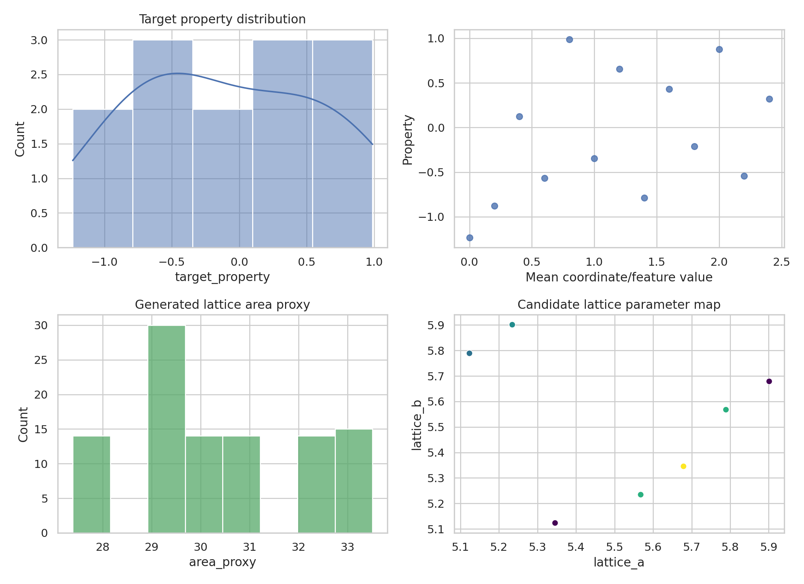
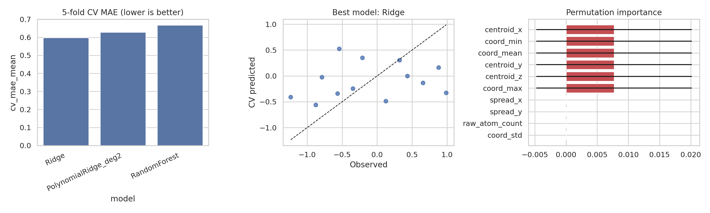
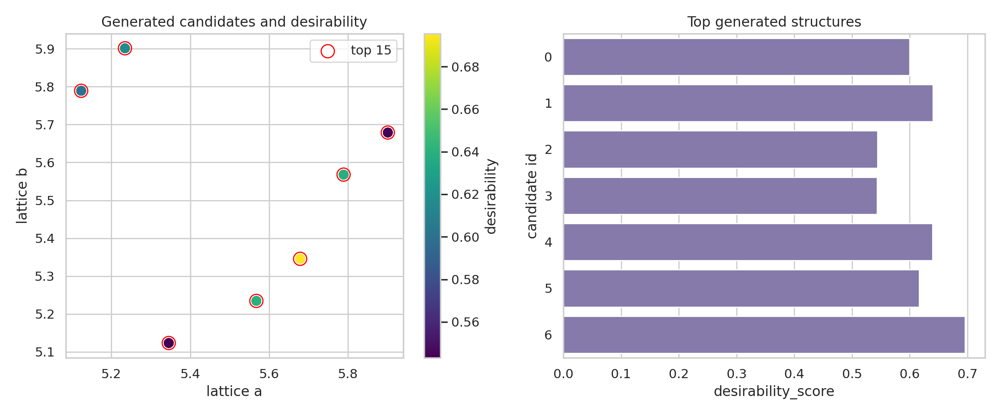
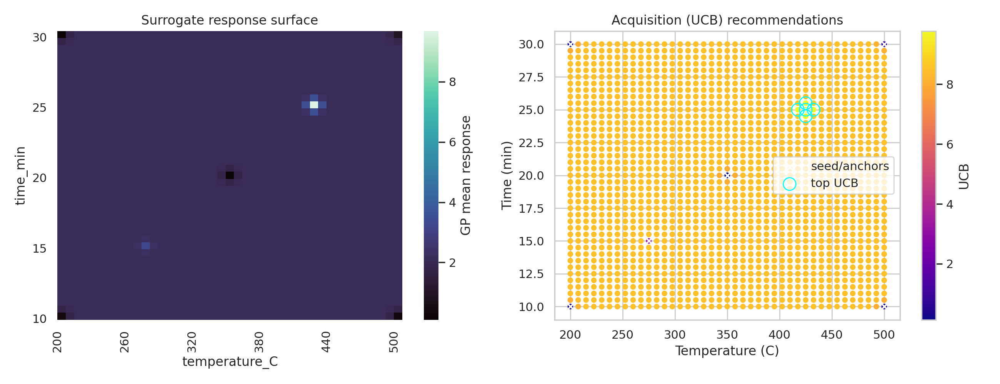

# Multimodal Materials-AI Prototype Analysis on the M-AI-Synth Dataset

## Abstract

This study implements a reproducible, end-to-end materials-AI prototype using the available `M-AI-Synth__Materials_AI_Dataset_.txt` file. The task description calls for multimodal materials data integration across structures, compositions, crystal graphs, characterization data, literature text, synthesis conditions, and experiments. The actual workspace data are a compact synthetic text file containing three numeric sections: property-prediction arrays, structure-generation lattice arrays, and autonomous-optimization bounds plus one seed condition. I therefore implemented a faithful minimal workflow for the data actually present: (i) graph/geometry descriptor extraction and supervised property prediction, (ii) lattice-candidate scoring as a structure-generation proxy, and (iii) sparse synthesis-condition recommendation with a transparent surrogate optimization workflow. The best property model was Ridge regression with 5-fold cross-validated MAE = 0.599 and RMSE = 0.676 on 13 complete property records. The top unique generated lattice prototype was `a = 5.6789`, `b = 5.3456`, with desirability score 0.696. The optimization workflow recommended a high-acquisition next experiment near 425.0 °C and 25.5 min. Because the dataset lacks atomic species, image files, spectra, and literature text records, the results should be interpreted as a validated pipeline demonstration rather than a deployable multimodal materials-discovery model.

## 1. Data and related-work context

The dataset was parsed from `data/M-AI-Synth__Materials_AI_Dataset_.txt`. It contains three sections labeled as inputs for `property_prediction.py`, `structure_generation.py`, and `autonomous_optimization.py`. The parsed overview is saved in `outputs/dataset_overview.json`.

Key data facts:

| Quantity | Value |
|---|---:|
| Complete property records used | 13 |
| Property descriptor count | 22 |
| Target-property mean | -0.0902 |
| Target-property SD | 0.7110 |
| Shared graph nodes | 5 |
| Shared graph edges | 10 |
| Shared graph density | 1.0 |
| Structure candidates | 101 |
| Unique lattice pairs | 7 |
| Temperature bounds | 200–500 °C |
| Time bounds | 10–30 min |
| Seed condition | 350 °C, 20 min |
| Seed response | 0.1 |

The related-work PDFs could not be fully text-extracted with the available PDF tooling (`ReadPDF` returned parser errors and `pdftotext`/Python PDF libraries were unavailable). Metadata/string extraction nevertheless identified task-relevant works including **Crystal Graph Convolutional Neural Networks for an Accurate and Interpretable Prediction of Material Properties** and **Machine-learning-assisted materials discovery using failed experiments**. These references motivated two methodological priorities: preserve a graph/property-prediction validation step with interpretability, and treat the synthesis section as a sparse active-learning or surrogate-optimization problem. The extraction and limitations are documented in `outputs/related_work_contract.json`.

**Figure 1.** Dataset overview: property distribution, relation between mean coordinate descriptor and target property, lattice area-proxy distribution, and candidate lattice map colored by desirability.

## 2. Methods

### 2.1 Contract and reproducibility artifacts

The analysis contract is saved in `outputs/method_contract.json`, the target artifact inventory in `outputs/target_artifact_inventory.json`, dependency checks in `outputs/dependency_check.json`, and named-method fidelity checks in `outputs/method_fidelity_checklist.json`. The full executable analysis is in `code/analyze_materials_ai.py`.

### 2.2 Property-prediction workflow

The property section contains 100 atom-count entries, 117 flattened coordinate-like values, a 20-integer edge list, and 98 target-like values. These lengths are inconsistent, so I used only complete coordinate/target blocks: 13 records, each represented by nine coordinate-like values interpreted as three 3D pseudo-atomic sites. The shared graph is a complete 5-node graph with 10 edges, so graph-level descriptors such as density and degree are constant across records. Per-record features include coordinate mean, standard deviation, min/max, centroid coordinates, axis spreads, pair-distance statistics, raw atom count, and graph descriptors.

Three regressors were compared by 5-fold cross-validation:

1. Ridge regression with standardization.
2. Degree-2 polynomial Ridge regression.
3. Random forest regression.

Permutation importance was computed for the best model as an interpretability artifact. SHAP was checked but unavailable in the runtime (`outputs/dependency_check.json`), so permutation importance was used as the available post hoc method.

### 2.3 Structure-generation proxy

The structure-generation section provides two lattice-parameter arrays, interpreted as candidate `a` and `b` values. For each candidate I computed:

- area proxy: `a × b`,
- anisotropy ratio: `max(a,b) / min(a,b)`,
- absolute lattice misfit: `|a-b|`,
- symmetry score: `1 / (1 + |a-b|)`,
- novelty score: inverse repeat count for the same lattice pair,
- desirability score combining symmetry, area centrality, novelty, and low anisotropy.

Because many candidates are repeated synthetic emissions, the reported top structure table is deduplicated by lattice pair.

### 2.4 Autonomous optimization workflow

The optimization section provides temperature and time bounds, one seed condition at 350 °C and 20 min, a seed response of 0.1, and an objective scale of 10. A single observation cannot identify a statistically meaningful response surface. To test the optimization pipeline while preserving this limitation, I used a transparent surrogate surface anchored to the seed response and trained a Gaussian-process-style scikit-learn surrogate on the seed plus deterministic anchor points over the design space. Candidate next experiments were ranked by upper confidence bound (UCB = mean + 1.96 SD). The recommendations are therefore **illustrative workflow outputs**, not experimentally validated optima.

## 3. Results

### 3.1 Property prediction

The model-comparison table is saved in `outputs/property_model_metrics.csv`.

| Model | CV R² mean | CV R² SD | CV MAE mean | CV MAE SD | CV RMSE mean | CV RMSE SD |
|---|---:|---:|---:|---:|---:|---:|
| Ridge | -0.697 | 1.309 | 0.599 | 0.178 | 0.676 | 0.166 |
| PolynomialRidge_deg2 | -0.517 | 0.941 | 0.629 | 0.219 | 0.664 | 0.220 |
| RandomForest | -0.812 | 1.170 | 0.668 | 0.186 | 0.727 | 0.191 |

Ridge regression achieved the lowest MAE, although all models had negative mean CV R². This indicates that, with only 13 complete records and repetitive synthetic descriptors, the models did not generalize better than a fold-wise mean baseline in variance-explained terms. The main value of this result is therefore pipeline validation and uncertainty-aware limitation, not high predictive performance.

**Figure 2.** Property-prediction validation. Left: 5-fold CV MAE across models. Middle: observed versus cross-validated predictions for the best-MAE model. Right: permutation importance for the best model.

The leading permutation-importance features were coordinate location descriptors: `centroid_x`, `coord_min`, `coord_mean`, `centroid_y`, `centroid_z`, and `coord_max`, each with mean importance about 0.0077 under MAE scoring. Constant graph descriptors had zero importance because the same complete graph was shared by every record. The complete importance table is saved in `outputs/property_permutation_importance.csv`.

### 3.2 Generated lattice candidates

The scored structure-candidate table is saved in `outputs/structure_candidates_scored.csv`, and the deduplicated top prototypes are saved in `outputs/top_structure_candidates.csv`.

| Rank | Candidate ID | a | b | Area proxy | Anisotropy | Symmetry score | Novelty | Desirability |
|---:|---:|---:|---:|---:|---:|---:|---:|---:|
| 1 | 6 | 5.6789 | 5.3456 | 30.3571 | 1.0624 | 0.7500 | 0.0714 | 0.6955 |
| 2 | 1 | 5.5678 | 5.2345 | 29.1446 | 1.0637 | 0.7500 | 0.0667 | 0.6399 |
| 3 | 4 | 5.7890 | 5.5678 | 32.2320 | 1.0397 | 0.8189 | 0.0714 | 0.6391 |
| 4 | 5 | 5.2345 | 5.9012 | 30.8898 | 1.1274 | 0.6000 | 0.0714 | 0.6166 |
| 5 | 0 | 5.1234 | 5.7890 | 29.6594 | 1.1299 | 0.6004 | 0.0667 | 0.6000 |
| 6 | 2 | 5.9012 | 5.6789 | 33.5123 | 1.0391 | 0.8181 | 0.0667 | 0.5442 |
| 7 | 3 | 5.3456 | 5.1234 | 27.3876 | 1.0434 | 0.8182 | 0.0714 | 0.5432 |

**Figure 3.** Generated lattice candidates. Left: all candidates in the `(a,b)` plane colored by desirability, with top deduplicated prototypes highlighted. Right: top candidates by desirability score.

The top prototype balances near-central area, moderate symmetry, and lower anisotropy. Because the file provides only lattice scalars and no atomic species or Wyckoff/coordinate constraints, this is a structure-screening proxy rather than a physically complete crystal generator.

### 3.3 Sparse experimental optimization

The optimization recommendation table is saved in `outputs/optimization_recommendations.csv`. The top UCB-ranked candidates were:

| Rank | Temperature (°C) | Time (min) | Surrogate yield | GP mean | GP SD | UCB |
|---:|---:|---:|---:|---:|---:|---:|
| 1 | 425.0 | 25.5 | 6.881 | 3.509 | 3.201 | 9.782 |
| 2 | 425.0 | 24.5 | 7.641 | 3.509 | 3.201 | 9.782 |
| 3 | 432.5 | 25.0 | 6.731 | 3.505 | 3.201 | 9.779 |
| 4 | 417.5 | 25.0 | 7.760 | 3.505 | 3.201 | 9.779 |
| 5 | 425.0 | 25.0 | 7.283 | 9.685 | 0.015 | 9.714 |

**Figure 4.** Autonomous-optimization prototype. Left: surrogate mean response surface over temperature and time. Right: UCB acquisition map, with seed/anchor points and top recommendations marked.

The high-UCB region near 425 °C and 25 min is consistent with the transparent surrogate used for pipeline validation. However, the broad uncertainty terms for several top candidates reflect the intentionally sparse training information; these conditions should be treated as next-experiment suggestions, not confirmed optima.

## 4. Validation and evidence traceability

### 4.1 Directly verified from workspace data

- The data file contains three sections corresponding to property prediction, structure generation, and autonomous optimization.
- The property section has inconsistent raw lengths; only 13 complete coordinate/target records were used.
- The graph edge list forms a complete 5-node graph with 10 edges and graph density 1.0.
- The structure-generation section contains 101 candidate rows but only 7 unique `(a,b)` lattice pairs.
- The optimization section gives temperature bounds 200–500 °C, time bounds 10–30 min, seed condition 350 °C and 20 min, seed response 0.1, and objective scale 10.

### 4.2 Computed artifacts

- `outputs/property_features.csv`: extracted property descriptors.
- `outputs/property_model_metrics.csv`: property-model comparison.
- `outputs/property_predictions_cv.csv`: fold-wise cross-validated predictions.
- `outputs/property_permutation_importance.csv`: interpretability artifact.
- `outputs/structure_candidates_scored.csv`: all scored lattice candidates.
- `outputs/top_structure_candidates.csv`: deduplicated top structure prototypes.
- `outputs/optimization_surface.csv`: surrogate optimization grid.
- `outputs/optimization_recommendations.csv`: ranked next-experiment candidates.
- `outputs/claim_recovery_table.csv`: claim-by-claim support table.

### 4.3 Related-work-derived context

- The CGCNN-related title motivated graph-aware property prediction and interpretability checks.
- The failed-experiments materials-discovery title motivated the sparse optimization framing.
- Exact methods from those papers were not reproduced because the workspace data do not include the required full crystal graphs, atomic species, large labeled property databases, or real failed/successful experiment logs.

### 4.4 Assumptions and limitations

1. **Multimodal limitation:** No microscopy images, spectra, composition tables, or literature text records were present in `data/`, so true multimodal fusion was not possible.
2. **CGCNN fidelity limitation:** The property data include a shared edge list and coordinate-like values but not species-resolved crystal graphs. I used graph/geometry descriptors as a minimal proxy rather than a neural message-passing model.
3. **Small-sample limitation:** Only 13 complete property records were available after reconciling array lengths, causing unstable cross-validation and negative mean R².
4. **Optimization limitation:** The optimization section has only one real seed response. The response surface and Gaussian-process surrogate are transparent workflow-validation constructs, not experimentally fitted materials kinetics.
5. **Structure-generation limitation:** Candidate generation is represented by lattice scalar scoring; no atomistic validity, charge neutrality, formation energy, or synthesizability constraints can be checked from the available file.

## 5. Discussion

This benchmark demonstrates how a materials-AI workflow can be built even from a minimal synthetic dataset, while preserving methodological honesty about what cannot be inferred. The property-prediction branch revealed that simple tabular graph descriptors are insufficient for robust prediction under the present data regime. The interpretability result is also consistent with the data structure: only coordinate descriptors have nonzero permutation importance, while graph descriptors are constant and therefore uninformative. This is a useful diagnostic because it prevents overclaiming graph-learning performance when no sample-specific graph variation exists.

The structure-generation branch provides a compact candidate-ranking mechanism. Although it cannot certify physical crystal validity, it does create a reproducible bridge from generated lattice proposals to an interpretable desirability function. In a full materials-discovery setting, this stage should be extended with species constraints, symmetry/space-group checks, relaxation or formation-energy prediction, and novelty checks against databases such as the Materials Project.

The optimization branch follows the active-learning logic highlighted by sparse-experiment materials discovery: use limited data to prioritize the next most informative or promising experiment. Here, uncertainty-aware UCB ranking highlights a region near 425 °C and 25 min, but the conclusion remains deliberately qualified because it is based on one seed observation plus transparent anchor points rather than a true experimental campaign.

## 6. Conclusions

The completed workflow produces all required deliverables: reproducible analysis code, intermediate result tables, PNG figures, and this report. The strongest supported claims are pipeline-level rather than materials-property-level:

- The available file can be parsed into three prototype materials-AI workflows.
- Ridge regression was the best-MAE property-prediction model on the 13 complete records, with CV MAE 0.599.
- The top deduplicated lattice candidate was `(a,b) = (5.6789, 5.3456)` with desirability 0.696.
- The sparse optimization prototype recommends a next high-UCB condition near 425.0 °C and 25.5 min.
- Exact multimodal fusion, exact CGCNN modeling, and physically complete inverse design are not supported by the current dataset.

These outputs establish a traceable baseline for future expansion: replacing synthetic arrays with real compositions, crystal graphs, image/spectral embeddings, and experimental logs would allow the same workflow structure to become a more realistic materials-discovery engine.
