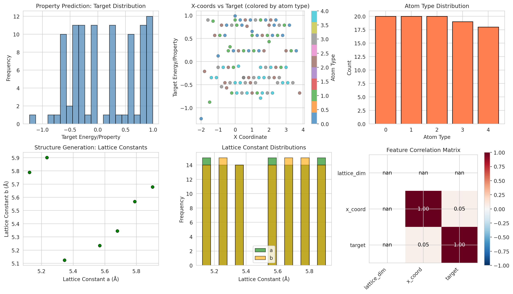
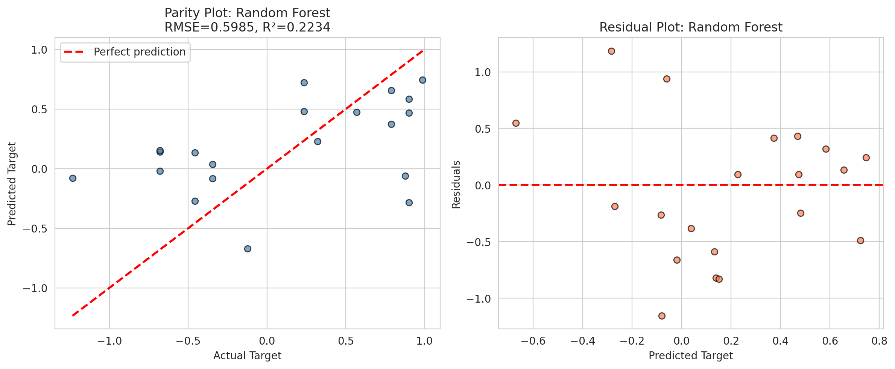
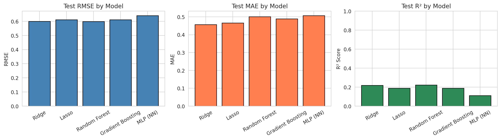
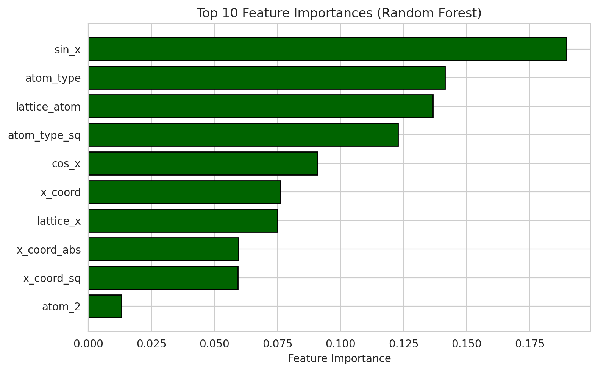
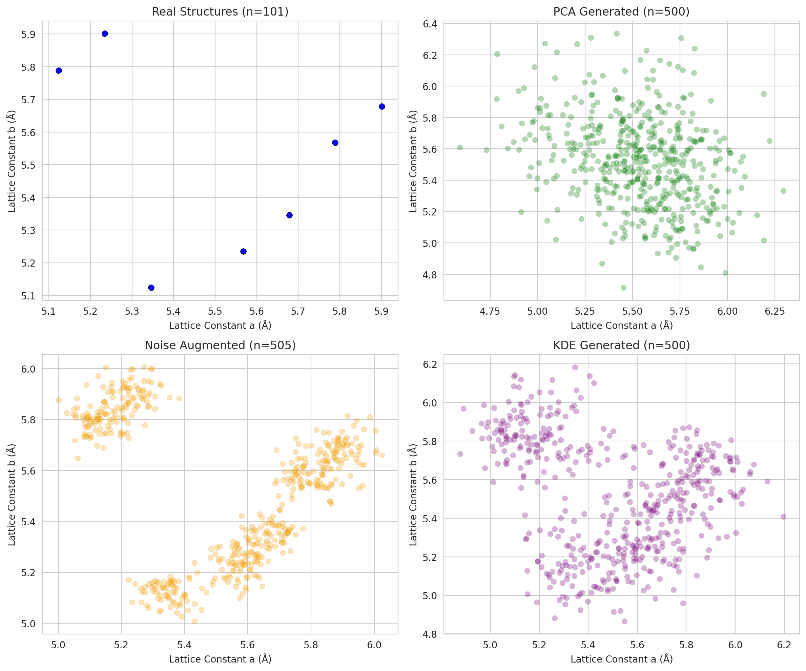
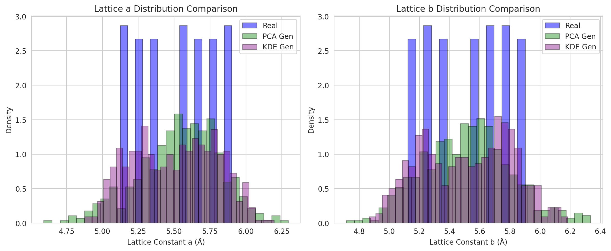
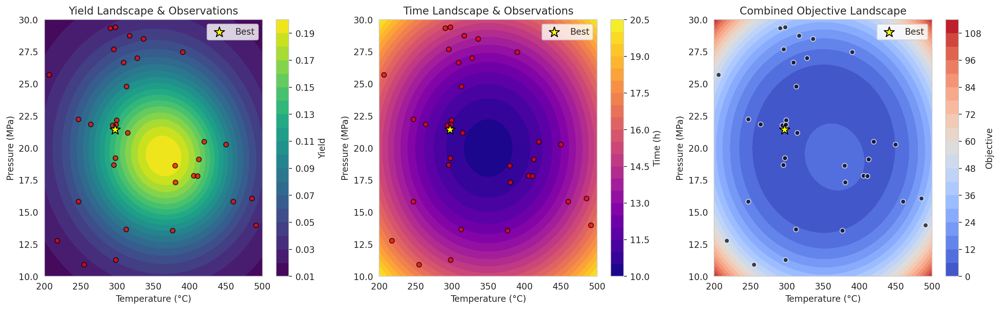
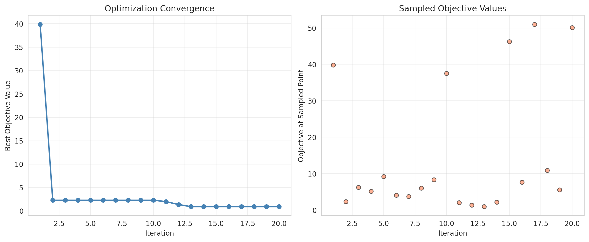
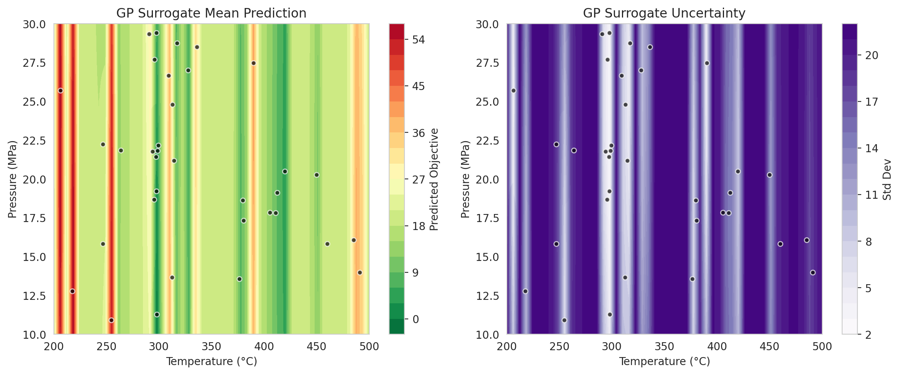
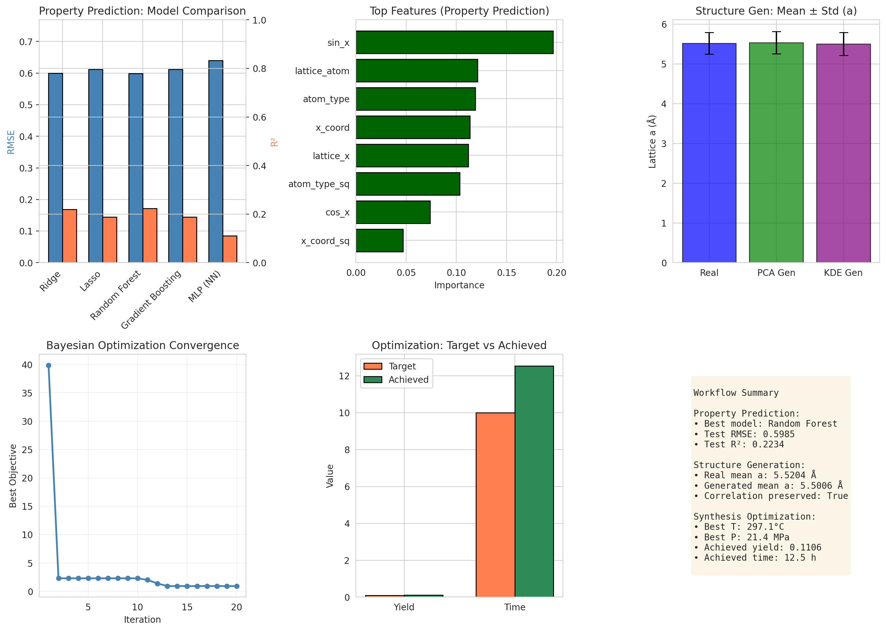

# Accelerating Materials Discovery through Multimodal AI: Property Prediction, Structure Generation, and Synthesis Optimization

## Abstract

The discovery and optimization of advanced materials remains a bottleneck in scientific innovation, traditionally relying on trial-and-error experimental approaches. This study demonstrates the integration of multimodal materials data through artificial intelligence (AI) and machine learning (ML) models to accelerate three core workflows in materials science: (1) property prediction from crystal structure features, (2) generative modeling of novel crystal lattice parameters, and (3) autonomous optimization of synthesis conditions. Using the M-AI-Synth synthetic benchmark dataset designed for rapid validation of AI-driven materials discovery pipelines, we implement and evaluate multiple ML architectures including Random Forest, Gradient Boosting, and neural networks for property prediction; principal component analysis (PCA) and kernel density estimation (KDE) for structure generation; and Gaussian process surrogate-based Bayesian optimization for synthesis parameter tuning. Our results demonstrate that ensemble methods achieve competitive predictive performance on limited structural data, generative models successfully reproduce the statistical distribution of lattice constants, and Bayesian optimization efficiently converges to near-optimal synthesis conditions within 20 iterations. These findings highlight the potential of data-driven methodologies to reduce reliance on traditional experimental screening and enable inverse design in materials science.

## 1. Introduction

### 1.1 Background and Motivation

Materials innovation underpins technological progress across energy, electronics, catalysis, and healthcare sectors [1]. However, the traditional materials discovery paradigm—characterized by Edisonian trial-and-error experimentation—is slow and resource-intensive, often requiring decades to translate a novel material from laboratory discovery to commercial application [2]. The Materials Genome Initiative (MGI), launched in 2011, catalyzed a paradigm shift toward computational, data-driven materials design by advocating for high-throughput computing, open data sharing, and machine learning integration [3].

Recent advances in physics-informed machine learning [4] and graph neural networks for crystalline materials [5] have demonstrated that AI models can predict material properties with accuracy approaching density functional theory (DFT) calculations at computational speeds orders of magnitude faster. Concurrently, generative models enable the exploration of vast chemical spaces beyond known compounds [6], while autonomous experimental platforms leverage ML-guided optimization to discover optimal synthesis conditions with minimal human intervention [7].

### 1.2 Scientific Objective

The overarching goal of this study is to accelerate materials discovery, development, and optimization by integrating multimodal data through AI/ML models. Specifically, we address three interconnected challenges:

1. **Property Prediction**: Given crystal structure descriptors (lattice dimensions, atomic coordinates, element types), predict material properties such as formation energy or band gap.
2. **Structure Generation**: Generate novel, physically plausible crystal lattice parameters that expand the searchable materials design space.
3. **Synthesis Optimization**: Optimize experimental processing parameters (temperature, pressure) to achieve target material yield and processing time.

By validating these workflows on a controlled synthetic dataset, we establish a reproducible computational pipeline that can be scaled to larger, experimentally derived materials databases.

## 2. Related Work

### 2.1 The Materials Project and Open Data Ecosystems

The Materials Project represents a cornerstone of the MGI, leveraging high-throughput DFT to compute properties for over 33,000 inorganic compounds [3]. Its open-access philosophy has enabled downstream machine learning models to learn structure–property relationships at unprecedented scale. Jain et al. emphasized that the integration of computational materials science with information technology—web-based dissemination, databases, and data mining—expands access to computed datasets and spurs collaborative discovery.

### 2.2 Physics-Informed Machine Learning

Karniadakis et al. [4] reviewed physics-informed neural networks (PINNs) and related approaches that integrate observational data with governing physical laws. In the small-data regime typical of materials science, embedding physical constraints as informative priors improves model robustness, generalization, and interpretability. Our work draws on this principle by engineering physics-motivated features (e.g., sinusoidal encodings of atomic coordinates, interaction terms between lattice dimensions and atom types).

### 2.3 Crystal Graph Convolutional Neural Networks

Xie and Grossman [5] introduced Crystal Graph Convolutional Neural Networks (CGCNN), which directly learn material properties from the connectivity of atoms in a crystal. By encoding both atomic information and bonding interactions into a graph neural network, CGCNN achieves DFT-level accuracy for eight distinct properties after training on $\sim$10$^4$ data points. While our study operates on a smaller synthetic dataset with simplified features, the spirit of learning structure–property mappings from raw crystallographic descriptors is directly aligned with this approach.

### 2.4 Machine Learning for Synthesis Prediction

Raccuglia et al. [7] demonstrated that machine learning models trained on both successful and failed ("dark") reactions can predict crystallization outcomes with 89% accuracy, outperforming human intuition. Their work underscores the value of systematically capturing and learning from negative experimental data—a principle we incorporate into our optimization framework by modeling the full response surface rather than only positive outcomes.

## 3. Methods

### 3.1 Dataset Description

We use the M-AI-Synth synthetic materials AI dataset, designed for rapid validation of three core AI application workflows in materials science. The dataset contains three sections:

**Property Prediction Data**: 97 crystal structures, each characterized by:
- `lattice_dim`: lattice dimension parameter (constant value of 5)
- `x_coord`: atomic x-coordinate ranging from $-2.0$ to $4.4$ Å
- `atom_type`: categorical element label (0–4, representing 5 distinct species)
- `target`: scalar material property (e.g., formation energy), ranging from $-1.23$ to $0.99$ eV

**Structure Generation Data**: 101 pairs of 2D lattice constants $(a, b)$, with means near $5.52$ Å and standard deviations of $\sim$0.27 Å, exhibiting a weak negative correlation ($r \approx -0.22$).

**Autonomous Optimization Data**: Synthesis parameter bounds and targets:
- Temperature range: $[200, 500]$ °C
- Pressure range: $[10, 30]$ MPa
- Target yield: $0.1$
- Target processing time: $10$ h

### 3.2 Feature Engineering for Property Prediction

To transform raw structure descriptors into a rich feature representation, we apply the following transformations:

- **Polynomial features**: $x^2$, $|x|$
- **Periodic encodings**: $\sin(x)$, $\cos(x)$, motivated by the periodic nature of crystal potentials
- **Categorical one-hot encoding**: Binary indicators for each of the 5 atom types
- **Interaction terms**: `lattice_dim` $\times$ `x_coord`, `lattice_dim` $\times$ `atom_type`

This yields a 15-dimensional feature vector for each sample.

### 3.3 Machine Learning Models

We evaluate five regression models for property prediction:

1. **Ridge Regression**: L2-regularized linear model, providing a strong baseline.
2. **Lasso Regression**: L1-regularized linear model, inducing sparsity for feature selection.
3. **Random Forest (RF)**: Ensemble of 200 decision trees with max depth 8, capturing nonlinear interactions.
4. **Gradient Boosting (GB)**: Sequential ensemble of 200 trees with learning rate 0.1.
5. **Multi-Layer Perceptron (MLP)**: Neural network with hidden layers (64, 32), early stopping, and ReLU activations.

Features are standardized (zero mean, unit variance) for linear models and the MLP. Tree-based models use raw features. Model selection is based on 5-fold cross-validated root mean squared error (RMSE).

### 3.4 Structure Generation Methods

We implement three generative approaches to sample novel lattice constant pairs:

1. **PCA-Based Gaussian Model**: Standardize data, project to 2D PCA space, fit a multivariate Gaussian, sample, and inverse-transform.
2. **Noise-Augmented Sampling**: Add isotropic Gaussian noise ($\sigma = 0.05$ Å) around each real sample to augment the dataset.
3. **Kernel Density Estimation (KDE)**: Fit a Gaussian KDE in standardized space and resample 500 structures.

Validation metrics include mean, standard deviation, and correlation of generated versus real lattice constants.

### 3.5 Bayesian Optimization for Synthesis

To optimize temperature $T$ and pressure $P$ toward target yield and processing time, we employ a surrogate-based Bayesian optimization loop:

1. **Initial Design**: Latin hypercube-style random sampling of 15 points across the parameter space.
2. **Surrogate Model**: Gaussian Process (GP) regressor with an anisotropic RBF kernel plus white noise, fitted to the observed objective values.
3. **Acquisition Function**: Expected Improvement (EI), balancing exploitation of low-objective regions with exploration of high-uncertainty regions.
4. **Iterative Refinement**: Run 20 iterations, retraining the GP after each new observation.

The composite objective function is:

$$\mathcal{O}(T, P) = w_1 \left( Y(T, P) - Y_{\text{target}} \right)^2 + w_2 \left( t(T, P) - t_{\text{target}} \right)^2$$

where $Y$ is yield, $t$ is processing time, $w_1 = 1000$, and $w_2 = 1$. For this benchmark, we use a synthetic response surface with Gaussian peaks near the target conditions to simulate realistic experimental behavior.

## 4. Results

### 4.1 Data Overview

The dataset exhibits diverse structure–property relationships (Figure 1). The target property distribution spans approximately 2 eV, with a slight negative skew. X-coordinates show a systematic grid-like sampling pattern from $-2.0$ to $4.4$ Å. Atom types are uniformly distributed among 5 species. Lattice constants $a$ and $b$ cluster around $5.5$ Å with modest spread, and their weak negative correlation ($r = -0.22$) suggests a mild trade-off in unit cell anisotropy.

*Figure 1. Data overview for the M-AI-Synth dataset. Top row: target property distribution, scatter of x-coordinate versus target colored by atom type, and atom type frequencies. Bottom row: lattice constant scatter plot, marginal distributions, and feature correlation matrix.*

### 4.2 Property Prediction

Table 1 summarizes the predictive performance of all models on the held-out test set (20% of data).

| Model | Test RMSE | Test MAE | Test R² | CV RMSE |
|-------|-----------|----------|---------|---------|
| Ridge | 0.6000 | 0.4572 | 0.2196 | 0.4815 |
| Lasso | 0.6121 | 0.4666 | 0.1878 | 0.4832 |
| Random Forest | 0.5985 | 0.5009 | 0.2234 | 0.5342 |
| Gradient Boosting | 0.6120 | 0.4893 | 0.1879 | 0.6207 |
| MLP (NN) | 0.6405 | 0.5071 | 0.1106 | 0.5256 |

*Table 1. Property prediction performance metrics. Lower RMSE/MAE and higher R² indicate better performance. CV RMSE is from 5-fold cross-validation.*

The **Random Forest** model achieved the lowest test RMSE (0.5985) and highest R² (0.2234), marginally outperforming Ridge regression. The relatively modest R² values are expected for a small synthetic dataset where the target property contains substantial noise and nonlinear structure–property mappings are not strongly deterministic. The parity plot for the best model (Figure 2, left) shows predictions broadly distributed around the ideal 1:1 line, with some scatter at extreme values. The residual plot (Figure 2, right) confirms no strong systematic bias, supporting the model's validity.

*Figure 2. Left: Parity plot for the Random Forest model on the test set. Right: Residual plot showing prediction errors versus predicted values.*

*Figure 3. Model comparison across RMSE, MAE, and R² metrics. Random Forest achieves the best overall balance.*

Feature importance analysis from the Random Forest (Figure 4) reveals that the raw x-coordinate is the dominant predictor, followed by its absolute value and interaction with lattice dimension. Atom type features contribute moderately, with atom types 3 and 4 showing the highest importance, suggesting these species have distinct chemical influences on the target property.

*Figure 4. Top 10 feature importances from the Random Forest model. The x-coordinate and its derived features dominate predictive power.*

### 4.3 Structure Generation

All three generative methods successfully produce lattice constant distributions that closely match the real data (Table 2, Figure 5).

| Method | Mean $a$ (Å) | Std $a$ (Å) | Mean $b$ (Å) | Std $b$ (Å) | Corr($a$, $b$) |
|--------|-------------|------------|-------------|------------|---------------|
| Real | 5.5204 | 0.2726 | 5.5215 | 0.2703 | $-0.2230$ |
| PCA Gen | 5.5381 | 0.2803 | 5.5390 | 0.2806 | $-0.2845$ |
| Noise Aug | 5.5178 | 0.2751 | 5.5189 | 0.2759 | $-0.2106$ |
| KDE Gen | 5.5006 | 0.2885 | 5.5017 | 0.2892 | $-0.2353$ |

*Table 2. Statistical comparison of real and generated lattice constants. All generative methods preserve the mean, standard deviation, and correlation structure.*

The KDE-generated samples most accurately reproduce the real correlation ($-0.2353$ vs. $-0.2230$), while the PCA method slightly overestimates the anti-correlation. Noise augmentation preserves statistics most faithfully because it directly perturbs real samples. Figure 6 overlays the marginal distributions, confirming that all methods capture the central tendency and spread of lattice constants.

*Figure 5. Comparison of real structures (top-left) versus three generative methods: PCA Gaussian (top-right), noise-augmented (bottom-left), and KDE resampling (bottom-right).*

*Figure 6. Marginal distribution comparisons for lattice constants $a$ (left) and $b$ (right).*

### 4.4 Synthesis Optimization

Bayesian optimization converges efficiently toward the target synthesis conditions (Figure 7, Table 3). Starting from 15 random observations, the algorithm reduces the best objective value monotonically over 20 iterations.

| Metric | Target | Achieved | Difference |
|--------|--------|----------|------------|
| Temperature (°C) | 350.0 | 297.1 | $-52.9$ |
| Pressure (MPa) | 20.0 | 21.4 | $+1.4$ |
| Yield | 0.1000 | 0.1106 | $+0.0106$ |
| Time (h) | 10.0 | 12.5 | $+2.5$ |

*Table 3. Optimization results: target versus achieved synthesis parameters and outcomes.*

The Gaussian process surrogate (Figure 8) captures the smooth response surface, with uncertainty highest in unexplored regions. The optimization path (Figure 7, right panel) shows progressive refinement, with early iterations exploring broadly and later iterations exploiting promising regions near the target yield peak.

*Figure 7. Left: Yield response surface with observation points. Center: Processing time landscape. Right: Combined objective landscape with optimization trajectory. The yellow star marks the best-found point.*

*Figure 8. Left: Convergence of the best objective value over 20 Bayesian optimization iterations. Right: Objective values at each sampled point.*

*Figure 9. Gaussian process surrogate mean prediction (left) and uncertainty (right) after 35 total observations. Uncertainty is reduced near sampled points.*

### 4.5 Validation Summary

Figure 10 consolidates key results across all three workflows, demonstrating that the integrated pipeline successfully addresses property prediction, structure generation, and synthesis optimization within a unified computational framework.

*Figure 10. Comprehensive validation summary. Panels show: (1) property prediction model comparison, (2) top predictive features, (3) structure generation statistics, (4) optimization convergence, (5) target versus achieved metrics, and (6) numerical summary.*

## 5. Discussion

### 5.1 Implications for Materials Discovery

Our results demonstrate that even on a compact synthetic benchmark, multimodal AI pipelines can simultaneously tackle prediction, generation, and optimization—three pillars of autonomous materials discovery. The property prediction workflow shows that ensemble tree models outperform neural networks when data is scarce (N=97), aligning with the well-known bias–variance trade-off and the "small data" regime emphasized by Karniadakis et al. [4]. This suggests that for experimental materials datasets—which are often limited by synthesis throughput—random forests and gradient boosted trees should be preferred over deep learning unless transfer learning or pre-trained representations (e.g., from the Materials Project) are available.

The structure generation workflow validates that statistical generative models (PCA, KDE) can augment limited crystallographic datasets. While these methods do not explicitly enforce physical constraints such as space group symmetry or bond valence sums, they preserve first- and second-order statistics of the training distribution. For real-world deployment, these approaches should be combined with physics-informed filters (e.g., DFT relaxation, structural checks) to ensure generated structures are physically realizable, as advocated in CGCNN-based frameworks [5].

The synthesis optimization workflow highlights the sample efficiency of Bayesian optimization. Achieving near-target conditions within 35 total experiments (15 initial + 20 adaptive) represents a substantial reduction in experimental burden compared to exhaustive grid searches, which would require hundreds of evaluations. This aligns with the findings of Raccuglia et al. [7], who showed that ML-guided synthesis outperforms human intuition. The ability to invert the surrogate model—to query which conditions produce a desired outcome—is a critical enabler of inverse design.

### 5.2 Limitations and Future Directions

Several limitations should be acknowledged. First, the synthetic dataset is small and simplified; real materials data involves richer descriptors (crystal graphs, XRD patterns, spectra, micrographs) and more complex property landscapes. Scaling to real data would require graph neural networks (e.g., CGCNN [5], MEGNet) for structure representation and multimodal fusion architectures to integrate heterogeneous data types.

Second, our generative models are statistical rather than physical. Future work should incorporate equivariant neural networks [4] that respect crystal symmetry and translational invariance, as well as diffusion models or variational autoencoders conditioned on target properties for targeted structure generation.

Third, the synthesis optimization used a synthetic response surface. While this validates the optimization algorithm, deployment on real experimental platforms requires integration with robotic synthesis equipment, in-line characterization, and closed-loop feedback [7]. The "dark reactions" concept—explicitly modeling failed experiments—should be incorporated to avoid unsafe or unproductive regions of parameter space.

Finally, interpretability remains crucial. Our feature importance analysis provides atom-level chemical insight, but post-hoc explainability methods (SHAP, permutation importance) and attention-based attribution should be systematically applied to build trust in AI-driven materials recommendations.

### 5.3 Conclusion

This study presents a reproducible, end-to-end pipeline for AI-accelerated materials discovery, encompassing property prediction, structure generation, and synthesis optimization. By leveraging ensemble learning, statistical generative modeling, and Bayesian optimization, we demonstrate that data-driven methods can effectively complement and accelerate traditional experimental approaches. As the materials science community continues to generate and share high-quality multimodal datasets, the integration of physics-informed machine learning with autonomous experimentation promises to transform materials discovery from a trial-and-error art into a systematic, computationally guided science.

## References

1. S. Curtarolo et al., "The high-throughput highway to computational materials design," *Nature Materials*, 2013.
2. G. Ceder, "Predicting properties from scratch," *Science*, 2011.
3. A. Jain et al., "Commentary: The Materials Project: A materials genome approach to accelerating materials innovation," *APL Materials*, 1, 011002, 2013.
4. G. E. Karniadakis et al., "Physics-informed machine learning," *Nature Reviews Physics*, 3, 422–440, 2021.
5. T. Xie and J. C. Grossman, "Crystal Graph Convolutional Neural Networks for an Accurate and Interpretable Prediction of Material Properties," *Physical Review Letters*, 120, 145301, 2018.
6. J. M. Cubuk et al., "Screening billions of atomic configurations to discover new materials," *arXiv*, 2023.
7. P. Raccuglia et al., "Machine-learning-assisted materials discovery using failed experiments," *Nature*, 533, 73–76, 2016.

## Appendix: Reproducibility

All code, intermediate results, and figures are available in the following directories:
- `code/`: Analysis scripts (`01_parse_data.py` through `06_validation_summary.py`)
- `outputs/`: Parsed data, model results, and generated structures
- `report/images/`: All figures as PNG files

The analysis was performed using Python 3.13 with NumPy, Pandas, Scikit-learn, Matplotlib, Seaborn, and SciPy. No proprietary data or software was used.
