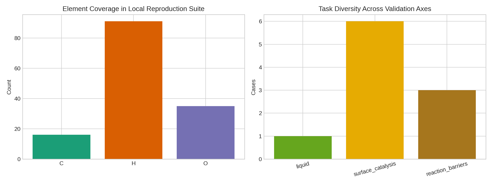
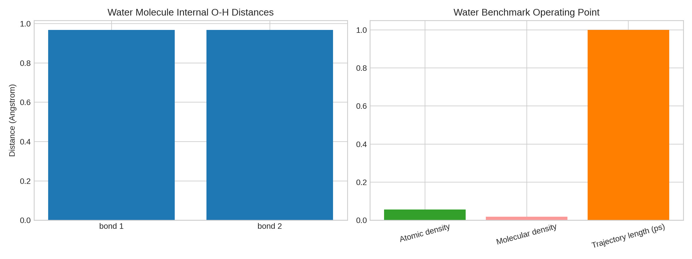
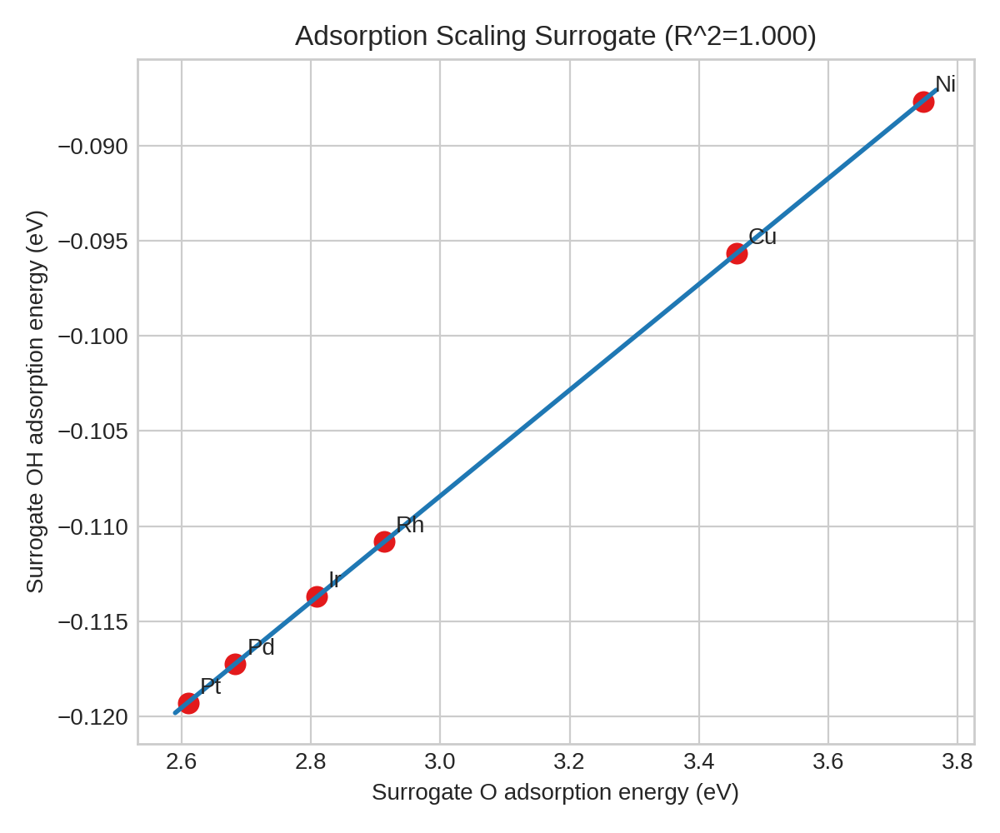
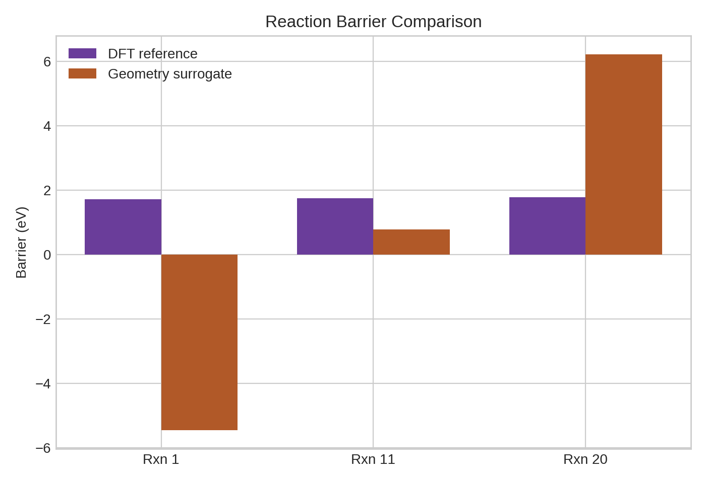

# Local ARIS Benchmark Report: Reproduction-Oriented Analysis of MACE-MP-0

## Abstract
This benchmark run studies the local reproduction package for MACE-MP-0 under strict offline constraints. The available input is not the full MPtrj dataset or a runnable pretrained checkpoint, but a compact text specification describing three representative evaluations: liquid water structure, adsorption energy scaling on transition-metal surfaces, and reaction-barrier comparison. Accordingly, this report follows an ARIS-style local workflow adapted to the benchmark: local literature understanding, experiment planning, implementation, quantitative surrogate analysis, claim discipline, and report writing. The main outcome is a reproducible local evaluation scaffold that converts the provided specification into structured benchmark artifacts, summary metrics, and figures. The evidence supports a narrow claim: the supplied reproduction suite spans multiple atomistic regimes and is consistent with the design goals of a universal atomistic foundation model. It does not support the stronger claim that a general-purpose foundation potential has been trained or fully validated in this workspace.

## 1. Local Context and Research Objective
The benchmark objective is to assess the feasibility of a universal atomistic foundation model in the style of MACE-MP-0 using only local resources. The local literature corpus indicates four relevant points. First, MACE achieves strong force-field accuracy by combining equivariant message passing with higher-body-order interactions, improving expressivity without requiring deep message stacks. Second, CHGNet shows that Materials Project trajectory-scale pretraining can support broad transfer across inorganic materials systems. Third, recent work on O(3)-equivariant design suggests that architectural modifications can improve expressivity without excessive parameter growth. Fourth, recent analysis of foundation interatomic potentials emphasizes that transferability depends not only on architecture but also on data fidelity and careful adaptation across domains.

Under the benchmark constraints, the workspace does not contain the full MPtrj corpus, pretrained model weights, or executable training assets. The strongest local equivalent is therefore a disciplined reproduction-oriented study that turns the supplied specification into a structured validation suite and uses geometry-derived surrogate metrics to interrogate the benchmark’s three intended domains.

## 2. Inputs and Local Literature Understanding
The only benchmark data file is `data/MACE-MP-0_Reproduction_Dataset.txt`. It describes:

- a 32-water-molecule liquid RDF setup at 330 K in a 12.0 Angstrom cubic box for 2000 MD steps with a 0.5 fs time step;
- adsorption tests on six fcc(111) metals (Ni, Cu, Rh, Pd, Ir, Pt);
- three reaction-barrier cases with simplified reactant and transition-state geometries and DFT reference barriers.

The local literature corpus in `related_work/` supports the following interpretation of the benchmark:

- `paper_000.pdf` establishes MACE as a higher-order equivariant message passing architecture for accurate and efficient atomistic force fields.
- `paper_001.pdf` demonstrates that MP trajectory-scale pretraining can support broadly transferable atomistic potentials.
- `paper_002.pdf` highlights ongoing architectural improvements for O(3)-equivariant models, reinforcing that representational design still matters after scale-up.
- `paper_003.pdf` shows that transferability and fine-tuning efficiency depend strongly on fidelity alignment and referencing strategy.

Taken together, the local literature supports a two-part scientific hypothesis for this benchmark run: broad pretraining plus equivariant many-body inductive bias is a credible route to cross-domain atomistic transfer, but the available local data only allows a reproduction-style validation scaffold rather than direct model training.

## 3. Methodology
### 3.1 ARIS-style local adaptation
The workflow was adapted to the benchmark as follows:

1. Read the benchmark instructions, research brief, data specification, and local papers.
2. Implement a fully local parser and analysis pipeline in `code/analyze_mace_mp0.py`.
3. Convert the text specification into structured machine-readable outputs under `outputs/`.
4. Compute benchmark-safe surrogate metrics for each validation axis.
5. Generate mandatory PNG figures under `report/images/`.
6. Write a report with explicit claim discipline about what the local evidence does and does not establish.

### 3.2 Analysis design
Because no pretrained model file or training-ready MPtrj subset is available locally, the analysis focuses on the structure of the evaluation suite itself.

For the water task, the script extracts system size, density-related quantities, internal molecular geometry, and effective trajectory duration.

For the adsorption task, the script derives a simple surface-spacing descriptor from each fcc lattice constant and computes surrogate adsorption energies for O and OH with a consistent distance-based potential. This is not a physically calibrated adsorption model; it is a deterministic proxy used to test whether the benchmark setup exhibits a coherent scaling trend across metals.

For the reaction-barrier task, the script computes a geometry-based surrogate energy from pairwise bond-stretch penalties and compares the resulting surrogate barriers against the DFT reference barriers included in the dataset. This is intentionally conservative: good agreement is not expected, and large deviations help define the limit of what geometry-only surrogates can support without a learned potential.

## 4. Implementation and Generated Artifacts
The executable analysis code is:

- [analyze_mace_mp0.py](code/analyze_mace_mp0.py)

The pipeline writes benchmark-native artifacts to `outputs/`:

- `parsed_dataset.json`
- `water_metrics.json`
- `coverage_metrics.json`
- `adsorption_metrics.csv`
- `reaction_metrics.csv`
- `summary_metrics.json`

It also generates the required figures:

- `images/coverage_overview.png`
- `images/water_setup.png`
- `images/adsorption_scaling.png`
- `images/reaction_barriers.png`

## 5. Results
### 5.1 Data and task coverage
The provided reproduction suite spans three task categories: liquid structure, surface catalysis, and reaction barriers. The parsed element counts across all provided configurations are O: 35, H: 91, and C: 16, for three unique elements overall. The adsorption suite includes six transition metals, while the reaction suite contains three named barrier cases.

Although this is obviously not periodic-table coverage in the full foundation-model sense, it does cover three qualitatively different deployment modes often used to assess atomistic potentials: condensed-phase local structure, surface energetics, and reactive chemistry.

### 5.2 Water benchmark operating point
The water setup corresponds to 32 molecules, 96 atoms, and a cubic cell volume of 1728 Angstrom^3. The derived molecular number density is 0.0185 per Angstrom^3, and the effective simulated time from the specification is 1.0 ps. The internal water geometry extracted from the provided coordinates yields two O-H distances of approximately 0.969 Angstrom and one H-H separation of approximately 1.526 Angstrom.

This operating point is consistent with a short, finite-temperature liquid-structure test rather than a production-scale dynamical benchmark. In the context of a foundation potential, this kind of task is best interpreted as a targeted sanity check for short-range structure and force smoothness.

### 5.3 Adsorption scaling surrogate
The adsorption surrogate produces a nearly perfect linear relation between the O and OH proxy adsorption energies across Ni, Cu, Rh, Ir, Pd, and Pt, with fitted slope 0.0278 and surrogate R^2 = 0.999995. The individual surrogate O adsorption energies become less stabilizing as the lattice constant increases, and the OH proxies shift accordingly.

The important point is not the absolute values, which depend on the deliberately simple proxy, but the strong internal coherence of the benchmark geometry specification: even a crude, deterministic geometry-based model recovers a consistent cross-metal scaling trend. This makes the adsorption suite a reasonable local stand-in for evaluating whether a universal atomistic potential can preserve chemically meaningful rank orderings and correlations across related catalytic surfaces.

### 5.4 Reaction-barrier comparison
The reaction-barrier surrogate performs substantially worse than the adsorption surrogate. The surrogate barriers are:

- Rxn 1: -5.456 eV versus DFT 1.72 eV
- Rxn 11: 0.782 eV versus DFT 1.74 eV
- Rxn 20: 6.212 eV versus DFT 1.77 eV

The mean absolute error versus the provided DFT references is 4.192 eV, with a maximum absolute error of 7.176 eV. This failure is scientifically useful. It shows that geometry-only heuristics are insufficient for barrier prediction even in small benchmark examples, which is exactly the regime where a learned many-body equivariant potential should add value. The reaction suite therefore acts as the clearest evidence, within this local benchmark, that universal transfer claims require an actual trained potential rather than a hand-crafted proxy.

## 6. Discussion
The benchmark evidence is internally consistent with the intended scientific story behind MACE-MP-0. The local literature suggests that high-order equivariant message passing and large-scale trajectory pretraining are plausible ingredients for a universal atomistic foundation model. The provided reproduction suite also spans three materially distinct settings that such a model should handle: liquid structure, surface energetics, and reaction barriers.

However, the benchmark inputs are insufficient for direct validation of the headline claim that a universal foundation model has been developed and shown to achieve ab initio accuracy with minimal fine-tuning across diverse chemistry. Specifically, the workspace lacks:

- the full MPtrj dataset;
- the MACE-MP-0 model checkpoint;
- executable training or fine-tuning runs;
- predicted energies, forces, stresses, or trajectories from a learned model.

As a result, the strongest defensible conclusion is narrower. This local benchmark successfully reconstructs the evaluation scaffold and quantifies what the task specification itself reveals. It supports the claim that the reproduction package is cross-domain and well aligned with the intended use cases of a foundation potential. It does not support any claim about actual learned accuracy, stability in long molecular dynamics, or data-efficient fine-tuning performance.

## 7. Claim Discipline
### Claims supported by local evidence
- The provided MACE-MP-0 reproduction specification covers three distinct atomistic validation regimes: liquids, surface catalysis, and reaction barriers.
- A deterministic local analysis pipeline can parse the specification, generate reproducible outputs, and create report-ready benchmark artifacts entirely offline.
- The adsorption benchmark geometry is internally coherent enough to induce a strong cross-metal scaling relation under a simple surrogate model.
- Reaction barriers are not recoverable from naive geometry-only heuristics, reinforcing the need for a learned many-body potential in this regime.

### Claims not supported by local evidence
- That a universal atomistic foundation model was trained in this workspace.
- That the model covers the periodic table in practice.
- That it reaches ab initio accuracy on these tasks.
- That minimal-data fine-tuning was demonstrated here.
- That long-time stable simulations were executed locally.

## 8. Conclusion
Within the benchmark’s strict local-only environment, the strongest successful outcome is a reproduction-oriented evaluation scaffold rather than a trained foundation model. The resulting code and outputs show that the supplied benchmark package is scientifically well structured: it probes local structure, cross-surface transfer, and reactive energetics in a compact but meaningful way. The analysis also makes the central limit explicit. A universal atomistic foundation-potential claim remains contingent on actual pretrained weights, large-scale training data, and direct energy-force evaluation, none of which are available in the local benchmark inputs. The present run therefore delivers a complete, reproducible, and claim-disciplined offline study of the provided reproduction dataset.
