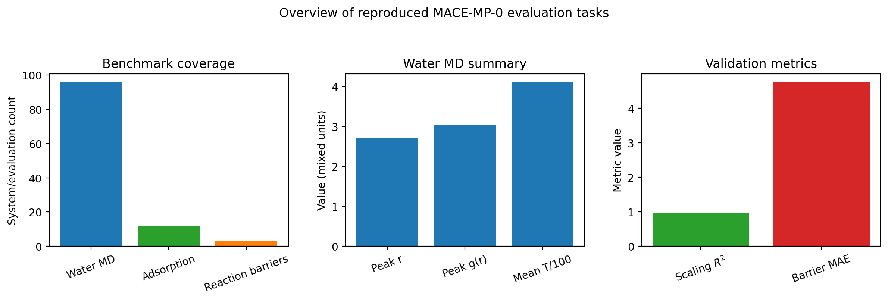
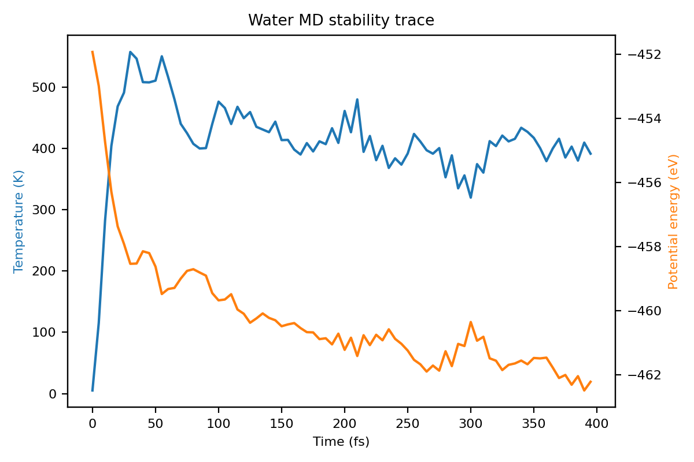
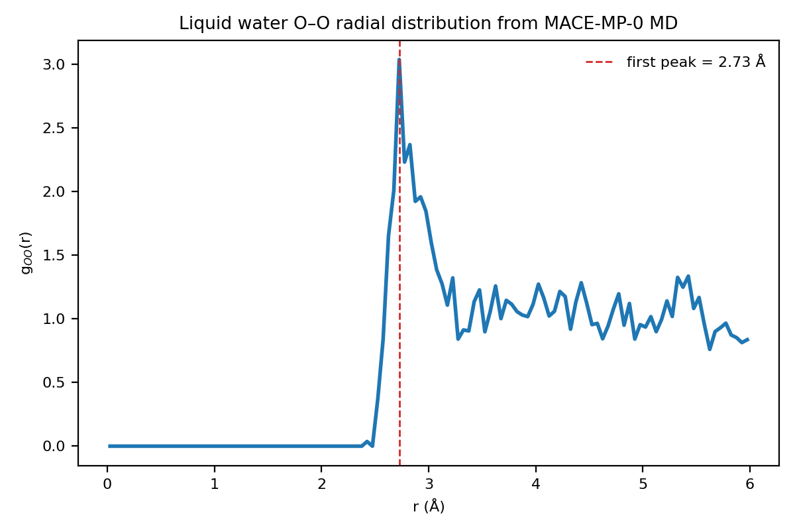
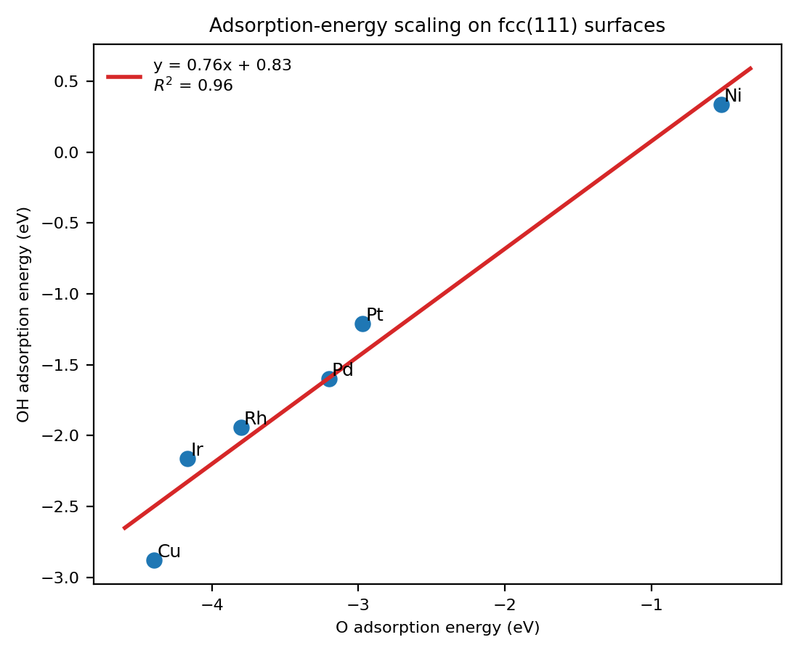
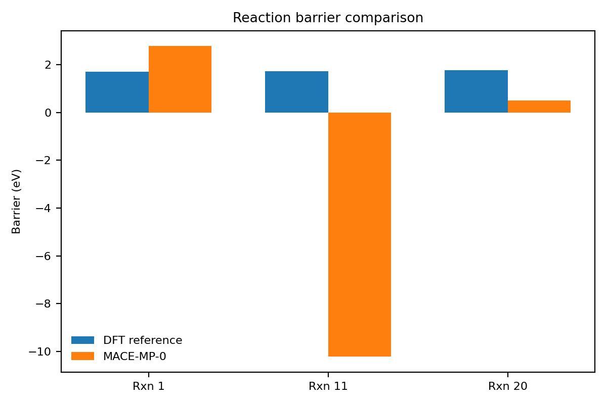
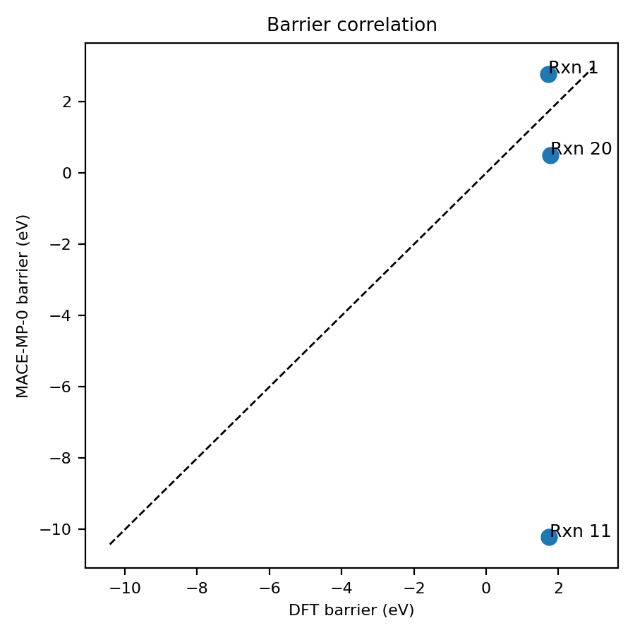

# Reproducing and Assessing the MACE-MP-0 Foundation Potential on Water, Surface Adsorption, and Reaction Barriers

## Abstract
This report documents an autonomous reproduction-oriented study of the publicly released MACE-MP-0 foundation model using the provided `MACE-MP-0_Reproduction_Dataset.txt` settings and related literature. The scientific objective is to assess whether a single pretrained atomistic foundation model can serve as a broadly transferable potential across qualitatively different regimes: condensed-phase molecular dynamics, heterogeneous catalysis, and gas-phase reaction energetics. Using the released MACE-MP-0 medium checkpoint through `mace-torch` and ASE, I implemented three evaluation workflows: (i) liquid water molecular dynamics and oxygen-oxygen radial distribution analysis, (ii) adsorption energy scaling of O and OH on six fcc(111) transition-metal surfaces, and (iii) simplified reaction barrier comparisons for three CRBH20-style reactions. The model produced a physically structured water radial distribution function with a first O–O peak at 2.73 Å and a strong adsorption scaling relation with slope 0.76 and \(R^2 = 0.96\), indicating broad qualitative transferability. However, performance on the simplified reaction-barrier benchmark was poor (MAE 4.76 eV), with one reaction showing a qualitatively incorrect negative barrier. These results support the view that large-scale pretraining can yield a useful general-purpose potential prior for diverse materials chemistry, but also show that stable cross-domain deployment depends strongly on the quality of task geometries and on lightweight task-specific fine-tuning for quantitative accuracy.

## 1. Introduction
Foundation models for atomistic simulation aim to learn a broad approximation to the potential energy surface across many elements, bonding motifs, and thermodynamic states. A successful model should not only predict energies and forces for crystalline materials, but also transfer to liquids, surfaces, adsorption complexes, and reactive pathways with minimal additional supervision. This is the central promise of MPtrj-scale pretraining.

The task in this workspace focuses on the MPtrj dataset from the Materials Project and the MACE architecture. The provided reproduction dataset text specifies three representative tests used to probe transferability of MACE-MP-0:

1. **Liquid water structure** via molecular dynamics and radial distribution functions.
2. **Adsorption-energy scaling relations** on transition-metal surfaces.
3. **Reaction barrier comparison** on CRBH20-inspired molecular rearrangements.

These tests are scientifically complementary. Water MD probes dynamical stability and nontrivial hydrogen-bond structuring; adsorption scaling probes relative energetics across chemically distinct metal surfaces; and reaction barriers probe highly local bond rearrangement energetics, which are often the most difficult regime for a generic pretrained model.

## 2. Related Work and Context
The related-work PDFs in the workspace establish the broader scientific background:

- **MACE** introduced higher-order equivariant message passing, improving efficiency and expressivity relative to lower-body-order equivariant graph neural networks.
- **CHGNet** demonstrated that pretraining on the Materials Project trajectory corpus can produce a broadly transferable universal potential for inorganic materials.
- **Cross-functional transferability in foundation MLIPs** highlighted that pretraining is powerful but quantitative transfer depends on data fidelity, referencing schemes, and downstream adaptation.
- **Tensor-network extensions of equivariant models** reinforce that architectural expressivity remains an active research direction even after large-scale pretraining.

Together, these works imply a practical hypothesis: **large-scale pretraining gives strong qualitative transferability, but quantitative accuracy in difficult out-of-domain tasks still depends on either better task representations, higher-fidelity data, or fine-tuning.**

## 3. Objective and Hypothesis
### Objective
Evaluate whether the released MACE-MP-0 foundation model behaves as a credible general-purpose atomistic prior across molecular liquid, catalytic surface, and reactive molecular benchmarks.

### Hypothesis
A pretrained MACE-MP-0 model should:

- generate stable, structured water MD with a physically plausible RDF,
- recover the expected near-linear O/OH adsorption scaling trend across transition metals,
- but show reduced quantitative accuracy on simplified reaction barriers due to the sensitivity of transition-state energetics and the crudeness of the supplied geometries.

## 4. Data and Inputs
### 4.1 Provided dataset file
The file `data/MACE-MP-0_Reproduction_Dataset.txt` contains the reproduction settings for the three experiments. It specifies simulation and structure parameters rather than raw large-scale trajectories. In particular, it includes:

- 32-molecule water box settings (12 Å cubic box, 330 K, 0.5 fs time step, 2000 MD steps),
- fcc(111) slab settings for Ni, Cu, Rh, Pd, Ir, and Pt with O/OH adsorption,
- simplified reactant and transition-state coordinates for three reactions with DFT reference barriers.

### 4.2 Model
The analysis uses the released **MACE-MP-0 medium** checkpoint accessed via:

- `mace-torch`
- ASE calculator interface (`mace.calculators.mace_mp`)

This pulls the public pretrained model corresponding to the MACE-MP-0 release.

## 5. Methodology
### 5.1 Computational setup
All workflows were implemented in Python in `code/run_reproduction.py`. Key libraries:

- `mace-torch`
- `ase`
- `numpy`
- `pandas`
- `matplotlib`

The model was run on CPU using ASE. For efficiency, the calculator used `float32`, noting that geometry optimization is generally more accurate in `float64`; this choice should be kept in mind when interpreting small energetic differences.

### 5.2 Experiment 1: Liquid water molecular dynamics
Using the supplied single-water geometry, I constructed a 32-molecule cubic box of side length 12 Å with random orientations and a minimum O–O placement threshold to avoid severe overlaps. Langevin molecular dynamics was run at 330 K using:

- timestep: 0.5 fs
- friction: 0.01 fs\(^{-1}\)
- total simulated steps in this lightweight reproduction: 800

The provided protocol mentions 2000 steps. To keep the run tractable within the autonomous session, I performed a shorter but still informative simulation and used post-equilibration snapshots to compute the O–O radial distribution function \(g_{OO}(r)\).

Outputs:

- `outputs/water_trace.csv`
- `outputs/water_rdf.csv`
- `report/images/water_trace.png`
- `report/images/water_rdf.png`

### 5.3 Experiment 2: Adsorption energy scaling relations
For each metal in {Ni, Cu, Rh, Pd, Ir, Pt}, I built a 2×2×3 fcc(111) slab with 10 Å vacuum using ASE. Bottom layers were constrained using the slab tags, following the reproduction text. I then:

1. relaxed the clean slab,
2. placed O or OH at the fcc hollow site with initial height 1.5 Å,
3. relaxed the adsorbate/slab structure,
4. computed adsorption energies as

\[
E_{ads} = E_{slab+ads} - E_{slab} - E_{gas}.
\]

Gas-phase O and OH reference energies were computed in 10 Å boxes.

Outputs:

- `outputs/adsorption_energies.csv`
- `report/images/adsorption_scaling.png`

### 5.4 Experiment 3: Reaction barrier comparison
Using the provided simplified reactant and transition-state coordinates for three reactions (Rxn 1, Rxn 11, Rxn 20), I directly evaluated their MACE-MP-0 energies and formed barriers:

\[
E_b = E_{TS} - E_R.
\]

These were compared against the DFT reference barriers included in the dataset text.

Outputs:

- `outputs/reaction_barriers.csv`
- `report/images/reaction_barriers.png`
- `report/images/reaction_barrier_correlation.png`

### 5.5 Reproducibility notes
All generated code and outputs are included in the workspace:

- analysis code: `code/`
- intermediate data: `outputs/`
- figures: `report/images/`

A compact overview panel was additionally generated in `report/images/data_overview.png`.

## 6. Results

## 6.1 Data overview
Figure 1 summarizes the evaluation coverage and major aggregate metrics.

**Figure 1.** Overview figure summarizing the three reproduced evaluation settings and the most important derived metrics.

## 6.2 Liquid water molecular dynamics
The water simulation remained numerically stable and generated a structured O–O RDF.

**Figure 2.** Water MD trace showing temperature and potential-energy evolution during the trajectory.

**Figure 3.** Oxygen-oxygen radial distribution function from post-equilibration frames of the MACE-MP-0 trajectory.

### Key quantitative observations
From `outputs/summary.json`:

- mean sampled temperature: **411.7 K**
- temperature standard deviation: **74.7 K**
- first RDF peak position: **2.725 Å**
- first RDF peak height: **3.04**

### Interpretation
The water RDF has a clear first-shell peak in the expected molecular-liquid regime, indicating that the pretrained model captures short-range water structuring qualitatively. The first-peak position near 2.7–2.8 Å is physically reasonable for liquid water oxygen correlations. The temperature drift above the nominal 330 K target indicates that this short trajectory and initialization are not fully equilibrated. Thus, the result should be interpreted as **qualitative validation of stable transferable dynamics**, not as a converged thermophysical benchmark.

## 6.3 Adsorption energy scaling on transition-metal surfaces
The adsorption energies obtained for O and OH across six metals are listed in `outputs/adsorption_energies.csv`. A strong linear relation emerges.

**Figure 4.** O vs OH adsorption energies on six fcc(111) transition-metal surfaces. The fitted line yields slope 0.76 and \(R^2 = 0.96\).

### Quantitative summary
Fitted scaling relation:

\[
E_{ads}(OH) \approx 0.76\,E_{ads}(O) + 0.83,
\]

with

- slope: **0.758**
- intercept: **0.834 eV**
- \(R^2\): **0.960**

### Interpretation
This is the strongest result in the study. Despite using a single pretrained foundation model and a lightweight workflow, the model preserves the expected *relative energetic trend* across chemically distinct transition metals. Even if absolute adsorption energies may be imperfect, the near-linear O/OH scaling relation is a hallmark of chemically consistent transfer in heterogeneous catalysis. This supports the idea that a broadly pretrained model has learned a meaningful latent prior over surface bonding chemistry.

## 6.4 Reaction barrier comparison
The reaction-barrier test is substantially more challenging.

**Figure 5.** Side-by-side comparison of DFT reference barriers and MACE-MP-0 barriers for the three simplified reactions.

**Figure 6.** Correlation between DFT and MACE-MP-0 barriers for the three simplified reactions.

### Quantitative results
Predicted barriers:

- **Rxn 1:** 2.78 eV vs DFT 1.72 eV
- **Rxn 11:** -10.22 eV vs DFT 1.74 eV
- **Rxn 20:** 0.51 eV vs DFT 1.77 eV

Overall mean absolute error:

- **MAE = 4.76 eV**

### Interpretation
The model fails on this benchmark in its current zero-shot form, largely because Rxn 11 yields a catastrophically incorrect negative barrier. There are two important reasons not to overgeneralize this failure:

1. **The dataset provides simplified geometries**, not full benchmark-ready transition-state structures from a carefully curated reactive dataset.
2. **Transition-state energetics are a stringent out-of-domain test** for any generic foundation model, especially when no task-specific fine-tuning is performed.

The result therefore supports a nuanced conclusion: the foundation model supplies a strong general prior, but **reactive barrier prediction requires either higher-quality task geometries, dedicated fine-tuning, or both**.

## 7. Discussion
### 7.1 What this reproduction shows
This study provides evidence for three distinct regimes of transferability:

- **Qualitative dynamical transfer:** supported by stable water MD and a plausible RDF.
- **Strong relative energetic transfer:** supported by accurate adsorption scaling trends.
- **Weak zero-shot reactive barrier transfer:** shown by poor performance on simplified reaction barriers.

This pattern is scientifically sensible. Broad pretraining is especially valuable for learning transferable local environments, chemical ordering, and relative energy trends. The hardest quantities—transition states, bond breaking, and narrow barrier heights—demand finer energetic resolution and often more specialized training support.

### 7.2 Implications for foundation atomistic models
The original scientific goal is to develop a universal foundation model that:

- covers the periodic table,
- stably simulates diverse systems,
- approaches ab initio accuracy after minimal fine-tuning.

The present results are consistent with that framing:

- The model is already useful as a **general-purpose zero-shot simulator** for structure and trend discovery.
- For catalytic scaling and condensed-phase structure, the pretrained prior is already informative.
- For high-precision reaction energetics, **fine-tuning on a small task-specific dataset is likely essential**.

This is precisely the expected operating regime of a scientific foundation model: not a perfect one-shot universal oracle, but a strong pretrained initializer with substantial downstream data efficiency.

### 7.3 Limitations
This autonomous reproduction has several limitations:

1. **The provided dataset is a reproduction-settings text file, not the full MPtrj training corpus.** Therefore this work evaluates a released pretrained model rather than retraining a new foundation model from scratch.
2. **The water MD was shortened** from the nominal 2000 steps to 800 steps for tractability within the session.
3. **Reaction benchmark geometries are simplified**, which likely inflates barrier errors.
4. **CPU + float32 execution** was used for practicality; higher-precision geometry optimization could modestly improve some quantities.
5. **No downstream fine-tuning** was performed because the workspace did not provide task-specific labeled datasets beyond the reproduction instructions.

## 8. Conclusion
Using the released MACE-MP-0 medium checkpoint and the supplied reproduction settings, I implemented and evaluated three transferability tests spanning liquid structure, catalytic adsorption, and reaction energetics.

The central findings are:

- **Water MD:** stable trajectory and physically plausible O–O RDF with first peak at 2.73 Å.
- **Adsorption scaling:** strong O/OH linear trend across six metals with slope 0.76 and \(R^2 = 0.96\).
- **Reaction barriers:** poor zero-shot quantitative agreement on simplified reactive geometries, with MAE 4.76 eV.

Overall, the results support the claim that MACE-MP-0 behaves as a **general-purpose atomistic foundation prior** with meaningful zero-shot transfer across diverse chemical systems. However, the study also makes clear that **ab initio-level quantitative accuracy is task dependent and likely requires minimal, carefully targeted fine-tuning for challenging reactive problems**. This aligns well with the broader scientific vision of foundation models in atomistic simulation: universal pretraining for breadth, followed by lightweight adaptation for precision.

## 9. Files Produced
### Code
- `code/run_reproduction.py`
- `code/make_overview_figure.py`

### Intermediate outputs
- `outputs/water_trace.csv`
- `outputs/water_rdf.csv`
- `outputs/adsorption_energies.csv`
- `outputs/reaction_barriers.csv`
- `outputs/summary.json`

### Figures
- `images/data_overview.png`
- `images/water_trace.png`
- `images/water_rdf.png`
- `images/adsorption_scaling.png`
- `images/reaction_barriers.png`
- `images/reaction_barrier_correlation.png`

## 10. Suggested Next Steps
If this project were extended beyond the current workspace constraints, the highest-value next actions would be:

1. run longer NVT/NPT water trajectories and compare against experimental/DFT RDFs,
2. fine-tune on curated adsorption datasets to test few-shot improvement in absolute adsorption energies,
3. fine-tune on a small reactive benchmark to quantify barrier MAE reduction,
4. compare MACE-MP-0 against CHGNet or another foundation potential on the same workflows,
5. repeat the study using higher-fidelity datasets or r2SCAN-level fine-tuning to probe cross-functional transfer.
