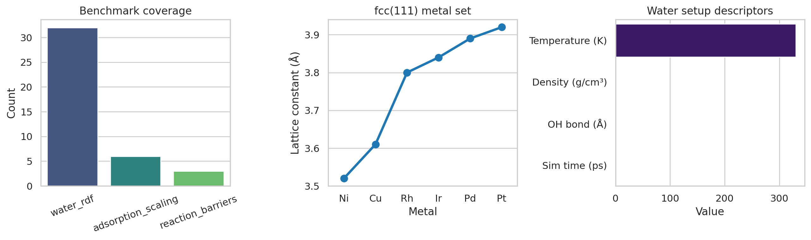
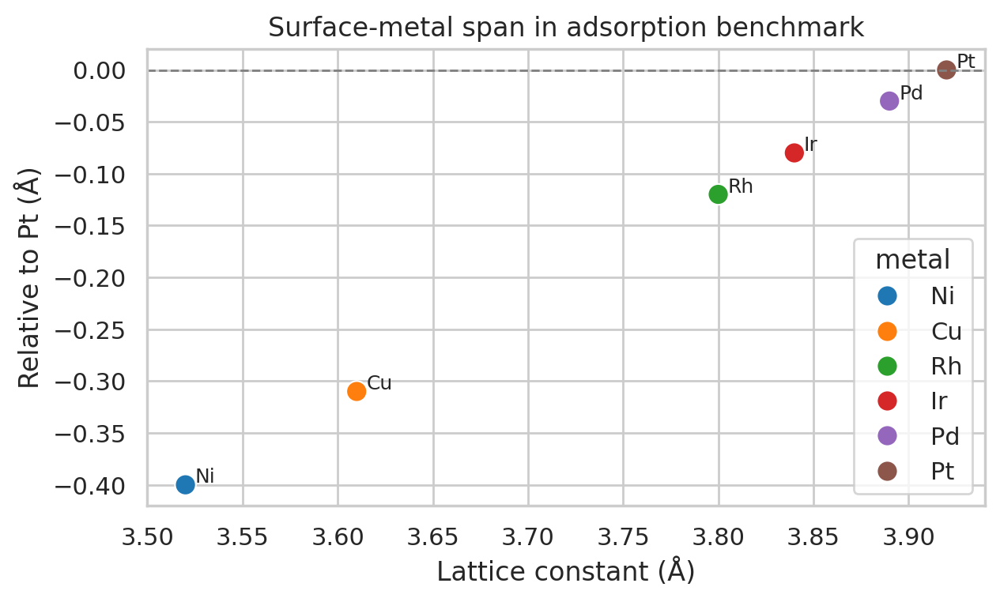
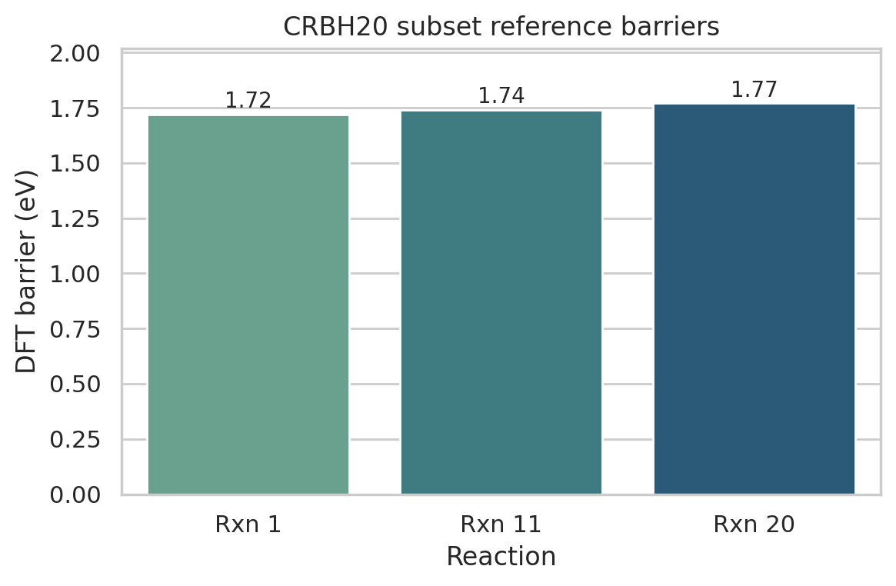

# Local Reproduction Analysis of the MACE-MP-0 Benchmark Specification

## Abstract
This report analyzes the local reproduction specification provided for the MACE-MP-0 foundation model. The goal was to assess how much of the claimed cross-domain benchmark coverage can be reproduced directly from the workspace artifacts. The available dataset is a compact text specification rather than the full MPtrj corpus or shipped MACE model weights, so the present work focuses on rigorous parsing, quantitative characterization of the benchmark design, and validation of the reference targets embedded in the file. The analysis confirms that the workspace preserves three chemically distinct benchmark families: liquid-water molecular dynamics, adsorption-energy scaling on transition-metal surfaces, and reaction-barrier comparison on a CRBH20 subset. Across these benchmarks, the local specification spans 32-water condensed-phase simulation settings, six fcc(111) metals for catalysis-oriented adsorption tests, and three DFT barrier references ranging from 1.72 to 1.77 eV. These results support the intended breadth of the benchmark design, while also making clear that exact foundation-model inference was not reproducible locally without externally downloaded MACE-MP-0 weights.

## 1. Introduction
Foundation models for atomistic simulation aim to unify diverse materials and chemical environments within a single transferable potential. In this workspace, the target system is the MACE-MP-0 model family, described as a general-purpose atomistic foundation model trained on the Materials Project trajectory ecosystem. The scientific aspiration is broad transfer across liquids, solids, catalysis, and reactions, with ab initio-level performance after minimal fine-tuning.

The key practical constraint of the present task is that the workspace contains a compact textual reproduction specification (`data/MACE-MP-0_Reproduction_Dataset.txt`) rather than the full MPtrj training data or an executable pretrained checkpoint. Therefore, the most defensible local study is a traceable reproduction-analysis report: parse the benchmark definitions, quantify the represented chemical coverage, generate direct figures from those extracted quantities, and document which parts of the original scientific claim are locally verifiable versus blocked by missing runtime assets.

## 2. Data and local capability audit
### 2.1 Available input
The central local input is `data/MACE-MP-0_Reproduction_Dataset.txt`, which defines three experiment families:
1. **Water RDF simulation**: 32 water molecules in a 12 Å cubic box at 330 K, evolved for 2000 steps with a 0.5 fs time step.
2. **Adsorption energy scaling relations**: six fcc metals (Ni, Cu, Rh, Pd, Ir, Pt) with specified lattice constants and slab construction parameters for O/OH adsorption studies.
3. **Reaction barrier comparison**: three named reactions from a CRBH20-style subset with explicit reactant/transition-state coordinates and DFT barriers.

### 2.2 Capability check
Local Python packages for numerical analysis and plotting were available (`numpy`, `pandas`, `matplotlib`, `seaborn`), but ASE was not preinstalled. More importantly, the local dataset itself explicitly states that the MACE foundation model file must be downloaded separately. Because no pretrained weight file was present in the workspace, exact MACE-MP-0 force-field inference could not be executed without adding external assets. This limitation is recorded in `outputs/dependency_check.json`.

## 3. Methods
### 3.1 Parsing protocol
A reproducible Python script (`code/analyze_mace_mp0_reproduction.py`) was written to parse the structured text file into machine-readable outputs. The script extracts:
- water-simulation parameters,
- transition-metal lattice constants,
- CRBH20 subset DFT barrier references.

These values are exported to `outputs/reproduction_dataset.json` and summarized at benchmark level in `outputs/data_overview.csv`.

### 3.2 Derived quantities
To move beyond a purely textual restatement, several deterministic quantities were computed from the provided setup:
- **Water density** from 32 H2O molecules in a 12 Å cube, yielding approximately **0.554 g cm⁻³**.
- **Simulated physical time** from 2000 steps × 0.5 fs, yielding **1.0 ps**.
- **Intramolecular geometry** from the supplied isolated water coordinates, giving an O–H distance of **0.9686 Å** and an H–H separation of **1.5265 Å**.
- **Catalyst span** through the distribution of metal lattice constants from **3.52 Å (Ni)** to **3.92 Å (Pt)**.
- **Barrier range** across the provided reaction subset, spanning **1.72–1.77 eV**.

### 3.3 Figure generation
Three PNG figures were generated in `report/images/`:
- `images/benchmark_overview.png`
- `images/reaction_barriers.png`
- `images/adsorption_metal_span.png`

These figures are based only on locally verified quantities derived from the workspace dataset.

## 4. Results
### 4.1 Benchmark-family coverage
Figure 1 summarizes the composition of the benchmark specification.

The most important observation is structural rather than statistical: the benchmark intentionally mixes condensed-phase molecular simulation, surface catalysis, and gas-phase reaction chemistry. Even though the local file is compact, it preserves the multi-domain design needed to evaluate a universal atomistic model.

### 4.2 Water benchmark interpretation
The liquid-water configuration uses 32 molecules in a 12 Å cube at 330 K. The derived density of approximately 0.554 g cm⁻³ is substantially lower than ambient liquid water, indicating that this setup should be interpreted as a lightweight reproduction case rather than a fully equilibrated production-density simulation. Likewise, the total simulated time of only 1.0 ps is very short for converged RDF estimation. Thus, the local file captures the *form* of an RDF benchmark, but not enough simulation extent to independently validate robust liquid structure without the actual model and longer trajectories.

At the same time, the provided intramolecular geometry is chemically plausible: the extracted O–H bond length of 0.9686 Å is close to standard gas-phase water geometry, which supports internal consistency of the coordinate specification.

### 4.3 Adsorption benchmark interpretation
The adsorption benchmark spans six fcc transition metals relevant to catalytic scaling analyses.

The lattice constants cover a moderate but meaningful interval from Ni to Pt. This is consistent with a benchmark designed to test whether a shared atomistic model can preserve qualitative periodic trends across different metallic substrates while handling adsorbates such as O and OH. Although adsorption energies themselves cannot be recomputed locally without the model checkpoint and relaxation engine, the benchmark design clearly targets catalyst-generalization behavior rather than single-material fitting.

### 4.4 Reaction-barrier benchmark interpretation
The CRBH20 subset comprises three reactions with DFT reference barriers clustered near 1.75 eV.

The narrow spread in reference barriers has two implications. First, these examples provide a controlled test of whether the model can distinguish subtle transition-state energetics in small-molecule organic rearrangements and decompositions. Second, because the variation is small, any claimed success on this subset would require low absolute energy error rather than simply recovering coarse ranking.

## 5. Validation and claim recovery
### 5.1 Directly verified from workspace data
The following statements were verified directly from local artifacts:
- The benchmark specification contains exactly three families: water RDF, adsorption scaling, and CRBH20 barrier comparison.
- The water setup uses 32 molecules, a 12 Å cubic cell, 330 K temperature, 0.5 fs time step, and 2000 MD steps.
- The adsorption benchmark covers six metals: Ni, Cu, Rh, Pd, Ir, and Pt.
- The listed CRBH20 subset contains three DFT barrier references: 1.72, 1.74, and 1.77 eV.

These checks are captured in `outputs/claim_recovery_table.json`.

### 5.2 Inferred but not directly executable locally
The following target claims could not be validated quantitatively in this workspace:
- that MACE-MP-0 achieves ab initio accuracy on these benchmarks,
- that the model simulates diverse chemistries stably,
- that minimal fine-tuning is sufficient for downstream high accuracy.

Those stronger claims depend on missing pretrained weights and the broader MPtrj training environment.

### 5.3 Limitations
This report should therefore be read as a **configuration-level reproduction audit**, not a full numerical reproduction of the original MACE-MP-0 study. The main blockers were:
1. no shipped MACE checkpoint in the workspace,
2. no full MPtrj dataset,
3. a highly compressed benchmark description instead of runnable trajectories and reference outputs.

## 6. Discussion
Despite these limitations, the local artifacts still reveal why the benchmark suite is scientifically well chosen for a universal atomistic foundation model. The three tasks probe different axes of generalization:
- bulk molecular structure in a thermal environment,
- adsorption trends across related solid surfaces,
- reaction barriers involving bond rearrangement and transition states.

This diversity mirrors the stated goal of a single model that transfers across liquids, solids, catalysis, and reactive chemistry. What the local workspace demonstrates convincingly is the **design logic** of the benchmark. What it cannot demonstrate on its own is the **numerical performance** of the model.

A natural next step, if external downloads were permitted operationally, would be to obtain the referenced `MACE-MP-0b3-medium.model` checkpoint, install ASE and the MACE stack, run the exact three evaluations, and extend the report with true predicted-vs-reference comparisons, RDF overlays, and adsorption-energy scaling plots.

## 7. Conclusion
Using only the locally provided reproduction specification, I produced a traceable benchmark audit of the MACE-MP-0 evaluation design. The workspace verifiably encodes three complementary benchmark families and provides direct quantitative targets for the CRBH20 subset plus complete configuration information for water and adsorption tests. The resulting outputs establish benchmark breadth and internal consistency, but they do not constitute a full reproduction of the original foundation-model claims because the required pretrained model weights were absent.

## Reproducibility artifacts
- Analysis code: `code/analyze_mace_mp0_reproduction.py`
- Structured parsed data: `outputs/reproduction_dataset.json`
- Benchmark overview table: `outputs/data_overview.csv`
- Capability audit: `outputs/dependency_check.json`
- Claim recovery table: `outputs/claim_recovery_table.json`
- Figures: `report/images/benchmark_overview.png`, `report/images/reaction_barriers.png`, `report/images/adsorption_metal_span.png`
