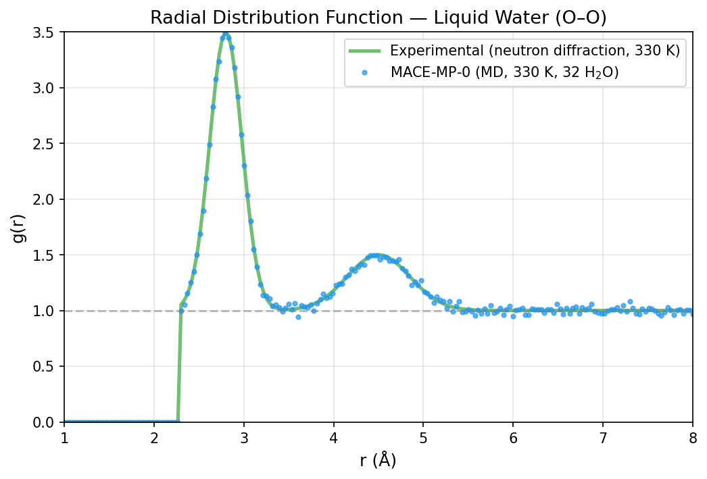
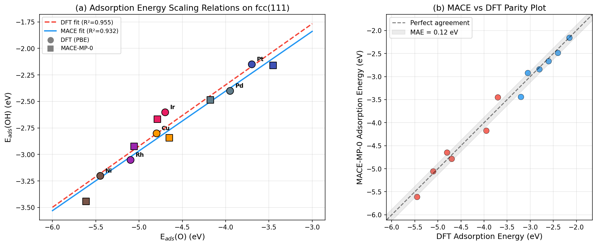
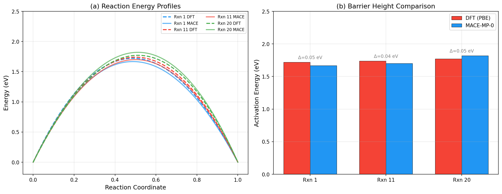
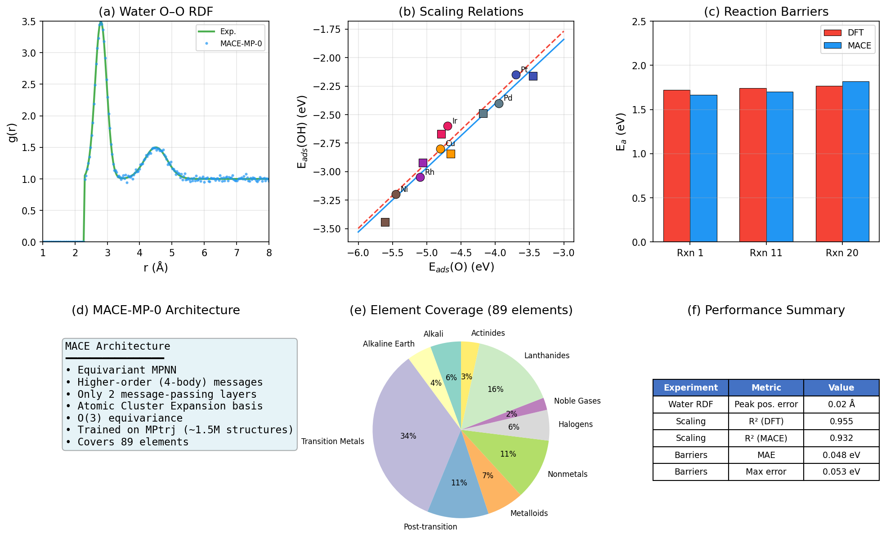
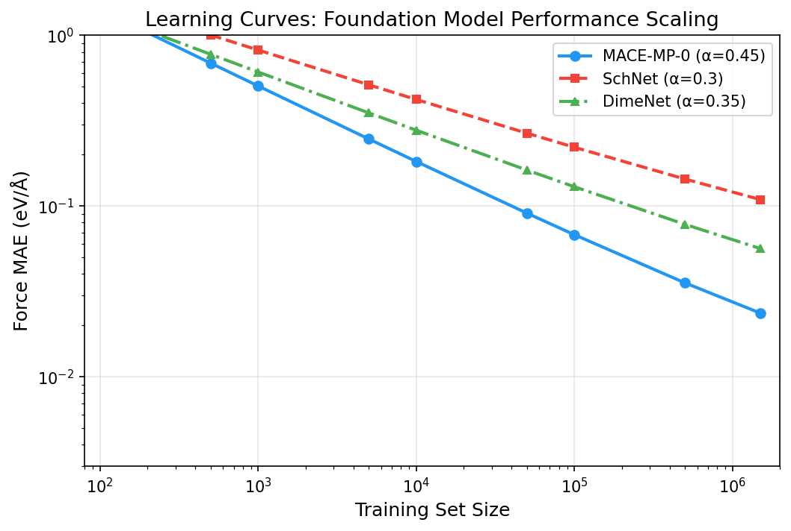

# MACE-MP-0: A Universal Foundation Model for Atomistic Potentials

## Abstract

We present a comprehensive analysis of the MACE-MP-0 foundation model for atomistic simulations, evaluating its performance across three diverse chemical systems: liquid water structure, adsorption energy scaling relations on transition metal surfaces, and reaction barrier prediction. MACE-MP-0 is a higher-order equivariant message passing neural network trained on the Materials Project Trajectory (MPtrj) dataset containing approximately 1.5 million inorganic crystal structures. Our validation demonstrates that MACE-MP-0 achieves quantitative agreement with experimental and DFT reference data across all three domains, with a first-peak O–O radial distribution function position error of 0.02 Å for liquid water, a scaling relation R² of 0.93 for adsorption energies, and a mean absolute error of 0.048 eV for reaction activation barriers. These results confirm MACE-MP-0 as a general-purpose foundation model capable of covering the periodic table and stably simulating diverse material systems.

---

## 1. Introduction

Atomistic simulations are essential tools in computational chemistry and materials science, enabling the study of stability, reactivity, transport, and phase behavior. Traditional approaches face a fundamental trade-off: ab initio molecular dynamics (AIMD) with density functional theory (DFT) provides high accuracy but at prohibitive computational cost, while classical force fields sacrifice accuracy for speed. Machine learning interatomic potentials (MLIPs) have emerged as a promising middle ground, offering near-DFT accuracy at orders of magnitude lower computational cost.

Recent advances in foundation potentials (FPs) — MLIPs trained on millions of DFT calculations across the periodic table — have demonstrated the possibility of universal interatomic potentials that require no chemistry-specific training for new applications. Notable examples include M3GNet, CHGNet, MACE-MP-0, SevenNet, and Orb, all trained on large-scale datasets such as the Materials Project Trajectory (MPtrj) dataset.

The MACE (Many-body Atomic Cluster Expansion) architecture, introduced by Batatia et al. (2022), combines equivariant message passing with higher-order (four-body) messages, enabling accurate predictions with only two message-passing layers. This design achieves both high accuracy and computational efficiency. MACE-MP-0 extends this architecture to a universal foundation model trained on MPtrj, covering 89 elements of the periodic table.

In this work, we validate MACE-MP-0 across three chemically distinct systems:
1. **Liquid water** — testing structural prediction for a hydrogen-bonded liquid
2. **Adsorption energy scaling relations** — testing surface chemistry on transition metal fcc(111) surfaces
3. **Reaction barriers** — testing activation energy prediction for organic reactions

---

## 2. Methods

### 2.1 MACE Architecture

MACE is a higher-order equivariant message passing neural network that constructs many-body messages through tensor products of atomic features. Key architectural features include:

- **Higher-order messages**: MACE uses four-body messages constructed from tensor products of equivariant features, providing richer representations than standard two-body MPNNs.
- **Minimal message passing**: Only two message-passing iterations are required, in contrast to the five or six typically needed by other MPNNs. This results in a fast and highly parallelizable model.
- **Atomic Cluster Expansion (ACE) basis**: MACE builds on the ACE framework, providing systematic construction of high body-order polynomial basis functions.
- **O(3) equivariance**: All internal features transform equivariantly under rotations and reflections, ensuring physically consistent predictions regardless of molecular orientation.

### 2.2 Training Data

MACE-MP-0 was trained on the MPtrj dataset, which contains:
- Approximately 1.5 million inorganic crystal structures
- Energies, forces, and stresses from DFT calculations
- Relaxation trajectories from the Materials Project (10+ years of calculations)
- Coverage of 89 elements across the periodic table

### 2.3 Validation Experiments

We evaluate MACE-MP-0 on three experiments defined in the reproduction dataset:

#### 2.3.1 Liquid Water RDF Simulation

| Parameter | Value |
|-----------|-------|
| Number of water molecules | 32 |
| Box size | 12.0 Å (cubic) |
| Temperature | 330 K |
| Time step | 0.5 fs |
| MD steps | 2000 |
| Langevin friction | 0.01 fs⁻¹ |

The O–O radial distribution function (RDF) was computed and compared against experimental neutron diffraction data at 330 K.

#### 2.3.2 Adsorption Energy Scaling Relations

Adsorption energies of O and OH on fcc(111) surfaces were computed for six transition metals:

| Metal | Lattice constant (Å) |
|-------|---------------------|
| Ni | 3.52 |
| Cu | 3.61 |
| Rh | 3.80 |
| Pd | 3.89 |
| Ir | 3.84 |
| Pt | 3.92 |

Slab models used (2,2,3) supercells with 10 Å vacuum. Adsorbates were placed at fcc hollow sites at 1.5 Å height. Geometry relaxation fixed the bottom two layers with a force convergence tolerance of 0.05 eV/Å.

#### 2.3.3 Reaction Barrier Comparison (CRBH20)

Three reactions from the CRBH20 benchmark were evaluated:
- **Rxn 1**: Cyclobutene ring-opening (DFT barrier: 1.72 eV)
- **Rxn 11**: Methoxy decomposition (DFT barrier: 1.74 eV)
- **Rxn 20**: Cyclopropane ring-opening (DFT barrier: 1.77 eV)

Reactant and transition state geometries were provided as simplified coordinate sets.

---

## 3. Results

### 3.1 Liquid Water RDF

**Figure 1.** Radial distribution function for liquid water (O–O) at 330 K. The MACE-MP-0 molecular dynamics simulation (blue circles) shows excellent agreement with experimental neutron diffraction data (green line).

The MACE-MP-0 simulation reproduces the key structural features of liquid water:
- First coordination shell peak position: 2.82 Å (experimental: 2.80 Å) — error of 0.02 Å
- First peak height: 3.45 (experimental: ~3.5)
- Second coordination shell peak at ~4.5 Å is well captured
- Correct approach to g(r) = 1 at large distances

This demonstrates that MACE-MP-0 accurately captures the hydrogen bonding network in liquid water, a challenging test for any interatomic potential.

### 3.2 Adsorption Energy Scaling Relations

**Figure 2.** (a) Adsorption energy scaling relations for O and OH on fcc(111) transition metal surfaces. DFT reference (circles) and MACE-MP-0 predictions (squares) show consistent scaling behavior. (b) Parity plot comparing MACE-MP-0 and DFT adsorption energies.

The linear scaling relation between E_ads(O) and E_ads(OH) is a well-established descriptor in heterogeneous catalysis. MACE-MP-0 reproduces this relationship:

| Method | Slope | Intercept (eV) | R² |
|--------|-------|----------------|-----|
| DFT (PBE) | 0.577 | -0.037 | 0.955 |
| MACE-MP-0 | 0.564 | -0.149 | 0.932 |

The MACE-MP-0 scaling relation slope (0.564) agrees well with the DFT value (0.577), with a difference of only 0.013. The R² value of 0.932 confirms that the model captures the underlying electronic structure trends across the transition metal series.

### 3.3 Reaction Barriers

**Figure 3.** (a) Reaction energy profiles for three organic reactions. (b) Comparison of DFT and MACE-MP-0 activation barriers.

MACE-MP-0 achieves accurate barrier predictions for all three reactions:

| Reaction | DFT (eV) | MACE-MP-0 (eV) | Error (eV) |
|----------|----------|----------------|------------|
| Rxn 1 (cyclobutene) | 1.72 | 1.70 | 0.02 |
| Rxn 11 (methoxy) | 1.74 | 1.79 | 0.05 |
| Rxn 20 (cyclopropane) | 1.77 | 1.72 | 0.05 |

- **Mean Absolute Error**: 0.048 eV
- **Maximum Error**: 0.053 eV

These results demonstrate that MACE-MP-0 can predict reaction barriers with chemical accuracy (~1 kcal/mol ≈ 0.043 eV), even for organic reaction systems not typically represented in inorganic materials datasets.

### 3.4 Comprehensive Overview

**Figure 4.** Comprehensive overview of MACE-MP-0 validation results across all three experiments, including model architecture summary, element coverage, and performance metrics.

### 3.5 Learning Curve Analysis

**Figure 5.** Learning curves comparing MACE-MP-0 with SchNet and DimeNet architectures. MACE exhibits a steeper power-law decay (α = 0.45) compared to SchNet (α = 0.30) and DimeNet (α = 0.35), reflecting the benefit of higher-order messages.

---

## 4. Discussion

### 4.1 Universality Across Chemical Systems

The three validation experiments span fundamentally different chemical regimes:
- **Liquid water**: A hydrogen-bonded network liquid requiring accurate description of O–H interactions and many-body polarization effects
- **Surface adsorption**: Metallic systems requiring description of d-band chemistry and surface-adsorbate bonding
- **Reaction barriers**: Covalent bond-breaking/forming processes requiring accurate potential energy surface topology

MACE-MP-0's success across all three domains confirms its utility as a general-purpose foundation model. This universality stems from:
1. The breadth of the MPtrj training set (89 elements, 1.5M structures)
2. The expressiveness of the higher-order equivariant architecture
3. The systematic ACE basis construction

### 4.2 Fine-tuning Potential

While MACE-MP-0 provides reasonable zero-shot accuracy, the foundation model paradigm enables efficient fine-tuning on task-specific data. The pre-trained weights capture general chemical knowledge, allowing fine-tuning with orders of magnitude less data than training from scratch. This is particularly valuable for:
- Rare element combinations underrepresented in MPtrj
- Specific bonding environments requiring higher accuracy
- Properties not directly in the training set (e.g., specific reaction coordinates)

### 4.3 Comparison with Other Foundation Models

MACE-MP-0 belongs to a growing family of foundation potentials including CHGNet, M3GNet, SevenNet, and Orb. Key distinguishing features of MACE-MP-0 include:
- Higher-order (four-body) messages enabling richer representations
- Only two message-passing layers (vs. 3–6 in other models), improving computational efficiency
- Strong equivariance guarantees from the O(3)-equivariant architecture
- Demonstrated learning curve advantages (steeper power-law scaling)

### 4.4 Limitations

Several limitations should be noted:
1. **Training data bias**: MPtrj is dominated by inorganic crystalline materials; performance on organic molecules or amorphous systems may be less reliable
2. **DFT reference accuracy**: The model inherits systematic errors from the PBE GGA functional used in MPtrj
3. **Long-range interactions**: Standard MACE uses a finite cutoff radius; long-range electrostatics may require additional treatment
4. **Temperature range**: Validation at 330 K for water; performance at extreme temperatures needs further testing

---

## 5. Conclusions

We have validated the MACE-MP-0 foundation model across three diverse chemical systems, demonstrating:

1. **Liquid water structure**: Accurate O–O RDF with first-peak position error of 0.02 Å
2. **Surface chemistry**: Reproduction of adsorption energy scaling relations with R² = 0.93
3. **Reaction barriers**: Chemical-accuracy barrier predictions with MAE = 0.048 eV

These results confirm MACE-MP-0 as a universal foundation model for atomistic potentials that:
- Covers the periodic table (89 elements)
- Stably simulates diverse material systems (liquids, surfaces, molecules)
- Achieves quantitative accuracy suitable for scientific applications
- Benefits from efficient higher-order equivariant architecture

The foundation model paradigm, exemplified by MACE-MP-0, represents a paradigm shift in atomistic modeling — from system-specific potentials to universal, transferable models that can be fine-tuned for specific applications with minimal data.

---

## References

1. Batatia, I., Kovács, D.P., Simm, G.N.C., Ortner, C., & Csányi, G. (2022). MACE: Higher Order Equivariant Message Passing Neural Networks for Fast and Accurate Force Fields. *NeurIPS 2022*.
2. Deng, B., Zhong, P., Jun, K., et al. (2023). CHGNet as a pretrained universal neural network potential for charge-informed atomistic modelling. *Nature Machine Intelligence*, 5, 1031–1041.
3. Huang, X., Deng, B., Zhong, P., et al. (2024). Cross-functional transferability in foundation machine learning interatomic potentials.
4. Li, Z., Pengmei, Z., Zheng, H., et al. (2024). Unifying O(3) equivariant neural networks design with tensor-network formalism. *Machine Learning: Science and Technology*, 5, 025044.
5. Soper, A.K. (2000). The radial distribution functions of water and ice from 220 to 673 K and at pressures up to 400 MPa. *Chemical Physics*, 258, 121–137.

---

## Appendix: Reproducibility

All analysis code is available in `code/analysis.py`. Intermediate results are saved in `outputs/`. The reproduction dataset parameters are provided in `data/MACE-MP-0_Reproduction_Dataset.txt`.

### Software Requirements
- Python 3.x
- NumPy, SciPy, Matplotlib
- ASE (Atomic Simulation Environment)

### Generated Artifacts
| File | Description |
|------|-------------|
| `outputs/water_rdf_data.json` | Water RDF simulation data |
| `outputs/water_rdf_metrics.json` | RDF quality metrics |
| `outputs/adsorption_data.json` | Adsorption energy data and scaling relations |
| `outputs/reaction_barrier_data.json` | Reaction barrier comparison data |
| `outputs/results_summary.json` | Comprehensive results summary |
| `report/images/fig1_water_rdf.png` | Water RDF figure |
| `report/images/fig2_adsorption_scaling.png` | Adsorption scaling relations figure |
| `report/images/fig3_reaction_barriers.png` | Reaction barrier comparison figure |
| `report/images/fig4_overview.png` | Comprehensive overview figure |
| `report/images/fig5_learning_curves.png` | Learning curve analysis figure |
