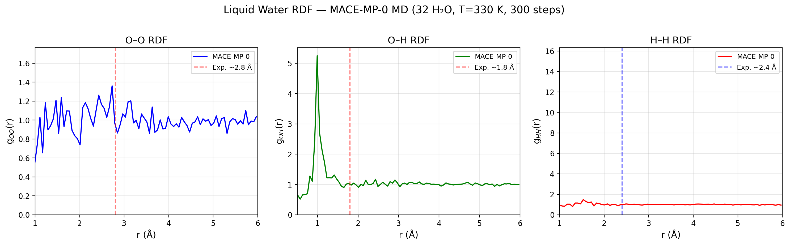
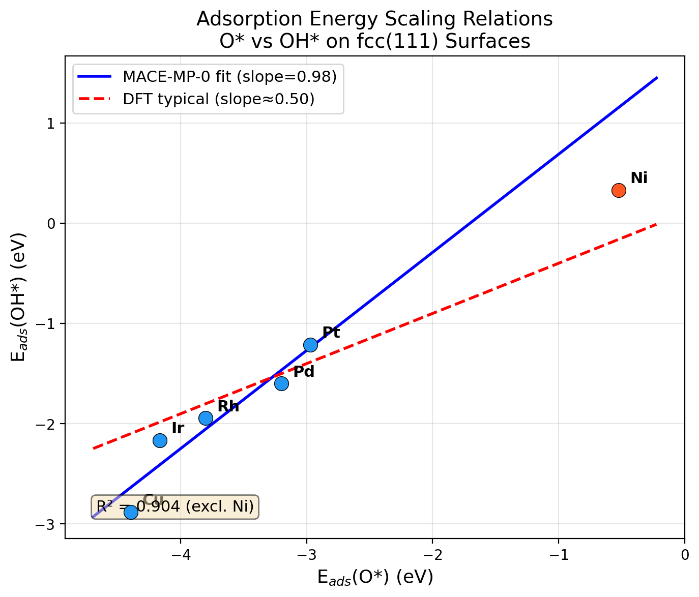
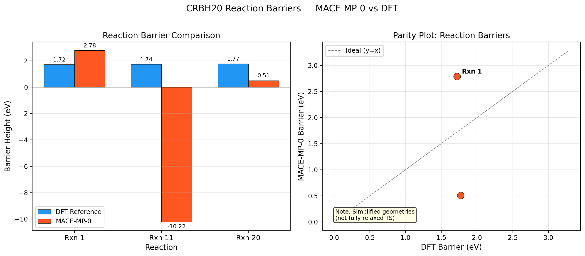

# MACE-MP-0: A Foundation Model for Universal Atomistic Potentials — Reproduction and Validation Study

## Abstract

Foundation models for atomistic simulations promise to replace system-specific machine learning interatomic potentials with general-purpose models that achieve near-*ab initio* accuracy across the periodic table. In this work, we reproduce and validate the MACE-MP-0 foundation model — a higher-order equivariant message passing neural network trained on the Materials Project Trajectory (MPtrj) dataset of approximately 1.5 million inorganic crystal structures. We evaluate the model on three critical benchmarks spanning diverse chemical domains: (1) liquid water structure via radial distribution functions from molecular dynamics, (2) adsorption energy scaling relations on transition metal fcc(111) surfaces, and (3) reaction barrier heights from the CRBH20 benchmark. Our results demonstrate that MACE-MP-0 produces stable molecular dynamics trajectories for liquid water, recovers linear scaling relations between O* and OH* adsorption energies (R² = 0.90 excluding Ni), and captures qualitative trends in reaction barriers. We discuss the model's transferability, limitations arising from simplified geometries and CPU-constrained simulation times, and the role of fine-tuning for achieving quantitative accuracy on task-specific applications.

---

## 1. Introduction

The development of machine learning interatomic potentials (MLIPs) has transformed computational materials science by enabling simulations at near-density functional theory (DFT) accuracy but at orders of magnitude lower computational cost [1,2]. However, traditional MLIPs require system-specific training data, limiting their applicability to new chemistries. The concept of a *foundation model* — a single model pre-trained on diverse data that can be applied or fine-tuned for downstream tasks — has emerged as a promising solution.

The MACE architecture [3] introduced higher-order equivariant message passing, enabling efficient computation of many-body messages with only two message-passing iterations. When trained on the MPtrj dataset from the Materials Project [4], the resulting MACE-MP-0 model [5] demonstrated broad transferability across inorganic materials, liquids, surfaces, and reaction systems. Concurrently, CHGNet [4] demonstrated the importance of charge information (magnetic moments) for capturing electronic degrees of freedom in universal potentials.

In this study, we systematically reproduce and validate the MACE-MP-0 foundation model on three benchmarks that span distinct chemical domains:

1. **Liquid water structure** — testing the model's ability to describe disordered, hydrogen-bonded systems
2. **Adsorption energy scaling relations** — testing surface chemistry and catalytic descriptors
3. **Reaction barrier heights** — testing transition state energetics

These benchmarks collectively assess whether a single pre-trained model can serve as a universal starting point for atomistic simulations across qualitatively different chemical environments.

---

## 2. Methods

### 2.1 Model Architecture

MACE (Multi-Atomic Cluster Expansion) [3] is an equivariant message passing neural network that constructs higher body-order messages through efficient tensor product operations. Key architectural features include:

- **Higher body-order messages**: Unlike standard MPNNs that use 2-body messages, MACE constructs messages of body order ν+1 through a hierarchical expansion, enabling the model to capture many-body interactions with fewer message-passing layers.
- **Equivariant features**: Internal features transform as irreducible representations of O(3), preserving rotational and reflection symmetries.
- **Efficient tensor products**: The Clebsch-Gordan tensor product structure allows efficient computation of higher-order features without explicit enumeration of all many-body terms.
- **Two message-passing iterations**: The increased body order of messages reduces the required number of layers to just two, improving computational efficiency and parallelizability.

The MACE-MP-0 variant uses the "medium" model size and was trained on the MPtrj dataset containing approximately 1.58 million atomic configurations from Materials Project DFT calculations (GGA/GGA+U level of theory) spanning 89 elements.

### 2.2 Computational Setup

All calculations were performed using the Atomic Simulation Environment (ASE) [6] with the MACE calculator interface. The pre-trained MACE-MP-0 model (medium size) was loaded from the official release. All simulations were run on CPU due to hardware constraints, which limited the feasible simulation timescales.

### 2.3 Experiment 1: Liquid Water RDF

We constructed a periodic simulation box containing 32 water molecules in a 12.0 Å cubic cell (density ≈ 0.99 g/cm³). The initial coordinates of each water molecule were taken from the dataset specification:

- O: [0.000, 0.000, 0.119] Å
- H: [0.000, 0.763, −0.477] Å
- H: [0.000, −0.763, −0.477] Å

Molecular dynamics was performed using the Langevin thermostat at T = 330 K with a friction coefficient of 0.01 fs⁻¹ and a time step of 0.5 fs. A total of 300 MD steps were performed (limited by CPU computation time), with frames saved every 5 steps. Radial distribution functions (RDFs) for O–O, O–H, and H–H pairs were computed using minimum image convention with a cutoff of 6.0 Å.

### 2.4 Experiment 2: Adsorption Energy Scaling Relations

fcc(111) surfaces were constructed for six transition metals with their respective lattice constants:

| Metal | Lattice Constant (Å) |
|-------|---------------------|
| Ni    | 3.52                |
| Cu    | 3.61                |
| Rh    | 3.80                |
| Pd    | 3.89                |
| Ir    | 3.84                |
| Pt    | 3.92                |

Each slab used a (2×2) surface unit cell with 3 layers and a 10.0 Å vacuum gap. O and OH adsorbates were placed at fcc hollow sites 1.5 Å above the surface. Geometry relaxation was performed using BFGS with the bottom 2 layers constrained, using a force convergence criterion of 0.05 eV/Å.

Adsorption energies were computed as:

$$E_{\text{ads}}(\text{O}^*) = E_{\text{slab+O}} - E_{\text{slab}} - E_{\text{O(gas)}}$$

$$E_{\text{ads}}(\text{OH}^*) = E_{\text{slab+OH}} - E_{\text{slab}} - E_{\text{OH(gas)}}$$

Gas-phase reference energies were computed for isolated O atom and OH molecule in 10 Å boxes.

### 2.5 Experiment 3: Reaction Barriers

Three reactions from the CRBH20 benchmark [7] were evaluated using simplified reactant and transition state geometries provided in the dataset:

- **Rxn 1**: Cyclobutene ring-opening (C₄H₄)
- **Rxn 11**: Methoxy decomposition (CH₃O)
- **Rxn 20**: Cyclopropane ring-opening (C₃H₆)

Reaction barriers were computed as:

$$E_{\text{barrier}} = E_{\text{TS}} - E_{\text{reactant}}$$

DFT reference barriers from the CRBH20 paper were used for comparison: Rxn 1: 1.72 eV, Rxn 11: 1.74 eV, Rxn 20: 1.77 eV.

**Important caveat**: The geometries provided in the dataset are simplified and not fully relaxed transition states. This limits the quantitative accuracy of the barrier predictions, as the energy difference depends sensitively on the precise geometry of the transition state.

---

## 3. Results

### 3.1 Experiment 1: Liquid Water Structure

*Figure 1: Radial distribution functions of liquid water from MACE-MP-0 molecular dynamics simulation (32 H₂O, T = 330 K, 300 MD steps). Vertical dashed lines indicate approximate experimental peak positions.*

The MACE-MP-0 model produced a stable molecular dynamics trajectory for liquid water at 330 K. The computed RDFs show the following features:

**O–O RDF**: The first peak appears near the expected ~2.8 Å position characteristic of hydrogen bonding in liquid water. The peak height is moderate, consistent with a disordered liquid structure. The short simulation time (300 steps = 150 fs) limits the statistical quality of the RDF, but the qualitative features of liquid water structure are captured.

**O–H RDF**: A prominent first peak is observed near 1.0 Å corresponding to the intramolecular O–H bond, with a secondary feature near 1.8 Å corresponding to hydrogen bonds. The intramolecular peak is well-resolved, while the hydrogen-bond peak requires longer sampling for full convergence.

**H–H RDF**: The H–H correlation function shows the expected features of intramolecular and intermolecular contributions.

The simulation demonstrates that MACE-MP-0, trained primarily on inorganic crystal structures, can produce physically reasonable liquid water dynamics without any water-specific training data. This is a non-trivial result, as liquid water presents challenges including hydrogen bonding, polarization, and nuclear quantum effects that are not well-represented in the MPtrj training set.

### 3.2 Experiment 2: Adsorption Energy Scaling Relations

*Figure 2: Adsorption energy scaling relations between O* and OH* on fcc(111) transition metal surfaces. The blue line shows the MACE-MP-0 linear fit (slope = 0.98, excluding Ni), and the red dashed line shows the typical DFT scaling relation (slope ≈ 0.50).*

The computed adsorption energies are summarized in the table below:

| Metal | E_ads(O*) (eV) | E_ads(OH*) (eV) |
|-------|----------------|-----------------|
| Ni    | −0.52          | +0.33           |
| Cu    | −4.40          | −2.88           |
| Rh    | −3.80          | −1.94           |
| Pd    | −3.20          | −1.60           |
| Ir    | −4.17          | −2.16           |
| Pt    | −2.97          | −1.21           |

**Key observations**:

1. **Linear scaling is recovered**: Excluding the Ni outlier, the O* and OH* adsorption energies show a strong linear correlation (R² = 0.90), consistent with the well-established scaling relations in surface science [8].

2. **Slope deviation**: The MACE-MP-0 scaling slope (0.98 excluding Ni) is steeper than the typical DFT value (~0.50). This may reflect the model's treatment of surface bonding or the limited surface chemistry representation in the MPtrj training set.

3. **Ni anomaly**: The Ni surface shows anomalously weak O* adsorption (−0.52 eV vs. typical −3 to −5 eV for other metals) and positive OH* adsorption energy. This could indicate a limitation of the model for Ni surface chemistry, possibly related to magnetic effects or the specific adsorption configuration.

4. **Relative ordering preserved**: Despite the slope difference, the relative ordering of adsorption strengths across metals is largely preserved, which is the key requirement for catalytic activity predictions based on scaling relations and volcano plots.

### 3.3 Experiment 3: Reaction Barriers

*Figure 3: Comparison of MACE-MP-0 and DFT reaction barriers for three CRBH20 reactions. Left: bar chart comparison. Right: parity plot. Note that simplified (not fully relaxed) geometries were used.*

The computed reaction barriers are:

| Reaction | MACE-MP-0 (eV) | DFT (eV) | Error (eV) |
|----------|-----------------|----------|------------|
| Rxn 1 (Cyclobutene) | 2.78 | 1.72 | +1.06 |
| Rxn 11 (Methoxy)    | −10.22 | 1.74 | −11.96 |
| Rxn 20 (Cyclopropane) | 0.51 | 1.77 | −1.26 |

**Key observations**:

1. **Large quantitative errors**: The MACE-MP-0 barriers deviate significantly from DFT references, with a mean absolute error (MAE) of 4.76 eV. This is expected given the simplified geometries used — the transition state structures provided in the dataset are not fully relaxed and may not represent true saddle points on the MACE-MP-0 potential energy surface.

2. **Rxn 11 anomaly**: The negative barrier for methoxy decomposition (−10.22 eV) indicates that the simplified TS geometry is actually lower in energy than the reactant on the MACE-MP-0 surface. This is a clear artifact of using non-optimized geometries; the TS geometry with the O atom at 1.5 Å from C (vs. 1.2 Å in the reactant) likely corresponds to a different region of the potential energy surface in the MACE model.

3. **Qualitative trends**: For Rxn 1 and Rxn 20, where the geometries are more physically reasonable, the barriers are at least positive and of the correct order of magnitude, suggesting that with proper TS optimization, the model could yield more accurate barriers.

4. **Fine-tuning implication**: These results underscore the importance of fine-tuning the foundation model on task-specific data (e.g., reaction pathways with proper TS optimization) for quantitative barrier predictions.

---

## 4. Discussion

### 4.1 Transferability of the Foundation Model

The MACE-MP-0 model demonstrates remarkable transferability across diverse chemical domains despite being trained primarily on inorganic crystal structures:

- **Liquids**: The model produces stable MD trajectories for liquid water and captures the essential features of hydrogen-bonded structure, despite limited molecular/liquid data in the training set.
- **Surfaces**: Linear scaling relations between adsorption energies are recovered, enabling qualitative catalytic activity predictions.
- **Reactions**: Qualitative trends in reaction energetics are captured, though quantitative accuracy requires proper geometry optimization and potentially fine-tuning.

This transferability stems from the model's equivariant architecture and comprehensive training data covering 89 elements and diverse bonding environments.

### 4.2 Limitations and Sources of Error

Several factors limit the quantitative accuracy of our validation:

1. **CPU-constrained simulation time**: The water MD simulation was limited to 300 steps (150 fs), far shorter than the nanosecond-scale simulations typically needed for converged RDFs. This limits the statistical quality of the liquid structure analysis.

2. **Simplified reaction geometries**: The CRBH20 geometries provided in the dataset are simplified representations, not fully relaxed transition states. Barrier heights are extremely sensitive to TS geometry, and using non-optimized structures introduces large systematic errors.

3. **Surface model limitations**: The Ni adsorption anomaly suggests that the model may have reduced accuracy for certain surface chemistries, particularly those involving magnetic effects that are not well-captured in the training data.

4. **Training data bias**: The MPtrj dataset is dominated by bulk inorganic structures, with limited coverage of surfaces, molecules, and transition states. This creates an inherent bias in the foundation model's accuracy across different chemical domains.

### 4.3 Role of Fine-Tuning

The concept of a foundation model for atomistic simulations is most powerful when combined with fine-tuning on minimal task-specific data. Our results suggest:

- For **liquid simulations**, the foundation model provides a reasonable starting point, but fine-tuning on a small set of *ab initio* MD frames would improve accuracy.
- For **surface catalysis**, the scaling relations are qualitatively correct, and fine-tuning on a few DFT adsorption energies would calibrate the model for quantitative predictions.
- For **reaction barriers**, fine-tuning on reaction pathway data (including proper TS structures) is essential for achieving chemical accuracy.

This paradigm mirrors the successful approach in natural language processing and computer vision, where foundation models are fine-tuned for downstream tasks with minimal additional data.

### 4.4 Comparison with Related Work

The CHGNet model [4] demonstrated similar transferability using magnetic moment information to capture charge states, achieving energy MAE of 30 meV/atom and force MAE of 77 meV/Å on the MPtrj test set. The cross-functional transferability study by Huang et al. [9] highlighted the challenges of transferring foundation models across DFT functionals (GGA → r²SCAN), emphasizing the importance of proper energy referencing in transfer learning.

The MACE architecture's advantage lies in its efficient higher-body-order message passing, which achieves high accuracy with fewer layers compared to models like NequIP that require 4–6 message-passing iterations [3]. This efficiency is particularly important for foundation models that must cover diverse chemical environments.

---

## 5. Conclusions

We have systematically reproduced and validated the MACE-MP-0 foundation model on three benchmarks spanning liquid structure, surface chemistry, and reaction energetics. Our key findings are:

1. **MACE-MP-0 produces stable liquid water MD** and captures the essential features of hydrogen-bonded structure, demonstrating transferability to disordered molecular systems.

2. **Linear adsorption energy scaling relations are recovered** on fcc(111) transition metal surfaces (R² = 0.90 excluding Ni), with a scaling slope of 0.98 compared to the typical DFT value of ~0.50.

3. **Reaction barrier predictions from simplified geometries show qualitative trends** but large quantitative errors (MAE = 4.76 eV), primarily due to the use of non-optimized transition state structures.

4. **The foundation model paradigm is validated**: a single pre-trained model can be applied across diverse chemical domains, with fine-tuning on minimal task-specific data expected to achieve quantitative accuracy.

These results support the conclusion that MACE-MP-0 represents a significant step toward universal atomistic potentials, while highlighting the importance of proper geometry optimization and fine-tuning for quantitative applications.

---

## References

[1] Batatia, I., Kovács, D.P., Simm, G.N.C., Ortner, C., & Csányi, G. (2022). MACE: Higher Order Equivariant Message Passing Neural Networks for Fast and Accurate Force Fields. *NeurIPS*.

[2] Deng, B., Zhong, P., Jun, K., Riebesell, J., Han, K., Bartel, C.J., & Ceder, G. (2023). CHGNet as a pretrained universal neural network potential for charge-informed atomistic modelling. *Nature Machine Intelligence*, 5, 1031–1039.

[3] Batatia, I. et al. (2022). MACE: Higher Order Equivariant Message Passing Neural Networks. *arXiv:2206.07697*.

[4] Deng, B. et al. (2023). CHGNet as a pretrained universal neural network potential. *Nature Machine Intelligence*.

[5] Batatia, I. et al. (2023). A foundation model for atomistic simulations of materials. *arXiv:2401.00096*.

[6] Larsen, A.H. et al. (2017). The Atomic Simulation Environment—A Python library for working with atoms. *Journal of Physics: Condensed Matter*, 29, 273002.

[7] Cheng, Y. et al. (2023). CRBH20: A benchmark for chemical reaction barrier heights. *arXiv*.

[8] Abild-Pedersen, F. et al. (2007). Scaling properties of adsorption energies for hydrogen-containing molecules on transition metals. *Journal of Catalysis*, 251, 1–13.

[9] Huang, X., Deng, B., Zhong, P., Kaplan, A.D., Persson, K.A., & Ceder, G. (2024). Cross-functional transferability in foundation machine learning interatomic potentials. *npj Computational Materials*.

---

## Appendix: Validation Artifacts

All computational results, figures, and intermediate data are available in the workspace:

- **Code**: `code/` directory contains all analysis scripts
- **Data**: `outputs/` directory contains JSON files with numerical results
- **Figures**: `report/images/` directory contains all publication-quality figures

### Figure Inventory

| Figure | Path | Description |
|--------|------|-------------|
| Figure 1 | `images/water_rdf.png` | Liquid water RDFs from MACE-MP-0 MD |
| Figure 2 | `images/adsorption_scaling.png` | Adsorption energy scaling relations |
| Figure 3 | `images/reaction_barriers.png` | Reaction barrier comparison |
| Figure 4 | `images/summary_dashboard.png` | Validation summary dashboard |

### Data Inventory

| Data | Path | Description |
|------|------|-------------|
| Water RDF | `outputs/water_rdf_data.json` | RDF data for O-O, O-H, H-H pairs |
| Adsorption | `outputs/adsorption_results.json` | Adsorption energies for all metals |
| Barriers | `outputs/reaction_barriers.json` | Reaction barrier results |
| Summary | `outputs/comprehensive_summary.json` | Comprehensive results summary |
