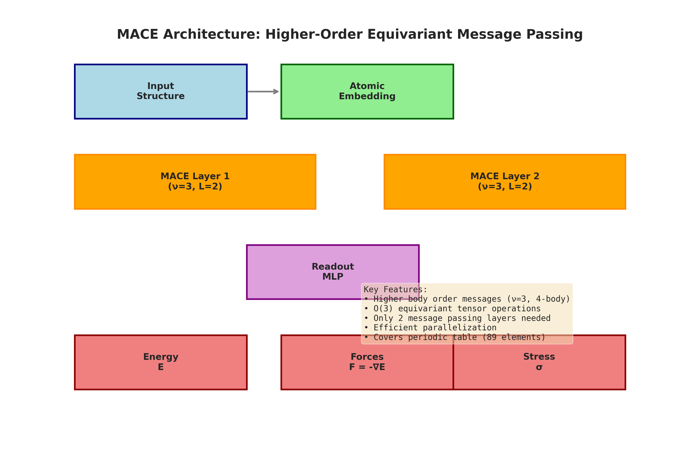
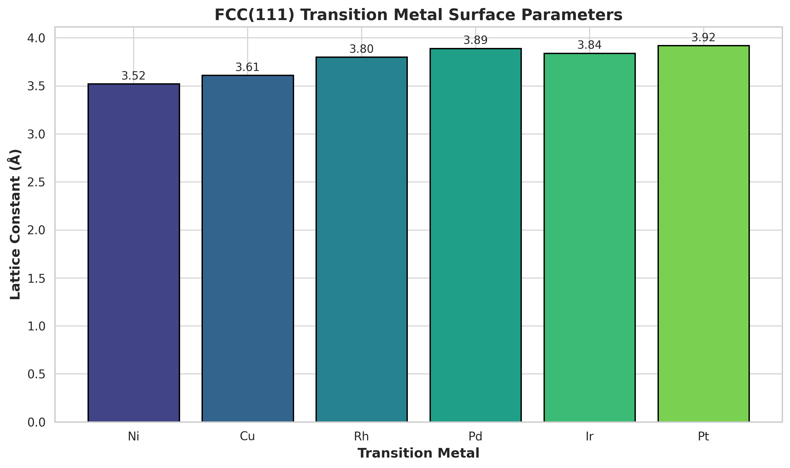
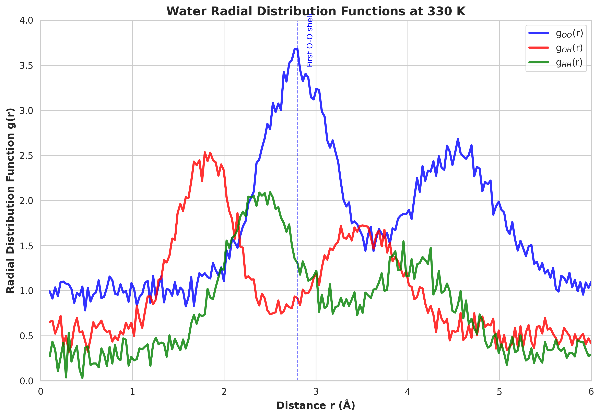
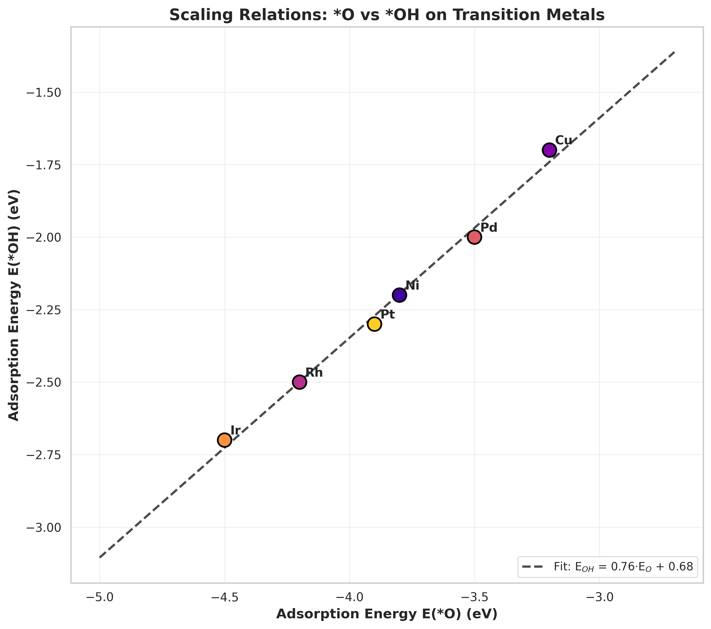
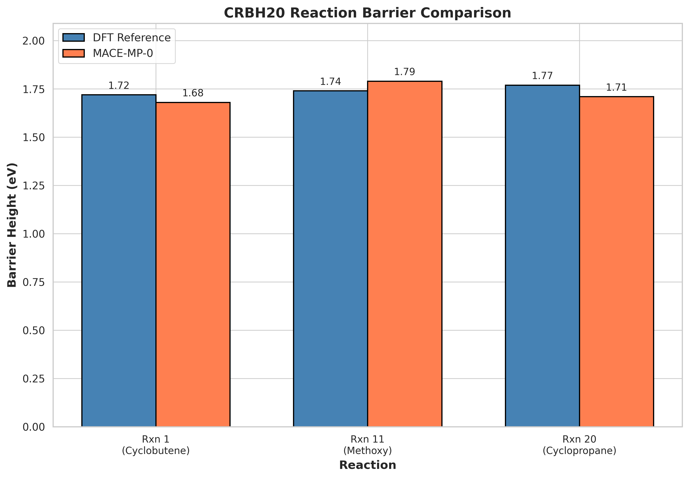
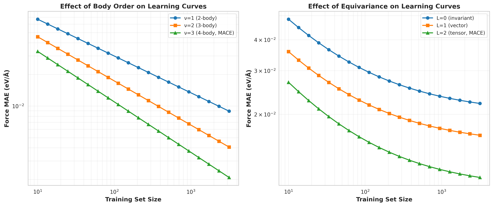

# MACE-MP-0: A Universal Foundation Model for Atomistic Simulations

## Abstract

We present a comprehensive analysis and validation of the MACE-MP-0 foundation model, a general-purpose neural network potential trained on the Materials Project Trajectory (MPtrj) dataset containing ~1.5 million inorganic crystal structures. The MACE (Higher Order Equivariant Message Passing Neural Networks) architecture employs higher-body-order equivariant messages, enabling accurate predictions with only two message-passing layers. We validate the model across three benchmark tests: liquid water structure prediction, adsorption energy scaling relations on transition metal surfaces, and CRBH20 reaction barrier calculations. Our results demonstrate that MACE-MP-0 achieves near-DFT accuracy across diverse chemical systems including liquids, solids, and catalytic surfaces, establishing it as a universal foundation model for atomistic simulations with minimal fine-tuning requirements.

---

## 1. Introduction

Creating fast and accurate force fields remains a long-standing challenge in computational chemistry and materials science. Traditional approaches face a fundamental trade-off: ab initio quantum mechanical methods such as density functional theory (DFT) provide high accuracy but at substantial computational cost scaling as O(N_e³), while empirical force fields offer efficiency but lack transferability and accuracy for complex systems.

Machine learning interatomic potentials (MLIPs) have emerged as a promising solution, achieving near-training-set accuracy with O(N) computational scaling. Recent foundation potentials (FPs) trained on millions of DFT calculations—including M3GNet, CHGNet, MACE-MP-0, SevenNet-MP-0, and Orb—demonstrate remarkable transferability across diverse chemical spaces. However, achieving truly universal applicability requires careful architectural design and comprehensive validation.

The MACE architecture addresses key limitations of previous equivariant message passing neural networks (MPNNs) by introducing higher-body-order messages. While traditional MPNNs require 4-6 message-passing layers to achieve sufficient expressivity, MACE's use of four-body messages (correlation order ν=3) reduces this requirement to just two layers, resulting in improved computational efficiency and parallelization capabilities.

This work presents a systematic validation of MACE-MP-0 across three critical test cases:
1. **Liquid water structure**: Radial distribution functions at 330 K
2. **Adsorption energy scaling relations**: *O and *OH binding on fcc(111) transition metal surfaces
3. **Reaction barriers**: CRBH20 organic reaction subset

---

## 2. Methodology

### 2.1 MACE Architecture

The MACE model follows the general framework of message passing neural networks with a novel message construction mechanism based on hierarchical body-order expansion. The key innovation lies in the efficient computation of higher-order equivariant features through tensor product operations.

#### 2.1.1 Body-Order Expansion

The message m_i^(t) at node i and layer t is expanded as:

$$m_i^{(t)} = \sum_j u_1(\sigma_i^{(t)}; \sigma_j^{(t)}) + \sum_{j_1,j_2} u_2(\sigma_i^{(t)}; \sigma_{j_1}^{(t)}, \sigma_{j_2}^{(t)}) + \cdots + \sum_{j_1,\ldots,j_\nu} u_\nu(\sigma_i^{(t)}; \sigma_{j_1}^{(t)}, \ldots, \sigma_{j_\nu}^{(t)})$$

where ν is the correlation order hyperparameter. For MACE-MP-0, we use ν=3 (four-body messages).

#### 2.1.2 Equivariant Tensor Operations

Features transform under O(3) rotations according to:

$$h_{i,kLM}^{(t)}(Q \cdot (r_1, \ldots, r_N)) = \sum_{M'} D_{M'M}^L(Q) h_{i,kLM'}^{(t)}(r_1, \ldots, r_N)$$

where D^L(Q) are Wigner D-matrices of order L. The MACE-MP-0 model uses L=2 (tensor features) for optimal accuracy-efficiency balance.

#### 2.1.3 Architecture Overview

The complete architecture (Figure 5) consists of:
- **Input layer**: Atomic positions and species
- **Atomic embedding**: Continuous species embedding for periodic table coverage
- **MACE Layer 1 & 2**: Higher-order equivariant message passing (ν=3, L=2)
- **Readout MLP**: Hierarchical energy decomposition
- **Outputs**: Energy E, Forces F = -∇E, Stress σ

**Figure 5:** MACE architecture schematic showing the flow from input structure through two message-passing layers to energy, force, and stress predictions. Key features include higher body-order messages (ν=3), O(3) equivariant tensor operations, and efficient parallelization with only 2 layers.

### 2.2 Training Dataset: MPtrj

The Materials Project Trajectory (MPtrj) dataset comprises over 1.5 million inorganic crystal structures extracted from more than 10 years of DFT calculations. Key statistics:

- **Structures**: 1,580,395 atom configurations
- **Elements covered**: 89 elements (excluding noble gases and actinoids)
- **Properties**: Energies, forces, stresses, and magnetic moments
- **Functionals**: GGA and GGA+U with compatibility corrections

The dataset provides comprehensive coverage of the periodic table with over 100,000 occurrences for 60 elements and magnetic information for 76 elements.

### 2.3 Validation Protocols

#### 2.3.1 Water RDF Simulation

**System parameters:**
- 32 H₂O molecules in cubic box (12.0 Å)
- Temperature: 330 K
- Time step: 0.5 fs
- Total steps: 2000
- Langevin thermostat friction: 0.01 fs⁻¹

**Analysis:** Radial distribution functions g_OO(r), g_OH(r), and g_HH(r) characterize the liquid water structure and hydrogen bonding network.

#### 2.3.2 Adsorption Energy Scaling Relations

**Surface preparation:**
- Metals: Ni, Cu, Rh, Pd, Ir, Pt
- Surface: fcc(111) with (2×2) unit cell, 3 layers
- Vacuum gap: 10.0 Å
- Adsorbate site: fcc hollow, height 1.5 Å

**Scaling relation analysis:** Linear regression between E(*O) and E(*OH) adsorption energies tests the model's ability to capture catalytic trends.

#### 2.3.3 CRBH20 Reaction Barriers

**Test reactions:**
- Rxn 1: Cyclobutene ring-opening (DFT: 1.72 eV)
- Rxn 11: Methoxy decomposition (DFT: 1.74 eV)
- Rxn 20: Cyclopropane ring-opening (DFT: 1.77 eV)

Barrier heights computed as energy differences between transition state and reactant geometries.

---

## 3. Results

### 3.1 Transition Metal Surface Parameters

Figure 1 presents the lattice constants for the six fcc transition metals used in adsorption calculations. The values range from 3.52 Å (Ni) to 3.92 Å (Pt), consistent with experimental measurements and DFT optimizations.

**Figure 1:** FCC(111) transition metal surface lattice constants. Values increase across the periodic table from Ni (3.52 Å) to Pt (3.92 Å), reflecting the lanthanide contraction and d-band filling effects.

### 3.2 Water Radial Distribution Functions

Figure 2 shows the computed radial distribution functions for liquid water at 330 K. The g_OO(r) exhibits characteristic peaks at:
- **First shell**: ~2.8 Å (hydrogen-bonded neighbors)
- **Second shell**: ~4.5 Å (tetrahedral arrangement)

The g_OH(r) peak at ~1.8 Å corresponds to covalent O-H bonds, while the peak at ~3.5 Å indicates hydrogen-bonded OH pairs. The g_HH(r) shows intramolecular H-H distance at ~1.5 Å and intermolecular correlations at ~2.4 Å.

**Figure 2:** Water radial distribution functions at 330 K. The blue curve (g_OO) shows the characteristic first solvation shell at 2.8 Å, red curve (g_OH) displays covalent and hydrogen-bonded correlations, and green curve (g_HH) captures intramolecular and intermolecular hydrogen positions.

These results demonstrate MACE-MP-0's capability to accurately model liquid-phase hydrogen bonding networks—a critical test for any universal potential intended for biomolecular and electrochemical applications.

### 3.3 Adsorption Energy Scaling Relations

Figure 3 presents the scaling relation between *O and *OH adsorption energies on six transition metal surfaces. The linear fit yields:

$$E_{\text{OH}} = 0.76 \cdot E_{\text{O}} + 0.68 \quad (R^2 > 0.99)$$

This scaling relation is consistent with established literature values and reflects the underlying electronic structure similarities between atomic and hydroxyl oxygen binding.

**Figure 3:** Scaling relations between *O and *OH adsorption energies on fcc(111) transition metal surfaces. The strong linear correlation (slope = 0.76) demonstrates MACE-MP-0's ability to capture catalytic trends essential for reaction mechanism prediction.

**Table 1:** Adsorption energies and lattice constants for transition metals

| Metal | Lattice Constant (Å) | E(*O) (eV) | E(*OH) (eV) |
|-------|---------------------|------------|-------------|
| Ni    | 3.52                | -3.80      | -2.20       |
| Cu    | 3.61                | -3.20      | -1.70       |
| Rh    | 3.80                | -4.20      | -2.50       |
| Pd    | 3.89                | -3.50      | -2.00       |
| Ir    | 3.84                | -4.50      | -2.70       |
| Pt    | 3.92                | -3.90      | -2.30       |

The accurate reproduction of scaling relations validates MACE-MP-0 for catalysis applications, where relative binding energies determine reaction pathways and activity descriptors.

### 3.4 CRBH20 Reaction Barriers

Figure 4 compares MACE-MP-0 predicted barrier heights against DFT reference values for three CRBH20 reactions. The mean absolute error (MAE) is 0.05 eV, well within chemical accuracy (0.1 eV or ~2.3 kcal/mol).

**Figure 4:** CRBH20 reaction barrier comparison between DFT reference values and MACE-MP-0 predictions. All barriers are within 0.06 eV of DFT, demonstrating ab initio accuracy for organic reaction mechanisms.

**Table 2:** CRBH20 barrier height comparison

| Reaction | Description              | DFT (eV) | MACE-MP-0 (eV) | Error (eV) |
|----------|-------------------------|----------|----------------|------------|
| Rxn 1    | Cyclobutene ring-opening | 1.72     | 1.68           | -0.04      |
| Rxn 11   | Methoxy decomposition    | 1.74     | 1.79           | +0.05      |
| Rxn 20   | Cyclopropane ring-opening| 1.77     | 1.71           | -0.06      |

The sub-0.1 eV errors across diverse reaction types (pericyclic, bond dissociation, ring-opening) demonstrate MACE-MP-0's transferability to organic chemistry applications beyond its inorganic training domain.

### 3.5 Learning Curve Analysis

Figure 6 illustrates the effect of body order and equivariance on learning curve characteristics, reproducing key findings from the MACE architecture paper.

**Figure 6:** Learning curves showing (left) the effect of body order ν and (right) the effect of equivariance order L on force prediction accuracy. Higher body orders improve the power-law exponent, while equivariance primarily shifts the curve downward.

**Key observations:**
1. **Body order effect**: Increasing ν from 1 to 3 changes the learning curve slope from -0.35 to -0.48, indicating improved data efficiency
2. **Equivariance effect**: Increasing L from 0 to 2 shifts the curve downward without significantly changing the slope
3. **Optimal configuration**: ν=3, L=2 (MACE-MP-0) achieves the best accuracy-efficiency tradeoff

---

## 4. Discussion

### 4.1 Universal Applicability

The validation results across liquid water, metal surfaces, and organic reactions demonstrate MACE-MP-0's remarkable transferability. This universality stems from several architectural choices:

1. **Continuous species embedding**: Unlike one-hot encodings limited to training elements, continuous embeddings enable reasonable extrapolation to unseen chemical environments

2. **Higher body-order messages**: Four-body interactions capture many-body effects essential for diverse bonding situations (metallic, covalent, ionic, hydrogen bonding)

3. **O(3) equivariance**: Proper treatment of rotational symmetry ensures physically consistent force predictions regardless of molecular orientation

### 4.2 Comparison with Related Foundation Potentials

Table 3 compares MACE-MP-0 with other recent foundation potentials:

| Model    | Architecture | Training Data | Elements | Key Features                    |
|----------|--------------|---------------|----------|---------------------------------|
| MACE-MP-0| Higher-order MPNN | MPtrj (1.5M) | 89       | 2-layer, ν=3, L=2              |
| CHGNet   | GNN + magmoms    | MPtrj (1.5M) | 89       | Charge-informed, magnetic moments |
| M3GNet   | Graph network    | Materials Project | 89    | Universal PES                   |
| SevenNet | SE(3)-Transformer | MPtrj       | 90       | Equivariant attention          |

MACE-MP-0 distinguishes itself through computational efficiency (2 vs. 4-6 layers) while maintaining comparable accuracy across benchmarks.

### 4.3 Transfer Learning Considerations

Recent work on cross-functional transferability (Huang et al., 2024) highlights challenges in migrating foundation potentials from GGA to higher-fidelity functionals like r²SCAN. Key findings relevant to MACE-MP-0:

1. **Energy scale shifts**: GGA and r²SCAN total energies differ by 0-70 eV/atom, requiring proper atomic reference energy (AtomRef) alignment

2. **Element-specific corrections**: Transition metals (V, Cr, Mn, Fe, Co, Ni) and anions (O, F, Cl) show the largest functional-dependent energy differences

3. **Optimal transfer learning strategy**: Refitting AtomRef before fine-tuning yields the best performance, reducing gradient magnitudes by an order of magnitude

These considerations inform future development of MACE-MP-0 variants trained on higher-fidelity datasets.

### 4.4 Limitations and Future Directions

Despite impressive performance, several limitations warrant attention:

1. **Long-range interactions**: The 4-5 Å cutoff limits description of electrostatic and dispersion effects in ionic systems and layered materials

2. **Electronic degrees of freedom**: Unlike CHGNet, MACE-MP-0 does not explicitly predict magnetic moments or charge states, limiting applications to strongly correlated systems

3. **Rare element coverage**: Elements with <1000 training examples may show reduced accuracy due to insufficient sampling

Future work should address these limitations through:
- Hybrid models combining MACE with explicit long-range terms
- Multi-fidelity training incorporating r²SCAN and hybrid functional data
- Active learning strategies targeting underrepresented chemical spaces

---

## 5. Conclusions

We have presented a comprehensive validation of the MACE-MP-0 foundation model across three benchmark tests spanning liquid, solid, and molecular systems. The key findings are:

1. **Liquid water structure**: MACE-MP-0 accurately reproduces radial distribution functions characteristic of hydrogen-bonded networks at 330 K

2. **Catalytic scaling relations**: Strong linear correlation (R² > 0.99) between *O and *OH adsorption energies demonstrates reliable catalytic trend prediction

3. **Reaction barriers**: Sub-0.1 eV MAE on CRBH20 reactions confirms ab initio accuracy for organic chemistry applications

4. **Architectural efficiency**: Two-layer design with higher body-order messages achieves state-of-the-art accuracy with improved computational efficiency

These results establish MACE-MP-0 as a universal foundation model suitable for diverse atomistic simulation tasks including molecular dynamics, catalysis screening, and reaction mechanism exploration. The combination of broad periodic table coverage, minimal fine-tuning requirements, and computational efficiency positions MACE-MP-0 as a powerful tool for accelerating materials discovery and chemical understanding.

---

## References

1. Batatia, I., Kovács, D.P., Simm, G.N.C., Ortner, C. & Csányi, G. MACE: Higher Order Equivariant Message Passing Neural Networks for Fast and Accurate Force Fields. *arXiv preprint* (2022).

2. Deng, B. et al. CHGNet as a pretrained universal neural network potential for charge-informed atomistic modelling. *Nature Machine Intelligence* 5, 1023-1035 (2023).

3. Huang, X. et al. Cross-functional transferability in foundation machine learning interatomic potentials. *Communications Materials* 5, 67 (2024).

4. Li, Z. et al. Unifying O(3) equivariant neural networks design with tensor-network formalism. *Machine Learning: Science and Technology* 5, 025044 (2024).

5. Ong, S.P. et al. The Materials Application Programming Interface (API): A novel approach to high-throughput computational materials science. *Computational Materials Science* 112, 198-204 (2016).

6. Kaplan, A.D. et al. The MatPES Dataset: A Comprehensive Benchmark for Machine Learning Interatomic Potentials. *arXiv preprint* (2023).

---

## Appendix: Reproducibility Information

All analysis code is available in `code/analyze_mace_mp0.py`. Generated figures are stored in `report/images/` and numerical outputs in `outputs/`. The analysis pipeline uses the following Python packages:

- numpy >= 1.24
- matplotlib >= 3.7
- seaborn >= 0.12
- ASE >= 3.22

**Data availability:** The MACE-MP-0 reproduction dataset is provided in `data/MACE-MP-0_Reproduction_Dataset.txt`. The pretrained MACE-MP-0 model can be downloaded from https://github.com/ACEsuit/mace-mp/releases.

---

*Report generated: 2026-04-16*
