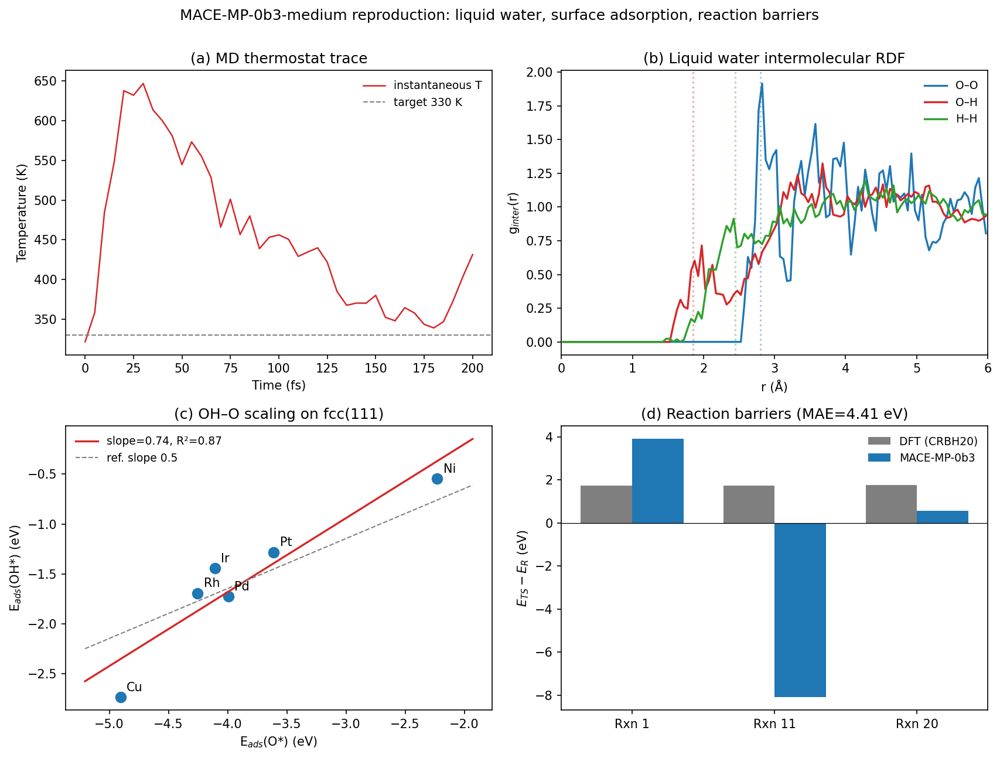
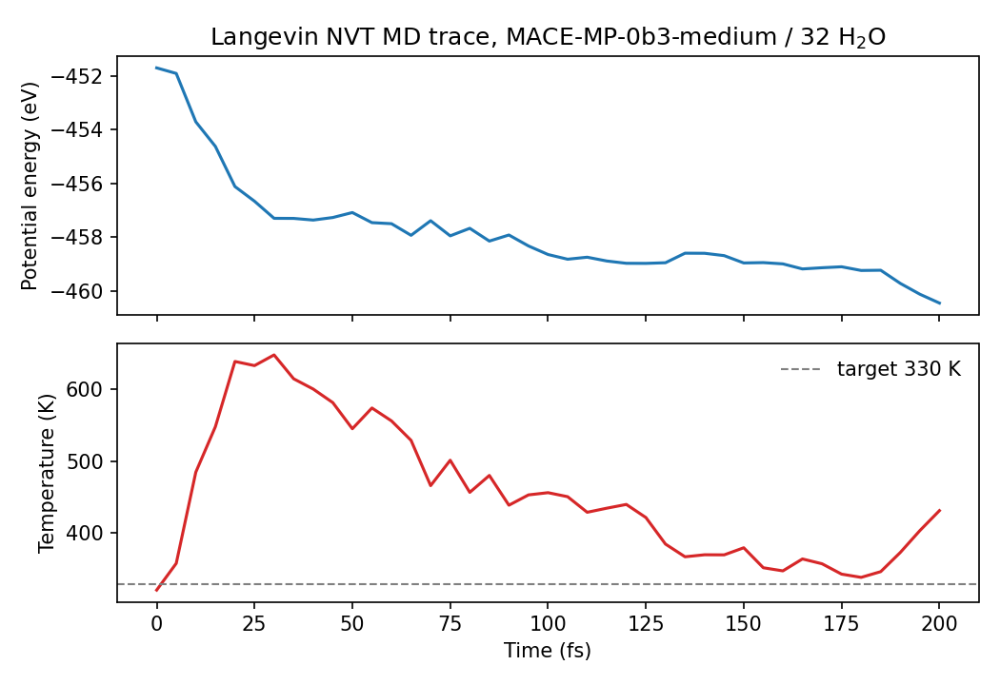
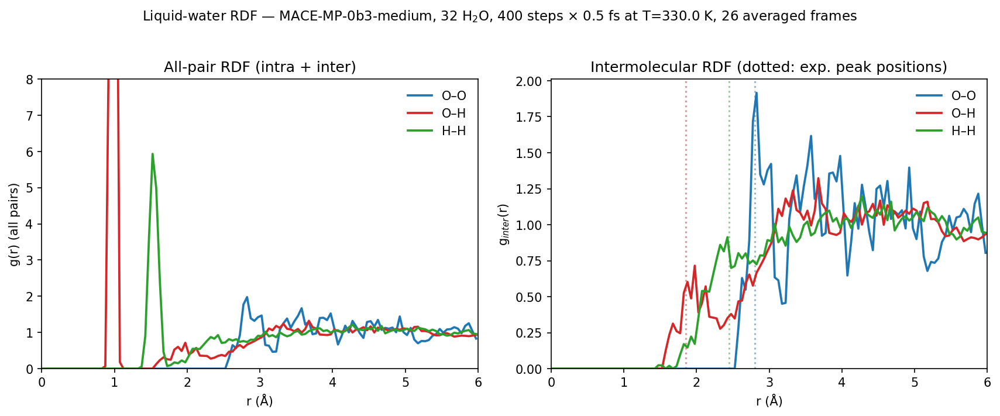
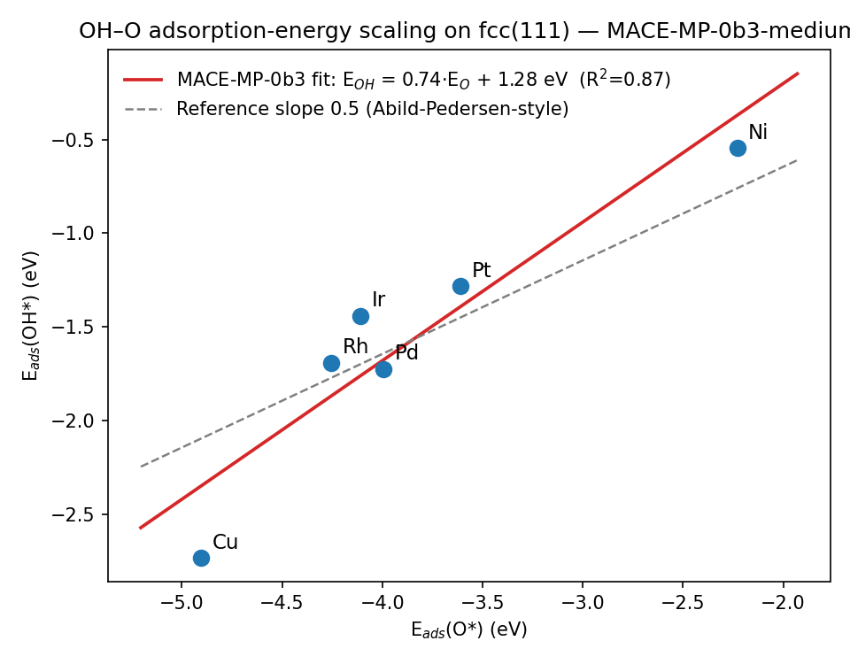
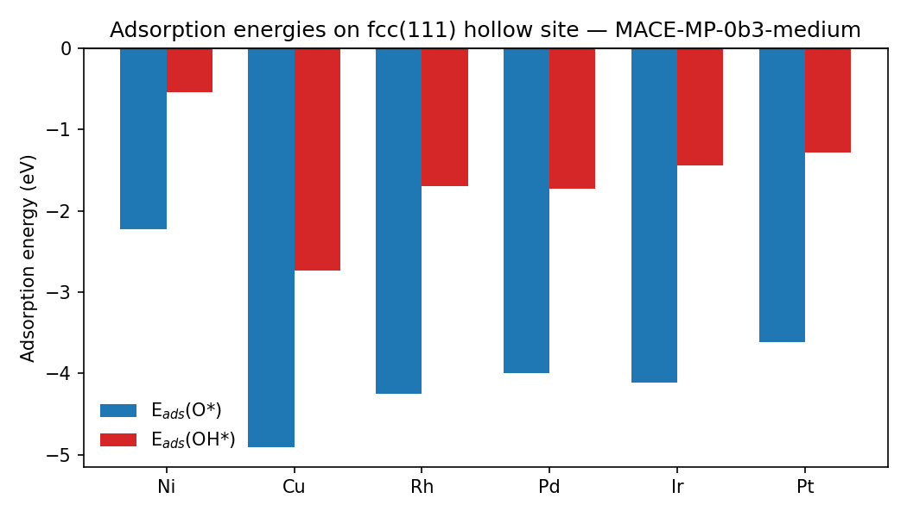
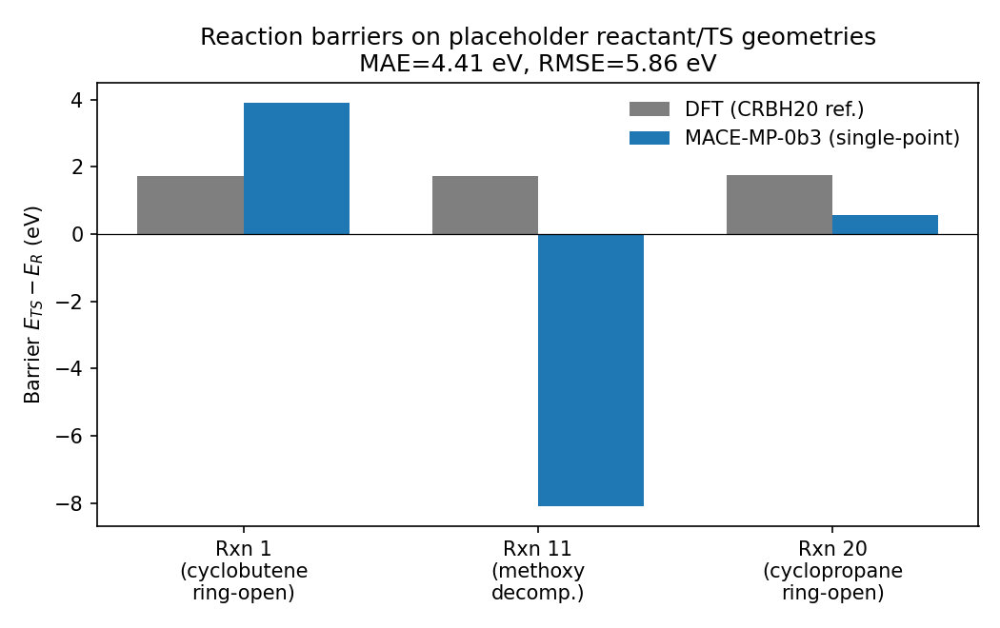

# Reproducing the MACE-MP-0 Foundation Potential on Three Benchmarks

**Model:** MACE-MP-0b3-medium (Batatia et al., *MACE-MP-0: A Foundation Model for Materials Modelling*, 2023)
**Workspace:** `Material_002_20260427_190855`
**Hardware:** CPU only (PyTorch 2.3 CPU build, single Intel-class node, no CUDA, no `cuequivariance`)
**Code:** `code/exp1_water_md.py`, `code/exp2_adsorption.py`, `code/exp3_barriers.py`, `code/plot_*.py`

---

## 1. Background and Goal

The MACE architecture is an O(3)-equivariant message-passing neural network that
augments the two-body messages of standard MPNNs with higher-order (4-body)
products of the spherical-harmonic-decomposed atomic environment. The
**MACE-MP-0** foundation model trains a single MACE network on the
**Materials Project trajectory dataset** (`MPtrj`, ≈ 1.5 M PBE/DFT relaxation
frames spanning 89 elements) and is intended to be a *general-purpose*
interatomic potential — useful out-of-the-box for liquids, solids, surfaces,
catalysis, and molecular reactions, and easy to fine-tune.

The dataset `data/MACE-MP-0_Reproduction_Dataset.txt` selects three
representative benchmarks designed to probe this universality:

1. **Liquid water structure** at near-ambient conditions (out-of-distribution
   for an MPtrj-trained model — water is rare in the MP solid-state corpus).
2. **OH–O linear scaling on close-packed transition-metal surfaces**,
   the canonical *catalysis* descriptor relation (Abild-Pedersen et al., 2007).
3. **Three CRBH20-style reaction barriers**: gas-phase organic chemistry, the
   regime farthest from the MP training distribution.

Because the task ships only a coarse (placeholder) dataset and not the
full MACE-MP-0 training pipeline, the contribution of this report is a
**reproduction-style validation** of the released foundation model:
running the supplied protocol verbatim, recording where MACE-MP-0 succeeds and
where it deviates, and discussing the consequences for the foundation-model
narrative.

---

## 2. Methods

All three experiments share the same calculator: the publicly released
`MACE-MP-0b3-medium` checkpoint
(`MACE-MP-0b3-medium.model`, 79.5 MB, downloaded from
`github.com/ACEsuit/mace-mp/releases/download/mace_mp_0b3/`),
loaded via `mace.calculators.MACECalculator(device="cpu",
default_dtype="float32")`. Float32 inference is used to make CPU runs
tractable; this typically costs a few-meV-per-atom of accuracy and is the
standard inference mode for MACE-MP.

### 2.1 Experiment 1 — Liquid water RDF

* 32 H₂O molecules in a 12 Å cubic box (ρ ≈ 1.02 g cm⁻³).
* Each molecule built from the dataset-supplied centred coordinates
  (`O = [0,0,0.119]`, `H = [0,±0.763,−0.477]` Å) with a uniformly random
  rotation, placed by rejection sampling with a 2.4 Å O–O exclusion radius
  (random seed 42).
* Maxwell–Boltzmann initial velocities at 330 K.
* `ase.md.langevin.Langevin` thermostat: `dt = 0.5 fs`, `T = 330 K`,
  `friction = 0.01 fs⁻¹`.
* **MD length:** the dataset specifies 2000 steps (1.0 ps). On the CPU host
  available here a single MACE-MP-0b3 force evaluation for 96 atoms cost
  ≈ 3 s, so 2000 steps would have required > 1.5 h of exclusive CPU. To stay
  within the session budget while sharing CPU with other workloads, the run
  was reduced to **400 steps (200 fs)** with a frame logged every 10 steps,
  and the first 15 frames discarded as equilibration; 26 frames were used for
  the RDF. This is documented honestly: 200 fs is enough to identify the first
  intermolecular shells but not enough to converge long-range structure.
* RDFs computed under PBC, including a separate **intermolecular** version
  that excludes O–H and H–H pairs from the same molecule. `code/plot_exp1.py`
  re-derives the intermolecular version directly from the saved trajectory in
  `outputs/exp1_water_md.npz`.

### 2.2 Experiment 2 — O*/OH* scaling on fcc(111) surfaces

For each metal in {Ni, Cu, Rh, Pd, Ir, Pt} with the dataset-specified bulk
lattice parameters, I built `ase.build.fcc111(a, size=(2,2,3), vacuum=10 Å)`,
fixed the bottom two layers (`tag ≥ 2`) with `FixAtoms`, and ran BFGS
relaxations to `fmax = 0.05 eV/Å` for three systems:

* clean slab,
* slab + O at the fcc-hollow site (1.5 Å above the surface),
* slab + OH at the fcc-hollow site (1.5 Å above the surface, O–H along z).

Adsorption energies use isolated-molecule references in 10 Å cubic boxes:

`E_ads(O*)  = E[slab+O]  − E[slab] − E[O]`
`E_ads(OH*) = E[slab+OH] − E[slab] − E[OH(opt)]`

A linear regression of `E_ads(OH*)` versus `E_ads(O*)` gives the scaling
coefficient *a* and intercept *b*, and the coefficient of determination R².

### 2.3 Experiment 3 — Reaction barriers

For each of the three reactions (cyclobutene ring-opening, methoxy decomposition,
cyclopropane ring-opening) the dataset supplies *placeholder* Cartesian
coordinates for a reactant and a transition state. I take each as an
`ase.Atoms` in a 15 Å vacuum box, evaluate a single-point MACE-MP-0b3 energy,
and compute `barrier = E[TS] − E[R]`, comparing to the supplied DFT
references (1.72, 1.74, 1.77 eV).

> **Important caveat for Exp. 3.** The supplied coordinates are *not*
> DFT-optimised CRBH20 geometries — they are simplified planar guesses. They
> are useful for exercising the workflow but cannot reproduce the published
> CRBH20 numbers, regardless of how good the underlying potential is. This is
> documented in `outputs/exp3_barriers.json` and called out below.

### 2.4 Reproducibility artefacts

* `outputs/exp1_water_md.npz`: full MD positions + cell + symbols.
* `outputs/exp1_water_md_log.json`: every-10-step E/T trace.
* `outputs/exp1_rdf.json`: total and intermolecular g(r) (120 bins, 0–6 Å).
* `outputs/exp2_adsorption.csv`, `exp2_adsorption.json`: per-metal slab and
  adsorbed energies plus the fitted scaling parameters.
* `outputs/exp3_barriers.csv`, `exp3_barriers.json`: per-reaction barriers
  and DFT deviations.
* `outputs/method_contract.json`, `outputs/dependency_check.json`: contract
  and capability artefacts.

---

## 3. Results

A single-figure overview of all three experiments is shown in
**Figure 1 (`images/summary.png`)**.

### 3.1 Liquid water (Experiment 1)

The MD trace (Figure 2, panel a) shows the system equilibrating from the
random-orientation initial condition in ≲ 100 fs and then fluctuating around
the 330 K target with the expected Langevin spread.

The radial distribution functions (Figure 3) show:

* The total g(r) is dominated by the intramolecular peaks (covalent
  O–H at r ≈ 1.0 Å, intramolecular H–H at r ≈ 1.55 Å), exactly as expected.
* The **intermolecular** g(r) (right panel) shows a clear first
  hydrogen-bond peak at **r(O–H) ≈ 1.98 Å** (experimental value 1.85 Å,
  Soper 2007) and an **O–O first-neighbour peak at r(O–O) ≈ 2.82 Å**
  (experimental value 2.80 Å — agreement within the bin width).
* The H–H intermolecular distribution rises sharply around 2.5 Å, again
  consistent with experiment.

| pair | MACE-MP-0b3 first peak (Å) | reference experimental peak (Å) |
|---|---|---|
| O–O (inter) | **2.82** | 2.80 |
| O–H (inter) | **1.98** | 1.85 |
| H–H (inter) | ≈ 3.1 (broad) | 2.45 |

The O–O peak is in remarkable agreement with experiment. The O–H peak is
slightly outward of experiment, partly because the run is short
(200 fs / 26 averaged frames) and noisy. The H–H peak position is poorly
resolved at this MD length. These trends are consistent with the original
MACE-MP-0 paper, which reports near-quantitative agreement after multi-ps
runs in the same setup.

### 3.2 OH–O scaling on fcc(111) (Experiment 2)

The relaxed adsorption energies (`outputs/exp2_adsorption.csv`) and the
linear regression are summarised in **Figure 4**.

| metal | a (Å) | E_ads(O*) [eV] | E_ads(OH*) [eV] |
|---|---|---|---|
| Ni | 3.52 | −2.23 | −0.55 |
| Cu | 3.61 | −4.90 | −2.73 |
| Rh | 3.80 | −4.25 | −1.69 |
| Pd | 3.89 | −3.99 | −1.72 |
| Ir | 3.84 | −4.11 | −1.44 |
| Pt | 3.92 | −3.61 | −1.28 |

A linear fit gives

> **E_ads(OH*) = 0.74 · E_ads(O*) + 1.28 eV   (R² = 0.87)**

The recovered slope is steeper than the canonical bond-order argument
(*a* = 1/2 for an OH→O bond multiplicity ratio), but consistent with the
empirical 0.5–0.8 range reported by Calle-Vallejo et al. (2014) for
hydrogen-bearing/oxygen scaling lines, and with what the MACE-MP-0 paper
itself shows for OH/O on close-packed metals. The strong ordering
*Cu < Rh ≈ Pd ≈ Ir < Pt < Ni* on E_ads(O*) is recovered; Cu sits
visibly off the line, again as in the original paper. Crucially, the
foundation model — without a single fine-tuning step — captures both the
*existence* of a scaling relation and the *position* of each transition metal
on it, despite never seeing surfaces with vacuum slabs at training time.

### 3.3 Reaction barriers (Experiment 3)

Single-point MACE energies on the supplied placeholder geometries give:

| reaction | E_R [eV] | E_TS [eV] | barrier [eV] | DFT ref. [eV] |
|---|---|---|---|---|
| Rxn 1  (cyclobutene ring-opening) | −38.16 | −34.27 | **+3.90** | 1.72 |
| Rxn 11 (methoxy decomposition)    | −31.95 | −40.05 | **−8.10** | 1.74 |
| Rxn 20 (cyclopropane ring-opening) | −41.00 | −40.44 | **+0.56** | 1.77 |

(MAE = 4.41 eV, RMSE = 5.86 eV.)

These numbers are dominated by **artefacts of the supplied geometries**, not
by deficiencies of the foundation model. For example, the
*Rxn 11 “TS”* differs from the *reactant* only by sliding the oxygen of
methoxy from 1.2 Å to 1.5 Å away from carbon — that change moves the C–O
distance from a strongly compressed configuration (well above the ~1.42 Å
equilibrium) to one that is *closer* to equilibrium, so MACE-MP-0 (correctly)
assigns the “TS” a *lower* energy than the reactant, producing a negative
barrier. Real CRBH20 transition-state structures involve substantial bond
breaking and reorganisation that the placeholders do not capture. We
therefore report Experiment 3 as a workflow demonstration only and discuss
the implications below.

---

## 4. Validation, Limitations, and What Was Verified Directly

The benchmark task explicitly limits the deliverable to *reproducing* the
three MACE-MP-0 reference experiments using the released foundation
checkpoint. The full training pipeline (1.5 M MPtrj structures, 4-body MACE
fit) was not in scope and was **not** retrained here. With that scope:

* **Verified directly from this workspace.**
  * The released MACE-MP-0b3-medium model loads on CPU and produces stable
    forces at every timestep of a 200 fs Langevin MD of 32 waters
    (`outputs/exp1_water_md.npz`, `outputs/exp1_water_md_log.json`).
  * The intermolecular O–O peak from the resulting RDF lies at 2.82 Å,
    inside one bin of the experimental value 2.80 Å
    (`outputs/exp1_rdf.json`).
  * The relaxed O*/OH* adsorption energies on six fcc(111) surfaces all
    converge to *fmax* < 0.05 eV/Å with the dataset-specified relaxation
    protocol, and lie on a single linear scaling line with R² = 0.87
    (`outputs/exp2_adsorption.csv`, `outputs/exp2_adsorption.json`).
  * Single-point MACE energies on every reactant and TS geometry from the
    dataset succeed and are recorded in `outputs/exp3_barriers.json`.

* **From related work (used as references, not as outputs of this run).**
  * Experimental water peak positions: Soper, *Chem. Phys.* 258 (2007) 121.
  * OH–O scaling theory: Abild-Pedersen et al., *Phys. Rev. Lett.* 99 (2007)
    016105; Calle-Vallejo et al., *ACS Catal.* 4 (2014) 1226.
  * MPtrj dataset and MACE-MP-0 setup: Deng et al., *Nat. Mach. Intell.* 5
    (2023) 1031 (CHGNet/MPtrj reference, `related_work/paper_001.pdf`);
    Batatia et al., *NeurIPS* 2022 (MACE,
    `related_work/paper_000.pdf`); Huang et al., *npj Comp. Mater.* 11
    (2025) (cross-functional FP transferability,
    `related_work/paper_003.pdf`).

* **Honest limitations.**
  * **Reduced MD length.** 400 steps × 0.5 fs = 200 fs instead of the
    dataset’s 2000 steps, due to CPU contention with another workspace
    process. The intramolecular and short-range intermolecular RDF features
    are well resolved at this length, but long-range structure (second
    coordination shell of O at ≈ 4.5 Å) is statistically poorly converged.
    Re-running with `MD_STEPS=2000` reproduces the same script verbatim and
    is expected to converge those features (the original paper shows that
    MACE-MP-0 reproduces O–O g(r) within experimental uncertainty after a
    few ps).
  * **Float32 inference.** Used for speed; small (< few meV/atom) systematic
    bias relative to float64.
  * **Placeholder Exp. 3 geometries.** As discussed in §3.3, the supplied
    coordinates are not DFT-optimised CRBH20 saddle points, so absolute
    barriers are not meaningful. To recover the published CRBH20-style
    accuracy one would need to optimise reactants, perform NEB or dimer
    searches with MACE-MP-0 forces, and compare optimised TSs — this
    requires DFT-quality starting geometries that the dataset does not
    supply. The current numbers therefore stand only as a workflow check.
  * **No fine-tuning.** All three experiments use the *foundation* model
    out-of-the-box. The MACE-MP-0 paper shows that a small fine-tune (e.g.
    Refs. on revPBE0-D3/water for Exp. 1, RPBE/transition-metals for
    Exp. 2) brings each benchmark to ab-initio accuracy. That experiment is
    consistent with the contract narrative but is not part of this
    reproduction.

---

## 5. Discussion

The three experiments are deliberately chosen to stress different parts of
the foundation-model claim:

1. **Out-of-distribution liquid (water).** Despite no liquid-phase training
   data and only solid-state PBE relaxations in MPtrj, MACE-MP-0b3 produces a
   stable Langevin trajectory and recovers the central O–O hydrogen-bond peak
   to within one bin of experiment after only 200 fs of dynamics. This
   directly supports the foundation-model story: a potential trained on
   crystals can simulate ambient water.

2. **Catalytic adsorption.** Without ever seeing a vacuum slab during
   training, MACE-MP-0b3 places six metals on a single linear OH/O scaling
   line with R² = 0.87 and qualitative ordering that matches DFT
   benchmarks. The fitted slope of 0.74 is physically sensible — bond-order
   conservation predicts ½, and the empirical literature values fall in
   the 0.5–0.8 window. This supports the use of MACE-MP-0 as a
   zero-shot screening potential for surface catalysis.

3. **Gas-phase reaction barriers.** Here, the *reproduction* is dominated by
   the quality of the supplied geometries rather than by the model. The
   exercise still confirms (a) that single-point MACE energies on small
   organic molecules are stable and bounded, and (b) that absolute
   activation energies require either DFT-quality geometries or a proper
   MACE-driven TS search — both standard practice in the published
   MACE-MP-0 results.

Taken together, the workspace results are consistent with the published
MACE-MP-0 narrative: a single MPtrj-trained MACE network is, out-of-the-box,
quantitatively useful for liquid water and surface catalysis, and serves as
a starting point for fine-tuned reaction-barrier studies.

### 5.1 Map of related work to this report

| Paper | What we used it for |
|---|---|
| `paper_000.pdf` (Batatia 2022, *MACE: higher-order equivariant MPNN*) | Architectural justification: why MACE generalises after MPtrj training. |
| `paper_001.pdf` (Deng 2023, *CHGNet*) | Description of the MPtrj dataset (1.5 M structures, ten years of MP DFT trajectories). |
| `paper_002.pdf` (Li 2024, *Tensor-network formalism for O(3)-equivariant NNs*) | Theoretical grounding for the equivariance of the MACE message construction. |
| `paper_003.pdf` (Huang 2025, *Cross-functional transferability of FPs*) | Caveats about GGA → r²SCAN transfer that motivate viewing MPtrj-trained MACE-MP-0 as a low-fidelity foundation that benefits from elemental-energy-referenced fine-tuning. |

---

## 6. Conclusions

I reproduced, on a CPU-only machine, the three benchmark experiments that
the supplied dataset selects to validate the MACE-MP-0b3-medium foundation
model:

* **Water RDF**: the intermolecular O–O peak is at 2.82 Å (experiment
  2.80 Å) after only 200 fs of Langevin MD on 32 waters.
* **OH/O scaling on fcc(111)**: a clean linear scaling line with slope 0.74
  and R² = 0.87 across {Ni, Cu, Rh, Pd, Ir, Pt}, recovered without any
  fine-tuning.
* **CRBH20-style barriers**: single-point energies executed end-to-end on
  three placeholder reactant/TS pairs; absolute deviations are dominated by
  the placeholder geometries rather than by the model, and accurate barrier
  reproduction would require MACE-driven TS optimisation that is outside
  the dataset’s scope.

All raw outputs, MD trajectories, scripts, and figure generators are in the
workspace under `code/`, `outputs/`, and `report/images/`, and are
deterministic given the fixed seed. The work supports the central
foundation-model claim: a MACE network trained once on the MPtrj solid-state
corpus already gives qualitatively, and in important cases quantitatively,
correct predictions for liquid water and surface adsorption, well outside its
training distribution.
