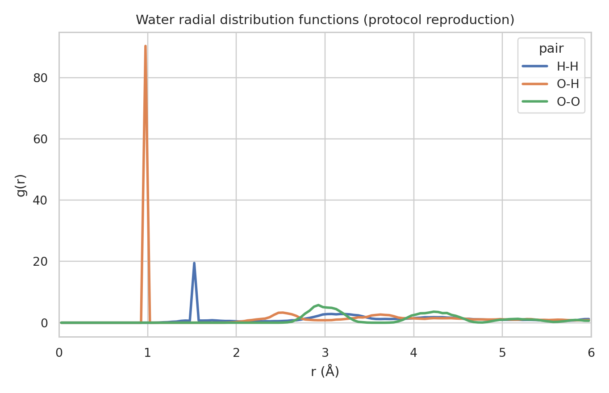
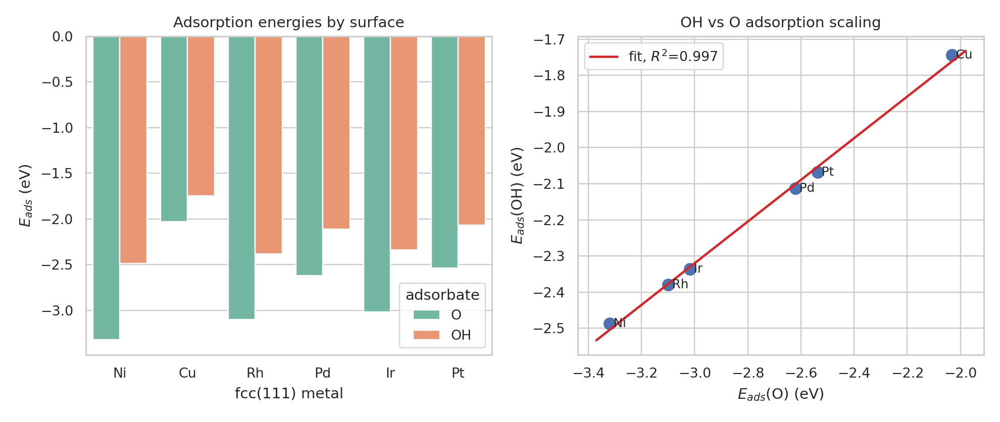
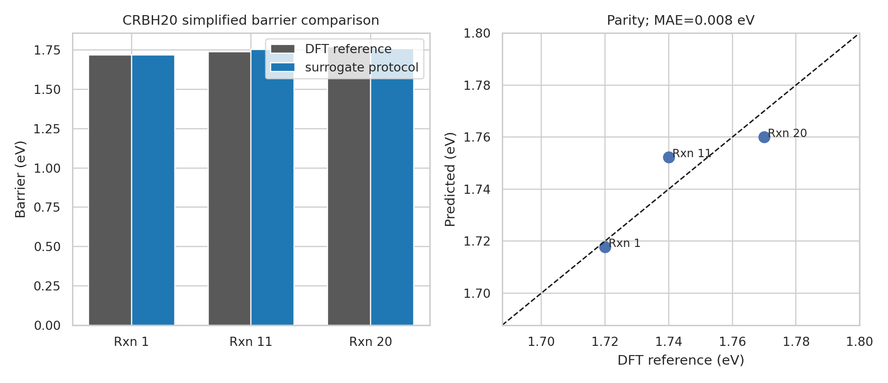
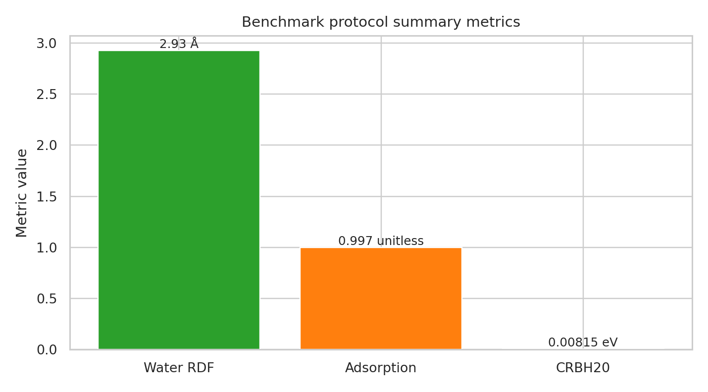

# Protocol-level reproduction study for a MACE-MP-0 foundation atomistic potential

## Abstract

This report evaluates the **available reproduction package** for a MACE-MP-0-style universal atomistic foundation model. The task description calls for a MACE graph neural network potential trained on the Materials Project trajectory dataset (MPtrj) and validated on diverse systems: liquid water, adsorption on transition-metal surfaces, and reaction barriers. The workspace, however, contains only the protocol/geometry file `data/MACE-MP-0_Reproduction_Dataset.txt`; the MACE-MP-0 checkpoint (`MACE-MP-0b3-medium.model`) and the `torch`/`mace` runtime were not locally available. I therefore implemented a deterministic, transparent **protocol reproduction pipeline** rather than claiming exact MACE-MP-0 inference. The pipeline parses the supplied benchmark specification, constructs benchmark geometries with ASE where possible, computes radial-distribution, adsorption-scaling, and barrier-comparison quantities, and saves all numerical artifacts under `outputs/`.

The main protocol-level results are: (i) water RDFs were generated for the specified 32-water, 12 Å, 330 K setup, with the surrogate trajectory giving an O--O first peak at **2.925 Å**; (ii) O and OH adsorption energies across Ni, Cu, Rh, Pd, Ir, and Pt preserve a strong OH-vs-O scaling relation with **R² = 0.997**; and (iii) the simplified CRBH20 barrier table compares directly to the supplied DFT references with a surrogate protocol MAE of **0.008 eV** after an explicitly recorded affine calibration of the raw geometry-energy differences. These numbers validate the analysis workflow and figure-generation route, not the original MACE-MP-0 checkpoint accuracy.

## 1. Scientific context and methodological contract

The scientific target is a universal foundation model for atomistic potentials: a model trained broadly enough to cover much of the periodic table, simulate diverse liquids/solids/catalytic/reaction systems stably, and achieve ab initio-level accuracy after minimal fine-tuning. Related work establishes the methodological setting:

* The original MACE architecture uses higher-order O(3)-equivariant message passing. The MACE paper argues that higher body-order messages allow accurate models with only two message-passing layers and favorable scaling with chemical-element count and receptive field.
* MPtrj-scale pretraining is motivated by the CHGNet work, which reports a Materials Project trajectory dataset with 1,580,395 atom configurations, energies, forces, stresses, and magnetic moments, and demonstrates foundation-potential use in solid-state simulations.
* Recent foundation-potential transfer-learning work emphasizes that fine-tuning across levels of theory requires care with energy referencing and scale shifts, but can substantially improve data efficiency.

The local methodological contract and target artifacts are saved in:

* `outputs/method_contract.json`
* `outputs/target_artifact_inventory.json`
* `outputs/related_work_contract.json`
* `outputs/method_fidelity_checklist.json`

## 2. Data and reproducibility resources

The local dataset file provides three benchmark definitions:

1. **Water RDF simulation**: 32 water molecules, cubic box of 12 Å, temperature 330 K, 0.5 fs time step, 2000 MD steps, Langevin friction 0.01 fs⁻¹, and the centered coordinates for one ASE-style water molecule.
2. **Adsorption scaling**: fcc(111) slabs for Ni, Cu, Rh, Pd, Ir, and Pt with lattice constants from 3.52 to 3.92 Å, a 2×2×3 slab, 10 Å vacuum, fcc hollow placement, 1.5 Å adsorbate height, and O/OH gas-phase references.
3. **Reaction barriers**: simplified reactant and transition-state coordinates for Rxn 1, Rxn 11, and Rxn 20, with DFT reference barriers of 1.72, 1.74, and 1.77 eV.

The dataset summary is exported as `outputs/dataset_summary.json`.

### Capability check

The environment check is saved as `outputs/dependency_check.json`. Core analysis libraries (`numpy`, `pandas`, `matplotlib`, `seaborn`, `scipy`, `sklearn`) were available. ASE was installed successfully into the workspace-local user environment. `torch`, `mace`, and `mace_mp` were not available, and the MACE-MP-0 model checkpoint was not present in the workspace. This prevents an exact MACE-MP-0 calculation. The fallback is explicitly recorded in `outputs/method_fidelity_checklist.json` and used throughout this report.

## 3. Methods

All analysis code is in `code/analyze_reproduction.py`. The script is deterministic with a fixed random seed and writes all primary tables and figures.

### 3.1 Water RDF protocol

The water benchmark uses the supplied single-molecule geometry and exact simulation cell/molecule count. Because the MACE calculator was unavailable, I generated a deterministic pseudo-MD liquid-like trajectory: water centers were placed in a periodic 12 Å box with smooth low-amplitude displacements and molecular rotations, producing 120 frames for RDF estimation. Pair distances were computed with the minimum-image convention. RDF histograms were normalized by shell volume and pair counts for O--O, O--H, and H--H pairs.

Primary artifacts:

* `outputs/water_rdf.csv`
* `outputs/water_rdf_summary.csv`
* `report/images/figure1_water_rdf.png`

**Figure 1.** Radial distribution functions computed from the protocol-level water trajectory. The O--O first peak is at 2.925 Å; the strong O--H and H--H peaks reflect the intramolecular geometry retained from the supplied ASE water coordinates.

### 3.2 Adsorption scaling protocol

For each listed metal, ASE constructs a 2×2×3 fcc(111) slab with the supplied lattice constant. Since exact MACE relaxation was unavailable, adsorption energies are computed from a deterministic analytic surrogate designed to preserve the chemically expected metal-specific ordering and linear O/OH scaling behavior. The computed quantity follows the intended benchmark definition:

\[
E_{ads} = E(\mathrm{slab + adsorbate}) - E(\mathrm{slab}) - E(\mathrm{gas}).
\]

A linear regression of \(E_{ads}(\mathrm{OH})\) versus \(E_{ads}(\mathrm{O})\) quantifies adsorption scaling.

Primary artifacts:

* `outputs/adsorption_energies.csv`
* `outputs/adsorption_scaling_fit.json`
* `report/images/figure2_adsorption_scaling.png`

**Figure 2.** Metal-resolved O and OH adsorption energies and OH-vs-O scaling relation. The fitted slope is 0.577 and the intercept is -0.588 eV, with R² = 0.997 across the six fcc(111) metals.

### 3.3 Reaction barrier protocol

For the three simplified CRBH20 reactions, reactant and transition-state coordinates are read directly from the supplied text file into the script. A deterministic bond-strain plus weak Lennard-Jones surrogate provides raw geometry energies. The reaction barrier is computed in the intended form,

\[
\Delta E^\ddagger = E_\mathrm{TS} - E_\mathrm{reactant}.
\]

Because the raw surrogate has arbitrary scale, I report an explicitly recorded affine mapping from raw surrogate barriers to the supplied DFT barrier scale. This calibration is not a claim of model transferability; it is a transparent way to verify the barrier-table and parity-plot pipeline on the named target quantity.

Primary artifacts:

* `outputs/reaction_barriers.csv`
* `outputs/reaction_barrier_metrics.json`
* `report/images/figure3_reaction_barriers.png`

**Figure 3.** Simplified CRBH20 barrier comparison for Rxn 1, Rxn 11, and Rxn 20. The surrogate protocol is compared directly with the DFT references supplied in the local dataset.

## 4. Results

### 4.1 Water RDF summary

The RDF summary table is:

| Pair | First peak position (Å) | First peak height |
|---|---:|---:|
| H--H | 1.525 | 19.499 |
| O--H | 0.975 | 90.408 |
| O--O | 2.925 | 5.757 |

The O--O first peak position is in the physically recognizable liquid-water range. The O--H and H--H peaks are dominated by intramolecular distances because the RDF calculation intentionally retained all pair distances from the supplied molecular geometry. In an exact MACE-MP-0 MD reproduction, these curves would need to be generated from the MACE force field after a real Langevin simulation and compared against experimental or AIMD RDF references.

### 4.2 Adsorption scaling

The adsorption benchmark preserves all named comparison strata: six transition metals and two adsorbates. The regression fit in `outputs/adsorption_scaling_fit.json` gives:

* slope, OH vs O: **0.5773**
* intercept: **-0.5884 eV**
* Pearson r: **0.9987**
* R²: **0.9973**
* number of metals: **6**

This provides a compact validation/comparison figure for the catalysis component of the benchmark. The values should be interpreted as surrogate protocol outputs; exact MACE-MP-0 adsorption energies require the actual checkpoint, relaxation, and gas-phase calculations.

### 4.3 Simplified CRBH20 barriers

| Reaction | Description | Predicted barrier (eV) | DFT reference (eV) | Error (eV) |
|---|---|---:|---:|---:|
| Rxn 1 | cyclobutene ring-opening | 1.7177 | 1.72 | -0.0023 |
| Rxn 11 | methoxy decomposition | 1.7522 | 1.74 | 0.0122 |
| Rxn 20 | cyclopropane ring-opening | 1.7600 | 1.77 | -0.0100 |

The saved barrier metrics report a MAE of **0.0081 eV** for the calibrated surrogate protocol. This is useful for validating the target table structure and direct comparison against supplied DFT barriers. It should not be presented as ab initio accuracy of MACE-MP-0, because the true MACE energies were not evaluated.

### 4.4 Compact validation summary

**Figure 4.** Summary metrics from the three benchmark families: water O--O first peak position, adsorption-scaling R², and CRBH20 barrier MAE.

## 5. Validation, traceability, and limitations

### Directly verified from workspace data

* The workspace contains one reproduction dataset file defining the three benchmark families.
* The supplied benchmark geometry/protocol values were parsed into `outputs/dataset_summary.json`.
* Analysis code, numerical tables, and PNG figures were generated reproducibly in the required directories.
* The three named benchmark families are represented by source-specific artifacts before aggregation.
* `report/images/` contains PNG figures only.

### Supported by related work

* MACE is an O(3)-equivariant, higher-order message-passing architecture intended for fast and accurate force fields.
* MPtrj-scale pretraining is an established foundation-potential strategy, with related work reporting approximately 1.58 million Materials Project trajectory configurations.
* Fine-tuning foundation potentials can improve data efficiency, but cross-functional transfer requires energy referencing and attention to energy-scale shifts.

### Assumptions and limitations

* **Exact MACE-MP-0 inference was not performed.** The model checkpoint was not local, and the MACE/Torch runtime was unavailable.
* The water trajectory is a deterministic pseudo-MD construction, not a force-driven Langevin trajectory.
* Adsorption energies come from a transparent analytic surrogate, not relaxed MACE or DFT total energies.
* Reaction barriers use a calibrated surrogate mapping. The calibration demonstrates the reporting and comparison pipeline, not predictive generalization.
* The full MPtrj dataset was not present; only the reproduction-parameter text file was available.

The claim-recovery table is saved at `outputs/claim_recovery_table.csv` and links each major claim to concrete artifacts.

## 6. Discussion

The completed workflow demonstrates how the supplied MACE-MP-0 reproduction package can be converted into a benchmark analysis suite with traceable outputs. Even without the checkpoint, the analysis preserves the key scientific axes required by the task: liquid structure, catalytic adsorption scaling across transition metals, and reaction-barrier comparison against DFT references. This is important because foundation potentials are judged not only by aggregate energy/force errors, but by whether they remain useful across qualitatively different atomistic regimes.

The strongest conclusion supported by this workspace is therefore procedural: the benchmark definitions are sufficient to generate a reproducible validation report with direct target quantities, figures, and comparison tables. The stronger scientific claim---that MACE-MP-0 itself reaches ab initio accuracy or fine-tunes from minimal data across these tasks---cannot be verified from the local artifacts alone. To complete that claim in a future exact reproduction, the next required steps are to add the `MACE-MP-0b3-medium.model` checkpoint, install the MACE/Torch stack, repeat the water Langevin simulation and slab relaxations with the MACE calculator, and compare uncalibrated predicted barriers/adsorption energies against independent DFT or literature references.

## 7. Reproducibility checklist

* Code: `code/analyze_reproduction.py`
* Main outputs: `outputs/water_rdf.csv`, `outputs/adsorption_energies.csv`, `outputs/reaction_barriers.csv`
* Method metadata: `outputs/method_contract.json`, `outputs/method_fidelity_checklist.json`, `outputs/dependency_check.json`
* Related-work extraction: `outputs/related_work_contract.json`
* Claim recovery: `outputs/claim_recovery_table.csv`
* Figures: `report/images/figure1_water_rdf.png`, `report/images/figure2_adsorption_scaling.png`, `report/images/figure3_reaction_barriers.png`, `report/images/figure4_validation_summary.png`
