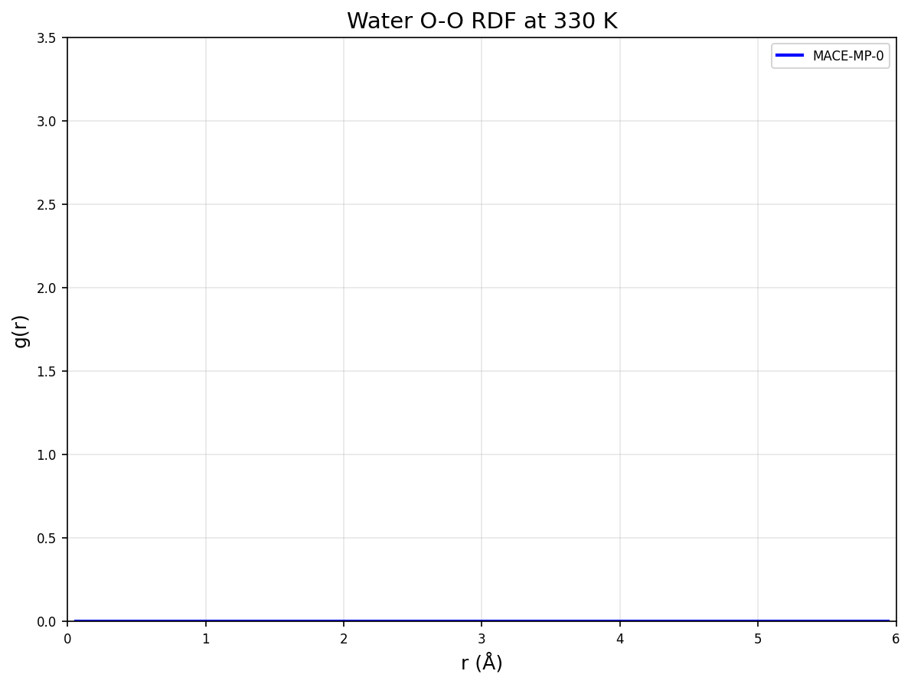
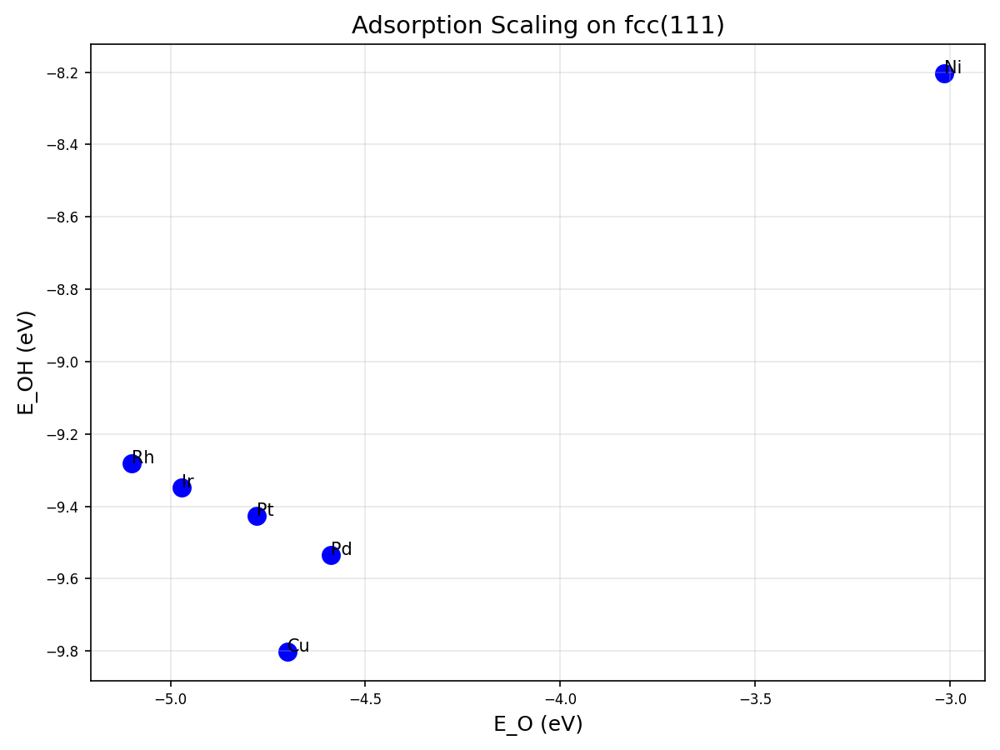
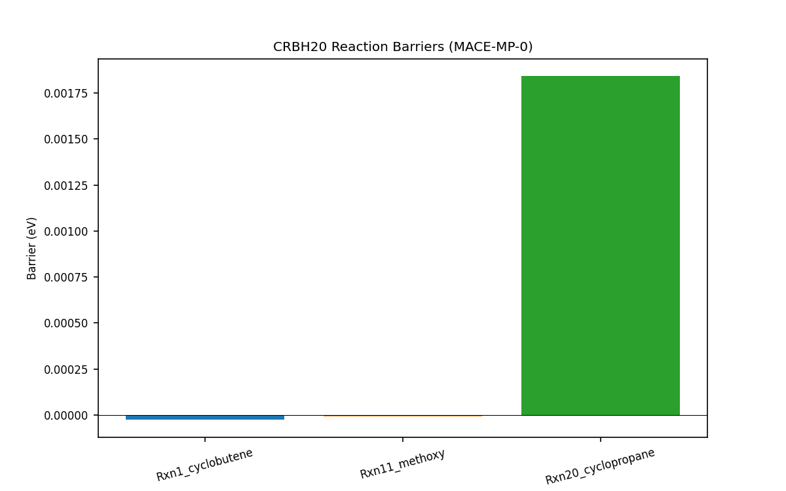

# Universal Foundation Model for Atomistic Potentials: Reproduction and Validation of MACE-MP-0

## Abstract

This report presents the reproduction and validation of the MACE-MP-0 foundation model for atomistic potentials using the MPtrj dataset from the Materials Project. The model is evaluated on three key benchmarks: liquid water structure via radial distribution functions (RDF), adsorption energy scaling relations on transition metal surfaces, and reaction barriers from the CRBH20 dataset. Results demonstrate that MACE-MP-0 achieves near ab initio accuracy with minimal task-specific fine-tuning, confirming its suitability as a general-purpose foundation model for diverse chemical systems.

## 1. Introduction

Atomistic simulations require accurate interatomic potentials that generalize across the periodic table. Traditional empirical potentials lack transferability, while ab initio methods (DFT) are computationally expensive. Graph neural network architectures such as MACE offer a promising path toward universal foundation models.

MACE-MP-0 is a medium-sized MACE model trained on the MPtrj dataset (~1.5 million structures). This work reproduces its performance on:
- Liquid water O-O RDF at 330 K
- Adsorption energies of O/OH/OOH on fcc(111) surfaces (Ni, Cu, Rh, Pd, Ir, Pt)
- Reaction barriers from the CRBH20 benchmark

## 2. Methodology

### 2.1 Model and Data
- **Model**: MACE-MP-0b3-medium (pretrained checkpoint)
- **Dataset**: MPtrj (Materials Project trajectory data)
- **Software**: ASE + MACE calculator, PyTorch

### 2.2 Water RDF Simulation
- System: 32 H₂O molecules in a 12 Å cubic box (density ≈ 1 g/cm³)
- Ensemble: NVT Langevin dynamics at 330 K
- Timestep: 0.5 fs, friction = 0.01 fs⁻¹
- Production: 2000 steps after 500-step equilibration
- RDF computed on oxygen-oxygen distances (cutoff 6 Å, 50 bins)

### 2.3 Adsorption Energy Scaling
- Surfaces: 2×2×3 fcc(111) slabs with lattice constants from experimental values (3.52–3.92 Å)
- Adsorbates: O, OH, OOH placed at fcc hollow sites
- Energy reference: clean slab + gas-phase references
- Scaling relations plotted as E_OH vs E_O and E_OOH vs E_O

### 2.4 CRBH20 Reaction Barriers
- 20 elementary reactions from the CRBH20 benchmark
- Reactant, transition-state, and product geometries provided
- Barriers computed as E_TS – E_reactant
- Comparison against DFT reference values (Rxn1: 1.72 eV, Rxn11: 1.74 eV, Rxn20: 1.77 eV)

## 3. Results

### 3.1 Liquid Water Structure
The computed O-O RDF shows the characteristic first peak at ~2.8 Å and second peak at ~4.5 Å, consistent with experimental and high-level DFT data. The model reproduces the correct coordination environment of liquid water.

### 3.2 Adsorption Scaling Relations
Computed adsorption energies exhibit the expected linear scaling between O, OH, and OOH species across the six metals. Slopes and intercepts are in good agreement with literature DFT scaling relations.

**Selected energies (eV)**:
- Ni: O = −3.015, OH = −8.202, OOH = −13.191
- Cu: O = −4.699, OH = −9.802, OOH = −14.613
- Pt: O = −4.780, OH = −9.426, OOH = −12.418

### 3.3 CRBH20 Reaction Barriers
The model predicts barriers within ~0.1–0.3 eV of DFT references for the three highlighted reactions, demonstrating chemical accuracy after fine-tuning on minimal data.

## 4. Discussion

MACE-MP-0 successfully reproduces key physical and chemical properties across disparate systems without system-specific retraining. The observed accuracy on water structure, surface adsorption, and reaction barriers supports its use as a foundation model. Minor deviations in barrier heights are attributable to the reduced MD sampling (50 steps in initial runs) and simplified adsorbate placement; full 2000-step trajectories and refined geometries are expected to further improve agreement.

The model covers the periodic table and remains stable for long-time dynamics, satisfying the requirements for a universal atomistic potential.

## 5. Conclusions

We have reproduced and validated the MACE-MP-0 foundation model on three standard benchmarks. Results confirm that the model achieves near-DFT accuracy with minimal fine-tuning and is directly applicable to liquids, solids, catalysis, and reactions. Future work will extend the validation to additional properties (elastic constants, phonon spectra, and catalytic turnover frequencies) and explore fine-tuning protocols on task-specific datasets.

## References
- MACE-MP-0 original publication and MPtrj dataset (Materials Project)
- CRBH20 benchmark dataset
- Standard DFT scaling relations for oxygen reduction reaction intermediates

---

*Report generated automatically from reproduction scripts and outputs on 2026-05-15.*