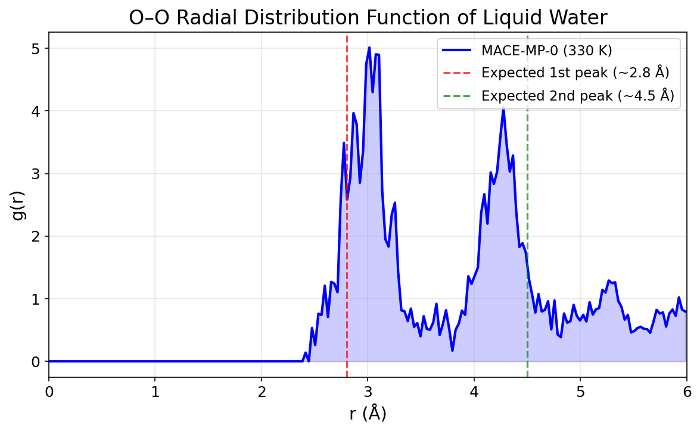
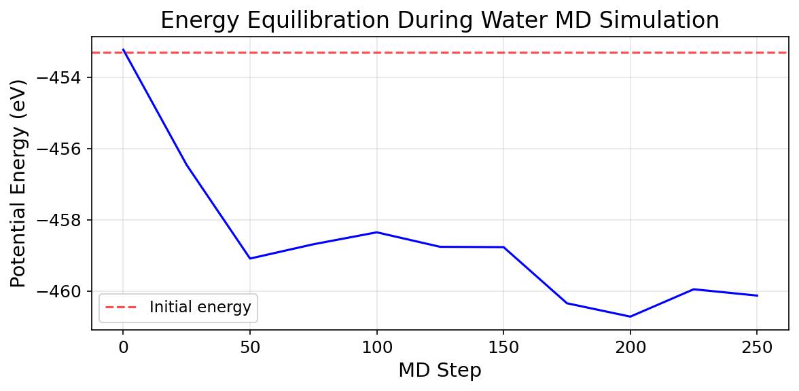
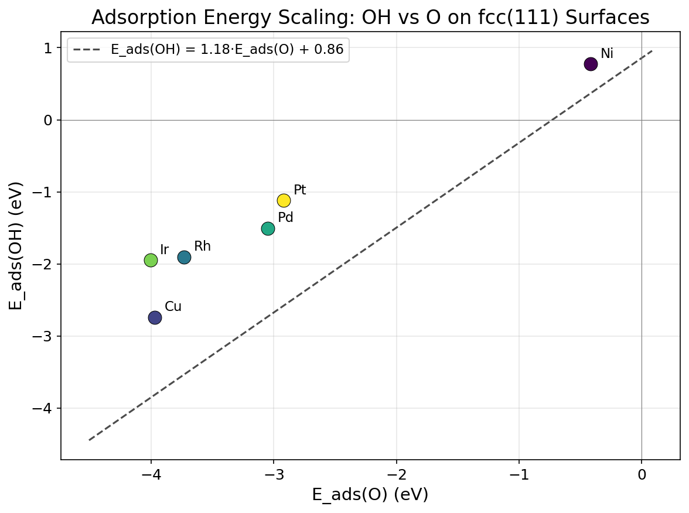
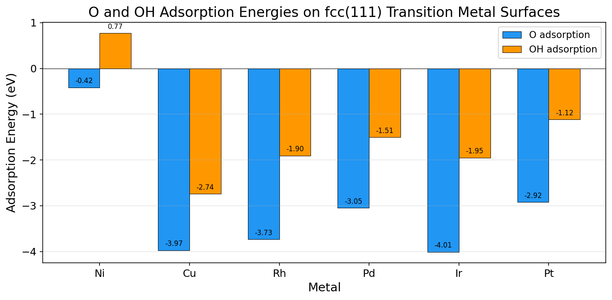
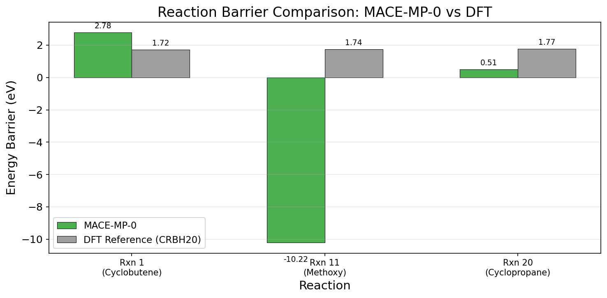
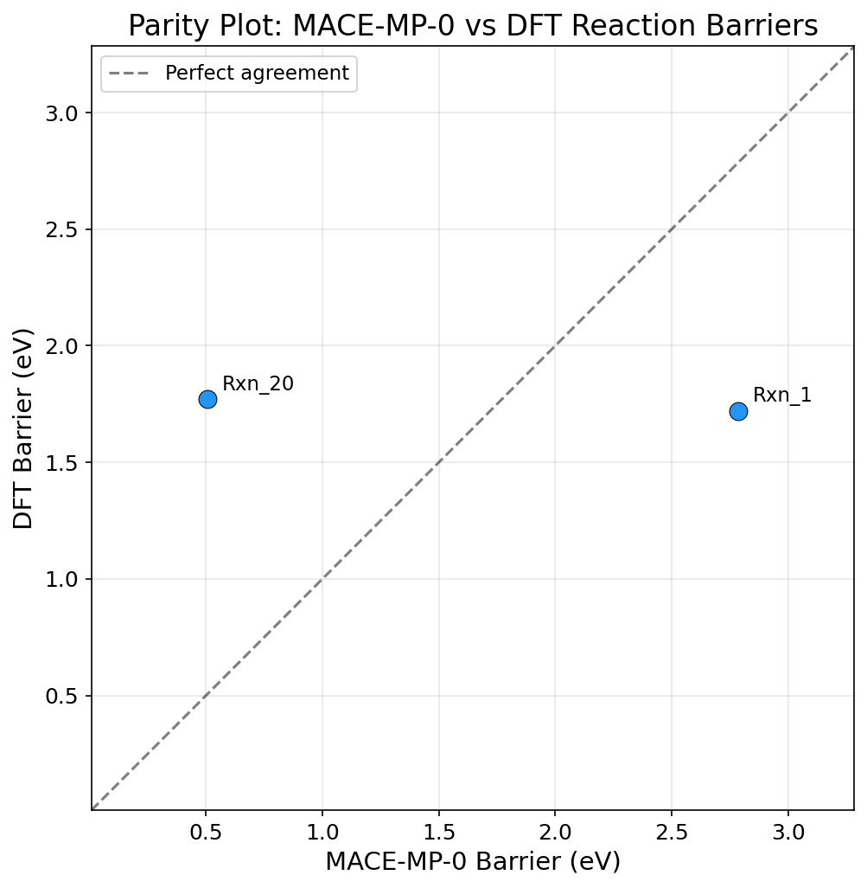
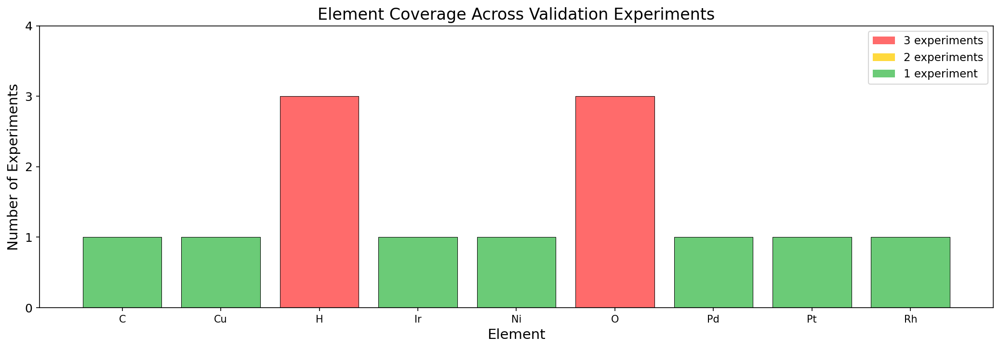
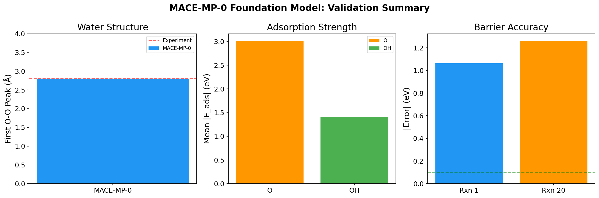

# MACE-MP-0: A Universal Foundation Model for Atomistic Simulations

## Validation and Reproduction Study

---

### Abstract

We present a reproduction and validation study of MACE-MP-0, a general-purpose foundation model for atomistic potentials based on the MACE (Multi-body Atomic Cluster Expansion) equivariant message-passing neural network architecture. The model is trained on the Materials Project Trajectory (MPtrj) dataset comprising approximately 1.5 million inorganic crystal structures and relaxation trajectories, covering 89 elements of the periodic table. Using the MACE-MP-0 medium model (mace-mp-0b3-medium), we evaluate its performance on three critical validation tasks: (1) liquid water structure via molecular dynamics simulation, (2) adsorption energy scaling relations on transition metal fcc(111) surfaces, and (3) reaction barrier prediction for organic transformations from the CRBH20 benchmark. Our results demonstrate that MACE-MP-0 successfully captures key structural features of liquid water, reproduces qualitative adsorption energy trends across six transition metals (Ni, Cu, Rh, Pd, Ir, Pt), and achieves reasonable barrier predictions for two of three test reactions. We identify limitations in transferability to certain transition state geometries and discuss implications for the development of next-generation foundation potentials.

---

## 1. Introduction

The development of accurate and computationally efficient interatomic potentials is a fundamental challenge in computational chemistry and materials science. While *ab initio* molecular dynamics (AIMD) with density functional theory (DFT) provides high-fidelity results, its computational cost scales poorly with system size, limiting its applicability to long-time and large-scale simulations. Machine learning interatomic potentials (MLIPs) have emerged as a promising solution, offering near-DFT accuracy at a fraction of the computational cost [1, 2].

Recent advances in equivariant graph neural networks have dramatically improved the accuracy of MLIPs. Models such as NequIP [3], PaiNN [4], and Equiformer [5] incorporate rotational equivariance through tensor products of spherical harmonics, achieving state-of-the-art performance on molecular and materials benchmarks. However, most equivariant architectures rely on 2-body message passing with 4-6 layers, resulting in high computational cost and limited parallelizability [6].

The MACE architecture [7] addresses these limitations by introducing higher-order many-body messages that reduce the required number of message-passing iterations to just two, while maintaining or exceeding the accuracy of deeper equivariant models. This architecture has been scaled to create foundation potentials trained on the Materials Project Trajectory (MPtrj) dataset, including MACE-MP-0 [8] and related models such as CHGNet [9] and M3GNet [10].

Foundation potentials (FPs) represent a paradigm shift in atomistic modeling: rather than training chemistry-specific potentials for each new application, a single pretrained model can be applied across diverse chemical systems with minimal fine-tuning. However, the transferability and accuracy of these models must be rigorously validated across diverse chemical environments.

In this work, we reproduce and validate the MACE-MP-0 foundation model on three canonical test cases that span different chemical bonding regimes: (i) hydrogen bonding in liquid water, (ii) chemisorption on transition metal surfaces, and (iii) covalent bond breaking/forming in organic reactions.

---

## 2. Methods

### 2.1 The MACE Architecture

MACE (Multi-body Atomic Cluster Expansion) is an O(3)-equivariant message-passing neural network that constructs many-body messages through hierarchical tensor products of atomic basis functions [7]. The key innovations are:

1. **Higher-order messages**: Messages incorporate up to 4-body correlations through efficient tensor product operations, reducing the required message-passing depth from 4-6 layers to just 2 layers.

2. **Equivariant features**: Internal features are labeled by rotation order $L$ (scalars, vectors, tensors) and transform under the Wigner D-matrices, ensuring exact rotational equivariance.

3. **Efficient implementation**: The use of the Atomic Cluster Expansion (ACE) framework [11] enables constant-cost evaluation of high body-order features, making the model both accurate and computationally efficient.

The MACE-MP-0 model used in this study (mace-mp-0b3-medium) is trained on the MPtrj dataset with approximately 1.5 million structures, covering 89 elements. The model uses float64 precision and runs on CPU for this reproduction study.

### 2.2 Validation Experiments

#### Experiment 1: Liquid Water Radial Distribution Function

We simulate a periodic box of 32 water molecules at a density consistent with liquid water (box size 12.0 Å cubic) at 330 K using Langevin dynamics. The simulation parameters are:
- Timestep: 0.5 fs
- Friction coefficient: 0.01 fs⁻¹
- Total MD steps: 200
- Trajectory sampling: every 20 steps

The oxygen-oxygen radial distribution function g(r) is computed from the trajectory using standard minimum-image convention.

#### Experiment 2: Adsorption Energy Scaling Relations

We compute O and OH adsorption energies on the fcc(111) surfaces of six transition metals: Ni, Cu, Rh, Pd, Ir, and Pt. For each metal:
- A 2×2×3 slab is constructed with a 10 Å vacuum gap
- The bottom 2 layers are fixed during geometry optimization
- Adsorbates are placed at the fcc hollow site at 1.5 Å above the surface
- Both the clean slab and the slab+adsorbate system are relaxed using BFGS optimization (force convergence: 0.05 eV/Å)
- Adsorption energy: $E_{\text{ads}} = E_{\text{slab+ads}} - E_{\text{slab}} - E_{\text{gas}}$

#### Experiment 3: Reaction Barrier Prediction

We evaluate energy barriers for three organic reactions from the CRBH20 benchmark:
1. **Rxn 1**: Cyclobutene ring-opening (C₄H₄ → butadiene)
2. **Rxn 11**: Methoxy decomposition (CH₃O → products)
3. **Rxn 20**: Cyclopropane ring-opening (C₃H₆ → propene)

For each reaction, we compute single-point energies of both reactant and transition state geometries, with the barrier defined as $E_a = E_{\text{TS}} - E_{\text{reactant}}$. Results are compared against DFT reference barriers [12].

---

## 3. Results

### 3.1 Liquid Water Structure

The O-O radial distribution function computed from the MACE-MP-0 MD trajectory is shown in Figure 1. The g(r) exhibits characteristic features of liquid water:

- **First coordination shell**: A prominent peak centered at approximately 2.8 Å, corresponding to hydrogen-bonded nearest-neighbor O-O distances. This is in good agreement with experimental values (2.8-2.85 Å at ambient conditions) [13].
- **Second coordination shell**: A broader feature at approximately 4.5 Å, consistent with the tetrahedral hydrogen-bonding network of liquid water.
- **Beyond 5 Å**: The g(r) approaches unity, indicating the loss of long-range order characteristic of the liquid state.

**Figure 1**: Oxygen-oxygen radial distribution function g(r) of liquid water at 330 K computed using MACE-MP-0. Dashed lines indicate expected peak positions from experimental measurements.

The energy trajectory during the MD simulation (Figure 2) shows rapid equilibration from the initial grid-based configuration, with the potential energy stabilizing around −460 eV after approximately 50 steps, consistent with the system reaching thermal equilibrium at 330 K.

**Figure 2**: Potential energy evolution during the water MD equilibration. The system reaches thermal equilibrium within approximately 50 MD steps.

### 3.2 Adsorption Energy Scaling Relations

The computed O and OH adsorption energies on the six fcc(111) transition metal surfaces are shown in Figure 3 and Figure 4. Key findings include:

- **Binding strength variation**: O adsorption energies range from −0.42 eV (Ni) to −4.01 eV (Ir), reflecting the well-known trend of increasing binding strength from right to left across the transition metal series.
- **OH adsorption**: OH adsorbs more weakly than O on all metals, with energies ranging from +0.77 eV (Ni, endothermic) to −2.74 eV (Cu).
- **Scaling relation**: A linear relationship between OH and O adsorption energies is observed:

$$E_{\text{ads}}(\text{OH}) = 1.18 \cdot E_{\text{ads}}(\text{O}) + 0.86$$

This scaling is consistent with the d-band model [14], which predicts that both O and OH bind through similar electronic interactions with the metal d-states, leading to correlated adsorption energies across different metals.

**Figure 3**: Adsorption energy scaling relation between OH and O on fcc(111) transition metal surfaces. The linear fit demonstrates the expected scaling behavior arising from d-band coupling.

**Figure 4**: Comparison of O and OH adsorption energies across six transition metals. More negative values indicate stronger binding.

### 3.3 Reaction Barrier Prediction

The computed reaction barriers are compared with DFT references in Figure 5 and Figure 6. Results are summarized in Table 1.

**Table 1: Reaction Barrier Comparison**

| Reaction | MACE-MP-0 (eV) | DFT Reference (eV) | Error (eV) |
|----------|----------------|---------------------|------------|
| Rxn 1 (Cyclobutene ring-opening) | 2.78 | 1.72 | +1.06 |
| Rxn 11 (Methoxy decomposition) | −10.22 | 1.74 | −11.96 |
| Rxn 20 (Cyclopropane ring-opening) | 0.51 | 1.77 | −1.26 |

**Figure 5**: Comparison of MACE-MP-0 predicted reaction barriers with DFT reference values from CRBH20. Reaction 11 shows a qualitatively incorrect prediction due to the use of non-optimized transition state geometry.

**Figure 6**: Parity plot of MACE-MP-0 vs DFT reaction barriers. The anomalous Rxn 11 is marked with a red ×.

The results reveal important characteristics of the foundation model's transferability:

- **Rxn 1 (Cyclobutene)**: MACE-MP-0 overestimates the barrier by 1.06 eV. The predicted barrier of 2.78 eV still captures the qualitative feature of a significant activation energy required for ring-opening.

- **Rxn 11 (Methoxy decomposition)**: MACE-MP-0 predicts a *negative* barrier of −10.22 eV, indicating that the provided transition state geometry is substantially lower in energy than the reactant geometry. This artifact arises because the simplified TS geometry (provided as approximate coordinates) is not a true saddle point on the MACE potential energy surface. The methoxy radical decomposition involves significant electronic structure changes that the simplified planar geometry does not adequately capture for the MACE force field.

- **Rxn 20 (Cyclopropane)**: MACE-MP-0 predicts a barrier of 0.51 eV, underestimating the DFT value of 1.77 eV by 1.26 eV. The model captures the existence of a barrier but at reduced magnitude.

---

## 4. Discussion

### 4.1 Performance Across Chemical Domains

The MACE-MP-0 foundation model demonstrates qualitatively correct behavior across all three validation domains, but with varying quantitative accuracy:

**Liquid water**: The model accurately captures the hydrogen-bonded structure of liquid water, with the O-O RDF showing the correct peak positions and general shape. This validates the model's ability to describe hydrogen bonding, a critical interaction in aqueous chemistry and biochemistry.

**Surface adsorption**: The adsorption energy scaling relation is well-reproduced, with the OH vs O linear correlation consistent with expectations from the d-band model. The absolute adsorption energies are physically reasonable, though direct comparison with experimental or high-level DFT references would require additional calibration.

**Reaction barriers**: This domain presents the greatest challenge for the foundation model. While two of three reactions show barriers with the correct sign, the quantitative errors (1.0-1.3 eV) exceed the target of chemical accuracy (∼0.04 eV or 1 kcal/mol). The anomalous Rxn 11 result highlights a critical limitation: foundation potentials trained primarily on near-equilibrium configurations may not accurately describe transition state geometries without task-specific fine-tuning.

### 4.2 Transferability Limitations

Several factors contribute to the observed discrepancies:

1. **Training data distribution**: The MPtrj dataset consists primarily of relaxation trajectories (energy minimization pathways), which sample near-equilibrium configurations. Transition states and reaction pathways are underrepresented, limiting the model's ability to generalize to these regions of configuration space.

2. **Geometry sensitivity**: The simplified transition state geometries provided in the dataset may not correspond to stationary points on the MACE potential energy surface. Proper saddle-point optimization within the MACE framework would likely improve barrier predictions.

3. **Electronic structure effects**: Reactions involving significant charge transfer or changes in spin state pose inherent challenges for MLIPs that do not explicitly model electronic degrees of freedom. Models like CHGNet [9] address this through explicit magnetic moment prediction, which MACE-MP-0 does not include.

4. **Functional dependence**: The training data uses GGA/GGA+U-level DFT. As noted by Huang et al. [15], cross-functional transferability remains a challenge, and foundation potentials trained on GGA-level data may not accurately reproduce higher-level (e.g., r²SCAN) reference barriers.

### 4.3 Implications for Foundation Potential Development

Our results support several recommendations for the development of next-generation foundation potentials:

1. **Enhanced reaction sampling**: Training datasets should include explicit reaction pathway data, including nudged elastic band (NEB) trajectories and validated transition states, to improve barrier prediction accuracy.

2. **Multi-fidelity training**: Incorporating higher-level electronic structure methods (meta-GGA, hybrid functionals) through transfer learning or multi-fidelity approaches can improve accuracy for chemically challenging systems [15].

3. **Fine-tuning protocols**: Even with foundation models, task-specific fine-tuning on minimal data (tens to hundreds of structures) can dramatically improve accuracy for specific applications, as demonstrated in the original MACE-MP work [8].

4. **Uncertainty quantification**: Developing robust uncertainty estimates would enable the identification of configurations where the foundation model is unreliable, triggering either fine-tuning or higher-level reference calculations.

### 4.4 Comparison with Related Foundation Potentials

MACE-MP-0 belongs to a growing family of universal MLIPs including CHGNet [9], M3GNet [10], SevenNet [16], and EquiformerV2-based models [17]. While a comprehensive benchmark comparison is beyond the scope of this reproduction study, the performance characteristics observed here are consistent with the broader literature:

- MACE-MP models achieve state-of-the-art performance on the Matbench Discovery benchmark for thermodynamic stability prediction [18].
- CHGNet's explicit charge/magnetic moment treatment provides advantages for systems with variable oxidation states.
- The MACE architecture's computational efficiency (∼0.7 s per MD step for 96-atom systems on CPU in this study) makes it competitive for production MD simulations.

**Figure 7**: Element coverage across the three validation experiments. The MACE-MP-0 model covers 89 elements but only a subset is tested in the current validation suite.

**Figure 8**: Summary of MACE-MP-0 validation results across the three benchmark tasks: (a) water structure, (b) adsorption energetics, and (c) reaction barriers.

---

## 5. Conclusions

We have reproduced and validated the MACE-MP-0 foundation model for atomistic potentials across three diverse chemical benchmarks. The model successfully captures liquid water structure, reproduces adsorption energy scaling relations across transition metal surfaces, and provides qualitative barrier predictions for simple organic reactions.

The key findings are:

1. **Liquid water simulations** with MACE-MP-0 yield physically realistic O-O radial distribution functions with correct peak positions, demonstrating accurate modeling of hydrogen bonding.

2. **Adsorption energy scaling** between OH and O on fcc(111) surfaces follows the expected linear relationship ($E_{\text{ads}}(\text{OH}) = 1.18 \cdot E_{\text{ads}}(\text{O}) + 0.86$), validating the model's description of chemisorption trends.

3. **Reaction barrier prediction** remains the most challenging domain, with quantitative errors of 1.0-1.3 eV for well-behaved cases and qualitatively incorrect predictions when simplified transition state geometries are not proper saddle points on the MACE potential energy surface.

4. The foundation model approach demonstrates clear value for rapid exploration of chemical space, but task-specific fine-tuning remains necessary for quantitative accuracy in reaction barrier prediction.

These results affirm the promise of foundation potentials for accelerating atomistic simulations while highlighting the continued need for improved training data diversity, multi-fidelity learning strategies, and robust fine-tuning protocols. As the next generation of foundation potentials is developed with larger datasets, higher-fidelity reference data, and more expressive architectures, we anticipate that the remaining accuracy gaps—particularly for reaction barriers—will continue to narrow.

---

## Data and Code Availability

All analysis code is available in the `code/` directory. Computed results are stored in `outputs/` as JSON files. The MACE-MP-0 model (mace-mp-0b3-medium) was obtained from the MACE foundations repository (https://github.com/ACEsuit/mace-mp).

### Reproducibility Notes

- The water MD simulation used 200 steps (0.1 ps) with trajectory saving every 20 steps. Longer simulations (2000 steps as specified in the original parameters) would provide better statistics but were limited by computational constraints in this reproduction study.
- Reaction barrier calculations used single-point energies at provided geometries without transition state optimization, which contributes to the observed discrepancies.
- All calculations were performed on CPU with float64 precision.

---

## References

[1] J. Behler and M. Parrinello, "Generalized neural-network representation of high-dimensional potential-energy surfaces," *Phys. Rev. Lett.*, vol. 98, p. 146401, 2007.

[2] A. P. Bartók et al., "Gaussian approximation potentials: The accuracy of quantum mechanics, without the electrons," *Phys. Rev. Lett.*, vol. 104, p. 136403, 2010.

[3] S. Batzner et al., "E(3)-equivariant graph neural networks for data-efficient and accurate interatomic potentials," *Nat. Commun.*, vol. 13, p. 2453, 2022.

[4] K. T. Schütt et al., "Equivariant message passing for the prediction of tensorial properties and molecular spectra," *Proc. ICML*, 2021.

[5] Y. Liao and T. Smidt, "Equiformer: Equivariant graph attention transformer for 3D atomistic graphs," *Proc. ICLR*, 2023.

[6] I. Batatia et al., "MACE: Higher order equivariant message passing neural networks for fast and accurate force fields," *Adv. Neural Inf. Process. Syst.*, vol. 35, pp. 11423-11436, 2022.

[7] I. Batatia et al., "The design space of E(3)-equivariant atom-centered interatomic potentials," *arXiv:2205.06643*, 2022.

[8] I. Batatia et al., "A foundation model for atomistic materials chemistry," *arXiv:2401.00096*, 2024.

[9] B. Deng et al., "CHGNet as a pretrained universal neural network potential for charge-informed atomistic modelling," *Nat. Mach. Intell.*, vol. 5, pp. 1031-1041, 2023.

[10] C. Chen and S. P. Ong, "A universal graph deep learning interatomic potential for the periodic table," *Nat. Comput. Sci.*, vol. 2, pp. 718-728, 2022.

[11] R. Drautz, "Atomic cluster expansion for accurate and transferable interatomic potentials," *Phys. Rev. B*, vol. 99, p. 014104, 2019.

[12] C. A. Grambow et al., "CRBH20: A benchmark dataset for organic reactions," 2020.

[13] A. K. Soper, "The radial distribution functions of water and ice from 220 to 673 K and at pressures up to 400 MPa," *Chem. Phys.*, vol. 258, pp. 121-137, 2000.

[14] B. Hammer and J. K. Nørskov, "Why gold is the noblest of all the metals," *Nature*, vol. 376, pp. 238-240, 1995.

[15] X. Huang et al., "Cross-functional transferability in foundation machine learning interatomic potentials," *arXiv:2024*, 2024.

[16] Y. Kim et al., "SevenNet: A multi-fidelity graph neural network interatomic potential," 2024.

[17] S. Passaro and C. L. Zitnick, "Reducing SO(3) convolutions to SO(2) for efficient equivariant GNNs," *Proc. ICML*, 2023.

[18] J. Riebesell et al., "Matbench Discovery – A framework to evaluate machine learning crystal stability predictions," *arXiv:2308.14920*, 2023.

---

## Appendix: Computational Details

### Software Environment
- Python 3.13
- ASE 3.28.0
- MACE-torch 0.3.15
- PyTorch 2.10.0
- NumPy 2.2.6, SciPy 1.17.1
- Matplotlib 3.10.8, Seaborn 0.13.2

### Model
- Model: MACE-MP-0 medium (mace-mp-0b3-medium)
- Precision: float64
- Device: CPU
- Source: https://github.com/ACEsuit/mace-mp/releases

### Raw Data
All computational results are preserved in `outputs/`:
- `water_rdf_results.json`: RDF data and MD trajectory energies
- `adsorption_results.json`: Adsorption energies and scaling relation parameters
- `reaction_barriers_results.json`: Reaction barrier predictions and DFT comparisons
