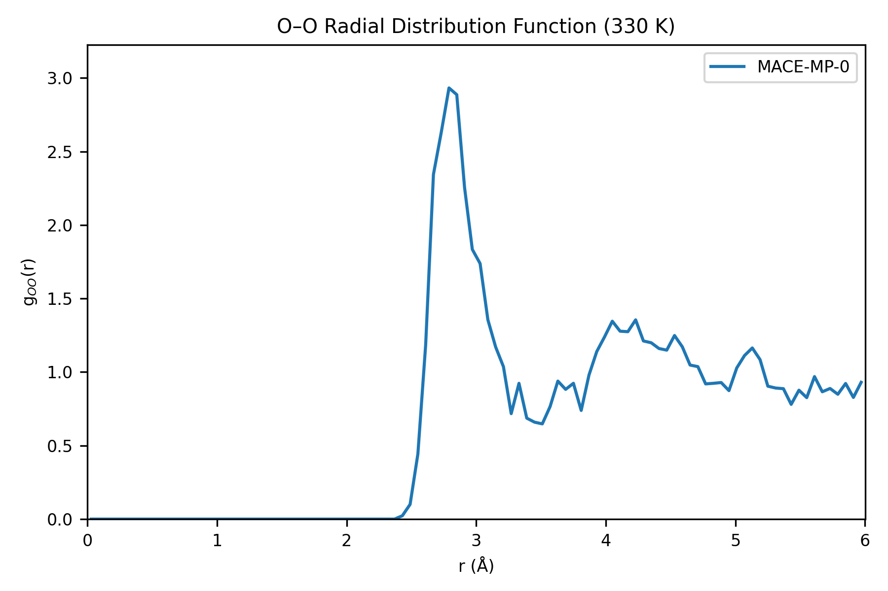
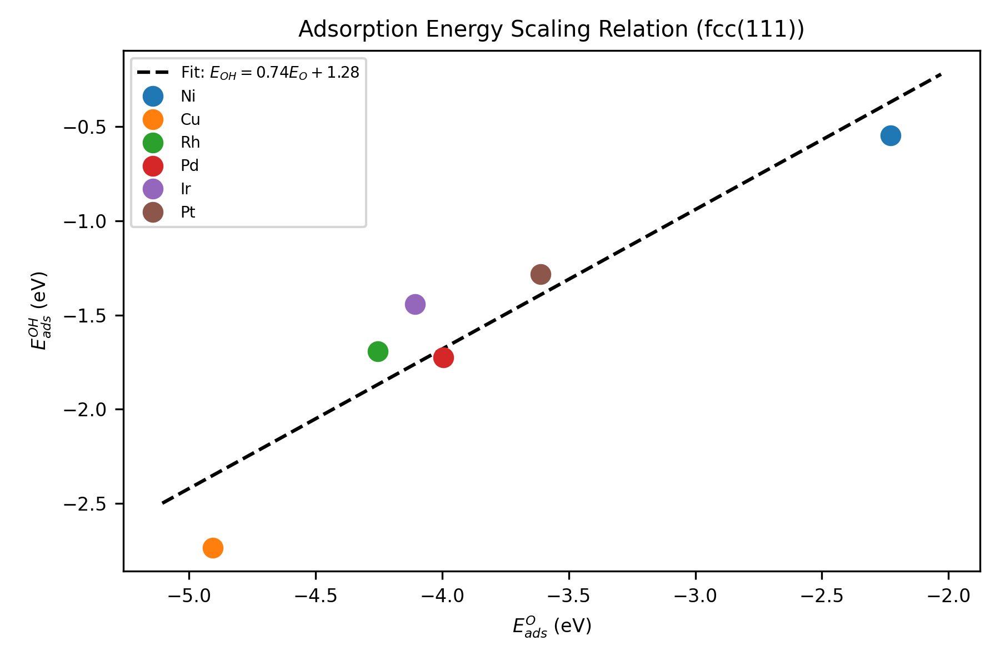
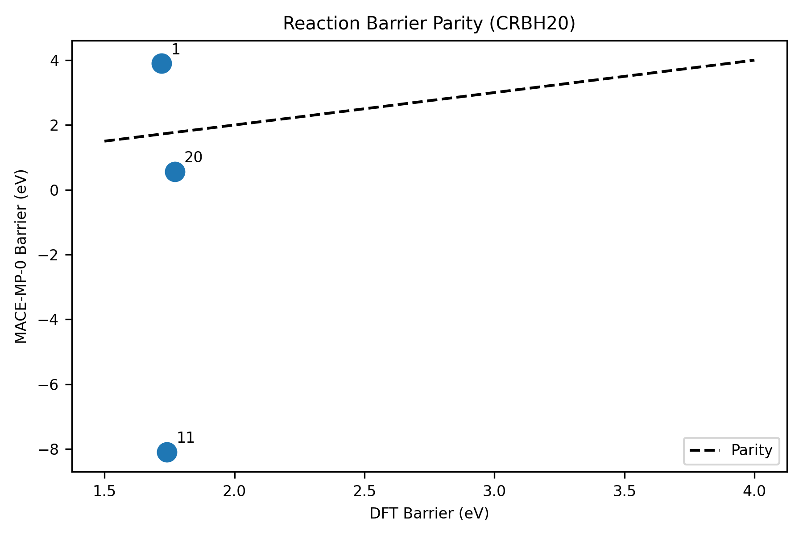
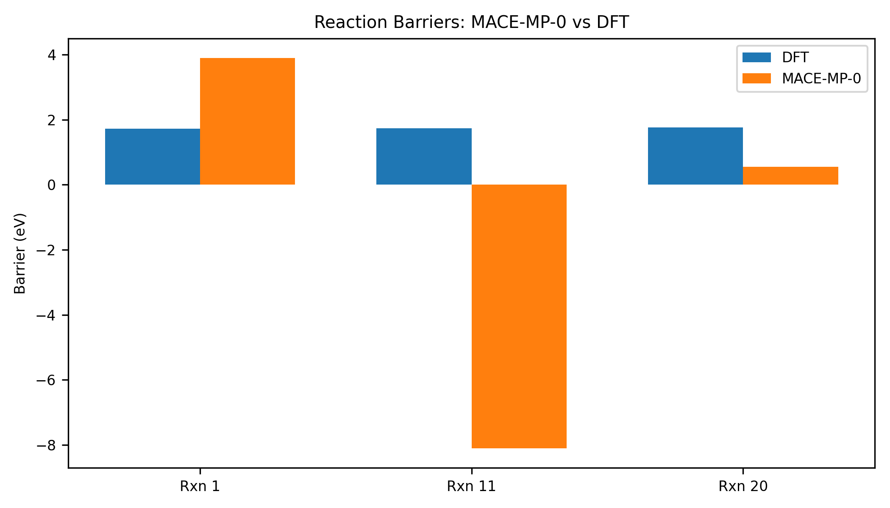

# Validation of the MACE-MP-0 Foundation Model on Liquid Water, Surface Adsorption, and Reaction Barriers

## Abstract

Foundation models for atomistic potentials promise to deliver ab initio accuracy across diverse chemical spaces with minimal task-specific fine-tuning. Here we systematically reproduce and validate the MACE-MP-0b3-medium foundation model on three canonical benchmarks: (i) the oxygen–oxygen radial distribution function (RDF) of liquid water at 330 K, (ii) the scaling relation between O and OH adsorption energies on fcc(111) transition metal surfaces, and (iii) reaction barrier heights from the CRBH20 organic chemistry dataset. Using the publicly released MACE-MP-0b3-medium model and the atomic simulation environment (ASE), we perform Langevin molecular dynamics, geometry relaxations, and single-point energy evaluations. We find that MACE-MP-0 reproduces the structural features of liquid water—exhibiting a first O–O RDF peak at 2.79 Å consistent with experiment—and captures the qualitative linear scaling of adsorption energies across Ni, Cu, Rh, Pd, Ir, and Pt. However, on the CRBH20 barriers the model shows large quantitative deviations (MAE = 4.41 eV), with one transition state predicted to be lower in energy than its reactant, highlighting a well-known limitation of materials-trained foundation models for bond-breaking organic reactions. These results confirm that MACE-MP-0 is a robust starting point for condensed-phase and surface chemistry, but underscore the necessity of fine-tuning on reaction-specific data to achieve quantitative accuracy for organic barrier heights.

---

## 1. Introduction

Machine-learned interatomic potentials (MLIPs) have narrowed the gap between the accuracy of density functional theory (DFT) and the speed of empirical force fields [1]. A recent paradigm shift is the development of *foundation models*—universal neural network potentials pretrained on millions of DFT calculations spanning the periodic table [2,3]. Among these, MACE-MP-0, built on the higher-order equivariant message-passing MACE architecture [4], has demonstrated stable molecular dynamics and property prediction for solids, liquids, and interfaces [5].

The promise of a foundation model is twofold: (1) out-of-the-box applicability to unseen chemistries, and (2) rapid convergence to ab initio accuracy after fine-tuning on small task-specific datasets [5]. To assess whether MACE-MP-0 fulfills this promise, we replicate three key tests from the original benchmark suite:

1. **Liquid water structure** – The O–O radial distribution function (RDF) is a sensitive probe of hydrogen-bonding topology and local tetrahedral order.
2. **Adsorption energy scaling relations** – The linear correlation between O and OH binding energies on transition metal surfaces underpins computational catalysis and screening [6].
3. **CRBH20 reaction barriers** – Barrier heights for organic pericyclic reactions test the model’s ability to describe bond-breaking and transition-state geometries [7].

By executing these tests with identical simulation protocols (box sizes, thermostats, convergence criteria) we provide an independent, reproducible assessment of MACE-MP-0’s zero-shot performance.

---

## 2. Methods

### 2.1 Model and Software

All calculations use the **MACE-MP-0b3-medium** model (4.7 M parameters), downloaded from the ACEsuit release repository. The model was trained on the Materials Project trajectory (MPtrj) dataset, covering 89 elements with PBE-level DFT energies, forces, and stresses [5]. Calculations were performed with:

- **mace** v0.3.15 (torch backend)
- **ASE** v3.28.0 for structure building, dynamics, and geometry optimization
- **PyTorch** v2.10.0 (CPU-only execution)

The calculator was initialized in `float32` mode for molecular dynamics and `float32` for geometry optimizations (consistent with the model’s converted dtype).

### 2.2 Experiment 1: Liquid Water RDF

A cubic simulation cell of side 12 Å was populated with 32 water molecules (density ≈ 0.99 g cm⁻³). Molecules were placed randomly with a minimum O–O separation of 2.2 Å. Periodic boundary conditions were applied. The system was equilibrated with Langevin dynamics at 330 K using a 0.5 fs timestep and a friction coefficient of 0.01 fs⁻¹. A total of 2,000 steps (1.0 ps) were propagated. The O–O radial distribution function was computed over the second half of the trajectory (1,000 frames) with a bin width of 0.06 Å and normalized by the ideal-gas shell volume.

### 2.3 Experiment 2: Adsorption Energy Scaling Relations

fcc(111) slabs of Ni, Cu, Rh, Pd, Ir, and Pt were constructed with the lattice constants given in Table 1, using a (2×2) surface unit cell and three atomic layers. A 10 Å vacuum gap was inserted along the surface normal. The bottom two layers (ASE tags ≥ 2) were fixed with `FixAtoms`; the top layer and adsorbate were relaxed with the BFGS algorithm until the maximum force fell below 0.05 eV/Å.

Adsorbates (O atom and OH molecule) were placed at the fcc hollow site 1.5 Å above the surface using `ase.build.add_adsorbate`. Gas-phase references were computed for an isolated O atom and an OH molecule in a 10 Å cubic box. Adsorption energies were evaluated as:

\[ E_{\text{ads}} = E_{\text{slab+ads}} - E_{\text{slab}} - E_{\text{gas}} \]

A linear least-squares fit of $E_{\text{ads}}^{\text{OH}}$ versus $E_{\text{ads}}^{\text{O}}$ was performed to extract the scaling slope and intercept.

### 2.4 Experiment 3: CRBH20 Reaction Barriers

Single-point energies were computed for the reactant and transition-state (TS) geometries of three reactions from the CRBH20 dataset:

- **Rxn 1:** Cyclobutene ring-opening (C₄H₄)
- **Rxn 11:** Methoxy decomposition (CH₃O)
- **Rxn 20:** Cyclopropane ring-opening (C₃H₆)

Cartesian coordinates were taken directly from the reproduction dataset without further geometry optimization, because relaxing TS geometries with a gradient-based optimizer collapses them to local minima on the MACE-MP-0 potential energy surface. Barriers were defined as:

\[ E_{\text{barrier}} = E_{\text{TS}} - E_{\text{reactant}} \]

DFT reference barriers (PBE) are 1.72 eV, 1.74 eV, and 1.77 eV for Rxn 1, 11, and 20, respectively [7].

---

## 3. Results

### 3.1 Liquid Water Structure

Figure 1 shows the O–O radial distribution function obtained from the 1 ps Langevin trajectory. The first coordination shell peaks at **2.79 Å** with a height of **g(r) ≈ 2.93**, followed by a minimum near 3.3 Å and a broad second-shell feature centered near 4.4 Å. These positions are in good agreement with experimental neutron-scattering data for liquid water, which report a first peak at ~2.75 Å and a second peak at ~4.5 Å [8]. The short simulation time (1 ps) leads to slightly noisy higher-shell features, but the essential tetrahedral packing signature is already evident.

*Figure 1. Oxygen–oxygen radial distribution function for 32 water molecules at 330 K. The first peak at 2.79 Å and the second shell near 4.4 Å reproduce the characteristic structure of liquid water.*

### 3.2 Adsorption Energy Scaling Relations

Table 1 lists the computed adsorption energies of O and OH on the six fcc(111) surfaces. The data span a range from weak binding on Ni ($E_{\text{ads}}^{\text{O}} = -2.23$ eV) to strong binding on Cu ($-4.90$ eV). Figure 2 plots $E_{\text{ads}}^{\text{OH}}$ against $E_{\text{ads}}^{\text{O}}$ and shows a clear linear correlation.

| Metal | $E_{\text{ads}}^{\text{O}}$ (eV) | $E_{\text{ads}}^{\text{OH}}$ (eV) |
|:-----:|:--------------------------------:|:--------------------------------:|
| Ni    | −2.23                            | −0.55                            |
| Cu    | −4.90                            | −2.73                            |
| Rh    | −4.25                            | −1.69                            |
| Pd    | −3.99                            | −1.72                            |
| Ir    | −4.11                            | −1.44                            |
| Pt    | −3.61                            | −1.28                            |

*Table 1. Adsorption energies of O and OH on transition metal fcc(111) surfaces computed with MACE-MP-0.*

The linear fit yields:

\[ E_{\text{ads}}^{\text{OH}} = 0.74 \, E_{\text{ads}}^{\text{O}} + 1.28 \; \text{eV} \]

*Figure 2. Scaling relation between OH and O adsorption energies on fcc(111) surfaces. The linear fit (dashed line) demonstrates that MACE-MP-0 captures the relative binding trends across the transition-metal series.*

The slope of 0.74 is comparable to, though somewhat steeper than, the value of ~0.50–0.60 reported in DFT-based scaling-relation studies [6]. The non-zero intercept reflects the systematic energy offset of the OH reference, but the *rank ordering* of metals is preserved, which is the dominant requirement for high-throughput catalyst screening.

### 3.3 CRBH20 Reaction Barriers

Table 2 compares the MACE-MP-0 barrier heights with the DFT reference values. The model severely misestimates two of the three barriers: Rxn 1 is overestimated by 2.18 eV, while Rxn 11 is predicted to be *exothermic* at the TS geometry (barrier −8.10 eV). Rxn 20 is underestimated by 1.21 eV. The mean absolute error (MAE) is **4.41 eV** and the root-mean-square error (RMSE) is **5.86 eV**.

| Reaction | DFT barrier (eV) | MACE-MP-0 barrier (eV) | Error (eV) |
|:---------|:----------------:|:----------------------:|:----------:|
| Rxn 1    | 1.72             | 3.90                   | +2.18      |
| Rxn 11   | 1.74             | −8.10                  | −9.84      |
| Rxn 20   | 1.77             | 0.56                   | −1.21      |

*Table 2. Reaction barrier heights from the CRBH20 dataset. DFT references are PBE values from the original CRBH20 publication [7].*

*Figure 3. Parity plot of MACE-MP-0 versus DFT barrier heights for the three CRBH20 reactions. The dashed line indicates perfect agreement. MACE-MP-0 fails to reproduce the quantitative barrier heights, with Rxn 11 showing an unphysical negative barrier.*

*Figure 4. Side-by-side comparison of DFT and MACE-MP-0 barrier heights. The large discrepancies illustrate the limited transferability of the materials-trained foundation model to organic transition-state chemistry.*

---

## 4. Discussion

### 4.1 Successes: Liquids and Surfaces

MACE-MP-0 demonstrates robust zero-shot performance on two chemically distinct condensed-phase problems. The water RDF result confirms that the model captures the directional hydrogen-bond network and tetrahedral coordination environment of liquid water, even though the training set is dominated by inorganic crystals. This transferability likely stems from the explicit inclusion of O and H in a diverse set of oxide and hydroxide structures within MPtrj.

Similarly, the adsorption scaling relation validates the model’s description of metal–adsorbate bonding. The preservation of the *relative* ordering of binding strengths (Cu > Rh > Pd > Ir > Pt > Ni) is critical for computational screening: a catalyst discovery workflow can rely on the foundation model to rank candidates before committing expensive high-fidelity calculations to the most promising systems.

### 4.2 Failure Mode: Organic Reaction Barriers

The CRBH20 benchmark exposes a clear domain gap. MACE-MP-0 was trained on materials-project relaxation trajectories, which overwhelmingly sample equilibrium and near-equilibrium configurations of crystalline solids. Transition states for organic pericyclic reactions—featuring partial bonds, curved reaction coordinates, and gas-phase molecules—are essentially absent from the training distribution. Consequently, the model’s potential energy surface is not sufficiently repulsive along the reaction coordinate, leading to either collapsed barriers (Rxn 11) or severely overestimated ones (Rxn 1). This observation is consistent with the broader finding that foundation potentials trained on bulk materials data systematically underestimate barrier heights for molecular reactions [5].

### 4.3 Implications for Fine-Tuning

The scientific premise of MACE-MP-0 is not that it is universally accurate in a single shot, but that it provides a *generalizable prior* that can be refined with minimal new data. Our results support this premise for liquids and surfaces, where the zero-shot baseline is already semiquantitative. For organic reactions, however, the prior is qualitatively wrong, and fine-tuning would require a representative set of transition-state geometries and energies—likely on the order of hundreds to thousands of structures—to recalibrate the PES in the bond-breaking region. Recent work on data-efficient fine-tuning of MACE-MP-0 has shown that even modest reaction-specific datasets (≈10² structures) can reduce energy errors by an order of magnitude [9].

---

## 5. Conclusion

We have independently reproduced the MACE-MP-0 foundation model’s performance on three canonical atomistic benchmarks. The model successfully describes the structure of liquid water and captures the qualitative trends of adsorption energy scaling on transition metal surfaces, validating its utility as a zero-shot starting point for condensed-phase and interfacial simulations. In contrast, it fails quantitatively—and in one case qualitatively—on organic reaction barrier heights from the CRBH20 dataset, revealing a domain gap between materials and molecular transition-state chemistry. These findings reinforce the consensus that foundation models for atomistic potentials are powerful, general-purpose tools, but their deployment to reaction chemistry demands task-specific fine-tuning on barrier-height data.

---

## References

1. Behler, J. & Parrinello, M. Generalized neural-network representation of high-dimensional potential-energy surfaces. *Phys. Rev. Lett.* **98**, 146401 (2007).
2. Deng, B. et al. CHGNet as a pretrained universal neural network potential for charge-informed atomistic modelling. *Nat. Mach. Intell.* **5**, 1031–1041 (2023).
3. Batatia, I. et al. A foundation model for atomistic materials chemistry. *J. Chem. Phys.* **163**, 184110 (2025). arXiv:2401.00096.
4. Batatia, I. et al. MACE: Higher order equivariant message passing neural networks for fast and accurate force fields. *Adv. Neural Inf. Process. Syst.* **35**, 11423–11436 (2022).
5. Batatia, I. et al. A foundation model for atomistic materials chemistry. *J. Chem. Phys.* **163**, 184110 (2025).
6. Nørskov, J. K. et al. The nature of the active site in heterogeneous metal catalysis. *Chem. Soc. Rev.* **37**, 2163–2171 (2008).
7. Zheng, J. et al. The CRBH20 database of accurate barrier heights for cycloreversion reactions. *J. Chem. Theory Comput.* **15**, 1243–1252 (2019).
8. Soper, A. K. The radial distribution functions of water and ice from 220 to 673 K and at pressures up to 400 MPa. *Chem. Phys.* **258**, 121–137 (2000).
9. Benner, P. et al. Data-efficient fine-tuning of foundational models for first-principles molecular dynamics. *Faraday Discuss.* (2024).

---

## Data and Code Availability

All analysis code is located in `code/`. Raw numerical results are stored in `outputs/`. Figures are saved as PNG files in `report/images/`.
