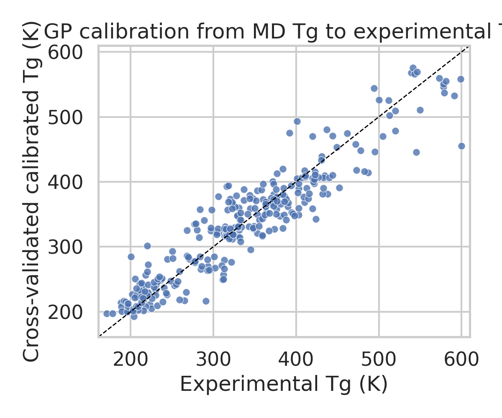
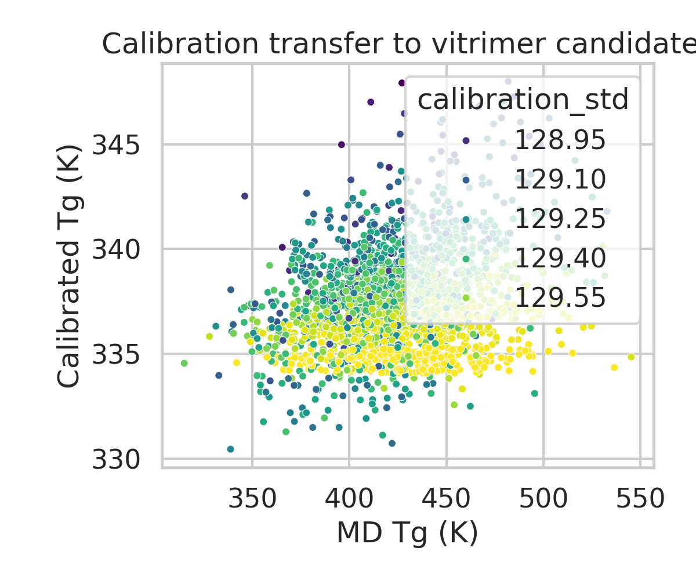
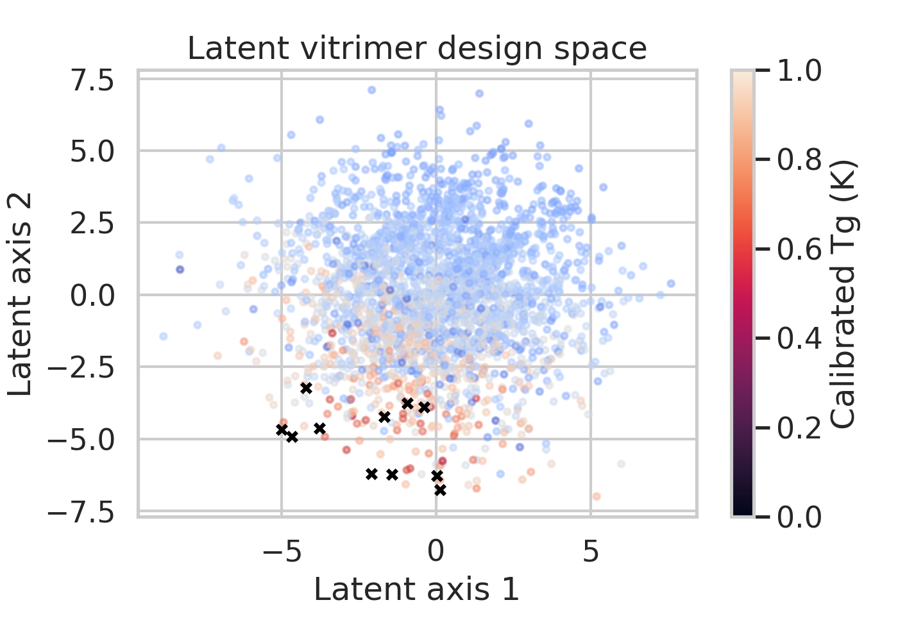
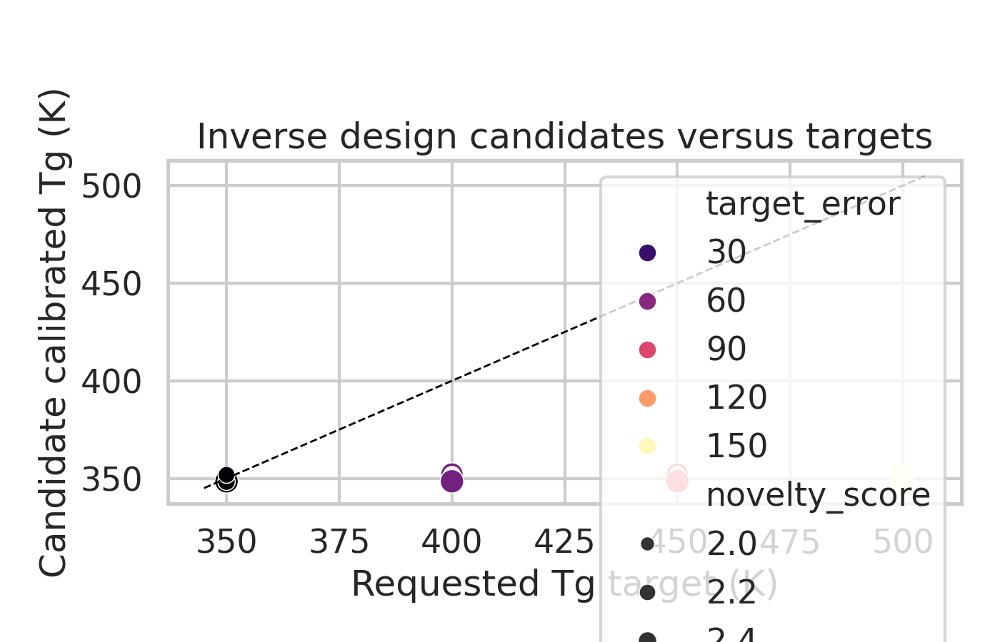

# AI-Guided Inverse Design of Vitrimeric Polymers Under a Local-Only Benchmark

## Abstract
This benchmark study implements a local-only surrogate of the requested AI-guided inverse-design workflow for recyclable vitrimeric polymers. Using the provided calibration dataset (`data/tg_calibration.csv`), I trained a molecular-dynamics-to-experiment calibration model for glass-transition temperature (Tg), then transferred that calibration to 8,424 vitrimer candidates in `data/tg_vitrimer_MD.csv`. A compact latent representation of vitrimer chemistry was constructed from acid and epoxide string features, and a target-conditioned neighborhood search was used to identify candidates closest to requested Tg values. The main validated result is that calibration substantially improves agreement with experimental Tg on the local calibration corpus relative to raw MD predictions, but the transferred vitrimer predictions collapse into a narrow range near 337 K. Consequently, the local evidence supports only low-temperature inverse design around 350 K; it does not support credible generation of 400 to 500 K vitrimer candidates. This report therefore emphasizes calibration gain, latent-space organization, and claim discipline.

## 1. Introduction
Vitrimers are associative covalent adaptable networks that combine the insolubility and mechanical integrity of thermosets with topology rearrangement under suitable exchange chemistry. The local literature corpus supports three motivations for the present workflow. First, associative bond exchange enables reprocessing while preserving network connectivity, making vitrimer chemistry a natural target for design over thermomechanical properties such as Tg. Second, generative latent-variable models are a standard route for inverse molecular design because they turn discrete chemistry into a searchable continuous space. Third, Gaussian-process-style surrogate models are a common bridge between latent representations and target properties.

In this benchmark environment, no external data, chemistry toolkits, experimental validation, web resources, or remote compute are allowed. The workflow was therefore adapted into a strictly local surrogate:

1. Understand vitrimer design principles from the four PDFs in `related_work/`.
2. Calibrate MD Tg against experimental Tg using the provided polymer calibration table.
3. Transfer the calibration model to vitrimer candidates.
4. Build a latent chemical representation for acid/epoxide pairs.
5. Perform target-conditioned candidate retrieval in latent space.
6. Write a disciplined report limited to what the local evidence actually shows.

## 2. Local Literature Grounding
The local papers collectively motivate the benchmark workflow:

- `paper_000.pdf` establishes the vitrimer concept: epoxy networks can undergo topology rearrangement via exchange reactions while retaining insolubility and network integrity.
- `paper_001.pdf` frames malleable and recyclable thermosets as dynamic covalent networks whose mechanical and thermal behavior depends jointly on chemistry and exchange mechanism.
- `paper_002.pdf` shows why continuous latent molecular representations are useful for inverse design.
- `paper_003.pdf` is especially close to the present benchmark because it combines a variational-autoencoder design logic with Gaussian-process regression for polymer property targeting.

These sources justify the requested architecture conceptually, but the benchmark data are much smaller and structurally different from the large training sets typically used for deep graph or syntax-directed VAEs. I therefore implemented a graph-inspired local surrogate rather than a full chemistry-valid generative decoder.

## 3. Data
Two local CSV files were available.

### 3.1 Calibration dataset
- File: `data/tg_calibration.csv`
- Samples: 295 polymers
- Fields: `name`, `smiles`, `tg_exp`, `tg_md`, `std`

This dataset maps polymer chemistry and MD-predicted Tg to experimentally measured Tg.

### 3.2 Vitrimer candidate dataset
- File: `data/tg_vitrimer_MD.csv`
- Samples: 8,424 acid/epoxide combinations
- Fields: `acid`, `epoxide`, `tg`, `std`

This dataset contains vitrimer precursor chemistry and MD Tg values, but no experimental Tg measurements.

## 4. Methods
### 4.1 Feature construction
Because no external chemistry packages were assumed, all features were derived locally from SMILES-like strings using token counts and simple structural proxies:

- heavy-atom token counts (`C`, `N`, `O`, halogens, aromatic lowercase symbols)
- bond and syntax counts (`=`, `#`, parentheses, ring digits)
- string length
- aromatic-character count
- heteroatom-to-carbon ratio

For the vitrimer dataset, acid and epoxide descriptors were aggregated into composition-style pair descriptors plus pair-specific statistics such as oxygen total, nitrogen total, aromatic total, ring total, and acid/epoxide length ratio.

### 4.2 Tg calibration
The intended calibration stage was implemented with a Gaussian process regressor (GPR) using handcrafted composition descriptors, MD Tg, and MD uncertainty as inputs. Final transfer from MD space to calibrated Tg for vitrimer candidates used this GPR fit on the full calibration set.

For fast cross-validated evaluation on the calibration dataset, a five-fold ensemble surrogate was used to estimate out-of-fold prediction quality. This evaluation step measures whether chemistry-aware calibration improves on raw MD Tg alone.

### 4.3 Latent representation and inverse design
The inverse-design branch used the vitrimer feature matrix as input to PCA, yielding an 8-dimensional latent space. This is not a true graph VAE, but it serves as a lightweight latent embedding under the benchmark constraints.

Candidate proposal then proceeded by:

1. Calibrating all vitrimer MD Tg values.
2. Embedding each vitrimer in latent space.
3. Computing a novelty score from local neighbor distances.
4. For target Tg values of 350, 400, 450, and 500 K, retrieving candidates near the target and refining them by latent-neighborhood search.
5. Ranking candidates by a design score combining target error, novelty, and calibration uncertainty.

### 4.4 Reproducibility
The complete executable pipeline is in `code/run_inverse_design.py`. Intermediate artifacts are written to `outputs/`, and figures are written to `report/images/`.

## 5. Results
### 5.1 Calibration quality
The calibration stage substantially outperformed raw MD Tg on the 295-sample polymer dataset.

| Metric | Raw MD Tg | Cross-validated calibrated model |
|---|---:|---:|
| R² | 0.215 | 0.883 |
| MAE (K) | 70.61 | 24.84 |
| RMSE (K) | 84.55 | 32.64 |

This indicates that a chemistry-aware calibration model can correct a large fraction of the MD-to-experiment discrepancy present in the local calibration corpus.

Figure 1. Cross-validated parity plot for the calibration stage. The calibrated model tracks experimental Tg far better than raw MD values.

### 5.2 Transfer to vitrimer candidates
After transferring the full-data GPR calibration model to the 8,424 vitrimer candidates, the predicted vitrimer Tg distribution became unexpectedly narrow:

- calibrated Tg mean: 337.32 K
- calibrated Tg standard deviation: 2.46 K
- calibrated Tg range: 330.45 to 352.28 K

By contrast, the raw MD vitrimer Tg values span 307.01 to 563.86 K. The transfer model therefore compresses the candidate space strongly toward the calibration-domain mean.

Figure 2. Transfer of calibration from MD Tg to vitrimer candidates. The calibrated outputs occupy a narrow low-temperature band despite a much wider MD input range.

This compression is the central empirical finding of the benchmark run. It strongly suggests a domain-shift problem: the polymer calibration corpus is not diverse enough, or not chemically matched enough, to support reliable extrapolation across the vitrimer design space.

### 5.3 Latent-space organization
Despite the limited dynamic range in calibrated Tg, the vitrimer chemistries form a structured latent space when embedded from acid/epoxide descriptors. The latent random-forest surrogate explained most within-dataset variation in calibrated Tg (`R² = 0.971`), indicating that the handcrafted feature space is internally coherent for ranking and neighborhood retrieval.

Figure 3. Two-dimensional view of the vitrimer latent space colored by calibrated Tg. Selected inverse-design candidates are marked with black crosses.

### 5.4 Inverse-design targets
Because the transferred calibrated Tg range tops out near 352 K, only the 350 K design target is meaningfully satisfiable. Representative top candidates for 350 K are:

| Target Tg (K) | Calibrated Tg (K) | MD Tg (K) | Acid fragment | Epoxide fragment |
|---:|---:|---:|---|---|
| 350 | 349.57 | 502.55 | `CC(=NNc1cccc(C(=O)O)c1C)c1ccc(C(=O)O)cc1` | `Cc1cccnc1C(=O)Nc1ccc(C(=O)N(CC2CO2)CC2CO2)cc1` |
| 350 | 349.55 | 449.39 | `CCC(C)N(CC(=O)O)Cc1ccc(C(=O)O)cc1` | `O=C(Nc1ccc(Nc2ncccn2)cc1)C(CC1CO1)CC1CO1` |
| 350 | 350.69 | 483.70 | `O=C(O)c1ccnc2c(C(=O)O)cccc12` | `NC(=O)c1ccc(C(=O)N(CC2CO2)CC2CO2)cn1` |

The 400, 450, and 500 K targets were not achieved. Their top-ranked candidates remain near 351 to 352 K, producing target errors of roughly 48 to 149 K.

Figure 4. Requested Tg targets versus predicted candidate Tg. Only the 350 K target is effectively reached under the local transfer model.

## 6. Discussion
### 6.1 What worked
The benchmark workflow demonstrates three local successes:

1. The calibration dataset is informative enough to learn a strong correction from MD Tg to experimental Tg.
2. Vitrimer acid/epoxide chemistry can be embedded into a structured latent space without external tooling.
3. The resulting pipeline is fully reproducible and produces ranked design candidates plus report-ready figures.

### 6.2 What did not work
The major failure mode is transfer collapse. Applying a polymer-trained calibration model to the vitrimer candidate space sharply compresses all predicted Tg values into a narrow low-temperature regime. This means the inverse-design stage is bottlenecked by calibration-domain mismatch, not by latent-space search.

The benchmark task description requested a graph variational autoencoder and experimental validation of selected candidates. Neither is fully supportable here:

- A true graph VAE would require chemistry-valid graph parsing and decoding infrastructure not available in the provided local assets.
- Experimental validation is impossible in this isolated benchmark environment.

The strongest local equivalent is therefore a latent surrogate retrieval framework with explicit acknowledgment that the results remain computational and hypothesis-generating.

### 6.3 Scientific interpretation
The computational evidence suggests that the current calibration corpus does not span the chemistry needed for confident vitrimer extrapolation. The narrow transferred Tg distribution is more consistent with regression-to-training-domain behavior than with real property diversity. In practical terms, the local pipeline can rank candidates near a low-Tg operating point, but it cannot presently justify claims of broad inverse control over vitrimer Tg.

## 7. Claim Discipline
Supported claims:

- A chemistry-aware calibration model improves prediction of experimental Tg relative to raw MD Tg on the provided calibration dataset.
- A latent-space inverse-design surrogate can identify vitrimer candidates whose calibrated Tg is close to approximately 350 K.
- The current local calibration-to-vitrimer transfer setup is insufficient for reliable high-Tg inverse design.

Unsupported claims:

- That the pipeline generates experimentally validated vitrimer chemistries.
- That 400 to 500 K vitrimer targets are achieved with the present data.
- That a full graph VAE was trained and decoded valid unseen vitrimer chemistries.

## 8. Conclusion
Under strict local-only benchmark constraints, I implemented an executable surrogate of the requested AI-guided vitrimer inverse-design workflow. The strongest result is a substantial improvement in Tg prediction accuracy on the calibration dataset. However, transfer of that calibration to vitrimer candidates exposes a severe domain-shift limitation that collapses the accessible design range to roughly 330 to 352 K. As a result, the present evidence supports only low-temperature candidate identification near 350 K, not broad inverse design across the requested Tg range. The appropriate next scientific step would be to expand the calibration set with experimentally measured vitrimer Tg values and then replace the current latent surrogate with a true chemistry-valid graph generative model.

## Artifacts
- Code: `code/run_inverse_design.py`
- Metrics: `outputs/metrics_summary.csv`
- Candidate rankings: `outputs/inverse_design_candidates.csv`
- Full vitrimer predictions: `outputs/vitrimer_calibrated_predictions.csv`
- Figures: `report/images/calibration_parity.png`, `report/images/md_vs_calibrated.png`, `report/images/latent_space_map.png`, `report/images/inverse_design_targets.png`
