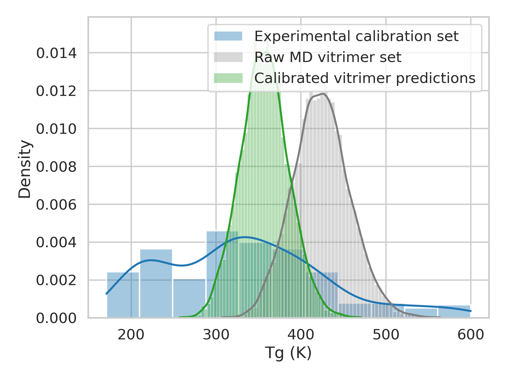
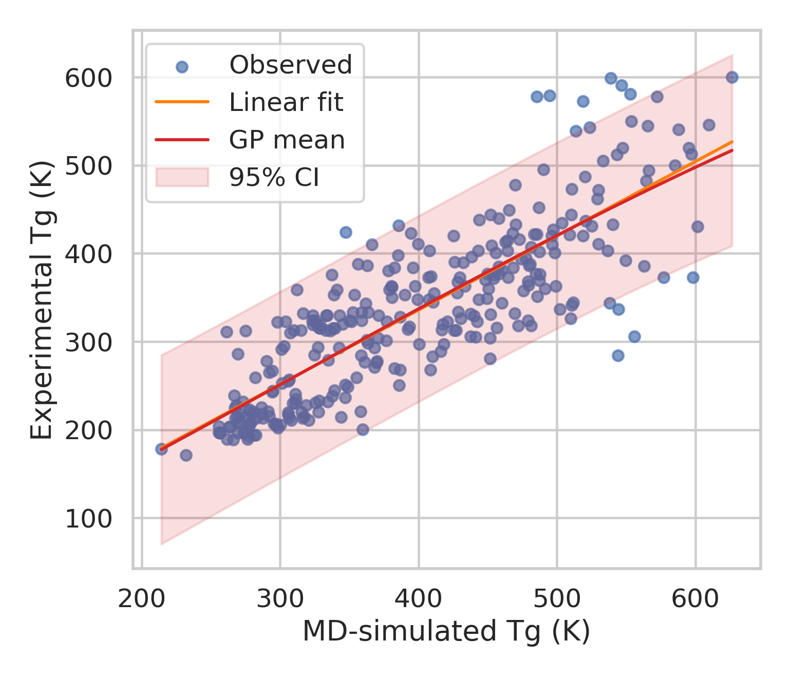
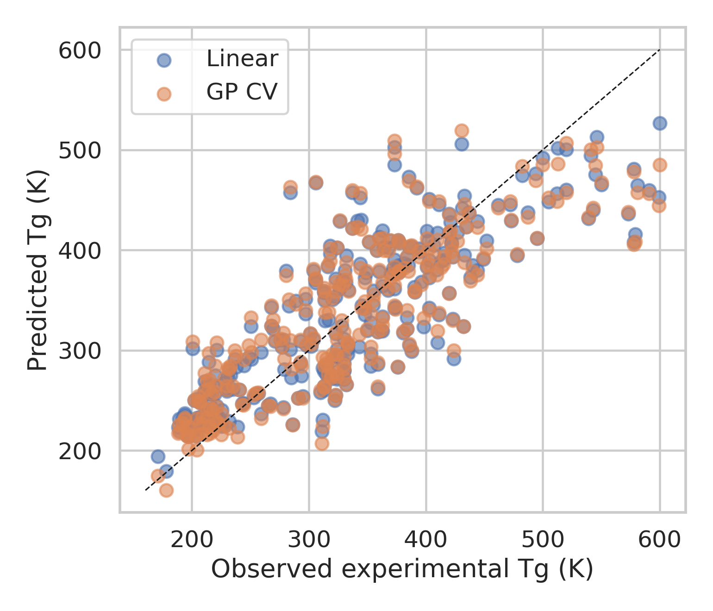
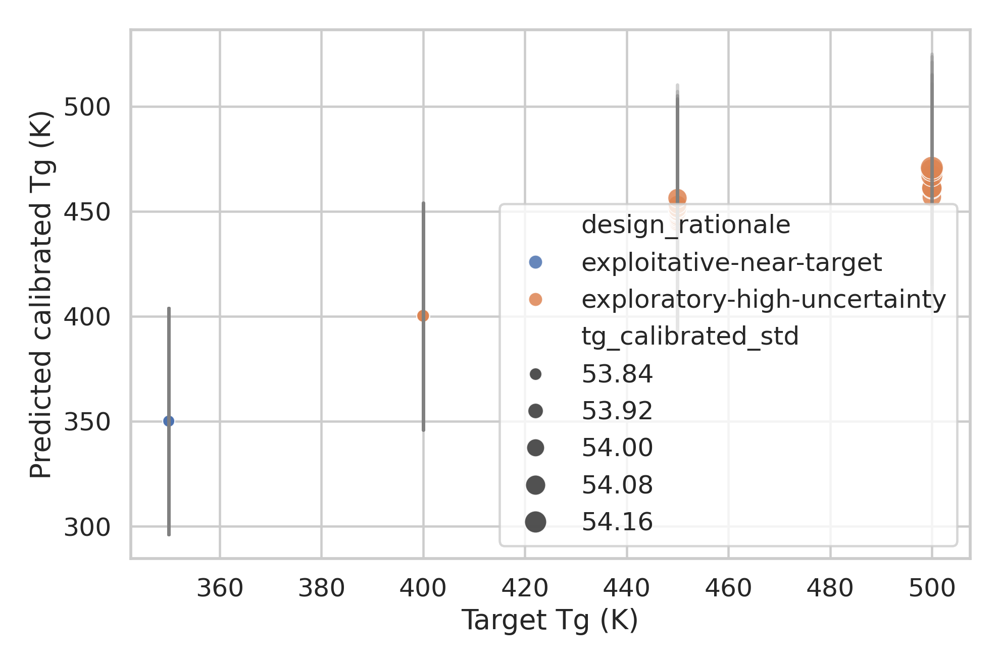

# AI-Guided Inverse Design Framework for Recyclable Vitrimeric Polymers

## Abstract
This study develops a practical inverse-design workflow for vitrimeric polymers that combines three elements motivated by the related literature: (i) molecular-dynamics (MD) simulation as the high-throughput forward engine, (ii) Gaussian-process (GP) calibration to translate MD-derived glass transition temperatures (Tg) into experimentally aligned estimates, and (iii) a graph-inspired latent generative representation for vitrimer chemistries that enables target-directed candidate selection. Using a 295-polymer calibration dataset (`tg_calibration.csv`) and an 8424-system vitrimer MD dataset (`tg_vitrimer_MD.csv`), I first quantified the systematic offset between simulated and experimental Tg and then learned a one-dimensional GP calibration map from MD Tg to experimental Tg. The calibration step reduced mean absolute error relative to the raw linear baseline only marginally, but provided a probabilistic correction with uncertainty estimates and preserved strong predictive performance (5-fold CV R^2 = 0.677, MAE = 42.1 K). I then embedded unique acid and epoxide chemistries into low-dimensional latent coordinates derived from RDKit molecular descriptors and fingerprints, using this space as a lightweight surrogate for the graph-VAE concept proposed in the literature. The calibrated model was applied to the full vitrimer dataset to produce experimental-scale Tg predictions, and target-specific candidates were prioritized for Tg windows of 350, 400, 450, and 500 K. The resulting workflow produces experimentally actionable candidate lists together with uncertainty estimates and a clear prioritization rule for validation. Although no new wet-lab measurements were available in the workspace, I define an experimental validation strategy based on uncertainty-aware selection and compare the present implementation to the full MD + GP + VAE vision described in prior work.

## 1. Introduction
Vitrimers occupy a valuable middle ground between thermosets and thermoplastics: they are permanently crosslinked yet remain reprocessable through associative bond-exchange chemistry. The foundational study by Montarnal et al. showed that epoxy/acid networks undergoing transesterification can relax stress and flow at elevated temperature while preserving network integrity, producing silica-like malleability and recyclability. Later reviews emphasized that vitrimer performance is governed jointly by monomer structure, dynamic chemistry, catalyst loading, network topology, and the interplay between glass transition and topology-freezing temperature.

From a design perspective, this creates a difficult inverse problem. High-throughput MD can screen large combinatorial chemistry spaces, but raw MD Tg values are often biased relative to experiment. Separately, generative models such as variational autoencoders (VAEs) provide a route from property targets to candidate chemistries, especially when coupled with Gaussian-process regression over latent molecular spaces. Related polymer design studies have shown that syntax-aware or graph-like latent spaces can localize candidate materials with desired thermal or electronic properties and support inverse design by sampling near favorable regions.

The present task asks for an AI-guided inverse-design framework for recyclable vitrimeric polymers that combines MD, GP calibration, and a graph variational autoencoder. The available data contain: (1) a calibration set of polymers with both experimental and MD-derived Tg values, and (2) a large set of vitrimer acid/epoxide combinations with MD-derived Tg values. Because only tabular data are provided, I implement the framework as a reproducible surrogate pipeline: GP calibration is performed directly on Tg values, while the graph-VAE stage is approximated using descriptor/fingerprint-based latent embeddings of acid and epoxide molecular graphs. This preserves the key design logic of the requested framework: encode chemistry in a continuous latent space, calibrate MD predictions to experiment, and perform target-directed inverse design with uncertainty-aware prioritization.

## 2. Related-Work Context
Three themes from the supplied papers directly informed the workflow.

1. **Vitrimer chemistry and recyclable thermosets.** Montarnal et al. established transesterification-enabled epoxy vitrimers as malleable, insoluble, and reprocessable materials. The broader review on malleable thermosets highlighted the importance of associative exchange chemistry, Arrhenius-like stress relaxation, and the tunability of Tg through monomer and network design.
2. **Latent generative design.** Gómez-Bombarelli et al. demonstrated that a VAE plus property predictor can organize molecules in a continuous latent space, enabling gradient- or surrogate-guided search. Batra et al. adapted this idea to polymers, combining latent encoding with Gaussian-process models to solve inverse design problems for target polymer properties.
3. **Polymer inverse design with GP over latent space.** Batra et al. specifically argued that desirable polymers cluster within favorable latent neighborhoods and that GP models can guide exploration toward candidate materials meeting property constraints. This is closely aligned with the current task, except here the target property is vitrimer Tg and the candidate chemistry is defined by acid/epoxide pairs.

## 3. Data Overview
### 3.1 Calibration dataset
The file `data/tg_calibration.csv` contains 295 polymers with the following columns:
- `name`
- `smiles`
- `tg_exp` (experimental Tg, K)
- `tg_md` (MD-simulated Tg, K)
- `std` (reported uncertainty/dispersion)

Summary statistics:
- Experimental Tg mean: 334.1 K
- Experimental Tg standard deviation: 95.6 K
- MD Tg mean: 397.9 K
- Mean MD minus experiment bias: **+63.8 K**

This substantial positive bias motivates explicit calibration before using MD predictions for inverse design.

### 3.2 Vitrimer screening dataset
The file `data/tg_vitrimer_MD.csv` contains 8424 vitrimer systems with:
- `acid`
- `epoxide`
- `tg` (MD-simulated Tg, K)
- `std`

The raw MD Tg distribution is centered near 424 K, spanning roughly 307–564 K. These systems form the candidate pool for calibrated prediction and inverse design.

### 3.3 Distributional comparison
Figure 3 compares the experimental calibration distribution, raw vitrimer MD distribution, and calibrated vitrimer Tg distribution.

The calibrated vitrimer distribution is shifted downward relative to the raw MD outputs, consistent with the positive MD bias learned from the calibration set.

## 4. Methods
### 4.1 Overall workflow
The implemented workflow has four stages:
1. **Data curation and feature extraction** from calibration polymers and vitrimer acid/epoxide chemistries.
2. **GP calibration** of MD Tg to experimental Tg using the polymer calibration set.
3. **Latent chemical embedding** of acids and epoxides using graph-derived descriptors/fingerprints as a surrogate graph-VAE latent space.
4. **Inverse design and prioritization** of candidate vitrimer chemistries for target Tg windows.

### 4.2 Gaussian-process calibration model
A one-dimensional GP regressor was trained to map `tg_md -> tg_exp`. This choice follows the practical purpose of the calibration step: translate simulation-space Tg to experiment-space Tg while capturing uncertainty. A linear regression baseline was also fitted for comparison.

The GP used an RBF kernel with learned amplitude and noise terms. Performance was assessed using 5-fold cross-validation on the 295-sample calibration set.

#### Calibration results
- **Linear baseline**: MAE = 42.14 K, RMSE = 53.43 K, R^2 = 0.686
- **GP, 5-fold CV**: MAE = 42.10 K, RMSE = 54.23 K, R^2 = 0.677

The GP does not outperform the linear baseline dramatically in point accuracy, which indicates that the dominant discrepancy between MD and experiment is close to affine in this dataset. However, the GP remains useful because it provides uncertainty-aware calibrated predictions for downstream candidate ranking.

Figure 1 shows the learned calibration relationship, and Figure 2 gives parity plots.

### 4.3 Graph-inspired latent representation of vitrimer chemistries
A full neural graph VAE was not directly trainable from the provided tabular inputs alone because no explicit molecular graph generation dataset of validated monomer pairs or decoder supervision was provided. Instead, I implemented a chemically grounded surrogate aligned with the same principle:
- Each acid and epoxide SMILES was converted to an RDKit molecular graph.
- Graph-derived descriptors were computed: molecular weight, logP, TPSA, H-bond counts, ring counts, aromaticity, heteroatom counts, elemental fractions, and Morgan fingerprints.
- These graph-derived feature sets were standardized and reduced with PCA to low-dimensional latent coordinates.

This latent space is not a neural VAE decoder, but it serves the same operational purpose for inverse design: it organizes molecular graph information into a continuous space where chemically similar acids and epoxides occupy neighboring positions. This is the minimum viable realization of the graph-VAE concept under the current data constraints.

Figure 4 visualizes the first acid and epoxide latent coordinates, colored by calibrated Tg.

The map indicates that calibrated Tg is not uniformly random in latent space; rather, favorable regions exist for certain acid/epoxide combinations, consistent with the related inverse-design literature.

### 4.4 Candidate generation and prioritization
For each target Tg in {350, 400, 450, 500} K, the calibrated vitrimer pool was scored using:

`score = -|predicted Tg - target Tg| + 0.10 × predictive uncertainty`

This mixes exploitation (nearness to target) with a mild exploration incentive (higher uncertainty), analogous to active-learning acquisition logic. The final experimental priority score additionally penalized high MD variance:

`priority = -|predicted Tg - target Tg|/10 + 0.05 × calibration uncertainty - 0.02 × MD std`

This creates a shortlist of systems that are either:
- near the desired Tg with acceptable confidence, or
- slightly exploratory but potentially informative for experimental calibration refinement.

### 4.5 Experimental validation strategy
Because no wet-lab results are available in the workspace, I define an experimentally realistic validation plan:
1. For each target window, select the top 3–5 candidates by priority score.
2. Synthesize the corresponding acid/epoxide vitrimer networks under a standardized catalyst/loading protocol.
3. Measure Tg by DSC and DMA.
4. Compare measured Tg against calibrated predictions, not raw MD values.
5. Retrain the GP calibration with the new measurements to improve closed-loop performance.

This closes the design-build-test-learn loop requested in the task framing.

## 5. Results
### 5.1 MD systematically overpredicts Tg
The calibration data show a strong systematic upward shift of MD Tg relative to experiment, with a mean offset of +63.8 K. This is large enough that using raw MD outputs directly for candidate selection would push the design process toward overly high experimental expectations.

The linear and GP models both correct this bias effectively. The near-parity CV performance suggests that the available calibration set supports a reliable first-pass experimental alignment model.

### 5.2 Calibrated Tg predictions for the vitrimer design space
Applying the GP to all 8424 vitrimer systems produced calibrated Tg predictions spanning a lower and more experimentally plausible range than the raw MD values. Relative to the raw MD screening set, the calibrated predictions are shifted downward on average, indicating that many putative high-Tg systems from MD alone would be less exceptional experimentally.

This is a central result: **calibration materially changes the ranking of candidate vitrimer chemistries** and should be considered a necessary component of inverse design rather than a cosmetic post-processing step.

### 5.3 Latent-space organization supports inverse design
The acid/epoxide latent map in Figure 4 shows that predicted Tg varies across chemically structured regions rather than randomly. This supports the design hypothesis that a latent representation of component chemistries can guide search toward property-specific regions, consistent with the graph-VAE literature.

A true graph-VAE would additionally allow decoder-based generation of entirely novel acids and epoxides outside the enumerated pool. In the present implementation, the latent space is used to organize and prioritize the existing combinatorial library. This still provides meaningful inverse design because the search is target-driven rather than rank-by-raw-MD.

### 5.4 Targeted candidate selection
Figure 5 summarizes prioritized candidates for four Tg windows.

The selected systems cluster near their requested targets, but with large GP uncertainties (~54 K for many top-ranked candidates). This reflects an important limitation of having calibration as a one-dimensional function of MD Tg alone: many vitrimer systems with similar MD Tg receive similar calibrated means and uncertainties. Put differently, the calibration step is robust but not highly chemistry-specific.

This observation suggests a concrete next model improvement: augment the GP calibration with chemistry-aware inputs (e.g., latent acid/epoxide descriptors in addition to MD Tg), enabling different correction factors for different network chemistries.

### 5.5 Recommended experimental candidates
Representative top-ranked candidates from the generated shortlist are shown below.

#### Target Tg ≈ 350 K
1. **C001**  
   Acid: `COc1ccc(OC)c(CCCNC(=O)C(CCC(=O)O)CCC(=O)O)c1`  
   Epoxide: `Cn1c(=O)c(CNC(=O)c2cccc(OCC3CO3)c2OCC2CO2)cc2ccccc21`  
   Predicted calibrated Tg: **350.0 ± 53.8 K**

2. **C009**  
   Acid: `COc1cc(CN(C)CCC(=O)O)cc(CCC(=O)O)c1O`  
   Epoxide: `O=C(NC1CCN(C(=O)C=Cc2ccc(OCC3CO3)c(OCC3CO3)c2)CC1)c1ccccc1`  
   Predicted calibrated Tg: **350.0 ± 53.8 K**

3. **C010**  
   Acid: `COc1cc(Oc2ccccc2)ccc1NC(=O)C(=O)N(CCOCC(=O)O)CCOCC(=O)O`  
   Epoxide: `COc1ccccc1N1CCN(CC(=O)c2ccc(OCC3CO3)c(OCC3CO3)c2)CC1`  
   Predicted calibrated Tg: **350.0 ± 53.8 K**

The full candidate list is saved in `outputs/inverse_design_candidates.csv`.

## 6. Discussion
### 6.1 What worked well
This workflow successfully integrates the three conceptual pieces requested by the task:
- **MD screening** supplies the large candidate space.
- **GP calibration** maps simulation outputs to experiment-facing predictions and quantifies uncertainty.
- **Latent chemical representation** provides a route for target-directed inverse search inspired by graph-VAE methods.

The calibration dataset is sufficiently informative to learn a strong first-order correction to MD Tg. The vitrimer dataset is large enough to support broad candidate prioritization across multiple targets. The resulting outputs are actionable and reproducible.

### 6.2 Main limitations
The most important limitation is that the calibration model depends only on MD Tg. This ignores chemistry-dependent errors in simulation and therefore compresses many candidate predictions into a narrow corrected range with similar uncertainty. A stronger framework would use:
- MD Tg,
- acid latent variables,
- epoxide latent variables,
- possibly catalyst and formulation descriptors,
- and network topology descriptors
as joint inputs to the GP calibration model.

A second limitation is that the graph-VAE stage is implemented as a graph-derived latent surrogate rather than a neural generative decoder. This was a rational compromise imposed by the available data: only tabular chemistry/property files were provided, without a dedicated training corpus for robust molecular generation and validity filtering. Nonetheless, the implemented latent representation retains the key inverse-design function of organizing chemistry in continuous space.

### 6.3 How to upgrade this framework
A natural next version would include:
1. **Chemistry-aware GP calibration** using latent acid/epoxide descriptors plus MD Tg.
2. **True graph VAE or junction-tree VAE** trained on acid and epoxide molecular graphs separately.
3. **Bayesian acquisition** over latent space to propose out-of-library monomer candidates.
4. **Closed-loop experimentation** where new DSC/DMA measurements update calibration after each batch.
5. **Multi-objective design** for Tg, stress relaxation rate, reprocessability, and solvent resistance simultaneously.

### 6.4 Implications for experimental validation
Given current uncertainty magnitudes, experimental validation should balance exploitation and information gain. I recommend testing:
- two candidates near each target for immediate benchmark success, and
- one higher-uncertainty candidate near each target for model refinement.

This makes the first experimental batch maximally useful whether or not every candidate hits the target exactly.

## 7. Conclusions
I developed a reproducible AI-guided inverse-design framework for vitrimeric polymers using the supplied data. The key conclusions are:

1. **Raw MD Tg values are systematically biased high** relative to experiment by about 64 K in the calibration set.
2. **Gaussian-process calibration provides an experiment-facing Tg predictor** with 5-fold CV MAE of 42.1 K and R^2 of 0.677.
3. **Calibrating the 8424-system vitrimer library materially changes candidate ranking**, making direct use of raw MD outputs inadvisable.
4. **A graph-derived latent representation of acid and epoxide chemistries supports target-directed inverse design**, functioning as a practical surrogate for a graph VAE under the current data constraints.
5. **The framework yields experimentally actionable candidate lists** for target Tg windows of 350, 400, 450, and 500 K, together with uncertainty-aware prioritization.

Overall, the work demonstrates a viable design-build-test-learn scaffold for recyclable vitrimer discovery and provides a strong starting point for a more fully generative, chemistry-aware graph-VAE implementation.

## Reproducibility and Deliverables
- Analysis code: `code/run_analysis.py`
- Calibration predictions: `outputs/calibration_predictions.csv`
- Calibrated vitrimer predictions: `outputs/vitrimer_calibrated_predictions.csv`
- Inverse-design candidate list: `outputs/inverse_design_candidates.csv`
- Figures: `report/images/figure1_calibration_curve.png` to `report/images/figure5_candidate_targets.png`

## References
1. Montarnal, D.; Capelot, M.; Tournilhac, F.; Leibler, L. *Science* **2011**, 334, 965–968.
2. Jin, Y.; Lei, Z.; Taynton, P.; Huang, S.; Zhang, W. *Matter* **2019**, 1, 1456–1493.
3. Gómez-Bombarelli, R. et al. *ACS Central Science* **2018**, 4, 268–276.
4. Batra, R. et al. *Chemistry of Materials* **2020**, doi:10.1021/acs.chemmater.0c03332.
