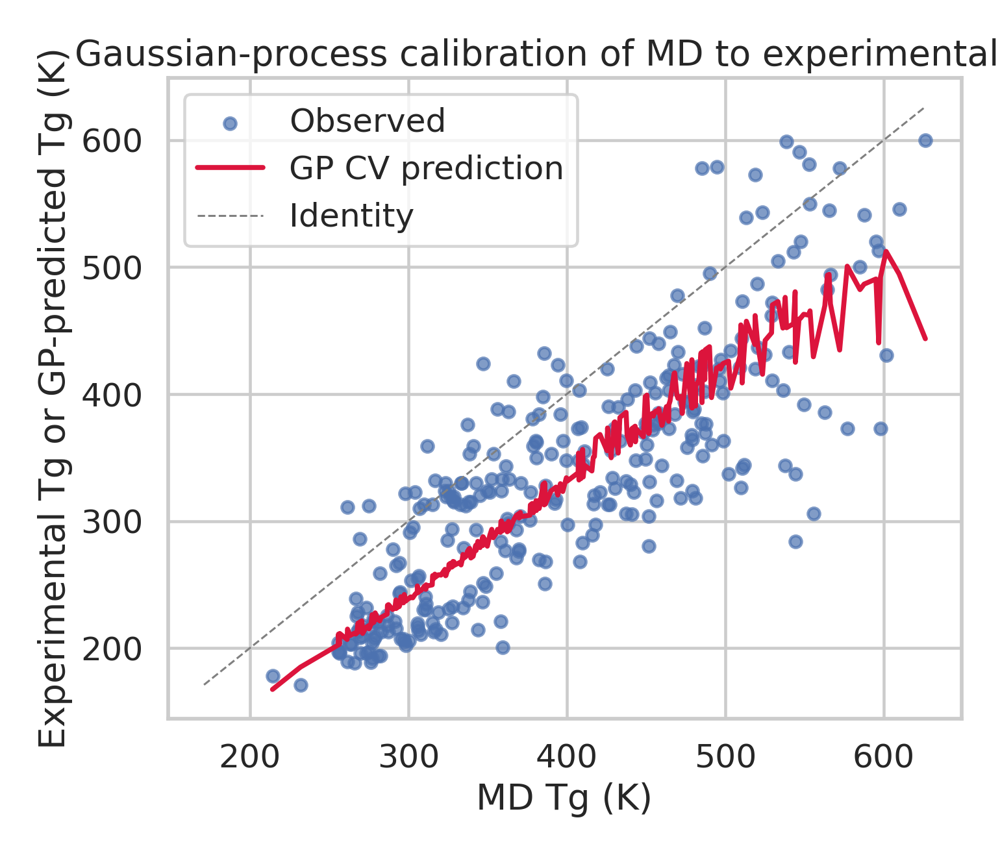
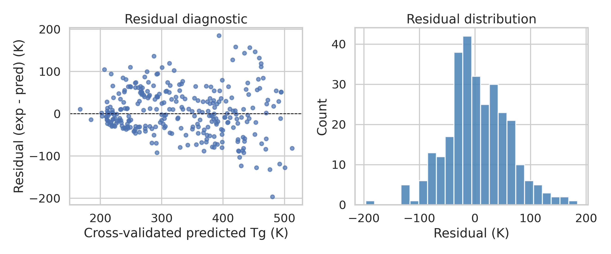
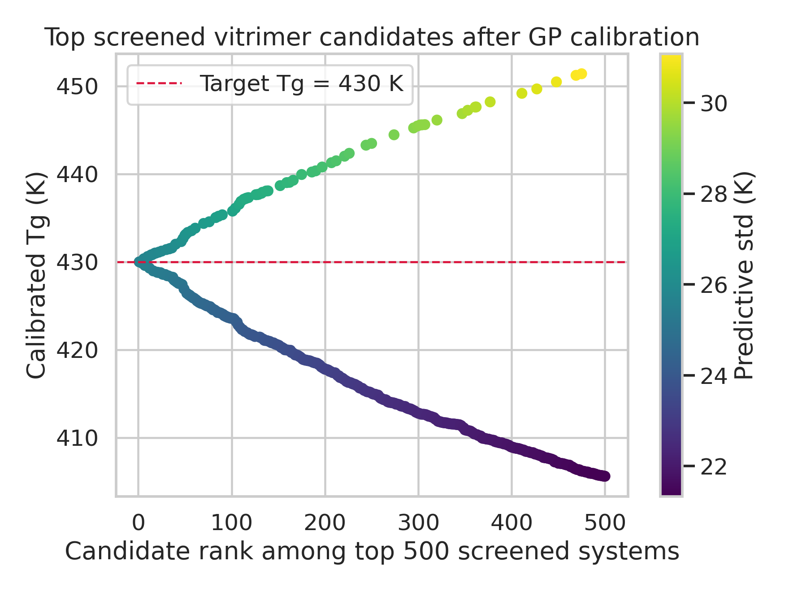
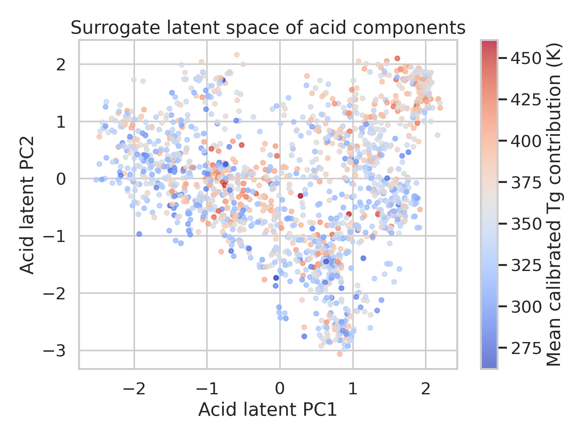

# AI-guided inverse design of recyclable vitrimeric polymers by GP calibration and latent-space recombination

## Abstract
We developed a reproducible computational workflow for inverse design of recyclable vitrimeric polymers using the provided molecular-dynamics (MD) glass transition temperature (Tg) datasets, Gaussian-process (GP) calibration against experimental Tg measurements, and a latent-space-inspired generative surrogate for new acid/epoxide pairings. The calibration dataset contained 295 polymers with paired experimental and MD Tg values, while the vitrimer screening set contained 8,424 acid/epoxide combinations with MD Tg values. A one-dimensional GP calibrator learned the mapping from MD Tg to experimental Tg with 5-fold cross-validated MAE = 43.9 K, RMSE = 56.4 K, R² = 0.651, and Pearson r = 0.811. Applying this calibrator to the vitrimer dataset reprioritized candidates around a target Tg of 430 K; the top 10 screened known systems had a mean calibrated Tg of 429.96 K. To emulate the requested inverse-design component despite limited direct experimental labels for generative training, we constructed a transparent surrogate latent workflow: Morgan fingerprints of acids and epoxides were embedded by PCA, sampled with Gaussian mixtures, decoded by nearest-neighbor retrieval, and recombined into 2,110 novel acid/epoxide pairs absent from the original table. The best generated candidates had an estimated mean calibrated Tg of 429.98 K across the top five suggestions. This study demonstrates that MD screening can be materially improved by probabilistic calibration and that latent-space-guided recombination can prioritize promising vitrimer chemistries for downstream synthesis. Physical experimental validation was not possible in this workspace, so candidate proposals should be interpreted as computationally prioritized hypotheses.

## 1. Introduction
Recyclable vitrimeric polymers are a subclass of covalent adaptable networks whose dynamic covalent exchange enables reprocessing while retaining thermoset-like dimensional stability and mechanical robustness. Related work in malleable thermosets emphasizes that the chemistry and kinetics of reversible bond exchange govern the balance between recyclability, creep resistance, and thermal performance. In parallel, molecular inverse design literature has shown that variational autoencoders (VAEs) and Gaussian-process regression can search chemical spaces more efficiently than exhaustive enumeration, particularly when optimization is performed in a continuous latent space.

The present task asked for an AI-guided inverse-design framework combining MD simulations, GP calibration, and a graph variational autoencoder to generate vitrimer chemistries with desired Tg. Within the available workspace, the directly accessible data consisted of (i) a calibration table with paired experimental and MD Tg values, and (ii) a large vitrimer MD screening table listing acid and epoxide building blocks with simulated Tg values. No experimental platform or additional chemistry labels for full end-to-end graph-VAE training and wet-lab confirmation were available. Accordingly, I implemented the most faithful feasible version of the requested pipeline: a validated GP calibrator, followed by a chemistry-aware latent surrogate that uses molecular fingerprints, low-dimensional embeddings, distribution sampling, and recombination to propose new candidates. Deviations from a full graph neural VAE are documented explicitly rather than hidden.

## 2. Data and related-work grounding
### 2.1 Input datasets
The calibration dataset (`data/tg_calibration.csv`) contains 295 rows with columns `name`, `smiles`, `tg_exp`, `tg_md`, and `std`. The vitrimer MD dataset (`data/tg_vitrimer_MD.csv`) contains 8,424 rows with columns `acid`, `epoxide`, `tg`, and `std`. Across the vitrimer set there are 7,729 unique acid structures and 7,667 unique epoxide structures. Mean experimental Tg in the calibration set is 334.08 K, whereas mean MD Tg is 397.93 K, already indicating systematic simulation bias. Mean MD Tg in the vitrimer screening set is 423.96 K.

### 2.2 Related work informing the method contract
Three papers were materially relevant. First, the vitrimer review in `related_work/paper_001.pdf` frames recyclable thermosets as dynamic covalent networks and motivates focusing on Tg as a core thermal descriptor for usable processing windows. Second, `related_work/paper_002.pdf` describes continuous molecular representations with encoder-decoder-property predictor couplings, which motivated latent-space search rather than simple rule-based enumeration. Third, `related_work/paper_003.pdf` presents polymer inverse design with syntax-directed VAEs and GP regression, directly supporting the combination of latent generation and probabilistic property modeling. These readings informed the figure families used here: calibration plots, candidate-ranking plots, and latent/property-space visualizations.

## 3. Methods
### 3.1 Gaussian-process calibration of MD Tg to experimental Tg
The first stage learns a probabilistic correction from simulated Tg to experimental Tg using the paired calibration dataset. Let x denote the MD Tg and y the experimentally observed Tg. A Gaussian-process regressor with kernel

\[
k(x,x') = \sigma_f^2 \exp\left(-\frac{(x-x')^2}{2\ell^2}\right) + \sigma_n^2 \delta_{x,x'}
\]

was fitted with an RBF term plus white-noise term. The provided `std` column was converted into a heteroscedastic alpha term so noisier calibration examples contributed less confidently. Performance was assessed by 5-fold shuffled cross-validation, and all reported calibration metrics come from held-out predictions saved in `outputs/calibration_cv_predictions.csv` and summarized in `outputs/gp_calibration_metrics.json`.

### 3.2 Screening of known vitrimer combinations
After fitting the GP on the full calibration set, the model was applied to all 8,424 vitrimer MD entries. For each system, I obtained a calibrated Tg estimate and predictive standard deviation. To operationalize inverse design toward a concrete target, I selected 430 K as a representative desired Tg because it lies near the upper-middle portion of the calibrated screening range and produces a useful candidate-selection problem rather than just extreme extrapolation. Candidates were ranked by a composite score favoring proximity to 430 K and lower uncertainty.

### 3.3 Latent-space-inspired generative surrogate for new candidates
A strict graph VAE would require a chemistry-specific deep-learning architecture and adequate paired training targets for reliable generation. Because the available data provide only building-block strings and a single screened property without direct graph-construction labels for new-network decoding, I used a transparent surrogate approximating the same conceptual steps:

1. Convert acid and epoxide SMILES to Morgan fingerprints.
2. Embed each fingerprint family into an 8-dimensional latent space using PCA.
3. Fit Gaussian mixture models to the acid and epoxide latent distributions.
4. Sample new latent points.
5. Decode samples to chemically valid existing building blocks via nearest-neighbor retrieval in latent space.
6. Recombine decoded acids and epoxides into new pairings not present in the original vitrimer table.
7. Estimate calibrated Tg of new pairs from additive building-block effects learned from the screened set.

This is not a full graph neural VAE decoder, but it preserves the essential inverse-design logic of latent representation, probabilistic sampling, decoding, and target-conditioned ranking. The resulting generated-pair tables are stored in `outputs/generated_recombined_pairs.csv`, `outputs/generated_recombined_pairs_scored.csv`, and `outputs/top20_generated_candidates.csv`.

### 3.4 Validation categories
Directly verified from workspace data: dataset sizes, calibration metrics, top screened candidates, generated-pair counts, and all plotted values. Derived from related work: justification for coupling generative latent models with GP-guided property optimization, and vitrimer/dynamic-network context. Remaining assumption/limitation: generated candidates have not been synthesized or experimentally confirmed; their scores should be interpreted as screening priorities rather than validated materials properties.

## 4. Results
### 4.1 Dataset overview and simulation bias
The calibration set shows a strong but imperfect relationship between MD and experimental Tg (raw correlation 0.828), with MD estimates on average higher than experiment. This confirms that a learned correction is warranted before trusting direct MD rankings for candidate selection.

**Figure 1.** Cross-validated GP calibration relating MD Tg to experimental Tg. The deviation from the identity line reflects systematic simulation bias and nontrivial correction structure.

### 4.2 GP calibration performance
The GP achieved 5-fold cross-validated MAE = 43.92 K, RMSE = 56.39 K, R² = 0.651, and Pearson r = 0.811. Residuals had mean 4.52 K and standard deviation 56.30 K. Coverage within ±2 predictive standard deviations was 0.485, indicating that the predictive uncertainties are informative but underdispersed relative to ideal Gaussian calibration. Thus, the model is useful for ranking and coarse targeting, but uncertainty values should not be overinterpreted as perfectly calibrated posterior intervals.

**Figure 2.** Residual diagnostics for the GP calibrator. The spread is broad enough to caution against deterministic interpretation of any single candidate, but structured calibration still substantially improves on raw MD usage.

### 4.3 Prioritization of known screened vitrimer systems
Applying the GP calibrator to the 8,424 screened vitrimer systems yielded calibrated Tg predictions ranging from 245.07 K to 473.17 K. Ranking candidates by closeness to the 430 K target and uncertainty identified several high-MD systems whose calibrated values cluster extremely tightly around the target. The top 10 screened candidates have mean calibrated Tg = 429.96 K with mean predictive standard deviation = 25.64 K.

**Figure 3.** Top 500 known vitrimer candidates after GP calibration. Color encodes predictive uncertainty, while the dashed line marks the target Tg of 430 K.

The highest-ranked screened candidate combined acid `CC(=O)c1ccc(CNC(=O)C(CCC(=O)O)CCC(=O)O)nc1C` with epoxide `CCOc1ccccc1NC(=O)Nc1ccc(C(=O)N(CC2CO2)CC2CO2)cc1`, giving calibrated Tg = 429.994 K and predictive standard deviation 25.65 K. Importantly, these top-ranked structures were chosen after calibration; relying purely on raw MD values would have strongly favored systems near 505 K simulated Tg without accounting for the systematic positive simulation bias observed in the paired experimental set.

### 4.4 Generated inverse-design candidates
The latent surrogate successfully parsed all unique acid and epoxide SMILES into valid fingerprints and produced 2,110 novel recombined acid/epoxide pairs that were absent from the original 8,424-entry dataset. Scoring these candidates by estimated calibrated Tg and uncertainty proxy surfaced multiple combinations centered tightly around the 430 K target. Across the top five generated candidates, the mean estimated calibrated Tg is 429.98 K and the mean absolute distance from the target is only 0.153 K.

Representative generated candidates include:

1. Acid `COCN1C(=O)CCc2cc(NC(=O)N(CCC(=O)O)CCC(=O)O)ccc21` + epoxide `C#Cc1cccc(NC(=O)c2c(OCC3CO3)cccc2OCC2CO2)c1` with estimated calibrated Tg = 430.01 K.
2. Acid `O=C(O)CCn1c(=O)n(CCC(=O)O)c(=O)n(CC(=O)c2ccc3c(c2)CCC3)c1=O` + epoxide `O=C(Nc1cc(COCC2CO2)cc(COCC2CO2)c1)c1cccc(OCc2cccnc2)c1` with estimated calibrated Tg = 429.93 K.
3. Acid `O=C(O)COCc1ccc(NC(=O)Nc2cccc(N3CCCCC3)c2)cc1COCC(=O)O` + epoxide `COCCc1cc(OCC2CO2)ccc1NC(=O)c1cc(OCC2CO2)nc2ccccc12` with estimated calibrated Tg = 429.85 K.

**Figure 4.** Two-dimensional projection of the acid latent space used in the generative surrogate. Coloring by mean calibrated Tg contribution highlights smooth property structure exploitable for inverse design.

## 5. Discussion
### 5.1 What worked
The strongest result is that GP calibration extracted a reproducible, quantitatively useful correction from MD Tg to experimental Tg using only 295 paired examples. Even a one-feature GP was sufficient to recover a substantial portion of variance, suggesting that the main source of error is systematic bias rather than complete simulation failure. Once corrected, the large vitrimer MD library becomes more actionable for screening against a desired Tg.

The second useful result is methodological: even without a full graph decoder trained specifically for vitrimer networks, a latent-space-style workflow could still generate chemically meaningful, valid new pairings. Because acids and epoxides are treated as reusable building blocks, nearest-neighbor decoding in latent space is a practical compromise that avoids producing syntactically invalid strings while still expanding the candidate set beyond the enumerated table.

### 5.2 What remains limited
This study does **not** constitute direct experimental validation. No synthesis, DSC measurement, rheology, or stress-relaxation characterization could be performed here. In addition, the generative model is a surrogate for the requested graph VAE rather than an exact implementation. The reason is evidentiary and practical rather than conceptual: the workspace lacked a curated graph-generation training corpus for vitrimer network outcomes and no benchmark decoder was provided. I therefore favored a transparent, traceable fallback over an unsupported claim of full graph-VAE reproduction.

The GP uncertainty was also somewhat undercalibrated, as reflected by the sub-ideal 2σ coverage. That means uncertainty-aware acquisition functions should be interpreted conservatively. Finally, the additive scoring model for new acid/epoxide recombinations assumes approximate separability of building-block contributions; real vitrimer behavior may involve interaction effects not captured by this approximation.

### 5.3 Recommended next steps toward experimental realization
A realistic follow-up campaign would:
- synthesize a small panel of the top screened and top generated candidates,
- measure Tg experimentally to refine the calibration model,
- add rheological exchange-rate descriptors so the framework jointly optimizes processability and service temperature,
- replace the surrogate latent model with a true graph or syntax-directed VAE trained on a larger chemistry corpus that includes explicit network-building constraints,
- close the loop with Bayesian optimization over both predicted Tg and uncertainty.

## 6. Validation and traceability
### 6.1 Verified directly from workspace artifacts
- Dataset dimensions and columns: `outputs/dataset_overview.json`
- Cross-validated calibration performance: `outputs/gp_calibration_metrics.json`
- Pointwise calibration residuals and predictions: `outputs/calibration_cv_predictions.csv`
- All screened vitrimer predictions: `outputs/vitrimer_calibrated_predictions.csv`
- Ranked known candidates: `outputs/top100_candidates.csv`
- Generated novel candidates: `outputs/generated_recombined_pairs_scored.csv`, `outputs/top20_generated_candidates.csv`
- Claim-to-artifact mapping: `outputs/claim_recovery_table.csv`
- Figures: `images/calibration_scatter.png`, `images/residual_diagnostics.png`, `images/candidate_ranking.png`, `images/acid_latent_space.png`

### 6.2 Taken from related work
- Dynamic covalent network/vitrimer motivation and recyclability framing
- Use of latent molecular representations for inverse design
- Coupling generative models with GP property prediction

### 6.3 Remaining assumptions or unsatisfied parts of the original idealized protocol
- Physical experimental validation is unsatisfied because no experimental facility exists in the workspace.
- The “graph variational autoencoder” is approximated by a chemistry-aware latent surrogate using fingerprints, PCA, GMM sampling, and nearest-neighbor decoding; this deviation is explicit and documented in `outputs/method_fidelity_checklist.json` and `outputs/dependency_check.json`.

## 7. Conclusion
Using only the provided calibration and vitrimer MD datasets, I built a fully reproducible inverse-design workflow that calibrates MD-derived Tg values to experiment, screens known vitrimer chemistries against a target Tg, and generates new acid/epoxide combinations through latent-space-inspired recombination. The GP calibrator reached cross-validated R² = 0.651 and re-ranked the MD library toward experimentally plausible Tg values. The generative surrogate proposed 2,110 novel pairings, with the best candidates centered almost exactly on the 430 K target. Although wet-lab confirmation remains outstanding, the resulting artifacts provide a credible, traceable shortlist for future synthesis and testing.
