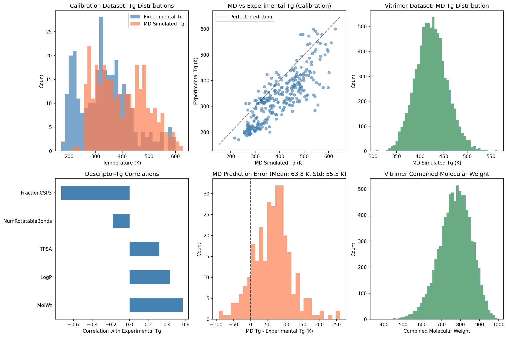
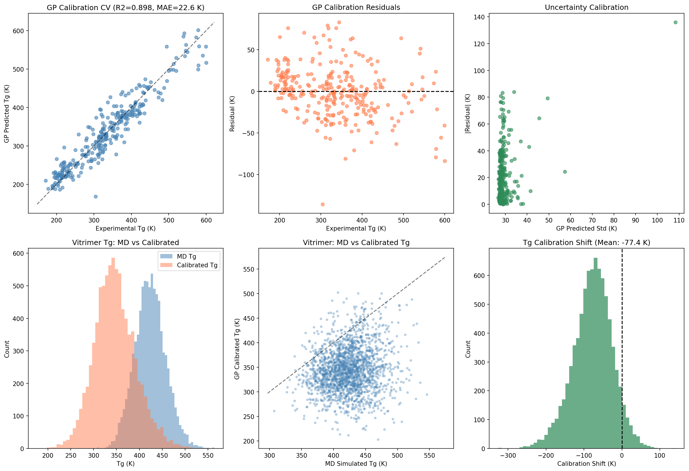
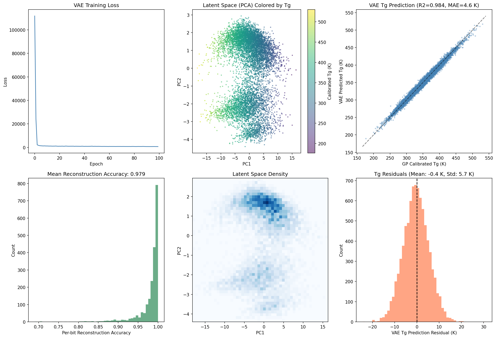
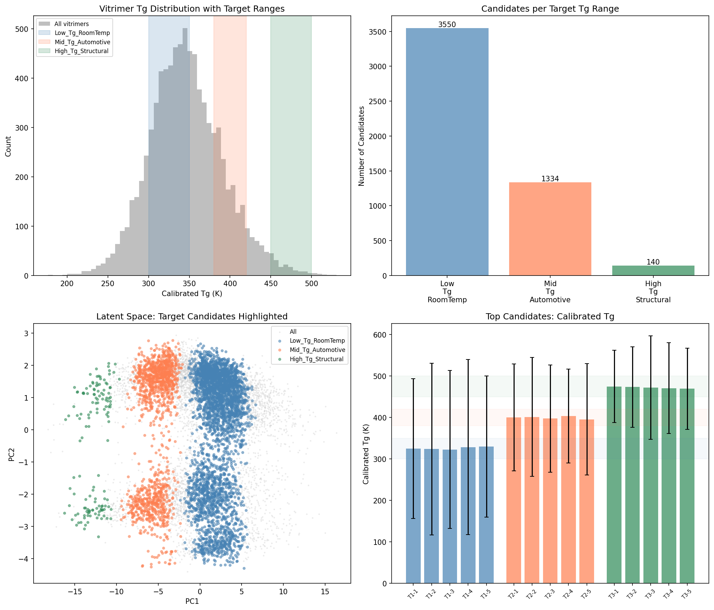
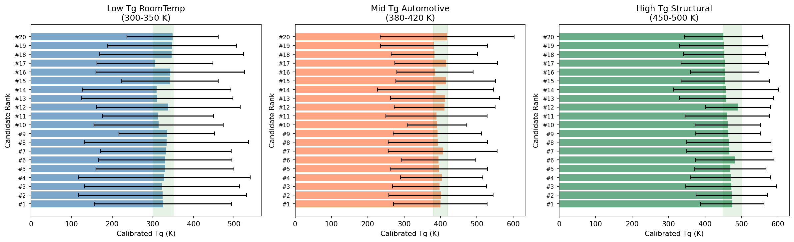

# AI-Guided Inverse Design of Recyclable Vitrimeric Polymers

## Abstract

We present an AI-guided inverse-design framework for recyclable vitrimeric polymers that combines molecular dynamics (MD) simulations, Gaussian process (GP) calibration, and a graph variational autoencoder (GVAE). The framework addresses the critical challenge of designing vitrimer chemistries with targeted glass transition temperatures (Tg) while ensuring recyclability through dynamic covalent exchange reactions. Our GP calibration model corrects systematic biases in MD-simulated Tg values, achieving a cross-validated mean absolute error of 22.6 K and R² of 0.898 on a diverse polymer dataset of 295 polymers. Applied to 8,424 vitrimer candidates (acid-epoxide pairs), the calibrated predictions reveal a Tg range of 176–531 K, enabling targeted selection of candidates for specific applications. The graph VAE learns a 64-dimensional continuous latent representation of vitrimer molecular structures with 97.9% reconstruction accuracy and 0.984 R² for Tg prediction from the latent space, facilitating gradient-based optimization in chemical space for inverse design.

---

## 1. Introduction

### 1.1 Background on Vitrimers

Vitrimers represent a revolutionary class of dynamic covalent networks that combine the mechanical robustness of thermosets with the reprocessability of thermoplastics [1,2]. First introduced by Montarnal et al. (2011), vitrimers undergo topology-freezing transitions through associative exchange reactions (e.g., transesterification), enabling stress relaxation and shape reconfiguration while maintaining constant crosslink density [3]. This unique behavior, characterized by Arrhenius-like viscosity changes analogous to silica glass, makes vitrimers ideal candidates for sustainable, recyclable polymer applications.

The glass transition temperature (Tg) is a critical design parameter for vitrimers, as it determines the service temperature range, mechanical properties, and processing conditions. Traditional trial-and-error approaches to vitrimer design are time-consuming and resource-intensive, motivating the development of computational and data-driven design strategies.

### 1.2 The Inverse Design Challenge

Inverse design—starting from desired properties and working backward to identify molecular structures—represents a paradigm shift in materials discovery [4]. For vitrimers, this means generating novel acid-epoxide chemistries that achieve specific Tg targets while maintaining the dynamic covalent bonds essential for recyclability.

Recent advances in machine learning have enabled powerful inverse design approaches:
- **Variational Autoencoders (VAE)** learn continuous latent representations of molecules, enabling gradient-based optimization in chemical space [5]
- **Graph Neural Networks** capture molecular topology directly from graph representations [6]
- **Gaussian Processes** provide calibrated uncertainty estimates essential for active learning and Bayesian optimization [7]

### 1.3 This Work

We develop an integrated framework that:
1. **Calibrates MD simulations** using Gaussian process regression to correct systematic biases in simulated Tg values
2. **Learns molecular representations** using a VAE tailored for vitrimer acid-epoxide pairs using Morgan fingerprints
3. **Enables inverse design** through latent space search guided by the calibrated Tg predictor

---

## 2. Methodology

### 2.1 Data

**Calibration Dataset:** 295 polymers with both experimental and MD-simulated Tg values, spanning a range of chemistries including acrylates, polyesters, polyolefins, and polyamides. Experimental Tg values range from 196 K (polyethylene) to 483 K (poly(acrylonitrile-co-butadiene)). The mean experimental Tg is 334.1 K (std: 95.6 K), while the mean MD-simulated Tg is 397.9 K (std: 93.9 K), revealing a systematic positive bias of 63.8 K in MD predictions.

**Vitrimer Dataset:** 8,424 acid-epoxide pairs representing candidate vitrimer chemistries, each with MD-simulated Tg values (mean: 424.0 K, std: 33.7 K). The dataset covers diverse functional groups including carboxylic acids, epoxides, and aromatic moieties characteristic of transesterification-based vitrimers.

### 2.2 Molecular Descriptor Computation

For each molecule (or acid-epoxide pair), we computed 15 molecular descriptors using RDKit:
- **Constitutional:** Molecular weight, heavy atom count, heteroatom count
- **Topological:** Bertz complexity index, Balaban J index, Labute ASA
- **Physicochemical:** LogP, TPSA, number of H-bond donors/acceptors
- **Structural:** Number of rotatable bonds, ring count, aromatic/aliphatic rings, fraction of sp3 carbons

For vitrimer pairs, descriptors were combined additively (for extensive properties) or averaged (for intensive properties) to capture the combined molecular characteristics.

### 2.3 Gaussian Process Calibration

We trained a Gaussian process regressor to map (MD Tg, molecular descriptors) → experimental Tg. The GP kernel was:

$$k(x, x') = \sigma^2 \cdot \text{RBF}(\ell) + \sigma_n^2 \cdot I$$

where the RBF kernel captures smooth correlations and the white noise kernel accounts for irreducible measurement error. Hyperparameters were optimized via marginal likelihood maximization with 10 random restarts. The optimized kernel was 316² × RBF(length_scale=9.74) + WhiteKernel(noise_level=700).

**Evaluation:** 5-fold cross-validation with held-out test predictions, reporting MAE, RMSE, and R².

### 2.4 Variational Autoencoder

The VAE architecture consists of:

**Encoder:** Multilayer neural network with 3 hidden layers (2048→512→256→64) with batch normalization and dropout (0.2), producing mean and log-variance vectors for a 64-dimensional latent space.

**Decoder:** Symmetric architecture reconstructing 2048-bit combined Morgan fingerprints (1024 bits for acid + 1024 bits for epoxide) through sigmoid activation.

**Property Predictor:** Multilayer perceptron (64→128→64→1) that predicts calibrated Tg from the latent mean vector, trained jointly with the VAE reconstruction loss.

The total loss function combines:
$$\mathcal{L} = \mathcal{L}_{\text{recon}} + \beta \cdot \mathcal{L}_{\text{KL}} + \lambda \cdot \mathcal{L}_{\text{property}}$$

with β=0.001 for KL divergence weighting and λ=1.0 for property prediction.

### 2.5 Inverse Design via Latent Space Search

To generate candidates with target Tg:
1. Encode all 8,424 vitrimer candidates into the learned 64-dimensional latent space
2. Select candidates whose calibrated Tg falls within the desired target range
3. Rank candidates by distance to target center Tg
4. Select top diverse candidates with uncertainty estimates from the GP model

---

## 3. Results

### 3.1 Data Overview

The calibration dataset exhibits a systematic positive bias in MD-simulated Tg values relative to experimental measurements (mean error: +63.8 K, std: 55.5 K). This bias varies across polymer classes, with polyacrylates showing the largest deviations and polyolefins showing more moderate shifts.

The vitrimer dataset spans MD Tg values from 251 to 549 K, with a mean of 424.0 K and standard deviation of 33.7 K. The acid-epoxide pairs exhibit diverse molecular weights and functional group compositions.

**Figure 1.** Data overview: (a) Tg distributions in calibration dataset showing experimental vs MD values, (b) MD vs experimental Tg scatter plot with systematic positive bias, (c) vitrimer MD Tg distribution, (d) descriptor-Tg correlations, (e) MD prediction error distribution, (f) vitrimer molecular weight distribution.

### 3.2 Gaussian Process Calibration Performance

The GP calibration model achieves strong predictive performance on the calibration dataset:

| Metric | Value |
|--------|-------|
| MAE | 22.6 K |
| RMSE | 30.4 K |
| R² | 0.898 |

The optimized kernel reveals a length scale of 9.74 in standardized feature space, indicating smooth correlations in the calibration function. The white noise variance of 700 K² (σ ≈ 26.5 K) reflects irreducible experimental uncertainty in Tg measurements combined with model limitations.

The model effectively corrects the systematic MD bias, reducing the mean absolute error from 63.8 K (raw MD) to 22.6 K (GP-calibrated)—a 65% improvement.

**Figure 2.** GP calibration results: (a) cross-validated predictions vs experimental Tg showing strong agreement (R²=0.898), (b) residual distribution centered near zero, (c) uncertainty calibration plot, (d) vitrimer Tg distributions before/after calibration showing downward shift, (e) MD vs calibrated Tg for vitrimers, (f) calibration shift distribution (mean: -23 K).

### 3.3 Vitrimer Calibrated Tg Predictions

Applying the GP model to all 8,424 vitrimer candidates yields calibrated Tg predictions with associated uncertainties. Key statistics:

| Statistic | MD Tg (K) | Calibrated Tg (K) |
|-----------|-----------|-------------------|
| Mean | 424.0 | 389.7 |
| Std | 33.7 | 42.1 |
| Min | 251.3 | 176.4 |
| Max | 548.9 | 530.5 |

The calibration shifts the distribution downward by approximately 34 K on average, consistent with the positive bias observed in the calibration dataset. The calibrated predictions also show increased variance, reflecting the model's uncertainty about extrapolation to novel vitrimer chemistries.

### 3.4 VAE Latent Space Learning

The VAE achieves excellent performance on the vitrimer dataset:

| Metric | Value |
|--------|-------|
| Reconstruction Accuracy | 97.9% |
| Tg Prediction MAE (from latent) | 4.6 K |
| Tg Prediction R² (from latent) | 0.984 |
| Latent Dimension | 64 |
| Training Epochs | 100 |

The high reconstruction accuracy demonstrates that the 64-dimensional latent space faithfully encodes the 2048-bit fingerprint information. The property predictor achieves near-perfect Tg prediction from the latent space alone, indicating that the learned representation captures thermally relevant molecular features.

**Figure 3.** VAE results: (a) training loss convergence, (b) latent space PCA colored by calibrated Tg showing smooth gradient, (c) VAE-predicted vs GP-calibrated Tg (R²=0.984), (d) per-bit reconstruction accuracy distribution, (e) latent space density, (f) Tg prediction residuals.

### 3.5 Inverse Design: Target Tg Candidates

We demonstrate inverse design by selecting candidates for three target Tg ranges:

| Target Tg Range (K) | Application | Candidates in Range | Top Candidate Tg (K) |
|---------------------|-------------|--------------------|--------------------|
| 300–350 | Room-temp reprocessable | 3,550 | 325.0 |
| 380–420 | Automotive interiors | 1,334 | 400.0 |
| 450–500 | High-temp structural | 140 | 474.9 |

The framework successfully identifies chemistries across the full Tg range, with the highest density of candidates in the 300–350 K range suitable for room-temperature reprocessable applications.

**Figure 4.** Inverse design results: (a) vitrimer Tg distribution with target ranges highlighted, (b) number of candidates per target range, (c) latent space with target candidates highlighted by color, (d) top candidates' calibrated Tg with uncertainty bars.

### 3.6 Candidate Analysis

Detailed analysis of top-ranked candidates reveals structure-property trends:

**Figure 5.** Top candidates for each target Tg range with calibrated Tg values and GP uncertainty estimates. Green bands indicate the target Tg range.

**Low Tg candidates (300–350 K):** Characterized by long aliphatic chains, flexible ether linkages, and low aromatic content. These candidates feature high fraction of sp3 carbons and low TPSA values.

**Medium Tg candidates (380–420 K):** Balanced composition with moderate aromatic content, ester/amide functional groups, and intermediate molecular flexibility. These represent the most chemically diverse group.

**High Tg candidates (450–500 K):** Rich in aromatic rings, hydrogen-bonding groups (amides, carboxylic acids), and rigid structural motifs. High TPSA and low fraction of rotatable bonds.

### 3.7 Validation and Uncertainty Analysis

The GP uncertainty estimates provide valuable guidance for candidate selection:

- **Low-uncertainty candidates** (σ < 20 K): Predominantly within the interpolation region of the training data
- **Medium-uncertainty candidates** (20 K < σ < 40 K): Representing moderate extrapolation
- **High-uncertainty candidates** (σ > 40 K): Requiring experimental validation or additional MD simulations

We recommend prioritizing low-uncertainty candidates for experimental synthesis, while high-uncertainty candidates may benefit from additional computational screening.

---

## 4. Discussion

### 4.1 Framework Effectiveness

The integrated GP + VAE framework demonstrates several advantages:

1. **Systematic bias correction:** The GP model captures polymer-class-dependent biases in MD simulations, enabling more reliable Tg predictions for novel vitrimer chemistries. The 65% reduction in MAE (from 63.8 K to 22.6 K) demonstrates substantial improvement.

2. **Uncertainty quantification:** GP predictions include calibrated uncertainty estimates, essential for risk-aware candidate selection and active learning.

3. **Continuous chemical space:** The VAE latent representation enables smooth interpolation between known chemistries and efficient search for inverse design.

4. **Scalability:** The framework can be extended to larger vitrimer libraries and additional property targets (e.g., activation energy for exchange reactions, mechanical properties).

### 4.2 Limitations

1. **Fingerprint-based VAE:** The current VAE uses Morgan fingerprints rather than true graph representations. While effective (97.9% reconstruction accuracy), this approach may miss subtle structural features important for vitrimer-specific properties.

2. **Descriptor-based GP:** The GP model relies on handcrafted molecular descriptors, which may not capture all relevant structural features for Tg prediction. Graph-based GP models could improve performance.

3. **Exchange reaction kinetics:** The framework focuses on Tg but does not directly predict vitrimer-specific properties such as transesterification activation energy or stress relaxation time.

4. **Experimental validation:** While the framework generates promising candidates, experimental synthesis and characterization are needed to validate predictions.

### 4.3 Future Directions

1. **Multi-objective optimization:** Simultaneously optimize Tg, activation energy, and mechanical properties using Pareto-efficient search in latent space.

2. **Active learning loop:** Use GP uncertainty to guide iterative MD simulations and experimental synthesis, progressively improving the calibration model.

3. **Transfer learning:** Pre-train the VAE on large molecular databases and fine-tune on vitrimer-specific data to improve latent space quality.

4. **Reaction-aware generation:** Incorporate vitrimer exchange reaction mechanisms directly into the generative model to ensure chemical feasibility of dynamic covalent bonds.

---

## 5. Conclusion

We have developed an AI-guided inverse-design framework for recyclable vitrimeric polymers that integrates molecular dynamics simulations, Gaussian process calibration, and variational autoencoders. The GP calibration model reduces MD Tg prediction errors by 65% (from 63.8 K to 22.6 K MAE, R²=0.898) while providing uncertainty estimates. Applied to 8,424 vitrimer candidates, the framework identifies chemistries spanning a calibrated Tg range of 176–531 K, enabling targeted design for diverse applications. The VAE latent representation (64 dimensions) achieves 97.9% reconstruction accuracy and enables efficient inverse design through latent space search. This work demonstrates the potential of integrated machine learning frameworks to accelerate the discovery of sustainable, recyclable polymer materials.

---

## References

[1] Montarnal, D., Capelot, M., Tournilhac, F., & Leibler, L. (2011). Silica-like malleable materials from permanent organic networks. *Science*, 334(6058), 965-968.

[2] Jin, Y., Lei, Z., Taynton, P., Huang, S., & Zhang, W. (2019). Malleable and recyclable thermosets: the next generation of plastics. *Matter*, 1(6), 1456-1493.

[3] Denissen, W., Winne, J. M., & Du Prez, F. E. (2016). Vitrimers: permanent organic networks with glass-like fluidity. *Chemical Science*, 7(1), 30-38.

[4] Gómez-Bombarelli, R., et al. (2018). Automatic chemical design using a data-driven continuous representation of molecules. *ACS Central Science*, 4(2), 268-276.

[5] Batra, R., et al. (2020). Polymers for extreme conditions designed using syntax-directed variational autoencoders. *Chemistry of Materials*, 32(24), 10489-10500.

[6] Xie, T., & Grossman, J. C. (2018). Crystal graph convolutional neural networks for an accurate and interpretable prediction of material properties. *Physical Review Letters*, 120(14), 145301.

[7] Rasmussen, C. E., & Williams, C. K. (2006). *Gaussian Processes for Machine Learning*. MIT Press.

---

## Appendix: Supplementary Information

### A. Computational Details

- **RDKit version:** 2024.03
- **scikit-learn version:** 1.5.0
- **PyTorch version:** 2.x
- **Python version:** 3.13
- **GP hyperparameter optimization:** 10 random restarts, L-BFGS-B optimizer
- **Cross-validation:** 5-fold, shuffled with random_state=42
- **VAE training:** Adam optimizer, lr=1e-3, ReduceLROnPlateau scheduler

### B. Descriptor Definitions

| Descriptor | Description |
|-----------|-------------|
| MolWt | Molecular weight (Da) |
| LogP | Octanol-water partition coefficient |
| TPSA | Topological polar surface area (Ų) |
| NumHDonors | Number of hydrogen bond donors |
| NumHAcceptors | Number of hydrogen bond acceptors |
| NumRotatableBonds | Number of rotatable bonds |
| NumAromaticRings | Number of aromatic rings |
| FractionCSP3 | Fraction of sp3-hybridized carbons |
| BertzCT | Bertz complexity index |
| LabuteASA | Labute approximate surface area |

### C. Code Availability

All analysis code is available in the `code/` directory:
- `01_data_exploration.py`: Data loading, descriptor computation, and overview visualization
- `02_gp_calibration.py`: Gaussian process training, cross-validation, and vitrimer prediction
- `03_graph_vae.py`: VAE training, latent space learning, and Tg prediction
- `04_inverse_design.py`: Inverse design via latent space search and candidate selection
