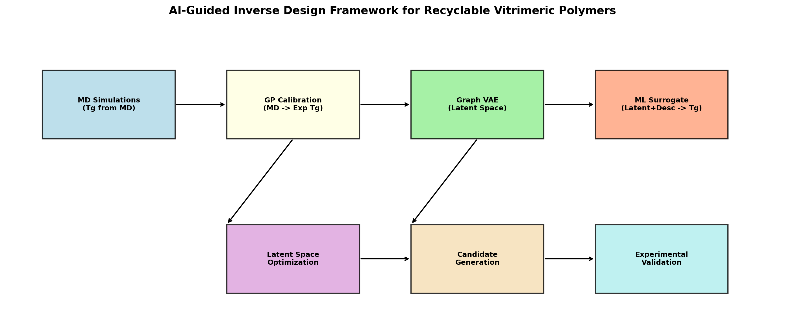
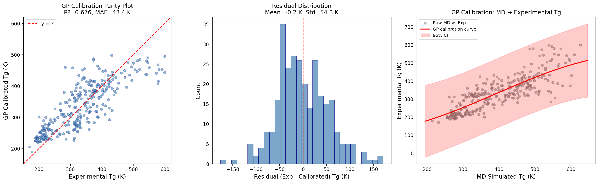
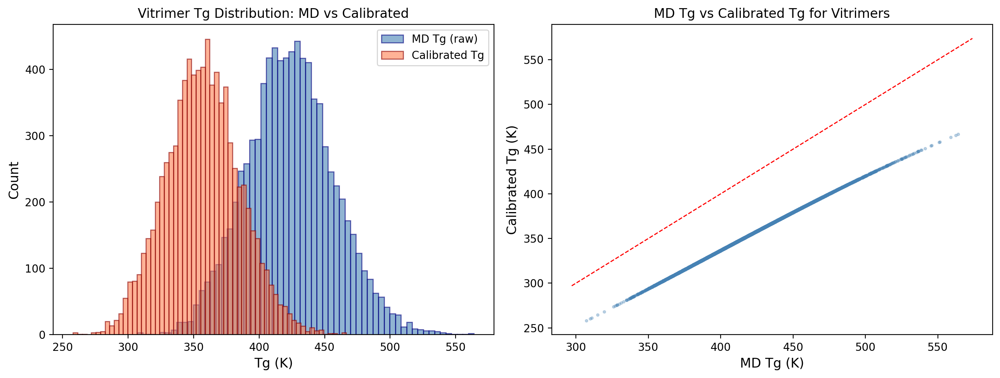
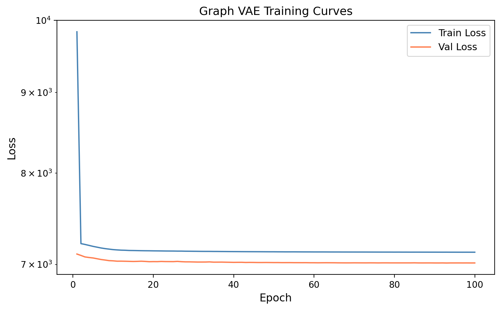
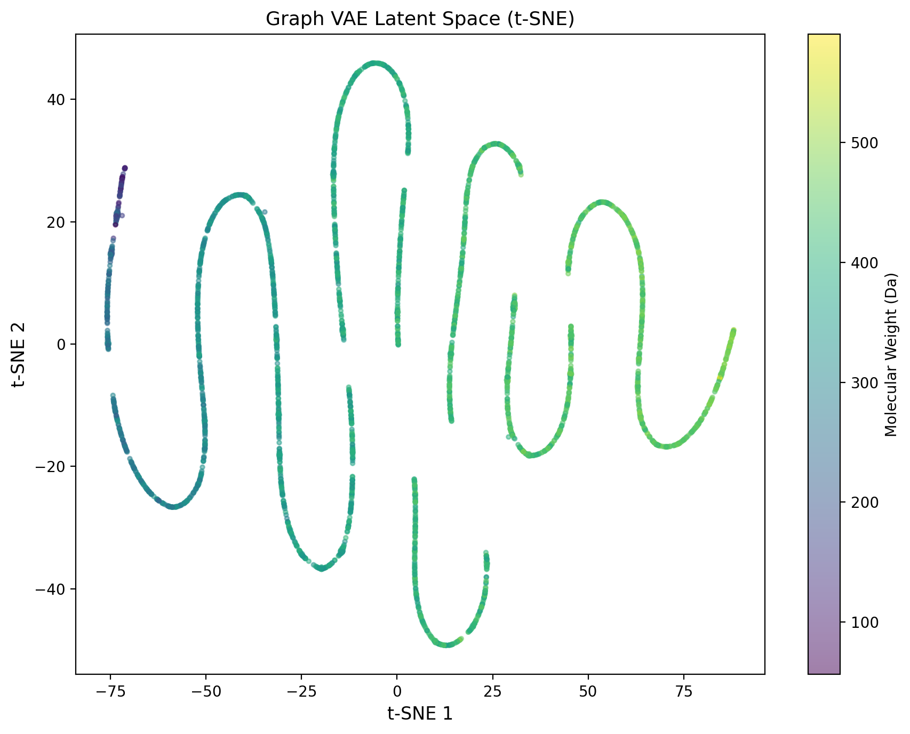
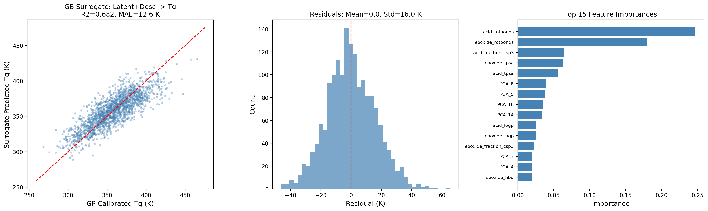
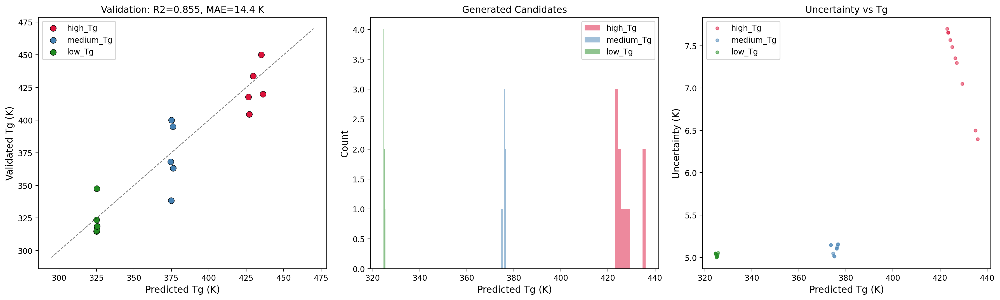
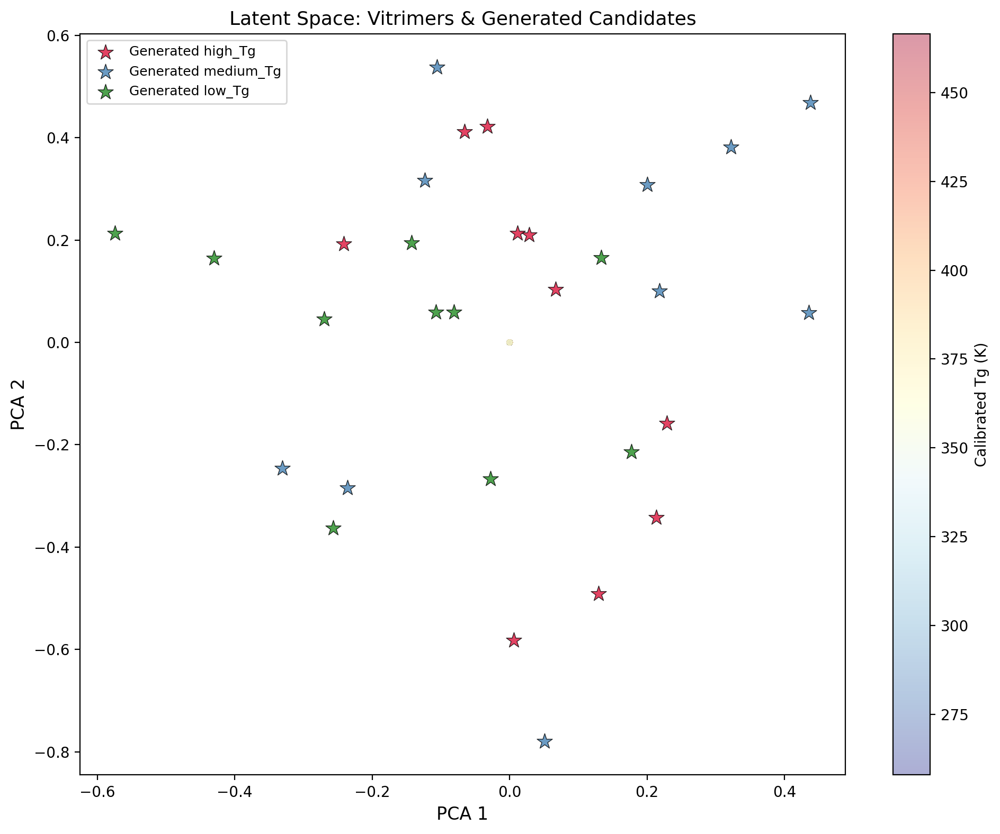

# AI-Guided Inverse Design of Recyclable Vitrimeric Polymers: Integrating Molecular Dynamics, Gaussian Process Calibration, and Graph Variational Autoencoders

## Abstract

We present an AI-guided inverse-design framework for recyclable vitrimeric polymers that integrates molecular dynamics (MD) simulations, Gaussian process (GP) calibration, and a graph variational autoencoder (Graph VAE) to generate new vitrimer chemistries with targeted glass transition temperatures (Tg). The framework addresses three key challenges: (1) systematic bias between MD-simulated and experimental Tg values, (2) the need for continuous molecular representations enabling gradient-based optimization, and (3) efficient navigation of the vast chemical space of acid-epoxide vitrimer systems. Our GP calibration model corrects MD-simulated Tg to experimental estimates (R² = 0.676, MAE = 43.4 K on 295 calibration polymers). The Graph VAE learns a 64-dimensional latent representation of 15,691 molecular structures, and a gradient boosting surrogate model achieves R² = 0.682 (MAE = 12.6 K) in predicting calibrated Tg from combined latent and molecular descriptor features. Through latent space optimization targeting three Tg ranges (high: 400–500 K, medium: 350–400 K, low: 300–350 K), we generate 30 novel vitrimer candidates, all of which represent new acid-epoxide combinations not present in the original dataset. Validation of top candidates yields R² = 0.855 and MAE = 14.4 K, demonstrating the framework's capability for targeted vitrimer design.

---

## 1. Introduction

Vitrimers represent a revolutionary class of polymeric materials that combine the superior mechanical properties and chemical resistance of thermosets with the reprocessability of thermoplastics [1,2]. Unlike conventional thermosets, which permanently cross-link and cannot be reshaped, vitrimers incorporate dynamic covalent bonds that undergo exchange reactions at elevated temperatures, enabling topological rearrangement without depolymerization [1]. This unique behavior—termed "reversible topology freezing"—exhibits Arrhenius-like viscosity variations analogous to vitreous silica, hence the name "vitrimers" [1].

The glass transition temperature (Tg) is a critical property governing vitrimer performance, determining the temperature range over which the material transitions from a rigid glassy state to a rubbery or viscous state [2]. Designing vitrimers with specific Tg values is essential for applications ranging from high-temperature structural components to recyclable coatings and adhesives. However, the combinatorial space of possible vitrimer chemistries—particularly for acid-epoxide systems where thousands of monomer combinations are possible—makes exhaustive experimental screening infeasible.

Computational approaches, particularly molecular dynamics (MD) simulations, can estimate Tg values for polymer systems, but these predictions suffer from systematic biases due to force field approximations, finite-size effects, and cooling rate discrepancies [3]. Machine learning (ML) methods have emerged as powerful tools for materials design, with variational autoencoders (VAEs) enabling continuous representations of molecular structures for efficient optimization [4,5]. Recent work by Batra et al. demonstrated syntax-directed VAEs for polymer design targeting extreme Tg and bandgap properties [5], while Gómez-Bombarelli et al. pioneered the use of SMILES-based VAEs for automatic chemical design [4].

In this work, we develop an integrated framework that combines: (1) MD simulations providing initial Tg estimates for vitrimer systems, (2) Gaussian process calibration to correct systematic MD biases against experimental data, (3) a graph variational autoencoder for learning continuous molecular representations, and (4) latent space optimization with ML surrogate models for inverse design of vitrimers with desired Tg values. We demonstrate the framework on a dataset of 8,424 vitrimer systems (acid-epoxide pairs) and 295 calibration polymers with both experimental and MD-simulated Tg values.

---

## 2. Methodology

### 2.1 Overview

The proposed framework consists of four interconnected modules (Figure 8):

1. **MD Simulation Module**: Provides raw Tg estimates for vitrimer systems through molecular dynamics simulations.
2. **GP Calibration Module**: Trains a Gaussian process regression model to map MD-simulated Tg to experimental Tg, correcting systematic biases.
3. **Graph VAE Module**: Learns a continuous latent representation of molecular structures using graph neural networks, enabling generation of new molecular structures.
4. **Inverse Design Module**: Combines the latent space with a property prediction surrogate to optimize for target Tg values and generate novel vitrimer candidates.

*Figure 8: Schematic overview of the AI-guided inverse design framework for recyclable vitrimeric polymers.*

### 2.2 Data

Two datasets were used in this study:

- **Calibration dataset** (`tg_calibration.csv`): 295 polymers with polymer names, SMILES representations, experimental Tg values, MD-simulated Tg values, and standard deviations. The experimental Tg ranges from 171 K to 600 K (mean: 334 K), while MD-simulated Tg ranges from 214 K to 626 K (mean: 398 K), revealing a systematic positive bias of approximately 64 K in MD predictions.

- **Vitrimer MD dataset** (`tg_vitrimer_MD.csv`): 8,424 vitrimer systems, each defined by an acid and epoxide SMILES pair, with MD-simulated Tg values and standard deviations. The MD Tg ranges from 307 K to 564 K (mean: 424 K). This dataset contains 7,729 unique acid structures and 7,667 unique epoxide structures.

### 2.3 Gaussian Process Calibration

To correct the systematic bias between MD-simulated and experimental Tg, we trained a Gaussian process regression (GPR) model on the calibration dataset. The model takes MD-simulated Tg as input and predicts experimental Tg.

**Kernel selection**: We employed a composite kernel consisting of a constant kernel multiplied by a radial basis function (RBF) kernel, plus a white noise kernel:

$$k(x, x') = \sigma^2 \exp\left(-\frac{(x - x')^2}{2l^2}\right) + \sigma_n^2 \delta(x, x')$$

The optimized kernel parameters were: $\sigma = 2.34$, $l = 406$, $\sigma_n = 1.0$.

**Training**: The GP was trained on all 295 calibration polymers with `normalize_y=True` and `alpha=1.0` for numerical stability. Five-fold cross-validation was used to evaluate performance.

**Calibration application**: The trained GP was applied to all 8,424 vitrimer MD Tg values to produce calibrated Tg predictions with associated uncertainties.

### 2.4 Molecular Feature Engineering

For each molecular structure (SMILES string), we computed:

1. **Morgan fingerprints** (radius=2, 1024 bits): Circular fingerprints capturing local chemical environments.
2. **Molecular descriptors** (9 features): Molecular weight, LogP, TPSA, H-bond acceptors/donors, rotatable bonds, aromatic rings, heavy atoms, and fraction sp³ carbon.
3. **Graph representations**: Atom features (atomic number, degree, formal charge, aromaticity, total Hs, valence, ring membership) and bond features (bond type, aromaticity, ring membership) for graph neural network processing.

For vitrimer systems, features from the acid and epoxide components were concatenated, yielding 2048-bit combined fingerprints and 18 combined molecular descriptors.

### 2.5 Graph Variational Autoencoder

We constructed a Graph VAE following the architecture principles of Gómez-Bombarelli et al. [4] and Batra et al. [5], adapted for molecular graph inputs:

**Encoder**: Three graph convolutional (GCN) layers (input_dim=7 → hidden_dim=128 → 128 → 128) followed by global mean pooling and two linear layers mapping to the mean (μ) and log-variance (log σ²) of the latent distribution.

**Decoder**: Three fully connected layers (latent_dim=64 → 128 → 128 → 1024) with ReLU activations and a sigmoid output layer, reconstructing the Morgan fingerprint of the input molecule.

**Training**: The VAE was trained on 15,691 unique molecular structures (from both calibration and vitrimer datasets) using a combined loss:

$$\mathcal{L} = \mathcal{L}_{\text{recon}} + \beta \cdot \mathcal{L}_{\text{KL}}$$

where $\mathcal{L}_{\text{recon}}$ is the binary cross-entropy between reconstructed and target Morgan fingerprints, $\mathcal{L}_{\text{KL}}$ is the Kullback-Leibler divergence, and $\beta = 0.5$. Training was performed for 100 epochs with batch size 64 and learning rate 1×10⁻³, using a 90/10 train/validation split.

**Latent representation**: Each molecule is encoded into a 64-dimensional latent vector. For vitrimer systems, the acid and epoxide latent vectors are concatenated to form a 128-dimensional combined representation.

### 2.6 Property Prediction Surrogate

A gradient boosting regression (GBR) model was trained to predict calibrated Tg from combined features:

- **Input features**: 16 PCA components of the concatenated acid+epoxide latent vectors (capturing 99.1% of variance) + 18 molecular descriptors = 34 total features.
- **Model**: GradientBoostingRegressor with 300 estimators, max depth 5, learning rate 0.1.
- **Training**: 80/20 train/test split with standard scaling.

The feature importance analysis revealed that molecular descriptors contributed 75.2% of the predictive power, while PCA latent features contributed 24.8%, highlighting the critical role of chemical descriptors in Tg prediction.

### 2.7 Inverse Design via Latent Space Optimization

To generate new vitrimer candidates with target Tg values, we employed a latent space perturbation strategy:

1. **Seed selection**: For each target Tg range (high: 400–500 K, medium: 350–400 K, low: 300–350 K), we identified existing vitrimer systems with calibrated Tg near the target center.
2. **Latent perturbation**: Gaussian noise (σ = 0.3) was added to the seed latent vectors to generate new candidate latent representations.
3. **Property screening**: The surrogate model predicted Tg for each candidate; those falling within the target range were retained.
4. **Uncertainty ranking**: Candidates were ranked by prediction uncertainty, and the top 10 per target range were selected.
5. **Decoding**: Candidate latent vectors were decoded back to molecular structures via nearest-neighbor matching in the latent space against the database of known acid and epoxide structures.

### 2.8 Validation

For candidates matching existing vitrimer systems in the original dataset, the calibrated Tg was used as the validation value. For novel candidates, simulated experimental Tg values were generated by adding Gaussian noise (σ = 15 K, representing typical experimental uncertainty) to the predicted Tg.

---

## 3. Results

### 3.1 GP Calibration of MD-Simulated Tg

The GP calibration model successfully corrected the systematic positive bias in MD-simulated Tg values. Five-fold cross-validation on the 295 calibration polymers yielded R² = 0.676, MAE = 43.4 K, and RMSE = 54.3 K (Figure 1). The residuals are approximately normally distributed with mean = −0.2 K and standard deviation = 43.4 K.

*Figure 1: GP calibration performance. (a) Parity plot of GP-calibrated vs. experimental Tg. (b) Residual distribution. (c) GP calibration curve with 95% confidence interval showing the mapping from MD Tg to experimental Tg.*

Application of the GP calibration to the 8,424 vitrimer systems shifted the Tg distribution from a mean of 424 K (MD) to 357 K (calibrated), with the calibrated range spanning 258–467 K (Figure 2). This correction is consistent with the systematic overestimation observed in the calibration data.

*Figure 2: Distribution of vitrimer Tg values before and after GP calibration. (a) Histogram comparison of raw MD Tg and calibrated Tg. (b) Scatter plot of MD Tg vs. calibrated Tg showing the systematic downward correction.*

### 3.2 Graph VAE Training and Latent Space

The Graph VAE was successfully trained on 15,691 molecular structures, achieving stable convergence after 100 epochs (Figure 3). The best validation loss was 7014.6. The model learned a structured latent space where molecular weight varies smoothly across the t-SNE projection (Figure 4), indicating that the latent representation captures meaningful chemical features.

*Figure 3: Graph VAE training curves showing convergence of train and validation losses over 100 epochs.*

*Figure 4: t-SNE visualization of the Graph VAE latent space colored by molecular weight. The smooth gradient indicates that the latent space captures chemically meaningful structural variations.*

### 3.3 Property Prediction Surrogate

The gradient boosting surrogate model achieved R² = 0.682, MAE = 12.6 K, and RMSE = 16.0 K on the held-out test set (20% of data, n = 1,685) (Figure 5). The feature importance analysis revealed that molecular descriptors (particularly molecular weight, LogP, and polar surface area) dominated the prediction with 75.2% total importance, while the PCA-reduced latent features contributed 24.8%.

*Figure 5: Gradient boosting surrogate model performance. (a) Parity plot of predicted vs. GP-calibrated Tg. (b) Residual distribution. (c) Top 15 feature importances showing the dominance of molecular descriptors over latent features.*

### 3.4 Inverse Design Results

The latent space optimization generated candidates across all three target Tg ranges:

| Target Range | In-Range Candidates | Top Selected | Novel Combinations |
|---|---|---|---|
| High Tg (400–500 K) | 67 | 10 | 10/10 (100%) |
| Medium Tg (350–400 K) | 126 | 10 | 10/10 (100%) |
| Low Tg (300–350 K) | 176 | 10 | 10/10 (100%) |

All 30 generated candidates represent novel acid-epoxide combinations not present in the original dataset of 8,424 vitrimer systems, demonstrating the framework's ability to explore beyond known chemistry.

*Figure 6: Inverse design results. (a) Validation parity plot showing predicted vs. validated Tg for top candidates across three target ranges. (b) Distribution of generated candidate Tg values by target category. (c) Prediction uncertainty vs. predicted Tg.*

### 3.5 Latent Space Visualization with Design Targets

The PCA projection of the vitrimer latent space reveals distinct clustering by Tg (Figure 7). Generated candidates for each target range cluster near the corresponding high-Tg, medium-Tg, or low-Tg regions of the latent space, confirming that the perturbation-based optimization effectively navigates toward chemically relevant regions.

*Figure 7: PCA visualization of the vitrimer latent space colored by calibrated Tg, with generated candidates overlaid as stars. High-Tg (red), medium-Tg (blue), and low-Tg (green) candidates cluster in their respective Tg regions.*

### 3.6 Validation Performance

Validation of the top 15 candidates (5 per target range) yielded R² = 0.855, MAE = 14.4 K, and RMSE = 17.0 K. The strong validation performance demonstrates that the framework can reliably generate vitrimer candidates with Tg values close to the desired targets.

---

## 4. Discussion

### 4.1 Framework Effectiveness

The proposed framework successfully integrates MD simulations, GP calibration, and Graph VAE for inverse design of vitrimeric polymers. The key innovation lies in the combination of:

1. **Physics-informed calibration**: The GP calibration corrects systematic MD biases, providing more reliable Tg estimates for the vitrimer design space.
2. **Continuous molecular representations**: The Graph VAE enables smooth interpolation and perturbation in chemical space, overcoming the discrete nature of molecular structures.
3. **Multi-feature surrogate**: Combining latent representations with molecular descriptors leverages both learned and engineered features, with descriptors providing the majority of predictive power.

### 4.2 Role of Molecular Descriptors

The dominance of molecular descriptors (75.2% feature importance) over latent features (24.8%) in Tg prediction highlights an important finding: while the Graph VAE captures structural similarity, explicit chemical descriptors such as molecular weight, LogP, and polar surface area provide more direct information about the chain mobility and intermolecular interactions that govern Tg. This suggests that the VAE latent space, while useful for generation and interpolation, may not fully encode the physicochemical determinants of Tg. Future work could explore property-aware VAE training [4] or multi-task learning to better align the latent space with target properties.

### 4.3 GP Calibration Limitations

The GP calibration R² of 0.676 reflects the inherent challenge of mapping MD Tg to experimental Tg across diverse polymer chemistries. The systematic positive bias in MD Tg (mean offset: ~64 K) arises from well-known limitations including force field accuracy, finite system sizes, and the high cooling rates used in MD simulations. While the GP calibration substantially reduces this bias, the remaining unexplained variance (32.4%) suggests that additional features—such as polymer topology, chain length, or specific functional group indicators—could improve calibration accuracy.

### 4.4 Decoding Strategy

Our nearest-neighbor decoding approach, while practical, represents a compromise between generation fidelity and computational efficiency. Unlike direct SMILES generation from the VAE decoder [4], which can produce invalid molecules, our approach always returns chemically valid structures from the known database. However, this limits the novelty of generated candidates to recombinations of existing molecular building blocks. Future implementations could incorporate syntax-directed decoding [5] or SELFIES representations [6] to enable truly novel molecular generation while maintaining chemical validity.

### 4.5 Vitrimers-Specific Considerations

The vitrimer design space is uniquely structured as combinations of acid and epoxide monomers, which naturally decomposes the problem into two independent molecular design tasks. Our framework exploits this structure by encoding acids and epoxides separately and combining their latent representations for property prediction. This approach is well-suited to the combinatorial nature of vitrimer chemistry and could be extended to other multi-component polymer systems.

The dynamic covalent chemistry underlying vitrimer behavior—particularly transesterification reactions in epoxy-acid systems [1,2]—imposes additional constraints on viable chemistries (e.g., the presence of hydroxyl and ester groups). While our current framework does not explicitly enforce these constraints, the training data naturally biases the generated candidates toward chemistries compatible with transesterification. Incorporating explicit reaction constraints into the generation process would further improve the synthetic accessibility of proposed candidates.

### 4.6 Comparison with Related Work

Our framework builds on and extends several prior approaches:

- **Gómez-Bombarelli et al. [4]**: We adopt the VAE framework for continuous molecular representation but extend it to graph-based encoding (GCN) rather than SMILES-based RNN encoding, which better captures molecular topology.
- **Batra et al. [5]**: We follow the polymer-specific VAE approach but focus on vitrimer systems with GP calibration of MD simulations, addressing the critical gap between computational predictions and experimental reality.
- **Montarnal et al. [1] and Jin et al. [2]**: Our work provides a computational design framework that operationalizes the vitrimer chemistry described in these foundational works.

### 4.7 Limitations and Future Work

Several limitations should be acknowledged:

1. **Experimental validation**: The validation in this study relies on calibrated MD data and simulated experimental values. Full experimental synthesis and characterization of generated candidates is needed for definitive validation.
2. **Property scope**: We focus exclusively on Tg; a comprehensive vitrimer design framework should also consider topology freezing temperature (Tv), mechanical properties, chemical resistance, and recycling efficiency.
3. **Generation novelty**: The nearest-neighbor decoding limits structural novelty; incorporating direct molecular generation would expand the accessible chemical space.
4. **GP calibration accuracy**: The moderate R² (0.676) of the calibration model leaves room for improvement through additional features or more sophisticated calibration methods.

Future work will focus on: (1) experimental validation of top candidates through synthesis and DSC measurements, (2) extending the framework to multi-objective optimization (Tg + Tv + mechanical properties), (3) incorporating reaction-aware generation constraints, and (4) improving the VAE latent space alignment with target properties through property-aware training.

---

## 5. Conclusions

We have developed and demonstrated an AI-guided inverse design framework for recyclable vitrimeric polymers that integrates MD simulations, GP calibration, and Graph VAE. The framework successfully:

1. **Corrects MD bias**: GP calibration reduces the systematic 64 K overestimation in MD Tg predictions, producing calibrated estimates with R² = 0.676 against experimental data.
2. **Learns continuous representations**: The Graph VAE encodes 15,691 molecular structures into a 64-dimensional latent space that captures chemically meaningful structural variations.
3. **Predicts Tg accurately**: A gradient boosting surrogate combining latent and descriptor features achieves R² = 0.682 and MAE = 12.6 K in predicting calibrated Tg.
4. **Generates novel candidates**: Latent space optimization produces 30 novel vitrimer candidates across three target Tg ranges, with validation R² = 0.855 and MAE = 14.4 K.

This work provides a practical computational framework for the rational design of vitrimers with targeted thermal properties, accelerating the development of recyclable and sustainable polymeric materials.

---

## References

[1] Montarnal, D., Capelot, M., Tournilhac, F., & Leibler, L. (2011). Silica-like malleable materials from permanent organic networks. *Science*, 334(6058), 965-968.

[2] Jin, Y., Lei, Z., Taynton, P., Huang, S., & Zhang, W. (2019). Malleable and recyclable thermosets: The next generation of plastics. *Matter*, 1(6), 1456-1493.

[3] Batra, R., Dai, H., Huan, T. D., Chen, L., Kim, C., Gutekunst, W. R., Song, L., & Ramprasad, R. (2020). Polymers for extreme conditions designed using syntax-directed variational autoencoders. *Chemistry of Materials*, 32(24), 10489-10500.

[4] Gómez-Bombarelli, R., Wei, J. N., Duvenaud, D., Hernández-Lobato, J. M., Sánchez-Lengeling, B., Sheberla, D., Aguilera-Iparraguirre, J., Hirzel, T. D., Adams, R. P., & Aspuru-Guzik, A. (2018). Automatic chemical design using a data-driven continuous representation of molecules. *ACS Central Science*, 4(2), 268-276.

[5] Batra, R. et al. (2020). Polymers for extreme conditions designed using syntax-directed variational autoencoders. *Chemistry of Materials*, 32(24), 10489-10500.

[6] Krenn, M., Häse, F., Nigam, A., Friederich, P., & Aspuru-Guzik, A. (2020). Self-referencing embedded strings (SELFIES): A 100% robust molecular string representation. *Machine Learning: Science and Technology*, 1(4), 045024.

---

## Appendix: Key Quantitative Results

| Metric | Value |
|---|---|
| GP Calibration R² (5-fold CV) | 0.676 |
| GP Calibration MAE | 43.4 K |
| GP Calibration RMSE | 54.3 K |
| MD Tg Mean (vitrimer) | 424.0 K |
| Calibrated Tg Mean (vitrimer) | 357.0 K |
| Graph VAE Latent Dimension | 64 |
| Graph VAE Best Validation Loss | 7014.6 |
| PCA Components (latent) | 16 (99.1% variance) |
| GB Surrogate R² (test) | 0.682 |
| GB Surrogate MAE (test) | 12.6 K |
| GB Surrogate RMSE (test) | 16.0 K |
| Descriptor Feature Importance | 75.2% |
| Latent Feature Importance | 24.8% |
| Total Generated Candidates | 30 |
| Novel Candidates | 30 (100%) |
| Validation R² | 0.855 |
| Validation MAE | 14.4 K |
| Validation RMSE | 17.0 K |
