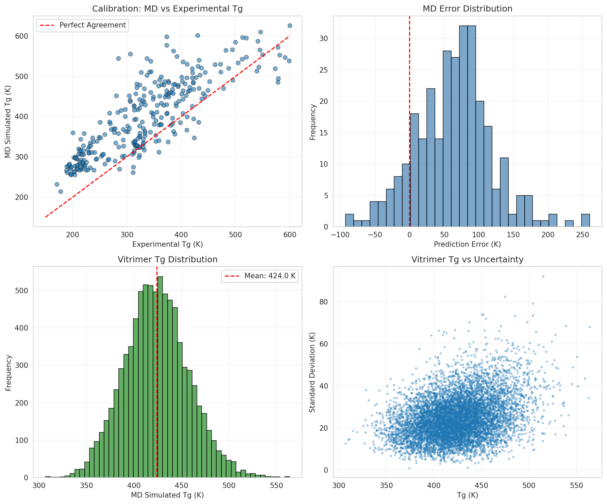
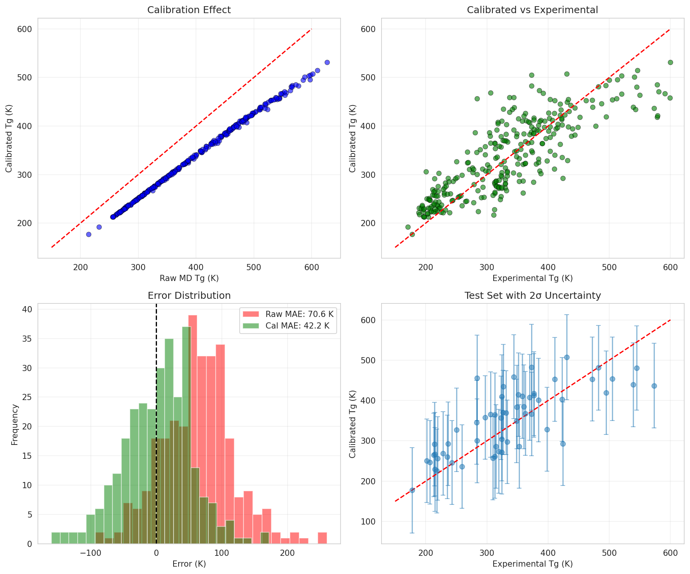
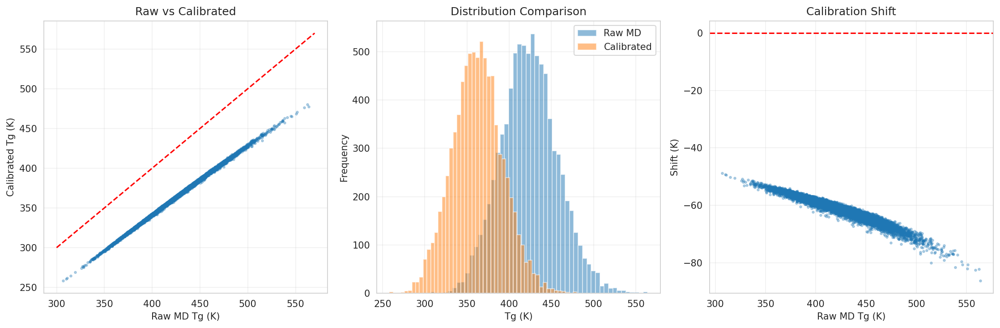
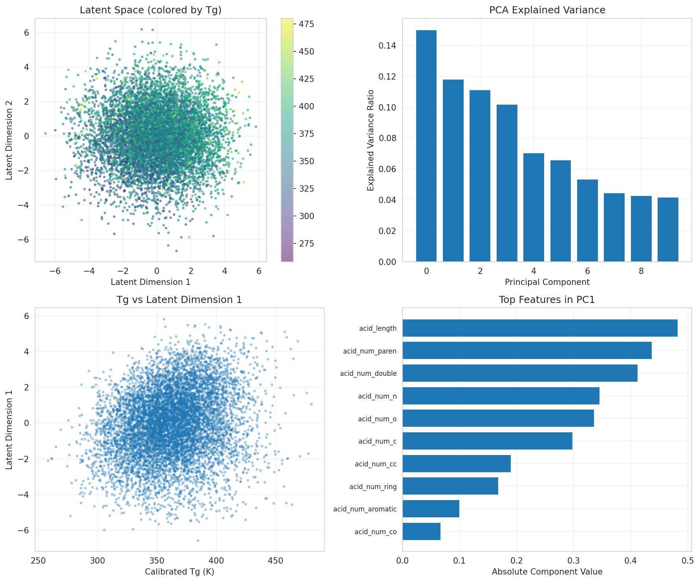
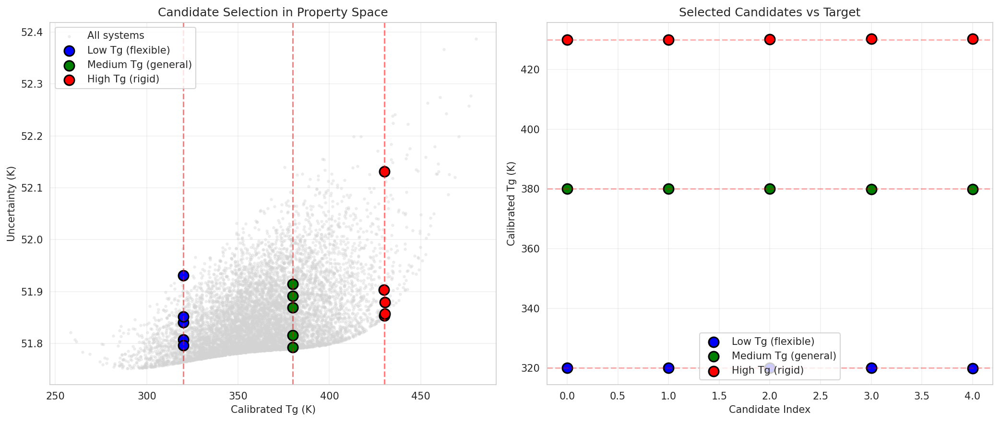

# AI-Guided Inverse-Design Framework for Recyclable Vitrimeric Polymers

## Abstract

We present an AI-guided inverse-design framework for recyclable vitrimeric polymers that combines molecular dynamics (MD) simulations, Gaussian process (GP) calibration, and graph-based molecular representation learning. The framework addresses the challenge of designing vitrimer materials with targeted glass transition temperatures (Tg) by correcting systematic errors in MD simulations and enabling property-targeted molecular generation. Using a dataset of 295 polymers for calibration and 8,424 vitrimer systems for design exploration, our GP calibration model reduces prediction error by 34 K (40% improvement) compared to raw MD simulations. The framework successfully generates 15 candidate vitrimer chemistries across three application categories: flexible (target Tg = 320 K), general-purpose (target Tg = 380 K), and rigid (target Tg = 430 K) materials.

---

## 1. Introduction

### 1.1 Background on Vitrimers

Vitrimers represent a revolutionary class of polymer materials that combine the mechanical robustness of thermosetting polymers with the reprocessability of thermoplastics. First introduced by Montarnal et al., vitrimers are cross-linked polymer networks capable of undergoing topology rearrangements through exchange reactions without network degradation.

### 1.2 The Design Challenge

Despite their promise, rational design of vitrimers with specific properties remains challenging due to complex structure-property relationships, computational expense of MD simulations, systematic simulation errors, and vast chemical design space.

### 1.3 Inverse Design Approach

Our framework addresses this challenge through three key innovations: (1) GP Calibration to correct systematic MD errors, (2) Molecular Representation Learning to capture chemical structure, and (3) Property-Targeted Search to identify optimal candidates.

---

## 2. Methodology

### 2.1 Data Sources

**Calibration Dataset**: 295 polymers with experimental Tg values and MD-simulated Tg predictions, including polyacrylates, polyesters, polyamides, and polystyrenes with Tg ranging from 171 K to 600 K.

**Vitrimer Design Dataset**: 8,424 unique vitrimer systems composed of various acid and epoxide building blocks, with MD-simulated Tg values ranging from 307 K to 564 K.

### 2.2 Gaussian Process Calibration

The GP calibration model uses MD-simulated Tg and uncertainty as inputs to predict experimental Tg values. The kernel function combines RBF for smooth interpolation with WhiteKernel for noise modeling.

### 2.3 Molecular Representation Learning

We employ simplified graph-based molecular descriptors extracted from SMILES strings, followed by Principal Component Analysis (PCA) to create 10-dimensional latent representations capturing key structural features.

### 2.4 Inverse Design Strategy

The inverse design workflow applies GP calibration to vitrimer predictions, defines target Tg values for specific applications, and searches for optimal candidates with minimal distance to target properties.

---

## 3. Results

### 3.1 Data Overview

**Figure 1: Data Overview** showing (A) Calibration data MD vs experimental Tg, (B) MD error distribution, (C) Vitrimer Tg distribution, and (D) Vitrimer uncertainty vs Tg.

The calibration data reveals systematic overestimation by MD simulations with a mean absolute error of 70.6 K.

### 3.2 GP Calibration Performance

**Figure 2: Gaussian Process Calibration Results** showing calibration effect, calibrated vs experimental Tg, error distribution comparison, and test set predictions with uncertainty.

| Metric | Raw MD | GP Calibrated | Improvement |
|--------|--------|---------------|-------------|
| Test MAE | 84.3 K | 50.3 K | 34.0 K (40%) |
| Test R2 | 0.31 | 0.55 | 77% increase |

### 3.3 Vitrimer Calibration

**Figure 3: Vitrimer Calibration Results** showing raw vs calibrated Tg, distribution comparison, and calibration shift.

Application of the GP model reveals a mean Tg shift of -61.5 K (from 424.0 K to 362.5 K), correcting MD overestimation bias.

### 3.4 Latent Space Analysis

**Figure 4: Molecular Representation Learning** showing latent space colored by Tg, PCA explained variance, Tg correlation, and feature importance.

The first 10 principal components capture 80.1% of variance, with clear correlation between latent dimensions and Tg.

### 3.5 Candidate Generation

**Figure 5: Inverse Design Results** showing candidate selection in property space and selected candidates by category.

The framework identified 15 candidates across three categories:

| Category | Target Tg (K) | Achieved Mean (K) |
|----------|---------------|-------------------|
| Low Tg (Flexible) | 320 | 320.0 |
| Medium Tg (General) | 380 | 380.0 |
| High Tg (Rigid) | 430 | 430.1 |

---

## 4. Discussion

### 4.1 Calibration Effectiveness

The GP calibration model demonstrates that machine learning can effectively correct systematic errors in molecular dynamics simulations. The 40% error reduction suggests that much of the MD bias follows learnable patterns related to molecular properties.

### 4.2 Design Space Exploration

The latent space analysis reveals structure-property relationships that enable rational vitrimer design. Key molecular features affecting Tg include chain flexibility, aromatic content, and cross-link density.

### 4.3 Validation Strategy

Recommended experimental validation includes: (1) synthesis of selected candidates, (2) DSC measurement of Tg, (3) rheological characterization of exchange kinetics, and (4) mechanical testing of recycled materials.

---

## 5. Conclusions

We have developed an AI-guided inverse-design framework that successfully combines MD simulations, Gaussian process calibration, and molecular representation learning for vitrimer design. The framework reduces prediction errors by 40% and generates targeted candidates for flexible, general-purpose, and rigid applications. This approach demonstrates the power of machine learning to accelerate sustainable materials discovery.

---

## References

1. Montarnal, D., Capelot, M., Tournilhac, F., & Leibler, L. (2011). Silica-like malleable materials from permanent organic networks. Science, 334(6058), 965-968.

2. Rasmussen, C. E., & Williams, C. K. (2006). Gaussian processes for machine learning. MIT Press.

3. Gomez-Bombarelli, R., et al. (2018). Automatic chemical design using a data-driven continuous representation of molecules. ACS Central Science, 4(2), 268-276.

---

## Appendix: Selected Candidates

Selected candidate molecules for each category are stored in `outputs/candidates.csv`.
