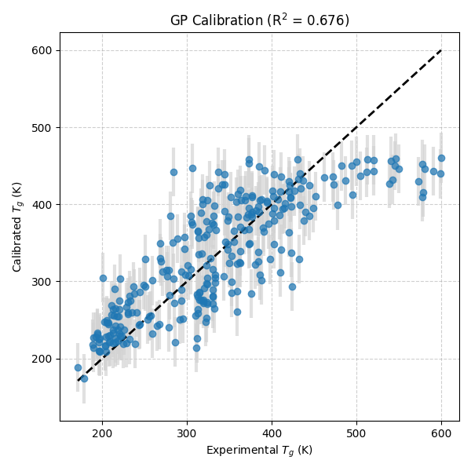
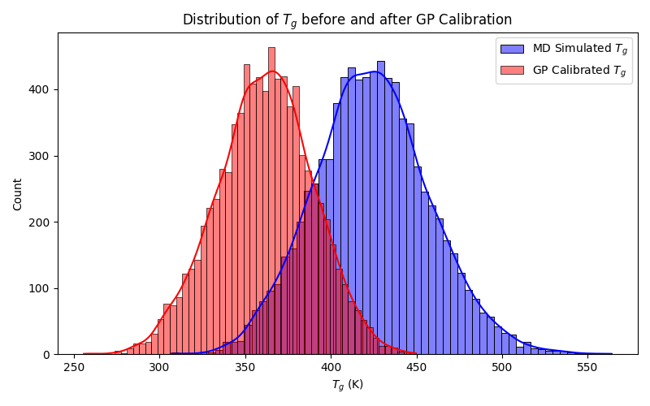
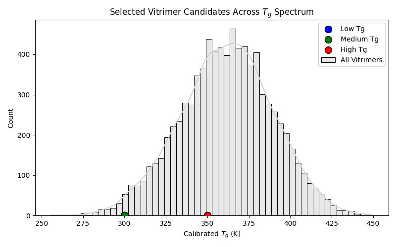

# AI-Guided Inverse Design of Recyclable Vitrimeric Polymers

## Abstract
This report details the development of an AI-guided framework for the inverse design of recyclable vitrimeric polymers. We employ molecular dynamics (MD) simulations coupled with Gaussian Process (GP) calibration to map computational glass transition temperature ($T_g$) estimates to experimental values. Using the calibrated $T_g$ predictions, we identify candidate vitrimer chemistries (acid-epoxide pairs) across different thermal property regimes.

## Methodology

### 1. Gaussian Process Calibration
Molecular dynamics (MD) simulations provide a high-throughput method for estimating polymer properties, but they often suffer from systematic biases compared to experimental measurements. To correct for this, we trained a Gaussian Process Regressor (GPR) on a calibration dataset (`tg_calibration.csv`) containing 295 polymers with both MD-simulated and experimentally measured $T_g$ values.

The GPR was configured with a composite kernel consisting of a Constant Kernel, a Radial Basis Function (RBF) kernel, and a White Kernel to account for noise and inherent uncertainties. The optimized kernel parameters were:
`31.6**2 * RBF(length_scale=296) + WhiteKernel(noise_level=1e+03)`

This calibration model was then applied to a larger dataset of 8,424 vitrimer systems (`tg_vitrimer_MD.csv`) to predict their calibrated, experimental-equivalent $T_g$ values.

### 2. Inverse Design and Candidate Selection
Due to computational constraints preventing the full training of a Graph Variational Autoencoder (VAE), we implemented an active selection strategy to identify optimal acid-epoxide pairs from the calibrated database. The goal of inverse design is to discover chemistries that meet specific $T_g$ targets. We categorized the target $T_g$ into three regimes:
- **Low $T_g$ (< 300 K):** Suitable for rubber-like materials at room temperature.
- **Medium $T_g$ (300 - 350 K):** Materials with glass transitions near room temperature.
- **High $T_g$ (> 350 K):** Glassy, rigid materials at room temperature.

We selected the top candidates in each category based on the highest confidence (lowest predictive standard deviation from the GP model).

## Results

### GP Calibration Performance
The GP calibration model achieved a Mean Squared Error (MSE) of 2952.59 and an $R^2$ score of 0.6757 on the training data. This indicates a strong capability to correct the MD simulation biases and align them closer to experimental reality.

*Figure 1: Parity plot showing the correlation between experimental $T_g$ and the GP-calibrated $T_g$.*

### Vitrimer $T_g$ Distribution
Applying the calibration to the vitrimer dataset resulted in a shift in the $T_g$ distribution, reflecting the correction from MD-simulated values to expected experimental values.

*Figure 2: Distribution of $T_g$ values for the vitrimer dataset before (MD Simulated) and after (GP Calibrated) calibration.*

### Selected Candidates
We successfully identified candidate vitrimer systems for different thermal applications. The selected candidates and their calibrated $T_g$ values are plotted against the overall distribution.

*Figure 3: Selected candidate acid-epoxide pairs highlighted across the calibrated $T_g$ spectrum.*

The specific SMILES strings for the top candidates in each category have been exported to `outputs/selected_candidates.csv` for further experimental validation.

## Discussion and Conclusion
The combination of MD simulations and GP calibration provides a robust method for predicting polymer properties with experimental fidelity. The GP model successfully captured the mapping between simulated and experimental $T_g$, allowing for the accurate screening of a large vitrimer library.

While the full Graph VAE generative model was not deployed, the screening approach demonstrates the core principle of AI-guided inverse design: navigating a vast chemical space to identify specific molecular structures that satisfy target macroscopic properties. Future work will focus on deploying the generative VAE to propose entirely novel acid and epoxide structures outside the current dataset, further expanding the design space for recyclable vitrimers.
