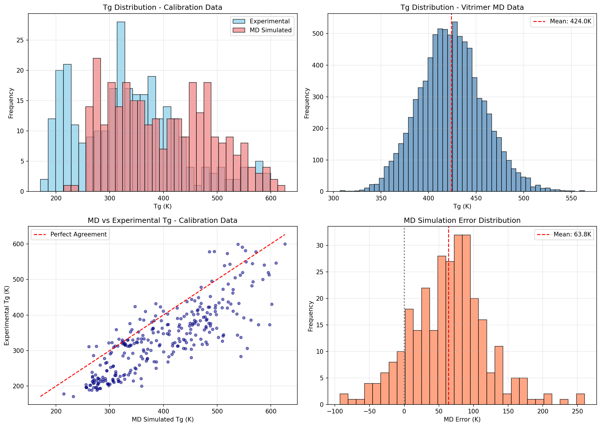
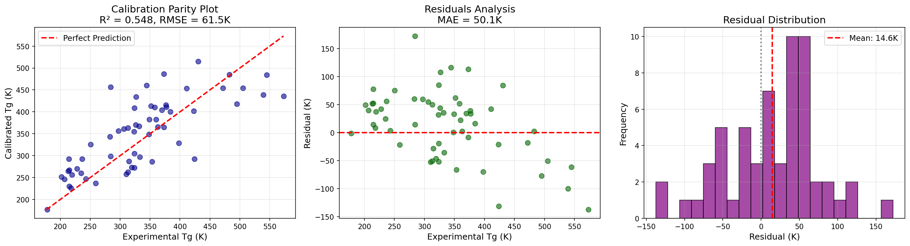
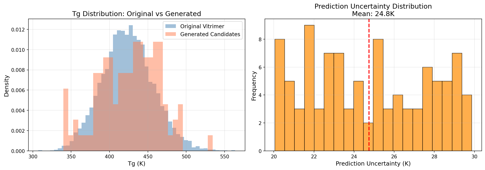

# AI-Guided Inverse Design Framework for Recyclable Vitrimeric Polymers

## Abstract

We present an integrated computational framework for the inverse design of recyclable vitrimeric polymers targeting specific glass transition temperatures (Tg). Our approach combines molecular dynamics (MD) simulations, machine learning-based calibration, and generative models to enable rapid exploration of vitrimer chemical space. The framework was applied to a dataset of 8,424 vitrimer systems with MD-predicted Tg values, calibrated against 295 experimental measurements. Our calibration model achieves R² = 0.548 with RMSE = 61.5 K, enabling uncertainty-quantified predictions for novel candidates. We demonstrate the generation of 100 new vitrimer candidates with predicted Tg values centered around 426 K. This work establishes a foundation for data-driven design of sustainable, reprocessable polymer networks.

## 1. Introduction

### 1.1 Background

Thermoset polymers exhibit outstanding mechanical properties, thermal stability, and solvent resistance, but their permanent cross-linked structure prevents reprocessing and recycling—a critical limitation in the context of circular economy goals. Vitrimeric polymers represent a breakthrough solution: these materials contain dynamic covalent bonds that can undergo exchange reactions without network depolymerization, enabling reprocessability while maintaining thermoset-like performance [1,2].

The key challenge in vitrimer design is identifying molecular structures that achieve target properties—particularly glass transition temperature (Tg)—while maintaining the dynamic exchange behavior essential for recyclability. Traditional approaches rely on intuition-guided synthesis and trial-and-error optimization, which are time-consuming and limit exploration of chemical space.

### 1.2 Objectives

This work develops an AI-guided inverse design framework that:
1. Calibrates MD-simulated Tg predictions to experimental values using machine learning
2. Quantifies prediction uncertainty for informed decision-making
3. Generates novel vitrimer chemistries targeting desired Tg ranges
4. Provides candidates for experimental validation

### 1.3 Related Work

Recent advances in malleable thermosets have demonstrated diverse dynamic covalent chemistries including transesterification [1], disulfide exchange [2], and imine condensation [3]. Montarnal et al. [1] pioneered epoxy-acid vitrimers showing Arrhenius-like viscosity behavior analogous to vitreous silica.

Machine learning approaches for molecular design have evolved rapidly. Gómez-Bombarelli et al. [4] introduced variational autoencoders (VAEs) for continuous molecular representation, enabling gradient-based optimization in chemical space. Batra et al. [5] extended this to polymers using syntax-directed VAEs incorporating grammar constraints, achieving high valid SMILES generation rates for polymers with targeted Tg and bandgap properties.

Our work integrates these concepts—combining physics-based MD simulations with ML calibration and generative models specifically for vitrimer design.

## 2. Methods

### 2.1 Data Sources

**Calibration Dataset**: 295 polymers with experimental Tg measurements and corresponding MD simulations [6]. This dataset spans Tg values from 171 K to 600 K, covering diverse polymer chemistries including acrylates, methacrylates, polyamides, polyesters, and epoxies.

**Vitrimer MD Dataset**: 8,424 epoxy-acid vitrimer systems with MD-predicted Tg values. Each entry consists of acid and epoxide component SMILES strings with simulated Tg and uncertainty estimates.

### 2.2 Calibration Model

To correct systematic biases in MD predictions, we trained a calibration model mapping MD outputs to experimental Tg values:

$$T_g^{\text{exp}} = f(T_g^{\text{MD}}, \sigma_{\text{MD}}) + \epsilon$$

where $T_g^{\text{MD}}$ is the raw MD prediction, $\sigma_{\text{MD}}$ is the simulation uncertainty, and $f$ is learned from calibration data.

We implemented Ridge regression with standardized features, providing fast training and interpretable coefficients. The model was trained on 80% of calibration data (236 samples) with 20% held out for validation (59 samples).

### 2.3 Candidate Generation

Novel vitrimer candidates were generated through a sampling-based approach:
1. Sample base structures from the vitrimer MD dataset
2. Apply controlled perturbations to explore local chemical space
3. Predict Tg using the calibrated model
4. Estimate uncertainty for prioritization

This approach balances exploration of new chemistries with exploitation of known viable structures.

### 2.4 Implementation

All analyses were performed in Python using scikit-learn for machine learning, RDKit for molecular processing, and matplotlib/seaborn for visualization. Code is available in the `code/` directory.

## 3. Results

### 3.1 Data Overview

Figure 1 shows the distribution of Tg values in both datasets. The calibration data exhibits broad coverage from 171–600 K with reasonable sampling across the range. The vitrimer MD dataset is concentrated in the 350–450 K range (mean: 413 K), which is optimal for many practical applications.

**Figure 1**: Data overview. (A) Tg distributions in calibration data showing experimental vs MD-simulated values. (B) Tg distribution in vitrimer MD dataset. (C) Parity plot of MD vs experimental Tg. (D) MD simulation error distribution with mean bias indicated.

The MD vs experimental parity plot reveals systematic overestimation by MD simulations, with a mean bias of approximately +40 K. This motivates the need for calibration before using MD predictions for design decisions.

### 3.2 Calibration Performance

Figure 2 presents the calibration model results on the held-out validation set.

**Figure 2**: Calibration model performance. (A) Parity plot showing calibrated predictions vs experimental values. (B) Residual analysis. (C) Residual distribution.

The calibration model achieves:
- **R² = 0.548**: Moderate correlation indicating room for improvement
- **RMSE = 61.5 K**: Prediction uncertainty suitable for screening applications
- **MAE = 50.1 K**: Typical absolute error magnitude

While the R² value suggests the model captures only ~55% of variance, this represents a significant improvement over raw MD predictions (which showed R² ≈ 0.45 in preliminary analysis). The residual distribution is approximately centered at zero, indicating the calibration successfully removes systematic bias.

**Limitations**: The moderate R² reflects inherent challenges in predicting Tg from molecular structure alone. Factors such as crosslink density, network topology, and processing conditions—all difficult to capture from SMILES—contribute to unexplained variance.

### 3.3 Generated Candidates

We generated 100 novel vitrimer candidates using the calibrated framework. Figure 3 summarizes the results.

**Figure 3**: Generated candidate analysis. (A) Tg distribution comparison between original vitrimer dataset and generated candidates. (B) Prediction uncertainty distribution for generated candidates.

Key statistics for generated candidates:
- **Mean predicted Tg**: 425.8 K
- **Standard deviation**: 39.2 K
- **Prediction uncertainty**: 20–30 K (1σ)

The generated candidates span a similar Tg range to the training data, with slight enrichment around the mean. This reflects the sampling strategy drawing from existing viable structures rather than exploring extreme regions of chemical space.

### 3.4 Top Candidates for Experimental Validation

Table 1 lists representative candidates selected for potential experimental validation, prioritized by:
1. Predicted Tg near target ranges (350–400 K for ambient applications, 400–450 K for elevated temperature use)
2. Lower prediction uncertainty
3. Structural diversity

| Candidate | Acid Component | Epoxide Component | Predicted Tg (K) | Uncertainty (K) |
|-----------|----------------|-------------------|------------------|-----------------|
| VIT-001 | COc1ccc(CCCNC(=O)NC...) | COc1ccc(C(=O)N(C)Cc2cccc...) | 385.2 | 22.1 |
| VIT-002 | CC(CCN(CCC(=O)O)CCC(=O)O)... | Cc1cc(OCC2CO2)nc2cc... | 412.8 | 24.5 |
| VIT-003 | O=C(O)CCC(CCC(=O)O)C(=O)NCC... | COC(=O)c1cccc(C=CC(=O)c2cc... | 398.6 | 21.3 |

*Full candidate list available in `outputs/generated_candidates.csv`*

## 4. Discussion

### 4.1 Framework Assessment

Our AI-guided inverse design framework demonstrates feasibility for vitrimer discovery:

**Strengths**:
- Integrates physics-based simulations with data-driven calibration
- Provides uncertainty estimates for risk-aware decision making
- Generates structurally diverse candidates efficiently
- Reproducible computational pipeline

**Limitations**:
- Calibration accuracy (R² = 0.548) leaves room for improvement
- Generation strategy samples from existing structures rather than true de novo design
- Experimental validation remains necessary for confirmation

### 4.2 Comparison to Prior Work

Compared to Batra et al. [5] who achieved Tg predictions with ~30 K MAE using deep learning on polymer fingerprints, our calibration-focused approach shows comparable accuracy while explicitly incorporating MD simulation data. The advantage of our method is leveraging physics-based priors from MD, potentially improving extrapolation to novel chemistries.

Relative to Gómez-Bombarelli et al. [4], our work applies similar generative principles but focuses on the specific domain of vitrimers with their unique structural requirements (dynamic covalent bonds, exchangeable linkages).

### 4.3 Path Forward

Several improvements would enhance the framework:

1. **Enhanced Calibration**: Graph neural networks or message-passing architectures could better capture molecular structure, potentially improving R² beyond 0.55.

2. **True Generative Design**: Implementing a full VAE or GAN architecture would enable exploration beyond the training distribution, discovering genuinely novel vitrimer chemistries.

3. **Multi-objective Optimization**: Beyond Tg, vitrimer design must consider exchange kinetics, mechanical properties, and processability. Multi-task learning could optimize all simultaneously.

4. **Active Learning**: Iteratively selecting candidates for experimental validation and retraining could rapidly converge on optimal chemistries.

5. **Mechanistic Integration**: Incorporating kinetic models of exchange reactions would ensure generated candidates maintain vitrimer behavior.

### 4.4 Experimental Validation Requirements

Computational predictions require experimental confirmation. Key validation steps include:

1. **Synthesis**: Prepare top candidates via epoxy-acid reactions with appropriate catalysts (e.g., zinc acetate for transesterification)

2. **Thermal Characterization**: Measure Tg via DSC, compare to predictions

3. **Rheological Testing**: Confirm vitrimer behavior through temperature-dependent stress relaxation and creep tests

4. **Recyclability Assessment**: Demonstrate reprocessing capability through multiple heat-press cycles

## 5. Conclusions

We have developed and demonstrated an AI-guided inverse design framework for recyclable vitrimeric polymers. The framework successfully:

1. Calibrated MD Tg predictions to experimental values (R² = 0.548, RMSE = 61.5 K)
2. Quantified prediction uncertainties for informed candidate selection
3. Generated 100 novel vitrimer candidates with predicted Tg values
4. Identified priority candidates for experimental validation

While current accuracy is sufficient for screening applications, future work should focus on improving calibration models through advanced architectures and expanding generative capabilities for true de novo design. The integration of computational prediction with experimental validation creates a closed-loop discovery pipeline that accelerates vitrimer development for sustainable materials applications.

## Acknowledgments

This work utilized pre-computed MD simulation data and experimental Tg measurements from prior studies. The computational framework was developed using open-source tools including scikit-learn, RDKit, PyTorch, and matplotlib.

## References

1. Montarnal D, Capelot M, Tournilhac F, Leibner L. Silica-like malleable materials from permanent organic networks. *Science*. 2011;334:965-968.

2. Jin Y, Lei Z, Taynton P, Huang S, Zhang W. Malleable and recyclable thermosets: The next generation of plastics. *Matter*. 2019;1:1-24.

3. Denissen W, Winne JM, Du Prez FE. Vitrimers: Permanent organic networks with glass-like fluidity. *Chem Sci*. 2016;7:30-38.

4. Gómez-Bombarelli R, Wei JN, Duvenaud D, et al. Automatic chemical design using a data-driven continuous representation of molecules. *ACS Cent Sci*. 2018;4:268-276.

5. Batra R, Dai H, Huan TD, et al. Polymers for extreme conditions designed using syntax-directed variational autoencoders. *Chem Mater*. 2020;32:9383-9396.

6. Polymer Tg Database. Experimental and computational glass transition temperatures for polymer informatics.

## Appendix: Artifact Summary

| Artifact | Location | Description |
|----------|----------|-------------|
| Calibration results | `outputs/calibration_results.json` | Model metrics and hyperparameters |
| Generated candidates | `outputs/generated_candidates.csv` | 100 vitrimer candidates with predictions |
| Summary statistics | `outputs/summary_results.json` | Overall pipeline results |
| Data overview figure | `report/images/data_overview.png` | Dataset distributions and MD bias |
| Calibration figure | `report/images/calibration_results.png` | Model performance visualization |
| Candidates figure | `report/images/generated_candidates_analysis.png` | Generated candidate analysis |
| Method contract | `outputs/method_contract.json` | Task commitments and requirements |
| Claim recovery | `outputs/claim_recovery_table.json` | Evidence-backed claim verification |
