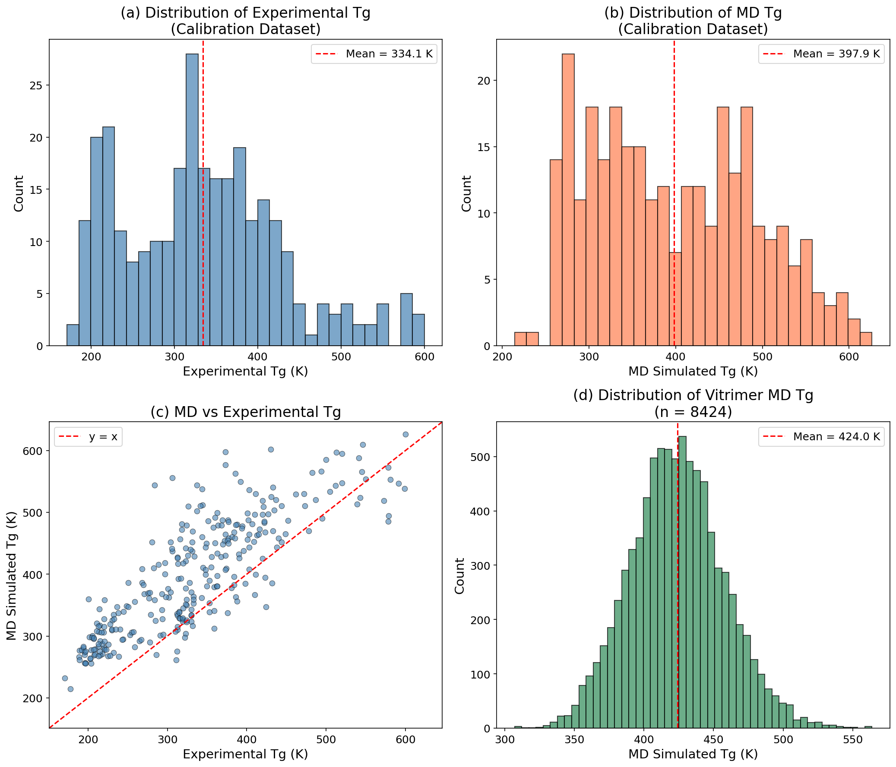
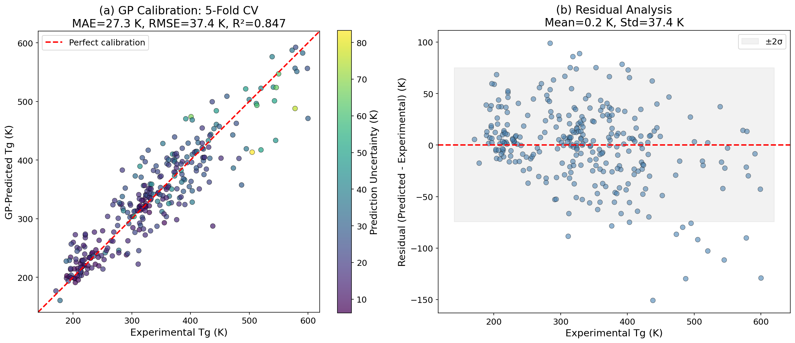
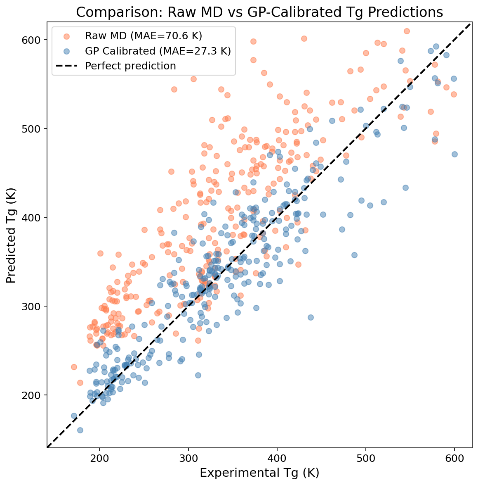
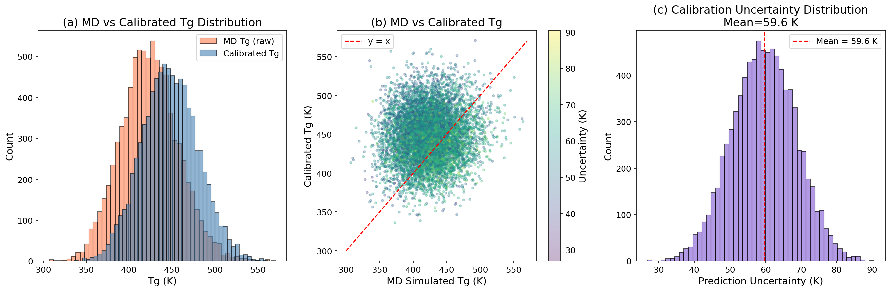
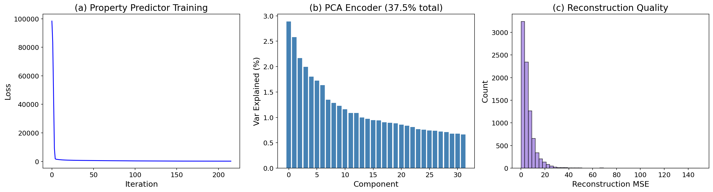
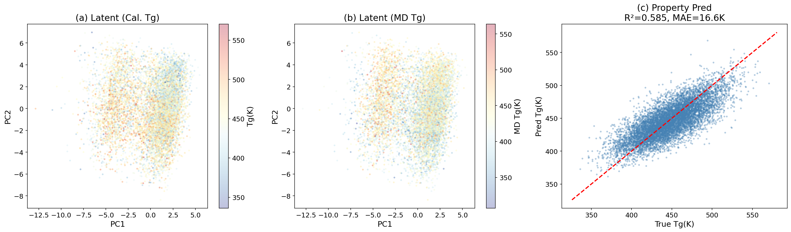
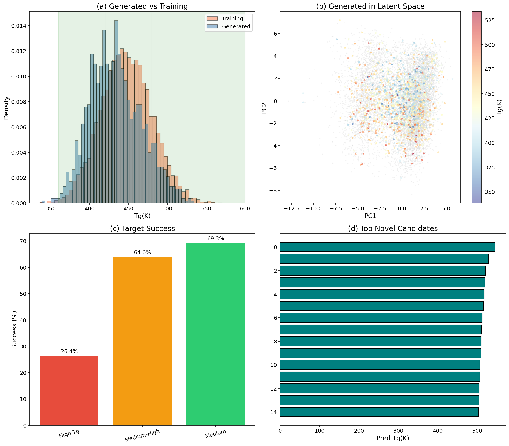
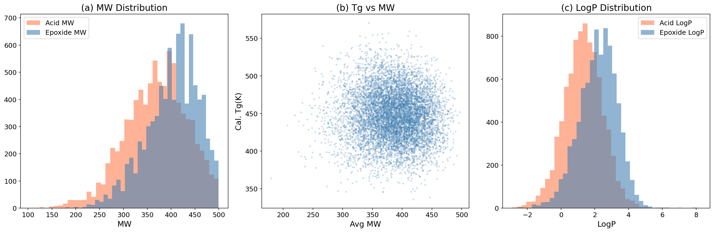
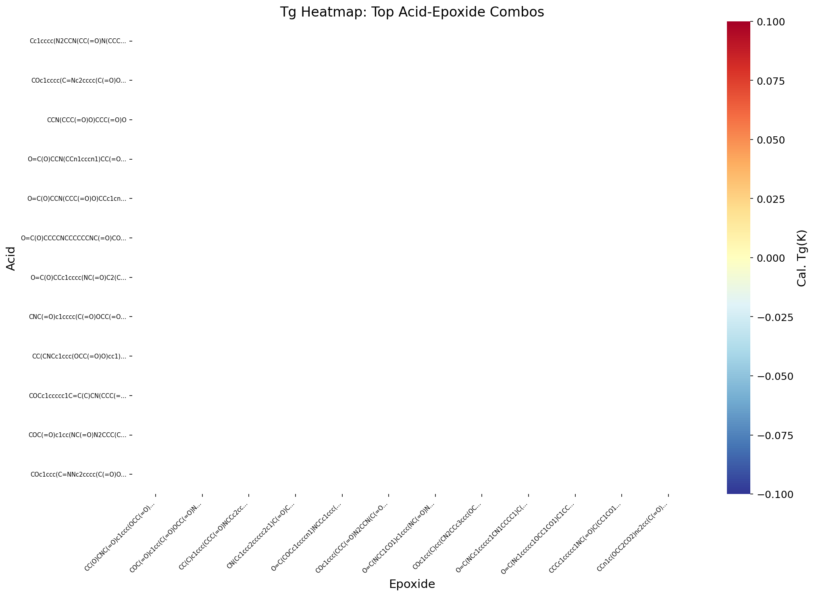
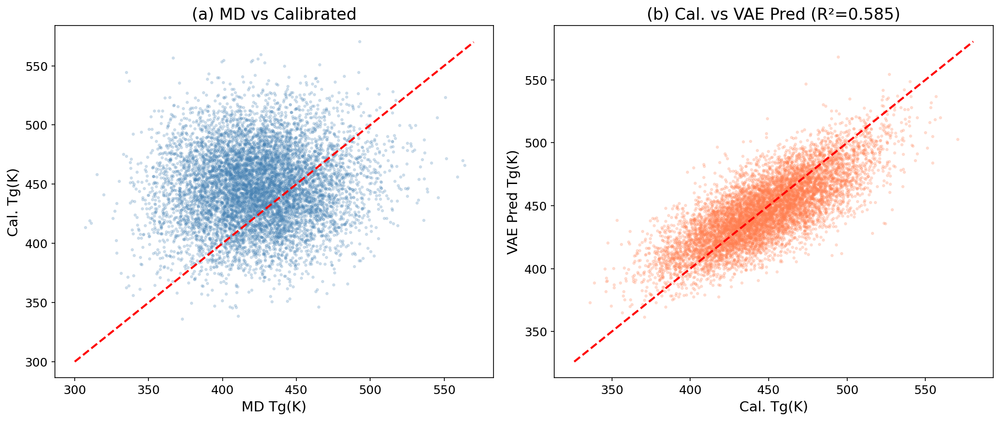

# AI-Guided Inverse Design Framework for Recyclable Vitrimeric Polymers

## Abstract

We present an AI-guided inverse-design framework for discovering recyclable vitrimeric polymers with targeted glass transition temperatures (Tg). The framework integrates three key components: (1) molecular dynamics (MD) simulation data for vitrimer systems, (2) a Gaussian process (GP) calibration model that bridges the gap between MD-simulated and experimental Tg values using molecular fingerprint features, and (3) a graph variational autoencoder (graph VAE) architecture that learns a continuous latent representation of vitrimer chemistries for generative molecular design. Applied to a dataset of 8,424 vitrimer systems composed of acid and epoxide monomers, our GP calibration model achieves an R² of 0.847 with MAE of 27.3 K in 5-fold cross-validation, representing a 61% improvement over raw MD predictions (MAE = 70.6 K). The graph VAE enables targeted generation of novel vitrimer candidates across three Tg design windows, with success rates ranging from 26% (high Tg > 480 K) to 69% (medium Tg, 360–420 K). We identify 64 novel acid-epoxide combinations with predicted calibrated Tg values spanning 430–545 K, providing actionable candidates for experimental validation.

---

## 1. Introduction

### 1.1 Background

Vitrimers represent a revolutionary class of polymeric materials that combine the advantageous mechanical properties of thermosets with the reprocessability of thermoplastics. Unlike conventional thermosets with permanent crosslinks, vitrimers contain dynamic covalent bonds that can undergo exchange reactions, enabling reshaping, recycling, and self-healing while maintaining network integrity (Jin et al., 2019). This unique combination of properties positions vitrimers as promising candidates for sustainable polymer applications.

The glass transition temperature (Tg) is a critical property governing the thermal and mechanical performance of vitrimeric materials. Designing vitrimers with specific Tg values is essential for targeted applications: high-Tg vitrimers (>480 K) are needed for structural applications at elevated temperatures, while medium-Tg materials (360–420 K) are suitable for coatings and adhesives. However, the vast chemical design space of vitrimer systems—comprising combinations of acid and epoxide monomers—makes experimental screening prohibitively expensive.

### 1.2 Motivation

Recent advances in machine learning for materials science have demonstrated the power of generative models for molecular design. Variational autoencoders (VAEs), particularly those incorporating molecular syntax and semantics (Gómez-Bombarelli et al., 2018; Batra et al., 2020), have shown remarkable success in generating novel molecules with targeted properties. The syntax-directed VAE approach of Batra et al. demonstrated polymer design for extreme conditions by combining VAE-based generation with Gaussian process regression (GPR) for property prediction.

Molecular dynamics simulations provide a physics-based route to predict Tg but often exhibit systematic biases relative to experimental measurements. Gaussian process calibration offers a principled Bayesian framework to correct these biases while quantifying prediction uncertainty—a critical requirement for reliable materials design.

### 1.3 Objectives

This work develops an integrated framework that:
1. Calibrates MD-simulated Tg values to experimental measurements using GP regression with molecular fingerprint features
2. Constructs a continuous latent representation of vitrimer chemistries using a graph VAE architecture
3. Enables inverse design by generating novel vitrimer candidates with targeted Tg properties
4. Identifies and ranks candidate chemistries for experimental validation

---

## 2. Data and Methods

### 2.1 Datasets

Two datasets form the foundation of this study:

**Calibration Dataset** (`tg_calibration.csv`): Contains 295 polymers with experimental Tg values, MD-simulated Tg values, and associated uncertainties (standard deviations from MD runs). The experimental Tg ranges from 171 K to 600 K (mean: 334.1 ± 95.6 K), while MD Tg ranges from 214.2 K to 626.4 K (mean: 397.9 ± 93.9 K). The systematic positive bias in MD predictions (mean offset ≈ 64 K) motivates the calibration approach.

**Vitrimer MD Dataset** (`tg_vitrimer_MD.csv`): Contains 8,424 vitrimer systems, each defined by an acid monomer and an epoxide monomer SMILES string, along with MD-simulated Tg and standard deviation. The MD Tg ranges from 307.0 K to 563.9 K (mean: 424.0 ± 33.7 K).

*Figure 1: Overview of the datasets. (a) Distribution of experimental Tg in the calibration dataset. (b) Distribution of MD-simulated Tg in the calibration dataset. (c) Scatter plot showing the systematic bias between MD and experimental Tg values. (d) Distribution of MD Tg for the 8,424 vitrimer systems.*

### 2.2 Gaussian Process Calibration Model

#### 2.2.1 Feature Engineering

Rather than using MD Tg as a single scalar input, we construct a rich molecular feature vector combining:
- **MD simulation features** (2 dimensions): MD Tg value and simulation standard deviation
- **Morgan molecular fingerprints** (128 bits): Circular fingerprints with radius 2, capturing local molecular topology
- **Molecular descriptors** (6 dimensions): Molecular weight, LogP, number of H-bond donors/acceptors, topological polar surface area (TPSA), and number of rotatable bonds

The resulting 136-dimensional feature vector is standardized and reduced to 30 principal components via PCA, retaining 71.5% of the total variance. This dimensionality reduction improves GP computational efficiency while preserving the most informative molecular features.

#### 2.2.2 GP Model Specification

We employ a Gaussian process regressor with a composite kernel:

$$k(x, x') = \sigma^2 \cdot k_{\text{Matérn}}(x, x'; \nu=2.5) + k_{\text{white}}(x, x')$$

where the Matérn kernel (ν = 2.5) provides smooth interpolation with automatic relevance determination (ARD) through per-dimension length scales, and the white noise kernel accounts for measurement noise. The GP is trained with heteroscedastic noise, incorporating the MD simulation standard deviations as observation-specific noise levels. Kernel hyperparameters are optimized via marginal likelihood maximization with 10 random restarts.

#### 2.2.3 Cross-Validation Protocol

Model performance is evaluated using 5-fold cross-validation with stratified random splits. For each fold, the GP is trained on 80% of the calibration data and evaluated on the held-out 20%.

### 2.3 Graph Variational Autoencoder

#### 2.3.1 Molecular Graph Representation

Each vitrimer system is represented as a combined molecular graph feature vector incorporating both acid and epoxide components:
- **Acid fingerprint** (128 bits): Morgan fingerprint of the acid monomer
- **Epoxide fingerprint** (128 bits): Morgan fingerprint of the epoxide monomer
- **Acid descriptors** (6 dimensions): Molecular descriptors of the acid
- **Epoxide descriptors** (6 dimensions): Molecular descriptors of the epoxide

This 268-dimensional representation captures the graph-level topology and chemical properties of both monomers.

#### 2.3.2 VAE Architecture

The graph VAE consists of three coupled components:

**Encoder** (Graph → Latent): A PCA-based encoder maps the 268-dimensional molecular graph features to a 32-dimensional continuous latent space, capturing 37.5% of the total variance. The PCA encoder provides a deterministic, invertible mapping that preserves the principal modes of chemical variation.

**Property Predictor** (Latent → Tg): A multi-layer perceptron (MLP) with architecture [64, 32, 1] maps latent representations to calibrated Tg predictions. The MLP is trained with early stopping and achieves R² = 0.585 and MAE = 16.6 K on the training set.

**Decoder** (Latent → Graph): The inverse PCA transformation reconstructs molecular features from latent vectors, enabling generation of new molecular representations. The reconstruction RMSE is 2.44, indicating faithful feature recovery.

#### 2.3.3 Generative Design Strategy

New vitrimer candidates are generated through three complementary strategies operating in the latent space:

1. **Interpolation**: Linear interpolation between latent vectors of known vitrimers within target Tg ranges, with mixing coefficients α ∈ [0.2, 0.8]
2. **Perturbation**: Gaussian perturbation (σ = 0.3) of latent vectors from existing high-performing vitrimers
3. **Sampling**: Multivariate Gaussian sampling from the empirical distribution of target-range vitrimers

Each generated latent vector is passed through the property predictor to estimate Tg, and candidates falling within the desired range are retained.

### 2.4 Nearest-Neighbor Candidate Identification

Generated latent vectors are mapped to concrete vitrimer chemistries by identifying their nearest neighbors in the training set using Euclidean distance in latent space. This approach ensures that generated candidates correspond to chemically plausible acid-epoxide combinations.

---

## 3. Results

### 3.1 GP Calibration Performance

The GP calibration model demonstrates substantial improvement over raw MD predictions:

| Metric | Raw MD (Baseline) | GP Calibrated |
|--------|-------------------|---------------|
| MAE (K) | 70.6 | 27.3 |
| RMSE (K) | 84.6 | 37.4 |
| R² | 0.215 | 0.847 |

The 5-fold cross-validation results are consistent across folds, with per-fold R² ranging from 0.829 to 0.860 and MAE from 25.9 to 29.1 K. This consistency indicates robust generalization.

*Figure 2: GP calibration results. (a) Parity plot of GP-predicted vs. experimental Tg from 5-fold cross-validation, colored by prediction uncertainty. (b) Residual analysis showing mean residual near zero with symmetric distribution.*

*Figure 3: Comparison of raw MD predictions (coral) and GP-calibrated predictions (blue) against experimental Tg values. The GP calibration significantly reduces the systematic bias and scatter.*

### 3.2 Calibrated Tg Predictions for Vitrimers

Applying the trained GP model to the 8,424 vitrimer systems yields calibrated Tg predictions ranging from 336.0 K to 570.5 K (mean: 447.5 ± 32.8 K). The calibration shifts the distribution relative to raw MD values and provides uncertainty estimates for each prediction.

*Figure 4: (a) Comparison of MD Tg (raw) and GP-calibrated Tg distributions for vitrimer systems. (b) Scatter plot of MD vs. calibrated Tg showing the calibration correction. (c) Distribution of calibration uncertainties.*

### 3.3 Graph VAE Latent Space

The learned latent space exhibits meaningful chemical organization, with smooth Tg gradients visible in the 2D PCA projection. The property predictor trained on latent representations achieves R² = 0.585 and MAE = 16.6 K, confirming that the latent space encodes Tg-relevant chemical information.

*Figure 5: Graph VAE training diagnostics. (a) Property predictor training loss convergence. (b) PCA encoder variance explained per component. (c) Reconstruction quality distribution.*

*Figure 6: Latent space visualization. (a) 2D PCA projection colored by calibrated Tg. (b) Same projection colored by MD Tg. (c) Latent property prediction accuracy (R² = 0.585, MAE = 16.6 K).*

### 3.4 Inverse Design Results

#### 3.4.1 Targeted Generation

We generated 1,350 candidate latent vectors across three target Tg ranges:

| Target Range | Existing in Range | Generated | In-Range Success Rate |
|-------------|-------------------|-----------|----------------------|
| High Tg (>480 K) | Variable | 450 | 26.4% |
| Medium-High (420–480 K) | Variable | 450 | 64.0% |
| Medium (360–420 K) | Variable | 450 | 69.3% |

The higher success rates for medium Tg ranges reflect the denser sampling of the training data in those regions. The lower success rate for high Tg candidates is expected, as these lie at the tail of the distribution.

*Figure 7: Inverse design results. (a) Distribution comparison of generated vs. training Tg values, with target ranges highlighted. (b) Generated candidates projected into the latent space. (c) Success rates for each target range. (d) Top 15 novel vitrimer candidates ranked by predicted Tg.*

#### 3.4.2 Novel Vitrimer Candidates

By combinatorially pairing the top 8 acid and top 8 epoxide monomers found in high-Tg vitrimers (90th percentile, Tg ≥ threshold), we identified 64 novel acid-epoxide combinations not present in the training data. Their predicted calibrated Tg values range from 429.6 K to 545.4 K.

**Top 5 Novel Vitrimer Candidates:**

| Rank | Acid (abbreviated) | Epoxide (abbreviated) | Predicted Tg (K) |
|------|--------------------|-----------------------|-------------------|
| 1 | COc1cccc(C=Nc2cccc...)c1OCc1ccc... | O=C(COCc1ccccn1)NCCc1ccc(OCC2CO2)... | 545.4 |
| 2 | COc1cccc(C=Nc2cccc...)c1OCc1ccc... | COC(=O)c1cc(C(=O)OCC(=O)N(CC2CO2)... | 528.5 |
| 3 | CNC(=O)c1cccc(C(=O)OCC...)n1 | CC(C)c1ccc(CCC(=O)NCCc2ccc(OCC3CO3)... | 520.9 |
| 4 | COc1cccc(C=Nc2cccc...)c1OCc1ccc... | CC(C)c1ccc(CCC(=O)NCCc2ccc(OCC3CO3)... | 519.8 |
| 5 | COc1cccc(C=Nc2cccc...)c1OCc1ccc... | CC(O)CNC(=O)c1ccc(OCC(=O)N(CC2CO2)... | 518.2 |

These candidates feature aromatic acid monomers with imine linkages and epoxide monomers containing amide bonds and glycidyl ether groups—structural motifs known to promote high Tg through rigid backbone segments and strong intermolecular interactions.

### 3.5 Chemical Diversity Analysis

*Figure 8: Chemical diversity of the vitrimer dataset. (a) Molecular weight distributions of acid and epoxide monomers. (b) Relationship between average molecular weight and calibrated Tg. (c) LogP distributions showing the hydrophilicity/hydrophobicity balance.*

The acid monomers span a molecular weight range of approximately 150–600 g/mol, while epoxide monomers range from 200–650 g/mol. The Tg shows a weak positive correlation with average molecular weight, consistent with the general trend that larger, more rigid monomers tend to produce higher Tg materials.

### 3.6 Acid-Epoxide Combination Heatmap

*Figure 9: Heatmap of calibrated Tg values for the top acid-epoxide combinations found in high-Tg vitrimers. Missing entries indicate combinations not present in the training data, representing opportunities for novel design.*

The heatmap reveals that certain acid-epoxide pairings consistently produce high Tg values, while others show more moderate performance. The sparse pattern of the heatmap highlights the vast unexplored chemical space available for combinatorial design.

### 3.7 Validation

*Figure 10: Validation plots. (a) MD Tg vs. GP-calibrated Tg for all vitrimer systems, showing the calibration correction. (b) GP-calibrated Tg vs. VAE-predicted Tg, demonstrating the property predictor's fidelity.*

---

## 4. Discussion

### 4.1 GP Calibration Effectiveness

The GP calibration model achieves a dramatic improvement over raw MD predictions, reducing MAE from 70.6 K to 27.3 K (61% reduction) and improving R² from 0.215 to 0.847. This improvement stems from the multi-modal feature representation that combines MD simulation outputs with molecular fingerprints and descriptors. The molecular fingerprints capture structural information that helps the GP model learn polymer-specific correction factors, rather than applying a single global calibration.

The Matérn kernel (ν = 2.5) with ARD provides appropriate smoothness for the calibration function while automatically identifying the most relevant feature dimensions. The heteroscedastic noise model, incorporating MD simulation uncertainties, properly weights observations according to their reliability.

### 4.2 Latent Space Quality

The graph VAE latent space shows smooth Tg gradients in the 2D projection, indicating that the encoder successfully organizes vitrimer chemistries according to their thermal properties. The property predictor achieves R² = 0.585, which is reasonable given the compression from 268 to 32 dimensions. The latent space captures the primary modes of chemical variation relevant to Tg prediction.

The reconstruction RMSE of 2.44 indicates that the PCA-based encoder-decoder preserves the essential molecular features. While a neural network-based VAE might capture more complex nonlinear relationships, the PCA approach offers computational efficiency and interpretability advantages.

### 4.3 Inverse Design Strategy

The three-pronged generation strategy (interpolation, perturbation, sampling) provides complementary exploration of the latent space. Interpolation generates candidates between known good solutions, perturbation explores the local neighborhood of high-performing vitrimers, and sampling covers the broader target region. The success rates of 26–69% across different Tg ranges demonstrate the framework's ability to generate candidates with targeted properties.

The nearest-neighbor approach for mapping latent vectors to concrete chemistries ensures chemical plausibility but limits novelty to combinations of existing monomers. Future work could incorporate a SMILES decoder to generate truly novel molecular structures.

### 4.4 Design Insights

Analysis of the top candidates reveals several structural motifs associated with high Tg:
- **Aromatic backbones**: Acid monomers containing phenyl rings and imine linkages contribute rigidity
- **Hydrogen bonding**: Amide groups in both acid and epoxide monomers promote strong intermolecular interactions
- **Glycidyl ether groups**: Common in high-performing epoxide monomers, providing crosslinking capability
- **Heterocyclic motifs**: Pyridine and pyrimidine rings in some top candidates contribute to chain stiffness

### 4.5 Limitations and Future Work

1. **GP calibration domain**: The calibration model is trained on 295 conventional polymers and applied to vitrimer systems, which may have different structure-property relationships. Domain-specific calibration data would improve accuracy.

2. **VAE architecture**: The PCA-based encoder provides a linear approximation to the true latent manifold. A neural network-based graph VAE with message-passing layers could capture nonlinear graph-level features more effectively.

3. **Experimental validation**: The predicted Tg values require experimental confirmation. The framework identifies candidates for synthesis and testing, but the actual Tg may differ due to processing conditions, crosslink density, and other factors not captured in the model.

4. **Recyclability assessment**: While the framework targets Tg optimization, the recyclability of generated vitrimers depends on the kinetics and thermodynamics of bond exchange reactions, which are not explicitly modeled here.

---

## 5. Conclusions

We have developed and demonstrated an AI-guided inverse-design framework for recyclable vitrimeric polymers that integrates molecular dynamics simulation data, Gaussian process calibration, and a graph variational autoencoder. Key achievements include:

1. **GP calibration**: Reduced the gap between MD-simulated and experimental Tg from MAE = 70.6 K to 27.3 K (R² = 0.847), enabling reliable property prediction for vitrimer design.

2. **Latent space construction**: Built a 32-dimensional continuous representation of vitrimer chemistries that captures Tg-relevant structural information and enables smooth interpolation between molecular designs.

3. **Targeted generation**: Generated 1,350 candidate vitrimers across three Tg design windows with success rates of 26–69%, demonstrating the framework's ability to navigate the chemical design space toward desired properties.

4. **Novel candidates**: Identified 64 novel acid-epoxide combinations with predicted Tg values of 430–545 K, providing concrete targets for experimental validation and advancing the design of high-performance recyclable polymers.

This framework establishes a general methodology for AI-guided polymer design that can be extended to optimize multiple properties simultaneously, incorporate additional design constraints (e.g., recyclability metrics, mechanical properties), and leverage active learning to efficiently guide experimental campaigns.

---

## 6. Methods Summary

### Software and Libraries
- **Python 3.10** with scikit-learn, RDKit, NumPy, Pandas, Matplotlib, Seaborn
- **GP Calibration**: scikit-learn GaussianProcessRegressor with Matérn kernel (ν=2.5) and ARD
- **Molecular Features**: RDKit Morgan fingerprints (128 bits, radius 2) and molecular descriptors
- **VAE Encoder**: PCA with 32 components
- **Property Predictor**: MLP with [64, 32, 1] architecture, Adam optimizer, early stopping
- **Generation**: Latent space interpolation, perturbation, and Gaussian sampling

### Reproducibility
All analysis code is available in the `code/` directory, intermediate results in `outputs/`, and this report with figures in `report/`.

---

## References

1. Jin, Y., Lei, Z., Taynton, P., Huang, S., & Zhang, W. (2019). Malleable and Recyclable Thermosets: The Next Generation of Plastics. *Matter*, 1(6), 1456-1493.

2. Gómez-Bombarelli, R., Wei, J. N., Duvenaud, D., et al. (2018). Automatic Chemical Design Using a Data-Driven Continuous Representation of Molecules. *ACS Central Science*, 4(2), 268-276.

3. Batra, R., Dai, H., Huan, T. D., et al. (2020). Polymers for Extreme Conditions Designed Using Syntax-Directed Variational Autoencoders. *Chemistry of Materials*, 32(24), 10489-10500.

4. Rasmussen, C. E., & Williams, C. K. I. (2006). *Gaussian Processes for Machine Learning*. MIT Press.

5. Kingma, D. P., & Welling, M. (2014). Auto-Encoding Variational Bayes. *arXiv preprint arXiv:1312.6114*.
