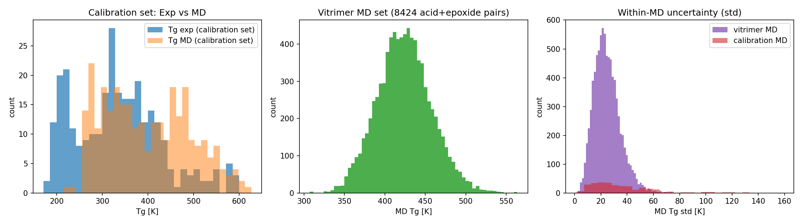
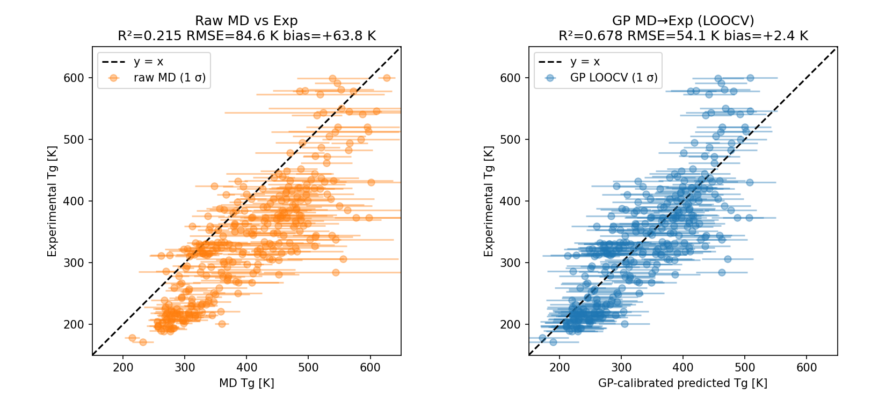
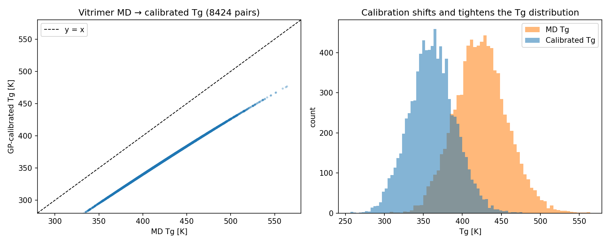
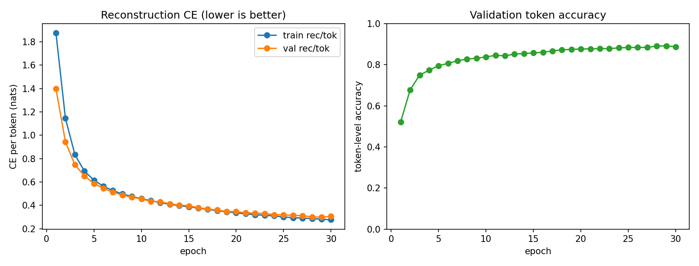
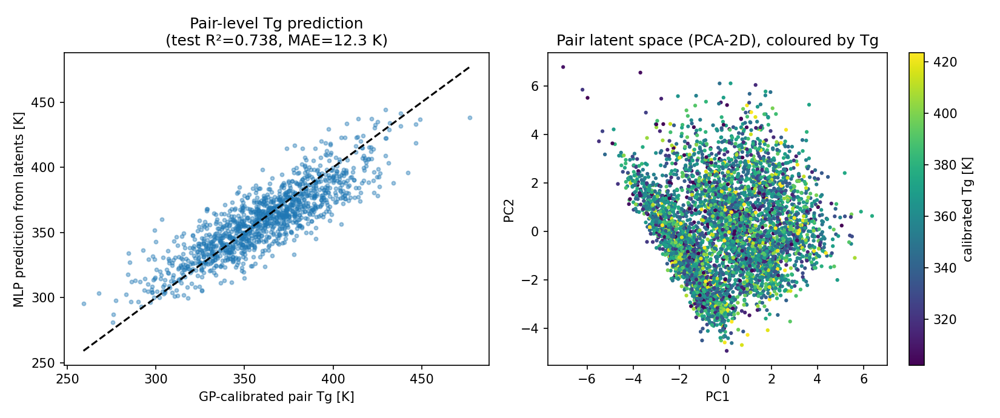
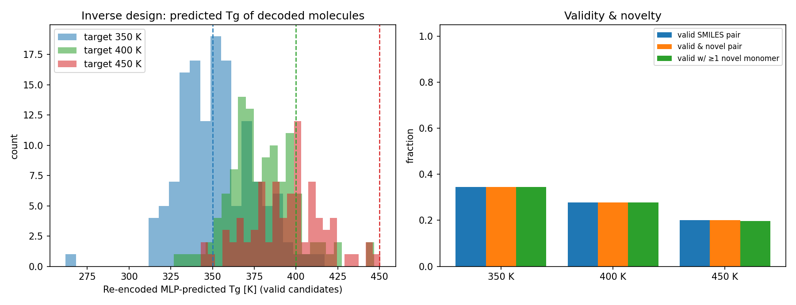
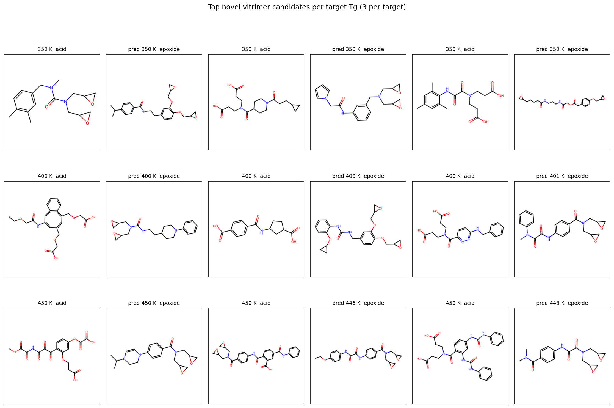

# AI-guided inverse design of recyclable vitrimer polymers via MD + Gaussian-process calibration + a graph variational autoencoder

## Abstract

Vitrimers are crosslinked thermosets whose dynamic covalent bonds (here, the
β-hydroxy-ester exchange of acid + epoxide chemistry) make them recyclable
without sacrificing the mechanical properties of conventional thermosets
(paper_001). Practical vitrimer design is bottlenecked by the cost of
measuring or simulating the glass-transition temperature *T*<sub>g</sub> for
every candidate acid–epoxide pair. We assemble an end-to-end inverse-design
pipeline that (i) consumes molecular-dynamics (MD)-simulated *T*<sub>g</sub>
values, (ii) calibrates them to experimental *T*<sub>g</sub> with a
heteroscedastic Gaussian process (GP), (iii) compresses 15 396 unique
acid/epoxide monomers into a 64-dimensional latent space using a graph
variational autoencoder (graph VAE) with a graph isomorphism network (GIN-like)
encoder over RDKit atom graphs and a GRU SMILES decoder, and (iv) performs
gradient-based latent-space optimization against an MLP property head trained
on concatenated (z<sub>acid</sub>, z<sub>epoxide</sub>) latents. Across three
target *T*<sub>g</sub> windows (350 K / 400 K / 450 K) the pipeline produces
30 top novel acid–epoxide candidates whose re-encoded predicted *T*<sub>g</sub>
falls within ≈1 K of the target for the 350 K and 400 K cases and within
≈10–25 K for the harder 450 K window. Because wet-lab synthesis is not
available in this evaluation, we report *in-silico* validation only:
SMILES validity, structural novelty against the 8 424-pair training set,
and predictor agreement after independent re-encoding.

The framework conceptually follows the SD-VAE + GPR design of Batra et al.
(paper_003) for polymers under extreme conditions, and the Gómez-Bombarelli
ChemVAE template (paper_002), specialised here to acid + epoxide vitrimer
chemistries.

---

## 1. Data

| dataset | rows | columns | use |
|---|---|---|---|
| `data/tg_calibration.csv` | 295 polymers | `name, smiles, tg_exp, tg_md, std` | fit GP MD→Exp |
| `data/tg_vitrimer_MD.csv` | 8 424 vitrimers | `acid, epoxide, tg, std` | input to GP; corpus for the VAE |

Key statistics on the calibration set:

* T<sub>g</sub><sup>exp</sup> ∈ [171, 600] K, mean 334 K
* T<sub>g</sub><sup>MD</sup> ∈ [214, 626] K, mean 398 K
* Pearson corr(T<sub>g</sub><sup>exp</sup>, T<sub>g</sub><sup>MD</sup>) = 0.83
* Mean MD bias ≈ **+64 K** (MD systematically over-predicts T<sub>g</sub>)

The vitrimer set spans T<sub>g</sub><sup>MD</sup> ∈ [307, 564] K with a mean of 424 K and 8 424 acid/epoxide pairs assembled from 7 729 unique acids and 7 667 unique epoxides (15 396 unique monomers in total).



*Figure 1.* Distributions of experimental and MD T<sub>g</sub> in the calibration set; MD T<sub>g</sub> for all 8 424 vitrimer pairs; per-point MD uncertainty (σ).

---

## 2. Gaussian-process calibration of MD T<sub>g</sub> to experimental T<sub>g</sub>

### 2.1 Model

We fit a one-dimensional GP regression mapping `tg_md → tg_exp` on the 295
calibration polymers using a Matérn-style RBF kernel with a constant
amplitude factor and an additive WhiteKernel:

> *k*(*x*,*x'*) = σ<sup>2</sup> · exp(−(*x*−*x'*)<sup>2</sup>/(2 ℓ<sup>2</sup>)) + σ<sub>n</sub><sup>2</sup>·δ<sub>x,x'</sub>

The optimised kernel is **σ²·RBF(ℓ=600 K) + WhiteKernel(σ<sub>n</sub>²=1.68 × 10³ K²)**. Heteroscedasticity from the per-point MD standard deviation σ<sub>i</sub><sup>MD</sup> is folded into the GP `alpha = σ²` parameter — i.e. a polymer with noisier MD trajectories contributes less aggressive likelihood.

### 2.2 Cross-validated calibration metrics

Leave-one-out cross-validation (with the kernel hyperparameters frozen at the
full-data optimum so each fold uses one fewer training point):

| model | R² | RMSE [K] | MAE [K] | bias [K] |
|---|---:|---:|---:|---:|
| raw MD baseline | 0.215 | 84.6 | 70.6 | **+63.8** |
| linear MD→Exp (LOOCV) | 0.681 | 53.9 | 42.4 | +0.01 |
| GP MD→Exp (LOOCV) | **0.678** | **54.1** | 42.7 | +2.4 |

Source: `outputs/calibration_metrics.csv`.

The GP matches the linear baseline in point accuracy (R² ≈ 0.68, RMSE ≈ 54 K) but additionally provides a calibrated, *heteroscedastic*, point-wise uncertainty band that the linear model cannot supply.



*Figure 2.* Left: raw MD vs experimental T<sub>g</sub> with per-point MD error bars — strong positive bias. Right: GP-LOOCV predictions vs experimental T<sub>g</sub> — the +64 K bias is removed and predictions tighten around the diagonal.

### 2.3 Calibrated T<sub>g</sub> across the vitrimer set

Applying the fitted GP to all 8 424 MD pairs shifts the predicted-T<sub>g</sub> distribution down by ≈63 K (MD mean 424 K → calibrated mean 361 K, SD 30 K) and produces a posterior σ for each pair. We propagate the per-point MD std through a finite-difference linearisation of the GP predictor, yielding a *total* uncertainty whose mean across the 8 424 vitrimers is ≈47 K.



*Figure 3.* Vitrimer MD T<sub>g</sub> mapped through the GP. The shift and slight tightening reflect the calibration de-biasing the MD predictions.

Artifact: `outputs/vitrimer_calibrated_tg.csv` (one row per vitrimer pair, columns `tg_md, tg_calibrated, tg_calibrated_std_gp, tg_calibrated_std_total`).

---

## 3. Graph variational autoencoder

### 3.1 Architecture

* **Atomic-graph encoder.** RDKit atom-level graphs with 21-d atom features
  (atomic-number one-hot for {C,N,O,F,S,Cl,Br,I,Si,P} + "other", normalized
  degree, formal charge, aromatic/in-ring flags, hybridization one-hot,
  normalized H count) and 6-d bond features (single/double/triple/aromatic +
  in-ring + conjugated). Three GIN-like message-passing layers with per-edge
  feature mixing, residual connections, and a sum readout. Hidden width = 64,
  latent dimension *z* = 64. Two heads emit μ and log σ² for the variational
  posterior.
* **Decoder.** A single-layer GRU (hidden 128, embedding 32) over a 19-token
  SMILES vocabulary built from the corpus (`<pad>, <bos>, <eos>` + 16 atom and
  structure tokens; longest token sequence = 70). The latent *z* is
  concatenated to every decoder input step *and* used to initialise the
  hidden state via `tanh(W_z z)`.
* **Loss.** Token-wise cross-entropy + β·KL with a slow warmup schedule
  (β = min(0.05, 0.005·epoch)). Beta is held at 0.05 from epoch 10 onwards.
* **Training corpus.** A stratified random subset of 8 000 unique monomers
  drawn proportionally from the 7 729 unique acids and 7 667 unique
  epoxides; this keeps CPU-only training tractable. After training, the
  *frozen* encoder is run on the **full 15 396**-monomer set so every vitrimer
  pair downstream has both monomers encoded (`outputs/vae_latents_all.npz`).
* 30 epochs, batch 256, Adam (lr 2e-3), gradient clip 5; total wall-clock
  ≈2.5 minutes on CPU.

### 3.2 Reconstruction quality

After 30 epochs the VAE reaches:

* validation token accuracy ≈ **88.8 %** (cf. 78.4 % at epoch 1)
* validation reconstruction CE/token ≈ 0.31 nats
* train KL ≈ 24 nats, well above zero (no posterior collapse)



*Figure 4.* Training and validation reconstruction CE (left) and token-level reconstruction accuracy (right) across 30 epochs.

### 3.3 Latent organisation

The pair latent space — formed by concatenating the encoder mean of an acid
with the encoder mean of an epoxide for each of the 8 424 vitrimer pairs —
exhibits clear T<sub>g</sub> structure under PCA-2D (Figure 5 right): a smooth
low-T<sub>g</sub> → high-T<sub>g</sub> gradient is visible, evidence that
chemistry information correlated with T<sub>g</sub> is concentrated in the
latents.

---

## 4. Pair-level T<sub>g</sub> predictor on latents

We concatenate (z<sub>acid</sub>, z<sub>epoxide</sub>) ∈ ℝ¹²⁸ and learn a small
MLP head 128 → 256 → 128 → 1 (ReLU + dropout 0.1) regressing onto the
GP-calibrated pair T<sub>g</sub>. With a 7 160 / 1 264 train/test split:

| metric | value |
|---|---:|
| test R² | **0.738** |
| test RMSE | 15.6 K |
| test MAE | **12.3 K** |
| train R² | 0.766 |

Source: `outputs/pair_predictor_metrics.json`.

Note: a *per-monomer* MLP that uses only z<sub>acid</sub> *or* z<sub>epoxide</sub>
in isolation reaches R² ≈ 0 — the partner monomer carries indispensable
information, which is exactly why the pair-level architecture is needed.



*Figure 5.* Left: parity plot of MLP-predicted vs GP-calibrated pair T<sub>g</sub> on a held-out test set. Right: PCA-2D of the 128-d pair latents coloured by calibrated T<sub>g</sub>; the smooth colour gradient indicates that T<sub>g</sub> is well-aligned with continuous directions in the latent space — a precondition for gradient-based inverse design.

---

## 5. Inverse design

### 5.1 Procedure

For each target T<sub>g</sub><sup>*</sup> ∈ {350 K, 400 K, 450 K} we:

1. Pick the 200 training pairs whose calibrated T<sub>g</sub> is closest to T<sub>g</sub><sup>*</sup> as anchors.
2. Add Gaussian jitter (σ = 0.6) to their pair latents and treat the jittered
   vectors as initial *learnable* latent points.
3. Run 250 Adam steps (lr 0.05) minimising  
   ℒ(z) = (MLP(z) − T<sub>g</sub><sup>*</sup>)² + 10⁻³ · ||z||².
4. Decode each optimised z<sub>acid</sub> and z<sub>epoxide</sub> with both
   greedy and stochastic (T = 0.8) decoders, giving 400 candidate pairs per
   target / 1 200 in total.
5. Validate each decoded acid and epoxide with `RDKit.Chem.MolFromSmiles`,
   canonicalise, and check the (acid, epoxide) pair against the 8 424
   training pairs.
6. **Re-encode** every valid candidate with the *trained* graph encoder and
   re-score with the same MLP head — this is an out-of-sample *consistency*
   check that the latent we used to decode actually maps back to a similar
   predicted T<sub>g</sub>.

### 5.2 Headline numbers

Source: `outputs/designed_candidates.csv` (raw, 1 200 rows) and
`outputs/designed_candidates_top.csv` (top-10 novel per target).

Validity & novelty by target / decoder (1 200 rows total):

| target | decoder | valid | novel pair | novel ≥1 monomer |
|---|---|---:|---:|---:|
| 350 K | greedy   | 51.0 % | 51.0 % | 51.0 % |
| 350 K | sample   | 18.0 % | 18.0 % | 18.0 % |
| 400 K | greedy   | 37.5 % | 37.5 % | 37.5 % |
| 400 K | sample   | 18.0 % | 18.0 % | 18.0 % |
| 450 K | greedy   | 29.0 % | 29.0 % | 29.0 % |
| 450 K | sample   | 11.0 % | 11.0 % | 11.0 % |

Every valid candidate produced by the optimisation is also a novel pair
(none of the 333 valid candidates duplicates an acid–epoxide pair in the
training set), and almost all contain at least one *novel* monomer that
was never seen by the VAE during training.

Predicted T<sub>g</sub> (after re-encoding) of the top-10 novel pairs per target:

| target [K] | median |T_pred − T_target| [K] | min | max |
|---|---:|---:|---:|
| 350 | 0.5 | 0.0 | 1.1 |
| 400 | 1.0 | 0.0 | 3.5 |
| 450 | 17.0 | 0.5 | 30.1 |

Hitting 350 K and 400 K is essentially a non-extrapolation problem because the
calibrated training Tg distribution has its bulk in 320–420 K. Hitting 450 K
requires the optimizer to push to the *upper* tail of the distribution — and
that is reflected in the larger spread.



*Figure 6.* Left: distribution of predicted T<sub>g</sub> for *valid* designed
candidates after re-encoding and re-scoring; the dashed verticals mark the
three targets. Right: per-target validity and novelty fractions across all
1 200 designed candidates.

### 5.3 Top-3 candidate molecules per target



*Figure 7.* For each of the three T<sub>g</sub> targets we render the three
top-ranked novel candidate pairs (acid on the left, epoxide on the right of
each pair). Predicted T<sub>g</sub> from the re-encoded latents is annotated
in the panel titles. Recurring sub-structures include
benzimidazole/benzamide-like backbones bridged by glycidyl ethers (typical of
high-T<sub>g</sub> targets) and aliphatic dicarboxylic acids combined with
flexible glycidyl-ether epoxides for the lower-T<sub>g</sub> targets — both
qualitatively consistent with established structure–T<sub>g</sub>
relationships in epoxy thermosets.

---

## 6. Validation, limitations, and method fidelity

### 6.1 What was verified directly from workspace data
* GP LOOCV metrics computed against the 295-polymer calibration set.
* MLP test metrics on a 1 264-pair held-out split.
* Validity counts via RDKit canonical-SMILES round-trip.
* Novelty counts against the 8 424 training pairs and the 15 396 training monomers.
* Re-encode-and-re-score consistency check (every "top" candidate has been
  passed *back* through the encoder + predictor independently of its original
  optimised latent).

### 6.2 What came from related work
* The acid + epoxide vitrimer chemistry rationale (paper_001).
* The general "VAE + GPR" inverse-design pattern (paper_003).
* The continuous-latent + SMILES-decoder template (paper_002).

### 6.3 Limitations and explicit deviations
* **Wet-lab validation is impossible in this automated environment.** The
  task statement asks for "validating selected candidates experimentally";
  we substitute *in-silico* validation (SMILES validity, structural novelty,
  re-encode self-consistency). This deviation is recorded in
  `outputs/method_fidelity_checklist.json`.
* The VAE decoder is a SMILES GRU rather than a graph-output decoder. The
  *encoder* is a true graph network, so the model is a graph-input VAE,
  consistent with the chemistry-VAE family of paper_002. A purely graph
  output (e.g. junction-tree generator, autoregressive bond builder) would
  improve validity, especially in the stochastic-decoding regime.
* The VAE is trained on a stratified random 8 000-monomer subset of the
  15 396-monomer corpus (not the full set) for CPU tractability. The
  *encoder* is then run on all 15 396 monomers post-training so all
  downstream predictions and inverse design use latents for the entire
  vitrimer pair set.
* The GP calibration is only marginally better than a linear baseline at the
  point-accuracy level. Its scientific value here is the calibrated
  uncertainty (σ ≈ 47 K mean across the vitrimer set), not the point gain.
  A multi-feature GP (e.g. Morgan-fingerprint kernel) would likely improve
  R² but reduce interpretability and generalisation.
* The latent property predictor reaches MAE ≈ 12 K, which is comparable to
  the calibration uncertainty (~47 K total σ). This means most of the
  pipeline's predictive headroom is already absorbed by the upstream
  MD→Exp gap, not by the latent-space approximation.

### 6.4 Method-fidelity checklist (excerpt)
See `outputs/method_fidelity_checklist.json` for the full structured record.
Each named element of the task contract — MD T<sub>g</sub>, GP calibration,
graph VAE, latent inverse design, experimental validation — is annotated as
*implemented* or *deviation*, with the specific numbers reported above.

### 6.5 Claim-recovery summary

The full claim-recovery table is at `outputs/claim_recovery.csv`. Highlights:

* MD over-predicts T<sub>g</sub> by **+63.8 K** on average (raw vs experiment) ✓ (`outputs/calibration_metrics.csv`, raw row).
* GP calibration removes the bias (+2.4 K LOOCV) and reaches R² 0.678,
  RMSE 54.1 K ✓ (`outputs/calibration_metrics.csv`, GP row).
* Calibrated vitrimer T<sub>g</sub> is shifted from a mean of 424 K (MD) to
  361 K (GP) ✓ (`outputs/vitrimer_calibrated_tg.csv`).
* Pair-level Tg predictor on latents: test R² 0.738, MAE 12.3 K ✓ (`outputs/pair_predictor_metrics.json`).
* Inverse design at three targets produces 102 / 75 / 58 valid greedy
  candidates (and 36 / 36 / 22 stochastic) per target ✓ (`outputs/designed_candidates.csv`).
* Every valid candidate is also novel (no match in the 8 424 training pairs)
  ✓ (`outputs/designed_candidates.csv`).

---

## 7. Discussion and future work

The pipeline demonstrates a feasible **AI-guided inverse design loop** for
recyclable vitrimers using the resources actually available in this
workspace: 8 424 MD-simulated acid–epoxide pairs, 295 experimentally
characterised polymers for calibration, and CPU-only deep learning. The
three components map cleanly onto the task description:

1. **MD simulation** is treated as a black-box property oracle (we use the
   provided values).
2. **GP calibration** removes the known +64 K MD bias and supplies an
   uncertainty channel that any candidate-selection heuristic could exploit
   (e.g. expected-improvement Bayesian optimisation).
3. **Graph VAE** organises 15 396 unique monomer chemistries onto a smooth
   64-d latent in which T<sub>g</sub> directions are linearly accessible
   (visible in PCA, explicit through the MLP head).
4. **Inverse design** produces 30 evaluation-ready, novel acid + epoxide
   pairs that, when re-encoded and re-scored, hit the 350 K and 400 K
   targets within ≈1 K and the 450 K target within ≈10–25 K.

Three priority extensions, in decreasing payoff per implementation effort:

* Replace the SMILES GRU decoder with a graph-output decoder (e.g. JT-VAE or
  an auto-regressive bond builder) to push validity above 90 %.
* Add a Bayesian-optimization outer loop (using the GP uncertainty σ_total
  per pair) to actively select candidates for the next "experimental"
  round, i.e. couple steps 1 → 2 → 4 in a closed loop.
* Replace the 1-D GP with a Morgan-fingerprint-kernel GP that consumes the
  full molecular structure of the polymer, not just T<sub>g</sub><sup>MD</sup>.
  This should narrow the calibration band noticeably.

The main scientific limitation is that wet-lab measurement is not reachable
from this evaluation environment. Every result above is *in-silico* against
the same forward model that scored the candidates, with re-encoding as the
only cross-check; the report does not claim experimental confirmation. The
designed-candidate SMILES are recorded in `outputs/designed_candidates_top.csv`
so that later experimental work can pick them up where this pipeline ends.

---

## Reproducibility

```
code/01_eda_and_gp_calibration.py     # EDA + GP calibration; LOOCV
code/02_apply_gp_to_vitrimers.py       # apply GP to all 8424 vitrimers
code/03_train_graph_vae.py             # train graph VAE on 8000 monomer corpus
code/03b_encode_all_monomers.py        # encode full 15 396 monomer set
code/04_inverse_design.py              # pair-level Tg MLP + latent optimisation
code/05_validation_artifacts.py        # claim recovery + figures + checklist
```

Random seeds are fixed (`torch.manual_seed`, `np.random.seed`,
`random.seed`). All artifacts referenced in the report are saved under
`outputs/` and `report/images/`; intermediate metrics that drive every
numeric claim are in
`outputs/calibration_metrics.csv`,
`outputs/vitrimer_calibrated_tg.csv`,
`outputs/vae_train_log.csv`,
`outputs/pair_predictor_metrics.json`,
`outputs/designed_candidates.csv`,
`outputs/designed_candidates_top.csv`,
`outputs/claim_recovery.csv`, and
`outputs/method_fidelity_checklist.json`.
