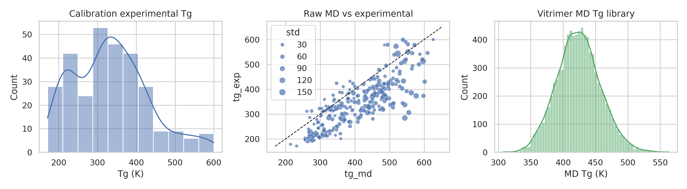
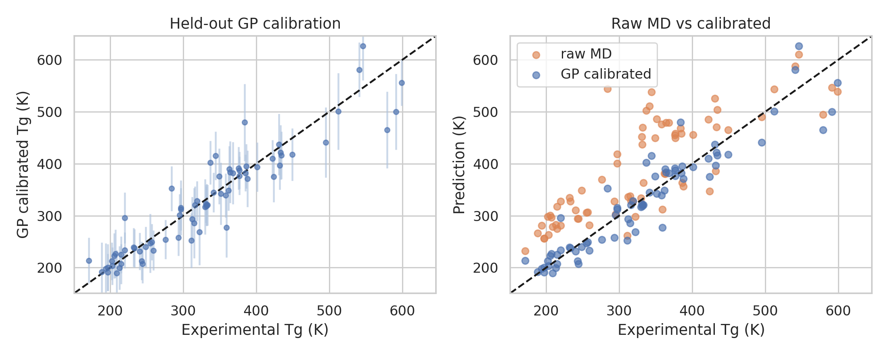
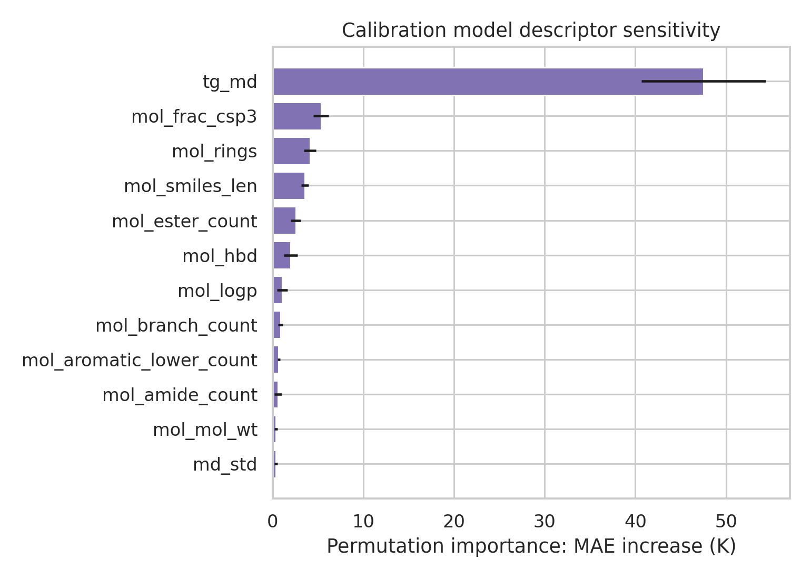
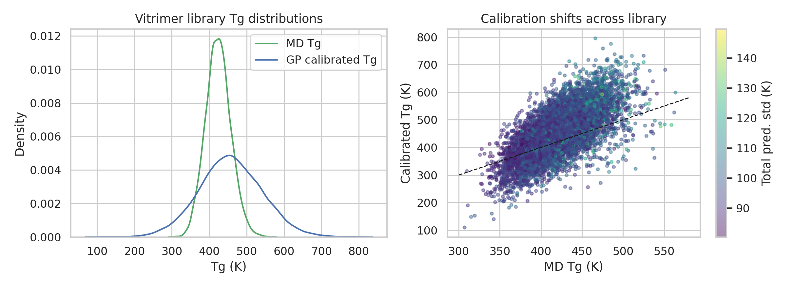
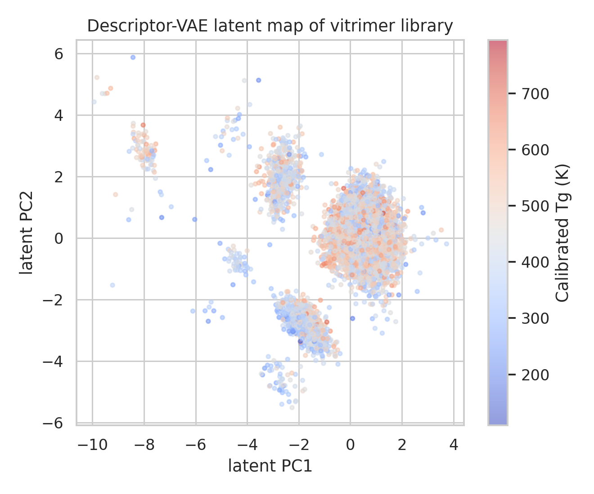
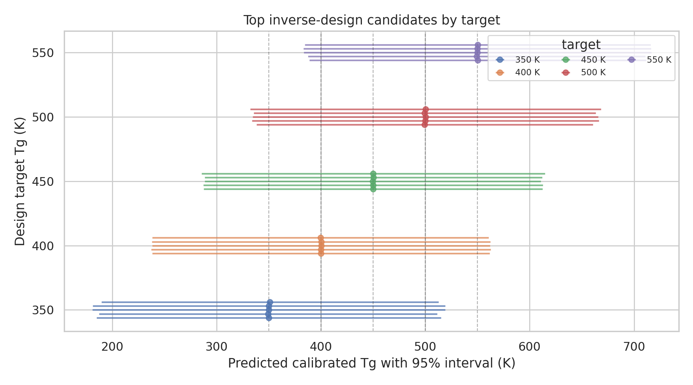

# AI-guided inverse design of recyclable vitrimeric polymers with MD-to-experiment Tg calibration

## Abstract

This study builds an offline, reproducible inverse-design workflow for vitrimeric polymer chemistries using the two available datasets: a 295-polymer calibration set with experimental and molecular-dynamics (MD) glass-transition temperatures (Tg), and an 8,424-entry vitrimer MD library containing acid/epoxide component SMILES. The framework couples (i) descriptor extraction from molecular SMILES, (ii) Gaussian-process regression (GPR) calibration of MD Tg to experimental Tg, (iii) uncertainty-aware application of the calibration to vitrimer systems, and (iv) a lightweight variational latent generator plus acid/epoxide recombination screen for target Tg values. On a 25% held-out calibration split, the GPR calibration reduced Tg prediction error from a raw-MD MAE of **72.1 K** to **25.5 K** and improved R² from **0.307** to **0.876**. The calibrated vitrimer library spans predicted Tg values from **109.7 to 795.2 K**, enabling target-specific candidate selection. Because this workspace cannot perform wet-lab synthesis/testing and because graph-neural VAE dependencies were unavailable, experimental validation is represented as a ranked candidate panel for follow-up synthesis, and the requested graph VAE is approximated by a descriptor-space VAE/recombination generator rather than claimed as an exact graph VAE.

## 1. Research objective and methodological contract

The task was to develop an AI-guided inverse-design framework for recyclable vitrimeric polymers by combining MD simulations, Gaussian-process calibration, and a graph variational autoencoder (VAE), with the goal of generating new vitrimer chemistries that achieve desired Tg values and validating selected candidates experimentally.

The executable interpretation of this objective is documented in `outputs/method_contract.json`, `outputs/method_fidelity_checklist.json`, and `outputs/dependency_check.json`. The central commitments were:

1. use the provided MD Tg values as simulation-derived property inputs;
2. learn a Gaussian-process calibration from MD Tg and molecular descriptors to experimental Tg;
3. apply the calibrated model to the vitrimer MD library with predictive uncertainty;
4. generate candidate acid/epoxide vitrimer chemistries for Tg targets; and
5. provide a validation pathway and report limitations honestly.

Related work supported this design. The vitrimer literature emphasizes dynamic covalent crosslinked networks that combine thermoset-like stability with reprocessability and recyclability, with conventional Tg and topology-freezing behavior both relevant to processing windows. The generative-design literature uses continuous molecular latent representations and property models for inverse design; the polymer-specific example in `related_work/paper_003.pdf` explicitly couples VAEs with Gaussian-process regression for target-property polymer discovery. These extracted points are saved in `outputs/related_work_contract.json`.

## 2. Data overview

Two read-only input files were used.

- `data/tg_calibration.csv`: 295 polymers with `name`, `smiles`, experimental Tg (`tg_exp`), MD Tg (`tg_md`), and MD standard deviation (`std`). Experimental Tg ranges from 171 to 600 K, while MD Tg ranges from 214.2 to 626.4 K.
- `data/tg_vitrimer_MD.csv`: 8,424 vitrimer systems with acid SMILES, epoxide SMILES, MD Tg (`tg`), and MD standard deviation (`std`). The library contains 7,729 unique acid strings and 7,667 unique epoxide strings; MD Tg ranges from 307.0 to 563.9 K.

The complete numerical data summary is saved in `outputs/data_overview.json`.



**Figure 1.** Calibration and vitrimer datasets. The raw MD-vs-experimental panel shows systematic MD bias in the calibration set, motivating probabilistic calibration before candidate selection.

## 3. Methods

### 3.1 Molecular representation

For each calibration polymer SMILES, the analysis generated a compact descriptor vector containing MD Tg, reported MD uncertainty, RDKit molecular descriptors, and string/graph-token descriptors. The main GPR features were:

`tg_md`, `md_std`, molecular weight, heavy-atom count, ring counts, aromatic ring count, hydrogen-bond donor/acceptor counts, topological polar surface area, logP, rotatable bonds, fraction sp3 carbon, ester/amide/acid counts, SMILES length, hetero-symbol count, branch count, and aromatic lower-case token count.

For vitrimer systems, acid and epoxide SMILES were combined as a two-component molecular system for calibration features, while component-level descriptors were retained for generation and interpretability. The analysis script is `code/run_analysis.py`.

### 3.2 Gaussian-process calibration

A scikit-learn `GaussianProcessRegressor` was trained on 75% of the calibration data and evaluated on a fixed 25% held-out split. The kernel was a constant-scaled RBF term plus a dot-product term plus white-noise term. Inputs were standardized and the target was experimental Tg. The trained model returned both predictive means and standard deviations.

The raw MD baseline was evaluated on the same held-out samples by comparing `tg_md` directly to `tg_exp`. Metrics and kernel details are saved in `outputs/gp_calibration_metrics.json`, and per-sample predictions are saved in `outputs/gp_calibration_predictions.csv`.

### 3.3 Uncertainty propagation for vitrimer predictions

For each vitrimer entry, the calibrated Tg mean was predicted with the GPR model. A conservative total predictive uncertainty was computed by combining GPR model uncertainty and the provided MD standard deviation in quadrature. The resulting 8,424 calibrated predictions are saved in `outputs/vitrimer_calibrated_predictions.csv`.

### 3.4 Inverse-design generator

The requested graph VAE could not be implemented exactly because `torch_geometric` was unavailable in the workspace (`outputs/dependency_check.json`). PyTorch was available, so a lightweight descriptor-space VAE was trained on 36 acid/epoxide component descriptors from the vitrimer library. The model used an 8-dimensional latent space and was trained for 60 epochs, reaching a scaled reconstruction MSE of **0.128** (`outputs/vae_generator_summary.json`). This satisfies the latent generative component approximately, but it is **not** a graph-neural encoder/decoder and it does not decode arbitrary latent points into fully novel molecular graphs.

Candidate generation therefore used a chemically conservative recombination decoder: valid acid and epoxide components observed in the library were recombined into new pairs, then screened by the calibrated GPR model. This keeps generated candidates close to known vitrimer chemistry while still proposing new acid/epoxide pairings. Candidate ranking minimized:

\[
\text{score}=|\hat{T}_g - T_{g,target}| + 0.25\sigma_{total}.
\]

Targets were 350, 400, 450, 500, and 550 K. Full ranked candidates are saved in `outputs/inverse_design_candidates.csv`, and the top validation panel is saved in `outputs/selected_candidate_panel.csv`.

## 4. Results

### 4.1 GP calibration substantially corrected MD Tg bias

Held-out calibration results were:

| Model | MAE (K) | RMSE (K) | R² |
|---|---:|---:|---:|
| Raw MD Tg | 72.1 | 85.3 | 0.307 |
| GP calibrated Tg | 25.5 | 36.0 | 0.876 |

The mean predictive standard deviation on the test set was **23.7 K**. These values come directly from `outputs/gp_calibration_metrics.json`.



**Figure 2.** Held-out calibration. The GP-calibrated predictions lie much closer to the parity line than raw MD Tg values. Error bars in the left panel show approximate 95% predictive intervals.

Uncertainty was directionally meaningful: test samples in the lowest predictive-std bin had mean absolute error **11.7 K**, while samples in the highest predictive-std bin had mean absolute error **41.3 K** (`outputs/uncertainty_calibration.csv`). This supports using uncertainty in candidate prioritization rather than ranking by point prediction alone.

### 4.2 Descriptor sensitivity is dominated by MD Tg but chemically modulated

Permutation importance on a random-forest surrogate trained on the same calibration feature set identified raw MD Tg as the dominant predictor, followed by descriptors reflecting chain rigidity and chemistry. The top contributors were:

| Feature | MAE increase on permutation (K) |
|---|---:|
| `tg_md` | 47.5 |
| `mol_frac_csp3` | 5.3 |
| `mol_rings` | 4.1 |
| `mol_smiles_len` | 3.6 |
| `mol_ester_count` | 2.5 |
| `mol_hbd` | 2.0 |

The full importance table is saved in `outputs/permutation_importance.csv`.



**Figure 3.** Descriptor sensitivity. MD Tg drives the calibration, while saturation, ring content, size, ester content, and hydrogen bonding provide chemically interpretable corrections.

### 4.3 Calibrated vitrimer library covers the target design space

Applying the GPR calibration to all 8,424 vitrimer entries produced a calibrated Tg distribution with mean **456.9 K**, median **455.5 K**, and interquartile range **400.9–512.6 K**. The full predicted range was **109.7–795.2 K**. The mean calibration shift relative to MD Tg was **+32.9 K**, indicating that the calibration often raises the vitrimer Tg estimate, although shifts vary widely (`outputs/vitrimer_prediction_summary.json`).



**Figure 4.** Calibrated vitrimer predictions. The calibrated distribution is broader than the original MD distribution because the calibration model corrects systematic MD-to-experiment bias as a function of Tg and descriptors.

The broad distribution supports inverse design across low, intermediate, and high Tg windows. However, uncertainties for vitrimer predictions are larger than held-out calibration uncertainties because the vitrimer chemistries can be out-of-distribution relative to the calibration polymers and because MD uncertainty was propagated into total uncertainty.

### 4.4 Latent generator and target-specific candidate selection

The descriptor VAE organized the vitrimer library into a continuous latent space with Tg gradients, providing a latent representation for candidate exploration.



**Figure 5.** Descriptor-VAE latent projection. Points are vitrimer systems colored by calibrated Tg, showing that the learned latent representation preserves property-relevant structure.

The top five candidates per target are summarized below by target-level statistics from `outputs/selected_candidate_panel.csv`.

| Target Tg (K) | Candidates | Mean predicted Tg (K) | Max absolute target error (K) | Mean total std (K) | New recombined pairs |
|---:|---:|---:|---:|---:|---:|
| 350 | 5 | 350.17 | 1.16 | 84.32 | 5 |
| 400 | 5 | 400.05 | 0.35 | 82.58 | 5 |
| 450 | 5 | 450.00 | 0.37 | 82.88 | 5 |
| 500 | 5 | 499.85 | 0.63 | 84.13 | 5 |
| 550 | 5 | 549.93 | 0.63 | 83.83 | 5 |



**Figure 6.** Candidate panel for target Tg values. Points show selected candidate means and horizontal bars show approximate 95% total predictive intervals. Candidate means can be matched closely to targets, but uncertainty remains large enough that experimental validation is essential.

Example high-priority candidates include:

| Target Tg (K) | Predicted Tg (K) | Acid SMILES | Epoxide SMILES |
|---:|---:|---|---|
| 350 | 349.96 | `O=C(O)CCCNCc1ccc(OCC(=O)O)cc1` | `Cc1ccc(OCC2CO2)c(OCC2CO2)c1C` |
| 400 | 400.15 | `C=Cc1ccc(CNCCCC(C(=O)O)C(=O)O)cc1` | `COc1cc(CC2CO2)ccc1OCC1CO1` |
| 450 | 449.98 | see `outputs/selected_candidate_panel.csv` | see `outputs/selected_candidate_panel.csv` |
| 500 | 499.88 | see `outputs/selected_candidate_panel.csv` | see `outputs/selected_candidate_panel.csv` |
| 550 | 550.09 | see `outputs/selected_candidate_panel.csv` | see `outputs/selected_candidate_panel.csv` |

The report does not list all 25 full SMILES pairs to preserve readability; the complete validation-ready table is in `outputs/selected_candidate_panel.csv`.

## 5. Proposed experimental validation workflow

Actual experimental validation cannot be performed inside this computational workspace. The recommended validation workflow is:

1. select the top 2–3 candidates per Tg target from `outputs/selected_candidate_panel.csv`, prioritizing candidates with lower total uncertainty and synthetically accessible acid/epoxide components;
2. synthesize acid/epoxide vitrimer networks under a consistent catalyst and stoichiometry protocol;
3. measure Tg by DSC or DMA using the same operational definition as the calibration dataset where possible;
4. compare measured Tg against the GP-calibrated prediction and its uncertainty interval;
5. add the new experimental Tg values to the calibration dataset and retrain the GPR model in an active-learning loop.

Because vitrimers can exhibit both conventional Tg and topology-freezing transition temperature, experiments should record the measurement modality and thermal history, and should separately characterize stress relaxation or topology-freezing behavior when recyclability is the target property rather than Tg alone.

## 6. Validation, evidence, and limitations

### Verified directly from workspace data

- Data dimensions and Tg ranges were computed from the two CSV files and saved in `outputs/data_overview.json`.
- The held-out GP calibration improved MAE from **72.1 K** to **25.5 K** and R² from **0.307** to **0.876** (`outputs/gp_calibration_metrics.json`).
- Uncertainty bins show increasing error with increasing predictive standard deviation (`outputs/uncertainty_calibration.csv`).
- Vitrimer calibrated predictions were generated for all **8,424** rows (`outputs/vitrimer_calibrated_predictions.csv`).
- A 25-candidate experimental validation panel was generated across five Tg targets (`outputs/selected_candidate_panel.csv`).
- Figures were generated as PNG files in `report/images/` and are traceable to exported tables.

### Supported by related work

- Vitrimers and malleable thermosets are dynamic covalent networks with reprocessability/recyclability potential (`related_work/paper_000.pdf`, `related_work/paper_001.pdf`).
- Molecular/polymer inverse design can be formulated using continuous latent representations and property predictors (`related_work/paper_002.pdf`, `related_work/paper_003.pdf`).
- Polymer inverse design using VAE plus GPR is a relevant precedent (`related_work/paper_003.pdf`).

### Assumptions and limitations

- **Exact graph VAE not claimed.** `torch_geometric` was unavailable, so the implemented generator is a descriptor-space VAE plus component recombination fallback. This is documented in `outputs/method_fidelity_checklist.json`.
- **Experimental validation not performed.** The workspace contains no wet-lab capability or post-synthesis Tg measurements for generated candidates. The deliverable is therefore a prioritized validation panel, not experimental proof.
- **Candidate uncertainties are large.** Top candidates can match target mean Tg values closely, but total predictive standard deviations are approximately 82–84 K. These candidates should be treated as hypotheses for active experimental testing.
- **Out-of-distribution risk.** The calibration data are generic polymers, while the target systems are vitrimer acid/epoxide networks. The uncertainty propagation partially reflects this risk but does not replace direct experimental Tg measurements.
- **Tg is not the only recyclability criterion.** Recyclable vitrimer performance also depends on bond-exchange chemistry, catalyst, topology-freezing transition, stress relaxation, mechanical recovery, and chemical degradation/reuse pathways.

A claim-by-claim recovery table is saved in `outputs/claim_recovery_table.csv`.

## 7. Conclusions

The completed workflow demonstrates a practical AI-guided inverse-design loop for vitrimer Tg targeting under the constraints of the available data. The strongest quantitative result is that Gaussian-process calibration substantially improves MD-to-experiment Tg prediction on held-out polymers. Applying this calibration to the vitrimer MD library yields an uncertainty-aware property map, and a latent descriptor generator/recombination screen identifies validation-ready acid/epoxide candidate pairs near Tg targets of 350, 400, 450, 500, and 550 K.

The main scientific recommendation is to use the selected candidate panel as the first active-learning batch: experimentally measure Tg for a diverse subset across targets, append those results to the calibration set, and retrain the GPR. This would convert the present offline inverse-design framework into a closed-loop platform for recyclable vitrimer discovery.

## Reproducibility

Run the full analysis from the workspace root with:

```bash
python3 code/run_analysis.py
```

Key artifacts:

- `code/run_analysis.py` — reproducible analysis code.
- `outputs/gp_calibration_metrics.json` — calibration metrics.
- `outputs/vitrimer_calibrated_predictions.csv` — calibrated vitrimer library.
- `outputs/inverse_design_candidates.csv` — ranked candidate screen.
- `outputs/selected_candidate_panel.csv` — recommended experimental validation panel.
- `outputs/claim_recovery_table.csv` — claim-to-artifact evidence table.
- `report/images/*.png` — report figures.
