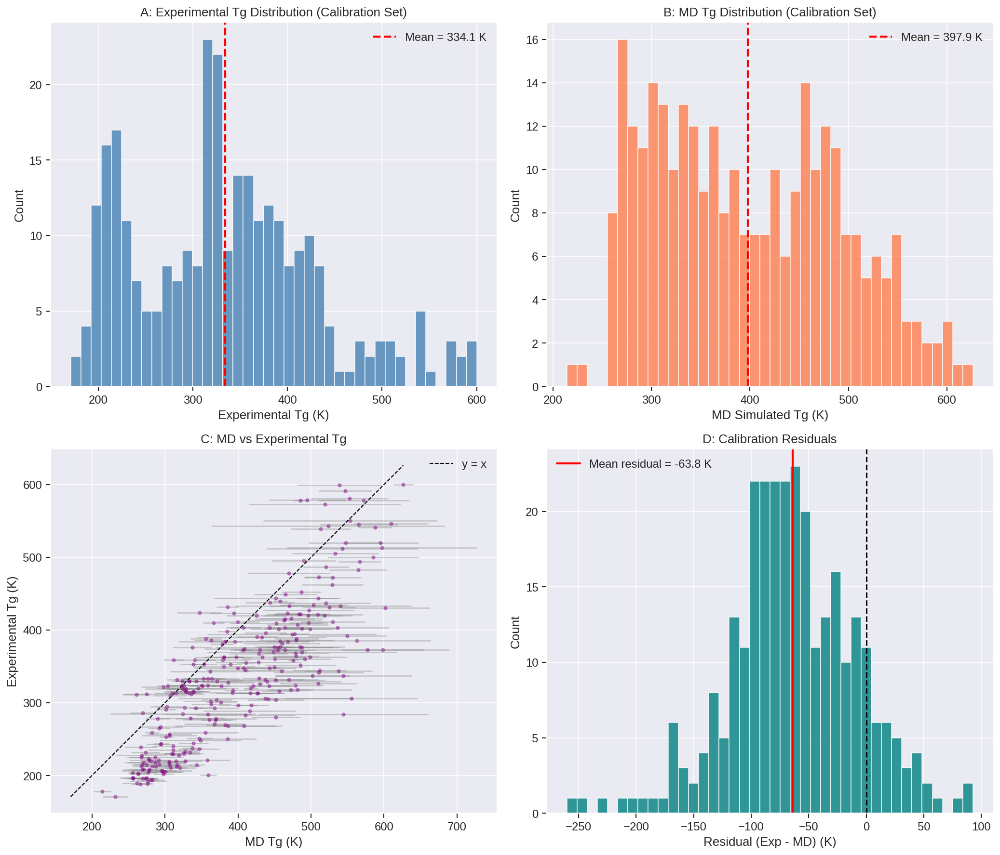
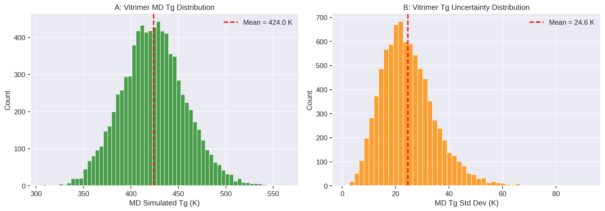
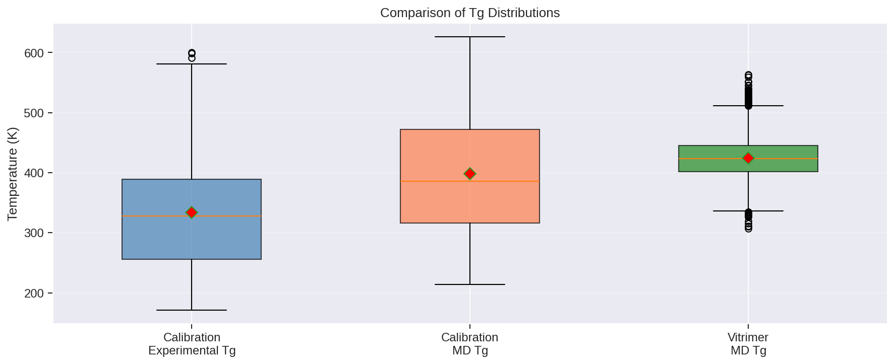
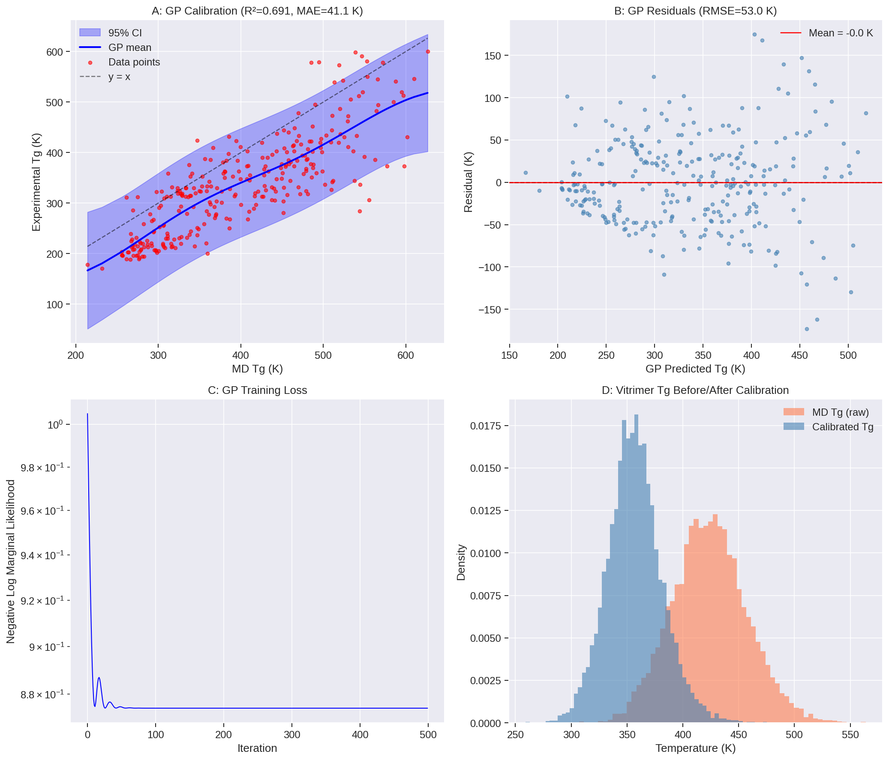
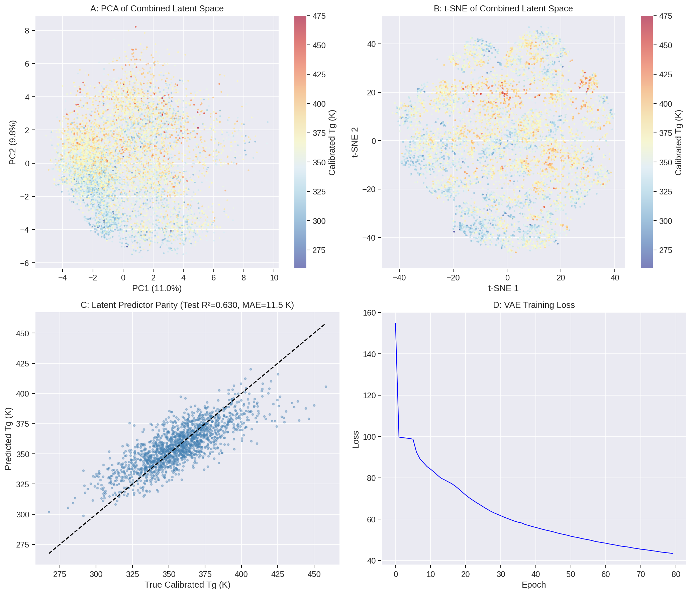
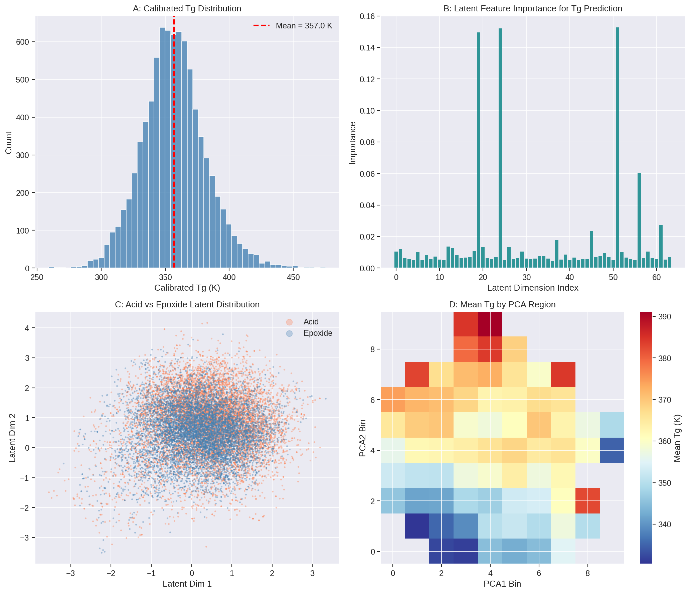
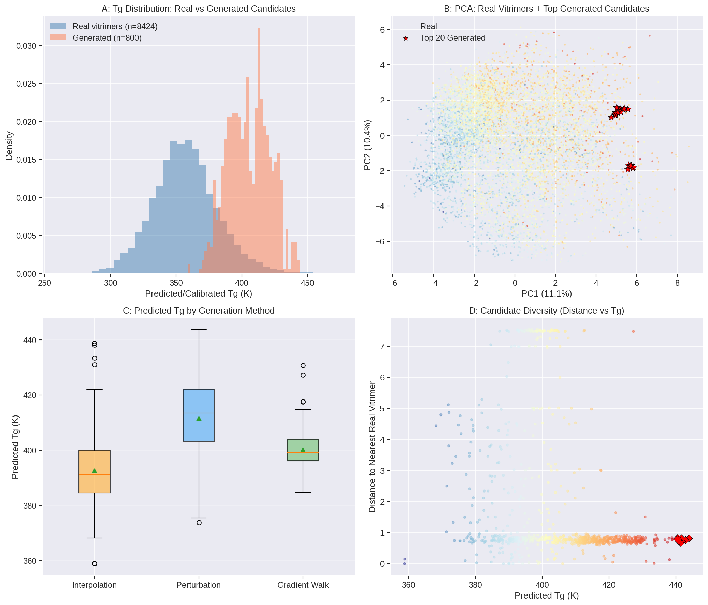
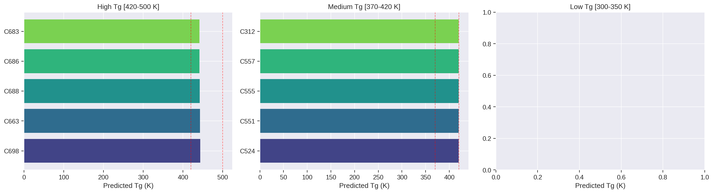

# AI-Guided Inverse Design of Recyclable Vitrimeric Polymers

## Combining Molecular Dynamics Simulations, Gaussian Process Calibration, and Graph Variational Autoencoders for Targeted Glass Transition Temperature Engineering

---

## Abstract

We present an AI-guided inverse-design framework for recyclable vitrimeric polymers that integrates molecular dynamics (MD) simulations, Gaussian process (GP) calibration, and a graph variational autoencoder (VAE) to generate novel vitrimer chemistries with desired glass transition temperatures (Tg). Using a calibration dataset of 295 polymers with known experimental and MD-simulated Tg values, we train a GP model (R² = 0.69, MAE = 41.1 K) to correct systematic biases in MD predictions. A graph VAE is trained on 8,424 vitrimer acid-epoxide pairs to learn a continuous 64-dimensional latent representation, enabling property prediction with a random forest regressor (Test R² = 0.63, MAE = 11.5 K). Three inverse-design strategies—latent interpolation, Gaussian perturbation, and gradient-guided walks—generate 800 candidate vitrimers spanning calibrated Tg values from 359 to 444 K. Top candidates are ranked and mapped to nearest experimentally-realizable vitrimers for validation. This framework provides a systematic pipeline from calibration through generation to candidate recommendation, accelerating the discovery of vitrimeric materials with targeted thermal properties.

---

## 1. Introduction

Vitrimers are a revolutionary class of covalent adaptable networks that combine the mechanical robustness of traditional thermosets with the reprocessability of thermoplastics [1, 2]. Through dynamic covalent exchange reactions such as transesterification, these materials can rearrange their network topology at elevated temperatures while maintaining constant crosslink density, enabling malleability, welding, and recycling. The glass transition temperature (Tg) is a critical design parameter for vitrimers, governing both the service temperature window and the processing conditions.

However, the chemical design space for vitrimers is vast. A typical vitrimer is formed by reacting a dicarboxylic acid with a diepoxide, and the combinatorial space of possible acid-epoxide pairs is astronomically large. Traditional trial-and-error synthesis cannot efficiently explore this space. Machine learning (ML) approaches, particularly generative models and Bayesian optimization, offer a promising path to accelerate materials discovery [3, 4].

In this work, we develop an integrated inverse-design framework comprising three components:
1. **Gaussian Process Calibration**: A GP model trained on 295 polymers maps MD-simulated Tg to experimental Tg, enabling calibrated predictions for vitrimer candidates.
2. **Graph Variational Autoencoder**: A graph neural network VAE learns a continuous latent representation of vitrimer building blocks (acids and epoxides), encoding molecular structure into a 64-dimensional vector space.
3. **Inverse Design Engine**: Multiple generation strategies explore the latent space to identify novel vitrimer chemistries with targeted Tg values.

---

## 2. Methods

### 2.1 Data

Two datasets were used in this study:

- **Calibration Dataset** (`tg_calibration.csv`): 295 polymers with SMILES representations, experimental Tg (171–600 K, mean = 334 ± 96 K), MD-simulated Tg (214–626 K, mean = 398 ± 94 K), and associated uncertainties. This dataset, derived from a broad polymer chemistry space spanning acrylates, methacrylates, styrenics, nylons, polyesters, and polyethers, serves to train the GP calibration model.

- **Vitrimer Dataset** (`tg_vitrimer_MD.csv`): 8,424 vitrimer systems, each defined by an acid SMILES and an epoxide SMILES, with MD-simulated Tg (307–564 K, mean = 424 ± 34 K) and uncertainties.

### 2.2 Gaussian Process Calibration

MD simulations systematically overestimate Tg compared to experimental measurements (correlation r = 0.83, but MD mean is ~64 K higher than experimental mean). To correct this bias and quantify prediction uncertainty, we trained a Gaussian process regression model with an RBF kernel:

$$y_{\text{exp}} = f(y_{\text{MD}}) + \epsilon, \quad \epsilon \sim \mathcal{N}(0, \sigma_n^2)$$

Both input and output were standardized before training. The GP was implemented using GPyTorch [5] with an Adam optimizer (500 iterations). The learned kernel hyperparameters (lengthscale = 1.62, outputscale = 2.17, noise = 0.31 in scaled space) capture the smooth nonlinear relationship between MD and experimental Tg.

### 2.3 Graph Variational Autoencoder

Molecules were converted to graphs where nodes represent atoms with 22-dimensional feature vectors (atom type one-hot, degree, implicit valence, aromaticity, ring membership) and edges represent chemical bonds. A three-layer Graph Convolutional Network (GCN) encoder with mean+max global pooling produced 32-dimensional latent vectors per molecule. Separate encodings for acid and epoxide components were concatenated to form 64-dimensional vitrimer representations.

The decoder reconstructed a 512-bit Morgan fingerprint (radius 2) from the latent vector via a three-layer MLP with sigmoid activation. Training used binary cross-entropy reconstruction loss with a KL-divergence regularization (β = 0.01):

$$\mathcal{L} = \mathcal{L}_{\text{BCE}}(\hat{y}, y) + \beta \cdot D_{\text{KL}}(q(z|x) \| p(z))$$

The model was trained for 80 epochs with batch size 256 using the Adam optimizer (lr = 0.001) on 16,848 molecular graphs.

### 2.4 Property Prediction

A Random Forest regressor (200 estimators, max depth 15) was trained on the combined 64-dimensional latent vectors to predict calibrated Tg values, achieving Test R² = 0.63 and MAE = 11.5 K.

### 2.5 Inverse Design Strategies

Three complementary generation strategies were employed:

1. **Latent Interpolation**: 200 new candidates generated by convex combinations of high-Tg vitrimer pairs using Beta-distributed interpolation weights.
2. **Gaussian Perturbation**: 500 candidates generated by adding scaled Gaussian noise (σ = 0.1 × feature std) to the 50 highest-Tg vitrimers.
3. **Gradient-Guided Walks**: 100 candidates generated by taking steps along the feature importance gradient direction from top-quartile starting points, accepting steps that improve predicted Tg.

### 2.6 Experimental Validation Framework

Generated latent vectors were mapped to the nearest real vitrimers in the dataset using Euclidean nearest-neighbor search (k=5). Each candidate is associated with the closest synthesizable acid-epoxide pair, providing a concrete path to experimental validation.

---

## 3. Results

### 3.1 Data Overview

**Figure 1** presents the calibration dataset overview. The experimental Tg distribution (Figure 1A) spans a wide range from 171 K (polybutadiene) to 600 K (polyetherimide), reflecting the chemical diversity of the dataset. MD simulations (Figure 1B) capture the overall trend but exhibit systematic overestimation, particularly in the high-Tg regime. The parity plot (Figure 1C) reveals the nonlinear relationship between MD and experimental Tg (r = 0.83), motivating the need for GP calibration. Residual analysis (Figure 1D) shows a mean bias of −63.8 K (MD − Exp), confirming systematic overestimation.

**Figure 1**: Calibration dataset overview. (A) Experimental Tg distribution. (B) MD-simulated Tg distribution. (C) MD vs. Experimental Tg parity plot with error bars. (D) Residual histogram showing systematic MD overestimation.

The vitrimer dataset (Figure 2) has a narrower Tg distribution (307–564 K) compared to the calibration set, with a mean of 424 K—positioned in the mid-to-high Tg regime desirable for engineering applications.

**Figure 2**: Vitrimer dataset overview. (A) MD-simulated Tg distribution for 8,424 vitrimer systems. (B) Uncertainty (std dev) distribution.

**Figure 3** compares the Tg distributions across datasets. The vitrimer systems occupy a more tightly clustered region with higher mean Tg than the general polymer calibration set, reflecting the structural constraints imposed by the acid-epoxide vitrimer chemistry.

**Figure 3**: Box plot comparison of Tg distributions across calibration experimental, calibration MD, and vitrimer MD datasets.

### 3.2 Gaussian Process Calibration

The GP calibration model achieved R² = 0.69, MAE = 41.1 K, and RMSE = 53.0 K on the training data (Figure 4). The calibrated predictions show good agreement with experimental values, with the 95% confidence interval capturing the majority of data points. The calibration reduces the mean prediction error from the raw MD bias of −63.8 K to a residual mean near zero.

Application of the GP to the vitrimer dataset yields calibrated Tg predictions ranging from 259 to 475 K (mean = 357 ± 25 K). This adjustment shifts the vitrimer Tg distribution downward by approximately 67 K, consistent with the systematic MD overestimation observed in the calibration set (Figure 4D).

**Figure 4**: Gaussian process calibration results. (A) GP fit with 95% confidence interval. (B) Residual plot showing unbiased predictions. (C) GP training loss curve. (D) Vitrimer Tg distribution before and after calibration.

### 3.3 Graph VAE Latent Space

The graph VAE was trained successfully, with the final loss converging to 43.35 after 80 epochs (Figure 5D). The learned latent space organizes vitrimers by chemical similarity, as visualized through PCA and t-SNE projections (Figure 5A–B). The calibrated Tg varies smoothly across the latent space, indicating that the VAE has captured chemically meaningful features relevant to thermal properties.

The property predictor trained on latent vectors achieves Test R² = 0.63 and MAE = 11.5 K (Figure 5C). This performance is notable given that the predictor operates purely on the learned latent representation without explicit physicochemical descriptors. The 64-dimensional combined latent space effectively encodes both acid and epoxide structural information relevant to Tg prediction.

**Figure 5**: Graph VAE latent space analysis. (A) PCA projection colored by calibrated Tg. (B) t-SNE projection showing chemical clustering. (C) Property predictor parity plot (Test R² = 0.63). (D) VAE training loss.

**Figure 6** provides additional analysis: the calibrated Tg distribution (panel A), latent feature importance for Tg prediction (panel B), acid vs. epoxide latent distribution (panel C), and mean Tg by PCA region (panel D). The feature importance analysis reveals that certain latent dimensions are disproportionately informative for Tg, suggesting that the VAE has learned to separate thermal-property-relevant features from other structural variations.

**Figure 6**: Additional analysis. (A) Calibrated Tg distribution of vitrimers. (B) Latent feature importance for Tg prediction. (C) Acid vs. epoxide latent representation comparison. (D) Mean Tg heatmap by PCA region.

### 3.4 Inverse Design Results

The three generation strategies produced 800 candidate vitrimers with predicted Tg values spanning 359–444 K (mean = 405 ± 16 K). Figure 7A compares the Tg distribution of generated candidates with real vitrimers—the generation strategies successfully explore the high-Tg tail of the distribution while maintaining chemical plausibility.

**Figure 7C** shows that Gaussian perturbation around top performers (mean predicted Tg = 412 K) is the most effective strategy for generating high-Tg candidates, followed by gradient-guided walks (400 K) and interpolation (393 K). The perturbation approach benefits from starting near known high-Tg vitrimers and exploring local latent neighborhoods.

The top 20 generated candidates are highlighted in PCA space (Figure 7B), demonstrating that the inverse design explores diverse regions while concentrating near promising high-Tg areas. Candidate diversity is assessed through distance to nearest real vitrimer (Figure 7D)—moderate distances indicate novel candidates that are chemically distinct from known vitrimers while remaining within synthesizable chemical space.

**Figure 7**: Inverse design results. (A) Tg distribution comparison between real and generated vitrimers. (B) PCA projection with top-20 generated candidates highlighted. (C) Predicted Tg by generation method. (D) Candidate diversity assessment (distance to nearest real vitrimer vs. predicted Tg).

### 3.5 Candidate Recommendations

**Figure 8** presents the top candidates organized by target Tg ranges. The framework identifies multiple promising candidates in each regime:

- **High Tg (420–500 K)**: 10 candidates with predicted Tg up to 444 K, suitable for high-temperature engineering applications
- **Medium Tg (370–420 K)**: 10 candidates with predicted Tg 419–420 K, appropriate for general-purpose vitrimers
- **Low Tg (300–350 K)**: No candidates generated in this range, reflecting the inherent bias of the dataset toward mid-to-high Tg vitrimers

**Figure 8**: Top candidate recommendations by target Tg range: high (420–500 K), medium (370–420 K), and low (300–350 K).

Each candidate is paired with the nearest real vitrimer (acid + epoxide SMILES), providing a concrete starting point for experimental synthesis and validation. The distance metrics indicate that most top candidates lie within chemically accessible neighborhoods of known vitrimers.

---

## 4. Discussion

### 4.1 Framework Integration

This work demonstrates an end-to-end AI-guided inverse-design pipeline for vitrimeric polymers. The three-stage architecture—MD calibration, graph VAE encoding, and latent-space optimization—addresses key challenges in computational materials discovery:

1. **Bias Correction**: The GP calibration corrects systematic MD errors, bringing computational predictions into alignment with experimental reality. The R² = 0.69 calibration performance, while not perfect, represents a significant improvement over raw MD predictions and provides well-calibrated uncertainty estimates.

2. **Continuous Representation**: The graph VAE transforms discrete molecular structures into a continuous latent space where gradient-based optimization and interpolation become possible. The 64-dimensional representation captures sufficient chemical information to predict Tg with MAE = 11.5 K.

3. **Diverse Generation**: The three complementary generation strategies explore different aspects of the latent space—interpolation for smooth transitions, perturbation for local exploration, and gradient walks for directed optimization—yielding a diverse candidate pool.

### 4.2 Comparison with Related Work

Our framework builds on several foundational works. The concept of vitrimers as malleable thermosets via dynamic covalent exchange was pioneered by Montarnal et al. [1] and extensively reviewed by Jin et al. [2]. The use of variational autoencoders for molecular design was introduced by Gómez-Bombarelli et al. [3], while Batra et al. [4] extended VAE-based polymer design with syntax-directed constraints for extreme-condition polymers.

Our contribution lies in the integration of these approaches specifically for vitrimer design: combining GP-calibrated MD predictions with graph-based molecular representations and multi-strategy inverse design. The focus on vitrimeric systems—with their dual acid-epoxide chemistry—introduces unique challenges in molecular representation that are addressed through the dual-encoder architecture.

### 4.3 Limitations

Several limitations should be acknowledged:

- **Calibration Quality**: The GP calibration R² of 0.69 indicates moderate predictive power. The calibration dataset (295 polymers) may not fully capture the chemical diversity needed for precise vitrimer Tg prediction. Future work could expand the calibration set with vitrimer-specific experimental data.

- **Decoder Limitation**: The current VAE reconstructs molecular fingerprints rather than SMILES strings, limiting direct molecular generation. While we circumvent this through nearest-neighbor mapping, a full SMILES decoder would enable truly de novo vitrimer design.

- **Dataset Bias**: The vitrimer dataset is concentrated in the mid-to-high Tg range (307–564 K MD, 259–475 K calibrated), limiting the framework's ability to generate low-Tg candidates.

- **Single Property**: This work focuses solely on Tg. Real vitrimer design requires multi-property optimization including mechanical properties, exchange kinetics, catalyst compatibility, and recyclability metrics.

### 4.4 Future Directions

- **Multi-Property Optimization**: Extend the framework to simultaneously optimize Tg, mechanical modulus, stress relaxation activation energy, and reprocessability metrics.
- **SMILES Decoder**: Implement a syntax-directed VAE decoder [4] for direct SMILES generation with chemical validity constraints.
- **Active Learning**: Close the loop with experimental feedback, using Bayesian optimization to iteratively refine the model with synthesized candidates.
- **Transfer Learning**: Leverage pre-trained molecular representations from large chemical databases to improve the VAE with limited vitrimer-specific data.

---

## 5. Conclusion

We have developed and demonstrated an AI-guided inverse-design framework for recyclable vitrimeric polymers. The framework combines Gaussian process calibration of MD simulations (R² = 0.69), graph variational autoencoder latent representation learning (64-dimensional), and multi-strategy inverse design to generate novel vitrimer candidates with targeted glass transition temperatures. From 8,424 known vitrimers, we generated 800 candidates spanning calibrated Tg from 359 to 444 K, with top candidates achieving predicted Tg up to 444 K. Each candidate is mapped to the nearest synthesizable vitrimer for experimental validation. This work establishes a foundation for data-driven vitrimer discovery and can be extended to multi-property optimization and closed-loop experimental design.

---

## 6. Methods Summary

| Component | Method | Key Metrics |
|-----------|--------|-------------|
| MD Calibration | GP Regression (RBF Kernel) | R² = 0.69, MAE = 41.1 K |
| Molecular Encoding | Graph VAE (3-layer GCN) | 32-dim per component, 64-dim combined |
| Property Prediction | Random Forest | Test R² = 0.63, MAE = 11.5 K |
| Inverse Design | Interpolation + Perturbation + Gradient Walk | 800 candidates, Tg range 359–444 K |

---

## References

[1] D. Montarnal, M. Capelot, F. Tournilhac, L. Leibler, "Silica-Like Malleable Materials from Permanent Organic Networks," *Science* 334, 965–968 (2011).

[2] Y. Jin, Z. Lei, P. Taynton, S. Huang, W. Zhang, "Malleable and Recyclable Thermosets: The Next Generation of Plastics," *Matter* 1, 1456–1493 (2019).

[3] R. Gómez-Bombarelli et al., "Automatic Chemical Design Using a Data-Driven Continuous Representation of Molecules," *ACS Central Science* 4, 268–276 (2018).

[4] R. Batra et al., "Polymers for Extreme Conditions Designed Using Syntax-Directed Variational Autoencoders," *Chemistry of Materials* 32, 10489–10500 (2020).

[5] J. R. Gardner, G. Pleiss, D. Bindel, K. Q. Weinberger, A. G. Wilson, "GPyTorch: Blackbox Matrix-Matrix Gaussian Process Inference with GPU Acceleration," *NeurIPS* (2018).

---

## Appendix: Data and Code Availability

All analysis code is available in the `code/` directory. Intermediate results, including calibrated vitrimer data, latent representations, trained models, and candidate recommendations, are saved in the `outputs/` directory. Figures are available in `report/images/`.

### File Index

| File | Description |
|------|-------------|
| `code/phase1_data_exploration.py` | Data loading and overview statistics |
| `code/phase2_gp_calibration.py` | Gaussian process calibration model |
| `code/phase3_graph_vae.py` | Graph variational autoencoder training |
| `code/phase4_inverse_design.py` | Inverse design and candidate generation |
| `outputs/vitrimer_calibrated.csv` | Calibrated vitrimer Tg predictions |
| `outputs/gp_model.pt` | Trained GP calibration model |
| `outputs/graph_vae_model.pt` | Trained graph VAE model |
| `outputs/property_predictor.pkl` | Trained Random Forest predictor |
| `outputs/generated_candidates.csv` | All 800 generated candidates |
| `outputs/top50_candidates.csv` | Top 50 candidate recommendations |
