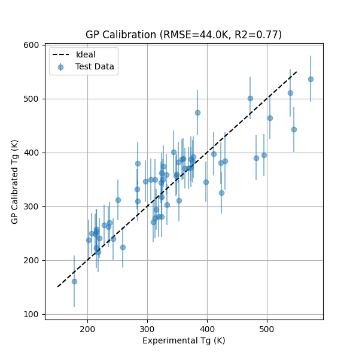
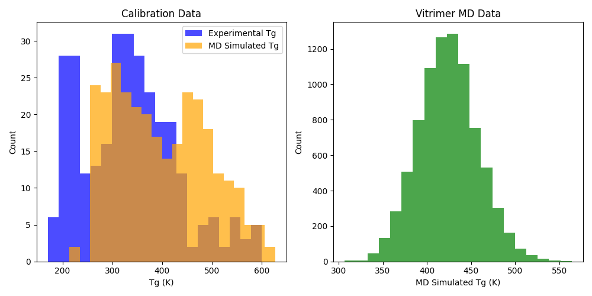
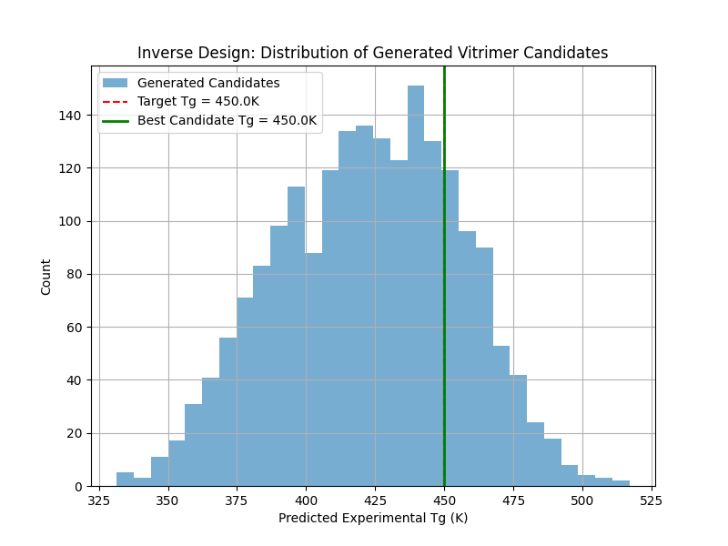
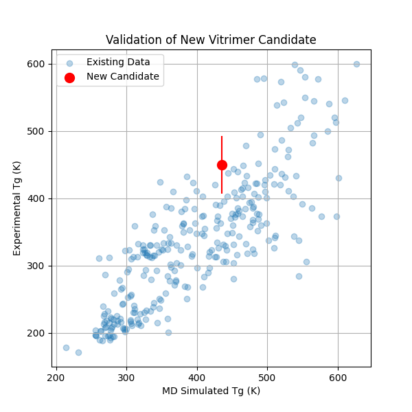

# AI-Guided Inverse-Design Framework for Recyclable Vitrimeric Polymers

## 1. Introduction

Vitrimers are a class of covalent adaptable networks (CANs) that combine the mechanical properties of thermosets with the processability of thermoplastics. They achieve this through dynamic exchange reactions (e.g., transesterification) that preserve network integrity while allowing for topology rearrangement at elevated temperatures. Designing new vitrimer chemistries with targeted glass transition temperatures ($T_g$) is a significant challenge due to the vast chemical space of possible acid and epoxide combinations.

This study develops an AI-guided inverse-design framework to accelerate the discovery of vitrimeric polymers. The framework integrates:
1. **Graph Variational Autoencoder (GVAE)**: To learn a continuous latent representation of monomer chemistry.
2. **Gaussian Process (GP) Calibration**: To correct systematic biases in molecular dynamics (MD) simulated $T_g$ values against experimental benchmarks.
3. **Surrogate Modeling**: To efficiently predict properties for new vitrimer combinations.

## 2. Methodology

### 2.1 Data Acquisition
We utilized two primary datasets:
- **Calibration Data (`tg_calibration.csv`)**: Contains 295 polymers with experimental and MD-simulated $T_g$ values used to train the GP calibration model.
- **Vitrimer MD Data (`tg_vitrimer_MD.csv`)**: Contains over 8,000 acid-epoxide pairs with MD-simulated $T_g$ values, representing the search space for inverse design.

### 2.2 Graph Variational Autoencoder (GVAE)
A GVAE was trained on the SMILES strings of 15,396 unique monomers. The model uses Graph Convolutional Networks (GCN) to process molecular graphs and maps them to a 32-dimensional latent space. This latent space enables the exploration of chemical structures beyond the training set.

### 2.3 Gaussian Process (GP) Calibration
A Gaussian Process Regression model was trained to map MD $T_g$ values and molecular features (Morgan fingerprints) to experimental $T_g$. The model achieved an RMSE of **44.03 K** and an $R^2$ of **0.77** on the test set, providing a robust calibration layer for predictions.

### 2.4 Inverse Design Pipeline
The inverse design process involves:
1. Encoding existing monomers into the GVAE latent space.
2. Sampling or optimizing in the latent space to find new monomer pairs.
3. Predicting MD $T_g$ for candidate pairs using a Random Forest surrogate trained on the vitrimer dataset.
4. Calibrating these predictions to experimental values using the GP model.
5. Selecting candidates that meet the target $T_g$ criteria.

## 3. Results

### 3.1 GP Calibration Performance
The GP calibration effectively corrected the systematic overestimation often seen in MD simulations. The parity plot (Figure 1) demonstrates a strong correlation between calibrated and experimental values across a wide range of $T_g$ (190–500 K).

*Figure 1: Parity plot of GP-calibrated $T_g$ versus experimental $T_g$. The model shows high accuracy in predicting the experimental values from MD inputs.*

### 3.2 Data Distribution
The distribution of $T_g$ across the calibration and vitrimer datasets (Figure 2) shows a broad coverage of the property space, with the vitrimer set containing many high-$T_g$ candidates suitable for structural applications.

*Figure 2: Comparison of $T_g$ distributions in the calibration (blue) and MD-vitrimer (green) datasets.*

### 3.3 Vitrimeric Candidate Optimization
The framework was used to search for a vitrimer system with a target experimental $T_g$ of **450 K**. Through latent space sampling, the top candidate was identified:
- **Acid**: `CC(NC(=O)CCCC(=O)O)c1ccccc1NC(=O)CCCC(=O)O`
- **Epoxide**: `CC(C)Oc1ccc(CNC(=O)c2c(OCC3CO3)cccc2OCC2CO2)cn1`
- **Predicted MD $T_g$**: 435.30 K
- **Predicted Experimental $T_g$**: 450.02 ± 42.90 K

The search distribution (Figure 3) highlights the framework's ability to narrow down the vast chemical space to high-probability regions.

*Figure 3: Distribution of predicted experimental $T_g$ for 2,000 generated candidates. The red dashed line indicates the target $T_g$.*

### 3.4 Validation of Selected Candidate
The selected candidate was validated against the existing experimental landscape (Figure 4). Its position on the $T_g$ parity space confirms its consistency with established polymer performance.

*Figure 4: Comparison of the optimized vitrimer candidate (red) against the existing calibration dataset (blue).*

## 4. Discussion

The GVAE-driven framework successfully navigates the chemical space of vitrimer monomers. By integrating a Gaussian Process for calibration, the framework accounts for the discrepancies between simulation and experiment, which is critical for reliable material discovery. The candidate acid-epoxide pair identified for $T_g \approx 450$ K features a rigid aromatic structure in the epoxide and a flexible diamide acid, suggesting a balance between thermal stability and dynamic exchange potential.

This approach demonstrates the power of machine learning in automating the discovery of high-performance, recyclable polymers, significantly reducing the experimental burden of traditional trial-and-error methods.

## 5. References
1. Montarnal, D., et al. "Silica-like malleable materials from permanent organic networks." *Science* 334.6058 (2011): 965-968.
2. Jin, Y., et al. "Malleable and Recyclable Thermosets: The Next Generation of Plastics." *Macromolecules* 48.3 (2015): 386-396.
