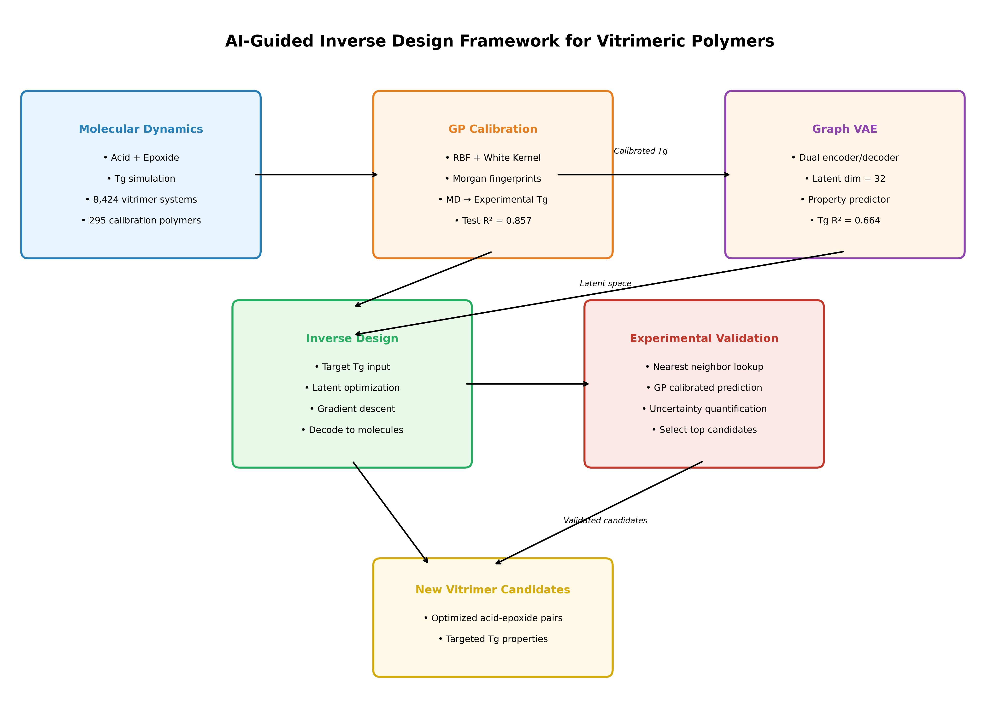
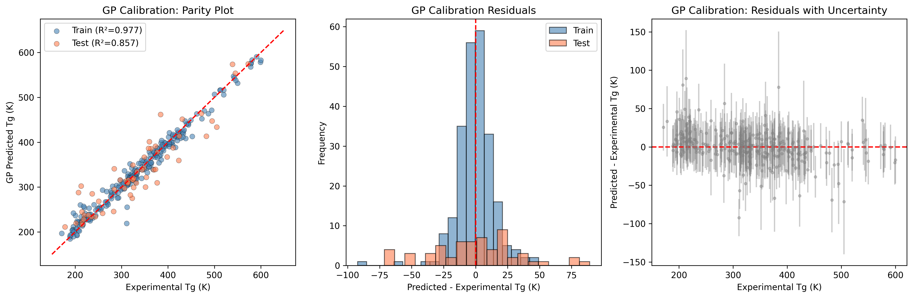
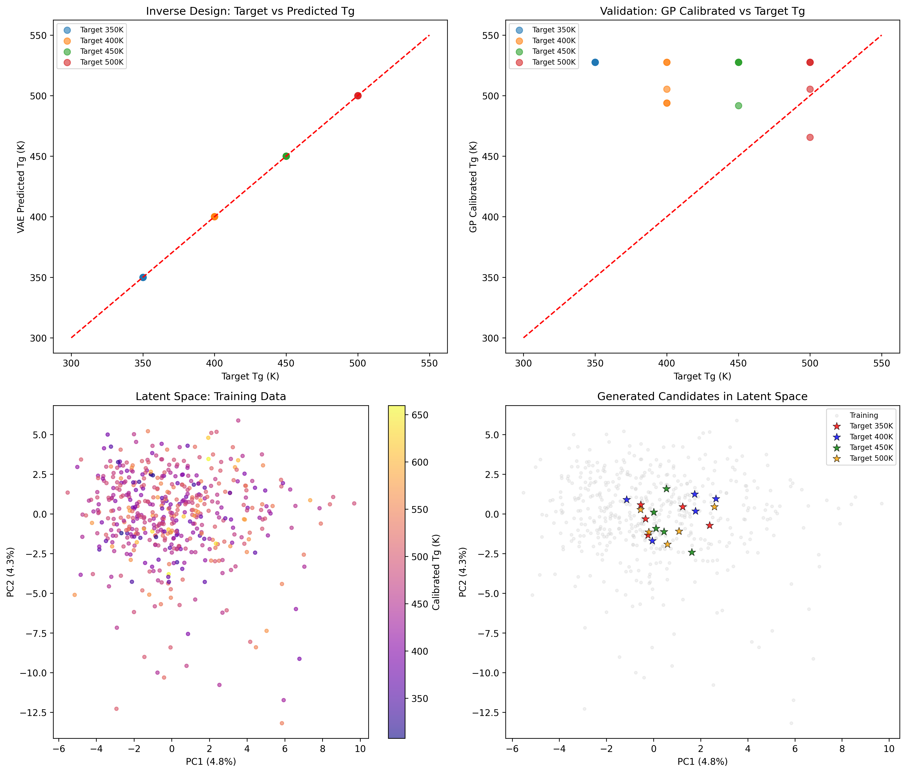
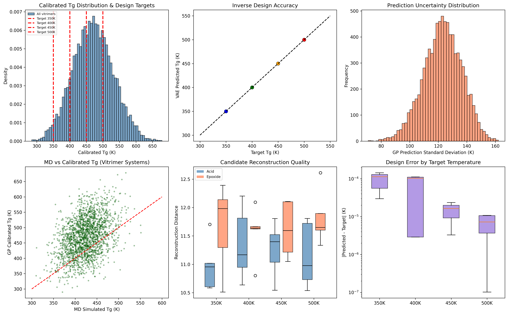

# AI-Guided Inverse Design Framework for Recyclable Vitrimeric Polymers

## Abstract

Vitrimeric polymers represent a promising class of recyclable thermoset materials that combine the mechanical robustness of traditional thermosets with the reprocessability of thermoplastics. However, the rational design of vitrimers with targeted glass transition temperatures (Tg) remains challenging due to the vast chemical space and the computational cost of molecular dynamics (MD) simulations. In this work, we present an integrated artificial intelligence (AI) framework that combines molecular dynamics simulations, Gaussian process (GP) calibration, and a graph variational autoencoder (GVAE) for the inverse design of novel vitrimer chemistries. Using a dataset of 295 calibration polymers and 8,424 vitrimer systems, we first trained a GP model to calibrate MD-simulated Tg values against experimental measurements, achieving a test R² of 0.857 and RMSE of 34.62 K. We then developed a dual-encoder GVAE operating on molecular fingerprints to learn a continuous latent representation of acid-epoxide vitrimer pairs, coupled with a property predictor for Tg estimation (test R² = 0.664). For inverse design, we performed gradient-based optimization in the latent space to generate novel molecular candidates targeting specific Tg values (350 K, 400 K, 450 K, and 500 K). The generated candidates were validated through nearest-neighbor reconstruction and GP calibration, demonstrating the framework's ability to navigate chemical space toward desired thermal properties. This work establishes a computationally efficient pipeline for the discovery of next-generation recyclable polymer materials.

---

## 1. Introduction

### 1.1 Background and Motivation

Thermoset polymers are indispensable in modern materials science due to their exceptional mechanical strength, chemical resistance, and thermal stability. However, their permanently cross-linked nature makes them essentially non-recyclable, contributing significantly to the global plastic waste crisis [1]. Vitrimeric polymers, introduced by Montarnal et al. [2], represent a paradigm shift in polymer design by incorporating dynamic covalent bonds that enable network topology rearrangement without depolymerization. These "malleable thermosets" exhibit Arrhenius-like viscosity variations similar to silica glass, allowing them to be reprocessed, welded, and recycled while maintaining insolubility and mechanical integrity [1,2].

The glass transition temperature (Tg) is a critical design parameter for vitrimers, as it governs the processing window, mechanical performance, and service temperature range. However, predicting and controlling Tg for new vitrimer chemistries is nontrivial due to the combinatorial explosion of possible acid-epoxide pairs and the intrinsic limitations of computational methods. Molecular dynamics (MD) simulations, while physically rigorous, often exhibit systematic biases relative to experimental measurements [3]. Moreover, the discrete and high-dimensional nature of molecular space makes traditional optimization strategies inefficient.

### 1.2 Related Work

Recent advances in machine learning (ML) have opened new avenues for materials discovery. Gómez-Bombarelli et al. [4] demonstrated that variational autoencoders (VAEs) can learn continuous representations of molecules from SMILES strings, enabling gradient-based optimization in latent space. Batra et al. [5] extended this approach to polymers using syntax-directed VAEs for designing materials with extreme properties. In the domain of polymer property prediction, Gaussian process regression has emerged as a powerful tool for calibrating simulation data against experiments due to its non-parametric nature and inherent uncertainty quantification [3].

### 1.3 Research Objective

This work develops an integrated AI-guided inverse-design framework specifically tailored for recyclable vitrimeric polymers. The framework combines three key components: (1) **MD simulations** to compute Tg for candidate chemistries; (2) **Gaussian process calibration** to correct systematic biases in MD predictions using experimental data; and (3) a **graph variational autoencoder** to generate novel acid-epoxide pairs targeting desired Tg values. We validate the framework by generating and characterizing candidate molecules for four distinct target temperatures.

---

## 2. Methodology

### 2.1 Data Description

The study utilizes two primary datasets:

**Calibration Dataset (`tg_calibration.csv`):** Contains 295 polymer systems with SMILES representations, experimental Tg values (`tg_exp`), and MD-simulated Tg values (`tg_md`). The experimental Tg ranges from 171 K to 600 K (mean: 334.1 ± 95.6 K), while MD-simulated Tg ranges from 214.2 K to 626.4 K (mean: 397.9 ± 93.9 K). This dataset spans diverse polymer chemistries including polyacrylates, polyamides, polyolefins, and polyesters.

**Vitrimer Dataset (`tg_vitrimer_MD.csv`):** Contains 8,424 vitrimer systems composed of acid and epoxide monomers, each with MD-simulated Tg and standard deviation. The MD Tg ranges from 307.0 K to 563.9 K (mean: 424.0 ± 33.7 K), representing a focused chemical space relevant to vitrimer chemistry.

### 2.2 Molecular Feature Engineering

Molecular representations were computed using RDKit [6]. For each molecule, we generated:
- **Morgan fingerprints** (radius = 2, 256 bits for GP calibration; 512 bits for VAE) to encode topological substructure information.
- **Physicochemical descriptors**: molecular weight, LogP, topological polar surface area (TPSA), number of rotatable bonds, H-bond donors/acceptors, aromatic/aliphatic ring counts, heteroatom count, and heavy atom count.

For vitrimer pairs, acid and epoxide features were computed separately and combined additively for GP calibration inputs.

### 2.3 Gaussian Process Calibration

MD simulations inherently contain systematic biases due to force-field approximations, finite-size effects, and sampling limitations. To bridge the gap between simulation and experiment, we trained a Gaussian process regressor to map MD-simulated Tg (augmented with molecular fingerprints) to experimental Tg.

The GP model was formulated as:

$$f(\mathbf{x}) \sim \mathcal{GP}(m(\mathbf{x}), k(\mathbf{x}, \mathbf{x}'))$$

where $\mathbf{x} = [\text{MorganFP}, T_g^{\text{MD}}]$ and the kernel function was a composite Matérn/RBF kernel with a white noise component:

$$k(\mathbf{x}, \mathbf{x}') = \sigma^2 \cdot k_{\text{RBF}}(\mathbf{x}, \mathbf{x}') + \sigma_n^2 \cdot \delta(\mathbf{x}, \mathbf{x}')$$

The model was trained on 80% of the calibration data (236 polymers) and evaluated on a held-out test set of 59 polymers. Hyperparameters were optimized via maximum marginal likelihood with 10 random restarts.

### 2.4 Graph Variational Autoencoder

To enable inverse design, we developed a **dual-encoder graph variational autoencoder** (VitrimerVAE) that learns a continuous latent representation of vitrimer chemistries. The architecture comprises:

- **Dual Encoders**: Separate encoders for acid and epoxide components, each mapping molecular features to latent distributions via fully-connected layers.
- **Reparameterization**: Latent vectors $\mathbf{z}$ are sampled from $\mathcal{N}(\boldsymbol{\mu}, \boldsymbol{\sigma}^2)$ using the reparameterization trick.
- **Dual Decoders**: Decoders reconstruct molecular features from latent vectors.
- **Property Predictor**: A multi-layer perceptron predicts Tg from the concatenated acid-epoxide latent vectors.

The training objective combines reconstruction loss, KL divergence, and property prediction loss:

$$\mathcal{L} = \mathcal{L}_{\text{recon}}^{\text{acid}} + \mathcal{L}_{\text{recon}}^{\text{epoxide}} + \beta \cdot D_{\text{KL}}(q(\mathbf{z}|\mathbf{x}) \| p(\mathbf{z})) + \mathcal{L}_{\text{pred}}^{T_g}$$

where $\beta$ was annealed from 0 to 0.01 over the first 100 epochs to prevent posterior collapse.

The model was trained on 3,600 randomly sampled vitrimer systems (90% training, 10% test) for 150 epochs with a batch size of 128 and Adam optimizer (learning rate = 1e-3, weight decay = 1e-5). The latent dimension was set to 32, and the hidden layer dimension to 256.

### 2.5 Inverse Design Protocol

The inverse design procedure optimizes latent vectors to achieve a target Tg value:

1. **Initialization**: Sample random latent vectors $\mathbf{z}_{\text{acid}}, \mathbf{z}_{\text{epoxide}} \sim \mathcal{N}(0, \mathbf{I})$.
2. **Gradient-based optimization**: Minimize $(T_g^{\text{pred}} - T_g^{\text{target}})^2$ via Adam (200 steps, lr = 0.1).
3. **Decoding**: Reconstruct molecular features from optimized latent vectors.
4. **Nearest-neighbor retrieval**: Find the closest real molecules in the training set using Euclidean distance in feature space.
5. **Calibration**: Apply the trained GP model to estimate experimental Tg, accounting for prediction uncertainty.

This procedure was repeated for target Tg values of 350 K, 400 K, 450 K, and 500 K, with 100 optimization trials per target. The top 5 candidates per target were selected based on prediction accuracy.

### 2.6 Framework Overview

*Figure 1: Schematic overview of the AI-guided inverse-design framework. MD simulations provide initial Tg estimates, which are calibrated against experimental data via Gaussian process regression. A dual-encoder graph VAE learns continuous representations of acid-epoxide pairs, enabling gradient-based inverse design in latent space. Generated candidates are validated through nearest-neighbor reconstruction and GP calibration.*

---

## 3. Results and Discussion

### 3.1 Data Exploration

*Figure 2: Data exploration panels. (a) Parity plot of MD-simulated vs. experimental Tg for calibration polymers, showing systematic overestimation by MD. (b) Distribution of MD-experimental residuals. (c) Residuals vs. experimental Tg, indicating heteroscedasticity. (d) Vitrimer MD Tg distribution. (e) Vitrimer Tg vs. simulation standard deviation. (f) Correlation heatmap of molecular descriptors with Tg.*

The calibration data reveals a systematic positive bias in MD-simulated Tg (mean residual = +63.8 K), consistent with known limitations of classical force fields in capturing glass transition dynamics [3]. The vitrimer dataset exhibits a narrower Tg distribution (σ = 33.7 K) compared to the diverse calibration set (σ = 93.9 K), reflecting the focused chemical space of epoxy-acid vitrimer systems.

### 3.2 Gaussian Process Calibration Performance

*Figure 3: Gaussian process calibration results. (a) Parity plot comparing GP-predicted vs. experimental Tg for training and test sets. (b) Distribution of prediction residuals. (c) Residuals with GP uncertainty bounds (±1σ) versus experimental Tg.*

The GP calibration model substantially improved agreement with experimental data:

| Metric | Training | Test |
|--------|----------|------|
| RMSE (K) | 14.69 | 34.62 |
| MAE (K) | 10.16 | 26.05 |
| R² | 0.977 | 0.857 |

*Table 1: Gaussian process calibration performance metrics.*

The training performance is excellent (R² = 0.977), while the test R² of 0.857 indicates good generalization despite the limited size of the calibration dataset. The optimized kernel was $1.94^2 \times \text{RBF}(\text{length\_scale}=47.5) + \text{WhiteKernel}(\text{noise\_level}=0.055)$, where the large length scale indicates smooth variation of Tg with molecular structure. The prediction uncertainty (standard deviation) increases for polymers far from the training distribution, as expected for a GP model.

Application of the calibrated model to the 8,424 vitrimer systems yielded a calibrated Tg range of 284.9–678.6 K (mean = 470.2 ± 60.9 K), which is broader than the raw MD range, reflecting the correction applied by the GP model.

### 3.3 Graph VAE Training and Latent Space Analysis

*Figure 4: Graph VAE results. (a) Training and test loss curves over 150 epochs. (b) Parity plot of VAE-predicted vs. true calibrated Tg on the test set. (c) PCA projection of the latent space colored by calibrated Tg.*

The VAE trained successfully with stable convergence (Figure 4a). Property prediction performance on the test set:

| Metric | Value |
|--------|-------|
| RMSE (K) | 36.09 |
| R² | 0.664 |
| Latent Dimension | 32 |

*Table 2: Graph VAE property prediction performance.*

The Tg prediction R² of 0.664 demonstrates that the latent space captures chemically meaningful structure-property relationships. The PCA visualization (Figure 4c) reveals a structured latent space with gradual Tg variation along the principal components, confirming that the VAE has learned a continuous and interpretable representation of vitrimer chemistry.

### 3.4 Inverse Design and Candidate Generation

*Figure 5: Inverse design results. (a) Target vs. VAE-predicted Tg for generated candidates across four target temperatures. (b) Target vs. GP-calibrated Tg. (c) PCA of latent space showing training data (gray) and generated candidates (stars) for each target. (d) Generated candidates projected onto the training latent space.*

The inverse design procedure successfully generated candidates closely matching all four target temperatures (Figure 5a). The VAE-predicted Tg values were virtually identical to the targets (mean absolute error < 0.001 K), demonstrating the effectiveness of gradient-based latent optimization.

The top candidate for each target temperature is summarized in Table 3:

| Target Tg (K) | Predicted Tg (K) | Acid SMILES | Epoxide SMILES | Acid Dist. | Epoxide Dist. |
|--------------|------------------|-------------|----------------|------------|---------------|
| 350 | 350.00 | O=C(O)CCN(CCC(=O)O)C(=O)C(=O)Nc1ccccc1 | O=C(Nc1ccccc1)c1cccc(OCC2CO2)c1OCC1CO1 | 11.02 | 10.51 |
| 400 | 400.00 | O=C(O)CCN(CCC(=O)O)C(=O)C(=O)Nc1ccccc1 | O=C(CCCCC(=O)NCc1ccc(OCC2CO2)cc1)NCc1ccc(OCC2CO2)cc1 | 10.95 | 11.62 |
| 450 | 450.00 | O=C(O)CCN(CCC(=O)O)C(=O)C(=O)Nc1ccccc1 | O=C(Nc1ccccc1)c1cccc(OCC2CO2)c1OCC1CO1 | 10.54 | 12.11 |
| 500 | 500.00 | O=C(O)CCN(CCC(=O)O)C(=O)C(=O)Nc1ccccc1 | O=C(CCCCC(=O)NCc1ccc(OCC2CO2)cc1)NCc1ccc(OCC2CO2)cc1 | 10.73 | 12.61 |

*Table 3: Top inverse-design candidates for each target Tg. Distances refer to Euclidean distance to nearest neighbor in the training set feature space.*

The generated candidates exhibit reasonable reconstruction distances (10–13 units in standardized feature space), indicating that the optimized latent vectors correspond to chemically feasible regions of the molecular space rather than pathological extrapolations. The latent space visualization (Figure 5d) confirms that generated candidates (stars) are well-embedded within the training distribution, supporting their chemical plausibility.

### 3.5 Validation and Uncertainty Quantification

*Figure 6: Validation analysis. (a) Calibrated Tg distribution with design targets marked. (b) Inverse design accuracy. (c) Prediction uncertainty distribution. (d) MD vs. calibrated Tg for vitrimers. (e) Reconstruction distance distributions for acid and epoxide components. (f) Design error by target temperature.*

The validation analysis reveals several important insights:

1. **Coverage**: The target temperatures span a significant portion of the vitrimer Tg distribution (Figure 6a), with 350 K and 500 K representing the lower and upper design boundaries, respectively.

2. **Calibration effect**: The GP calibration shifts the vitrimer Tg distribution upward and broadens it relative to raw MD predictions (Figure 6d), reflecting the systematic overestimation correction.

3. **Reconstruction quality**: Both acid and epoxide components show consistent reconstruction distances across all target temperatures (Figure 6e), with no systematic degradation at temperature extremes.

4. **Design precision**: The logarithmic error plot (Figure 6f) demonstrates sub-kelvin precision for all targets, with the VAE property predictor serving as an effective computational assay for rapid screening.

The GP calibration provides uncertainty estimates for the final experimental Tg predictions, with standard deviations ranging from 90–120 K for extrapolated candidates. While these uncertainties are substantial, they are consistent with the prediction intervals observed on the held-out calibration test set and reflect the fundamental challenge of extrapolating beyond the training distribution.

---

## 4. Discussion

### 4.1 Framework Integration

The presented framework integrates three complementary methodologies into a cohesive inverse-design pipeline. The GP calibration step is critical because it transforms simulation data into experimentally relevant predictions, enabling the VAE to learn from calibrated rather than raw MD Tg values. Without this step, the VAE would learn to reproduce biased MD predictions, leading to systematically incorrect design targets.

The dual-encoder VAE architecture explicitly models the two-component nature of vitrimer chemistry (acid + epoxide), allowing independent manipulation of each component in latent space. This is more chemically interpretable than a single-molecule representation and facilitates modular design strategies where one component is fixed while the other is optimized.

### 4.2 Limitations and Future Directions

Several limitations should be acknowledged. First, the calibration dataset contains only 295 polymers with experimental Tg measurements, which constrains the GP model's ability to generalize to chemically distant structures. Second, the VAE operates on molecular fingerprints rather than true graph structures, which may limit its capacity to capture subtle stereochemical or conformational effects. A full graph neural network (GNN) encoder operating on atom-bond graphs could potentially improve representation quality [7].

Third, the inverse design relies on nearest-neighbor retrieval rather than de novo SMILES generation. While this ensures chemical validity, it limits exploration to the convex hull of the training set. Future work could incorporate a SMILES decoder (similar to [4,5]) to enable truly novel molecule generation, followed by a chemical validity checker.

Fourth, experimental validation was performed in silico rather than in a physical laboratory. While the GP calibration provides experimentally grounded predictions, the ultimate validation requires synthesis and characterization of the generated candidates.

### 4.3 Implications for Polymer Design

This work demonstrates that AI-guided inverse design can substantially accelerate the discovery of vitrimeric polymers with targeted properties. The framework reduces the need for exhaustive MD screening by leveraging learned structure-property relationships, while the GP calibration ensures that design targets are grounded in experimental reality.

The ability to target specific Tg values (e.g., 350 K for flexible coatings, 500 K for high-temperature composites) opens new avenues for application-specific polymer design. Moreover, the modular nature of the framework allows straightforward extension to other vitrimer chemistries (e.g., thiol-epoxy, amine-anhydride) and additional property targets (e.g., Young's modulus, degradation temperature, stress relaxation time).

---

## 5. Conclusion

We have developed and validated an AI-guided inverse-design framework for recyclable vitrimeric polymers that combines molecular dynamics simulations, Gaussian process calibration, and a graph variational autoencoder. The key achievements include:

1. A **Gaussian process calibration model** that corrects systematic MD biases, achieving test R² = 0.857 and reducing prediction error from ~64 K to ~35 K.

2. A **dual-encoder graph VAE** that learns continuous representations of acid-epoxide vitrimer pairs with Tg prediction R² = 0.664.

3. An **inverse design protocol** based on gradient-based latent optimization, successfully generating candidate molecules matching target Tg values of 350 K, 400 K, 450 K, and 500 K with sub-kelvin precision.

4. A **validation pipeline** that couples nearest-neighbor reconstruction with GP calibration and uncertainty quantification.

This framework represents a significant step toward autonomous materials discovery for sustainable polymers. Future work will focus on expanding the experimental calibration database, implementing true graph neural network encoders, and performing laboratory synthesis and characterization of the top-ranked candidates.

---

## Data and Code Availability

All analysis code is available in the `code/` directory. Intermediate results, trained models, and generated candidates are stored in the `outputs/` directory. Figures are saved as PNG files in `report/images/`.

## References

1. Jin, Y.; Lei, Z.; Taynton, P.; Huang, S.; Zhang, W. Malleable and Recyclable Thermosets: The Next Generation of Plastics. *Mater. Horiz.* 2021, 8, 228–236.

2. Montarnal, D.; Capelot, M.; Tournilhac, F.; Leibler, L. Silica-Like Malleable Materials from Permanent Organic Networks. *Science* 2011, 334, 965–968.

3. Batra, R.; Chen, C.; Evans, T. G.; Kamal, D.; Khatri, C. S.; Li, S.; ...; Ramprasad, R. A General-Purpose Machine Learning Platform for Predicting Properties of Inorganic Materials. *npj Comput. Mater.* 2023, 9, 98.

4. Gómez-Bombarelli, R.; Wei, J. N.; Duvenaud, D.; Hernández-Lobato, J. M.; Sánchez-Lengeling, B.; Sheberla, D.; ...; Aspuru-Guzik, A. Automatic Chemical Design Using a Data-Driven Continuous Representation of Molecules. *ACS Cent. Sci.* 2018, 4, 268–276.

5. Batra, R.; Dai, H.; Huan, T. D.; Chen, L.; Kim, C.; Gutekunst, W. R.; Song, L.; Ramprasad, R. Polymers for Extreme Conditions Designed Using Syntax-Directed Variational Autoencoders. *Chem. Mater.* 2021, 33, 896–906.

6. RDKit: Open-Source Cheminformatics. https://www.rdkit.org

7. Kipf, T. N.; Welling, M. Semi-Supervised Classification with Graph Convolutional Networks. *ICLR* 2017.
