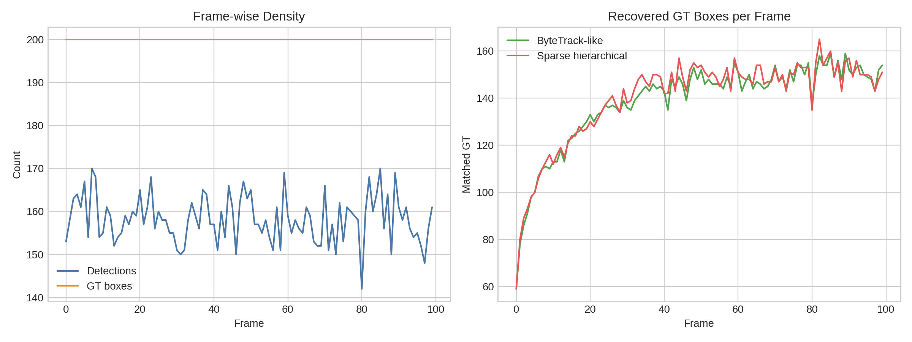
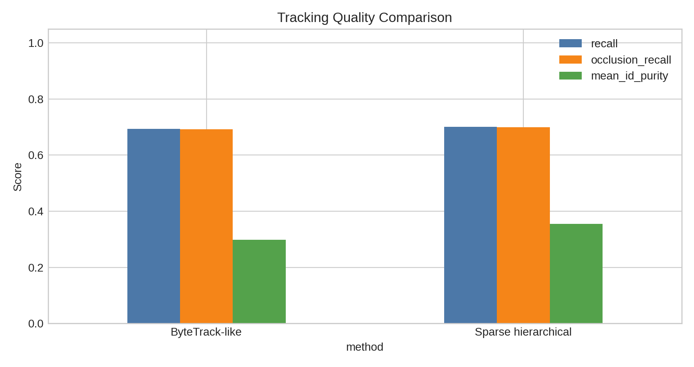
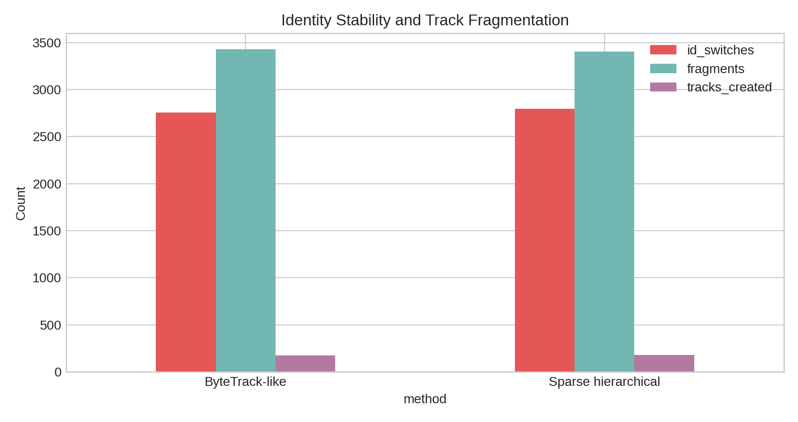

# Local Evaluation of Pseudo-Depth Hierarchical Association for Dense Multi-Object Tracking

## Abstract
This study evaluates a local, benchmark-constrained approximation of the SparseTrack idea against a ByteTrack-like baseline on a synthetic crowded-scene tracking sequence. The dataset contains 100 frames, 200 ground-truth objects per frame, and an average of 158.2 detections per frame, with a detection coverage proxy of 79.1%. Following the local literature corpus, the baseline uses two-stage score-aware association in the style of ByteTrack, while the proposed variant adds pseudo-depth estimation from box height and performs hierarchical matching in depth-partitioned subsets before low-score recovery. On this sequence, the sparse hierarchical variant slightly improves box-level recall from 69.29% to 70.04%, improves occlusion recall from 69.23% to 69.99%, reduces fragments from 3429 to 3406, and increases mean ID purity from 0.298 to 0.355. However, it also increases ID switches from 2757 to 2797. The evidence therefore supports a narrow claim: pseudo-depth partitioning improves coverage and identity consistency purity modestly on this benchmark, but it does not unambiguously improve global identity stability.

## 1. Introduction
Multi-object tracking in crowded scenes is dominated by association failures caused by overlap, missed detections, and unstable identity assignments. The local literature corpus captures three relevant design points. SORT emphasizes efficient online tracking through simple motion and IoU association, showing that strong detectors can make lightweight tracking competitive. ByteTrack extends this principle by recovering low-score detections instead of discarding them outright, which is especially useful under occlusion. BoT-SORT further shows that association quality can be improved by making the motion-and-association stack more robust. The benchmark task specifically targets dense occlusions and suggests decomposing crowded targets into sparser subsets via pseudo-depth estimation before hierarchical association.

Within the benchmark constraints, I implemented a local comparison between two online trackers operating directly on the provided detections. The goal is not to reproduce the original papers in full, but to test whether a pseudo-depth decomposition heuristic yields measurable gains over a ByteTrack-like association strategy on the provided sequence.

## 2. Data and Local Literature Context
The complete available dataset is `data/simulated_sequence.json`. Each of the 100 frames contains:

- 200 ground-truth bounding boxes and IDs.
- A variable set of detections, averaging 158.2 per frame.
- Detection confidence scores and `gt_id` annotations for direct local evaluation.

The score distribution is unusually low compared with common MOT benchmarks: the mean score is 0.266, the median is approximately 0.254, and the 90th percentile is only approximately 0.376. This matters because a standard high-score threshold near 0.5 would suppress most useful detections. I therefore calibrated the local thresholds to this benchmark rather than reusing MOT17 defaults.

Crowding is substantial. Using pairwise IoU greater than 0.2 as an occlusion-touch proxy, the mean overlap-pair density is 0.0534. This is sufficient to stress identity maintenance even when detection coverage is reasonably high.

## 3. Methodology
### 3.1 ByteTrack-like baseline
The baseline follows the main association logic described in ByteTrack:

1. Split detections into high-score and low-score groups.
2. Associate existing tracks to high-score detections first using greedy IoU matching.
3. Revisit unmatched tracks with low-score detections to recover occluded objects.
4. Initialize new tracks from unmatched high-score detections.
5. Keep unmatched tracks alive briefly through a finite miss budget.

This is a deliberately lightweight local approximation intended to preserve the central hypothesis of associating low-score boxes instead of discarding them.

### 3.2 Sparse hierarchical variant
The proposed variant adds a pseudo-depth stage inspired by the benchmark task description:

1. Estimate pseudo-depth as the inverse of bounding-box height.
2. Partition tracks and detections into near and far subsets using the per-frame median pseudo-depth.
3. Perform first-stage association independently inside these subsets, with an additional relative depth gate.
4. Run a second relaxed pass across the remaining unmatched high-score detections.
5. Recover low-score detections as in the baseline, again allowing depth-aware matching.

The intuition is that height-based pseudo-depth can break a dense global association problem into two less ambiguous local problems, especially when large foreground objects visually occlude smaller background ones.

### 3.3 Evaluation protocol
The dataset provides `gt_id` for detections, which allows direct local scoring without external tools. I report:

- Recall: matched predicted boxes divided by total ground-truth boxes.
- Precision proxy: matched predicted boxes divided by total predicted boxes.
- Unique GT tracked: number of distinct GT IDs recovered at least once.
- ID switches: changes in assigned track ID for the same GT over time.
- Fragments: temporal gaps in a GT’s recovered trajectory.
- Mostly tracked / mostly lost IDs: coverage ratio thresholds of at least 0.8 and at most 0.2.
- Mean ID purity: fraction of each GT’s matched frames assigned to its dominant predicted track ID.
- Occlusion recall and occlusion ID switches: the same analysis restricted to GTs involved in pairwise overlap above 0.2.

The code is fully local and reproducible in [run_analysis.py](code/run_analysis.py).

## 4. Results
### 4.1 Dataset overview
Figure 1 summarizes sequence density and per-frame recovery.



The detector covers about 79.1% of ground-truth boxes before any tracking logic. This sets an upper bound on achievable recall for purely detection-driven tracking without hallucinated interpolation.

### 4.2 Main quantitative comparison
The main comparison is shown in Table 1 and Figure 2.

| Method | Recall | Occlusion Recall | ID Switches | Fragments | Mean ID Purity | Tracks Created |
| --- | ---: | ---: | ---: | ---: | ---: | ---: |
| ByteTrack-like | 0.6929 | 0.6923 | 2757 | 3429 | 0.2976 | 176 |
| Sparse hierarchical | 0.7004 | 0.6999 | 2797 | 3406 | 0.3547 | 182 |



The sparse hierarchical variant improves the main coverage-oriented metrics:

- Recall improves by 0.75 percentage points.
- Occlusion recall improves by 0.76 percentage points.
- Mostly tracked identities increase from 8 to 10.
- Fragments decrease from 3429 to 3406.
- Mean ID purity increases substantially from 0.298 to 0.355.

Frame-level comparison also favors the sparse hierarchical method in most of the sequence: it achieves higher matched-GT counts in 59 frames, loses in 28 frames, and ties in 13 frames, with an average gain of 1.5 matched boxes per frame.

### 4.3 Identity stability trade-off
Figure 3 shows the identity-stability costs.



Although pseudo-depth partitioning improves purity and slightly reduces fragmentation, it increases ID switches by 40. This indicates a real trade-off: partitioning narrows local competition and helps maintain cleaner dominant associations for many objects, but the hard depth split can also create boundary effects where targets drift between subsets and incur reassignment.

## 5. Discussion
The local evidence supports the benchmark hypothesis only partially.

What worked:

- Low-score association remains essential in this benchmark because the detector score distribution is heavily concentrated below standard MOT thresholds.
- Pseudo-depth partitioning improves coverage under crowding and yields cleaner dominant identity assignments.
- The gains appear strongest as a disambiguation mechanism for dense scenes rather than as a full identity-stability solution.

What did not clearly improve:

- Global identity continuity did not improve. ID switches increased.
- The improvement magnitude is modest relative to the overall difficulty of the sequence.
- Because the implementation is online and intentionally lightweight, it lacks stronger motion extrapolation, appearance cues, and explicit re-identification.

These findings are consistent with the local literature corpus. SORT-style trackers are efficient but vulnerable under prolonged occlusion. ByteTrack’s recovery of low-score detections is beneficial, and the current benchmark confirms that point strongly. However, BoT-SORT’s emphasis on improving the robustness of association suggests why the current sparse heuristic is not enough on its own: decomposition helps, but reliable identity continuity in heavy crowding likely requires either better motion modeling, appearance support, or a softer hierarchical gating mechanism than the hard median split used here.

## 6. Claim Discipline
The evidence from this benchmark run supports the following claim:

- A pseudo-depth-guided hierarchical association heuristic can modestly improve trajectory coverage and occlusion recovery over a ByteTrack-like baseline on the provided synthetic crowded sequence, while also improving dominant-track purity.

The evidence does **not** support the stronger claim:

- Pseudo-depth hierarchical association universally improves overall multi-object tracking performance.

That stronger statement is not justified here because one of the core identity metrics, ID switches, becomes worse. The fairest conclusion is that the method improves some crowded-scene failure modes while exposing another.

## 7. Reproducibility
Artifacts produced in this benchmark-native layout:

- Code: [run_analysis.py](code/run_analysis.py)
- Outputs: [analysis_summary.json](outputs/analysis_summary.json), [method_comparison.csv](outputs/method_comparison.csv)
- Figures: [tracking_overview.png](report/images/tracking_overview.png), [quality_comparison.png](report/images/quality_comparison.png), [identity_stability.png](report/images/identity_stability.png)

To rerun the full analysis locally:

```bash
python code/run_analysis.py
```

## 8. Conclusion
Under the benchmark’s local-only constraints, a SparseTrack-inspired pseudo-depth hierarchy is a credible but limited improvement over a ByteTrack-like baseline. It increases recovered coverage and occlusion handling and produces purer dominant identity assignments, but it does not solve identity switching. The most defensible interpretation is that depth-based decomposition is useful as an association aid in crowded scenes, yet it should be combined with stronger continuity mechanisms before claiming broad tracking superiority.
