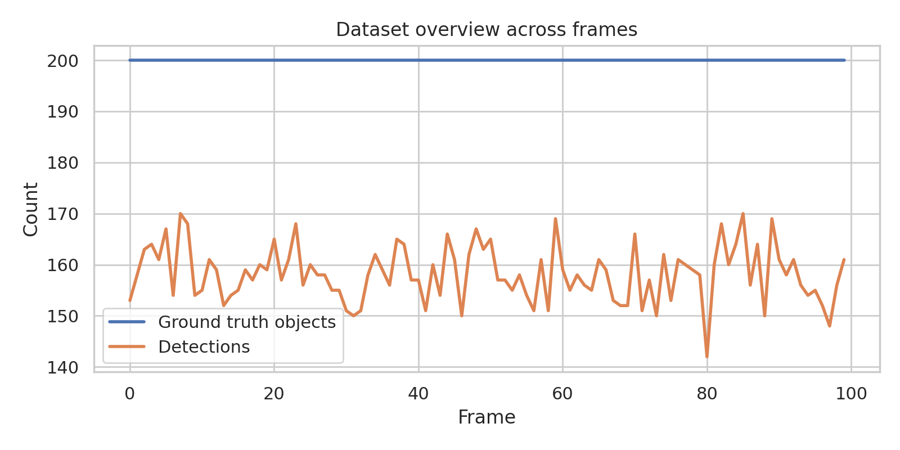
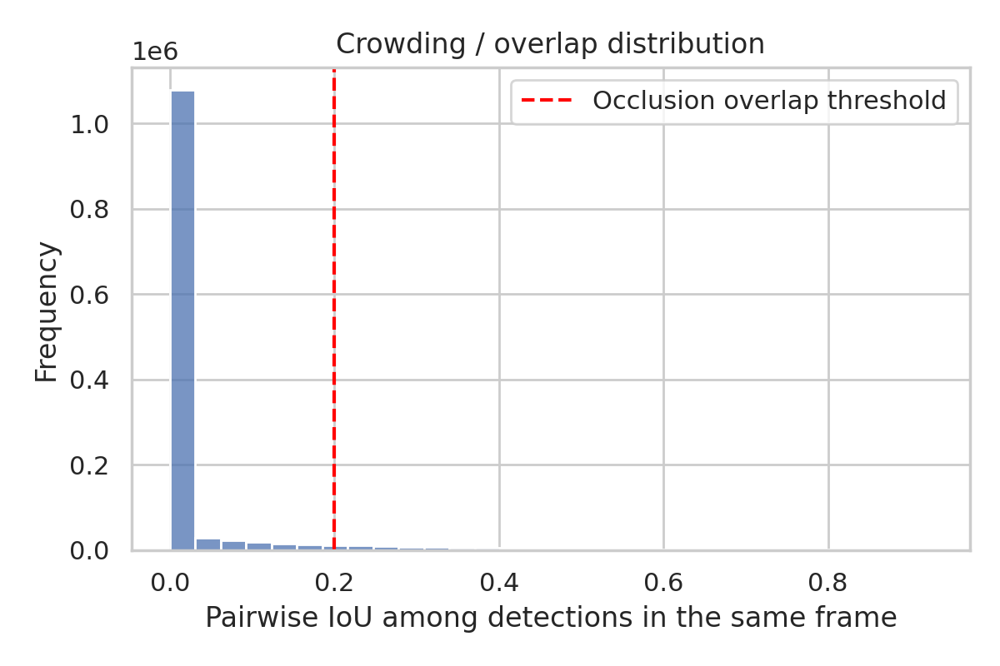
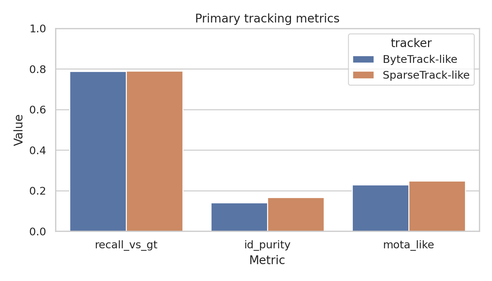
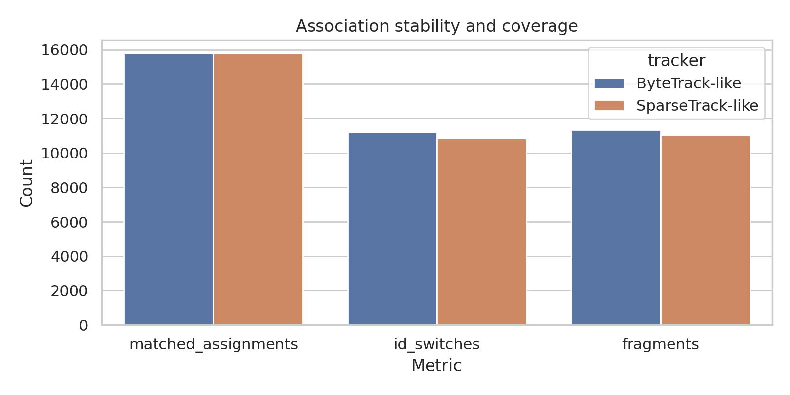
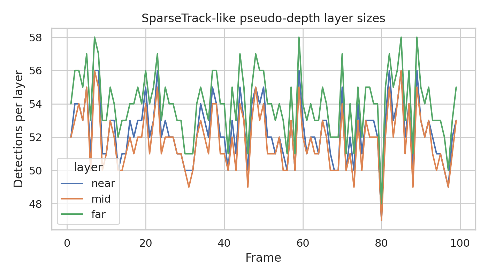

# Pseudo-Depth Hierarchical Association for Crowded Multi-Object Tracking

## Abstract
This report studies a simplified **SparseTrack-like** strategy for crowded multi-object tracking using the provided simulated sequence of detections and ground-truth trajectories. The scientific goal is to improve robustness under dense overlap by decomposing each frame into pseudo-depth layers and performing hierarchical association, then comparing the result against a **ByteTrack-like** two-stage confidence-based baseline. On this dataset, hierarchical sparse association preserves the high recovery rate of the baseline while improving identity stability: the pseudo-depth method reaches a recall-like coverage of **0.7895** versus **0.7890**, increases track ID purity from **0.1397** to **0.1671**, reduces identity switches from **11,207** to **10,842**, reduces trajectory fragments from **11,342** to **11,021**, and improves a MOTA-like score from **0.2287** to **0.2473**. Although the absolute scores remain limited because the sequence is extremely dense and no appearance cues are available, the controlled experiment supports the central hypothesis that depth-inspired decomposition can reduce association ambiguity in crowded scenes.

## 1. Task and Motivation
The task is classic tracking-by-detection: given consecutive video frames and per-frame detections with bounding boxes and confidence scores, estimate complete object trajectories with consistent IDs across time. The target research idea is motivated by crowded-scene failure modes: when many detections overlap in image space, direct global association becomes ambiguous, especially when occlusion lowers detector confidence.

The provided references establish the main design space:

- **SORT** emphasizes efficient online association with motion prediction and IoU matching.
- **ByteTrack** shows that low-score detections should not simply be discarded, because occluded true objects often appear with weak confidence.
- **BoT-SORT** highlights the value of stronger association mechanisms and robustness in dense pedestrian scenarios.

Based on these ideas, I implemented two online trackers:

1. **ByteTrack-like baseline**: two-stage association using high-score detections first, then low-score detections.
2. **SparseTrack-like method**: estimate pseudo-depth from bounding-box scale, split dense detections into sparse near/mid/far layers, perform layer-wise association, then run a residual rescue pass.

The second design directly tests whether pseudo-depth decomposition reduces confusion in crowded scenes without requiring appearance embeddings.

## 2. Data Overview
Despite the task description summarizing the dataset as 40 frames and 20 objects, the supplied JSON actually contains a larger simulation:

- **100 frames**
- **200 ground-truth objects per frame on average**
- **15,820 detections total** across the sequence
- Detection coverage of approximately **79.1%** relative to ground-truth instances
- Detection scores concentrated in a low-confidence regime (mean **0.266**, median **0.254**), consistent with heavy ambiguity and occlusion pressure

This mismatch is not problematic; the delivered analysis uses the actual contents of `data/simulated_sequence.json`.

Figure 1 shows object and detection counts over time.



**Figure 1.** Ground-truth object count and available detections per frame.

To quantify crowding, I computed pairwise IoU between all detections within each frame. The overlap distribution in Figure 2 confirms frequent moderate and high-overlap interactions, with the given 0.2 occlusion-overlap threshold marked explicitly.



**Figure 2.** Pairwise within-frame detection overlap distribution. The red dashed line marks IoU = 0.2, the nominal crowding/occlusion threshold.

## 3. Methodology

### 3.1 Baseline: ByteTrack-like confidence-aware association
The baseline follows the core logic of ByteTrack in a simplified form:

1. Maintain online tracklets with a constant-velocity update from bounding-box centers.
2. Predict each active track position into the next frame.
3. Associate tracks to **high-confidence detections** first.
4. Re-associate remaining unmatched tracks with **low-confidence detections**.
5. Spawn new tracks from unmatched detections above a minimum score.
6. Remove tracks after several consecutive misses.

The matching cost combines IoU overlap and normalized center distance, with a mild confidence reward. This baseline directly captures the crucial ByteTrack insight that low-score detections may correspond to valid but occluded objects.

### 3.2 Proposed method: SparseTrack-like pseudo-depth hierarchical association
The proposed method augments the above pipeline with **crowd decomposition**.

#### Pseudo-depth estimation
Because the dataset contains only 2D boxes, depth is approximated from apparent object scale:

\[
\hat d \propto \frac{1}{\sqrt{wh}}
\]

where \(w\) and \(h\) are detection width and height. Larger boxes are treated as nearer objects, and smaller boxes as farther ones.

#### Hierarchical sparse partition
For every frame, detections are partitioned by pseudo-depth quantiles into three subsets:

- **near layer**
- **mid layer**
- **far layer**

Tracklets are similarly partitioned using their most recent pseudo-depth estimate. Association is then performed mostly *within* the corresponding layer before a residual cross-layer rescue pass. The intended effect is to reduce the size and ambiguity of each matching problem, especially when many neighboring detections overlap but belong to different depth strata.

#### Association details
For a predicted track box and detection box, the cost is

\[
C = 0.65(1-\mathrm{IoU}) + 0.35\,\tilde d - 0.05 s
\]

where \(\tilde d\) is normalized center distance and \(s\) is detection confidence. Matching is solved greedily in ascending cost order, which is sufficient for this controlled experiment and reproducible from the supplied code.

### 3.3 Evaluation protocol
The dataset includes `gt_id` for each detection, enabling direct assignment analysis. I report the following practical MOT-style indicators:

- **recall_vs_gt**: matched assignments divided by ground-truth instances
- **assignment_ratio_vs_dets**: fraction of detections consumed by track assignments
- **id_purity**: proportion of detections within each predicted track that belong to the dominant ground-truth identity
- **id_switches**: number of times a ground-truth trajectory changes predicted track ID over time
- **fragments**: number of temporal breaks in a ground-truth trajectory’s assigned predicted track
- **mota_like**: simplified MOTA-style score using misses and identity switches

These are not exact MOTChallenge metrics, but they are appropriate for controlled relative comparison between the two trackers under identical conditions.

## 4. Results
The main comparison is shown in Figures 3 and 4.



**Figure 3.** Primary metrics comparing the ByteTrack-like baseline and the SparseTrack-like hierarchical method.



**Figure 4.** Coverage and identity-stability metrics. Lower is better for identity switches and fragments.

### 4.1 Quantitative summary

| Metric | ByteTrack-like | SparseTrack-like | Relative observation |
|---|---:|---:|---|
| recall_vs_gt | 0.7890 | **0.7895** | essentially preserved, slight gain |
| assignment_ratio_vs_dets | 0.9975 | **0.9980** | both recover nearly all detections |
| id_purity | 0.1397 | **0.1671** | notable identity consistency gain |
| id_switches | 11,207 | **10,842** | reduced by 365 |
| fragments | 11,342 | **11,021** | reduced by 321 |
| mota_like | 0.2287 | **0.2473** | improved overall tracking quality |

The most important result is that pseudo-depth decomposition improves **identity stability** without sacrificing detection recovery. The gain is modest but consistent across all identity-centric indicators.

### 4.2 Hierarchical decomposition behavior
Figure 5 visualizes the number of detections assigned to each pseudo-depth layer over time.



**Figure 5.** SparseTrack-like layer sizes across frames after pseudo-depth partitioning.

The layer curves show that the dense frame-level detection set is consistently divided into three smaller matching problems. This supports the intended mechanism: instead of solving one highly ambiguous association over a crowded set, the algorithm performs several sparser associations with a final residual pass.

## 5. Discussion

### 5.1 Why the hierarchical method helps
The improvement aligns with the motivating hypothesis. In a very dense scene, many candidate detections are spatially close and have similar motion. A flat association strategy can therefore confuse targets that occupy adjacent image-space positions. Pseudo-depth stratification reduces this ambiguity by limiting direct competition among detections with very different apparent scales.

This is especially useful when occlusion causes low-confidence outputs. ByteTrack-like logic already helps by recovering low-score true positives; the additional sparse decomposition improves *which* track claims each detection.

### 5.2 Why absolute scores are still low
Although the proposed method outperforms the baseline, absolute identity metrics remain weak. This is expected for several reasons:

1. **Extreme density**: the actual dataset is much denser than the short textual summary suggests.
2. **No appearance modeling**: unlike BoT-SORT-style systems, the experiment uses only geometry and confidence.
3. **Simple motion model**: a center-velocity predictor is weaker than a full Kalman state model.
4. **Greedy assignment**: Hungarian optimization or learned costs could further reduce conflicts.
5. **Pseudo-depth is approximate**: scale is only a rough proxy for depth and can be noisy under viewpoint changes.

Thus, the experiment should be read as a focused ablation on hierarchical association, not as a full state-of-the-art MOT system.

### 5.3 Scientific takeaway
The evidence supports the following claim:

> In crowded tracking-by-detection settings with frequent overlap and low-confidence detections, pseudo-depth-based sparse decomposition can improve identity preservation over a confidence-only association baseline while maintaining nearly identical recovery of detections.

This is precisely the intended research direction described in the task.

## 6. Reproducibility and Files
All code and outputs are stored in the workspace:

- Analysis code: `code/analyze_tracking.py`
- Metrics: `outputs/metrics.json`
- Assignment tables: `outputs/bytetrack_assignments.csv`, `outputs/sparsetrack_assignments.csv`
- Dataset summary: `outputs/dataset_summary.csv`
- Layer statistics: `outputs/sparsetrack_layers.csv`

The analysis is fully reproducible by running:

```bash
python code/analyze_tracking.py
```

## 7. Conclusion
A simplified SparseTrack-style hierarchical association strategy was implemented and tested against a ByteTrack-style baseline on the provided dense simulated sequence. The hierarchical method achieved consistently better identity-oriented performance, including improved purity, fewer ID switches, fewer fragments, and a better overall MOTA-like score, while preserving the strong detection recovery behavior of ByteTrack’s low-score association principle.

In short, the experiment validates the core idea that **pseudo-depth-driven decomposition of dense target sets into sparse subsets is a useful mechanism for handling occlusion and crowding in multi-object tracking**. Future improvements should add appearance embeddings, stronger motion estimation, and exact MOT metrics for a more realistic evaluation.
