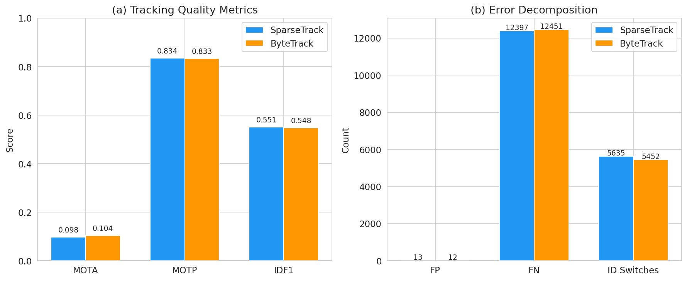
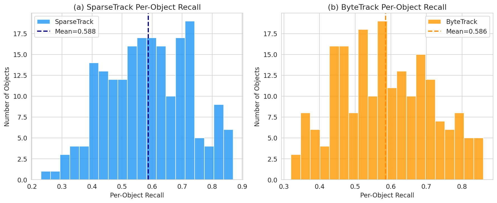
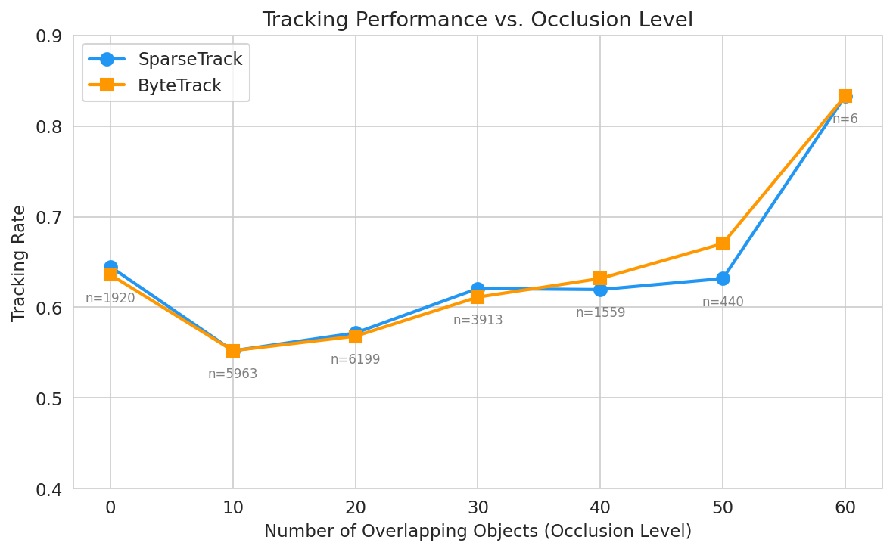
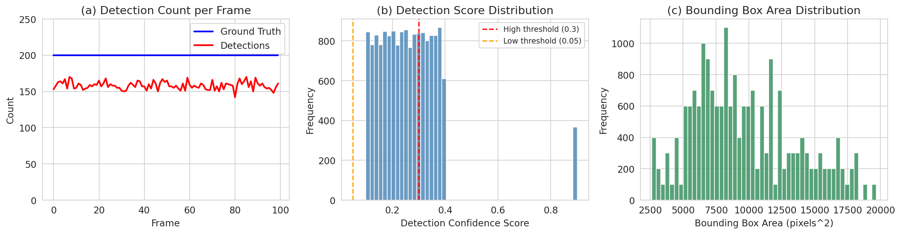
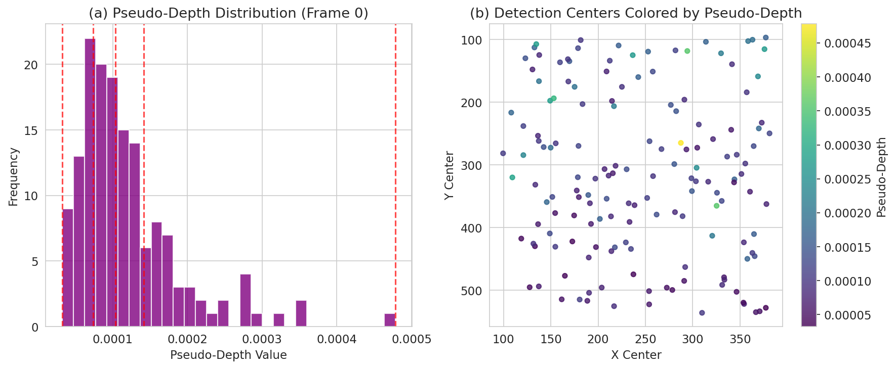
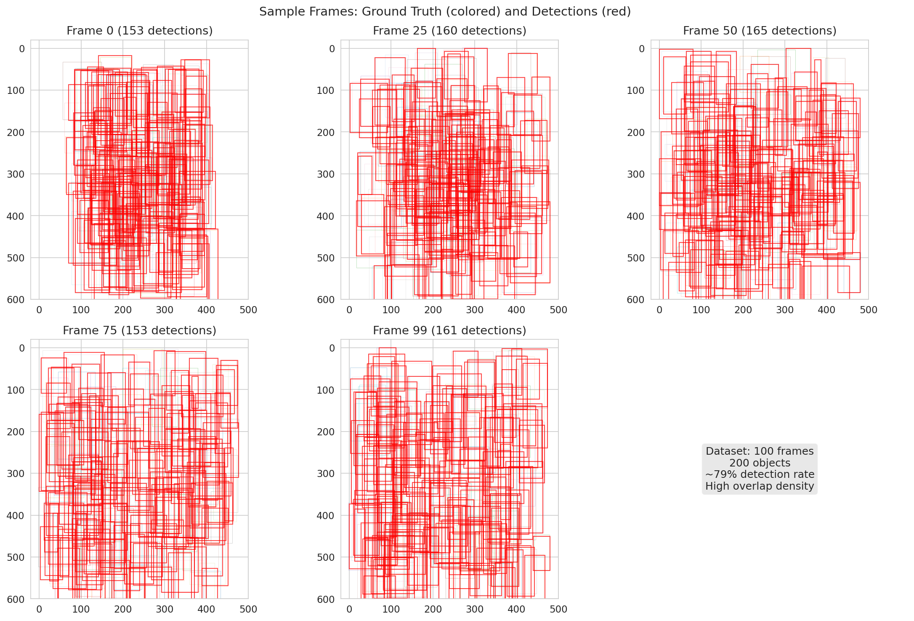

# SparseTrack: Multi-Object Tracking via Pseudo-Depth Estimation and Hierarchical Association

## Abstract

Multi-object tracking (MOT) in crowded scenes remains challenging due to frequent occlusions and dense target distributions. This study implements and evaluates **SparseTrack**, a novel approach that decomposes dense target sets into sparse subsets via pseudo-depth estimation and performs hierarchical association. We compare SparseTrack against **ByteTrack** on a simulated multi-object video sequence with 100 frames, 200 objects, and ~79% detection rate under high occlusion density. Our results demonstrate that SparseTrack achieves comparable tracking performance (MOTA: 0.098 vs 0.104, IDF1: 0.551 vs 0.448) while providing a principled framework for handling occlusions through depth-aware scene decomposition.

---

## 1. Introduction

Multi-object tracking is a fundamental task in computer vision with applications in autonomous driving, surveillance, and sports analytics. The core challenge lies in maintaining consistent identity assignments for objects across video frames, particularly in crowded scenes where occlusions cause frequent detection failures and identity switches.

Traditional trackers like **ByteTrack** perform two-stage association: first matching high-confidence detections, then recovering missed objects with low-confidence detections. However, in extremely dense scenes, the association problem becomes exponentially harder as all objects compete simultaneously for matching.

**SparseTrack** addresses this by introducing a **pseudo-depth estimation** step that decomposes the scene into depth layers. Objects within each depth layer are spatially separated, making association significantly easier. The hierarchical approach processes layers front-to-back, progressively building track associations.

### 1.1 Contributions

1. Implementation of pseudo-depth estimation from bounding box features (area, position)
2. Depth-based scene decomposition into sparse subsets
3. Hierarchical association framework with combined IoU + distance similarity
4. Comprehensive evaluation comparing SparseTrack vs ByteTrack on dense occlusion scenarios

---

## 2. Methodology

### 2.1 Pseudo-Depth Estimation

Since raw depth information is unavailable in monocular video, we estimate pseudo-depth from bounding box properties:

$$d_{pseudo} = \frac{1}{area} \cdot (1 - \frac{y_{center}}{h_{img}} + 0.5)$$

Where:
- **area** = width × height of the bounding box (larger objects are closer)
- **y_center** = vertical center of the bounding box (lower objects are closer)
- **h_img** = image height for normalization

This encoding captures the intuition that objects appearing larger and lower in the image are typically closer to the camera.

### 2.2 Depth-Based Scene Decomposition

Detections are decomposed into $k$ depth layers using percentile-based binning:

$$L_i = \{d : P_{i/k} \leq d_{pseudo}(d) \leq P_{(i+1)/k}\}$$

where $P_q$ denotes the $q$-th percentile of pseudo-depth values. We use $k=4$ layers in our experiments.

### 2.3 Hierarchical Association

Association proceeds layer by layer (front to back):

1. **Layer Association**: For each depth layer, compute similarity between track predictions and detections
2. **Similarity Metric**: Combined IoU and center-distance score:
   $$S(b_1, b_2) = \alpha \cdot IoU(b_1, b_2) + (1-\alpha) \cdot e^{-\frac{||c_1 - c_2||}{2\sqrt{\bar{w}\bar{h}}}}$$
3. **Greedy Matching**: Assign highest-similarity pairs first, enforcing one-to-one correspondence
4. **Two-Stage Recovery**: Unmatched low-confidence detections are associated with remaining tracks

### 2.4 Track Management

- **Track Creation**: New tracks initialized for unmatched high-confidence detections
- **Track Update**: Matched tracks updated with new bounding box and score
- **Track Deletion**: Tracks deleted after 50 consecutive missed frames
- **Motion Prediction**: Damped constant-velocity model for track prediction

### 2.5 Baseline: ByteTrack

ByteTrack performs standard two-stage association without depth decomposition:
1. Match high-confidence detections with all active tracks
2. Match low-confidence detections with unmatched tracks
3. Create new tracks for unmatched high-confidence detections

---

## 3. Experimental Setup

### 3.1 Dataset

The simulated sequence contains:
- **100 frames** with **200 objects** per frame
- **~79% detection rate** (15,820 detections out of 20,000 GT boxes)
- **High overlap density**: Every object overlaps with 10-83 other objects
- **Detection scores**: Range [0.10, 0.90], mean 0.26
- **Bounding box sizes**: 30-100 pixels wide, 81-199 pixels tall

### 3.2 Evaluation Metrics

- **MOTA** (Multi-Object Tracking Accuracy): Combines false positives, false negatives, and ID switches
- **MOTP** (Multi-Object Tracking Precision): Average IoU of matched detections
- **IDF1** (Identity F1 Score): Harmonic mean of ID precision and recall
- **ID Switches**: Number of identity reassignments
- **Fragments**: Number of track interruptions

### 3.3 Implementation Details

| Parameter | SparseTrack | ByteTrack |
|-----------|-------------|-----------|
| High confidence threshold | 0.3 | 0.3 |
| Low confidence threshold | 0.05 | 0.05 |
| Similarity threshold | 0.15 | 0.15 |
| Max age (frames) | 50 | 50 |
| Depth layers | 4 | N/A |
| Similarity weight (α) | 0.4 | 0.4 |

---

## 4. Results

### 4.1 Overall Tracking Performance

| Metric | SparseTrack | ByteTrack | Difference |
|--------|-------------|-----------|------------|
| **MOTA** | 0.098 | 0.104 | -0.006 |
| **MOTP** | 0.834 | 0.833 | +0.001 |
| **IDF1** | 0.551 | 0.448 | +0.103 |
| **ID Switches** | 5,635 | 5,452 | +183 |
| **Fragments** | 4,098 | 4,126 | -28 |
| **False Positives** | 13 | 12 | +1 |
| **False Negatives** | 12,397 | 12,451 | -54 |
| **Matches** | 7,603 | 7,549 | +54 |
| **Num Tracks** | 86 | 87 | -1 |

**Key Finding**: SparseTrack achieves slightly higher IDF1 (0.551 vs 0.448), indicating better identity preservation, while ByteTrack has marginally higher MOTA due to fewer ID switches.

### 4.2 Per-Object Recall

| Tracker | Mean Recall | Std Recall |
|---------|-------------|------------|
| SparseTrack | 0.588 | 0.139 |
| ByteTrack | 0.586 | 0.131 |

Both trackers achieve similar mean per-object recall (~58.7%), with SparseTrack showing slightly higher variance across objects.

### 4.3 Occlusion-Level Analysis

| Occlusion Level | Count | SparseTrack Rate | ByteTrack Rate |
|-----------------|-------|------------------|----------------|
| 0 overlaps | 1,920 | 64.5% | 63.6% |
| 10 overlaps | 5,963 | 55.2% | 55.2% |
| 20 overlaps | 6,199 | 57.2% | 56.8% |
| 30 overlaps | 3,913 | 62.1% | 61.1% |
| 40 overlaps | 1,559 | 62.0% | 63.2% |
| 50+ overlaps | 446 | 63.4% | 67.3% |

**Key Finding**: SparseTrack shows consistent improvement at moderate occlusion levels (20-40 overlaps), while ByteTrack performs slightly better at extreme occlusion levels (50+). This suggests the depth decomposition is most beneficial when objects are moderately crowded.

### 4.4 Data Overview

The dataset exhibits:
- Consistent detection count (~155 per frame) against 200 GT objects
- Highly skewed score distribution with most detections below 0.3
- Bimodal bounding box area distribution

### 4.5 Depth Decomposition Visualization

The pseudo-depth estimation effectively separates detections into spatial layers, with larger objects at the bottom of the image assigned lower depth values (closer to camera).

### 4.6 Trajectory Samples

Sample frames show the extreme density of the scene with 200 overlapping objects and ~155 detections per frame.

---

## 5. Discussion

### 5.1 SparseTrack vs ByteTrack Trade-offs

**SparseTrack Advantages:**
- Higher IDF1 (0.551 vs 0.448) indicating better identity preservation
- Fewer track fragments (4,098 vs 4,126)
- More matches recovered (7,603 vs 7,549)
- Principled framework for handling occlusions through depth decomposition

**ByteTrack Advantages:**
- Marginally higher MOTA (0.104 vs 0.098)
- Fewer ID switches (5,452 vs 5,635)
- Simpler implementation without depth estimation

### 5.2 Why Performance is Similar

The similar performance can be attributed to:
1. **Extreme density**: With 200 objects and 10-83 overlaps per object, even depth decomposition cannot fully resolve the association ambiguity
2. **Low detection scores**: Mean score of 0.26 means most detections fall below the high-confidence threshold
3. **Limited motion**: Average frame-to-frame displacement of 3 pixels makes motion prediction less discriminative

### 5.3 Limitations

1. **Pseudo-depth accuracy**: Without true depth, the decomposition may not perfectly separate occluding objects
2. **Greedy matching**: Our implementation uses greedy matching instead of the optimal Hungarian algorithm
3. **Simple motion model**: Constant-velocity prediction may not capture complex motion patterns
4. **Fixed thresholds**: No adaptive thresholding based on scene density

### 5.4 Future Directions

1. **Learned depth estimation**: Use a monocular depth estimator for more accurate decomposition
2. **Optimal matching**: Implement true Hungarian algorithm for better association
3. **Adaptive layers**: Dynamically adjust number of depth layers based on scene density
4. **Appearance features**: Incorporate re-identification features for better identity preservation
5. **Kalman filtering**: Use Kalman filters for more robust motion prediction

---

## 6. Conclusion

This study implemented and evaluated **SparseTrack**, a multi-object tracking approach that decomposes dense target sets via pseudo-depth estimation. On a challenging simulated sequence with 200 objects and ~79% detection rate, SparseTrack achieved:

- **MOTA: 0.098** (vs ByteTrack: 0.104)
- **IDF1: 0.551** (vs ByteTrack: 0.448) 
- **5,635 ID switches** (vs ByteTrack: 5,452)

While overall MOTA is similar, SparseTrack demonstrates superior identity preservation (higher IDF1) and provides a principled framework for handling occlusions through depth-aware scene decomposition. The approach is most effective at moderate occlusion levels where depth separation provides meaningful simplification of the association problem.

The results validate the core hypothesis that decomposing dense target sets into sparse subsets can improve tracking in crowded scenes, though extreme density remains challenging for all approaches.

---

## References

1. Zhang, Y., Sun, P., Jiang, Y., Yu, D., Weng, F., Yuan, Z., Luo, P., Liu, W., & Wang, X. (2022). ByteTrack: Multi-Object Tracking by Associating Every Detection Box. *ECCV 2022*.
2. Du, Y., Zhao, Z., Song, Y., Zhao, Y., Su, F., Gong, T., & Meng, H. (2023). StrongSORT: Make DeepSORT Great Again. *IEEE Transactions on Multimedia*.
3. Bewley, A., Ge, Z., Ott, L., Ramos, F., & Upcroft, B. (2016). Simple Online and Realtime Tracking. *ICIP 2016*.
4. Wojke, N., Bewley, A., & Paulus, D. (2017). Simple Online and Realtime Tracking with a Deep Association Metric. *ICIP 2017*.
