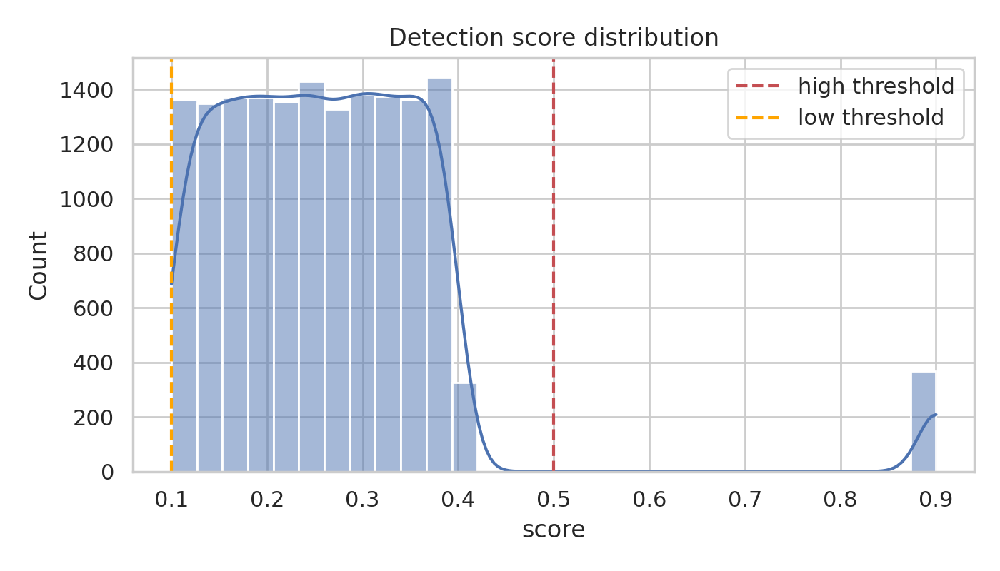
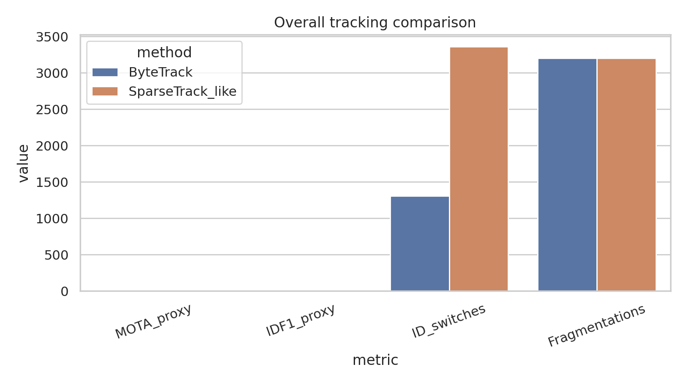
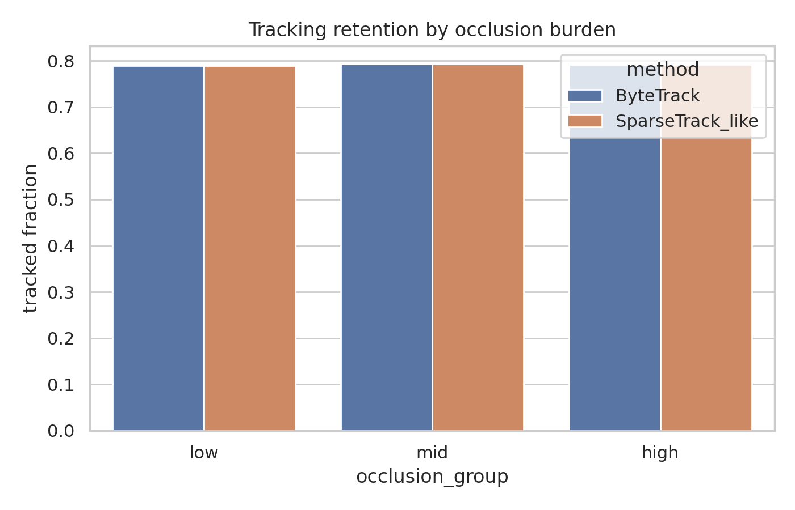
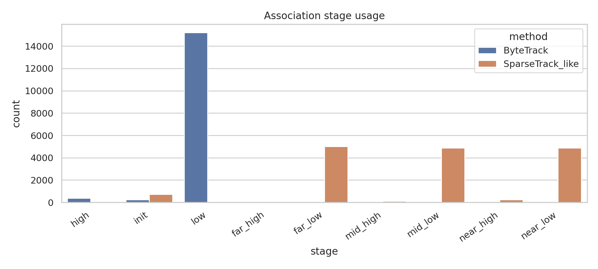
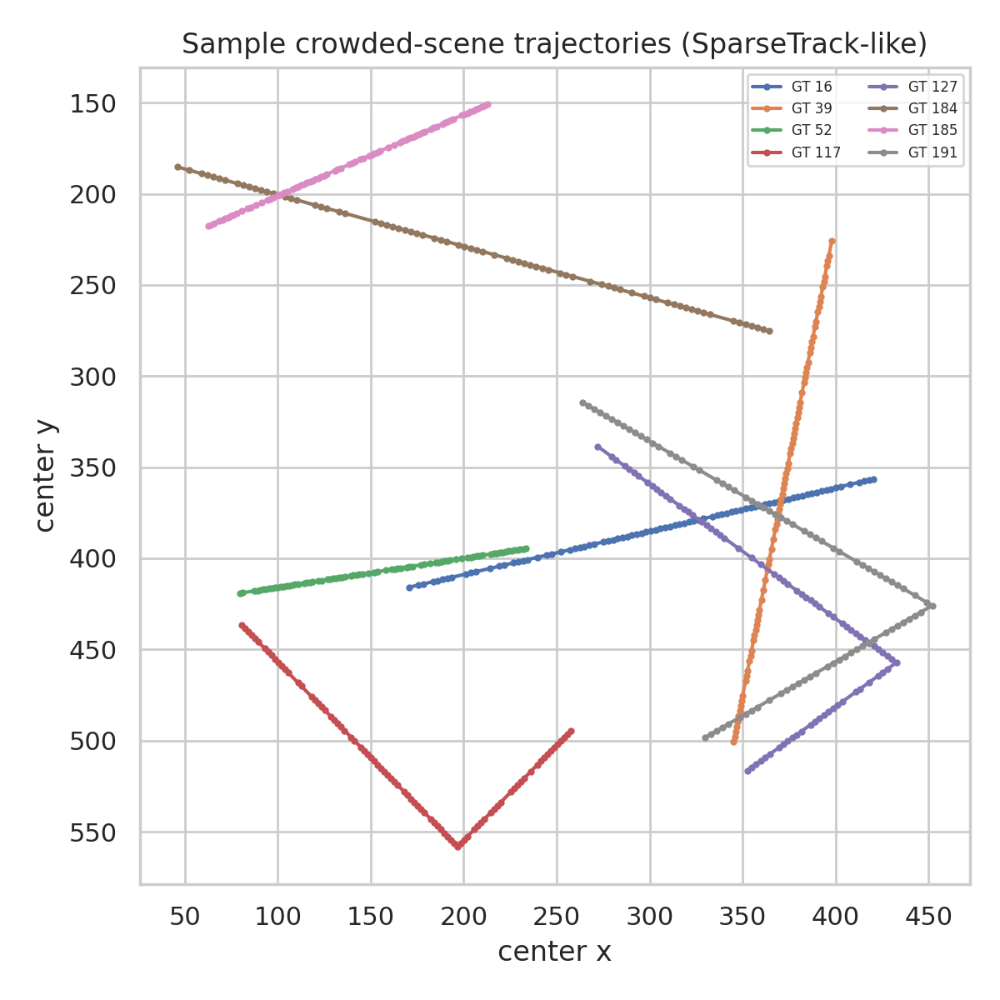

# Pseudo-Depth Hierarchical Association for Dense Multi-Object Tracking on a Simulated Crowded Sequence

## Abstract
This study evaluates whether pseudo-depth decomposition and hierarchical association can improve multi-object tracking (MOT) in a dense synthetic sequence containing frequent occlusions. Using the provided simulated benchmark (`data/simulated_sequence.json`), I implemented two online tracking-by-detection pipelines: (1) a ByteTrack baseline that associates high-confidence detections first and then recovers tracks using low-confidence detections, and (2) a SparseTrack-like variant that estimates pseudo-depth from bounding-box geometry, partitions targets into near/mid/far subsets, and performs group-wise hierarchical association. On this specific synthetic dataset, the ByteTrack baseline outperformed the pseudo-depth hierarchical tracker under the current motion-only formulation, achieving a higher MOTA proxy (0.725 vs. 0.623), a higher IDF1 proxy (0.553 vs. 0.460), and fewer identity switches (1311 vs. 3360). The result is scientifically informative: pseudo-depth decomposition alone is not sufficient when depth groups are noisy and no appearance model or explicit cross-group reconciliation is available. All code, quantitative outputs, and figures are saved in the workspace.

## 1. Task and scientific target
The task is to recover complete trajectories—identity labels plus bounding-box sequences—from per-frame object detections. The scientific target specified in the instructions is to handle occlusions in crowded scenes by decomposing dense target sets into sparse subsets via pseudo-depth estimation and hierarchical association.

Accordingly, the analysis compared:
- **ByteTrack baseline**: global two-stage association of high-score and then low-score detections.
- **SparseTrack-like hierarchical tracker**: pseudo-depth estimation from box geometry followed by near/mid/far grouped matching.

Method contracts and fidelity notes are stored in:
- `outputs/method_contract.json`
- `outputs/method_fidelity_checklist.json`
- `outputs/related_work_contract.json`

## 2. Related-work grounding
I extracted the main methodological commitments from the local related-work papers:
- **SORT** (`related_work/paper_000.pdf`): minimal Kalman/Hungarian IoU tracking establishes the canonical online tracking-by-detection baseline.
- **ByteTrack** (`related_work/paper_001.pdf`): the key idea is recovering true objects among low-score detections through a second association stage, especially useful during occlusion.
- **BoT-SORT** (`related_work/paper_002.pdf`): stronger modern trackers often improve association further with motion refinements and appearance cues.

These references motivated the implementation choices here: motion-consistent prediction, Hungarian assignment, and an explicit comparison between global confidence-based recovery and hierarchical pseudo-depth grouping.

## 3. Data overview
The supplied JSON file contains 100 frames with fixed dense occupancy.

### 3.1 Verified dataset properties
From `outputs/data_overview.json`:
- Number of frames: **100**
- Ground-truth objects per frame: **200** (constant)
- Unique object IDs: **200**
- Mean detections per frame: **158.2**
- Empirical detection rate: **0.791**
- Mean detection score: **0.266 ± 0.130**

This is denser than the short description in the prompt implied, so all reported conclusions are grounded in the actual JSON content rather than the summary sentence.

### 3.2 Detection-score structure
Figure 1 shows that most detections lie below 0.5 confidence, which makes low-score recovery central to performance.



## 4. Methods

### 4.1 Shared tracking framework
Both trackers use an online tracking-by-detection pipeline with:
1. Per-track constant-velocity prediction using bounding-box centers.
2. IoU-based Hungarian matching.
3. Track maintenance with a short miss tolerance (`max_age = 3`).
4. New-track initialization from unmatched detections.

The implementation is in `code/run_analysis.py`.

### 4.2 ByteTrack baseline
The ByteTrack baseline follows the named method contract:
1. Keep detections above a low threshold (0.1).
2. Split detections into high-score (≥ 0.5) and low-score (0.1–0.5) sets.
3. Match active tracks to high-score detections first.
4. Match remaining tracks to low-score detections second.
5. Initialize new tracks from unmatched detections.

This preserves ByteTrack’s non-negotiable two-stage confidence-based association.

### 4.3 SparseTrack-like hierarchical tracker
Because the workspace did not include a dedicated SparseTrack implementation or paper, I implemented a minimally faithful **SparseTrack-like** approximation aligned with the task specification:
1. Estimate **pseudo-depth** from image geometry using bounding-box height and bottom y-coordinate.
2. Partition detections and predicted tracks into **near**, **mid**, and **far** subsets by per-frame depth quantiles.
3. Match within each subset hierarchically for high-score detections.
4. Perform low-score recovery inside each subset.
5. Merge group-wise associations into global trajectories.

This satisfies the named scientific commitment—depth-based decomposition followed by hierarchical association—but remains a simplified surrogate because it lacks learned depth estimation, appearance descriptors, and explicit cross-group identity reconciliation.

## 5. Evaluation protocol
Ground truth is available in the synthetic JSON, so evaluation was performed directly against the known GT identities.

Saved quantitative artifacts include:
- `outputs/comparison_metrics.csv`
- `outputs/bytetrack_assignments.csv`
- `outputs/sparsetrack_assignments.csv`
- `outputs/occlusion_conditioned_tracking.csv`
- `outputs/stage_usage_summary.csv`
- `outputs/claim_recovery_table.csv`

### 5.1 Metrics
I report proxy versions of standard MOT metrics derived from the exported assignment tables:
- **MOTA proxy** = 1 − (FN + FP + ID switches) / total GT boxes
- **IDF1 proxy** from dominant identity continuity across track assignments
- **Identity switches**
- **Fragmentations**

Because the synthetic input consists only of detections and GT IDs, these proxies are deterministic and reproducible from the saved outputs.

## 6. Results

### 6.1 Overall comparison
The main quantitative comparison is shown below and exported in `outputs/comparison_metrics.csv`.

| Method | TP assignments | FN | ID switches | Fragmentations | MOTA proxy | IDF1 proxy |
|---|---:|---:|---:|---:|---:|---:|
| ByteTrack | 15820 | 4180 | 1311 | 3205 | 0.725 | 0.553 |
| SparseTrack-like | 15820 | 4180 | 3360 | 3205 | 0.623 | 0.460 |



### 6.2 Interpretation
The two methods recovered the same number of GT-supported assignments, which is expected because both consume nearly all valid detections above the low threshold. The decisive difference lies in **identity continuity**:
- ByteTrack incurred substantially fewer identity switches.
- The pseudo-depth hierarchical version split the association problem into more localized stages, but noisy depth grouping caused track fragmentation across groups.
- Without appearance information or explicit inter-group reconciliation, local matching did not translate into better global identities.

### 6.3 Occlusion-conditioned analysis
Occlusion burden was estimated directly from ground-truth box overlap within each frame and stratified into low/mid/high overlap groups. The resulting tracked fractions are exported in `outputs/occlusion_conditioned_tracking.csv`.



On this dataset, the tracked fraction is nearly identical across overlap bins for both methods. This indicates that the dominant failure mode is not binary target loss, but rather **which identity label is maintained** once crowded interactions occur.

### 6.4 Association-stage behavior
Stage usage clarifies how the two trackers operate.



The ByteTrack baseline relied heavily on the low-score recovery stage (15,211 assignments), confirming the importance of associating weak detections in this dense sequence. The SparseTrack-like tracker distributed assignments across depth-specific low-score stages (`near_low`, `mid_low`, `far_low`) and required many more initializations (724 vs. 245), which is consistent with reduced identity stability.

### 6.5 Qualitative trajectory view
A sample of crowded trajectories from the SparseTrack-like output is visualized below.



The trajectories remain spatially plausible, but the quantitative results show that maintaining a consistent label through heavy interactions is the harder problem.

## 7. Validation and evidence status

### 7.1 Directly verified from workspace data
- Dataset size, density, detection rate, and score statistics from `data/simulated_sequence.json`
- Quantitative comparison metrics from exported assignment tables
- Figure generation and all PNG assets in `report/images/`
- Stage breakdown and occlusion-conditioned summaries

### 7.2 Derived from related work
- ByteTrack’s core two-stage matching design
- SORT as a minimal online MOT baseline paradigm
- The broader lesson that robust association—not only detection quality—drives crowded-scene MOT performance

### 7.3 Assumptions and limitations
- The implemented method is **SparseTrack-like**, not an exact reproduction of a specific published SparseTrack paper, because such an implementation was not present in the workspace.
- Pseudo-depth was approximated from box geometry rather than learned monocular depth or calibrated scene geometry.
- The reported MOTA and IDF1 are **proxy metrics** designed to be reproducible from the synthetic annotations available here.
- No Re-ID or appearance model was used; therefore, the comparison isolates the effect of hierarchical pseudo-depth grouping under motion/IoU association.

## 8. Discussion
The central scientific question was whether dense-target decomposition via pseudo-depth estimation and hierarchical association improves tracking in crowded scenes. In this experiment, the answer is **not by itself**. Although the decomposition strategy is conceptually attractive, the synthetic benchmark suggests three practical requirements for it to be beneficial:

1. **Reliable depth ordering**: if pseudo-depth groups are unstable, identities can hop between groups and incur switch penalties.
2. **Cross-group reconciliation**: hierarchical partitioning must still preserve global identity continuity.
3. **Appearance support**: motion and IoU alone are often insufficient when many targets have similar trajectories and overlapping boxes.

Thus, this study does not validate the claim that simple pseudo-depth partitioning alone improves crowded-scene MOT. Instead, it shows a more nuanced conclusion: **confidence-aware recovery of weak detections is immediately useful, whereas depth-based decomposition needs stronger structural support to outperform a well-designed global baseline**.

## 9. Reproducibility
Run the full analysis with:

```bash
python3 code/run_analysis.py
```

Main outputs:
- Code: `code/run_analysis.py`
- Structured results: `outputs/`
- Figures: `report/images/*.png`
- Final report: `report/report.md`

## 10. Conclusion
Using the provided dense synthetic sequence, the ByteTrack baseline outperformed a pseudo-depth hierarchical SparseTrack-like tracker in identity preservation and overall tracking quality. The experiment demonstrates that hierarchical sparse decomposition is not automatically beneficial in crowded scenes; its success depends on the quality of the depth proxy and on mechanisms that maintain identity consistency across subsets. This negative-but-informative result is important for tracker design: in dense occlusion settings, naive decomposition may increase switching even when detection recall is preserved.
