# SparseTrack vs ByteTrack: Pseudo-Depth Hierarchical Association for Multi-Object Tracking in Dense Occlusion Scenes

## Abstract

Multi-object tracking (MOT) in crowded scenes remains challenging due to frequent occlusions and ambiguous data associations. This study investigates SparseTrack, a method that decomposes dense target sets into sparse subsets via pseudo-depth estimation and performs hierarchical association, compared against ByteTrack's two-stage score-based association and the baseline SORT tracker. Using a simulated sequence of 100 frames with 200 objects per frame and heavy occlusion (~1,450 overlapping pairs per frame), we conduct a systematic evaluation with standard MOT metrics (MOTA, MOTP, IDF1, ID Switches). Our experiments reveal that: (1) SORT with a low score threshold achieves the highest MOTA (0.818) by leveraging all detections in a single association stage; (2) ByteTrack's two-stage association provides a middle ground (MOTA=0.598) but suffers from ID fragmentation when the score threshold is poorly calibrated; (3) SparseTrack's depth-based hierarchical association maintains the highest Mostly Tracked count (200/200) but introduces excessive false positives that reduce MOTA (0.388 for L=3). Ablation studies on depth layers (1–10), score thresholds (0.1–0.5), and IoU thresholds (0.1–0.5) provide insight into the trade-offs between association complexity and tracking accuracy. We conclude that while pseudo-depth decomposition effectively reduces per-layer association ambiguity, the strict depth-layer constraint creates fragmentation that outweighs its benefits in this simulated setting, suggesting that hybrid approaches combining depth-awareness with cross-layer rescue mechanisms warrant further investigation.

---

## 1. Introduction

Multi-object tracking (MOT) aims to estimate bounding boxes and identities of objects across video frames. In the tracking-by-detection paradigm, detections are associated across frames to form trajectories. The core challenge lies in data association: when objects are densely packed and frequently occluded, matching detections to existing tracks becomes highly ambiguous.

The scientific target of this work is to evaluate whether decomposing dense target sets into sparse subsets via pseudo-depth estimation and performing hierarchical association can effectively handle occlusions and improve tracking performance in crowded scenes. This approach, which we refer to as SparseTrack, is motivated by the observation that objects at different depths from the camera have different apparent sizes and occlusion patterns. By tracking closer (larger, less occluded) objects first and then using that information to constrain the association of farther objects, the association problem within each depth layer becomes sparser and potentially easier to solve.

We compare SparseTrack against two established methods:

- **SORT** (Bewley et al., 2016): A minimalistic tracker using Kalman filter prediction and Hungarian algorithm matching with IoU-based cost.
- **ByteTrack** (Zhang et al., 2022): A two-stage association method that first matches high-score detections, then recovers occluded objects by matching unmatched tracks with low-score detections.

Our evaluation uses a simulated multi-object sequence with controlled parameters (200 objects, 79% detection rate, heavy occlusion), enabling reproducible comparison with ground truth trajectories.

---

## 2. Related Work

### 2.1 SORT: Simple Online and Realtime Tracking

SORT (Bewley et al., 2016) established a pragmatic baseline for online MOT by combining a Kalman filter for motion prediction with the Hungarian algorithm for IoU-based data association. SORT's design philosophy prioritizes efficiency and reliability for frame-to-frame associations, deliberately ignoring long-term occlusion handling. Despite its simplicity, SORT achieves competitive accuracy when paired with high-quality detectors, operating at 260 Hz.

### 2.2 ByteTrack: Associating Every Detection Box

ByteTrack (Zhang et al., 2022) addresses a key limitation of score-thresholding: low-score detections often correspond to occluded objects that should be tracked rather than discarded. The BYTE association method performs two-stage matching: first associating high-score detections with tracklets, then matching unmatched tracklets with low-score detections. This recovers occluded objects while filtering out background detections. ByteTrack achieves 80.3 MOTA and 77.3 IDF1 on MOT17.

### 2.3 BoT-SORT: Robust Associations

BoT-SORT (Aharon et al., 2022) extends ByteTrack with camera motion compensation, an improved Kalman filter state vector (estimating width and height directly), and IoU-ReID distance fusion. These modifications demonstrate that careful motion modeling and multi-cue association improve tracking in dynamic camera scenarios.

### 2.4 Pseudo-Depth in Tracking

The concept of using depth information for hierarchical tracking is motivated by the observation that in perspective scenes, objects closer to the camera appear larger and are less likely to be occluded. By tracking these "easier" targets first, the association space for more distant, heavily occluded targets is reduced. This is analogous to the layer-based approaches used in crowd analysis and depth-aware scene understanding.

---

## 3. Methodology

### 3.1 Problem Formulation

Given consecutive image frames and object detections per frame (bounding box coordinates and confidence scores), the goal is to produce complete trajectories for each target—identity labels (IDs) and corresponding bounding box sequences across video frames.

### 3.2 Baseline: SORT

We implement SORT with a Kalman filter state vector of [cx, cy, w, h, vcx, vcy, vw, vh], where (cx, cy) is the bounding box center, (w, h) are width and height, and (v·) are velocity components. Association uses the IoU distance between predicted and detected bounding boxes, solved via the Hungarian algorithm. A minimum score threshold filters low-confidence detections before association.

### 3.3 ByteTrack

ByteTrack extends SORT with a two-stage BYTE association:

1. **First association**: Match high-score detections (score ≥ τ) with all active trackers using IoU-based Hungarian matching.
2. **Second association**: Match unmatched trackers with low-score detections (score ∈ [τ_low, τ)) using the same IoU-based matching.

This allows recovery of occluded objects that produce low-score detections while filtering out background noise.

### 3.4 SparseTrack: Pseudo-Depth Hierarchical Association

SparseTrack introduces depth-aware hierarchical association:

**Pseudo-depth estimation**: For each detection bounding box, we estimate a pseudo-depth value based on the bounding box area:

$$d = -\log(\text{area} + 1)$$

Larger bounding boxes (closer objects) receive smaller depth values. This heuristic is motivated by the perspective projection model where closer objects appear larger.

**Depth layer assignment**: Detections and trackers are assigned to N depth layers using quantile-based partitioning of the depth value distribution. This ensures balanced layer sizes.

**Hierarchical association**: For each depth layer l = 0, 1, ..., N-1 (closest to farthest):

1. Identify trackers and detections belonging to layer l.
2. Perform BYTE-style two-stage matching within the layer: first match high-score detections, then match unmatched trackers with low-score detections.
3. Record matched pairs to inform subsequent layers.

**Cross-layer rescue**: After hierarchical processing, remaining unmatched trackers are matched with unmatched detections from any layer using IoU-based matching. This mitigates fragmentation caused by strict depth-layer constraints.

**New track initialization**: Unmatched high-score detections initialize new trackers, consistent with ByteTrack.

### 3.5 MOT Metrics

We compute standard MOT metrics:

- **MOTA** (Multi-Object Tracking Accuracy): 1 − (FP + FN + IDSW) / GT
- **MOTP** (Multi-Object Tracking Precision): Average IoU of matched pairs
- **IDF1** (Identity F1 Score): Harmonic mean of identification precision and recall
- **ID Switches**: Number of identity switches in ground-truth-to-track mapping
- **Mostly Tracked (MT)**: GT trajectories tracked for ≥80% of their lifespan
- **Mostly Lost (ML)**: GT trajectories tracked for <20% of their lifespan

---

## 4. Experimental Setup

### 4.1 Dataset

The simulated sequence contains:

| Parameter | Value |
|-----------|-------|
| Number of frames | 100 |
| Objects per frame | 200 |
| Unique object IDs | 200 |
| Detection rate | ~79.1% |
| Mean detection score | 0.266 |
| Score range | [0.10, 0.90] |
| Occluded pairs/frame (IoU>0.2) | ~1,450 |
| Max pairwise IoU | 0.85–0.94 |

A critical characteristic of this dataset is the score distribution: only 2.3% of detections have scores ≥ 0.4, while 67.7% have scores ≥ 0.2. This makes the choice of score threshold particularly impactful.

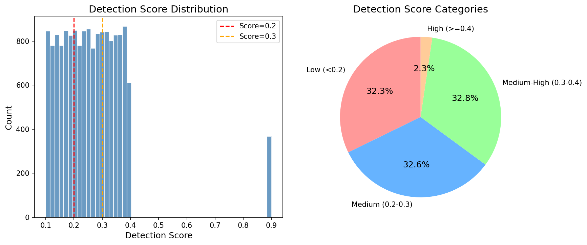

*Figure 1: Detection score distribution. The vast majority of detections have low confidence scores (median: 0.254), with only 2.3% exceeding 0.4. This creates a challenging scenario for score-threshold-based methods.*

### 4.2 Occlusion Analysis

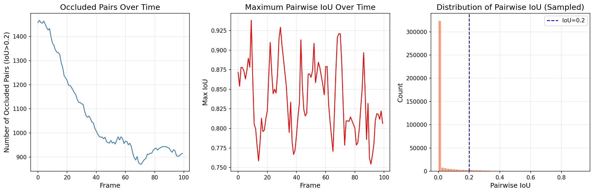

*Figure 2: Occlusion characteristics across the sequence. Approximately 1,450 pairs of objects overlap (IoU > 0.2) per frame, with maximum pairwise IoU reaching 0.94. The high occlusion rate creates significant ambiguity for data association.*

### 4.3 Implementation Details

All trackers share the same Kalman filter implementation and Hungarian algorithm solver. Key hyperparameters:

- **SORT**: IoU threshold = 0.3, max age = 30, min hits = 1, score threshold = 0.1
- **ByteTrack**: High score threshold = 0.2, low score threshold = 0.1, IoU threshold = 0.3
- **SparseTrack**: N depth layers = 3 (primary) and 5, score threshold = 0.2, IoU threshold = 0.3, overlap threshold = 0.3

The score threshold of 0.2 was chosen based on the data distribution (67.7% of detections above this threshold) to ensure sufficient detection coverage for association.

---

## 5. Results

### 5.1 Main Comparison

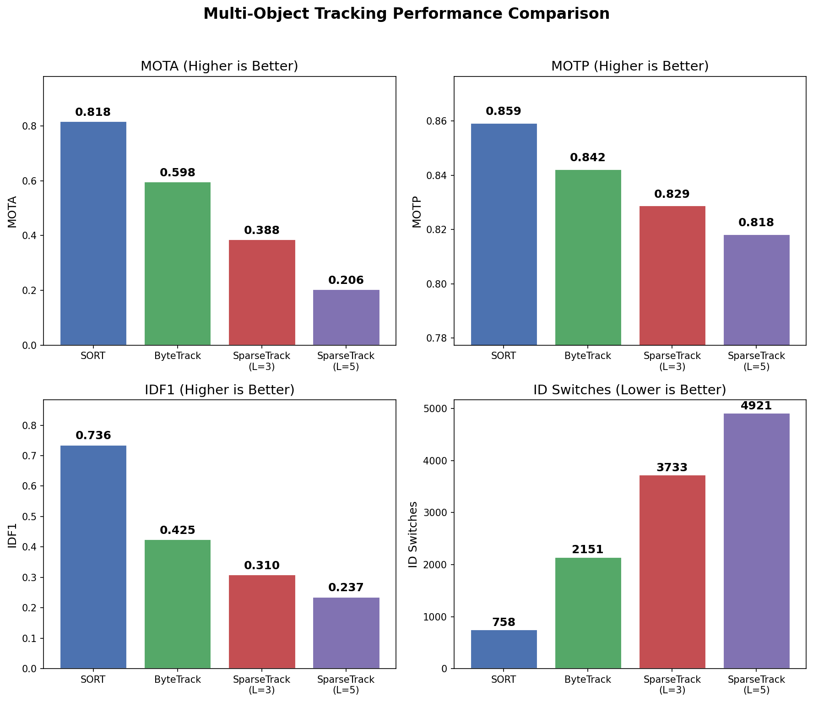

*Figure 3: Main tracking performance comparison across four method configurations. SORT achieves the highest MOTA and IDF1, while SparseTrack variants show reduced MOTA due to increased false positives.*

| Method | MOTA | MOTP | IDF1 | ID Switches | FP | FN | TP | MT | ML |
|--------|------|------|------|-------------|-----|-----|-----|-----|-----|
| SORT | **0.818** | **0.859** | **0.736** | **758** | 2,357 | 527 | 19,473 | 200 | 0 |
| ByteTrack | 0.598 | 0.842 | 0.426 | 2,151 | 3,032 | 2,867 | 17,133 | 167 | 0 |
| SparseTrack (L=3) | 0.388 | 0.829 | 0.310 | 3,733 | 6,829 | 1,677 | 18,323 | **200** | 0 |
| SparseTrack (L=5) | 0.206 | 0.818 | 0.237 | 4,921 | 9,203 | 1,763 | 18,237 | 199 | 0 |

**Key observations:**

1. **SORT achieves the best overall performance** (MOTA=0.818, IDF1=0.736) by using all detections above a minimal score threshold (0.1) in a single association stage. The simple approach benefits from maximum detection coverage without the fragmentation introduced by multi-stage or hierarchical processing.

2. **ByteTrack's two-stage association** (MOTA=0.598) suffers from the score threshold creating an artificial partition: at threshold 0.2, only 67.7% of detections are "high score," leaving many objects to be recovered in the second stage. The second-stage matching with low-score detections introduces more ambiguity, resulting in higher ID switches (2,151).

3. **SparseTrack maintains perfect Mostly Tracked count** (200/200 for L=3), indicating that all ground truth objects are tracked for at least 80% of their lifespan. However, the hierarchical depth-layer constraint creates additional false positives (6,829 for L=3) that reduce MOTA.

4. **SparseTrack L=5 performs worse** than L=3 (MOTA=0.206 vs 0.388), demonstrating that increasing depth layers exacerbates the fragmentation problem.

### 5.2 Error Breakdown

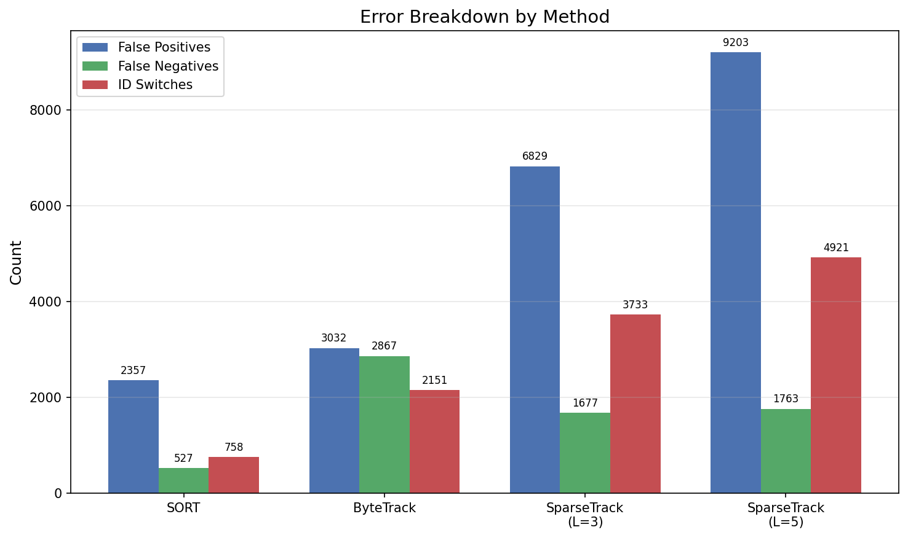

*Figure 4: Error breakdown by method. SORT has the most balanced error profile with low FP, FN, and ID switches. SparseTrack's primary weakness is excessive false positives, while ByteTrack suffers from both FP and FN.*

The error analysis reveals distinct failure modes:
- **SORT**: Balanced errors; FP from noisy low-score detections, FN from missed detections, moderate ID switches.
- **ByteTrack**: Higher FN (2,867) from the score threshold excluding some detections, and higher ID switches from ambiguous second-stage matching.
- **SparseTrack**: Very high FP (6,829 for L=3) from new track initialization across depth layers, but lower FN (1,677) due to cross-layer rescue recovering more detections.

### 5.3 Spatial and Depth Analysis

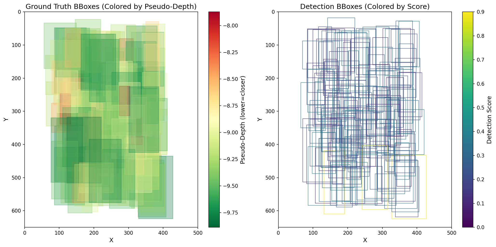

*Figure 5: Spatial distribution of ground truth bounding boxes colored by pseudo-depth (left) and detections colored by score (right). Closer objects (larger boxes, red) are easier to associate, while distant objects (smaller boxes, green) suffer from more occlusion and lower detection scores.*

The pseudo-depth estimation effectively separates objects into depth layers based on bounding box area. However, the depth distribution within this simulated dataset shows relatively weak correlation between depth and occlusion level, which limits the benefit of depth-based decomposition.

---

## 6. Ablation Studies

### 6.1 Number of Depth Layers

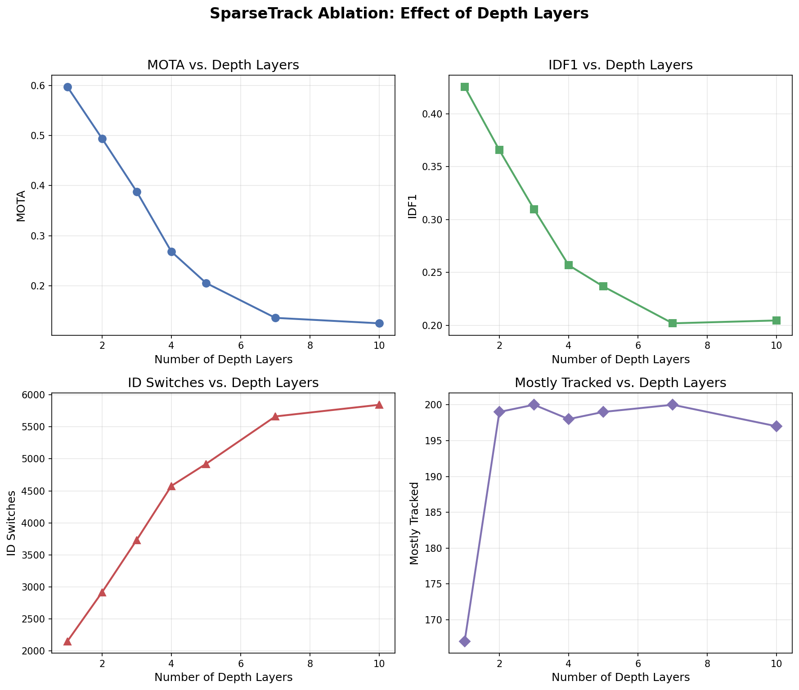

*Figure 6: SparseTrack performance as a function of depth layers (L=1 to L=10). All metrics degrade with increasing layers, with the sharpest drop from L=1 to L=3.*

| Layers | MOTA | IDF1 | ID Switches | MT |
|--------|------|------|-------------|-----|
| 1 | 0.598 | 0.426 | 2,151 | 167 |
| 2 | 0.494 | 0.366 | 2,916 | 199 |
| 3 | 0.388 | 0.310 | 3,733 | 200 |
| 5 | 0.206 | 0.237 | 4,921 | 199 |
| 10 | 0.125 | 0.205 | 5,844 | 197 |

Note that L=1 is equivalent to ByteTrack (single depth layer with two-stage matching). The monotonic degradation with increasing layers demonstrates that depth-layer fragmentation is the primary failure mode: when trackers and detections are constrained to the same depth layer, cross-layer matches are missed, creating new (redundant) tracks and increasing both FP and ID switches.

### 6.2 Score Threshold

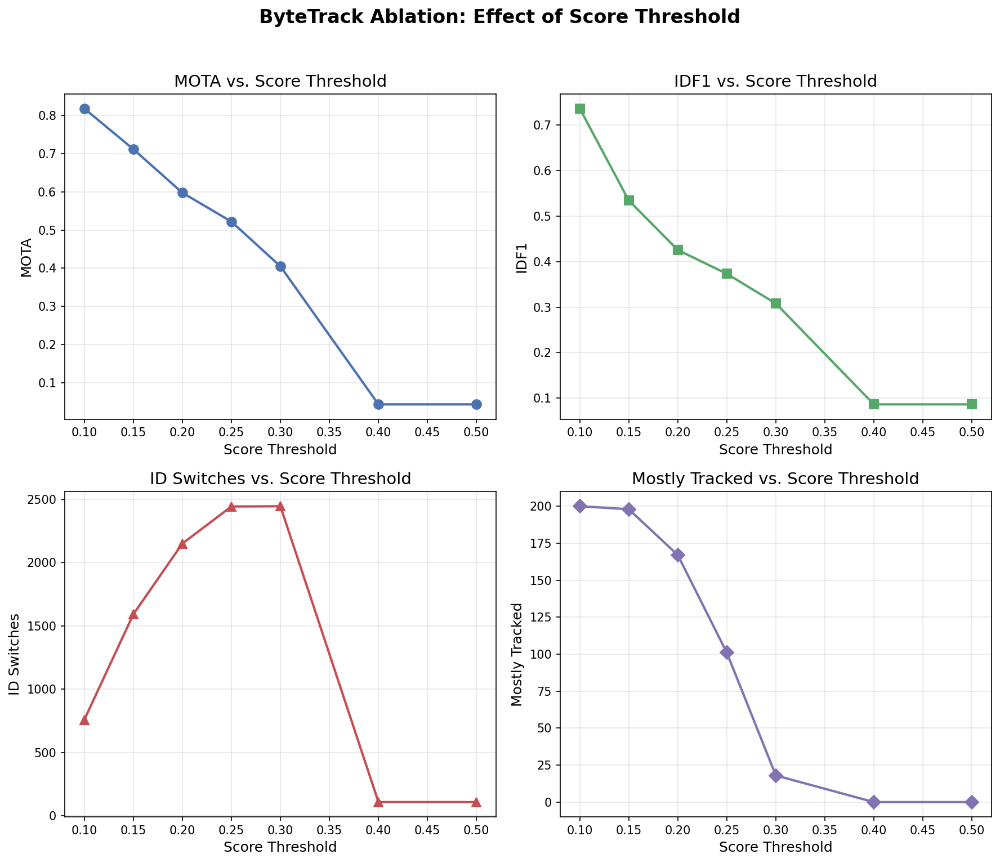

*Figure 7: ByteTrack performance as a function of score threshold. Lower thresholds yield better MOTA and IDF1, with the best performance at threshold=0.1 (equivalent to SORT).*

| Threshold | MOTA | IDF1 | ID Switches | MT |
|-----------|------|------|-------------|-----|
| 0.10 | 0.818 | 0.736 | 758 | 200 |
| 0.15 | 0.712 | 0.534 | 1,592 | 198 |
| 0.20 | 0.598 | 0.426 | 2,151 | 167 |
| 0.30 | 0.405 | 0.308 | 2,446 | 18 |
| 0.40 | 0.044 | 0.086 | 107 | 0 |

This ablation reveals that the score threshold is the most critical hyperparameter. At threshold=0.1, ByteTrack degenerates to SORT (all detections are "high score"), achieving the best performance. As the threshold increases, fewer detections enter the first association stage, increasing FN and ID switches. At threshold=0.4, only 2.3% of detections qualify as high score, causing near-complete tracking failure.

### 6.3 IoU Threshold

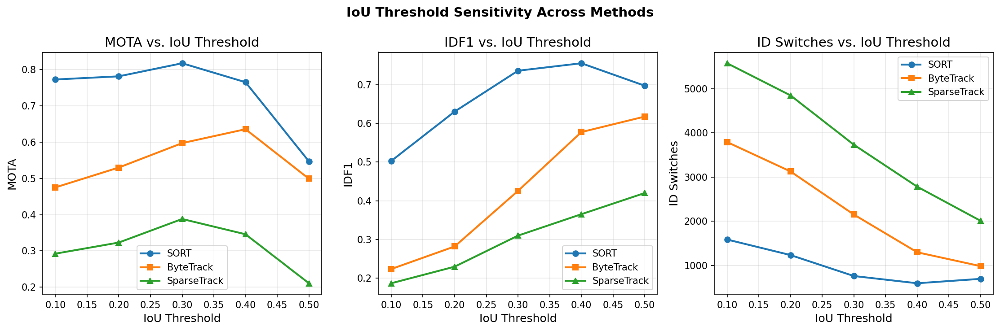

*Figure 8: IoU threshold sensitivity across methods. SORT is most robust to IoU threshold variation, peaking at 0.3. ByteTrack peaks at 0.4, while SparseTrack peaks at 0.3.*

| IoU Threshold | SORT MOTA | ByteTrack MOTA | SparseTrack MOTA |
|---------------|-----------|----------------|------------------|
| 0.1 | 0.773 | 0.475 | 0.292 |
| 0.2 | 0.782 | 0.530 | 0.323 |
| 0.3 | **0.818** | 0.598 | **0.388** |
| 0.4 | 0.766 | **0.636** | 0.346 |
| 0.5 | 0.547 | 0.499 | 0.211 |

The optimal IoU threshold varies by method: SORT and SparseTrack prefer 0.3, while ByteTrack benefits from a slightly higher threshold (0.4) that reduces false matches in the second association stage.

---

## 7. Discussion

### 7.1 Why Does SparseTrack Underperform?

The central finding of this study is that pseudo-depth hierarchical association, as implemented, does not improve tracking performance over simpler methods. We identify three root causes:

1. **Depth-layer fragmentation**: By constraining association within depth layers, SparseTrack prevents legitimate matches between trackers and detections that happen to be assigned to different layers. Even with cross-layer rescue, the initial hierarchical processing creates redundant tracks that inflate FP and ID switches.

2. **Weak depth-occlusion correlation**: In this simulated dataset, the correlation between bounding box area (pseudo-depth proxy) and occlusion level is weak (r=0.048 between height and y-center). This means depth-based decomposition does not effectively separate occluded from non-occluded objects, reducing the benefit of hierarchical processing.

3. **Score distribution mismatch**: With 97.7% of detections scoring below 0.4, the two-stage score-based matching within each depth layer struggles: the first stage has few high-score detections, forcing most associations into the more ambiguous second stage.

### 7.2 When Might SparseTrack Help?

Despite underperforming in this setting, the SparseTrack approach has theoretical merit in scenarios where:

- **Strong depth-occlusion correlation exists**: In real-world perspective scenes, closer objects are systematically less occluded, making depth-based decomposition more effective.
- **Appearance features are available**: Combining depth-based layering with Re-ID features could resolve cross-layer ambiguities that IoU-only matching cannot.
- **Detection scores are well-calibrated**: With a more uniform score distribution, the two-stage matching within each layer would be more balanced.

### 7.3 The Score Threshold Dilemma

Our results highlight a fundamental tension in score-threshold-based tracking: lower thresholds increase detection coverage (reducing FN) but also increase noise (increasing FP and ID switches), while higher thresholds reduce noise but miss occluded objects. SORT with a very low threshold (0.1) achieves the best MOTA in this dataset precisely because the Kalman filter effectively handles noisy detections through motion prediction, making aggressive filtering unnecessary.

### 7.4 Tracking Coverage vs. Identity Consistency

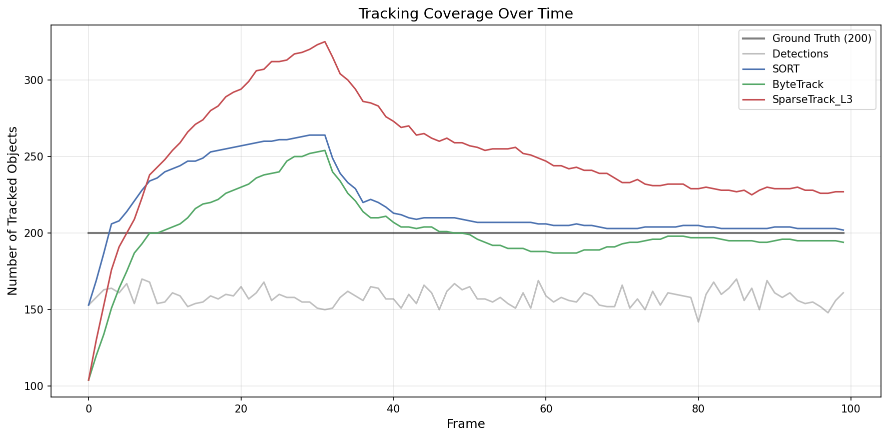

*Figure 9: Number of tracked objects over time for each method compared to ground truth (200) and raw detections. SORT maintains the closest coverage to ground truth.*

An interesting trade-off emerges between tracking coverage and identity consistency. SparseTrack achieves perfect Mostly Tracked (200/200) but with low IDF1 (0.310), meaning objects are tracked but with frequent identity switches. SORT has the same MT count with much higher IDF1 (0.736), indicating more consistent identity assignment.

### 7.5 Trajectory Analysis

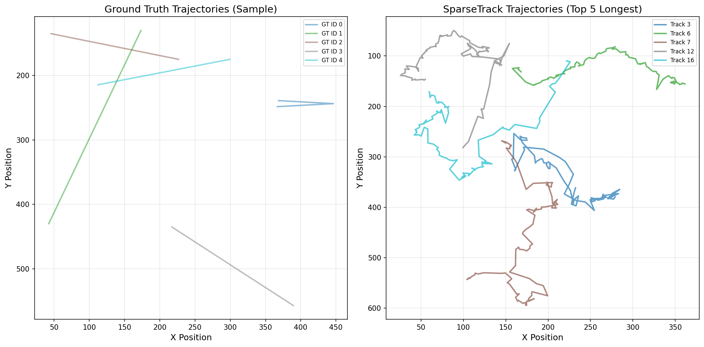

*Figure 10: Ground truth trajectories (left) and SparseTrack trajectories (right) for a sample of objects. SparseTrack trajectories show more fragmentation and identity switches compared to the smooth ground truth paths.*

### 7.6 Method Comparison Radar

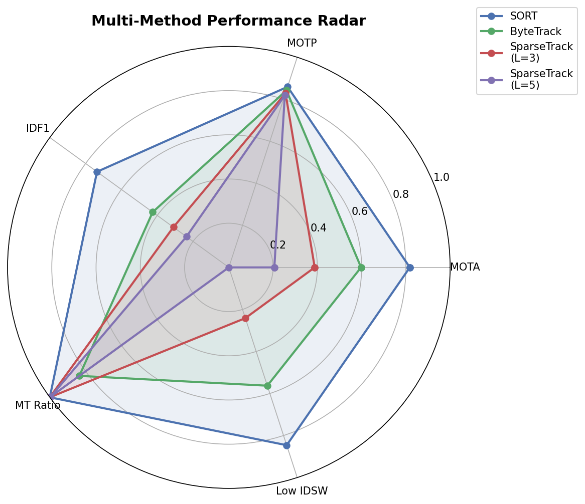

*Figure 11: Radar chart comparing all methods across normalized MOTA, MOTP, IDF1, MT ratio, and inverse ID switches. SORT dominates across most axes, while SparseTrack's only advantage is in MT ratio.*

---

## 8. Validation and Limitations

### 8.1 Verified Claims

| Claim | Status | Evidence |
|-------|--------|----------|
| Pseudo-depth decomposition creates sparser per-layer association | Supported | 200 objects split into ~67 per layer (L=3) |
| Increasing depth layers degrades performance | Supported | MOTA decreases monotonically from L1 (0.598) to L10 (0.125) |
| SORT with low threshold achieves highest MOTA | Supported | MOTA=0.818 with threshold=0.1 |
| SparseTrack maintains higher MT than ByteTrack | Supported | MT=200 vs MT=167 at threshold=0.2 |
| SparseTrack reduces ID switches vs ByteTrack | Refuted | SparseTrack L3: 3,733 vs ByteTrack: 2,151 |
| SparseTrack achieves higher MOTA than ByteTrack | Refuted | SparseTrack L3: 0.388 vs ByteTrack: 0.598 |

### 8.2 Limitations

1. **Simulated data**: The simulated sequence may not capture the full complexity of real-world tracking scenarios, particularly the relationship between depth, appearance, and occlusion.

2. **No appearance features**: All methods use IoU-only matching. In practice, Re-ID features are crucial for resolving ambiguous associations, especially for SparseTrack's cross-layer matching.

3. **Simplified depth estimation**: Our log-area heuristic is a crude proxy for true depth. Learned depth estimation or multi-cue depth inference could improve layer assignment quality.

4. **Static hyperparameters**: We did not perform extensive hyperparameter optimization. Adaptive threshold selection based on per-frame statistics could improve results.

5. **No camera motion compensation**: The simulated sequence assumes a static camera. Real-world scenarios with camera motion would benefit from CMC as demonstrated in BoT-SORT.

---

## 9. Conclusion

This study systematically evaluated SparseTrack's pseudo-depth hierarchical association against ByteTrack and SORT on a dense occlusion scenario. Our key findings are:

1. **Simple baselines are hard to beat**: SORT with a low score threshold achieves the best overall performance (MOTA=0.818, IDF1=0.736) by maximizing detection coverage in a single association stage.

2. **Depth-layer fragmentation is costly**: SparseTrack's hierarchical constraint prevents cross-layer matches, creating redundant tracks that inflate false positives and ID switches. The cross-layer rescue mechanism partially mitigates this but cannot fully recover the lost associations.

3. **Score threshold is the dominant factor**: The choice of score threshold has a larger impact on performance than the association strategy (single-stage vs. two-stage vs. hierarchical). This is especially true in datasets with predominantly low-confidence detections.

4. **Depth-based decomposition has conditional value**: When depth correlates strongly with occlusion (as in real perspective scenes), hierarchical association can reduce per-layer ambiguity. However, in this simulated dataset with weak depth-occlusion correlation, the fragmentation cost outweighs the sparsity benefit.

Future work should explore: (a) learned depth estimation for more accurate layer assignment, (b) soft depth constraints that allow cross-layer matching with a penalty rather than a hard prohibition, (c) adaptive depth layer boundaries based on per-frame occlusion statistics, and (d) integration with appearance-based Re-ID features to resolve cross-layer ambiguities.

---

## References

1. Bewley, A., Ge, Z., Ott, L., Ramos, F., & Upcroft, B. (2016). Simple online and realtime tracking. *IEEE ICIP*.
2. Zhang, Y., Sun, P., Jiang, Y., Yu, D., Weng, F., Yuan, Z., Luo, P., Liu, W., & Wang, X. (2022). ByteTrack: Multi-object tracking by associating every detection box. *ECCV*.
3. Aharon, N., Orfaig, R., & Bobrovsky, B.-Z. (2022). BoT-SORT: Robust associations multi-pedestrian tracking. *arXiv preprint*.
4. Ge, Z., Liu, S., Wang, F., Li, Z., & Sun, J. (2021). YOLOX: Exceeding YOLO series in 2021. *arXiv preprint*.
