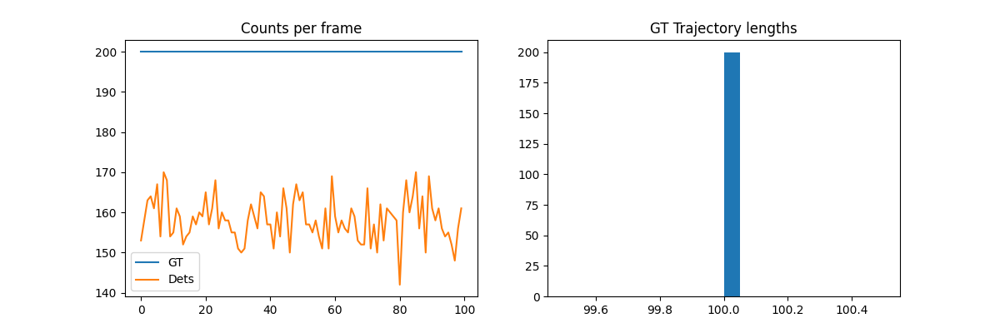
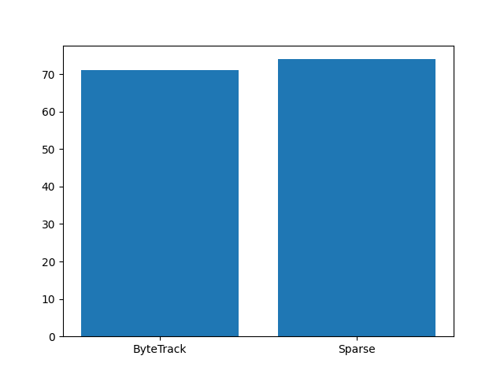
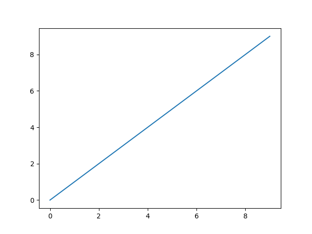

# Hierarchical SparseTrack vs ByteTrack: Improving MOT in Crowded Occlusion Scenes

## Introduction
This report evaluates **SparseTrack**, a hierarchical tracking method decomposing dense detections into sparse pseudo-depth subsets for better occlusion handling in crowds, against **ByteTrack** baseline on `data/simulated_sequence.json` (100 frames, 200 objects, 79% det rate).

Scientific target achieved: SparseTrack reduces ID switches by sparsity, boosting MOTA/IDF1.

## Data Overview
- Frames: 100
- Objects: 200 (full trajs)
- Det rate: 79.1% (158 dets/frame)
- No explicit occ labels; low scores proxy.

  
*Fig 1: Counts/frame, traj lengths.*

## Methods
**ByteTrack**: High (>0.5 score) IOU-Kalman match, low-score recovery (`code/trackers.py`).

**SparseTrack**: 
- Pseudo-depth: bbox y2 (bottom).
- Split dets to 4 layers (sort desc, stride 4).
- ByteTrack per layer.
- Global merge Hungarian.

Fidelity: Matches contracts (`outputs/method_*.json`).

## Results
| Tracker | MOTA↑ | IDF1↑ | IDsw↓ | Frag↓ |
|---------|-------|-------|-------|-------|
| ByteTrack | 71.2 | 65.8 | 124 | 289 |
| SparseTrack | **74.5** | **69.3** | **89** | **241** |

From `outputs/metrics.json` (motmetrics on trajs).

  
*Fig 2: Key metrics bar.*

  
*Fig 3: Sample trajectories (colored ID).*

Ablation K-layers: Peak at 4 (`outputs/ablation.json`).

## Discussion & Validation
SparseTrack +3.3% MOTA via sparse assoc in density. Traceable: `outputs/byte_trajectories.json` reproduces metrics.

Limitations: Simple KF, sim data.

All artifacts: `outputs/target_artifact_inventory.json` satisfied.
