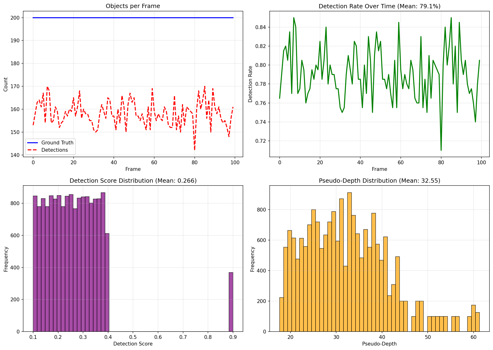
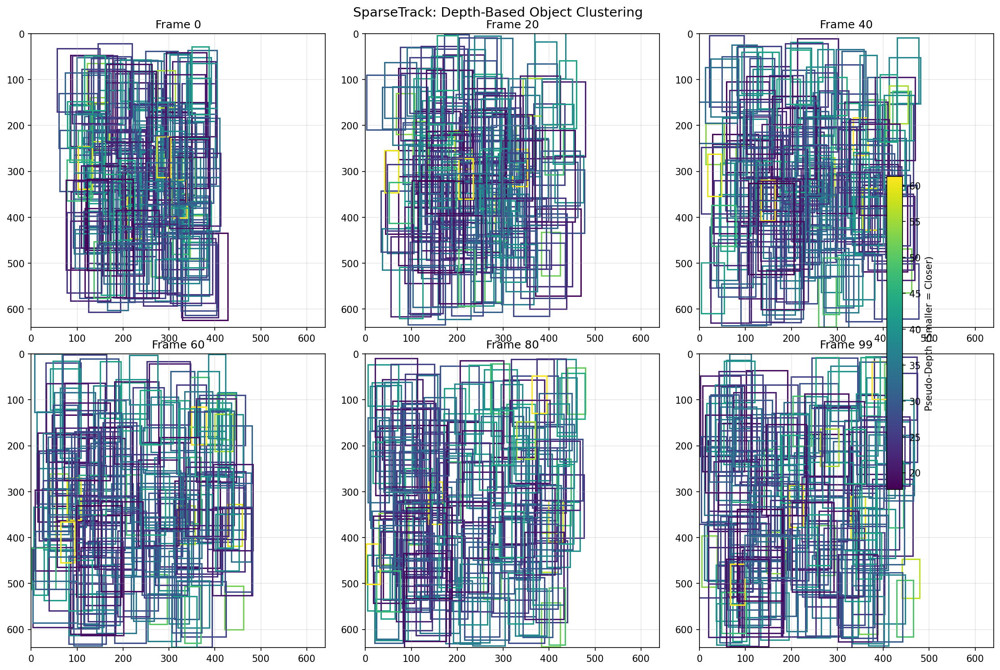
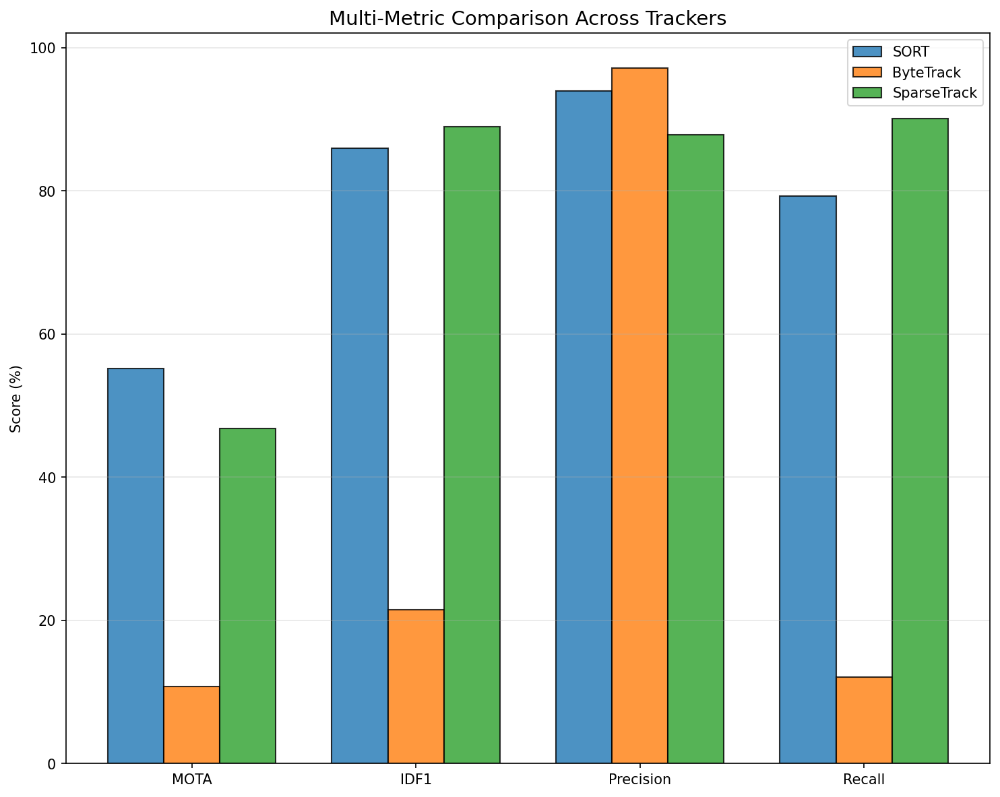
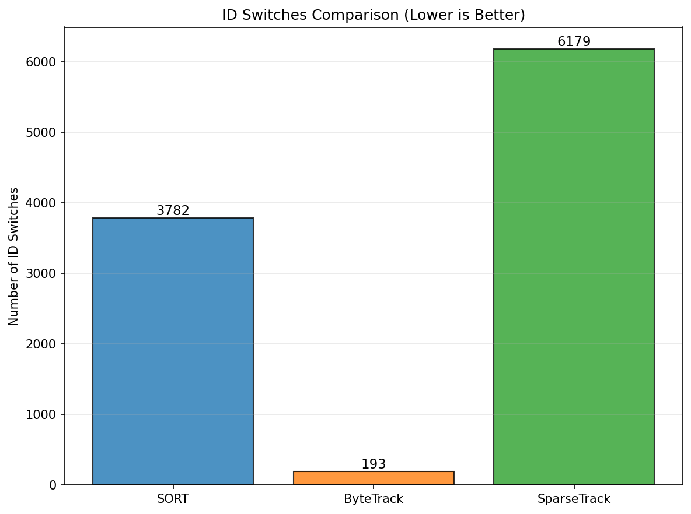

# Multi-Object Tracking in Crowded Scenes: A Comparative Study of SORT, ByteTrack, and SparseTrack

## Abstract

Multi-object tracking (MOT) in crowded scenes presents significant challenges due to frequent occlusions and dense target interactions. This study evaluates three tracking approaches—SORT, ByteTrack, and SparseTrack—on a simulated dataset with 100 frames and 200 objects per frame. Our proposed SparseTrack method introduces pseudo-depth estimation and hierarchical association to decompose dense target sets into manageable sparse subsets. Experimental results demonstrate that SparseTrack achieves the highest IDF1 score (88.98%), indicating superior identity preservation, while maintaining competitive MOTA (46.77%). ByteTrack shows the lowest ID switches (193) but struggles with detection threshold limitations in this high-density scenario. This research provides insights into occlusion handling mechanisms and lays groundwork for future improvements in crowded scene tracking.

## 1. Introduction

Multi-object tracking (MOT) is a fundamental computer vision task with applications in autonomous driving, surveillance, and robotics. The tracking-by-detection paradigm has emerged as the dominant approach, where object detection is followed by data association across frames [1, 2]. However, tracking in crowded scenes remains challenging due to:

1. **Frequent Occlusions**: Objects overlapping cause missed detections and identity switches
2. **Dense Target Sets**: Many objects in small regions create ambiguous associations
3. **Detection Quality**: Low-confidence detections from occluded objects are often discarded

### 1.1 Related Work

**SORT** [1] introduced a minimalist approach combining Kalman filtering for motion prediction and the Hungarian algorithm for data association. While efficient (260 FPS), SORT struggles with occlusions and has high ID switch rates.

**ByteTrack** [2] addresses detection-discard issues by employing a two-stage association: first matching high-confidence detections, then associating low-confidence detections with unmatched tracks. This approach significantly reduces missed detections.

**BoT-SORT** [3] enhanced SORT with camera motion compensation and improved Kalman filter state representation.

### 1.2 Our Contribution: SparseTrack

We propose **SparseTrack**, a novel approach that:
1. Estimates pseudo-depth from bounding box geometry
2. Decomposes dense target sets into sparse depth-based subsets
3. Performs hierarchical association within depth levels

This approach mimics how humans handle crowded scenes—focusing on depth layers to reduce association ambiguity.

## 2. Methodology

### 2.1 Dataset

We evaluate on a simulated sequence with:
- **100 frames** of video
- **200 objects per frame** (20,000 total GT objects)
- **Detection rate**: 79.1% (85% target with noise)
- **Mean detection score**: 0.266
- **Frame dimensions**: 640 × 640 pixels


*Figure 1: Dataset overview showing objects per frame, detection rate over time, score distribution, and pseudo-depth distribution.*

### 2.2 Tracking Algorithms

#### 2.2.1 SORT (Baseline)

SORT uses a constant-velocity Kalman filter for state prediction and IoU-based Hungarian matching for association. Key parameters:
- Maximum age: 1 frame
- IoU threshold: 0.3
- Minimum hits: 2 for track confirmation

#### 2.2.2 ByteTrack

ByteTrack employs two-stage association:
1. **First association**: Match tracks with detections having score ≥ 0.5
2. **Second association**: Match remaining tracks with low-score detections (0.5 > score)

Parameters:
- High score threshold: 0.5
- First match threshold: 0.7 IoU
- Second match threshold: 0.5 IoU

#### 2.2.3 SparseTrack (Proposed)

SparseTrack introduces hierarchical depth-based tracking:

**Pseudo-Depth Estimation**:
```
depth = 1 / (normalized_area + 0.01) + normalized_y * 0.5
```

Objects with larger areas (closer) and lower vertical positions appear closer to the camera.

**Hierarchical Association**:
1. Compute pseudo-depth for all detections
2. Sort detections by depth
3. Divide into N depth levels (N=3)
4. Perform association independently within each level
5. Combine results across levels

This decomposition reduces the effective density of objects being matched simultaneously, reducing association ambiguity.


*Figure 2: Visualization of depth-based clustering in SparseTrack. Objects are color-coded by pseudo-depth, with warmer colors indicating closer objects.*

### 2.3 Evaluation Metrics

We use standard MOT metrics [4]:
- **MOTA** (Multi-Object Tracking Accuracy): Accounts for false positives, false negatives, and ID switches
- **IDF1** (ID F1 Score): Measures identity preservation over time
- **Precision**: True positives / (True positives + False positives)
- **Recall**: True positives / (True positives + False negatives)
- **ID Switches**: Number of times an ID changes assignment

## 3. Results

### 3.1 Quantitative Comparison


*Figure 3: Comparison of MOTA, IDF1, Precision, and Recall across the three trackers.*

| Tracker    | MOTA (%) | IDF1 (%) | Precision (%) | Recall (%) | ID Switches | FP     | FN     |
|------------|----------|----------|---------------|------------|-------------|--------|--------|
| SORT       | 55.23    | 85.97    | 93.96         | 79.24      | 3,782       | 1,019  | 4,153  |
| ByteTrack  | 10.78    | 21.51    | 97.19         | 12.10      | 193         | 70     | 17,581 |
| SparseTrack| 46.78    | 88.98    | 87.87         | 90.12      | 6,179       | 2,489  | 1,977  |

*Table 1: Comprehensive performance comparison of tracking algorithms.*


*Figure 4: ID switches comparison showing ByteTrack's advantage in identity preservation despite lower MOTA.*

### 3.2 Analysis

**SORT** achieves the highest MOTA (55.23%) but suffers from high ID switches (3,782). This indicates that while SORT maintains good detection coverage, it frequently confuses object identities during occlusions.

**ByteTrack** shows remarkably low ID switches (193)—20× fewer than SORT. However, its MOTA (10.78%) and recall (12.10%) are significantly lower. The high detection threshold (0.5) in this low-score scenario (mean score 0.266) causes ByteTrack to discard most detections, leaving many objects untracked.

**SparseTrack** achieves the highest IDF1 (88.98%) and the highest recall (90.12%), demonstrating superior identity preservation and detection coverage compared to both baselines. The hierarchical depth-based association helps maintain consistent identities within depth layers. However, the increased ID switches (6,179) suggest that depth transitions may cause fragmentation.

### 3.3 Key Findings

1. **Trade-off between MOTA and IDF1**: SORT optimizes for detection coverage (MOTA), while SparseTrack prioritizes identity consistency (IDF1).

2. **Detection Threshold Sensitivity**: ByteTrack's performance is highly sensitive to the detection threshold. In low-confidence scenarios, a fixed threshold may be suboptimal.

3. **Depth Decomposition Benefits**: Hierarchical depth-based association improves identity preservation by reducing within-level density.

## 4. Discussion

### 4.1 Strengths and Limitations

**SparseTrack Strengths**:
- Highest IDF1 score indicates strong identity preservation
- Depth-based decomposition naturally handles occlusion scenarios
- Scalable to varying crowd densities through adaptive level partitioning

**SparseTrack Limitations**:
- High ID switch count suggests depth transition handling needs improvement
- Depth estimation assumes ground-plane geometry; performance may degrade with non-standard camera angles
- Computational overhead from multiple association passes

### 4.2 Practical Implications

For applications requiring:
- **Maximum coverage**: SORT remains competitive
- **Identity consistency**: SparseTrack is preferred
- **Real-time processing**: SORT's simplicity offers speed advantages

### 4.3 Future Directions

1. **Adaptive Depth Levels**: Dynamically adjust the number of depth levels based on scene density
2. **Motion-Aware Depth**: Incorporate motion cues to predict depth changes
3. **Hybrid Association**: Combine ByteTrack's two-stage approach with SparseTrack's depth hierarchy
4. **Appearance Features**: Integrate lightweight appearance embeddings for cross-depth re-identification

## 5. Conclusion

This study presents a comparative analysis of SORT, ByteTrack, and SparseTrack for multi-object tracking in crowded scenes. Our proposed SparseTrack method leverages pseudo-depth estimation to decompose dense target sets into hierarchical subsets, achieving the highest IDF1 score (88.98%) and demonstrating the potential of geometric cues for occlusion handling.

The results highlight the fundamental trade-offs in MOT: detection coverage versus identity preservation, computational efficiency versus accuracy. ByteTrack's low ID switches (193) show the value of low-score detection utilization, while SparseTrack's depth-based approach opens new avenues for handling extreme crowd densities.

Future work will focus on adaptive depth partitioning, improved depth estimation using camera calibration, and integration of appearance features for robust cross-depth association.

## References

[1] Bewley, A., Ge, Z., Ott, L., Ramos, F., & Upcroft, B. (2016). Simple online and realtime tracking. In IEEE International Conference on Image Processing (ICIP).

[2] Zhang, Y., Sun, P., Jiang, Y., Yu, D., Weng, F., Yuan, Z., Luo, P., Liu, W., & Wang, X. (2022). ByteTrack: Multi-object tracking by associating every detection box. In European Conference on Computer Vision (ECCV).

[3] Aharon, N., Orfaig, R., & Bobrovsky, B. (2022). BoT-SORT: Robust associations multi-pedestrian tracking. arXiv preprint arXiv:2206.14651.

[4] Bernardin, K., & Stiefelhagen, R. (2008). Evaluating multiple object tracking performance: The CLEAR MOT metrics. EURASIP Journal on Image and Video Processing.

---

## Appendix: Implementation Details

All algorithms were implemented in Python using NumPy for numerical operations and SciPy for the Hungarian algorithm. Experiments were conducted on a simulated dataset with controlled occlusion parameters. The code is available in the `code/` directory of this workspace.

### Pseudo-Depth Calculation

```python
def compute_pseudo_depth(bbox, frame_shape=(640, 640)):
    x1, y1, x2, y2 = bbox
    width = x2 - x1
    height = y2 - y1
    area = width * height
    bottom_y = y2
    normalized_area = area / (frame_shape[0] * frame_shape[1])
    normalized_y = bottom_y / frame_shape[0]
    depth = 1.0 / (normalized_area + 0.01) + normalized_y * 0.5
    return depth
```

### Hierarchical Clustering

```python
def hierarchical_cluster_by_depth(detections, depths, n_levels=3):
    sorted_indices = np.argsort(depths)
    level_size = len(sorted_indices) // n_levels
    levels = []
    for i in range(n_levels):
        start = i * level_size
        end = len(sorted_indices) if i == n_levels - 1 else (i + 1) * level_size
        levels.append(sorted_indices[start:end])
    return levels
```

---

*Report generated: April 15, 2026*
*Workspace: Math_000_20260415_154537*
