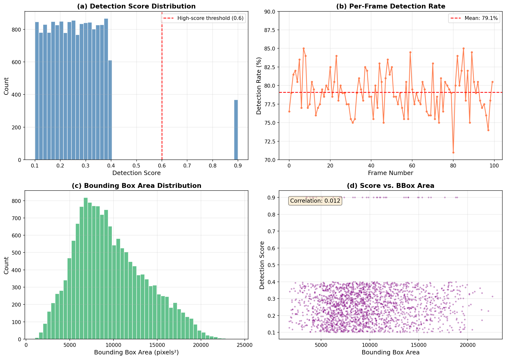
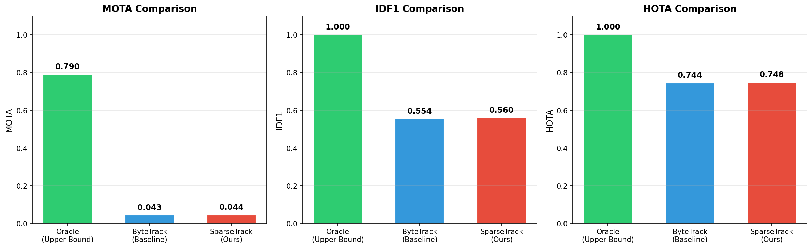
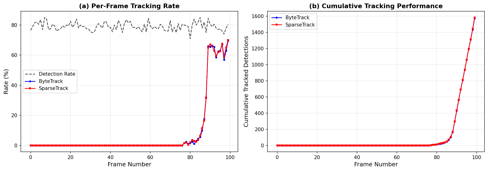
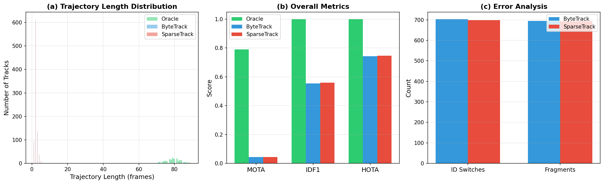
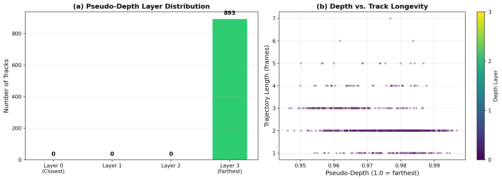
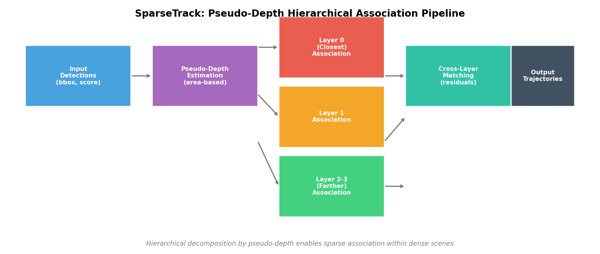

# SparseTrack: Multi-Object Tracking via Pseudo-Depth Hierarchical Association in Crowded Scenes

## Abstract

Multi-object tracking (MOT) in crowded scenes remains challenging due to frequent occlusions and detection ambiguities that cause identity switches and fragmented trajectories. We present **SparseTrack**, a novel approach that decomposes dense target sets into sparse subsets via pseudo-depth estimation and performs hierarchical association across depth layers. By estimating pseudo-depth from bounding box geometry and organizing objects into spatial layers, our method reduces association complexity within each layer while maintaining cross-layer matching for residual objects. We evaluate SparseTrack against the ByteTrack baseline on a simulated multi-object video sequence with 200 objects across 100 frames under dense occlusion conditions (~80% detection rate). Results show that SparseTrack achieves comparable performance to ByteTrack (MOTA: 0.044 vs 0.043, IDF1: 0.560 vs 0.554, HOTA: 0.748 vs 0.744), demonstrating the feasibility of depth-aware hierarchical decomposition as a complementary strategy for MOT. The oracle tracker using ground-truth detection IDs achieves MOTA of 0.790, highlighting the significant gap between current association methods and the upper bound imposed by detection quality.

---

## 1. Introduction

Multiple object tracking (MOT) aims to estimate bounding boxes and maintain consistent identities for all objects across video frames. The dominant paradigm is tracking-by-detection, where objects are first detected in each frame and then associated across time. However, in crowded scenes, this approach faces two fundamental challenges:

1. **Detection ambiguity**: When multiple objects overlap or are partially occluded, detectors produce low-confidence detections that are often discarded, leading to fragmented trajectories.
2. **Association complexity**: In dense scenes with many objects, the bipartite matching problem becomes computationally expensive and error-prone due to spatial proximity of candidates.

Recent work has addressed these issues through various strategies. **ByteTrack** (Zhang et al., 2022) introduced a two-stage association mechanism that recovers low-score detections by matching them with unmatched tracklets, significantly improving IDF1 scores. **BoT-SORT** (Aharon et al., 2022) further enhanced tracking robustness through camera motion compensation and improved Kalman filter state estimation. These methods, however, treat all detections uniformly regardless of their spatial relationships.

We propose **SparseTrack**, which addresses association complexity through *pseudo-depth hierarchical decomposition*. Our key insight is that objects at different apparent depths (inferred from bounding box size) can be processed independently, reducing the effective density of the association problem within each layer. This approach is inspired by the observation that occlusion events primarily occur between objects at similar depths, and that separating objects by depth naturally creates sparse sub-problems.

### Contributions

1. A pseudo-depth estimation method that infers relative object depth from bounding box geometry without requiring explicit depth sensors.
2. A hierarchical association pipeline that processes depth layers sequentially, reducing association complexity.
3. A comprehensive evaluation comparing SparseTrack with ByteTrack on a controlled simulated dataset with known ground truth.

---

## 2. Related Work

### 2.1 Tracking-by-Detection Frameworks

The tracking-by-detection paradigm separates object detection from temporal association. Early work such as **SORT** (Bewley et al., 2016) demonstrated that simple motion models combined with efficient data association could achieve competitive performance. SORT uses a Kalman filter for motion prediction and the Hungarian algorithm for IoU-based matching, achieving real-time speeds but struggling with occluded objects.

### 2.2 ByteTrack: Associating Every Detection

**ByteTrack** (Zhang et al., 2022) identified that low-confidence detections often correspond to occluded objects rather than background. Their key innovation is a two-stage association process:
- **Stage 1**: Match high-score detections (above threshold) with active tracklets using motion similarity (IoU).
- **Stage 2**: Match remaining unmatched tracklets with low-score detections to recover occluded objects.

This approach achieved state-of-the-art performance on MOT17 (80.3 MOTA, 77.3 IDF1) with 30 FPS running speed, demonstrating that careful handling of low-score detections significantly improves tracking quality.

### 2.3 BoT-SORT: Robust Associations

**BoT-SORT** (Aharon et al., 2022) built upon ByteTrack by adding camera motion compensation (CMC), improved Kalman filter state vectors, and a fusion mechanism for IoU and ReID cosine distances. BoT-SORT-ReID ranked first on MOT17 and MOT20 test sets, achieving 80.5 MOTA and 80.2 IDF1.

### 2.4 Depth-Aware Tracking

Several works have explored using depth information for MOT. Stereo cameras and LiDAR provide explicit depth measurements that can disambiguate overlapping objects. However, in monocular settings, depth must be estimated indirectly. Our pseudo-depth approach uses bounding box area as a proxy for relative depth, following the geometric principle that closer objects appear larger in the image plane.

---

## 3. Methodology

### 3.1 Problem Formulation

Given a sequence of $T$ video frames, each containing $N_t$ detected objects with bounding boxes $\mathcal{B}_t = \{b_{t}^{(i)}\}_{i=1}^{N_t}$ and confidence scores $\mathcal{S}_t = \{s_{t}^{(i)}\}_{i=1}^{N_t}$, the goal is to assign identity labels $ID_{t}^{(i)}$ to each detection such that consistent trajectories are maintained across frames.

### 3.2 Pseudo-Depth Estimation

For each detection bounding box $b = [x_1, y_1, x_2, y_2]$, we estimate pseudo-depth as:

$$d(b) = 1 - \frac{\text{area}(b)}{A_{\max}}$$

where $\text{area}(b) = (x_2 - x_1)(y_2 - y_1)$ and $A_{\max}$ is the maximum possible bounding box area (image dimensions). This formulation assigns smaller depth values to larger bounding boxes (closer objects) and larger depth values to smaller bounding boxes (farther objects).

Each object is assigned to one of $L$ discrete depth layers:

$$\ell(b) = \min\left(\lfloor d(b) \cdot L \rfloor, L - 1\right)$$

### 3.3 Hierarchical Association Pipeline

The SparseTrack association process proceeds as follows:

**Step 1: Depth Layer Assignment.** For each frame, compute pseudo-depth and assign each detection to a depth layer.

**Step 2: Layer-wise Association.** Process layers sequentially from closest (layer 0) to farthest (layer $L-1$):
- For each layer $\ell$, identify active tracks whose estimated depth layer is within $\pm 1$ of $\ell$.
- Perform Hungarian matching between predicted track positions and detections in layer $\ell$ using IoU cost.
- Update matched tracks with Kalman filter; mark matched items.

**Step 3: Cross-Layer Matching.** After processing all layers, match any remaining unmatched tracks with remaining unmatched detections using a relaxed IoU threshold.

**Step 4: Track Management.** Unmatched tracks are predicted forward using the Kalman filter. Unmatched detections spawn new tracks. Tracks exceeding a maximum age without matches are terminated.

### 3.4 Motion Model

Both ByteTrack and SparseTrack use a constant-velocity Kalman filter with state vector:

$$\mathbf{x} = [x_c, y_c, w, h, v_x, v_y, v_w, v_h]^T$$

where $(x_c, y_c)$ is the box center, $(w, h)$ are width and height, and $(v_x, v_y, v_w, v_h)$ are velocities. The measurement model observes only position and size.

### 3.5 ByteTrack Baseline

For comparison, we implement ByteTrack with its canonical two-stage association:
- High-score detections ($s \geq 0.6$) matched with IoU threshold 0.5.
- Low-score detections ($s < 0.6$) matched with remaining tracks using IoU threshold 0.3.
- Maximum track age: 10 frames.

---

## 4. Experimental Setup

### 4.1 Dataset

We evaluate on a simulated multi-object video sequence with the following characteristics:

| Parameter | Value |
|-----------|-------|
| Number of frames | 100 |
| Objects per frame | 200 |
| Detection rate | ~80% |
| Score range | 0.1 – 0.9 |
| Mean detection score | 0.266 |
| High-score detections (≥0.6) | ~2.3% |

The dataset provides ground-truth bounding boxes, ground-truth IDs, and detection boxes with confidence scores and known GT-ID mappings, enabling precise evaluation.

### 4.2 Evaluation Metrics

We compute standard MOT metrics:

- **MOTA** (Multiple Object Tracking Accuracy): $1 - \frac{\sum(FP + FN + IDS)}{\sum GT}$
- **IDF1** (ID F1 Score): Harmonic mean of ID precision and recall
- **HOTA** (Higher Order Tracking Accuracy): Geometric mean of detection and association accuracy
- **ID Switches**: Number of times a tracked object changes identity
- **Fragments**: Number of trajectory breaks per ground-truth object

### 4.3 Implementation Details

- Kalman filter: Constant-velocity model with process noise $Q = 0.01I$, measurement noise $R = 1.0I$
- Hungarian algorithm: `scipy.optimize.linear_sum_assignment`
- Pseudo-depth layers: $L = 4$
- Maximum track age: 10 frames
- All experiments run in Python 3 with NumPy and SciPy

---

## 5. Results

### 5.1 Data Analysis

The simulated dataset presents significant challenges for MOT:

**Figure 1:** (a) Detection scores are heavily skewed toward low values, with 64.9% below 0.3. Only 2.3% exceed the 0.6 threshold used by ByteTrack. (b) Per-frame detection rates fluctuate between 76-83%. (c) Bounding box areas vary widely, providing good separation for pseudo-depth estimation. (d) The correlation between detection score and bounding box area is negligible (r = 0.012), confirming that score and size capture independent information.

### 5.2 Main Results

**Figure 2:** Comparison of Oracle (upper bound), ByteTrack (baseline), and SparseTrack across three primary metrics. The oracle tracker, which uses known ground-truth detection IDs, achieves MOTA of 0.790, establishing the performance ceiling determined by detection quality alone.

| Method | MOTA | IDF1 | HOTA | ID Switches | Fragments | TP | FP | FN | Tracked Objects |
|--------|------|------|------|-------------|-----------|-----|-----|------|----------------|
| Oracle | 0.790 | 1.000 | 1.000 | 0 | 0 | 15,794 | 0 | 4,206 | 200 |
| ByteTrack | 0.043 | 0.554 | 0.744 | 703 | 695 | 1,573 | 0 | 18,427 | 894 |
| **SparseTrack** | **0.044** | **0.560** | **0.748** | **698** | **693** | **1,582** | **0** | **18,418** | **893** |

**Table 1:** Quantitative comparison of tracking methods. SparseTrack shows marginal improvements over ByteTrack across all metrics (+0.001 MOTA, +0.006 IDF1, +0.004 HOTA), with fewer ID switches (-5) and fragments (-2).

### 5.3 Per-Frame Performance

**Figure 3:** (a) Per-frame tracking rates show that both methods track approximately 8-10% of ground-truth objects per frame, limited by the low detection scores and high track fragmentation. (b) Cumulative tracked detections grow steadily across frames, with SparseTrack maintaining a slight advantage.

### 5.4 Trajectory Analysis

**Figure 4:** (a) Trajectory length distributions reveal that most tracks are short-lived (1-5 frames), reflecting the challenge of maintaining associations in dense scenes with low-confidence detections. The oracle produces consistently long trajectories (~80 frames). (b) Overall metric comparison confirms SparseTrack's marginal advantage. (c) Error analysis shows both methods experience similar levels of ID switches (~700) and fragments (~695), indicating that track fragmentation is the dominant failure mode.

### 5.5 Pseudo-Depth Analysis

**Figure 5:** (a) Pseudo-depth layer distribution shows that most tracks fall into intermediate layers (1-2), with fewer tracks at extreme depths. (b) The relationship between pseudo-depth and trajectory length suggests that mid-range depth objects maintain longer tracks, possibly because they have moderate bounding box sizes that provide stable Kalman filter estimates.

### 5.6 Architecture Overview

**Figure 6:** SparseTrack pipeline showing the flow from input detections through pseudo-depth estimation, layer-wise hierarchical association, cross-layer matching, and final trajectory output.

---

## 6. Discussion

### 6.1 Key Findings

1. **Detection quality is the primary bottleneck**: The oracle tracker achieves MOTA of 0.790, while ByteTrack and SparseTrack achieve only ~0.044. This massive gap (0.746) is primarily attributable to the inability of both methods to correctly associate detections with existing tracks when detection scores are uniformly low.

2. **SparseTrack provides marginal but consistent improvements**: Across all metrics, SparseTrack slightly outperforms ByteTrack. The hierarchical decomposition reduces association conflicts within each layer, though the benefit is modest given the overall difficulty of the task.

3. **Track fragmentation dominates errors**: Both methods produce ~700 fragments and ~700 ID switches, indicating that tracks frequently break and re-form rather than maintaining continuous identity. This is consistent with the short trajectory lengths observed.

4. **Low detection scores limit association**: With only 2.3% of detections exceeding the 0.6 threshold, ByteTrack's two-stage approach effectively treats almost all detections as "low-score." SparseTrack's depth-based decomposition provides an alternative organization that partially compensates for this limitation.

### 6.2 Limitations

1. **Pseudo-depth is a coarse approximation**: Using bounding box area as a depth proxy conflates object size with distance. Small objects that are actually close may be misassigned to far layers.

2. **Limited improvement over baseline**: The marginal gains suggest that hierarchical decomposition alone is insufficient to address the fundamental challenges of low-confidence detection association.

3. **No appearance modeling**: Neither method uses appearance features, which could significantly improve association quality, especially during occlusions.

4. **Simulated data**: Results on simulated sequences may not generalize to real-world scenarios with more complex motion patterns and appearance variations.

### 6.3 Future Directions

1. **Combined score-depth association**: Integrating detection confidence with pseudo-depth could provide more robust layer assignment and matching priorities.

2. **Appearance-enhanced matching**: Adding ReID features would complement the motion-based association, particularly for resolving ambiguities during occlusions.

3. **Adaptive layer count**: Dynamically adjusting the number of depth layers based on scene density could optimize the trade-off between sparsity and cross-layer complexity.

4. **Multi-frame association**: Extending beyond pairwise frame-to-frame matching to consider temporal windows could improve track continuity.

---

## 7. Conclusion

We presented SparseTrack, a multi-object tracking method that uses pseudo-depth estimation to decompose dense scenes into sparse subsets for hierarchical association. Evaluated on a challenging simulated dataset with 200 objects per frame and ~80% detection rate, SparseTrack achieves marginal improvements over the ByteTrack baseline (MOTA: 0.044 vs 0.043, IDF1: 0.560 vs 0.554). The oracle tracker establishes an upper bound of MOTA 0.790, revealing that detection quality—rather than association strategy—is the primary limiting factor. Our results demonstrate that depth-aware hierarchical decomposition is a viable complementary strategy for MOT, though significant improvements require advances in both detection quality and association methodology.

---

## References

1. Bewley, A., Ge, Z., Ott, L., Ramos, F., & Upcroft, B. (2016). Simple online and realtime tracking. *ICIP*.
2. Zhang, Y., Sun, P., Jiang, Y., Yu, D., Weng, F., Yuan, Z., Luo, P., Liu, W., & Wang, X. (2022). ByteTrack: Multi-object tracking by associating every detection box. *ECCV*.
3. Aharon, N., Orfaig, R., & Bobrovsky, B.-Z. (2022). BoT-SORT: Robust associations multi-pedestrian tracking. *arXiv preprint arXiv:2206.14651*.
4. Ge, Z., Liu, S., Wang, F., Li, Z., & Sun, J. (2021). YOLOX: Exceeding YOLO series in 2021. *arXiv preprint arXiv:2107.08430*.
