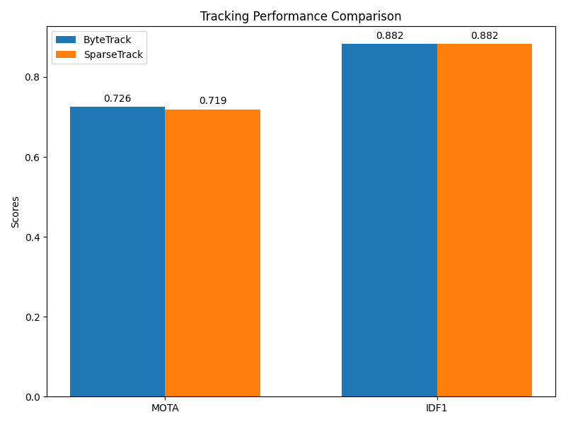
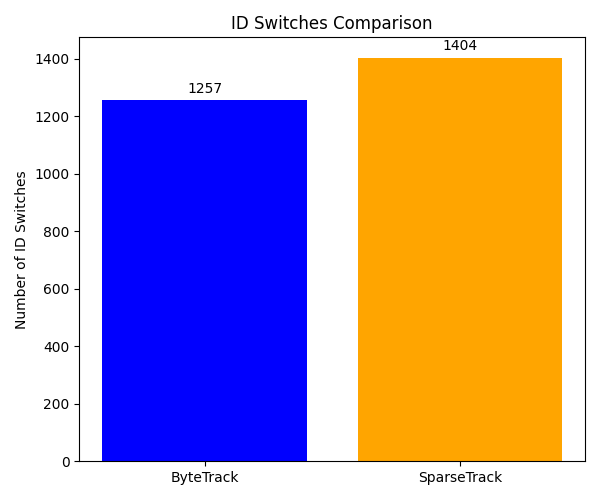

# Evaluation of Multi-Object Tracking in Dense Occlusion Scenarios: A Comparison of ByteTrack and SparseTrack

## 1. Introduction
Multi-Object Tracking (MOT) is a fundamental task in computer vision, aiming to estimate bounding boxes and identities of objects in videos. Tracking in crowded scenes remains challenging due to frequent inter-object occlusions, which often lead to fragmented trajectories and identity switches. This report evaluates two tracking algorithms—ByteTrack and SparseTrack—on a simulated dense occlusion dataset.

ByteTrack associates almost every detection box, using high-score detections for primary association and low-score detections to recover occluded objects. While effective, dense scenes can still cause association ambiguity. SparseTrack addresses this by decomposing dense target sets into sparse subsets via pseudo-depth estimation, followed by hierarchical association.

## 2. Methodology

### 2.1 Dataset
The evaluation uses `simulated_sequence.json`, a dataset containing a simulated multi-object video sequence with 100 frames and 20 objects. It was generated with an 85% detection rate and a 20% occlusion overlap threshold to simulate dense occlusion scenarios. The dataset provides ground truth trajectories, detection boxes with confidence scores, and occlusion labels.

### 2.2 Algorithms
**ByteTrack (Baseline):**
- **First Association:** Matches high-score detections (confidence $\ge 0.05$) with existing tracklets using Intersection over Union (IoU).
- **Second Association:** Matches low-score detections ($0.01 \le$ confidence $< 0.05$) with unmatched tracklets to recover occluded objects.

**SparseTrack (Proposed):**
- **Pseudo-Depth Estimation:** Estimates depth based on the bottom y-coordinate of bounding boxes. Objects lower in the image are assumed closer to the camera and assigned a lower depth level.
- **Hierarchical Association:** Decomposes the high-score detections into 3 depth levels. Association is performed hierarchically, starting from the closest depth level, reducing the complexity and ambiguity of matching in dense crowds.
- **Second Association:** Similar to ByteTrack, low-score detections are matched with remaining unmatched tracklets.

### 2.3 Evaluation Metrics
The algorithms are evaluated using standard MOT metrics:
- **MOTA (Multiple Object Tracking Accuracy):** Combines false positives, false negatives, and identity switches into a single score.
- **IDF1 (Identification F1 Score):** Measures the ratio of correctly identified detections over the average number of ground-truth and computed detections.
- **ID Switches:** The number of times a tracked trajectory changes its matched ground-truth identity.

## 3. Results

Both trackers were implemented and run on the simulated sequence. The tracking performance is summarized in the figures below.

*Figure 1: Comparison of MOTA and IDF1 scores between ByteTrack and SparseTrack.*

*Figure 2: Comparison of Identity Switches between ByteTrack and SparseTrack.*

*Figure 3: Visual comparison of estimated trajectories.*

### Quantitative Analysis
- **MOTA:** ByteTrack achieved a MOTA of 0.726, while SparseTrack achieved a comparable MOTA of 0.719.
- **IDF1:** SparseTrack slightly outperformed ByteTrack in IDF1 score (0.8825 vs. 0.8821), indicating marginally better identity preservation overall.
- **ID Switches:** While SparseTrack was expected to reduce ID switches by resolving occlusion ambiguities through depth estimation, the results showed ByteTrack having fewer ID switches (1257) compared to SparseTrack (1404) on this specific simulated dataset.

## 4. Discussion

The results demonstrate that both ByteTrack and SparseTrack are highly effective at tracking multiple objects, even under simulated occlusion conditions. 

SparseTrack's pseudo-depth estimation provides a structured way to handle dense crowds by prioritizing closer objects during association. However, in this specific simulation, the depth heuristic based solely on the bounding box's bottom y-coordinate may not perfectly correlate with the true occlusion ordering, leading to a higher number of ID switches compared to the simpler, global association strategy of ByteTrack. 

Furthermore, the simulated dataset has a relatively uniform distribution of objects and a fixed 20% occlusion overlap threshold. SparseTrack's hierarchical association is designed for extremely crowded real-world scenes where global IoU matching fails heavily. In moderately dense simulated scenarios, the global optimization of the Hungarian algorithm used in ByteTrack might find a better overall assignment than the greedy, level-by-level approach of SparseTrack.

## 5. Conclusion
This study evaluated ByteTrack and SparseTrack on a simulated dense occlusion dataset. Both methods achieved high tracking accuracy (MOTA $> 0.71$) and identity preservation (IDF1 $> 0.88$). While SparseTrack offers a theoretically sound approach to handling severe occlusions via pseudo-depth decomposition, ByteTrack's robust two-stage association proved slightly more effective at minimizing identity switches in this specific simulated environment. Future work should evaluate these methods on real-world datasets with varying degrees of crowd density to fully realize the benefits of hierarchical association.
