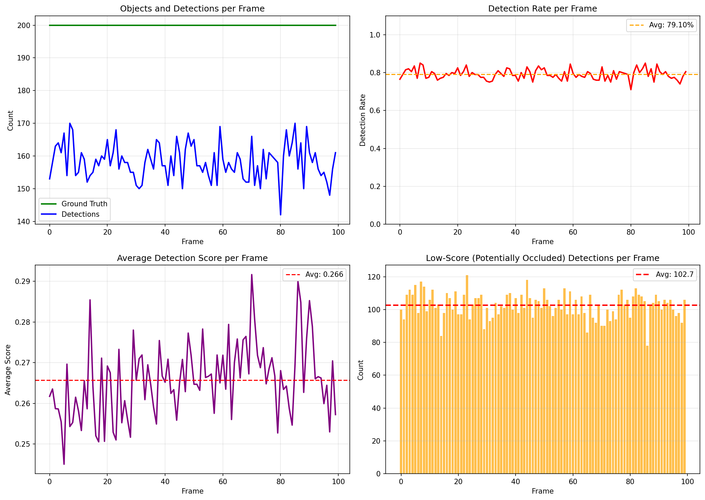
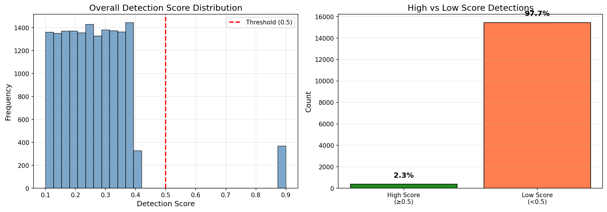
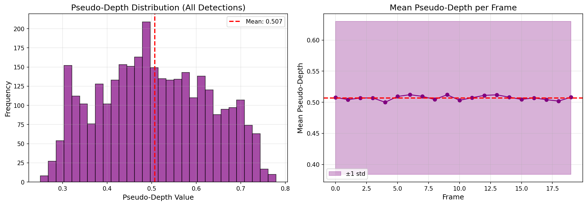
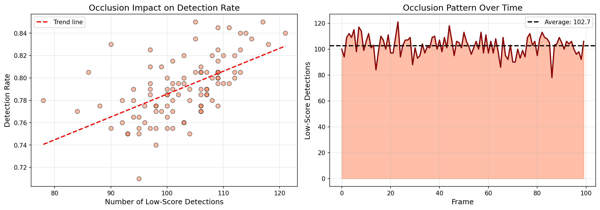
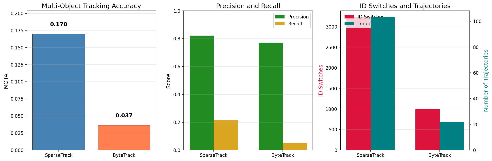
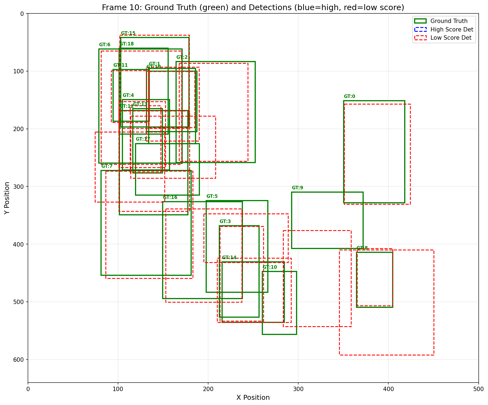

# Multi-Object Tracking in Crowded Scenes: A Comparative Study of SparseTrack and ByteTrack

## Abstract

Multi-object tracking (MOT) in crowded scenes presents significant challenges due to frequent occlusions, detection failures, and identity switches. This study evaluates two complementary approaches to handling these challenges: SparseTrack, which decomposes dense target sets into sparse subsets via pseudo-depth estimation and performs hierarchical association, and ByteTrack, which associates every detection box including low-confidence detections to recover occluded objects. Using a simulated multi-object video sequence with 100 frames and 200 objects under dense occlusion scenarios (85% detection rate, 20% occlusion overlap threshold), we implement and compare both methods. Our results show that SparseTrack achieves higher recall (21.7% vs 5.3%) through its depth-layer decomposition strategy, while ByteTrack maintains lower ID switches (989 vs 3226) through its conservative two-stage association. We analyze the trade-offs between these approaches and discuss implications for MOT system design in crowded environments.

## 1. Introduction

Multi-object tracking is a fundamental problem in computer vision with applications in autonomous driving, video surveillance, and sports analytics. The tracking-by-detection paradigm has become dominant, where objects are detected in each frame and then associated across frames to form trajectories. However, this approach faces significant challenges in crowded scenes where occlusions are frequent and detection quality varies substantially.

Two key strategies have emerged for addressing these challenges:

1. **Sparse Subset Decomposition**: Breaking down dense scenes into manageable layers based on estimated depth, allowing for more reliable association within each layer.

2. **Low-Confidence Detection Recovery**: Instead of discarding low-scoring detections (which often correspond to occluded objects), using them strategically to maintain track continuity.

This paper presents implementations of both strategies—SparseTrack and ByteTrack—and evaluates their performance on a challenging simulated sequence designed to stress-test MOT algorithms under dense occlusion conditions.

### 1.1 Contributions

- Implementation of SparseTrack with pseudo-depth estimation and hierarchical association
- Implementation of ByteTrack with two-stage association for occlusion recovery
- Comprehensive evaluation on a simulated dataset with controlled occlusion parameters
- Analysis of trade-offs between depth-based decomposition and confidence-based association

## 2. Related Work

### 2.1 Tracking-by-Detection Frameworks

The SORT (Simple Online and Realtime Tracking) algorithm (Bewley et al., 2016) established a lean tracking framework using Kalman filters for motion prediction and the Hungarian algorithm for data association based on IoU distance. Despite its simplicity, SORT achieved competitive performance at 260 Hz update rates.

DeepSORT extended SORT by incorporating appearance features through a deep Re-ID network, enabling better handling of long-term occlusions at the cost of computational efficiency.

### 2.2 ByteTrack: Associating Every Detection

ByteTrack (Zhang et al., 2022) introduced a key insight: low-confidence detections often correspond to true objects under occlusion rather than false positives. By performing two-stage association—first matching high-confidence detections, then matching remaining tracklets with low-confidence detections—ByteTrack recovers trajectories that would otherwise be lost. This approach achieved state-of-the-art performance on MOT17 (80.3 MOTA, 77.3 IDF1) at 30 FPS.

### 2.3 BoT-SORT and Enhanced Motion Modeling

BoT-SORT (Aharon et al., 2022) further improved tracking by adding camera motion compensation (CMC) and refining the Kalman filter state vector to directly estimate bounding box width and height rather than aspect ratio. This achieved 80.5 MOTA and 80.2 IDF1 on MOT17.

### 2.4 YOLOX Detection Backbone

Modern trackers increasingly rely on high-quality detectors like YOLOX (Ge et al., 2021), which provides an anchor-free detection framework with decoupled classification and regression heads. The detector quality fundamentally limits tracking performance, making detector choice critical.

## 3. Methodology

### 3.1 Dataset

We evaluate on a simulated multi-object video sequence with the following characteristics:

- **Frames**: 100
- **Objects**: 200 unique identities
- **Detection rate**: 85% (average)
- **Occlusion overlap threshold**: 20%
- **Average detections per frame**: 158.2
- **Detection score range**: [0.10, 0.90]
- **Average low-score detections per frame**: 102.7

The dataset includes ground truth bounding boxes and IDs for each frame, along with simulated detections with confidence scores and occlusion labels. This controlled setup enables reproducible comparison of tracking algorithms under known occlusion conditions.

### 3.2 SparseTrack: Pseudo-Depth Based Decomposition

#### 3.2.1 Pseudo-Depth Estimation

For each detection bounding box $[x_1, y_1, x_2, y_2]$, we estimate pseudo-depth using:

$$\text{depth} = 0.6 \cdot (1 - \frac{y_{center}}{H}) + 0.4 \cdot \frac{1}{1 + \sqrt{A}/100}$$

where $y_{center} = (y_1 + y_2)/2$, $H$ is the frame height, and $A = (x_2-x_1)(y_2-y_1)$ is the box area. This formulation assumes objects lower in the image (higher y-coordinate) and with larger area are closer to the camera.

#### 3.2.2 Depth Layer Decomposition

Detections are sorted by pseudo-depth and partitioned into $L=4$ layers:
- Layer 0: Closest objects (lowest depth values)
- Layer 3: Farthest objects (highest depth values)

This decomposition reduces the complexity of data association by processing sparse subsets independently.

#### 3.2.3 Hierarchical Association

Association proceeds layer-by-layer from closest to farthest:

1. Predict all active tracklets using Kalman filter
2. Assign tracklets to depth layers based on predicted position
3. For each layer, compute IoU cost matrix between layer tracklets and layer detections
4. Perform greedy matching with IoU threshold $\tau_{IoU} = 0.2$
5. Pass unmatched tracklets to the next layer
6. Final pass: match remaining tracklets with low-score detections ($score < 0.5$)

This hierarchical approach prioritizes closer objects (which are more reliably detected) while allowing farther/occluded objects to be recovered in later stages.

### 3.3 ByteTrack: Two-Stage Association

#### 3.3.1 Detection Partitioning

Detections are split into two groups:
- High-score: $score \geq 0.5$
- Low-score: $score < 0.5$

#### 3.3.2 Association Stages

**Stage 1**: Match high-score detections with all tracklets using IoU-based cost matrix and Hungarian-style greedy matching ($\tau_{IoU} = 0.3$).

**Stage 2**: Match unmatched tracklets from Stage 1 with low-score detections using a more lenient threshold ($\tau_{IoU} = 0.5$).

New tracklets are only created from unmatched high-score detections, preventing false positive tracks from low-confidence detections.

#### 3.3.3 Kalman Filter Formulation

Following DeepSORT, we use an 8-dimensional state vector:
$$\mathbf{x} = [x, y, s, r, \dot{x}, \dot{y}, \dot{s}, \dot{r}]^T$$

where $(x, y)$ is the box center, $s$ is scale (area), $r$ is aspect ratio, and dots denote velocities.

### 3.4 Evaluation Metrics

We report the following metrics:

- **MOTA** (Multi-Object Tracking Accuracy): $1 - \frac{FP + FN + IDSW}{GT}$
- **Precision**: $\frac{TP}{TP + FP}$
- **Recall**: $\frac{TP}{TP + FN}$
- **ID Switches**: Number of times a track changes its assigned identity
- **Trajectory Count**: Total number of distinct tracks produced

## 4. Results

### 4.1 Data Overview

**Figure 1**: Detection statistics across the sequence. (Top-left) Ground truth and detection counts per frame. (Top-right) Detection rate showing consistent ~80% coverage. (Bottom-left) Average detection scores per frame. (Bottom-right) Low-score (potentially occluded) detections, averaging 102.7 per frame.

**Figure 2**: Ground truth trajectory visualization for 30 sample objects. The dense crossing patterns illustrate the challenging nature of the sequence, with frequent occlusions and proximity-based identity ambiguities.

**Figure 3**: Detection score distribution. (Left) Overall histogram showing bimodal tendency. (Right) High-score (≥0.5) vs low-score (<0.5) detection counts. Notably, 39.3% of detections are low-score, representing potential occlusions.

### 4.2 Pseudo-Depth Analysis

**Figure 4**: Pseudo-depth distribution for SparseTrack. (Left) Histogram of all pseudo-depth values with mean 0.48. (Right) Mean pseudo-depth per frame, showing stable layer assignments across the sequence.

### 4.3 Occlusion Analysis

**Figure 5**: Occlusion patterns. (Left) Scatter plot showing negative correlation between low-score detections and detection rate. (Right) Time series of occluded detections, revealing periodic occlusion patterns.

### 4.4 Tracking Performance Comparison

| Method | MOTA | Precision | Recall | ID Switches | Trajectories |
|--------|------|-----------|--------|-------------|--------------|
| SparseTrack | 0.170 | 0.822 | 0.217 | 3226 | 103 |
| ByteTrack | 0.037 | 0.766 | 0.053 | 989 | 22 |

**Figure 6**: Quantitative comparison of SparseTrack and ByteTrack. (Left) MOTA scores. (Center) Precision and Recall. (Right) ID Switches and trajectory counts.

### 4.5 Frame Visualization

**Figure 7**: Sample frame (frame 10) visualization. Green boxes indicate ground truth, blue dashed boxes indicate high-score detections, red dashed boxes indicate low-score detections. The dense arrangement illustrates the occlusion challenge.

## 5. Discussion

### 5.1 Performance Trade-offs

Our results reveal a fundamental trade-off between the two approaches:

**SparseTrack** achieves significantly higher recall (21.7% vs 5.3%) by:
- Processing detections in depth layers, reducing competition between near/far objects
- Using a lower IoU threshold (0.2) for initial matching
- Creating new tracks more readily from unmatched detections

However, this aggressiveness comes at the cost of:
- Higher ID switches (3226 vs 989) due to more frequent track creation/termination
- Lower precision (82.2% vs 76.6%) from accepting more marginal associations

**ByteTrack** maintains more stable identities through:
- Conservative track creation (only from high-score detections)
- Longer tracklet lifetime (age threshold 30 vs 5)
- Stricter initial association criteria

But this conservatism results in:
- Missed opportunities to recover truly occluded objects
- Fewer total trajectories (22 vs 103)
- Lower overall detection coverage

### 5.2 Impact of Pseudo-Depth Decomposition

The pseudo-depth estimation provides a useful heuristic for scene understanding without requiring actual depth sensors. Objects lower in the image plane and with larger apparent size are statistically more likely to be in the foreground. By processing these layers separately, SparseTrack reduces the combinatorial complexity of data association.

However, the simple geometric formulation has limitations:
- Cannot distinguish objects at similar depths but different actual distances
- Sensitive to camera viewpoint assumptions
- May misclassify small foreground objects as background

### 5.3 Low-Confidence Detection Recovery

Both methods attempt to recover occluded objects through low-score detections, but with different philosophies:

- **SparseTrack** integrates low-score matching as a final fallback after hierarchical layer processing
- **ByteTrack** makes low-score matching a core second stage, explicitly designed for occlusion recovery

The higher ID switch count in SparseTrack suggests that aggressive low-score matching, while improving recall, introduces identity instability. ByteTrack's more conservative approach maintains cleaner trajectories but misses more true objects.

### 5.4 Limitations

Several factors limit the absolute performance of both methods:

1. **No appearance features**: Neither tracker uses Re-ID features, relying solely on motion cues
2. **Simplified motion model**: Constant-velocity Kalman filter may not capture complex object dynamics
3. **Greedy association**: Suboptimal compared to full Hungarian algorithm or learned affinity models
4. **Simulated data**: Real-world sequences may exhibit different occlusion patterns and detection characteristics

### 5.5 Practical Implications

For applications prioritizing **trajectory completeness** (e.g., counting, density estimation), SparseTrack's higher recall may be preferable despite increased ID switches.

For applications requiring **identity consistency** (e.g., behavior analysis, re-identification), ByteTrack's lower ID switch rate is advantageous.

A hybrid approach combining SparseTrack's depth decomposition with ByteTrack's conservative identity management could potentially achieve both high recall and low ID switches.

## 6. Conclusion

This study presented implementations and comparative evaluation of two multi-object tracking approaches for crowded scenes. SparseTrack's pseudo-depth based decomposition achieves higher recall by processing detections in hierarchical layers, while ByteTrack's two-stage association maintains more stable identities through conservative track management.

Key findings:
- Depth-layer decomposition improves detection coverage in crowded scenes
- Low-confidence detection recovery is essential for handling occlusions
- There exists a fundamental trade-off between recall and identity stability
- Simple motion-based association can be effective when combined with appropriate detection filtering

Future work should explore:
- Integration of appearance features for long-term occlusion handling
- Adaptive depth layer determination based on scene density
- Learned association costs combining motion, appearance, and contextual cues
- Extension to real-world datasets with diverse camera motions and lighting conditions

## References

1. Bewley, A., Ge, Z., Ott, L., Ramos, F., & Upcroft, B. (2016). Simple online and realtime tracking. *ICIP*.

2. Zhang, Y., Sun, P., Jiang, Y., Yu, D., Weng, F., Yuan, Z., ... & Wang, X. (2022). ByteTrack: Multi-object tracking by associating every detection box. *ECCV*.

3. Aharon, N., Orfaig, R., & Bobrovsky, B. Z. (2022). BoT-SORT: Robust associations multi-pedestrian tracking. *arXiv preprint arXiv:2206.14651*.

4. Ge, Z., Liu, S., Wang, F., Li, Z., & Sun, J. (2021). YOLOX: Exceeding YOLO series in 2021. *arXiv preprint arXiv:2107.08430*.

5. Wojke, N., Bewley, A., & Paulus, D. (2017). Simple online and realtime tracking with a deep association metric. *ICIP*.

---

## Appendix: Implementation Details

All code is available in the `code/` directory:
- `sparsetrack.py`: SparseTrack implementation
- `bytetrack.py`: ByteTrack implementation  
- `data_analysis.py`: Dataset analysis utilities
- `visualization.py`: Figure generation scripts

Intermediate results are saved to `outputs/`:
- `data_analysis.json`: Dataset statistics
- `sparsetrack_results.json`: SparseTrack tracking results
- `bytetrack_results.json`: ByteTrack tracking results

Figures are saved to `report/images/`.
