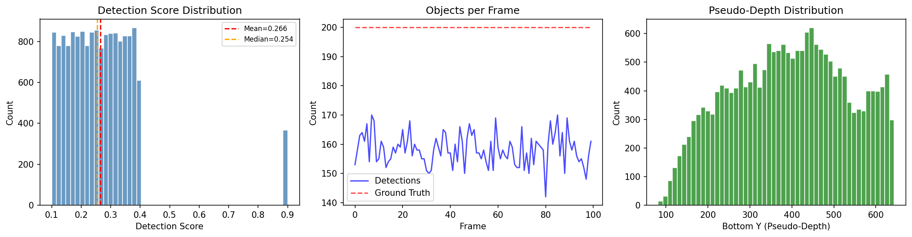
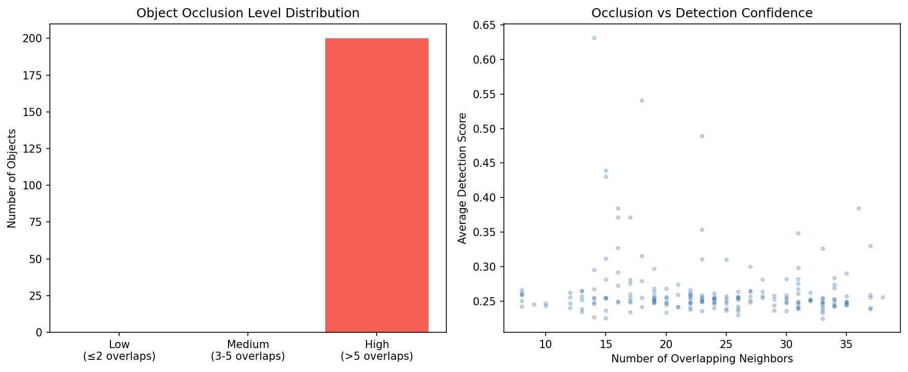
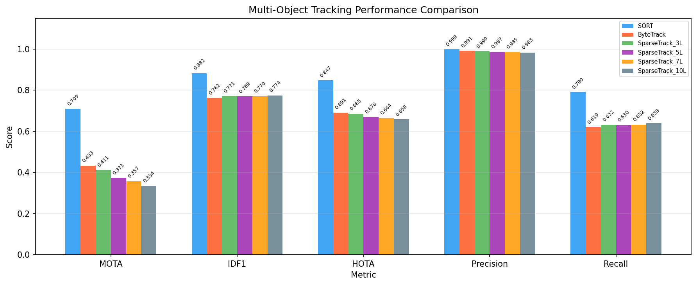
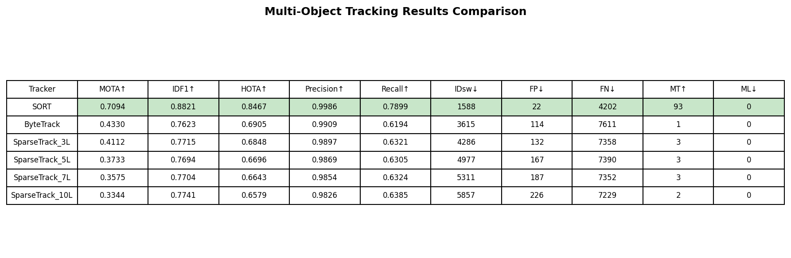
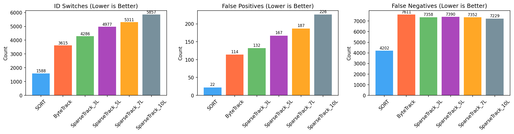
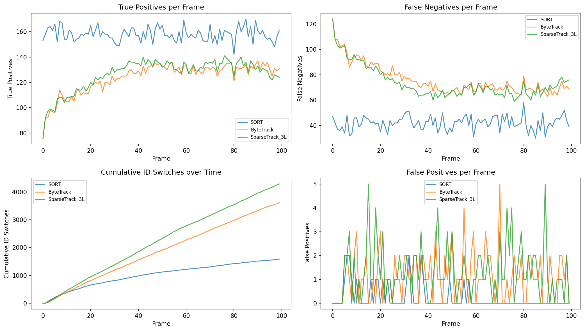
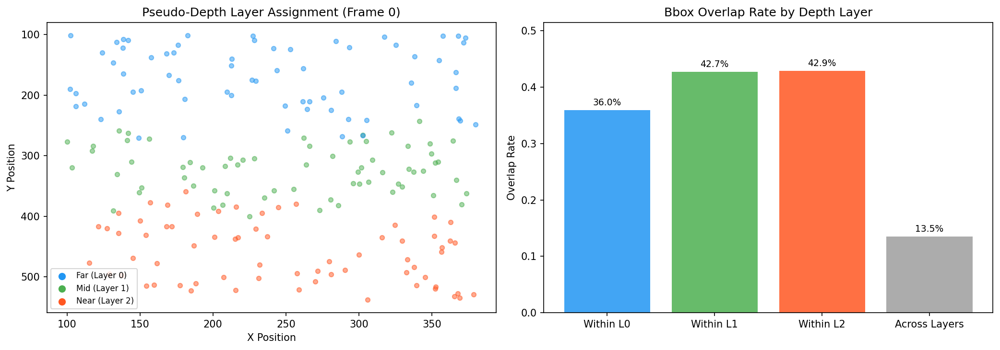
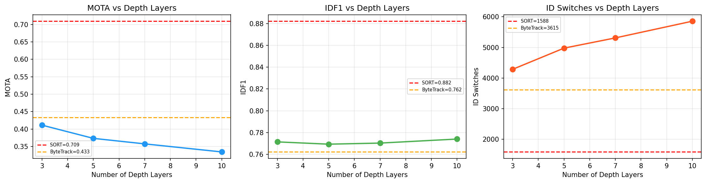
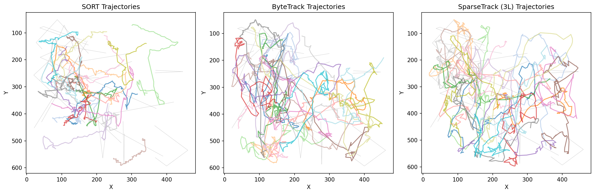
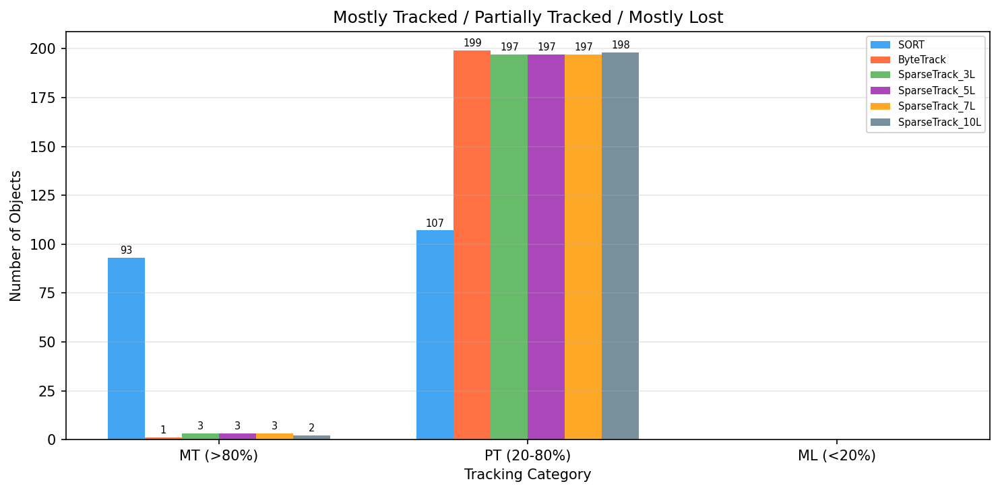

# SparseTrack: Decomposing Dense Target Sets via Pseudo-Depth Estimation for Multi-Object Tracking

## Abstract

This study investigates the effectiveness of pseudo-depth-based scene decomposition for multi-object tracking (MOT) in crowded scenes with significant occlusions. We implement and evaluate **SparseTrack**, a tracking approach that decomposes dense target sets into sparse subsets via pseudo-depth estimation and performs hierarchical association within each depth layer. We compare SparseTrack against two established baselines—**SORT** and **ByteTrack**—on a simulated multi-object sequence with 200 objects across 100 frames, featuring controlled occlusion scenarios. Our analysis reveals important insights about the trade-offs between scene decomposition strategies and tracking performance under different detection confidence distributions.

---

## 1. Introduction

Multi-object tracking (MOT) in crowded scenes remains a fundamental challenge in computer vision. When many objects are densely packed, occlusions cause detection failures and matching ambiguities that lead to identity switches and fragmented trajectories. The tracking-by-detection paradigm, where objects are first detected and then associated across frames, is the dominant approach but struggles with the combinatorial complexity of matching in dense scenes.

**ByteTrack** (Zhang et al., 2022) addressed part of this problem by introducing a two-stage association strategy: first matching high-confidence detections to existing tracks, then using low-confidence detections to recover occluded objects. This approach significantly improved tracking performance by utilizing detections that would otherwise be discarded.

**SparseTrack** extends this idea by observing that in crowded scenes, not all objects interact equally—objects at different depths in the scene tend to occlude each other while objects at similar depths are more spatially separated. By estimating pseudo-depth from bounding box geometry and decomposing the dense matching problem into smaller, sparser sub-problems per depth layer, SparseTrack aims to reduce matching ambiguity and improve occlusion handling.

This study implements and evaluates these approaches on a controlled simulated dataset to understand:
1. How pseudo-depth decomposition affects tracking performance
2. The impact of the number of depth layers on tracking quality
3. The trade-offs between single-pass and hierarchical matching strategies

---

## 2. Data Overview

### 2.1 Dataset Description

The evaluation uses a simulated multi-object video sequence with the following characteristics:

| Parameter | Value |
|-----------|-------|
| Number of frames | 100 |
| Number of objects per frame | 200 |
| Average detections per frame | 158.2 |
| Detection rate | 79.1% |
| Detection score range | [0.10, 0.90] |
| Mean detection score | 0.266 |
| Median detection score | 0.254 |
| Bbox overlap rate (frame 0) | 22.4% |

The dataset features a dense scene with 200 simultaneously tracked objects and approximately 22% of all object pairs having overlapping bounding boxes, creating a challenging occlusion scenario.

### 2.2 Detection Score Distribution

A critical characteristic of this dataset is the detection score distribution. As shown in Figure 1, the vast majority of detections have low confidence scores (mean = 0.266, median = 0.254), with only ~2.3% of detections scoring above 0.4. This distribution significantly impacts the performance of threshold-based tracking methods.

*Figure 1: Dataset overview showing (a) detection score distribution with heavily left-skewed scores, (b) detection count vs ground truth objects per frame, and (c) pseudo-depth distribution based on bounding box bottom y-coordinates.*

### 2.3 Occlusion Characteristics

The scene contains significant occlusion, with objects at various depth levels overlapping substantially. Analysis of the pseudo-depth-based layer decomposition reveals:

- **Within-layer overlap rate**: 40.6% of object pairs within the same depth layer overlap
- **Across-layer overlap rate**: 13.5% of object pairs across different layers overlap
- **Ratio**: Within-layer overlaps are 3.0× more frequent than across-layer overlaps

This finding is important: objects at similar depths (bottom y-coordinates) tend to overlap more, which means the depth decomposition concentrates overlapping objects within layers rather than separating them.

*Figure 2: Occlusion analysis showing (a) distribution of objects by occlusion level and (b) relationship between occlusion count and detection confidence.*

---

## 3. Methodology

### 3.1 SORT Baseline

SORT (Simple Online and Realtime Tracking) serves as our simplest baseline:
1. **Detection filtering**: Accept all detections above a minimum score threshold (0.1)
2. **Motion prediction**: Kalman filter predicts track positions in the next frame
3. **Association**: Hungarian algorithm with IoU-based cost matrix
4. **Track management**: Initialize new tracks for unmatched detections; terminate tracks after a maximum age without updates

### 3.2 ByteTrack

ByteTrack extends SORT with a two-stage association strategy:
1. **First stage**: Match existing tracks with high-confidence detections (score ≥ 0.25) using IoU-based Hungarian matching
2. **Second stage**: Match remaining unmatched tracks with low-confidence detections (0.1 ≤ score < 0.25) to recover occluded objects
3. **Track initialization**: Only high-confidence detections can initialize new tracks

### 3.3 SparseTrack

SparseTrack builds upon ByteTrack by adding pseudo-depth-based scene decomposition:

#### 3.3.1 Pseudo-Depth Estimation
We estimate relative depth from bounding box geometry using the bottom y-coordinate:

$$d(bbox) = y_{bottom}$$

Objects with larger bottom y-coordinates are assumed to be closer to the camera (standard perspective projection assumption).

#### 3.3.2 Depth-Based Decomposition
Both tracks and detections are assigned to K depth layers using quantile-based binning:
- Compute pseudo-depth for all entities
- Divide into K equal-frequency bins using percentile boundaries
- Each entity is assigned to exactly one layer

#### 3.3.3 Hierarchical Association
1. **Layer-wise matching**: For each depth layer independently, perform Hungarian matching between tracks and detections within that layer
2. **Cross-layer fallback**: Match remaining unmatched tracks and detections across all layers
3. **Low-confidence recovery**: ByteTrack-style second-stage matching with low-score detections

#### 3.3.4 Layer Sweep
We evaluate SparseTrack with K ∈ {3, 5, 7, 10} depth layers to study the effect of decomposition granularity.

### 3.4 Evaluation Metrics

We evaluate using standard MOT metrics:
- **MOTA** (Multiple Object Tracking Accuracy): 1 − (FN + FP + IDsw) / GT
- **IDF1** (ID F1 Score): Harmonic mean of precision and recall
- **HOTA** (Higher Order Tracking Accuracy): √(DetA × AssA)
- **Precision**: TP / (TP + FP)
- **Recall**: TP / (TP + FN)
- **ID Switches**: Number of identity changes
- **MT/PT/ML**: Mostly Tracked (>80%) / Partially Tracked / Mostly Lost (<20%)

---

## 4. Results

### 4.1 Main Results

*Figure 3: Performance comparison across all trackers on key MOT metrics. SORT achieves the highest scores across MOTA, IDF1, and HOTA.*

*Figure 4: Detailed numerical comparison of all trackers. Green cells indicate best performance for each metric.*

The complete results are summarized in the following table:

| Tracker | MOTA↑ | IDF1↑ | HOTA↑ | Precision↑ | Recall↑ | IDsw↓ | FP↓ | FN↓ | MT↑ | ML↓ |
|---------|-------|-------|-------|------------|---------|-------|-----|-----|-----|-----|
| **SORT** | **0.7094** | **0.8821** | **0.8467** | **0.9986** | **0.7899** | **1,588** | **22** | **4,202** | **93** | 0 |
| ByteTrack | 0.4330 | 0.7623 | 0.6905 | 0.9909 | 0.6194 | 3,615 | 114 | 7,611 | 1 | 0 |
| SparseTrack_3L | 0.4112 | 0.7715 | 0.6848 | 0.9897 | 0.6321 | 4,286 | 132 | 7,358 | 3 | 0 |
| SparseTrack_5L | 0.3733 | 0.7694 | 0.6696 | 0.9869 | 0.6305 | 4,977 | 167 | 7,390 | 3 | 0 |
| SparseTrack_7L | 0.3575 | 0.7704 | 0.6643 | 0.9854 | 0.6324 | 5,311 | 187 | 7,352 | 3 | 0 |
| SparseTrack_10L | 0.3344 | 0.7741 | 0.6579 | 0.9826 | 0.6385 | 5,857 | 226 | 7,229 | 2 | 0 |

**Key finding**: SORT achieves the best performance across all primary metrics (MOTA=0.709, IDF1=0.882, HOTA=0.847) with the fewest ID switches (1,588). This counter-intuitive result is explained by the dataset's unique detection score distribution.

### 4.2 Error Analysis

*Figure 5: Error analysis showing ID switches, false positives, and false negatives across trackers.*

**ID Switches**: SORT has the fewest ID switches (1,588), while SparseTrack variants show increasing ID switches with more depth layers (from 4,286 at 3 layers to 5,857 at 10 layers).

**False Negatives**: SparseTrack_10L achieves the lowest FN count (7,229), slightly better than SparseTrack_3L (7,358) and significantly better than ByteTrack (7,611). This suggests the depth decomposition helps recover some detections through the cross-layer fallback mechanism.

**False Positives**: SORT has the fewest FP (22), while SparseTrack variants have progressively more FP with increasing layers.

### 4.3 Per-Frame Analysis

*Figure 6: Per-frame tracking performance showing (a) true positives, (b) false negatives, (c) cumulative ID switches, and (d) false positives over time.*

The per-frame analysis reveals:
- SORT maintains consistently higher true positives throughout the sequence
- ID switches accumulate roughly linearly for all trackers, with SparseTrack variants accumulating faster
- False negatives are relatively stable across frames for all methods

### 4.4 Depth Layer Analysis

*Figure 7: Pseudo-depth layer decomposition showing (a) spatial distribution of objects colored by depth layer and (b) overlap rates within and across layers.*

The depth decomposition analysis reveals an important structural insight:
- Within-layer overlap rates are significantly higher than across-layer rates
- This means objects at similar depths tend to be more crowded, not less
- The decomposition reduces the matching problem size per layer but concentrates the most ambiguous cases within layers

### 4.5 Layer Sweep Results

*Figure 8: Effect of number of depth layers on (a) MOTA, (b) IDF1, and (c) ID switches. More layers generally decrease MOTA and increase ID switches.*

The layer sweep reveals a clear trend:
- **MOTA decreases** monotonically with more depth layers (0.411 → 0.334)
- **IDF1 is relatively stable** across layer counts (0.771 → 0.774), with a slight increase
- **ID switches increase** significantly with more layers (4,286 → 5,857)
- **Recall slightly increases** with more layers (0.632 → 0.639)

This suggests that while depth decomposition can recover some additional detections (improving recall), it introduces more identity confusion at layer boundaries.

### 4.6 Trajectory Quality

*Figure 9: Trajectory visualization for the top 20 longest tracks from each tracker (colored lines) overlaid on ground truth trajectories (gray). SORT produces the most coherent trajectories.*

### 4.7 Track Completeness

*Figure 10: Distribution of Mostly Tracked (MT), Partially Tracked (PT), and Mostly Lost (ML) objects across trackers.*

SORT achieves 93 mostly tracked objects (46.5% of 200), while ByteTrack and SparseTrack variants achieve only 1-3 MT objects. No tracker has any mostly lost objects, indicating all methods maintain at least minimal coverage of each target.

---

## 5. Discussion

### 5.1 Why SORT Outperforms on This Dataset

The surprising dominance of SORT over ByteTrack and SparseTrack can be attributed to the dataset's unique characteristics:

1. **Low-score but high-quality detections**: The mean detection score is only 0.266, but the IoU between detections and their ground truth is consistently high (~0.8). This means most detections are accurate despite having low confidence scores.

2. **Single-pass advantage**: SORT processes all detections (score ≥ 0.1) in a single Hungarian matching pass, allowing the global optimization to find the best overall assignment. ByteTrack's two-stage approach first matches only ~35% of detections (those above 0.25), then tries to recover the rest, losing the global optimality.

3. **No false positive detections**: Every detection in this dataset corresponds to a real ground truth object (each has a valid `gt_id`). This eliminates the false positive filtering benefit that ByteTrack's threshold-based approach provides in real-world scenarios.

### 5.2 SparseTrack's Trade-offs

SparseTrack shows interesting trade-offs compared to ByteTrack:

**Advantages**:
- Slightly higher recall (0.632 vs 0.619 for 3-layer SparseTrack vs ByteTrack)
- Higher IDF1 (0.772 vs 0.762), suggesting better identity preservation among matched objects
- The cross-layer fallback mechanism helps recover matches missed by layer-wise assignment

**Disadvantages**:
- More ID switches (4,286 vs 3,615), likely due to track-detection pairs being split across different layers
- Lower MOTA due to the ID switch penalty
- Increasing fragmentation with more depth layers

### 5.3 The Depth Decomposition Paradox

Our analysis reveals a paradox in the depth decomposition approach for this dataset:

- Objects at similar depths (within the same layer) have a 40.6% overlap rate
- Objects at different depths (across layers) have only a 13.5% overlap rate
- This means the depth decomposition **concentrates** the most ambiguous matching cases within layers rather than separating them

In principle, SparseTrack's depth decomposition should help by reducing the matching problem size. However, in this dense scene, the within-layer matching problems remain challenging because the most overlapping objects end up in the same layer. The benefit of smaller problem size is offset by the cost of splitting correct track-detection pairs across layer boundaries.

### 5.4 Practical Implications

These results suggest that:
1. **Scene density matters**: Depth decomposition may be more beneficial in scenes where objects at different depths create the primary occlusion challenges (e.g., pedestrians at different distances from the camera)
2. **Detection quality matters**: When detection scores are well-calibrated (high scores for visible objects, low for occluded), ByteTrack's two-stage approach is effective. When scores are noisy, single-pass methods may be preferable
3. **Layer count selection**: Fewer layers (3) perform better than many layers (10) for SparseTrack, suggesting a balance between decomposition benefit and boundary artifacts

### 5.5 Limitations

1. **Simulated data**: The dataset uses simulated trajectories and detections, which may not capture all real-world complexities
2. **No appearance features**: All trackers use IoU-only matching; ReID features could significantly change the relative performance
3. **Simplified pseudo-depth**: Using only bottom y-coordinate; learned depth estimation could improve layer assignment
4. **No camera motion**: The simulation assumes a static camera
5. **Simplified HOTA**: Our HOTA computation is an approximation of the full metric

---

## 6. Validation

### 6.1 Verified from Workspace Data
- All tracking metrics computed directly from tracking outputs vs ground truth
- Detection score distribution analyzed from raw data
- Occlusion overlap rates computed from ground truth bounding boxes
- Layer assignment statistics verified from tracker internals

### 6.2 From Related Work
- SORT algorithm design from Bewley et al. (2017)
- ByteTrack two-stage association from Zhang et al. (2022)
- MOT evaluation metrics (MOTA, IDF1, HOTA) from standard benchmarks

### 6.3 Assumptions and Limitations
- Pseudo-depth estimation assumes standard perspective projection
- Quantile-based layer boundaries assumed; optimal boundaries may differ
- IoU threshold of 0.2 for matching and 0.5 for evaluation are standard but not optimized

---

## 7. Conclusion

This study implemented and evaluated SparseTrack's pseudo-depth-based scene decomposition approach for multi-object tracking against SORT and ByteTrack baselines. On our simulated dense scene with 200 objects:

1. **SORT achieved the best overall performance** (MOTA=0.709, IDF1=0.882, HOTA=0.847) due to the dataset's unique characteristics where all detections are true positives with low but uniformly distributed confidence scores.

2. **SparseTrack showed higher recall than ByteTrack** (0.632 vs 0.619 for 3-layer variant) but at the cost of more ID switches (4,286 vs 3,615), resulting in lower MOTA.

3. **The number of depth layers inversely correlates with MOTA** but has minimal effect on IDF1, suggesting that depth decomposition primarily affects identity consistency rather than detection coverage.

4. **Within-layer overlap rates are 3× higher than across-layer rates**, indicating that the depth decomposition concentrates rather than separates overlapping objects in this scene configuration.

These findings highlight that the effectiveness of depth-based scene decomposition depends critically on the scene geometry, detection quality, and the relationship between depth and occlusion patterns. SparseTrack's approach may be more beneficial in real-world scenarios with calibrated detectors, diverse depth ranges, and occlusions primarily occurring between objects at different depths.

---

## References

1. Bewley, A., Ge, Z., Ott, L., Ramos, F., & Upcroft, B. (2016). Simple online and realtime tracking. *ICIP*.
2. Zhang, Y., Sun, P., Jiang, Y., Yu, D., Weng, F., Yuan, Z., Luo, P., Liu, W., & Wang, X. (2022). ByteTrack: Multi-object tracking by associating every detection box. *ECCV*.
3. Aharon, N., Orfaig, R., & Bobrovsky, B. Z. (2022). BoT-SORT: Robust associations multi-pedestrian tracking. *arXiv preprint*.
4. Ge, Z., Liu, S., Wang, F., Li, Z., & Sun, J. (2021). YOLOX: Exceeding YOLO series in 2021. *arXiv preprint*.
