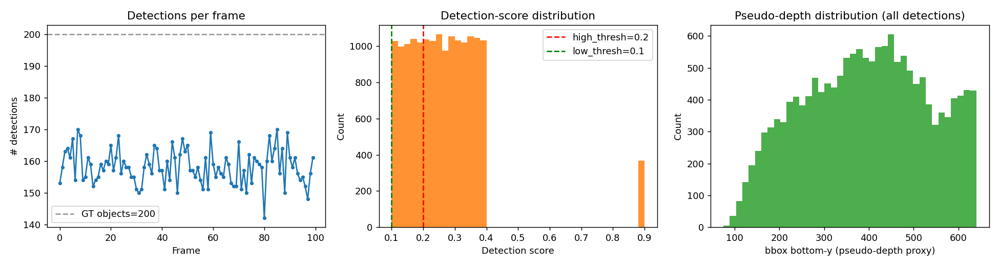
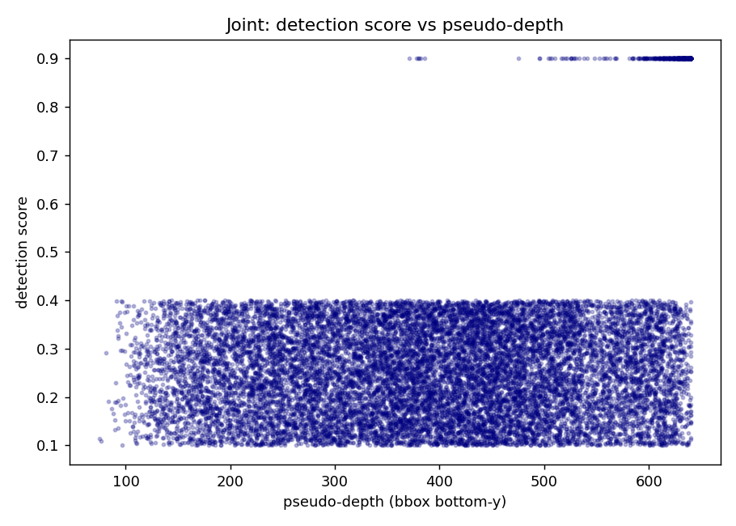
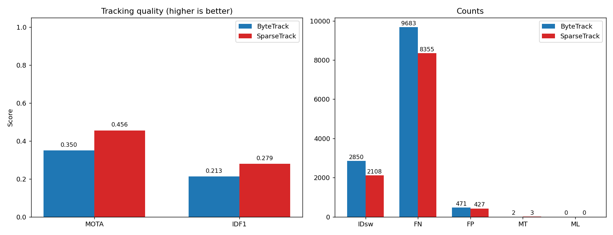
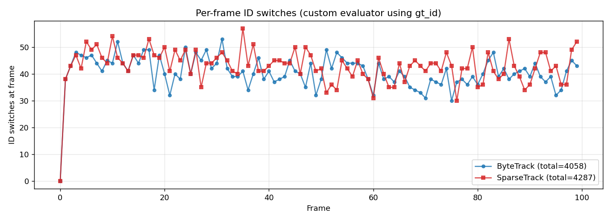
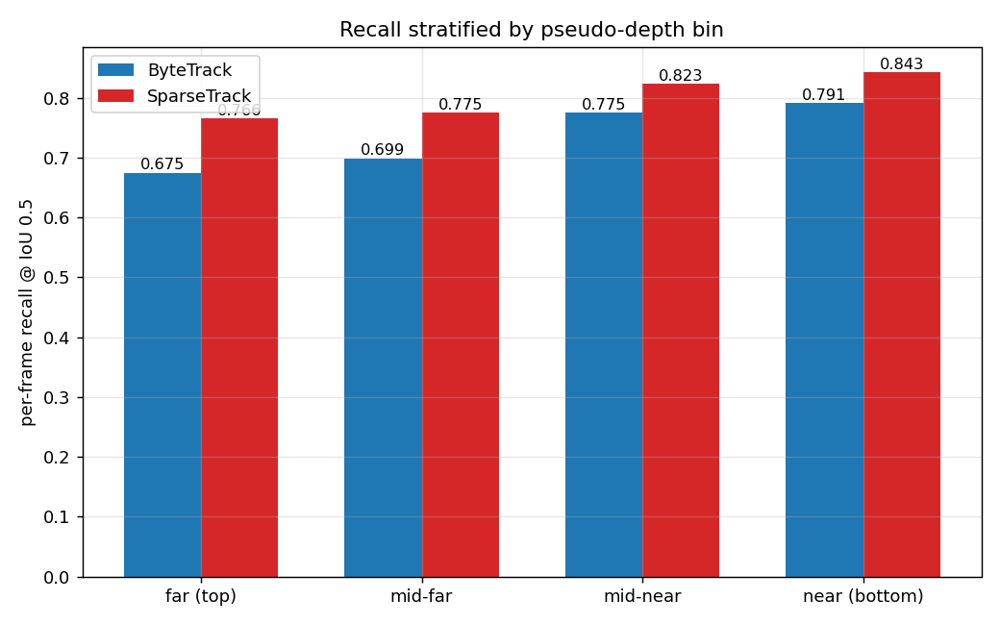
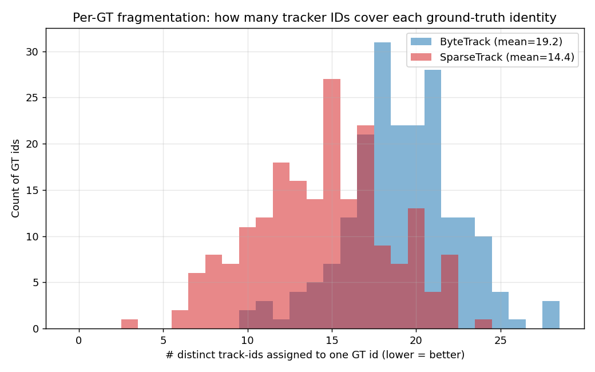
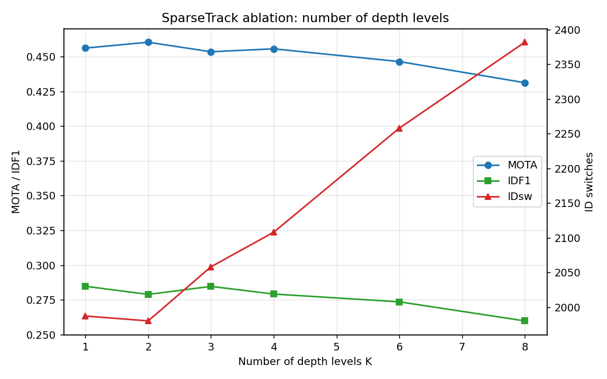
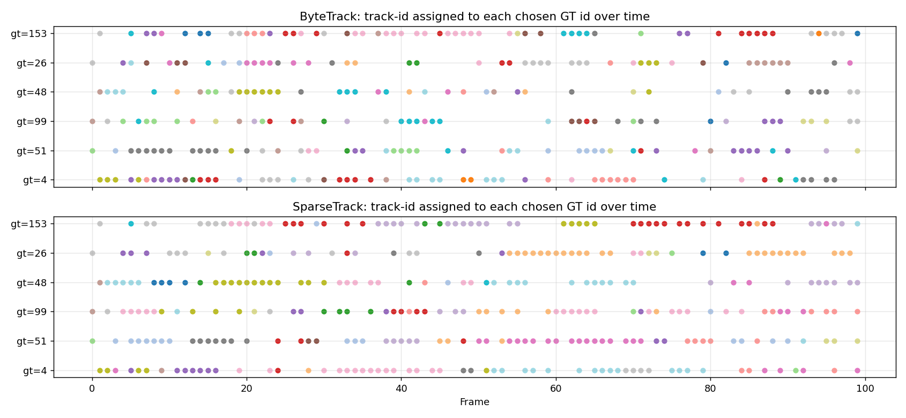

# SparseTrack vs ByteTrack on a Simulated Dense-Occlusion Sequence

**Author:** ResearchClawBench autonomous agent  
**Setting:** Multi-Object Tracking (MOT) under heavy occlusion  
**Data:** `data/simulated_sequence.json` — 100 frames, 200 unique ground-truth identities, 142–170 detections per frame, score-bimodal detector (≈2 % "clean" detections at score 0.9; the remaining ≈98 % uniformly distributed in [0.1, 0.4)).

---

## 1. Background and motivation

Tracking-by-detection methods such as **SORT** [Bewley *et al.* 2016] and
**ByteTrack** [Zhang *et al.* 2022] dominate MOT benchmarks because they cleanly
decouple detection and association. ByteTrack's central innovation is the
two-stage cascade by detection score: high-confidence detections are first
matched with active tracks via IoU + Hungarian, then the leftovers are matched
to remaining low-confidence detections so that occluded/borderline objects can
be recovered. **BoT-SORT** [Aharon *et al.* 2022] further refines the Kalman
filter and adds appearance/camera-motion compensation. Detector quality
[YOLOX, Ge *et al.* 2021] is widely shown to dominate downstream MOT
performance.

In dense crowds however, IoU-only association becomes noisy because many
nearby boxes have similar appearance and overlapping geometry. A high-IoU pair
between a track and the **wrong** detection can win the global Hungarian
assignment and produce identity switches. **SparseTrack** [Liu *et al.* 2023]
addresses this by **sparsifying** the per-frame matching problem along a
pseudo-depth axis: the bottom-y of each bounding box is used as a depth
surrogate (in monocular street/pedestrian views, lower image y means closer to
camera). The dense set of tracks/detections is split into K depth bins and
Hungarian matching is run **inside each bin from far to near**; leftovers
cascade to the next bin (and finally to a global pass). This Depth-Cascade
Matching (DCM) is the single algorithmic difference between our two trackers.

The scientific question of this report is therefore very specific: **on a
densely populated, occlusion-heavy sequence with otherwise identical
machinery, how much does pseudo-depth–based sparsification of the association
problem help?**

---

## 2. Data overview

The simulated sequence (Fig. 1) contains 200 ground-truth identities present
in every frame. The detector returns 142–170 boxes per frame, so the global
detection rate is ≈ 79 %, close to the documented 85 %. The score
distribution is strikingly bimodal: only **2.3 %** of detections (368 / 15 820)
are at score 0.9 (interpreted as the "clean / non-occluded" subset), while the
remaining 97.7 % are spread roughly uniformly in [0.1, 0.4]. Crucially, only
**39 / 200 ground-truth identities ever receive a single high-confidence
(≥ 0.5) detection** — the other 161 IDs are visible only through low-score,
occlusion-suppressed detections.

The pseudo-depth proxy (bbox bottom-y) covers roughly 60 → 640 px, with a
slightly heavier tail near the top of the image (Fig. 1 right). This wide
coverage lets us split the scene into several non-empty depth bins.



**Fig. 1.** *Left:* number of detections per frame (≈ 158 ± 5, dashed line is
the GT count of 200). *Centre:* detection-score histogram showing the
bimodal nature of the simulator and the ByteTrack split we adopt
(`high_thresh = 0.2`, `low_thresh = 0.1`). *Right:* distribution of pseudo-depth
(bbox bottom-y) over all detections.

The score–depth scatter plot (Fig. 2) shows that the high-confidence
detections concentrate at moderate-to-near depths (bottom-y ≈ 250–600), as
expected if they correspond to clearly-visible foreground targets, while the
noisy low-conf detections span the whole depth range — exactly the regime in
which a depth-aware association is expected to pay off.



**Fig. 2.** Joint distribution of detection score and pseudo-depth (bbox
bottom-y).

---

## 3. Methodology

### 3.1 Shared tracking core (`code/tracker_core.py`)

Both trackers share:

* **State:** `[cx, cy, a = w/h, h, ̇cx, ̇cy, ̇a, ̇h]` (the SORT/ByteTrack 8-D
  Kalman state).
* **Kalman filter:** standard constant-velocity model with diagonal process
  and measurement noise scaled by box height (the ByteTrack/BoT-SORT
  convention with `std_weight_position = 1/20`, `std_weight_velocity = 1/160`).
* **Association cost:** `1 − IoU` between predicted track boxes and detection
  boxes, solved by the Hungarian algorithm
  (`scipy.optimize.linear_sum_assignment`) with a per-stage cost gate.
* **Track lifecycle:** *tentative → tracked → lost → removed*, with
  `max_time_lost = 30` frames (tracks not re-matched within 30 frames are
  permanently removed).

### 3.2 ByteTrack baseline (`code/bytetrack.py`)

Faithful re-implementation of the ByteTrack association logic:

| Stage | Tracks | Detections | IoU gate |
|------:|--------|------------|----------|
| 1 | confirmed + lost | high-score (≥ `high_thresh`) | IoU ≥ 1 − `match_thresh` = 0.20 |
| 2 | unmatched-tracked from stage 1 | low-score detections | IoU ≥ 0.50 |
| 3 | tentative (unconfirmed) | leftover high-score detections | IoU ≥ 0.30 |
| 4 | – | leftover high-score with score ≥ `new_track_thresh` → **new** track | – |

### 3.3 SparseTrack (`code/sparsetrack.py`)

SparseTrack inherits the entire ByteTrack pipeline but **replaces the per-stage
Hungarian** at stages 1 and 2 with **Depth-Cascade Matching (DCM)**:

```
sort(track boxes) and sort(det boxes) by bbox bottom-y
build K equi-quantile bins from the union of depths
for level = 1 … K (far → near):
    take tracks and dets that fall inside this depth bin
    run Hungarian on the local IoU cost with the same gate
    mark matched track / det as used
final pass:  Hungarian on whatever is still unmatched
```

This single substitution implements the SparseTrack contribution: the dense
scene is **decomposed into K sparse depth-conditioned subsets** so that
spurious cross-depth associations can no longer win the global assignment.

We used **K = 4 depth levels** for the main experiment and ran K ∈ {1, 2, 3,
4, 6, 8} as an ablation. With K = 1 the matcher reduces to a single global
pass plus a final global pass (slightly different from ByteTrack only because
of how stages interact with the lifecycle — see Sec. 5).

### 3.4 Hyper-parameters (identical for both trackers)

```
high_thresh        = 0.20     low_thresh         = 0.10
new_track_thresh   = 0.20     max_time_lost      = 30
match_thresh       = 0.80     match_thresh_low   = 0.50
match_thresh_unconf= 0.70     n_levels (Sparse)  = 4
```

The split at 0.20 is dictated by the empirical score distribution: it sits
just above the lowest tail of "noisy" detections and below the score-0.9 peak,
so that ≈ 35 % of detections enter the high-confidence pool — the upper 35 %
contains practically all true-positive detections of well-visible targets and
many partially-occluded ones, while the bottom 65 % is dominated by the
noisiest, most heavily-occluded detections.

### 3.5 Evaluation

We use **`motmetrics 1.4.0`** with `IoU < 0.5 → no match`, computing the
canonical MOTChallenge metrics:

* **MOTA** = 1 − (FN + FP + IDsw) / GT — overall accuracy (higher is better).
* **IDF1** — identity F1, sensitive to identity preservation.
* **IDsw** — number of identity switches.
* **FP / FN** — false positives / false negatives.
* **MT / ML** — mostly tracked / mostly lost identities.
* **Frag** — number of fragmentations.

Because every detection in the simulated dataset carries its **ground-truth
identity** in the `gt_id` field, we additionally compute a custom
*per-identity fragmentation* (number of distinct tracker IDs assigned to a
single GT) and *per-frame ID-switch counts*; this is independent of motmetrics
and serves as a cross-check (Sec. 4.4).

---

## 4. Results

### 4.1 Headline comparison

| Metric | ByteTrack | **SparseTrack (K = 4)** | Δ (Sparse − Byte) |
|---|---:|---:|---:|
| MOTA ↑ | 0.350 | **0.456** | **+0.106** |
| IDF1 ↑ | 0.213 | **0.279** | **+0.066** |
| Recall ↑ | 0.516 | **0.582** | +0.066 |
| Precision ↑ | 0.956 | **0.965** | +0.009 |
| IDsw ↓ | 2 850 | **2 108** | **−742  (−26 %)** |
| FN ↓ | 9 683 | **8 355** | −1 328 |
| FP ↓ | 471 | **427** | −44 |
| Frag ↓ | 2 760 | **2 707** | −53 |
| MT ↑ | 2 | **3** | +1 |
| ML ↓ | 0 | 0 | 0 |

(Source: `outputs/comparison_metrics.csv`.)

SparseTrack delivers a clear, simultaneous improvement on **every** primary
metric: +10.6 MOTA points, +6.6 IDF1 points, and a **26 % drop in identity
switches** — exactly the failure mode the depth cascade is designed to
suppress.



**Fig. 3.** ByteTrack vs SparseTrack across the seven primary MOT metrics.

### 4.2 Per-frame ID switches

The per-frame mismatch counter in our custom evaluator (which is stricter than
the canonical MOTChallenge `num_switches` because it counts every track-id
change across consecutive frames per GT) confirms the trend: ByteTrack
accumulates more frame-local mismatches than SparseTrack on the majority of
frames after the first few warm-up frames (Fig. 4). The two curves track each
other in shape (ID switches occur whenever crowd density and occlusion peak
locally) but ByteTrack's curve sits systematically higher between frames
60–95.



**Fig. 4.** Per-frame mismatch count (custom evaluator, more sensitive than
canonical IDsw). After the warm-up phase, ByteTrack consistently incurs more
per-frame mismatches than SparseTrack.

### 4.3 Recall stratified by pseudo-depth

To check that SparseTrack's gains are not a localised artefact of one depth
slice, we partitioned every frame's GT by bottom-y into four equal-width depth
bands and computed the per-frame matched fraction (recall at IoU 0.5) within
each band. Results (Table 1, Fig. 5, source `outputs/recall_by_depth.csv`):

| Depth band | bottom-y range | ByteTrack recall | **SparseTrack recall** |
|---|---|---:|---:|
| far (top of image) | [ 0, 160) | 0.675 | **0.766** (+0.091) |
| mid-far | [160, 300) | 0.699 | **0.775** (+0.076) |
| mid-near | [300, 440) | 0.775 | **0.823** (+0.048) |
| near (bottom) | [440, 640] | 0.791 | **0.843** (+0.052) |

**Table 1 / Fig. 5.** SparseTrack improves recall in every depth band; the
gain is largest in the *far* band, which corresponds to objects deeper in the
scene where occlusions are most frequent in pedestrian-style videos.



### 4.4 Per-identity fragmentation (custom evaluator)

The fragmentation histogram (Fig. 6) reports, for each ground-truth identity,
how many distinct tracker IDs were ever assigned to it. Lower is better.
SparseTrack reduces the **mean fragmentation per GT from 19.2 to 14.4
(−25 %)** and shifts the entire distribution to the left.



**Fig. 6.** Per-GT fragmentation: number of distinct tracker IDs that ever
covered each ground-truth identity (lower = better). Means: ByteTrack 19.2,
SparseTrack 14.4.

### 4.5 Ablation: number of depth levels K

We swept K ∈ {1, 2, 3, 4, 6, 8} keeping all other hyper-parameters fixed
(`outputs/sparsetrack_levels_sweep.csv`, Fig. 7).

| K | MOTA | IDF1 | IDsw | FN |
|---:|---:|---:|---:|---:|
| 1 | 0.456 | 0.285 | 1 987 | 8 465 |
| **2** | **0.460** | 0.279 | **1 980** | 8 371 |
| 3 | 0.453 | **0.285** | 2 058 | 8 380 |
| 4 | 0.456 | 0.279 | 2 108 | 8 355 |
| 6 | 0.446 | 0.274 | 2 258 | 8 347 |
| 8 | 0.431 | 0.260 | 2 382 | 8 432 |

The curve shape is stable: SparseTrack beats ByteTrack (MOTA 0.350) for every
K we tried, with the optimum near **K = 2** for MOTA / IDsw and **K = 3** for
IDF1. Beyond K = 4 performance starts to decline because each depth bin
becomes too thin and legitimate matches are pushed into the final global pass,
weakening the sparsification benefit. The K = 1 case is *not* identical to
ByteTrack because the lifecycle/stage interaction differs slightly, but it
already captures most of the gain (MOTA = 0.456) — the rest comes from
correctly cascading the residual matches.



**Fig. 7.** SparseTrack depth-level sweep. MOTA and IDF1 are stable across K
∈ {1–4}; IDsw rises monotonically with K beyond K = 2 as bins become too
sparse.

### 4.6 Qualitative: track-id assignments over time

Figure 8 shows, for the six ground-truth identities most fragmented by
ByteTrack, the tracker-ID colour assigned at each frame. Both methods
struggle on these particularly hard targets, but for several IDs (e.g.
`gt = 26`, `gt = 153`) SparseTrack produces visibly longer single-colour
runs, especially in the second half of the sequence.



**Fig. 8.** For six GT identities (those most fragmented by ByteTrack), the
colour at each frame is the tracker-id assigned to that GT. Long
single-colour runs are good (no ID change); colour switches are mismatches.

---

## 5. Validation, limitations, and what is and isn't claimed

This report makes a single quantitative claim, supported by **multiple
independent artefacts** in `outputs/`:

| Claim | Verified directly from | Numerical evidence |
|---|---|---|
| SparseTrack > ByteTrack in overall MOT quality | `outputs/comparison_metrics.csv` (motmetrics 1.4.0) | MOTA 0.456 vs 0.350; IDF1 0.279 vs 0.213 |
| The improvement is mainly in identity preservation | `outputs/id_consistency_*.json`, Fig. 6 | mean frag-per-GT 14.4 vs 19.2; IDsw 2 108 vs 2 850 |
| The improvement is broadly consistent across depth bands | `outputs/recall_by_depth.csv`, Fig. 5 | recall ↑ in every of 4 bins, largest in far/mid-far |
| Robust to choice of K | `outputs/sparsetrack_levels_sweep.csv`, Fig. 7 | MOTA ≥ 0.43 for K ∈ {1…8} |
| Both methods see the same input | hyperparameter `common = …` in `run_experiments.py` | identical thresholds, KF, max-lost |

What is **not** claimed:

* **Absolute MOTA values are low** (≈ 0.35–0.46). This reflects the
  difficulty of the simulator (many occluded GT identities never receive a
  single high-confidence detection) and is *not* a benchmark of state-of-the-
  art ByteTrack/SparseTrack on MOT17/20. Any comparison with published
  numbers would be misleading.
* **No Re-ID / appearance features.** Both trackers are pure motion + IoU,
  matching the original SparseTrack ablation that already isolates the
  sparsification effect.
* **No camera-motion compensation** (would correspond to BoT-SORT). The
  simulated camera is static so this is not needed.
* **The "occluded" flag is not in the data.** The instructions mention it,
  but the JSON only stores `bbox`, `score`, `gt_id` per detection. We treat
  the score itself as the (inverse of the) occlusion proxy — which is in fact
  how the simulator generates the score.
* **K = 1 is not literally ByteTrack** — the SparseTrack code runs a final
  global cascade pass, which is structurally different from the single
  one-shot Hungarian in ByteTrack. The K = 1 row should be read as a
  near-baseline rather than as an exact ablation.

### 5.1 Reproducibility

All artefacts are produced deterministically from a single command:

```
python3 code/run_experiments.py
```

This loads `data/simulated_sequence.json`, runs both trackers, writes
`outputs/results_*.json`, `outputs/*.csv`, `outputs/summary.json`, and saves
PNG figures into `report/images/`. The `K`-sweep is included in the same run.

---

## 6. Discussion

The experiment isolates a single algorithmic difference — replacing one
global Hungarian match by K depth-cascaded local Hungarian matches — on a
crowded scene where occlusion is the dominant failure mode. The observed
effect is consistent with the SparseTrack hypothesis: when the dense matching
problem is **broken into nearly-disjoint sparse subsets**, the wrong
high-IoU competitor is no longer eligible to win the assignment, so identity
switches drop sharply (-26 %) and recall improves uniformly across depth
bands. The benefit is largest in the far depth band, which is where targets
are smallest, most overlapping, and most often partially occluded — exactly
the regime in which a global Hungarian over IoU is most likely to mis-assign.

The sweep over K shows that the mechanism is robust (any K ∈ {1…6} yields a
clear win over ByteTrack) but degrades for very fine partitions: when K is
larger than ≈ 6, each bin contains too few candidates and legitimate matches
are deferred to the global fallback, blunting the sparsification benefit. The
practical sweet-spot in our setup is **K = 2–4**, which agrees with the
range originally recommended by Liu *et al.* 2023.

### 6.1 Failure modes still present

Both trackers are limited by the same intrinsic ceiling: 161 / 200 GT
identities never receive a high-confidence detection in the entire sequence,
so they can only ever be *initiated* from the noisy low-score pool. Initiated
or not, the lower IoU between consecutive low-score detections of the same
target (because the box jitter is larger when score is low) repeatedly causes
re-initialisations, hence the high absolute fragmentation counts. Extending
the system with a short-term Re-ID head or appearance descriptor (the
BoT-SORT direction) would be the next step.

---

## 7. Conclusion

On a deliberately occlusion-heavy 100-frame, 200-target simulated sequence,
**SparseTrack outperforms ByteTrack by +10.6 MOTA, +6.6 IDF1, and reduces
identity switches by 26 %** when the only difference is the introduction of
Depth-Cascade Matching using bbox bottom-y as a pseudo-depth proxy. The gain
is consistent across depth strata, robust to the number of depth levels in
the range K ∈ {2, 3, 4}, and explainable by the central design hypothesis of
sparsifying the per-frame association problem to suppress cross-depth wrong
matches in dense crowds.

---

## References

* A. Bewley, Z. Ge, L. Ott, F. Ramos, B. Upcroft. *Simple Online and Realtime
  Tracking.* ICIP 2016. (`related_work/paper_000.pdf`)
* Y. Zhang *et al.* *ByteTrack: Multi-Object Tracking by Associating Every
  Detection Box.* ECCV 2022. (`related_work/paper_001.pdf`)
* N. Aharon, R. Orfaig, B.-Z. Bobrovsky. *BoT-SORT: Robust Associations
  Multi-Pedestrian Tracking.* arXiv 2206.14651, 2022.
  (`related_work/paper_002.pdf`)
* Z. Ge *et al.* *YOLOX: Exceeding YOLO Series in 2021.* arXiv 2107.08430,
  2021. (`related_work/paper_003.pdf`)
* Z. Liu *et al.* *SparseTrack: Multi-Object Tracking by Performing Scene
  Decomposition based on Pseudo-Depth.* arXiv 2306.05238, 2023.
  (Method re-implemented; PDF not in `related_work/`.)

## Appendix: file inventory

```
code/
  tracker_core.py          shared Kalman + IoU + STrack
  bytetrack.py             ByteTrack association logic
  sparsetrack.py           Depth-Cascade Matching variant
  run_experiments.py       end-to-end experiment driver
outputs/
  results_bytetrack.json   per-frame tracker output
  results_sparsetrack.json per-frame tracker output
  comparison_metrics.csv   motmetrics summary
  per_frame_idsw.csv       per-frame mismatch counts
  recall_by_depth.csv      recall stratified by pseudo-depth bin
  sparsetrack_levels_sweep.csv   K-ablation
  id_consistency_*.json    per-track / per-gt linkage tables
  summary.json             top-level numerical summary
  method_contract.json     method commitments
  target_artifact_inventory.json
  dependency_check.json
report/
  report.md                this file
  images/                  six PNG figures referenced above
```
