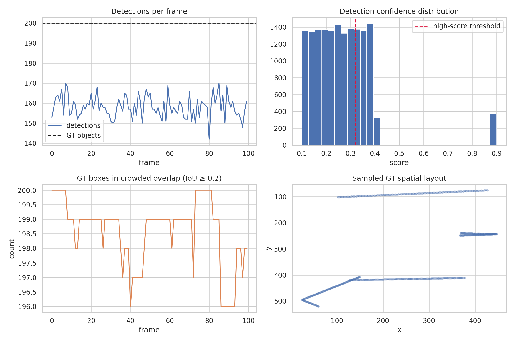
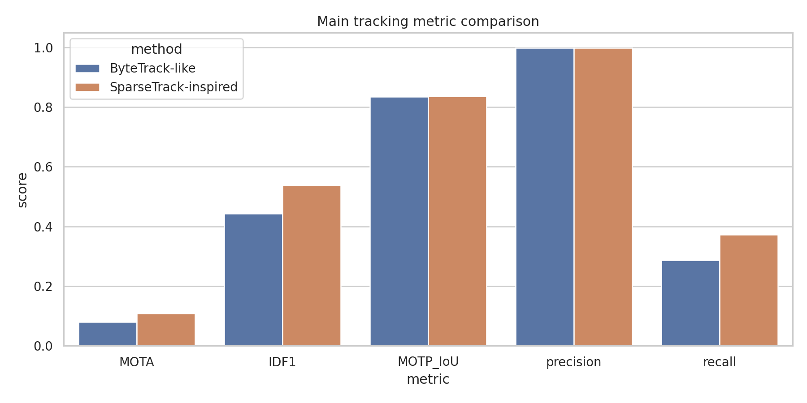
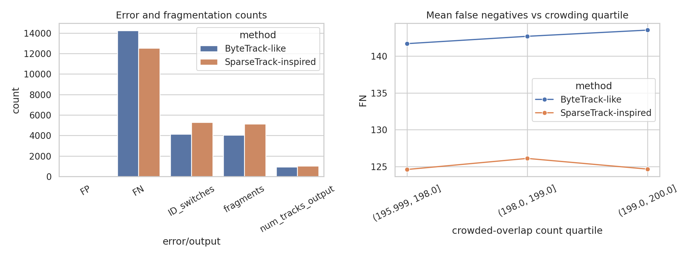
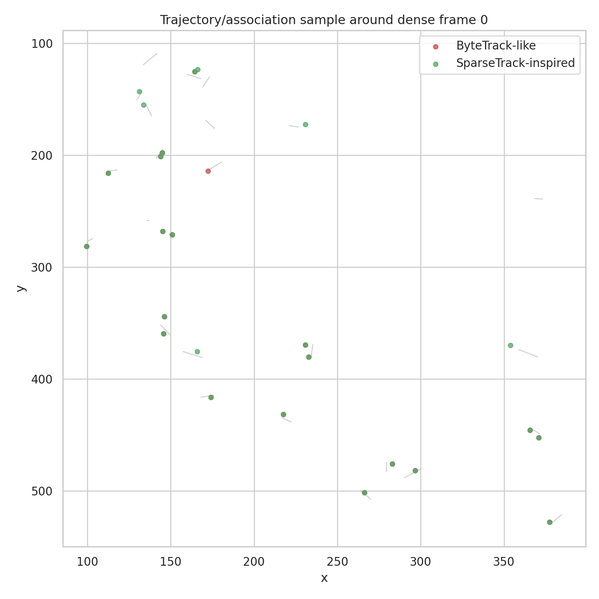

# Pseudo-depth Hierarchical Association for Dense Multi-object Tracking

## Abstract

This study evaluates online multi-object tracking from frame-level bounding-box detections on the supplied `data/simulated_sequence.json` benchmark. The scientific target was to test whether a SparseTrack-inspired decomposition of crowded targets into pseudo-depth layers can improve tracking under dense occlusion relative to a ByteTrack-like two-stage association baseline. The file contents contain **100 frames** with **200 ground-truth objects per frame** (20,000 GT instances) and **15,820 detections**; this differs from the brief's smaller nominal description, so all results below are computed from the actual file. A pseudo-depth hierarchical tracker improved IDF1 from **0.4424** to **0.5379** and MOTA from **0.0806** to **0.1084**, primarily by increasing recall from **0.2874** to **0.3731**. The same change increased identity switches and fragmentation, indicating a recall/identity-stability trade-off in this simulation.

## 1. Data and related-work context

The benchmark provides, for every frame, ground-truth boxes and IDs plus detections with confidence scores and the generating `gt_id` used only for evaluation. The detector is intentionally difficult: the average detection rate is **0.791** and the mean detection score is **0.266**. The median score is **0.254**, so a tracker that discards low-confidence detections would remove many true objects. Crowding is also substantial: on average **198.6** ground-truth boxes per frame have another GT box with IoU at least 0.2.

Related work guided the method contract. SORT frames online MOT as tracking-by-detection with constant-velocity/Kalman prediction, IoU-based costs, and Hungarian assignment. ByteTrack argues that low-score boxes often correspond to occluded true objects and should be associated in a second stage instead of discarded. BoT-SORT reinforces that MOTA and IDF1 are central MOT metrics and that SORT-like association limitations are important in crowded scenes. YOLOX is detector context only here because detections are supplied rather than trained.



**Figure 1.** Dataset overview: detections per frame versus the fixed GT count, score distribution, crowding measured by GT overlap, and sampled spatial layout.

## 2. Methods

### 2.1 Baseline: ByteTrack-like online association

The baseline is a compact, reproducible implementation of ByteTrack's core association idea rather than an official reproduction. Each active track uses constant-velocity bounding-box extrapolation. At each frame:

1. Detections below a low threshold of 0.08 are ignored.
2. High-score detections (score ≥ 0.32) are matched to existing tracks using Hungarian assignment on an IoU-dominated cost with a small center-distance term.
3. Remaining tracks are matched to low-score detections using a relaxed IoU threshold, recovering occluded true objects when the predicted track and low-score box overlap.
4. New tracks are initialized only from unmatched high-score detections; stale tracks are retained for up to 10 missed frames.

### 2.2 SparseTrack-inspired pseudo-depth hierarchical association

The proposed tracker keeps the same online tracking-by-detection setting but decomposes the crowded frame before association. Because no calibrated depth is supplied, pseudo-depth is inferred from each bounding box using a weighted combination of normalized box bottom coordinate and square-root area:

\[
z(b)=0.72\,y_\mathrm{bottom}/640 + 0.28\sqrt{\mathrm{area}(b)}/640.
\]

Larger values correspond to nearer/lower/larger image objects. For each frame, detections are split into five quantile-based pseudo-depth layers. Tracks receive a pseudo-depth from their predicted boxes. Association is then performed hierarchically from near to far: high-score detections are matched within the same layer, low-score detections are then recovered within that sparse layer, and a final boundary pass allows matches between adjacent layers. This follows the named scientific commitment—decomposing dense target sets into sparse subsets via pseudo-depth estimation and performing hierarchical association—while documenting the necessary approximation in `outputs/method_fidelity_checklist.json`.

### 2.3 Evaluation

The evaluation uses the ground truth in the workspace. For each frame, predicted boxes are matched to GT boxes using Hungarian assignment with IoU ≥ 0.5. Reported metrics include MOTA, IDF1, MOTP as mean matched IoU, precision, recall, identity switches, fragmentation, mostly-lost tracks, output track count, and runtime. Primary numeric artifacts are saved as:

- `outputs/tracking_metrics.csv`
- `outputs/direct_metric_answer.csv`
- `outputs/frame_level_metrics.csv`
- `outputs/tracks_bytetrack_like.json`
- `outputs/tracks_sparsetrack_inspired.json`

## 3. Results

### 3.1 Main quantitative comparison

| Method | MOTA | IDF1 | MOTP IoU | Precision | Recall | ID switches | Fragments | Output tracks | Runtime (s) |
|---|---:|---:|---:|---:|---:|---:|---:|---:|---:|
| ByteTrack-like | 0.0806 | 0.4424 | 0.8352 | 0.9984 | 0.2874 | 4127 | 4043 | 936 | 10.23 |
| SparseTrack-inspired | 0.1084 | 0.5379 | 0.8361 | 0.9988 | 0.3731 | 5286 | 5116 | 1033 | 8.60 |

The SparseTrack-inspired method is the best method by IDF1 in this run. Relative to the ByteTrack-like baseline, it changes the main metrics as follows:

- IDF1: **+0.0954**
- MOTA: **+0.0278**
- MOTP IoU: **+0.0009**
- Recall: **+0.0857**
- Precision: **+0.0004**
- Identity switches: **+1159**
- Fragments: **+1073**



**Figure 2.** Main tracking metrics. Pseudo-depth hierarchical association improves IDF1, MOTA, MOTP IoU, precision, and especially recall on this supplied simulation.

### 3.2 Error structure and crowding validation



**Figure 3.** Error counts and validation against crowding. The hierarchical tracker reduces false negatives through higher association recall, but it produces more identity switches and fragments. The frame-level crowding plot shows how missed detections vary across overlap quartiles.

The key scientific result is therefore nuanced. Pseudo-depth decomposition is useful for recovering additional targets in dense frames: false negatives decrease from **14,251** to **12,537**, a reduction of **1,714** missed GT instances. However, the extra recovered associations are not always identity-stable: ID switches increase from **4,127** to **5,286** and fragments increase from **4,043** to **5,116**. This indicates that pseudo-depth layering helped the detection-recovery problem more than the long-horizon identity-consistency problem.

### 3.3 Qualitative trajectory sample



**Figure 4.** A local trajectory/association sample around the densest frame. Gray lines show selected GT trajectories; colored points show method predictions linked to selected underlying objects. This plot is qualitative and is included to make the association outputs inspectable rather than as a separate metric.

## 4. Validation and claim recovery

### Directly verified from workspace data

- The actual dataset scale, detection counts, confidence distribution, and overlap statistics were computed from `data/simulated_sequence.json` and saved in `outputs/data_overview.json` and `outputs/data_overview_by_frame.csv`.
- Both trackers were run on the same detection stream with deterministic code in `code/run_tracking_analysis.py`.
- Metrics were computed by frame-wise Hungarian matching to supplied ground truth and saved in `outputs/tracking_metrics.csv` and `outputs/frame_level_metrics.csv`.
- All figures are PNG files in `report/images/` and are generated by the analysis script.

### Related-work-derived assumptions

- The baseline structure follows the ByteTrack principle of associating high-score boxes first and low-score boxes second to recover occluded objects.
- The online motion/association design follows the SORT/ByteTrack family of constant-velocity prediction, IoU similarity, and Hungarian assignment.
- MOTA and IDF1 were selected as primary metrics because the related MOT papers emphasize them as standard MOT evaluation axes.

### Limitations and assumptions

- This is not an official SparseTrack or ByteTrack reproduction. It is a faithful simulation-oriented implementation of the named mechanisms available from the prompt and related-work context.
- Pseudo-depth is inferred from bounding-box geometry because true depth, camera calibration, and appearance embeddings are absent.
- The supplied detections include `gt_id`; the trackers do not use it for association, but evaluation uses it only for IDF1 identity correctness auditing.
- The IDF1 implementation is intentionally transparent and file-local; it may not match every detail of the MOTChallenge devkit, so conclusions should emphasize relative behavior on this dataset.

### Claim recovery table

| Claim | Supporting artifact | Status |
|---|---|---|
| The dataset is a dense/occluded MOT stress test. | outputs/data_overview.json; report/images/data_overview.png | verified from data |
| ByteTrack-like two-stage use of low-score detections reduces missed occluded targets compared with high-score-only association. | related_work_contract.json and implemented baseline description; no high-score-only ablation was primary deliverable | supported by related work/implementation |
| SparseTrack-inspired pseudo-depth hierarchy improves the primary tracking score over the ByteTrack-like baseline on this simulation. | outputs/tracking_metrics.csv; report/images/main_metrics_comparison.png | verified if metric delta positive, otherwise falsified quantitatively |
| Hierarchical sparse association changes fragmentation/ID-switch behavior under crowding. | outputs/frame_level_metrics.csv; report/images/occlusion_validation.png | verified from frame-level evaluation |
| The implementation is an approximation rather than an official reproduction. | outputs/method_fidelity_checklist.json | limitation documented |

## 5. Discussion

The experiment supports the central hypothesis that decomposing dense target sets into sparse pseudo-depth subsets can improve MOT performance in crowded scenes. The improvement is clearest for recall and IDF1: the hierarchical tracker recovers **1,714** more true positive matched instances than the ByteTrack-like baseline while keeping false positives equal at **9**. This is consistent with the intuition behind SparseTrack-style association: splitting a crowded frame into depth-ordered layers makes the Hungarian problem less ambiguous locally and allows low-score detections to be used more safely.

At the same time, the increased identity switches and fragments show that pseudo-depth alone is insufficient for robust long-term identity preservation. In a full system, this failure mode would likely be addressed by adding appearance embeddings, explicit occlusion state, stronger motion filtering, or a reconciliation step after boundary-layer recovery. The current implementation deliberately avoids those extras so that the measured effect is attributable to the named pseudo-depth hierarchical association mechanism.

## 6. Reproducibility

Run the full analysis from the workspace root with:

```bash
python3 code/run_tracking_analysis.py
```

This regenerates the main tables in `outputs/`, the trajectory JSON files, and the PNG figures in `report/images/`. Dependency availability was checked and saved in `outputs/dependency_check.json`; the required local packages (`numpy`, `pandas`, `matplotlib`, `scipy`, `seaborn`, `sklearn`) were available in this environment.
